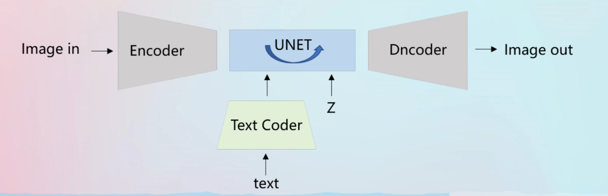
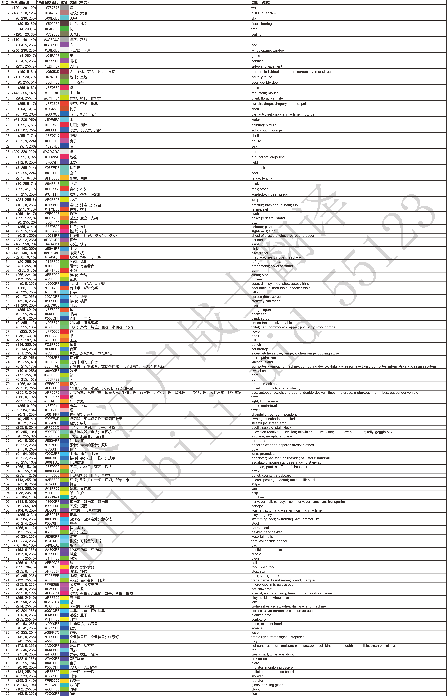
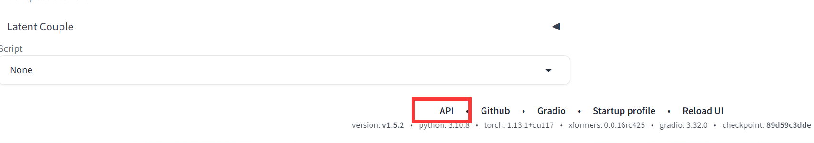
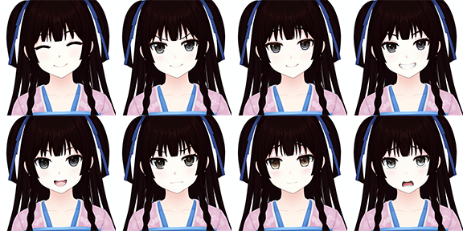
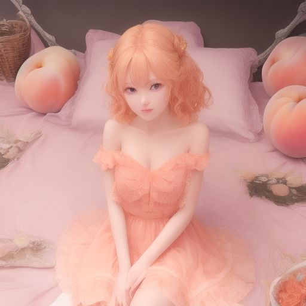
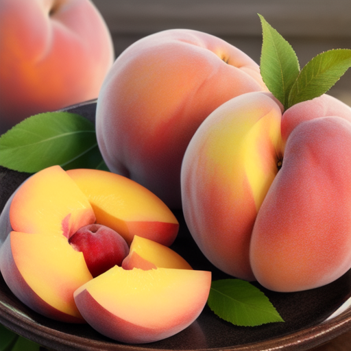

# 简史

参考资料：https://www.bilibili.com/video/BV12s4y1o7ys/?spm_id_from=333.999.0.0&vd_source=1fb8226c3ee5a8bb358e3fa9f18e29f0


# 环境安装

1. 安装**Python 3.10.6**
2. **下载stable-diffusion-webui**


# 基本原理

## 图像训练原理

stable diffusion是基于Diffusion Probabilistic Models（DPM）的改进版本。

1. 输入文本会通过clip模型进行Text Coder。

   clip模型是一种基于自然语言监督的视觉模型，它可以将文本信息和图像信息进行有效的对齐和匹配。clip模型在stable diffusion中主要用于文本编码器的部分，它可以将输入的文本信息转换成一个潜在向量，然后与图像的潜在向量进行比较和调整，使得生成的图像与文本内容相符。clip模型的优点是，它不需要预先训练一个大型的文本编码器，而是直接利用已经训练好的clip模型，可以处理复杂和抽象的文本输入，提高图像生成的质量和多样性。

2. 经过处理文本向量会和噪声图像一起输入到unet中

3. unet会进行去噪处理

   这其中会有若干步骤，这也是webui中需要指定步数的原因。

4. 去噪之后的数据，再通过VAE模型来解码

5. 输出图像

输入的图像会进入Encoder被噪声化。之后再unet中训练，之后在Dncoder解码




## 模型基本概念

模型分为很多种，包括大模型/底模型，VAE模型，微调模型等。

- 大模型（Foundation Model）：

- VAE模型

- 微调模型：

  包括Lora，Embedding，Hypernetwork，DreamBooth等待。

而DreamBooth可以和大模型合并，也可以视为大模型。

我们一般把checkpoint和大模型视为一体。

同样的，把Textual Iversion和Embedding模型视为一样的。


## 大模型 


目录：\models\Stable-diffusion


大模型是ai画图的最基本的模型，没有这个东西就画不了。


checkpoint是一种用于保存和管理大模型的技术。checkpoint的意思是检查点，它指的是在训练大模型的过程中，定期地保存模型的参数（权重），以便于在出现异常或中断的情况下，可以恢复训练或进行推理。checkpoint可以提高大模型训练的效率和稳定性，避免重复计算或丢失数据。大模型指的是那些具有很多层或很多参数的深度学习模型，例如BERT、GPT-3等。大模型通常需要很多计算资源和时间来训练，因此checkpoint技术对于大模型训练是非常有用的。

也就是说，本质上checkpoint就是某一个状态的大模型，可以直接视为大模型。


大模型的训练成本极其昂贵，例tStable Diffusion在亚马逊网络服务上使用256个Nvidia A100 GPU进行训练，总共花费了15万个GPU小时，成本为60万美元。因此微调模型就此诞生。

 **有时候大模型会自带VAE模型，所以并不是所有的大模型都需要VAE**

包括：Stable Diffusion v2.1 v2.0


SafeTensorl以.safetensors为后缀

Pickle' Tensor以.ckpt为后缀

这两个东西本质上是一样的，只是safetensor是受到加密保护的，我们无法用编程的形式直接读取参数，除非获得开发者提供的密钥。而Pickletensor是不受加密保护。

safetensor的加载速度更快，而且更加安全，没有恶意代码。

## VAE模型

目录：\models\VAE


Variational AutoEncoder，它是在神经网络训练过程当中会使用的编码和解码器

解码图像，如果加载了不正确的VAE模型，图像画面会显得灰蒙蒙。


## Embedding模型

目录：\embeddings


Textual Iversion代表了文本反演方法，可以理解为Embedding。


textcoder就像是一个词典，可以查找到文字对应的向量。而如果出现了新的文字，就可以使用Embedding算法来扩充词库。例如骡子就是马和驴的混合。Embedding算法，不会改变大模型的基本结构，只是进行微调。


## Hypernetwork模型

目录：\models\hypernetworks

Hypernetwork是作用于unet之上的。Hypernetwork会生成一个新的神经网络，被称为Hypernetwork。Hypernetwork的输出结果会变成unet的参数。因此非常轻量级，速度快。


## DreamBooth模型

Google在2022年8月提出。完整的保留你想要关键视觉特征。只需3-5张的图像和文本提示作为输入。

Dreambootm适合人物训练。改版的Dreambootm方法Native Train适合于风格

因为DreamBooth训练之后会和之前的大模型进行合并，所以和大模型的大小一样大。也可以看作是另一种大模型。

Dreambootm在训练的时候会改变原来模型的画风。

DreamBooth相比于Textual Inversion，优势在于它可以微调模型的所有参数，而不仅仅是词嵌入向量，从而使模型能够学习到更多的新概念和特征。


[DreamBooth在Stable Diffusion中的作用是，它可以通过微调模型的整个参数，让模型能够生成你想要的主题或风格的图像](https://stable-diffusion-art.com/dreambooth/)[1](https://stable-diffusion-art.com/dreambooth/)[2](https://huggingface.co/blog/dreambooth)[3](https://medium.com/mlearning-ai/how-to-run-dreambooth-locally-a-step-by-step-gyu-88c028ab01a4)[。它工作的具体内容是，它会在每次生成图像之前，根据你提供的规则化图片和文本输入，计算一个新的词嵌入向量，并将其与模型的原始词嵌入向量相加，然后将这个新的词嵌入向量作为模型的输入](https://github.com/JoePenna/Dreambooth-Stable-Diffusion)[4](https://github.com/JoePenna/Dreambooth-Stable-Diffusion)[5](https://github.com/XavierXiao/Dreambooth-Stable-Diffusion)[6](https://colab.research.google.com/github/ShivamShrirao/diffusers/blob/main/examples/dreambooth/DreamBooth_Stable_Diffusion.ipynb)。这样，模型就可以根据你提供的规则化图片和文本输入，生成更符合你期望的图像。DreamBooth相比于Textual Inversion，优势在于它可以微调模型的所有参数，而不仅仅是词嵌入向量，从而使模型能够学习到更多的新概念和特征。

## Lora模型

目录：\models\Lora

微软研究员开发。仅调整局部参数。模型小，即插即用


## ControlNet模型

ControlNet是一种神经网络结构，可以通过添加额外的条件来控制扩散模型。它可以复制神经网络块的权重到一个“锁定”的副本和一个“可训练”的副本。可训练的副本可以学习你的条件，从而生成更精确的“地图”供AI使用。

# 模型训练

## Textual inversion训练

1. 在Embedding中的名称填入需要增加的tag
2. token数量2-8之间即可，建议选7
3. 创建embedding
4. 图像预处理
5. 在训练中选择要训练的模型
6. 在数据集目录中填入数据集的地址
7. 最大迭代步数，图越多，这个调越大。十几张的话3000就行
8. 训练

## lora训练

1. 在C:\Windows\System32中，找到powershell，管理员模式下 输入`Set-ExecutionPolicy -ExecutionPolicy RemoteSigned`

2. 运行install-cn.ps1

3. 在webui中，打开训练的拓展，并打开图像预处理

4. 将需要训练的图片放入到一个文件夹中，并将其地址填入源目录。将输出的文件夹也设置。

5. 选择自动焦点裁剪，使用 deepbooru 生成说明文字(tags)。

6. 点击预处理

7. 调整输出的文件夹生成的tag

8. 在文件夹的根目录建立一个train文件夹，用来充当训练集的文件夹

9. 在train下，新建本次训练集，例如我要训练美少女万华镜中的莲华，所以起名叫mangekyo

10. 因为本次我只训练莲华一个人，因此在mangekyo文件夹下新建一个renge文件夹，里面把刚才裁剪的图片放进去。

11. 修改train.ps1文件的底模路径

    修改训练集的名字，其中训练集填写“./train/mangekyo/”

    分辨率填写剪裁图片的分辨率即可

    修改输出的模型名称和格式

12. 使用power shell进行训练


如果报错**无法将“.\venv\Scripts\activate”项识别为 cmdlet、函数、脚本文件或可运行程序的名称。**则使用

```
pip install altair==4.2.2 
```


方法:在准备数据时，将所有与人物生理特征和外观特征的词条全部去除，只保留画面特征( 即画面构成、角度、动作等)。如果自动识别没有识别到某些画面特征，最好手动整理输入


# webui原生功能详解

## 文生图

### 采样方法

**Sampling Method**采样方法，通过求解函数f(x)得到分布p(x)的期望值。Stable Diffusion提供了多种采样方法以适配众多特定的应用场景。没有绝对完美的采样方法，在使用时候可以多测试一下几种采样方法，只要输出结果合适就可以了。

- Euler a ：富有创造力，不同步数可以生产出不同的图片， 超过30~40步基本就没什么增益效果了
- Euler：最最常见基础的算法，最简单的，也是最快的
- DDIM：收敛快，一般20步就差不多了
- LMS：eular的延伸算法，相对更稳定一点，30步就比较稳定了
- PLMS：再改进一点LMS
- DPM2：DDIM的一种改进版，它的速度大约是 DDIM 的两倍

- DPM++ 3M SDE Exponential：**webui 1.6更新的采样方法，很适合绘制没有背景的图片**


DDIM和PLMS占用显存更多


DPM adaptive会自适应步数（输入步数没有用）

### 采样迭代步数

AI绘画的原理就是先随机生成一张噪声图片，然后一步一步向正负tag语义靠拢，迭代步数就是告诉AI，这样的步骤需要多少次，步骤越多，每一步移动越小也越精确。同时也成比例增加生成图像所需要的时间，大部分采样器超过50步后意义就不大了，一般设置为20，如果效果不佳再往上调，最多到50

一般在描述显卡性能时会说一秒多少步(it/s)，或者倒数，多少秒一步(s/it)，前者是越大约好，后者越小越好。


### **面部修复**

使用模型，对生成图片的人物面部（主要是三次元真人、二次元也有一定质量提高）进行修复，让人脸更像真人的人脸，具体设定在【设置】- 【面部修复】


1. CodeFormer 和 GFPGAN ，至于那个更好，这个不好说，这个和模型相关，基本没改过，后文没有特殊说明，都使用CodeFormer
2. CodeFormer权重参数：为0时效果最大，为1时效果最小，建议从0.5开始，左右尝试，找到自己喜欢的设置。


### 可平铺(Tiling)

生成可以往上下左右连续拼接的图像，比如你家地上的瓷砖，主要用来生成贴图，一般不勾选。


### 高分修复


文生图在高分辨率下（1024 x 1024）会生成非常怪异的图像。而此插件这使得AI先在较低的分辨率下部分渲染你的图片，再通过算法提高图片到高分辨率，然后在高分辨率下再添加细节。

- 放大算法：如果不知道选什么，一般无脑选ESRGAN_4x、
- 高清修复采样次数：类比采样迭代步数理解，0表示沿用原来的步数
- 重绘幅度：放大后修改细节的程度，从0到1，数值越大，AI创意就越多，也就越偏离原图。
- 放大倍率：放大倍数，在原有宽度和长度上放大几倍，注意这个拉高需要更高的显存

如果原图是512 x 1024，开了高分修复后则会变成1024 x 2048，可以看到上方有类似提示

```text
resize: from 512x1024 to 1024x2048
```


一般建议先生成小图，在小图中找到合适的图后在开高分修复生成大图，提高速度，开高分修复会明显感受到造图速度变慢。


### 生成批次和每批数量


一个批次中，生成几张图片，增大该值需要考虑显存是否满足，如果显存不足和增加批次即可，生成的总的数量=生成批次*每批数量，那么4批次，每批1张和1批次，每批4张同样最后都是四张最终有什么区别呢，我们下面对比试验下（注意每张的种子是不一样的，不会生成四张一模一样的，种子后续会说明，一般采用批次多张生成然后选图）


### 宽度与高度

单位是像素，适当增加尺寸，AI会试图填充更多的细节进来，非常小的尺寸（低于256X256），会让AI没地方发挥，会导致图像质量下降，非常高的尺寸（大于1024X1024），会让AI乱发挥，会导致图像质量下降，增加尺寸需要更大的显存。4GB显存最大应该是1280X1280（极限）

如果你确实想生成高分辨率图像，请使用高分修复。


### 提示词相关性

图像与tag的匹配程度，增加这个值将导致图像更接近你的提示，但过高会让图像色彩过于饱和，太高后在一定程度上降低了图像质量。可以适当增加采样步骤来抵消画质的劣化，一般在5~15之间为好，7，9，12是3个常见的设置值。


### 差异随机种子

- 差异强度：

  指的是从随机种子到差异随机种子之间的强度

- 宽高：

  一般来说随着分辨率不同，画面会有很大差异。因此这个宽高就是在采样前生成噪声图的大小。

  如果不希望画面有太大变化，保持不变即可。

  

在图生图中，如果要修复手脚的问题，可以把问题图的种子粘贴到两个种子中，并把差异强度调到0.1，这样每张图会把上一张图的种子+1


## 图生图

### 重绘幅度（Denosing strength）

重绘幅度很重要，值越大表示对原图重绘幅度越大，**一些放大类的插件或脚本，重绘幅度不能设置太大**，否则会生成非常奇怪的结果，比如一个人变成整张图都是人，这是放大器的工作原理有关系，后需来一篇专门讲如何放大发图片到2K、4K、8K

一般设置为0.75，这样图片会有较大的变化。

### 缩放模式（Resize mode）

缩放模式默认拉伸，缩放模式指的是当原图和要生成的图的宽和高不一致的时候，是需要按照什么方式缩放，一共包含四种模式

- 拉伸
- 裁剪
- 填充
- 拉伸（放大潜变量）

选中右上角的小笔可以自行调整输入的图片范围


### 绘图（Sketch）

绘图会把颜色信息带入，重绘幅度越低，颜色信息表现得越明显，另外绘图会将**输入图片的所有部分继续重绘**

比如给衣服换个颜色，注意如果正向tag中有和衣服颜色相关的可以先去掉，避免对结果产生影响

- 提示词相关性7
- 重绘幅度0.1,0.4,0.5,0.6,0.7,0.8,1.0


## 附加功能

- 主要用于批量对图片进行放大

- 在指定分辨率缩放的时候，如果选择了裁剪以适应宽高比，那么一张512\*512的图放大到512\*1024之后，就会自动裁剪为512\*1024，但是不勾选裁剪的话，会直接缩放为1024\*1024
- 可以在Upscaler 选择图片放大的算法，放大算法 2 (Upscaler 2) 可见度是指可以对两种放大算法进行融合，值越大越接近放大算法2
- 在使用LDSR放大算法的时候会报错，需要手动下载文件来调整


## xyz plot脚本

1-5表示1, 2, 3, 4, 5

1-5 (+2)表示从1到5，从1开始，步进为2, 不超过5，即1,3,5；同理10-5 (-3) = 10, 7 

0.0-1.0 [6]表示从0.0到1.0之间平均找6个数，即 0.0, 0.2, 0.4, 0.6, 0.8, 1.0


- 在坐标轴中开启Prompt S/R，可以对提示词中的字符串进行替换，例如我希望测试多个lora在同一组tag下的效果，就可以使用下面的格式

  ```
  //prompt
  1girl,<lora:NAME:1>
  ```

  在xyz plot中的X values里就可以填入`NAME,lora1,lora2,lora3`这样在运行时就会动态替换NAME处的字符串为lora1，lora2，lora3，然后出图。

  


# 插件详解

## 3d-open-pose-editor

## Deforum

生成视频

## Contronet（插件）

- Reference Only：可以仅通过一个图片来生成类似的画风等，不再需要训练lora。
- tile：


## Ultimate SD Upscale（插件）

这个插件可以非常对图片进行放大，对于低显存也可以使用。

https://github.com/Coyote-A/ultimate-upscale-for-automatic1111.git


## face editor

下载链接：https://github.com/ototadana/sd-face-editor


face editor可以解决绘制全身图以及小图时，脸部崩坏的问题。


https://github.com/ototadana/sd-face-editor.git


## rembg

下载链接：https://github.com/AUTOMATIC1111/stable-diffusion-webui-rembg

去除人物背景并保留alpha通道

## OpenPose 编辑器


数据集标签编辑器

可以批量编辑标签，在自己训练模型的时候非常好用


## Latent Couple extension (two shot diffusion port)

- 中文名：潜变量成对和可自组lora
- 作用：这两个插件可以让不同的区域使用不同的关键词


同时打开潜变量成对和可自组Lora。

在潜变量的Rectangular中，分割的语法如下：

```
1:1,1:2,1:2
```

这代表，绘制3张图，第一张的一行一列，第二行是一行两列，第三行是一行两列。


位置可以为上面绘制的图来圈定一个区域，只有在区域内的图才会被tag影响。

例如

```
0:0,0:0,0:1
```

上述语句代表将分割的三张图，第一个图的0行0列会被tag影响，而第一张图本身就是一行一列，因此可以用来全图，一般用来当作质量咒语的控制。第二个代表第0行的第0列，也就是左边的列。第三个是右侧的列。


权重用来控制所在区域的tag权重。

```
0.2,0.8,0.8
```

其中权重越小，画面越黑，如下图。


注意，这个迭代步数可以稍微大一点。整体的权重大一点。


## LoRA Block Weight

https://github.com/hako-mikan/sd-webui-LoRA-block-weight

可以对lora进行分层控制。

在输入lora分层的时候，格式如下：

\<lora:YingXue_AnimeMix:0.55:1,1,1,1,1,1,1,1,0,1,0,0,1,1,1,1,1>,

有两个冒号，第二个冒号后面才是13个层

[负面tag](F:\Download\百度云\AI绘画资料\课件和tag\通用负面tag.txt )


[lora分层](F:\Download\百度云\AI绘画资料\课件和tag\lora分层.xlsx )


| 编号                                         | 分类          | 权重                                    | 功能详情               | 插件分类                |                       |      |
| -------------------------------------------- | ------------- | --------------------------------------- | ---------------------- | ----------------------- | --------------------- | ---- |
| <span style="background-color:grey">1</span> | BASE(开关层)  | 固定为：1                               | 开关层（必须写1）      |                         |                       |      |
| <span style="background-color:grey">2</span> | IN（输入层）  | 0~1                                     | 服装细节（扣子等）     | INS     （服装）        | INALL                 |      |
| 3                                            |               |                                         |                        |                         |                       |      |
| 4                                            |               |                                         |                        |                         |                       |      |
| 5                                            |               | 背景                                    | IND     （服装，姿势） | MIDD     （服装，背景） |                       |      |
| 6                                            |               |                                         |                        |                         |                       |      |
| 7                                            |               | 躯干服装，动作                          |                        |                         |                       |      |
| 8                                            | MID（中间层） | 0~1                                     | 躯干动作               |                         |                       |      |
| 9                                            | OUT（输出层） | 0~1                                     | 面部，躯干动作，特征   | OUTD     （服装）       | OUTALL     （过拟合） |      |
| 10                                           |               |                                         |                        |                         |                       |      |
| 11                                           |               | 面部，躯干（服装）特征     佩戴的饰品等 |                        |                         |                       |      |
| 12                                           |               | 背景                                    |                        |                         |                       |      |
| 13                                           |               | OUTS     （上色风格）                   |                        |                         |                       |      |
| 14                                           |               |                                         |                        |                         |                       |      |
| 15                                           |               |                                         |                        |                         |                       |      |
| 16                                           |               | 上色风格                                |                        |                         |                       |      |
| 17                                           |               |                                         |                        |                         |                       |      |


# 语法

详见https://github.com/AUTOMATIC1111/stable-diffusion-webui/wiki/Features


## 基本权重
咒语书写越靠前，权重越大。因此在开始的咒语需要写质量的，然后是构图例如 one gitrl，最后再写细节。

## Attention/emphasis

权重可以嵌套，例如 {{bondage}}

| 符号        | 权重控制 | 说明                             |
| ----------- | -------- | -------------------------------- |
| (Beautiful) | 增加权重 | 每个括号权重是x1.1               |
| [Beautiful] | 减少权重 |  权重除以1.1                   |
| {Beautiful} | 增加权重 | 每个大括号权重是x1.05，普通的是1 |

如果想要一个咒语权重非常大，我们也可以直接指定其权重
(long hair:0.5)


## Prompt editing

[from:to:when]语法

例如[apple,banana,0.2]指的是，前20%步画apple，后80%步画banana


[to:when]语法

[apple:0.2]指的是在20%步之后开始画apple


[from::when]语法

[apple::0.2]指的是在20%步之后开始画apple，后面是80%不画


当when大于1的时候，代表步数

例如[apple,banana,20]，前20步画apple，后面的步数画banana


## Alternating Words


```
[cow|horse] in a field
```

这个语法第一步会绘制 cow in a field下一步会绘制horse in a field。这样轮番绘制


除此之外，语法长度可以增加

```
[cow|cow|horse|man|siberian tiger|ox|man] in a field
```

这个咒语会在第八步绘制cow in a field


## Composable Diffusion

组合多个tag可以使用AND

```
a cat AND a dog
```


AND还可以配置权重，例如：

```
a cat:0.4  AND a dog:0.9
```


# 正常咒语大全

## 质量咒语

### 正面

| 咒语                                      | 说明                |
| ----------------------------------------- | ------------------- |
| masterpiece                               | 大师作品            |
| best quality                              | 最好画质            |
| official art                              | 官方绘画            |
| best quality                              |                     |
| extremely detailed                        |                     |
| CG unity 8k wallpaper                     |                     |
| highres                                   | 高分辨率            |
| absurdres                                 | 超高分辨率          |
| incredibly_absurdres/incredibly absurdres | 极高分辨率          |
| huge_filesize                             | 超级高分辨率/大文件 |
| original/original character               | 原创                |
| extremely detailed wallpaper              |                     |
| game cg/gamecg/game asset                 | 游戏 CG             |
| anime screencap                           | 动画截图            |
| beautiful detailed eyes                   |                     |
| detailed light                            |                     |
| illustration                              | 插图                |
| ultra-detailed                            |                     |


### 负面


|                                                          |               |
| -------------------------------------------------------- | ------------- |
| lowres                                                   | 低分辨率      |
| worst quality                                            | 糟糕质量      |
| normal quality                                           | 一般质量      |
| low quality                                              | 低质量        |
| signature<br />artist signature<br/>autograph<br/>signed | 含签名        |
| jpeg artifacts<br />jpeg artefacts<br/>jpg artifacts     | JPEG 压缩失真 |
| text                                                     | 含文字        |
| error                                                    | 有错误        |
| bad anatomy                                              | 身体结构错误  |
| bad hands                                                | 手型错误      |
| fewer digits<br />missing fingers                        | 缺少手指      |
| extra digit                                              | 多余手指      |
| missing arms                                             | 缺少手臂      |
| parody                                                   | 拙劣的模仿    |
|                                                          |               |


## 艺术风格


| 咒语                                                         | 说明                         |
| ------------------------------------------------------------ | ---------------------------- |
| Studio Ghibli                                                | 宫崎骏绘画风格               |
| trending on artsation                                        | 艺术站趋势                   |
| trending on pixiv concept art                                | 概念艺术                     |
| chinese elaborate-style painting                             | 工笔国画                     |
| original                                                     | 原画                         |
| realism                                                      | 写实主义                     |
| landscape                                                    | 山水画                       |
| surrealism                                                   | 超现实主义                   |
| sketch                                                       | 素描                         |
| watercolor painting                                          | 水彩画                       |
| greyscale<br />black and white                               | 纯黑白色/黑白照片化/灰度     |
| wash painting                                                | 水墨画                       |
| ukiyoe<br />ukiyo-e                                          | 浮世绘                       |
| neo-realism                                                  | 新现实主义                   |
| subconsciousness                                             | 潜意识                       |
| Cyberpunk                                                    | 赛博朋克                     |
| Wasteland Punk                                               | 废土朋克                     |
| portrait                                                     | 写实                         |
| visual impact                                                | 视觉冲击                     |
| texture                                                      | 纹理/肌理，表示纹理的材质    |
| Genesis                                                      | 创世纪                       |
| post-impressionism                                           | 后印象主义                   |
| greg rutkowski caspar david friedrich thomas kirikade van Gogh |                              |
| illustration                                                 | 插画                         |
|                                                              |                              |
| oil painting                                                 | 油画                         |
| artbook                                                      | 原画                         |
| game_cg                                                      | 游戏CG                       |
| comic                                                        | 漫画                         |
| 4koma                                                        | 四格                         |
| animated_gif                                                 | gif格式图片                  |
| dakimakura                                                   | 抱枕                         |
| cosplay                                                      | 角色扮演                     |
| crossover                                                    | 穿越                         |
| pixel art                                                    | 像素                         |
| dot art                                                      | 点绘                         |
| watercolor pencil                                            | 可以生成彩铅画               |
| graphite (medium)<br />pencil sketch                         | 铅笔画/炭笔画                |
| photorealistic                                               | 很像照片的画                 |
| charcoal (medium)                                            | 炭笔                         |
| retro artstyle<br />oldschool                                | 赛璐璐风,复古艺术            |
| guro                                                         | 猎奇                         |
| realistic                                                    | 写实                         |
| photo                                                        | 照片                         |
| real                                                         | 真实                         |
| landscape/scenery                                            | 风景                         |
| cityscape                                                    | 城市风景                     |
| science_fiction                                              | 科技幻想                     |
| original                                                     | 原创                         |
|                                                              |                              |
| personification                                              | 拟人                         |
| checkered                                                    | 格子的                       |
| lineart/line art                                             | 线条艺术                     |
| wallpaper                                                    | 壁纸                         |
| pixel_art/pixel art                                          | 像素风                       |
| monochrome                                                   | 单色图片                     |
| colorful                                                     | 色彩斑斓的                   |
| optical_illusion                                             | 视觉错误                     |
| fine_art_parody                                              | 名画模仿                     |
| sketch<br /> rough sketch<br /> rough                        | 素描,草图                    |
| dakimakura (medium)<br />dakimakura                          | 抱枕                         |
| traditional_media                                            | 传统媒体（基本上是手绘稿）   |
| watercolor_(medium)                                          | 透明水彩绘                   |
| silhouette                                                   | 剪影                         |
| covr                                                         | 封面                         |
| album                                                        | 专辑                         |
| sample                                                       | 图上有sample字样             |
| back                                                         | 背影像                       |
| bust                                                         | 半身像                       |
| profile                                                      | 侧面绘                       |
| expressions                                                  | 表情绘（各种表情）           |
| everyone                                                     | 一部作品中的主要人物集齐     |
| column_lineup                                                | 一列列小图组成大图           |
| transparent_background                                       | 透明的背景(.png)             |
| simple_background                                            | 简单的背景(无背景)           |
| gradient_background                                          | 渐变的背景                   |
| zoom_layer                                                   | 背景是前景的放大版           |
| English                                                      | 英文                         |
| Chinese                                                      | 中文                         |
| French                                                       | 法文                         |
| Japanese                                                     | 日本人                       |
| translation_request                                          | 翻译                         |
| bad_id                                                       | ID转向错误(原地址或已被删除) |
| tagme                                                        | 图片有一些上传者未知的项目   |
| artist_request                                               | 作者未知,需要补完            |
| what                                                         | 不知所谓                     |


## 物体道具

### 食物

|                               |          |
| ----------------------------- | -------- |
| shaved ice                    | 刨冰     |
| lolipop                       | 棒棒糖： |
| burger/hamburger/cheeseburger | 汉堡包   |
| sushi                         | 寿司     |
| pizza                         | 披萨     |
| curry                         | 咖喱     |
| salt                          | 盐       |
| ketchup                       | 番茄酱   |
|                               |          |


### 饮料

|                  |          |
| ---------------- | -------- |
| sake             | 日本酒   |
| coffee           | 咖啡     |
| wine             | 葡萄酒   |
| soda can/pop can | 汽水罐   |
| lemonade         | 柠檬汽水 |
| coca-cola        | 可口可乐 |
|                  |          |
|                  |          |
|                  |          |


### 道具

|                        |      |
| ---------------------- | ---- |
| sword/swords           | 刀   |
| wand/magic wand        | 魔杖 |
| guitar                 | 吉他 |
| piano                  | 钢琴 |
| gun                    | 枪   |
| teacup/teacups/tea cup | 茶杯 |
| umbrella               | 伞   |
| wardrobe               | 衣柜 |
|                        |      |


## 环境背景

### 背景效果

|                                     |                    |
| ----------------------------------- | ------------------ |
| confetti                            | 紙吹雪，画面上飘纸 |
| explosion                           | 爆発               |
| simple background                   | 単色背景           |
| reflect<br/>もしくは<br/>reflection | 反射               |
|                                     |                    |
|                                     |                    |


### 打光

|                          |                |
| ------------------------ | -------------- |
| light                    | （明）         |
| dark                     | （暗）         |
| pale                     | （薄）         |
| deep                     | （濃）         |
| golden hour lighting     | （阳光照明）   |
| strong rim light         | （强边缘光照） |
| intense shadows          | （强烈的阴影） |
| ray tracing              | 光线追踪       |
| god rays                 | 自上而下的光   |
| bright                   | 明亮           |
| soft illumination        | 全局柔光灯     |
| soft lights              | 局部柔光       |
| rays of shimmering light | 闪光           |


### 时间

| 咒语             | 说明   |
| ---------------- | ------ |
| day              | 白天   |
| dusk             | 黄昏   |
| night            | 晚上   |
| spring/in spring | 春天   |
| summer/in summer | 夏天   |
| autumn/in autumn | 秋天   |
| winter/in winter | 冬天   |
| dark             | 暗的   |
| light            | 亮的   |
| valentine        | 情人节 |
| halloween        | 万圣节 |
| christmas        | 圣诞节 |
| wedding          | 婚礼   |
| new year         | 新年   |
|                  |        |
|                  |        |
|                  |        |
|                  |        |
|                  |        |

### 天气

|                              |      |
| ---------------------------- | ---- |
| rain/in the rain/rainy days  | 下雨 |
| cloudy                       | 多云 |
| snow                         | 下雪 |
| sunset                       | 日落 |
| shooting star/shooting stars | 流星 |
|                              |      |
|                              |      |
|                              |      |
|                              |      |
|                              |      |

### 室内


|                                                          |                                  |
| -------------------------------------------------------- | -------------------------------- |
| rooftop<br />roof                                        | 屋顶                             |
|                                                          |                                  |
| infirmary<br />nurse office<br/>nurse's office           | 医务室                           |
| shrine<br />jinja                                        | 神社                             |
| game room                                                | 游戏厅                           |
| indoor pool                                              |                                  |
| conference hall                                          | 会議場                           |
| sewer                                                    | 下水道                           |
| shopping mall                                            |                                  |
| prison                                                   |                                  |
| President's office                                       | 社長室                           |
| central control room                                     | 中央指令室                       |
| operating room<br/>operating table<br/>operating machine | 手術室<br/>手術台<br/>手術マシン |
| auction                                                  | 競売会場                         |
| Basement<br/>crypt<br/>cellar                            | 地下室                           |
| Japanese hotel                                           |                                  |
| spa                                                      | 人工的な温泉                     |
| bakery                                                   | パン屋                           |
| bookstore                                                | 本屋                             |
| cafe                                                     | カフェ                           |
| stage                                                    | 舞台                             |
| billiard                                                 |                                  |
| casino                                                   | 赌场，娱乐场                     |
| in the movie theatre                                     | 映画館                           |
| mixing_console                                           |                                  |
|                                                          |                                  |
| stained glass                                            | 彩色玻璃（教会那种）             |
| church                                                   | 教会                             |
| hot spring<br />onsen                                    | 温泉                             |
| classroom                                                | 教室                             |
| bedroom                                                  | 卧室                             |
| kitchen                                                  |                                  |
| bathroom                                                 |                                  |
| living room                                              | 客厅                             |
| toilet                                                   |                                  |
| bathtub                                                  |                                  |
| jail bars                                                | 鉄格子，监狱                     |
| remains                                                  | 遺跡                             |
| prison cell                                              | 牢房                             |
| library                                                  | 图书馆                           |
| gym<br />gymnasium                                       | 健身房                           |
| dungeon                                                  | 地牢                             |
| changing room                                            | 更衣室                           |
| otaku room<br />otakuroom                                | 御宅房                           |
| laboratory                                               | 实验室，研究所                   |
| greenhouse                                               | 植物園                           |
| mansion                                                  |                                  |
| courtroom                                                | 法庭                             |
| cafeteria                                                | 自助餐厅                         |
| hallway                                                  | 走廊                             |
| locker room                                              | 更衣室                           |
| train / train interior                                   | 电车内                           |
| couch / sofa                                             | 沙发                             |
| futon                                                    | 被褥                             |
|                                                          |                                  |
|                                                          |                                  |
|                                                          |                                  |


### 室外

|                                                              |                                              |
| ------------------------------------------------------------ | -------------------------------------------- |
| slums                                                        | 贫民窟                                       |
| Tower of Babel                                               |                                              |
| artifact                                                     | 人工物                                       |
| palace                                                       |                                              |
| Airport                                                      |                                              |
| energy plant                                                 |                                              |
| dam                                                          | 水坝                                         |
| rooftop                                                      |                                              |
| wharf                                                        | 码头；停泊处                                 |
| market stall                                                 | 货棚, 市场上的货摊                           |
| Paradise                                                     | 天堂；乐土；极乐；伊甸园                     |
| ferris wheel                                                 | 観覧車                                       |
| lantern floating                                             | 灯籠流し                                     |
| carousel                                                     |                                              |
| amusement park, hot air balloon                              | 遊園地+熱気球                                |
| Comiket                                                      |                                              |
| rubble ruins                                                 | 廃墟                                         |
| Skyscraper                                                   | 摩天楼                                       |
| stadium                                                      |                                              |
| rowboat                                                      |                                              |
| under_bridge                                                 | 橋の下                                       |
| harbor                                                       | 港                                           |
| alleyway                                                     | 裏路地                                       |
| car_seat, seatbelt                                           | 車の座席                                     |
| on the train                                                 | 電車内，crowded train を追加で客数を増やせる |
| crowd                                                        | 群衆                                         |
| on desk                                                      | 机の上                                       |
| game room                                                    | 游戏厅                                       |
|                                                              |                                              |
| sunset clouds                                                | 朝霞                                         |
| fireworks                                                    | 焰火                                         |
| flower field                                                 | 花田                                         |
| field                                                        | 田野                                         |
| amusement park                                               | 游乐园                                       |
| graveyard                                                    | 墓地                                         |
| trench                                                       | 战壕                                         |
| underwater                                                   | 水下                                         |
| explosion                                                    | 爆炸                                         |
| railing                                                      | 栏杆                                         |
| onsen                                                        | 温泉                                         |
| tatami                                                       | 榻榻米                                       |
| bathing                                                      | 浴室                                         |
| showering / shower                                           | 淋浴                                         |
| fountain                                                     | 喷泉                                         |
| bridge                                                       | 桥                                           |
| tunnel                                                       | 隧道                                         |
| village                                                      | 村庄                                         |
| highway                                                      | 高速公路                                     |
| jetty                                                        | 码头/栈桥                                    |
| paper lantern<br />chinese lantern                           | 灯笼                                         |
| railroad tracks<br />train tracks<br/>railway tracks<br/>railroad | 铁轨                                         |
| horizon<br />mountainous horizon                             | 地平线                                       |
| volcano                                                      | 火山                                         |
| night fair                                                   | 夜市                                         |
| dappled sunlight                                             | 斑驳的阳光                                   |
| bathtub                                                      | 浴缸                                         |
| power lines / utility pole/telephone pole                    | 电线杆                                       |
| lamppost / street light                                      | 路灯                                         |
| airfield                                                     | 飞机场                                       |
| in the street                                                | 在街上                                       |
| in the cyberpunk city                                        | 在赛博朋克城市里                             |
| at the lighthouse                                            | 在灯塔周围                                   |
| in misty onsen                                               | （温泉）                                     |
| zoo                                                          | 动物园                                       |
| by the moon                                                  | （月亮边上）                                 |
| in a bar, in bars                                            | 酒吧                                         |
| in a tavern                                                  | （居酒屋）                                   |
| Japanese arch                                                | 鳥居                                         |
| in a locker room                                             | （在上锁的房间里）                           |
| on a hill                                                    | （山上）                                     |
| the top of the hill                                          | 山顶                                         |
| on the beach                                                 | 海滩上                                       |
| seashore                                                     | 海滩                                         |
| over the sea                                                 | 海边上                                       |
| glacier                                                      | 冰川                                         |
| wasteland                                                    | 荒地                                         |
| wetland/  swamp / marsh/                                     | 湿地                                         |
| jungle                                                       | 丛林                                         |
| playground                                                   | 游乐场                                       |
| beautiful detailed sky                                       | 漂亮的天空                                   |
| skyline/city skyline                                         | 天际线                                       |
| in the palace                                                | 宫廷                                         |


## 构图


### 构图内容

| 咒语                                                         | 说明       |
| ------------------------------------------------------------ | ---------- |
| harem                                                        | 后宫       |
| multiple girls<br />boys                                     | 多人       |
| selfie                                                       | 自拍       |
| girl                                                         | 女孩       |
| 2girls                                                       | 2女孩      |
| 3girls                                                       | 3女孩      |
| boy                                                          | 男孩       |
| 2boys                                                        | 2男孩      |
| 3boys                                                        | 3男孩      |
| solo                                                         | 单人       |
| angel and devil                                              | 天使与恶魔 |
| twins                                                        | 双胞胎     |
| yuri<br />shoujo-ai<br />girl love<br />lesbian<br/>girl's love<br/>girls love | 百合       |
| yaoi<br />boy love<br/>shonen-ai<br/>shounen-ai<br/>boy's love<br/>boys love<br/>gay | 搞基       |
| sisters                                                      | 姐妹       |
| siblings                                                     | 兄弟姐妹   |


### 构图角度


|                                         |                                         |
| --------------------------------------- | --------------------------------------- |
| perspective from above                  | 从上（这个太有效果以至于看起来像是肉块？）                   |
| top view                                |                                         |
| overhead-angle                          |                                         |
| high angle                              |                                         |
| perspective from below                  | 从下（这个太有效果以至于看起来像是肉块？）                   |
| low angle shot                          |                                         |
| view straight on                        | 正面                                      |
| selfie                                  |                                         |
| side-view                               | 侧面                                      |
| from side                               |                                         |
| over the shoulder shot                  |                                         |
| aerial                                  | 俯瞰 全身                                   |
| full body                               |                                         |
| whole body                              |                                         |
| birds eye view                          |                                         |
| establishing shot                       |                                         |
| wide shot                               |                                         |
| macro shot                              | 微距摄像                                    |
| close up                                | 贴近                                      |
| portrait of girl                        | 女孩的半身照                                  |
| cowboy shot                             | 七分身镜头,从头到大腿附近 需要把cowboy放到第二个栏里，否则就会出现牛仔 |
|                                         |                                         |
|                                         |                                         |
| close-up                                | 特写镜头                                    |
| between legs                            | (强调)两腿之间                                |
| breast conscious                        | 对胸部在意                                   |
| breast awe                              | 着迷于乳房                                   |
| foot focus<br />pov feet<br/>feet focus | 足部焦点                                    |
| backlighting<br />backlit               | 逆光                                      |
| **silhouette**                          | 剪影                                      |
| depth of field                          | 背景虚化                                    |
| caustics**<br />`caustic lighting`      | 焦散，光线通过另一个物体反射或折射而投射到表面上的光图案。           |
| bust shot                               | （半身像）                                   |
| long shot                               | （远景）                                    |
| medium shot                             | 中景                                      |
|                                         |                                         |
| straight-on                             | 正脸                                      |
| sideways glance<br />side glance        | 轻轻向侧面瞥                                  |
| mid shot        （中景）                    |                                         |
| landscape      （横着拍）                    |                                         |
| portrait        （竖着拍）                   |                                         |
| first-person view                       | 第一人称视角                                  |
|                                         |                                         |


###  人物构图

|                  |          |
| ---------------- | -------- |
| extreme closeup  | 脸部特写 |
| close up         | 头像     |
| medium close up  | 证件照   |
| medium shot      | 半身     |
| cowboy shot      | 无腿     |
| medium full shot | 无脚     |
| full shot        | 全身     |
| portrait         | 半身像   |


## 人物表情


| 咒语                                                                      | 描述             |
| ----------------------------------------------------------------------- | -------------- |
| wide-eyed<br />eyes wide<br/>wide eyes<br/>shocked eyes                 | 睁开眼睛           |
| saliva trail<br />saliva string                                         | 唾液拉丝           |
| nervous                                                                 | 不安的            |
| light smile                                                             | 浅笑             |
| :d                                                                      | 咧嘴笑            |
| parted lips                                                             | 嘴唇微张           |
| yandere                                                                 | 病娇             |
|                                                                         |                |
|                                                                         |                |
| **v-shaped eyebrows**                                                   | 眉毛皱成V形(表高傲或愤怒) |
| **symbol-shaped pupils**                                                | 符号眼            |
| **saliva**<br />  `drool` <br />`spit`                                  | 唾液             |
| nose blush                                                              | 害羞             |
| **drooling**                                                            | 流口水            |
| forehead                                                                | 额头             |
|                                                                         |                |
| empty eyes<br />dead eyes                                               | 眼睛没有亮点         |
| jitome<br />flat gaze                                                   | 轻蔑的眼神          |
| laughing                                                                | 笑              |
| makeup                                                                  | 浓装             |
| food_on_face                                                            | 食物在脸上          |
| eyes_closed                                                             | 闭眼             |
| wink/blinking                                                           | 眨眼             |
| wince                                                                   | 闭一只眼           |
| slit_pupils                                                             | 竖的瞳孔/猫眼        |
| heterochromia                                                           | 异色瞳            |
| heart-shaped_pupils                                                     | 爱心形瞳孔          |
| eyelid_pull                                                             | 拉眼皮吐舌鬼脸        |
| aqua_eyes                                                               | 水汪汪的眼睛         |
| tsurime                                                                 | 吊眼角            |
| eyeball                                                                 | 盯着看            |
| tears                                                                   | 眼泪             |
| crying_with_eyes_open<br />crying with eyes open                        | 睁着眼落泪          |
| tearing up                                                              | 要哭的表情          |
|                                                                         |                |
|                                                                         |                |
| smelling                                                                | 闻              |
| nosebleed                                                               | 鼻血             |
| lips                                                                    | 嘴唇             |
| clenched_teeth                                                          | 咬牙             |
| open_mouth                                                              | 张口             |
| pout                                                                    | 努嘴,愠怒          |
| sigh                                                                    | 叹气             |
| smile                                                                   | 微笑             |
| grin                                                                    | 露齿而笑           |
| **upper teeth**                                                         | 露出上排牙齿         |
| **clenched teeth**<br />gritted teeth<br/>gritting teeth                | 咬牙             |
| glowing eyes                                                            | 发光的双眼          |
| stare                                                                   | 凝视             |
| angry<br />mad<br/>anger                                                | 生气的            |
| annoyed                                                                 | 生气的            |
| crazy                                                                   | 疯狂的            |
| shy                                                                     | 害羞的            |
| embarrassed                                                             | 尴尬的,害羞         |
| blush                                                                   | 脸红的            |
| sleepy                                                                  | 困乏的            |
| sad                                                                     | 悲伤的            |
| drunk                                                                   | 喝醉的            |
| dark_persona                                                            | 黑化的            |
| frown<br />:(<br/>frowning<br/>:{                                       | 皱眉/蹙额          |
| expressionless<br />emotionless<br/>neutral expression<br/>unexpressive | 无表情的，无口        |
| rolleyes                                                                | 眼球上翻           |
| ahegao/fucked_silly                                                     | 做爱时很痴的表情，阿黑颜   |
| naughty_face                                                            | 顽皮。下流的表情       |
| flying sweatdrops                                                       | 汗水四溅           |
| endured_face                                                            | 忍耐的表情          |
| torogao                                                                 | 淫荡的表情          |
| disappointed                                                            | 失望             |
| surprised<br />shocked<br/>shock<br/>surprise<br/>startled<br />:o      | 震惊             |
| frown / furrowed brow / wince                                           | 皱眉             |
| smirk                                                                   | 傲慢地笑，傻笑/得意的笑   |
| serious                                                                 | 认真             |
|                                                                         |                |
| shaded face                                                             | 脸上有大片阴影：       |
| mesugaki smile                                                          | 雌小鬼的嘲笑         |
| bored                                                                   | 无聊的            |
|                                                                         |                |
|                                                                         |                |
|                                                                         |                |


## 人物身体特征

### 体型


|            |                        |
| ---------- | ---------------------- |
| voluptuous | 耽迷肉欲的;艳丽的      |
| belly      | 腹が太くなる           |
| thicc      | 胸と尻から太ももを盛る |
|            |                        |
|            |                        |
|            |                        |
|            |                        |
|            |                        |


### 年龄

|               |      |
| ------------- | ---- |
| baby          |      |
| loli          |      |
| child         |      |
| minor         |      |
| young girl    |      |
| girl          |      |
| teenage       |      |
| teen age      |      |
| woman         |      |
| lady          |      |
| female        |      |
| adult         |      |
| middle age    |      |
| mature female |      |
| old lady      |      |
| old age       |      |


### 五官

|                     |     |
| ------------------- | --- |
| pointy ears / elves | 精灵耳 |
| mole under mouth    | 美人痣 |
| mole under eye      | 泪痣： |
| short eyebrows      | 短眉毛 |
| thick eyebrows      | 粗眉毛 |
| tareme              | 垂眼角 |
| tsurime             | 高眼角 |
|                     |     |


### 腿

| 咒语                                                         | 说明               |
| ------------------------------------------------------------ | ------------------ |
| thick thighs<br />big thighs<br/>fat thighs<br/>thunder thighs | 粗腿               |
| bare_legs                                                    | 裸腿               |
| kneepits                                                     | 膝窝               |
| knees                                                        | 膝盖               |
| slim_legs                                                    | 修长的腿           |
| long_legs                                                    | 长腿               |
| thighlet                                                     | 大腿               |
| thighs                                                       | 大腿               |
| thick_thighs                                                 | 肉腿               |
| mole_on_thigh                                                | 大腿上有痣         |
| thigh_gap                                                    | 大腿之间(绝对领域) |
| zettai_ryouiki                                               | 绝对领域           |
| wide_spread_legs                                             | 丰盈的大腿         |


### 脚

| barefoot    | 裸足       |
| ----------- | ---------- |
| feet        | 脚         |
| toe-point   | 趾尖\|脚尖 |
| toe_scrunch | 蜷着脚趾   |
| toes        | 脚趾       |


### 胸部

|                  |      |
| ---------------- | ---- |
| flat chest       | 平胸 |
| small breasts    |      |
| medium breasts   |      |
| breasts          |      |
| large breasts    |      |
| huge breasts     |      |
| gigantic breasts |      |


### 其他

|                       |          |
| --------------------- | -------- |
| **long neck**  长脖子 |          |
| plump **胖的**        |          |
| cat_ears              | 猫耳     |
| animal_ears           | 兽耳     |
| bat_ears              | 蝙蝠耳朵 |
| tongue                | 舌头     |
| fang                  | 虎牙     |
|                       |          |


## 人物头发

### 长度

| 咒语                                                         | 说明     |
| ------------------------------------------------------------ | -------- |
| very short hair                                              | 很短     |
| short hair                                                   | 短发     |
| medium hair                                                  | 中发     |
| long hair                                                    | 长发     |
| very long hair                                               | 很长     |
| absurdly long hair<br />absurdly_long_hair<br />hair past feet<br/>extremely long hair | 特别长   |
| hair over shoulder                                           | 头发过肩 |
| alternate hair length                                        | 有长有短 |
|                                                              |          |


### 刘海

|                    |            |
| ------------------ | ---------- |
| bangs              | 刘海       |
| blunt bangs        | 齐刘海     |
| parted bangs       | 分刘海     |
| swept bangs        | 侧扫刘海   |
| crossed bangs      | 交叉刘海   |
| asymmetrical bangs | 不对称刘海 |
| braided bangs      | 辫子刘海   |
| long bangs         | 长刘海     |
| bangs pinned back  | 往后夹     |
| diagonal bangs     | 斜刘海     |
| dyed bangs         | 染刘海     |


hair between eyes眼睛之间的头发

hair over one eye一只眼睛上的头发

hair over eyes头发遮住眼睛

hair behind ear耳朵后面的头发

hair between breasts乳房之间的毛发

hair over breasts乳房上的头发

hair censor刘海+长发？


### 颜色

|                      |            |
| -------------------- | ---------- |
| blonde hair          | 金色       |
| brown hair           | 棕色       |
| black hair           | 黑色       |
| blue hair            | 蓝色       |
| purple hair          | 紫色       |
| pink hair            | 粉红       |
| white hair           | 白色       |
| red hair             | 红色       |
| grey hair            | 灰色       |
| green hair           | 绿色       |
| silver hair          | 银色       |
| orange hair          | 橙色       |
| light brown hair     | 浅棕       |
| light purple hair    | 浅紫       |
| light blue hair      | 浅蓝       |
| platinum blonde hair | 铂金色     |
| gradient hair        | 渐变       |
| multicolored hair    | 多色       |
| shiny hair           | 闪亮       |
| two-tone hair        | 双色       |
| streaked hair        | 挑染       |
| dark blue hair       | 深蓝色头发 |
| aqua hair            | 水色       |
| colored inner hair   | 内层彩发   |
| alternate hair color | 交替发色   |
| hair up              | 头发起来   |
| hair down            | 头发下垂   |
| wet hair             | 湿头发     |
| **rainbow hair**     | 彩虹发     |
|                      |            |

### 正常发型


|                                                              |              |
| ------------------------------------------------------------ | ------------ |
| double bun  <br />twin bun<br/>buns<br/>twin buns<br/>hair buns<br/>double buns<br />double_bun | 双团子头     |
| straight hair                                                | 直发         |
| bob cut                                                      | 妹妹切       |
| hime_cut                                                     | 公主切       |
| hair bun                                                     | 包子头       |
| crown_braid                                                  | 法式冠编发   |
| spiked hair                                                  | 尖刺的头发   |
| short hair with long locks                                   | 短发长鬓角   |
| low-tied long hair                                           | 低扎长发     |
| asymmetrical hair                                            | 不对称的头发 |
| alternate hairstyle                                          | 交替发型     |
| big hair                                                     | 大头发       |
| hair strand                                                  | 发丝         |
| hair twirling                                                | 卷发         |
| pointy hair                                                  | 尖头头发     |
| hair slicked back                                            | 头发向后梳   |
| hair pulled back                                             | 头发向后拉   |
| split-color hair                                             | 分色头发     |
| crystal hair                                                 | 水晶状的头发 |
| hair wings                                                   | 翼状头发     |
| disheveled hair                                              | 蓬发         |
| wavy hair                                                    | 波浪头       |
| curly_hair                                                   | 卷发         |
| hair in takes                                                | 收拢         |
| forehead                                                     | 露额头       |
| drill hair                                                   | 公主卷       |
| ahoge                                                        | 呆毛         |
| antenna hair<br />antenna_hair                               | 多根呆毛     |
| heart_ahoge                                                  | 心形呆毛     |


### 辫子发型

| 发型                          | 说明            |
| --------------------------- | ------------- |
| braid                       | 辫子            |
| twin braids                 | 双辫子           |
| tri braids                  | 三股辫           |
| quad braids                 | 四股辫           |
| single braid                | 单辫            |
| side braid<br />side braids | 侧辫子,披在两侧的两条辫子 |
| long braid                  | 长辫子           |
| french braid                | 法式辫子          |
| crown braid                 | 皇冠编织          |
| braided bun                 | 编织发髻          |
| ponytail                    | 马尾辫           |
| braided ponytail            | 编马尾           |
| front ponytail              | 前马尾           |
| high ponytail               | 高马尾           |
| twintails                   | 双马尾           |
| short_ponytail              | 短马尾           |
| twin_braids                 | 双辫子           |
| Side ponytail               | 侧马尾辫          |
| bob cut                     | 妹妹切           |


### 发饰/发带

|                                |      |
| ------------------------------ | ---- |
| hair ornament                  | 发饰   |
| hair bow                       | 蝴蝶结  |
| hair ribbon                    | 发带   |
| hairband                       | 发带   |
| hair flower                    | 头花   |
| hair bun                       | 发髻   |
| hair bobbles                   | 毛球   |
| hairclip                       | 发夹   |
| single hair bun                | 单发髻  |
| x hair ornamentx               | 发饰   |
| black hairband                 | 黑色发带 |
| hair scrunchie                 | 发箍   |
| hair rings                     | 发圈   |
| tied hair                      | 扎头发  |
| hairpin                        | 发夹   |
| white hairband白色发带             |      |
| frog hair ornament青蛙发饰         |      |
| food-themed hair ornament食物发饰  |      |
| tentacle hair触手头发              |      |
| star hair ornament星星发饰         |      |
| hair bell发铃                    |      |
| heart hair ornament心形发饰        |      |
| red hairband红色发带               |      |
| butterfly hair ornament蝴蝶发饰    |      |
| hair stick发棒                   |      |
| snake hair ornament蛇发饰         |      |
| lolita hairband洛丽塔发带           |      |
| crescent hair ornament新月发饰     |      |
| cone hair bun锥形发髻              |      |
| feather hair ornament羽毛头饰      |      |
| blue hairband蓝色发带              |      |
| anchor hair ornament锚发饰        |      |
| leaf hair ornament叶发饰          |      |
| bunny hair ornament兔子头饰        |      |
| skull hair ornament骷髅头饰        |      |
| yellow hairband黄色发带            |      |
| pink hairband粉色发带              |      |
| bow hairband蝴蝶结发带              |      |
| cat hair ornament猫头饰           |      |
| musical note hair ornament音符发饰 |      |
| carrot hair ornament胡萝卜发饰      |      |
| purple hairband紫色发带            |      |
| hair tucking头发掖                |      |
| hair beads发珠                   |      |
| multiple hair bows多个蝴蝶结        |      |
| hairpods发夹                     |      |
| bat hair ornament蝙蝠发饰          |      |
| bone hair ornament骨发饰          |      |
| orange hairband橙色发带            |      |
| multi-tied hair多扎头发            |      |
| snowflake hair ornament雪花发饰    |      |
|                                |      |
|                                |      |


## 人物眼睛

### 状态

|                           |                  |
| ------------------------- | ---------------- |
| closed eyes               | 闭上眼睛         |
| half-closed eyes          | 半闭眼           |
| crying with eyes open     | 睁着眼睛哭       |
| narrowed eyes             | 眯起眼睛         |
| hidden eyes               | 隐藏的眼睛       |
| heart-shaped eyes         | 心形眼睛         |
| button eyes               | 纽扣眼           |
| cephalopod eyes           | 头足类眼睛       |
| eyes visible through hair | 透过头发看见眼睛 |
| glowing eyes              | 发光的眼睛       |
| empty eyes                | 空洞的眼睛       |
| rolling eyes              | 翻白眼           |
| blank eyes                | 空白的眼睛       |
| no eyes                   | 没有眼睛         |
| sparkling eyes            | 闪闪发光的眼睛   |
| extra eyes                | 额外的眼睛       |
| crazy eyes                | 疯狂的眼睛       |
| solid circle eyes         | 实心圆眼         |
| solid oval eyes           | 实心椭圆形眼睛   |
| uneven eyes               | 不均匀的眼睛     |
| blood from eyes           | 眼睛里的血       |
| eyelashes<br />eye lashes | 睫毛             |


### 其他

|                  |          |
| ---------------- | -------- |
| eyeshadow        | 眼影     |
| red eyeshadow    | 红色眼影 |
| blue eyeshadow   | 蓝色眼影 |
| purple eyeshadow | 紫色眼影 |
| pink eyeshadow   | 粉色眼影 |
| green eyeshadow  | 绿色眼影 |
| bags under eyes  | 眼袋     |
| ringed eyes      | 眼圈     |
| covered eyes     | 蒙住眼睛 |
| covering eyes    | 遮住眼睛 |
| shading eyes     | 遮住眼睛 |


### 眼睛颜色

|                   |        |
| ----------------- | ------ |
| blue eyes         | 蓝色   |
| red eyes          | 红色   |
| brown eyes        | 棕色   |
| green eyes        | 绿色   |
| purple eyes       | 紫色   |
| yellow eyes       | 黄色   |
| pink eyes         | 粉红   |
| black eyes        | 黑色   |
| aqua eyes         | 水蓝色 |
| orange eyes       | 橙色   |
| grey eyes         | 灰色   |
| multicolored eyes | 五彩   |
| white eyes        | 白色   |
| gradient eyes     | 渐变   |


------


## 人物类型


|                            |            |
| -------------------------- | ---------- |
| multiple girls             | 多个       |
| little girl                | 小女孩     |
| little boy                 | 小男孩     |
| shota                      | 正太       |
| loli                       | 萝莉       |
| oppai loli                 | 巨乳萝莉   |
| kawaii                     | 可爱       |
| mesugaki                   | 雌小鬼     |
| adorable girl              | 可爱的女孩 |
|                            |            |
| gyaru辣妹                  |            |
| sisters姐妹                |            |
| ojousama大小姐             |            |
| mature female成熟女性      |            |
| mature成熟                 |            |
| female pervert             | 痴女       |
| milf                       | 熟女       |
| harem                      | 后宫       |
| male                       | 男人       |
| minigirl                   | 迷你女孩   |
| monster                    | 怪物       |
| multiple_girls             | 魔幻少女   |
| no_humans非人              |            |
| shota正太                  |            |
| stewardess空姐             |            |
| yaoi搞基                   |            |
| yukkuri_shiteitte_ne油库里 |            |
|                            |            |
| adolescent                 | 青春期的   |
|                            |            |
|                            |            |


### 性格个性

|                                                       |               |
| ----------------------------------------------------- | ------------- |
| gyaru                                                 | 御姐/JK/辣妹? |
| tsundere                                              | 傲娇：        |
| kogal                                                 | 小辣妹        |
| ganguro                                               | 日本黑妹      |
| 年龄                                                  |               |
| 30，40以上的年龄可以直接用英语指定                    |               |
| loli（罗丽）                                          |               |
| girl（女孩）                                          |               |
| boy（男孩）                                           |               |
| young（小孩）                                         |               |
| teen（青少年）                                        |               |
| lady（女士）                                          |               |
| old（老人）                                           |               |
| mature（成熟）                                        |               |
| kawaii（可爱）                                        |               |
| ojousama（大小姐）                                    |               |
| mesugaki（雌小鬼）                                    |               |
| adorable girl, adorable face （可爱的女孩，可爱的脸） |               |
|                                                       |               |
|                                                       |               |
|                                                       |               |
|                                                       |               |


### 职业

| 角色                                              | 咒语       |
| ----------------------------------------------- | -------- |
| sailor senshi                                   | 美少女战士    |
| princess                                        | 公主       |
| kitsune                                         | 妖狐       |
| cow girl/cowgirl                                | 牛娘       |
| imp                                             | 小恶魔      |
| doctor                                          | 医生       |
| policewoman/police-woman/police woman           | 女警       |
| goddess                                         | 女神       |
| mother and daughter                             | 母女       |
| pirate                                          | 海盗       |
| succubus/demon girl/demon girls/demongirl       | 魅魔       |
| witch/witch costume/sorceress                   | 女巫       |
| waitress                                        | 女服务员     |
| vampire/vampyr                                  | 吸血鬼      |
| student                                         | 学生       |
| trap                                            | 伪娘       |
| nurse / nurse cap                               | 护士       |
| nun                                             | 修女       |
| ninja                                           | 忍者       |
| miko<br />shrine maiden                         | 巫女       |
| maid                                            | 女仆       |
| idol                                            | 偶像       |
| mermaid                                         | 美人鱼      |
| magical_girl                                    | 魔法少女     |
| loli                                            | 萝莉       |
| angel                                           | 天使       |
| cheerleader                                     | 啦啦队      |
| chibi                                           | Q版人物     |
| crossdressing/crossdress/crossplay/transvestite | 伪娘       |
| devil                                           | 魔鬼       |
| doll                                            | 人偶       |
| police                                          | 警察       |
| elf                                             | 妖精       |
| fairy/pixie/fairies/faerie                      | 小精灵      |
| female                                          | 女人       |
| furry                                           | 兽人       |
| orc                                             | 半兽人      |
| giantess                                        | 女巨人      |
| bishoujo                                        | 美少女      |
| kemonomimi_mode                                 | 兽耳萝莉模式   |
| child/kids/children                             | 儿童       |
| ghost/ghosts                                    | 幽灵       |
| gothic lolita/gothloli                          | 哥特萝莉     |
| wolf girl                                       | 狼女孩      |
| dancer                                          | 舞者       |
| wa maid/japanese maid                           | **和风女仆** |
| ballerina                                       | 芭蕾舞女演员   |
| wa lolita                                       | 和风萝莉     |


## 人物服饰


暴露的衣服：revealing clothes

不暴露的衣服：unexposed

勒痕：skindentation

紧身衣：skin tight

宽松：baggy clothes / baggy pants

透视：see-through silhouette/see-through

有毛皮装饰的什么什么：fur trimmed XX

带蕾丝的什么什么：lace trim XX

开肩式上衣：detached sleeves

吊带内裤：side tie bikini bottom(泳装) / side tie panties(内裤)

破碎的衣服：torn clothes

童贞杀手：cleavage cutout

袴：hakama


无肩带礼服：bridal gauntlets

露肩连衣裙：off shoulder dress

带字的衣服：clothes writing

时尚洛丽塔：lolita fashion

哥特式洛丽塔：gothic lolita


 

白色连衣裙：sundress

双排扣：double breasted

细腰裙：pinafore dress

棒球衫：raglan sleeves

叠层裙：layered dress

无袖高领毛衣：sleeveless turtleneck

运动服：track suits / track pants

身体束带：harness / chest harness

裙装睡衣，娃娃裙：nightgown / negligee / chemise / babydoll

阿兰毛衣：aran sweater

多肩带比基尼：multi strapped bikini（可能过多）

僵尸：jiangshi

摔跤服：wrestling outfit

丧尸：zombie pose

军服：military jacket

校服：gakuran

兔女郎：playboy bunny / bunny suits

耳罩：earmuffs

眼罩：blindfold

眼带：eyepatch

半框眼镜：semi rimless eyewear

眼镜戴在头上：eyewear on head

圆形眼镜：round eyewear

丝带：ribbon / bow

环形耳环：hoop earrings

动物头套：animal hood

项圈/黑项圈/红项圈/皮带项圈：leash / blak collar / red collar / belt collar

围巾：scarf / hair in scarf

领结：traditional bowtie

透视袖：see-through sleeves

腰带：belt / buckle / belt buckle

服务员围裙：waist apron

胸牌：breastplate

运动内衣：sports bra

（衬衫）扣子间隙：unbuttoned / button gap

袖口：cuffs

萌袖：sleeves past wrists

臂章：armlet

肩章：epaulettes

袖子卷起：sleeves rolled up

爪式手套：爪式手套

无指手套：fingerless glove / partially fingerless glove

串珠手镯：bead bracelet

毛衣卷在腰间：sweater around waist

背带短裤：suspender shorts

运动短裤：dolphin shorts / gym shorts

喇叭裤：bloomers

高腰裙：high waist skirt

紧身裙：pencil skirt / skirt suit


挂颈式吊带：halterneck

吊带袜：garter straps

赤脚：barefoot（如果只穿袜子no shoes）

牛仔裤：jeans / denim

打底裤：bike shorts / bike shorts under skirt

网袜：fishnets

裆部前面的布：pelvic curtain / loincloth

系带靴：cross laced footwear / lace up boots

不对称袜子：asymmetrical legwear

宽松的袜子：loose socks

拉链：zipper/unzipped

条纹的XX：striped XX


### 眼镜与面罩


|                      |                |
| -------------------- | -------------- |
| with glasses         | 眼镜           |
| semi-rimless eyewear | 半无框的眼镜   |
| glasses              | 眼镜           |
| sunglasses           | 太阳镜         |
| goggles              | 风镜           |
| blindfold            | 眼罩           |
| eyepatch             | 眼罩(独眼)     |
| mask                 | 面具/眼罩/口罩 |
|                      |                |
|                      |                |
|                      |                |
|                      |                |
|                      |                |


### 帽子与头饰

|                              |                   |
| ---------------------------- | ----------------- |
| mini hat                     | 迷你帽            |
| peaked cap                   | 官帽              |
| military hat / cap           | 军帽              |
| 遮阳帽：visor cap            |                   |
| 水手帽：sailor hat           |                   |
| 草帽：straw hat              |                   |
| 针织帽：beanie / knitted hat |                   |
| 前进帽：cabbie hat           |                   |
| 礼帽：top hat                |                   |
| halo                         | 头顶光环          |
| tokin_hat                    | 东金帽子          |
| mini_top_hat                 | 迷你礼帽          |
| beret                        | 贝雷帽            |
| hood                         | 兜帽              |
| nurse_cap                    | 护士帽            |
| tiara                        | 三重冕            |
| crown                        | 皇冠              |
| hairband                     | 发卡              |
| hairclip                     | 发夹              |
| hair_ribbon                  | 发带              |
| hair_flower                  | 发花              |
| hair_ornament                | 头饰              |
| bowtie                       | 蝴蝶结            |
| hair_bow                     | 蝴蝶结发饰        |
| maid_headdress               | 女仆头饰          |
| bow                          | 服装饰品/头部饰品 |
| lace                         | 花边              |
| ribbon                       | 丝带              |
| bandage                      | 绷带              |
|                              |                   |
|                              |                   |
|                              |                   |
|                              |                   |
|                              |                   |
|                              |                   |
|                              |                   |
|                              |                   |
|                              |                   |
|                              |                   |
|                              |                   |
|                              |                   |
|                              |                   |
|                              |                   |
|                              |                   |
|                              |                   |
|                              |                   |
|                              |                   |
|                              |                   |


### 内衣

|                              |                    |
| ---------------------------- | ------------------ |
| underwear                    | 内衣               |
| no bra                       | 没胸罩             |
| bra                          | 胸罩               |
| victorian<br />frilled bra   | 褶边文胸           |
| transparent underwear        | 透明内衣           |
| sexy lingerie                | 情趣内衣           |
| underwear                    | 内衣               |
| micro bikini / string bikini | 微型比基尼         |
| bikini                       | 比基尼             |
| side-tie_bikini              | 系带式比基尼       |
| bandeau                      | 无肩带比基尼       |
| front tie top                | 前系带比基尼       |
| santa bikini                 | 圣诞比基尼         |
| one-piece swimsuit           | 连体泳装           |
| competition swimsuit         | 比赛泳衣，竞赛泳装 |
| sarashi缠胸布                |                    |
| bustier胸衣                  |                    |
| chemise吊带胸衣              |                    |
|                              |                    |


### 内裤


|                                |                  |
| ------------------------------ | ---------------- |
| no_panties                     | 没内裤           |
| lowleg_panties/low_leg_panties | 低腰式内裤       |
| side-tie_panties               | 侧系带内裤       |
| string_panties                 | 高腰内裤         |
| thong<br />`thong panties`     | 丁字裤           |
| fundoshi                       | 日式丁字裤       |
| lingerie                       | 女用贴身内衣裤   |
| striped_panties                | 条纹内裤         |
| strawberry panties             | 草莓内裤         |
| panties                        | 内裤（前加颜色） |
|                                |                  |
| bow panties<br />panty bow     | 带蝴蝶结的内裤   |
| lace-trimmed panties           | 蕾丝边内裤       |
|                                |                  |
|                                |                  |
|                                |                  |


### 鞋子

| 咒语                 | 说明       |
| -------------------- | ---------- |
| shoes                | 鞋子       |
| boots                | 靴子       |
| loafers              | 乐福鞋     |
| high heels           | 高跟鞋     |
| cross-laced_footwear | 系带靴     |
| mary_janes           | 玛丽珍鞋   |
| uwabaki              | 女式学生鞋 |
| slippers             | 拖鞋       |
| knee_boots           | 马靴       |
|                      |            |
|                      |            |
|                      |            |


### 上半身

| 咒语                                                         | 描述           |
| ------------------------------------------------------------ | -------------- |
| undersized clothes                                           | 小号衣服       |
| sleepwear                                                    | 睡衣           |
| tailcoat                                                     | 燕尾服         |
| summer uniform                                               | 夏服           |
| tennis uniform                                               | 网球服         |
| employee uniform                                             | 店员制服       |
| race queen                                                   | 赛车女郎       |
| naked towel                                                  | 棵体毛巾       |
| naked apron                                                  | 稞体围裙       |
| naked coat                                                   | 裸体大衣       |
| strapless                                                    | 无肩带         |
| skindentation                                                | 绝对领域勒肉版 |
| wedding dress                                                | 婚纱           |
| black jacket                                                 | 黑色夹克       |
| labcoat                                                      | 白大褂         |
| kimono                                                       | 和服           |
| towel                                                        | 毛巾           |
| robe                                                         | 长袍           |
| 纹章战袍：tabard                                             |                |
| 盔甲上穿的衣服：surcoat                                      |                |
| 睡衣：pajamas                                                |                |
| 露背装：backless outfit                                      |                |
| japanese clothes<br />wafuku<br/>traditional japanese clothes | 和服           |
| scarf                                                        | 围巾           |
| necktie/tie                                                  | 领带           |
| armband                                                      | 臂章           |
| armlet                                                       | 臂环           |
| wristband                                                    | 腕带           |
| chains                                                       | 锁链           |
| wrist_cuffs                                                  | 腕饰           |
| gloves                                                       | 手套           |
| elbow_gloves                                                 | 长袖手套       |
| fingerless_gloves                                            | 露指手套       |
| cuffs/shackles                                               | 手链/手铐      |
| handcuffs                                                    | 手铐           |
| bracelet                                                     | 手镯           |
| cane                                                         | 手杖           |
| torn_clothes                                                 | 破烂衣服       |
| see-through                                                  | 透明装         |
| santa                                                        | 圣诞装         |
| detached_sleeves                                             | 袖肩分离装     |
| long_sleeves                                                 | 长袖           |
| tank_top                                                     | 女用背心       |
| cape                                                         | 披肩/斗篷/披风 |
| robe                                                         | 长袍           |
| wedding_dress                                                | 婚纱           |
| bodysuit                                                     | 紧身衣         |
| bodystocking                                                 | 连紧衣         |
|                                                              |                |
| lingerie                                                     | 女用贴身内衣裤 |
| camisole                                                     | 吊带背心       |
| midriff                                                      | 露腰上衣       |
| pajamas                                                      | 睡衣           |
| babydoll                                                     | 透明睡衣       |
| hoodie                                                       | 卫衣           |
| japanese_clothes                                             | 和服           |
| yukata                                                       | 日式浴衣       |
| koshihimo                                                    | 浴衣的腰带     |
| chinese_clothes                                              | 唐装           |
| chinadress                                                   | 旗袍           |
|                                                              |                |
|                                                              |                |
| serafuku                                                     | 水手服         |
| swimsuit                                                     | 泳装           |
| formal                                                       | 晚礼服         |
| uniform                                                      | 制服           |
| suit                                                         | 西装           |
| business_suit                                                | 职场制服       |
| school_uniform                                               | 学校制服       |
| school_swimsuit                                              | 学校泳衣       |
| gym_uniform<br />gym uniform                                 | 运动服,体操服  |
| sarashi                                                      | 缠胸布         |
| bustier                                                      | 胸衣           |
| chemise                                                      | 吊带胸衣       |
| bra                                                          | 胸罩           |
| latex                                                        | 乳贴，胶衣     |
| bandaid                                                      | 创可贴         |
| corset                                                       | 紧身褡         |
| apron                                                        | 围裙           |
| belt                                                         | 腰带           |
| obi                                                          | 衣带(和服用)   |
| skirt                                                        | 裙子           |
| dress                                                        | 连衣裙         |
| pleated_skirt                                                | 百褶裙         |
| miniskirt                                                    | 迷你裙         |
| summer_dress                                                 | 夏日长裙       |
| bloomers                                                     | 灯笼裤         |
| shorts                                                       | 短裤           |
| bike_shorts                                                  | 自行车短裤     |
| panties                                                      | 内裤           |
| no_panties                                                   | 没内裤         |
| trefoil                                                      | 三角裤给你看   |
| white_panties                                                | 白色内裤       |
| pink_panties                                                 | 粉红内裤       |
| striped_panties                                              | 条纹内裤       |
| lowleg_panties/low_leg_panties                               | 低腰式内裤     |
| side-tie_panties/himopan                                     | 系带式内裤     |
|                                                              |                |
|                                                              |                |
| condom                                                       | 套套           |
| butt_plug                                                    | 添加的尾巴     |
| diaper                                                       | 尿布           |
|                                                              |                |
|                                                              |                |
|                                                              |                |
|                                                              |                |
|                                                              |                |
|                                                              |                |
|                                                              |                |
|                                                              |                |
|                                                              |                |
|                                                              |                |
|                                                              |                |
|                                                              |                |
|                                                              |                |
|                                                              |                |
|                                                              |                |
|                                                              |                |
|                                                              |                |
|                                                              |                |
|                                                              |                |
| torn_thighhighs                                              | 损坏了的过膝袜 |
| tabi                                                         | 日式厚底短袜   |
| leg_garter                                                   | 腿部花边环     |
| ankle_lace-up                                                | 腿部系带       |
| cross-laced_footwear                                         | 系带靴         |
| high_heels                                                   | 高跟鞋         |
| mary_janes                                                   | 玛丽珍鞋       |
| uwabaki                                                      | 女式学生鞋     |
| slippers                                                     | 拖鞋           |
| boots                                                        | 靴子           |
| knee_boots                                                   | 马靴           |
|                                                              |                |


### 下半身

|                                       |          |
| ------------------------------------- | -------- |
| skirt                                 | 裙子     |
| pleated skirt                         | 百褶裙   |
| barefoot                              | 赤脚     |
| miniskirt                             | 迷你裙   |
| apron                                 |          |
| **fox tail**                          | 围裙     |
| **bare legs**                         | 光腿     |
| **skirt suit**<br />skirtsuit         | 正装短裙 |
| **mechanical legs**<br />robotic legs | 机械腿   |
|                                       |          |
|                                       |          |

### 套装

|                        |            |
| ---------------------- | ---------- |
| **leotard**            | 體操服     |
| **one-piece swimsuit** | 一体式泳衣 |
|                        |            |


### 手套

|                  |            |
| ---------------- | ---------- |
| bridal gauntlets | 婚纱手套： |
|                  |            |
|                  |            |
|                  |            |


### 人物袜子


|                                          |                      |
| ---------------------------------------- | -------------------- |
| garter_straps                            | 袜带                 |
| garters                                  | 吊带袜               |
| garter_belt                              | 连腰吊带袜           |
| socks                                    | 短袜                 |
| striped_socks                            | 横条袜               |
| loose_socks                              | 泡泡袜               |
| legwear                                  | 裹腿                 |
| leggings                                 | 裤袜                 |
| fishnets                                 | 网袜                 |
| kneehighs                                | 长袜                 |
|                                          |                      |
| stockings                                | 丝袜                 |
| bodystocking                             | 连体黑丝（原神那种） |
|                                          |                      |
| pantyhose                                | 连裤袜               |
| fishnet_pantyhose<br />fishnet_stockings | 渔网袜               |
|                                          |                      |
| black garter belt                        | 黑色吊袜带           |
| neck garter                              | 吊袜带               |
| white garter straps                      | 白色吊袜带           |
| black garter straps                      | 黑色吊袜带           |
| ankle garter                             | 脚踝吊袜带           |
|                                          |                      |
| thighhighs                               | 过膝袜               |
| striped_thighhighs                       | 条纹过膝袜           |
| white_thighhighs                         | 白色过膝袜           |
| black_thighhighs                         | 黑色过膝袜           |
| pink_thighhighs                          | 粉色过膝袜           |


### 腿饰&组合


|                                                  |                |
| ------------------------------------------------ | -------------- |
| thighhighs over pantyhose                        | 连裤袜加长筒袜 |
|                                                  |                |
| socks over thighhighs                            | 长筒袜加短袜   |
| panties over pantyhose                           | 连裤袜上的内裤 |
| pantyhose under swimsuit                         | 泳衣下连裤袜   |
| leg lock                                         | 腿锁           |
|                                                  |                |
|                                                  |                |
|                                                  |                |
| panties under pantyhose连裤袜下的内裤            |                |
| bandaged leg包扎腿                               |                |
| bandaid on leg腿上的绷带                         |                |
| mechanical legs                                  |                |
| leg belt腿带                                     |                |
| leg tattoo腿部纹身                               |                |
| bound legs绑腿                                   |                |
| panty & stocking with garterbelt吊袜带内裤和长袜 |                |
|                                                  |                |
|                                                  |                |


### 装饰


|                                                              |            |
| ------------------------------------------------------------ | ---------- |
|                                                              |            |
|                                                              |            |
|                                                              |            |
|                                                              |            |
| cat tail                                                     | 猫尾巴     |
| cat ears                                                     | 猫耳朵     |
| ribbon                                                       | 发带       |
| oil paper umbrella                                           | 油纸伞     |
| mask / mouth mask                                            | 口罩       |
| anklet                                                       | 面罩       |
| bouquet                                                      | 花束       |
| anklet<br />  ankle bracelets` `ankle bracelet` `leg bracelet` `anklets | 脚镯       |
| butt plug<br />buttplug<br />anal plug                       | 插入式尾巴 |
| earrings                                                     | 耳环       |
| jewelry                                                      | 首饰       |
| collar                                                       | 项圈       |
| bell                                                         | 铃铛       |
| choker                                                       | 颈部饰品   |
| sailor_collar                                                | 水手领     |
| ribbon_choker                                                | 颈带       |
| necklace                                                     | 项链       |
|                                                              |            |
|                                                              |            |
|                                                              |            |
|                                                              |            |
|                                                              |            |
|                                                              |            |
|                                                              |            |


## 人物动作

### 视线


|                                                            |            |
| ---------------------------------------------------------- | ---------- |
| pout                                                       | 向下看     |
| looking up                                                 | 向上看     |
| looking at viewer<br />looking_at_viewer                   | 看向阅图者 |
| looking to the side<br />looking aside<br/>looking to side | 看向侧面   |
| eye contact                                                | 对视       |
| turning around/looking back                                | 回头       |
| looking up                                                 | 仰视       |


### 身体动作

|                                      |                       |
| ------------------------------------ | --------------------- |
| singing                              | 唱歌                  |
| dancing                              | 跳舞                  |
| sleeping                             | 睡觉                  |
| walking                              | 走                    |
| running                              | 跑                    |
| straddle/straddling                  | 跨坐                  |
| reading                              | 读书                  |
| kneeling                             | 下跪                  |
| standing                             | 站着                  |
| glomp                                | 热情的拥抱/扑上来抱住 |
| **talking on phone**<br />`on phone` | 打电话                |
|                                      |                       |
|                                      |                       |
|                                      |                       |


### 腿部动作


### 手部动作

| 咒语                                                                                                              | 说明          |
| --------------------------------------------------------------------------------------------------------------- | ----------- |
| hand on own cheek<br />hand to cheek<br/>hand on cheek                                                          | 把手放在自己的脸颊上  |
| hands on hips                                                                                                   | 双手叉腰        |
| hand to own mouth<br />hand to mouth<br/>hands to mouth<br/>hands to own mouth<br/>hand to lip<br/>hand on lips | 手朝向自己嘴      |
| hands on own knees<br />hands on knees                                                                          | 双手放在自己的膝盖上  |
| hand on another's cheek                                                                                         | 手摸着对方的脸颊    |
| hand on own ass<br />hand on ass                                                                                | 把手放在自己的臀部   |
| hand on own stomach<br />hand on belly<br/>hand on own belly<br/>hand on stomach                                | 把手放在自己的肚子上  |
| head rest                                                                                                       | 用手支起头       |
| head tilt                                                                                                       | 歪头          |
| stretch                                                                                                         | 伸懒腰         |
| holding flower                                                                                                  | 拿着花         |
| leg lift<br />raised leg<br/>leg raise<br/>leg raised                                                           | 抬一只脚        |
|                                                                                                                 |             |
| holding eyewear<br />holding glasses<br/>holding sunglasses                                                     | 拿着眼镜/正在摘眼镜  |
| **open dress**                                                                                                  | 分开裙子        |
| **holding arrow**                                                                                               | 拉着弓         |
| **shared food**<br />mouth to mouth feeding<br/>mouth-to-mouth feeding                                          | 共享食物/用嘴递食物  |
| **ok sign**<br />ok                                                                                             | OK手势        |
| **presenting armpit**                                                                                           | 展示腋窝        |
| **curtsey**<br />curtsy<br/>curtsie                                                                             | (女子的)屈膝礼    |
| hand in pocket                                                                                                  | 手插在口袋里      |
| akanbe<br />eyelid pull                                                                                         | 拉下眼睑的鬼脸     |
| bikini pull                                                                                                     | 扯着比基尼       |
| clenched hands<br />fists<br/>closed fists<br/>clenched fists                                                   | 紧握的双手       |
| pointing at viewer                                                                                              | 指向看图的人      |
| pointing                                                                                                        | 用手指着        |
| smelling                                                                                                        | 闻           |
| outstretched hands<br/>hands outstretched<br />outstretched hand                                                | 伸出手         |
| outstretched arms/spread arms                                                                                   | 张开双手        |
|                                                                                                                 |             |
| hand in pocket                                                                                                  | 手插在口袋里      |
| hand_to_mouth                                                                                                   | 手放在嘴边       |
| arm at side                                                                                                     | 手放头旁边       |
| arms behind head                                                                                                | 手放脑后        |
| arms behind back                                                                                                | 手放后面        |
| hand on own chest                                                                                               | 手放在自己的胸前    |
| arms_crossed                                                                                                    | 手交叉于胸前      |
| hand on hip                                                                                                     | 手放臀         |
| hand on another's hip                                                                                           | 手放别人臀       |
| hand_on_hip                                                                                                     | 单手插腰        |
| hands_on_hips                                                                                                   | 双手叉腰        |
| arms up/hands up                                                                                                | 举手          |
| hair scrunchie                                                                                                  | 撮头发         |
| armpits                                                                                                         | 举手露腋        |
| leg hold                                                                                                        | 手把腿抓着       |
| grabbing                                                                                                        | 抓住          |
| holding                                                                                                         | 拿着          |
| fingersmile                                                                                                     | 用手指做出笑脸     |
| hair_pull                                                                                                       | 拉头发         |
| peace symbol                                                                                                    | 耶           |
| thumbs_up                                                                                                       | 翘大拇指        |
| middle_finger                                                                                                   | 比出中指        |
| cat_pose                                                                                                        | 猫爪手势        |
| finger_gun                                                                                                      | 手枪手势        |
| shushing                                                                                                        | 嘘手势         |
| waving                                                                                                          | 招手          |
| salute                                                                                                          | 敬礼          |
| spread_arms                                                                                                     | 张手          |
| spread legs                                                                                                     | 张开腿         |
| crossed_legs                                                                                                    | 二郎腿         |
| fetal_position                                                                                                  | 曲腿至胸        |
| leg_lift                                                                                                        | 抬一只脚        |
| legs_up                                                                                                         | 抬两只脚        |
| leaning forward                                                                                                 | 前倾          |
| fetal position                                                                                                  | 婴儿姿势        |
| against wall                                                                                                    | 靠墙          |
| on_stomach                                                                                                      | 趴着          |
| squatting                                                                                                       | 蹲下          |
| lying                                                                                                           | 躺着          |
| w                                                                                                               | 手势          |
| v                                                                                                               | 耶           |
| sitting/sitting on                                                                                              | 坐           |
| seiza                                                                                                           | 正坐          |
| wariza/w-sitting                                                                                                | 割坐          |
| yokozuwari                                                                                                      | 侧身坐         |
| peace sign                                                                                                      | 剪刀手         |
| holding hands                                                                                                   | 牵手          |
| arm support                                                                                                     | 双手支撑        |
| stuffed toy / stuffed animal                                                                                    | 抱着玩偶        |
| clenched hand                                                                                                   | 攥拳          |
| indian_style                                                                                                    | 盘腿          |
| leg_hug                                                                                                         | 抱腿          |
| bent over<br />bent-over<br/>bending over<br/>bend over                                                         | 翘臀姿势        |
| face each other                                                                                                 | 面对面         |
| smoking                                                                                                         | 抽烟          |
| arm_support                                                                                                     | 用手支撑住       |
| princess_carry                                                                                                  | 公主抱         |
| a boy carries a girl in his arms                                                                                |             |
| fighting_stance                                                                                                 | 战斗姿态        |
| upside-down                                                                                                     | 颠倒的         |
| top-down_bottom-up                                                                                              | 趴着翘臀        |
| bent_over                                                                                                       | 翘臀姿势        |
| arched_back                                                                                                     | 弓身体         |
| back-to-back                                                                                                    | 背对背         |
| **hugging own legs**<br />leg hug<br/>knee hug<br/>hugging legs<br/>hugging knees                               | 抱腿          |
| cuddling<br />cuddle<br/>snuggle                                                                                | 拥抱          |
| **glomp**                                                                                                       | 热情的拥抱/扑上来抱住 |
| carry me<br />pick me up                                                                                        | 抱着我手势       |
| hug                                                                                                             | 拥抱          |
| hair blowing                                                                                                    | 吹头发         |
| adjusting hair                                                                                                  | 调整头发        |
| hand in own hair                                                                                                | 手牵自己的头发     |
| holding hair                                                                                                    | 握头发         |
| tying hair                                                                                                      | 扎头发         |
| grabbing another's hair                                                                                         | 抓别人的头发      |
| hands in hair                                                                                                   | 手在头发        |
| brushing hair                                                                                                   | 梳头          |
| washing hair                                                                                                    | 洗头          |
| symmetrical_hand_pose                                                                                           | 手对手         |
| eye_contact                                                                                                     | 眼对眼（对视）     |
| lap_pillow                                                                                                      | 膝枕          |
| sleeping                                                                                                        | 睡觉          |
| bathing                                                                                                         | 洗澡          |
| mimikaki                                                                                                        | 掏耳勺         |
| holding_hands                                                                                                   | 牵手          |
| undressing                                                                                                      | 脱衣服         |
| skirt lift                                                                                                      | 掀起裙子        |
| shirt lift                                                                                                      | 掀起上衣        |
| **kimono lift**                                                                                                 | 掀起和服        |
| adjusting_thighhigh                                                                                             | 调整过膝袜       |
| **adjusting panties**                                                                                           | 拨内裤         |
| **presenting panties**                                                                                          | 展示内裤        |
| all_fours                                                                                                       | 四肢趴地        |
| symmetrical_docking                                                                                             | 2女胸部贴在一起    |
| **holding strap**                                                                                               | 手拉着吊带       |
| through clothes                                                                                                 | 隔着衣物爱抚      |


# R18咒语大全

## 核心咒语

| 咒语                                            | 说明                           |
| ----------------------------------------------- | ------------------------------ |
| nsfw                                            | 开启色色                       |
| nude                                            | 裸体                           |
| completely nude                                 | 完全裸体                       |
| anal                                            | 肛门                           |
| ass                                             | 屁股                           |
| a girl kissing a girl,                          |                                |
| undressing<br />undress<br/>stripping<br/>strip | 脱衣                           |
| two girls kissing                               | （两个女孩在亲吻）             |
| a girl kissing a girl                           | （一个女孩亲了另一个女孩的嘴） |
| touch each other's lips face to face            | （脸对脸亲嘴）                 |
| spread pussy,                                   | 打开小穴                       |
| restraints                                      | 克制                           |


## 捆绑

| 咒语                                       | 说明                             |
| ------------------------------------------ | -------------------------------- |
| bound / bondage / breast bondage / shibari | 紧缚，捆绑                       |
| pillory/stocks                             | 枷锁                             |
| rope                                       | 绳子                             |
| bdsm                                       | 绑缚与调教/支配与臣服/施虐与受虐 |
| bound ankles                               | 绑脚踝                           |
| bound breasts /breast bondage              | 绑胸, 乳房束缚                   |
| bound together                             | 捆绑在一起                       |
| bound_arms                                 | 手臂捆绑                         |
| bound_wrists                               | 手腕捆绑                         |
| crotch_rope                                | 胯下捆绑                         |
| bound arms                                 | 绑武                             |
| shibari over clothes                       | 穿衣捆绑                         |
| hogtie                                     | 曲膝捆绑                         |
| frogtie                                    | 青蛙捆绑                         |
| suspension                                 | 悬空捆绑                         |
| spreader_bar                               | 分腿捆绑                         |
|                                            |                                  |
|                                            |                                  |
|                                            |                                  |
|                                            |                                  |
|                                            |                                  |
|                                            |                                  |
|                                            |                                  |
|                                            |                                  |
|                                            |                                  |
|                                            |                                  |
|                                            |                                  |
|                                            |                                  |
|                                            |                                  |
|                                            |                                  |
|                                            |                                  |
|                                            |                                  |
|                                            |                                  |
|                                            |                                  |
|                                            |                                  |

## 体位

| 咒语              | 说明         |
| ----------------- | ------------ |
| 69                | 69式         |
| doggystyle        | 狗爬式       |
| reverse_cowgirl   | 女上反骑     |
| cowgirl_position  | 女上正骑     |
| hairjob           | 发交         |
| sex               | 性爱         |
| clothed_sex       | 穿着衣服做爱 |
| happy_sex         | 快乐做爱     |
| underwater_sex    | 水中做爱     |
| spitroast         | 前后夹攻     |
| cock_in_thighhigh | 插在过膝袜里 |
|                   |              |
|                   |              |
|                   |              |
|                   |              |
|                   |              |
|                   |              |
|                   |              |
|                   |              |
|                   |              |
|                   |              |
|                   |              |
|                   |              |
|                   |              |
|                   |              |
|                   |              |
|                   |              |


## 胸部

| 咒语                       | 说明             |
| -------------------------- | ---------------- |
| breasts                    | 乳房             |
| breasts out                | 乳房出来         |
| areolae                    | 乳晕             |
| nipples                    | 乳头             |
| puffy_nipples              | 大乳头           |
| small_nipples              | 小乳头           |
| nipple_pull                | 拉乳头           |
| nipple_torture             | 虐乳头           |
| nipple_tweak               | 捏乳头           |
| nipple_piercing            | 乳头穿孔         |
| breast_grab                | 摸乳，手抓乳房   |
| lactation                  | 哺乳（大范围）   |
| breast_sucking/nipple_suck | 吸乳（中）       |
| breast_feeding             | 喂奶(小)         |
| paizuri                    | 乳交             |
| multiple_paizuri           | 多P乳交          |
| breast_smother             | 把头塞入胸       |
| milking<br />lactation     | 挤奶             |
| framed breasts             | 被框住的乳房     |
| breasts_apart              | 向两侧摊开的乳房 |
|                            |                  |
|                            |                  |
|                            |                  |
|                            |                  |
|                            |                  |
|                            |                  |
|                            |                  |
|                            |                  |
|                            |                  |
|                            |                  |
|                            |                  |

| areolae                   | 乳晕                       |
| ------------------------- | -------------------------- |
| backboob                  | 从背后可看到的胸部         |
| between_breasts           | 乳沟里                     |
| breast_curtains           | 乳帘                       |
| underboob                 | 下乳\|南半球               |
| medium_breasts            | 普通罩杯的胸               |
| breast_expansion          | 丰胸                       |
| breast_pocket             | 乳袋                       |
| breast_slip               | 胸部走光                   |
|                           |                            |
| unaligned_breasts         | 左右乳房动态不一           |
|                           |                            |
| breasts_outside           | 露出的乳房                 |
| bursting_breasts          | 包不住的巨乳               |
| nipple_piercing           | 乳头穿刺                   |
| nipple_slip               | 乳头走光                   |
| nipples                   | 乳头                       |
| small_breasts             | 贫乳\|娇小的乳房           |
| small_nipples             | 娇小的乳头                 |
| rei_no_himo               | (乳头)激凸                 |
| cleavage                  | 乳沟                       |
| cleavage_cutout           | 露出的乳沟                 |
| covered_nipples           | 激凸的乳头\|隐约可见的乳头 |
| no_bra                    | 没穿胸罩                   |
| dark_areolae              | 深色的乳晕                 |
| perky_breasts             | 丰满的乳房                 |
| dark_nipples              | 深色的乳头                 |
| downblouse                | 胸部走光                   |
| flat_chest                | 平胸\|贫乳                 |
| framed_breasts            | 极具立体感的乳房           |
| gigantic_breasts          | 超大乳房                   |
| hadanugi_dousa            | 光膀子                     |
| hanging_breasts           | (俯身)双乳下垂             |
| huge_breasts              | 爆乳                       |
| huge_nipples              | 大乳头\|长乳头             |
| sagging_breasts           | (因俯身而)下垂的乳房       |
| sideboob                  | 侧乳                       |
| inverted_nipples          | 内陷乳头                   |
| lactation_through_clothes | 隔着衣服泌乳               |
| large_areolae             | 大乳晕                     |
| large_breasts             | 巨乳                       |
| light_areolae             | 有光泽的乳晕               |
| mole_on_breast            | 乳房上有痣                 |
| one_breast_out            | 露出一只乳房               |
| plump                     | 身材丰满的                 |


## 道具与玩具

|                                      |                  |
| ------------------------------------ | ---------------- |
| gag                                  | 口塞             |
| ballgag                              | 球塞             |
| bitgag                               | 棍塞             |
| ring_gag                             | 扩口器           |
| cleave_gag                           | 用布勒住嘴       |
| panty_gag                            | 用内裤塞口       |
| tapegag                              | 胶带封口         |
| sex machine,                         | 机械奸           |
| milking machine,                     |                  |
| force-feeding                        | 机械固定         |
| public indecency                     | 公共场合         |
| vibrator                             | 振动器           |
| egg_vibrator                         | 跳蛋             |
| pubic tattoo                         | 淫纹             |
| tentacle_sex                         | 触手play         |
| tentacle                             | 触手             |
| vibrator under clothes               | 衣服下的振动器   |
| blindfold                            | 眼罩             |
| masturbation                         | 自慰             |
| clothed_masturbation                 | 隔着衣服自慰     |
| piercing                             | 穿孔             |
| facial                               | 颜射             |
| cum_on_breast                        | 射在胸上         |
| cum_on_hair                          | 射在头发上       |
| cum_on_food                          | 射在食物上       |
| leash                                | 宠物链           |
| wooden_horse                         | 木马             |
| anal_beads                           | 肛珠             |
| dildo                                | 假屌             |
| cock_ring                            | 屌环             |
| hitachi_magic_wand                   | 按摩棒           |
| dildo                                | 人造阴茎         |
| double_dildo                         | 双头龙           |
| vibrator                             | 跳蛋             |
| hairjob                              | 发交             |
| oral/fellatio                        | 口交             |
| deepthroat                           | 深喉             |
| gokkun                               | 吃精             |
| peeing                               | 尿尿             |
| have_to_pee                          | 憋尿             |
| spread_ass                           | 用手张开屁股     |
| buttjob                              | 臀交             |
| spanked                              | 打屁股           |
| anus                                 | 菊花             |
| anal                                 | 爆菊             |
| double_anal                          | 双重爆菊         |
| anal_fingering                       | 手爆菊           |
| anal_fisting                         | 拳爆菊           |
| anilingus                            | 肛吻             |
| enema                                | 灌肠             |
| stomach_bulge                        | 肚子胀           |
| x-ray/cross-section/internal_cumshot | 透视人体内部     |
| wakamezake                           | 酒倒在阴部       |
| insertion                            | 插入物           |
| anal_insertion                       | 菊花插入物       |
| fruit_insertion                      | 用水果蔬菜       |
| large_insertion                      | 巨大插入         |
| penetration                          | 异物插入         |
| fisting                              | 拳头插入         |
| fingering                            | 手插入           |
| multiple_insertions                  | 一穴多插         |
| double_penetration                   | 双穴同插         |
| triple_penetration                   | 三穴同插         |
| double_vaginal                       | 双重入穴         |
| handjob                              | 用手做           |
| groping                              | 摸索             |
| artificial_vagina                    | 飞机杯           |
| ball_gag                             | 口球             |
| butt_plug                            | 肛塞             |
| chain                                | 锁链             |
| condom                               | 避孕套           |
| condom_packet_strip                  | 避孕套包装       |
| condom_wrapper                       | 避孕套包装       |
| cuffs                                | 手铐             |
| dildo                                | 假阴茎           |
| double_dildo                         | 双头假阴茎       |
| egg_vibrator                         | 跳蛋             |
| vibrator                             | 跳蛋             |
| gag                                  | 猿辔\|塞口物     |
| handcuffs                            | 手铐             |
| hitachi_magic_wand                   | 震动棒\|按摩棒   |
| milking_machine                      | 挤奶器           |
| nipple_clamps                        | 乳头夹           |
| nipple_rings                         | 乳环             |
| shackles                             | 手铐\|镣铐\|枷锁 |
| stripper_pole                        | 钢管舞用的钢管   |
| used_condom                          | 用过的避孕套     |
| used_tissue                          | 用过的纸巾       |
|                                      |                  |
|                                      |                  |


navel_piercing肚脐穿孔

thigh_sex腿交

footjob足交

mound_of_venus腹部三角带

wide_hips宽盆骨


penis阳具/屌

testicles睾丸/蛋蛋

ejaculation射出

cum射精

cum_inside内射


tamakeri蛋疼

pussy/vaginal阴户（前者图片远大于后者）

pubic_hair阴毛

shaved_pussy剃过阴毛的（无毛B）

no_pussy没逼的

clitoris阴蒂

fat_mons肥逼

cameltoe骆驼脚趾逼（俗称馒头逼）

pussy_juice爱液

female_ejaculation潮吹

grinding性器摩擦

crotch_rub胯部摩擦

facesitting坐在脸上

cervix子宫口

cunnilingus舔阴

ass屁股

huge_ass大屁股


public公共场所

humiliation羞耻play

bra_lift胸罩拉到胸上方

panties_around_one_leg内裤挂在一条腿上

caught被发现

walk-in进门被发现

body_writing身上有字

tally在身上计数

futanari双性

incest乱伦

twincest兄弟/姐妹/姐弟/兄妹

pegging女性使用假屌

femdom女奸男（逆推）


bestiality人兽

gangbang轮奸

threesome3P

group_sex/orgy/teamwork群P

tribadism磨豆腐

molestation性骚扰

voyeurism窥阴癖

exhibitionism裸露癖

rape强暴

about_to_be_raped将要被强暴


6969式

doggystyle狗爬式

leg_lock/upright_straddle跨坐式

missionary传教士体位

girl_on_top女上体位

cowgirl_position女上正骑

reverse_cowgirl女上反骑

virgin处女

slave奴隶


artificial_vagina人工阴道


vibrator_in_thighhighs跳蛋遥控在过膝袜里

nyotaimori女体盛

vore吃人

amputee截肢

transformation肉体变形

mind_control思想操控

censored审核过的/有码

uncensored未审核的/无码

asian亚洲

faceless_male无脸男

blood血


## 玩法


## 打码方式

|                                     |                      |
| ----------------------------------- | -------------------- |
| censored<br />censoring<br />censor | 有码                 |
| uncensored<br />`uncensoring`       | 无码                 |
| hair censor                         | 头发遮住了乳头(三点) |
| bar censor<br />censor bars         | 黑条打码             |
|                                     |                      |
|                                     |                      |
|                                     |                      |
|                                     |                      |
|                                     |                      |
|                                     |                      |
|                                     |                      |





# 咒语模板


## 正面质量模板

```text
{{masterpiece}},{best quality},high quality,highres,extremely detailed CG wallpaper,extremely detailed figure,Amazing,
```


## 负面质量模板

```text
nsfw,{Multiple people},lowres,bad anatomy,bad hands, text, error, missing fingers,extra digit, fewer digits, cropped, worstquality, low quality, normal quality,jpegartifacts,signature, watermark, username,blurry,bad feet,cropped,poorly drawn hands,poorly drawn face,mutation,deformed,worst quality,low quality,normal quality,jpeg artifacts,signature,watermark,extra fingers,fewer digits,extra limbs,extra arms,extra legs,malformed limbs,fused fingers,too many fingers,long neck,cross-eyed,mutated hands,polar lowres,bad body,bad proportions,gross proportions,text,error,missing fingers,missing arms,missing legs,extra digit
```


## 单人模板

```text
{solo}
```


## 背景模板

绘制纯背景，而不绘制人物。

```text
(no humans:1.5)
```


## 2

```
masterpiece,best quality,flat color,offical art,(white theme),(ultra-detailed),(an extremely delicate and beautiful girl),looking_at_viewer,(snow),(sunlight),(sword),(black flowers in grasses:1.5),(ice),light smile,castle,1girl surrounded by many floating feathers,white hair,long hair,cold expression,hairbow,(extremely detailed black armored dress),hair flower,earring,(horned helmet),pendant,black winged helmet,thighs,extremely detailed church
```


```
lowres,bad anatomy,bad hands, text, error, missing fingers,extra digit, fewer digits, cropped, worstquality, low quality, normal quality,jpegartifacts,signature, watermark, username,blurry,bad feet,cropped,poorly drawn hands,poorly drawn face,mutation,deformed,worst quality,low quality,normal quality,jpeg artifacts,signature,watermark,extra fingers,fewer digits,extra limbs,extra arms,extra legs,malformed limbs,fused fingers,too many fingers,long neck,cross-eyed,mutated hands,polar lowres,bad body,bad proportions,gross proportions,text,error,missing fingers,missing arms,missing legs,extra digit
```


```text
oil painting , red eyes ,long hair ,white hair, Lolita, maid, 4K, 1 girl ,flower, dungeon
```

负面

```text
lowres, bad anatomy, bad hands, text, error, missing fingers, extra digit, fewer digits, cropped, worst quality, low quality, normal quality, jpeg artifacts, signature, watermark, username, blurry
```


- 山的那边

  ```text
  床：
   background , palace , bedroom ,((bed)), fine_art_parody
  ```


{
    "0": "masterpiece, best quality, highly detailed,red eyes, white hair, very long hair, ahoge,mesugaki,loli, serafuku",
    "10": "masterpiece, best quality, highly detailed,blue eyes, red hair, very long hair"
}


头像

```
{best quality},{masterpiece},amazing ,yingxue,white background, simple background,{{1girl}},{{solo}},portrait of girl,hanfu,kimono,yukata,twin braids,smile, long hair, black eyes, black hair,ribbon,  blue ribbon,smile,looking at viewer
```


## 吸血鬼

正面

```
1girl, (white hair with ((green and pink highlights))), ((((eye reflection)))), detailed eyes, glossy hair, reflevtive eyes, orange eyes, upper body, detailed face, multicolored hair, clothes around waist, off shoulder, baggy clothes, high ponytail, small breasts, (duffel bag), bat logo, sweatpants, hand in pocket, long arms, (((offshoulder shirt))), (skinny), tall, ((((vampire)))), ((fangs)), slit pupils, eye focus, pointed ears, smile, soft skin, dark, night, ((urban)), (street lights), street, autumn, autumn leaves, (bare shoulders), ([(older)))
```

负面

```
lowres,bad anatomy,bad hands, text, error, missing fingers,extra digit, fewer digits, cropped, worstquality, low quality, normal quality,signature, watermark, username,blurry,bad feet,cropped,poorly drawn hands,poorly drawn face,mutation,deformed,worst quality,low quality,normal quality,jpeg artifacts,signature,watermark,extra fingers,fewer digits,extra limbs,extra arms,extra legs,malformed limbs,fused fingers,too many fingers,long neck,cross-eyed,mutated hands,polar lowres,bad body,bad proportions,gross proportions,text,error,missing fingers,missing arms,missing legs,extra digit
```


## 猫娘，透明白裙

```
(((masterpiece))), best quality, very delicate and beautiful, detailed face, detailed eyes, detailed skin, (very detailed CG unified 8k wallpaper), illustrations, high deta、a girl, loli，long hair, black hair, (black gold eyes), luminous eyes, white transparent stockings,white transparent dress, smile, cat ears, cat tail, (medium break),Water droplets, floating, wet，Bare shoulders，whole body，Bare navel
```


```
lowres,bad anatomy,bad hands, text, error, missing fingers,extra digit, fewer digits, cropped, worstquality, low quality, normal quality,signature, watermark, username,blurry,bad feet,cropped,poorly drawn hands,poorly drawn face,mutation,deformed,worst quality,low quality,normal quality,jpeg artifacts,signature,watermark,extra fingers,fewer digits,extra limbs,extra arms,extra legs,malformed limbs,fused fingers,too many fingers,long neck,cross-eyed,mutated hands,polar lowres,bad body,bad proportions,gross proportions,text,error,missing fingers,missing arms,missing legs,extra digit
```


## 胸压玻璃

```
masterpiece, best quality, masterpiece,best_quality,extremely_detailed_cg_unity_8k_wallpaper, {a girl},glass steam，The breasts are pressed against the windows glass to make a shape，Fit to the glasses, Breast and window contact,on_stomach, transparent underwear, chemise,(unbuttoned clothes), (from the bottom up),(looking down),(facing viewer),legs apart,open your legs wide
```

```
lowres, bad anatomy, bad hands, text, error, missing fingers, extra digit, fewer digits, cropped, worst quality, low quality, normal quality, jpeg artifacts, signature, watermark, username, blurry, bad feet
```


## 非常精致，细节多，R18，华丽

```
(masterpiece), best quality,(full body),((1 girl)),((beauty detailed eye)),(the defeated angel knight),she has blood-stained wings on her back)(bare shoulders),science fiction,highly detailed,illustration,extremely detailed cg unity wallpaper,submerge,cinematic lighting,dramatic angle,((beautiful face)),posing,caustics,fine water surface
```


```
owres,bad anatomy,bad hands,text,error,missing fingers,extra digit,fewer digits,cropped,worst quality,low quality,normal quality,jpeg artifacts,signature,watermark,username,blurry,missing fingers,bad hands,missing arms,large breasts
```


## 古风唯美


```
illustration,masterpiece,wallpaper,artbook,best quality,highly detailed,ultra-detailed，solo,cinematic lighting,dramatic angle,original,(detailed cute anime face),(((an extremely delicate and beautiful girl))),(((loli))),(((white fourpetal flower hair ornament))), extremely detailed,long bright wavy white hair,beautiful detailed eyes,small breast,,luxuriant magic robe,((Hidden hand))，Long sleeve，(((sleeves past wrists)))，(beautiful detailed glow),((frills))， beautiful detailed white necklace,flower request,((falling petals)),(((fire flowing around her body))),,flowing fire,(((detailed magic background))),fantasism,nature,refined rendering,original,contour deepening,
```


```

```


## 露臀部

```
(best quality), ((masterpiece)), ((ultra-detailed)),(detailed light), (god rays,),(an extremely delicate and beautiful), solo,(knight),medium chest,(cherry ass),booty,bottom-up,back focus, ((looking to the side)),((underboob)), ((detail face))
```


```
lowres,bad anatomy,bad hands, text, error, missing fingers,extra digit, fewer digits, cropped, worstquality, low quality, normal quality,signature, watermark, username,blurry,bad feet,cropped,poorly drawn hands,poorly drawn face,mutation,deformed,worst quality,low quality,normal quality,jpeg artifacts,signature,watermark,extra fingers,fewer digits,extra limbs,extra arms,extra legs,malformed limbs,fused fingers,too many fingers,long neck,cross-eyed,mutated hands,polar lowres,bad body,bad proportions,gross proportions,text,error,missing fingers,missing arms,missing legs,extra digit
```


## 不知道


```
@花海 paintings, cartoon,rendered, anime,sketches, (worst quality:2), (low quality:2), (normal quality:2), lowres, normal quality, ((monochrome)), ((grayscale)),lowres normal quality, ((monochrome)), ((grayscale)), wet, child, chest hair, dot, mole, lowres,skin spots, acnes, skin blemishes, age spot, manboobs, backlight,((ugly:1.35)), ext, error, cropped, jpeg artifacts, ugly, duplicate, morbid, mutilated, out of frame, extra fingers, mutated hands,poorly drawn hands, poorly drawn face, mutation, deformed, blurry, dehydrated, bad anatomy, bad proportions, extra limbs, cloned face, disfigured, gross proportions, malformed limbs, missing arms, missing legs, extra arms, extra legs, fused fingers, too many fingers, long neck, ((duplicate:1.35)), ((morbid:1.35)), ((mutilated:1.35)), (tranny:1.35), mutated hands,((poorly drawn hands:1.35)), blurry, (bad anatomy:1.35), (bad proportions:1.35), extra limbs, (disfigured:1.35), (more than 2 nipples:1.35), (missing arms:1.35), ((extra legs:1.3)), ((fused fingers:1.7)), ((too many fingers:1.7)), ((unclear eyes:1.35)), bad hands, missing fingers, extra digit, (futa:1.1), bad body, NG_DeepNegative_V1_75T,(bad-artist:0.7)

```


# api调用


## 工具方法

```python
def loadImageToBase64(image_path) -> base64:
    """可以将一个图片读入并转为base64"""
    if image_path is None:
        return None
    image = Image.open(image_path)
    with io.BytesIO() as output:
        image.save(output, format="PNG")
        image_bytes = output.getvalue()
    image_code = base64.b64encode(image_bytes).decode("utf-8")
    return image_code
```


## 代码本体

```python
import requests
from PIL import Image
import io
import base64
import random

def txt2Image(url, prompt,negative_prompt , model=None, seed=-1,width=512,height = 512) :
    '''
    用来生成图片的本体
    '''

    #选择一个模型，不选择的话默认用webui的当前模型
    if model:
        option_payload = {
            "sd_model_checkpoint": model,
            "CLIP_stop_at_last_layers": 2
        }
        requests.post(url=f'{url}/sdapi/v1/options', json=option_payload)

    text2image = {
        "prompt": prompt,
        "negative_prompt": negative_prompt,
        "seed": seed,
        "width": width,
        "height": height,
        "alwayson_scripts": {
        
        }
    }
    response = requests.post(url=f"{url}/sdapi/v1/txt2img", json=text2image)
    
    print(str(response))
    image_code = response.json()["images"][0]
    output = Image.open(io.BytesIO(base64.b64decode(image_code)))

    return output

```


## 使用control net

```json
"alwayson_scripts": {
    "controlnet": {
        "args": [
            {
                "input_image": loadImageToBase64(openpose_img),
                "module": "none",
                "model": 'control_v11p_sd15_openpose [cab727d4]'

            },
            {
                "input_image": loadImageToBase64(ref_img),
                "module": "reference_only",
            }
        ]
    },
}
```


## 使用face editor ex

```json
"face editor ex": {
    "args": [
       True,   #开启
        1.6,
        0.97,
        0.4,
        0,
        20,
        0,
        12,
        '''''',
        True,
        False,
        False,
        False,
        512,
        False,
        True,
        [ "Face" ],
        False,
        '''{ 
            "face_detector": "RetinaFace", 
            "rules": { 
                "then": { 
                    "face_processor": "img2img", 
                    "mask_generator": { 
                        "name": "BiSeNet", 
                        "params": { "fallback_ratio": 0.1 }
                        } 
                    } 
                } 
            }''',

        "None",
        40
    ]

},
```


## 使用additional networks for generating

```json
"additional networks for generating":{
    "args":[
            weapon_lora_enable,False,
            "LoRA","MagicItem_v1-000002(6620ba214372)",1,1,
            "LoRA","None",0,0,
            "LoRA",
            "None",

            0,

            0,

            "LoRA",

            "None",

            0,

            0,

            "LoRA",

            "None",

            0,

            0,

            None,

            "Refresh models"
    ]
}
```


## 使用tiled VAE高清放大


```python

def magnify(img_code,url,prompt,type):
    # image =Image.open(img_url)
    # with io.BytesIO() as output:
    #     image.save(output,format="PNG")
    #     image_bytes = output.getvalue()

    # image_code = base64.b64encode(image_bytes).decode("utf-8")

    face_editor_enable = True if type == "character" else False

    image2image = {
        "init_images": [
        img_code
    ],
    "denoising_strength": 0.15,   #这玩意一定要小一点，不然会g（也不要太小，0.15-0.3左右就差不多了吧）

    "prompt":f'''{fixed_prompt["quality"][type]}{fixed_prompt["composition"][type]}{prompt}''',
    "seed": -1,
    "subseed": -1,
    "alwayson_scripts": {
        "tiled diffusion" :{
            "args" :[
                True,
                "MultiDiffusion",
                False,
                True,
                1024,
                1024,
                96,
                96,
                48,
                4,
                "R-ESRGAN 4x+",
                2,
                False,
                10,
                1,
                1,
                64,
                False,
                False,
                False,
                False,
                False,
                0.4,
                0.4,0.2,0.2,
                "",
                "",
                "Background",
                0.2,
                -1,
                False,
                0.4,
                0.4,
                0.2,
                0.2,
                "",
                "",
                "Background",
                0.2,
                -1,
                False,
                0.4,
                0.4,
                0.2,
                0.2,
                "",
                "",
                "Background",
                0.2,
                -1,
                False,
                0.4,
                0.4,
                0.2,
                0.2,
                "",
                "",
                "Background",
                0.2,
                -1,
                False,
                0.4,
                0.4,
                0.2,
                0.2,
                "",
                "",
                "Background",
                0.2,
                -1,
                False,
                0.4,
                0.4,
                0.2,
                0.2,
                "",
                "",
                "Background",
                0.2,
                -1,
                False,
                0.4,
                0.4,
                0.2,
                0.2,
                "",
                "",
                "Background",
                0.2,
                -1,
                False,
                0.4,
                0.4,
                0.2,
                0.2,
                "",
                "",
                "Background",
                0.2,
                -1
            ]
    },
        "tiled VAE" :
        {
            "args" :[
                True,
                3072,
                192,
                True,
                True,
                True,
                False
            ]
        },
        "face editor ex": {
                "args": [
                   face_editor_enable,
                    1.6,
                    0.97,
                    0.4,
                    0,
                    20,
                    0,
                    12,
                    '''''',
                    True,
                    False,
                    False,
                    False,
                    512,
                    False,
                    True,
                    [ "Face" ],
                    False,
                    '''{ 
                        "face_detector": "RetinaFace", 
                        "rules": { 
                            "then": { 
                                "face_processor": "img2img", 
                                "mask_generator": { 
                                    "name": "BiSeNet", 
                                    "params": { "fallback_ratio": 0.1 }
                                    } 
                                } 
                            } 
                        }''',

                    "None",
                    40
                ]

            },

    }
    }
    response = requests.post(url=f"{url}/sdapi/v1/img2img",json=image2image)
    print(str(response)+"，放大成功！")
    # print(response.json())
    image_code = response.json()["images"][0]
    image = Image.open(io.BytesIO(base64.b64decode(image_code)))
    return image

```


## 使用rembg来切割出人物

```python
def segment2(img_url, image_url):
    '''读入一个图片的url，并进行切割'''
    
    # 识别出图片中的指定物体
    img = loadImageToBase64(image_url)
    payload = {
        "input_image": img,
        "model": "u2net_human_seg",   #这个就是切割人物的模型
        "return_mask": False,
        "alpha_matting": False,
        "alpha_matting_foreground_threshold": 240,
        "alpha_matting_background_threshold": 10,
        "alpha_matting_erode_size": 10
    }
    response = requests.post(url=f'{url}/rembg', json=payload)
    print(str(response)+"，segment成功！")
    image_code = response.json()["image"]
    seg = Image.open(io.BytesIO(base64.b64decode(image_code)))
    return seg

```


# 常用技巧

## lora的tag技巧

- lora训练的时候比较特殊，被删除的tag反而会被记住。
- 被删掉的tag会被融合到触发词中。
- 因此凡是关键的人物特征都需要删掉


- 触发词：通过keep token设定，自定义
- 人物特征：一定要删掉
- 衣服饰品：如果需要换装就留上，不需要就删掉
- 背景和动作：不能删除


## 查看API

在webui的最下面，有API的查看网页




## 人物生成的一致性

人物一致性是指人物的长相和服装等相似。保持人物一致性有2个解决方案：

- 使用control net的reference only模型+固定提示词
- 训练人物lora


## 多角度人物的生成

在进行人物设计的时候，经常会需要进行多角度的人物生成。实现这个效果可以使用control net+多人物的图来完成。

1. 在control net中导入原始图
2. 加入canny和openpose的预处理器，并且开启模型
3. （选作）当图片分辨率太小的时候，会导致人脸崩掉。因此需要将分辨率开的比较大。当显存不足的时候，可以考虑开启tile diffusion插件。
4. （选作）可以安装face editor插件，修复人脸


## 差分立绘生成

差分立绘是指一组表情不同，而动作相同的立绘图。例如下图，就是我绘制的一组差分立绘。





绘制差分立绘有两个思路：

- 文生图之后，去图生图进行局部重绘。
  1. 将图片传入图生图中
  2. 使用局部重绘的功能涂抹角色脸部
  3. 修改prompt的tag，例如smile
  4. （可选）将CFG Scale设置的大一点，以便提升tag效果。
  5. 生成图片
- 采用face editor插件，在face editor发 prompt中进行表情的修改。


## 乳首革命

https://seesaawiki.jp/nai_ch/d/%c6%fd%bc%f3%b3%d7%cc%bf%a1%ca%a5%cd%a5%ac%a5%dd%a5%b8%b3%e8%cd%d1%a1%cb

这是指，当同时将正面提示词和负面提示词同时加入时，会提高出图质量的一种技巧。


例如，我们想要绘制武器的图片，但是又不希望武器附带人物，那么就可以同时在提示词中加入weapon。

```
masterpiece,best quality,high quality,(sword:1.5),simple background, white background, no humans, 
```


```
worst quality,[weapon],[sword], 1girl, 1boy, 
```


## 图片检查的工作流

### lora适配的工作流


我们经常会寻找到很多lora，但是并不是所有的lora都是有效的，因此如何使用工作流来判断一个lora的使用方法是非常重要的。


1. 寻找trigger tag

   也就是触发关键词。不同的lora往往会拥有不同的触发词，虽然官方往往也会提供一个词，但是这个词并不是所有官网都会提供正确的。因此需要进行探索，寻找合适的trigger tag。

2. 底模型的稳定性测试

   lora在训练时只会采用一个底模型，这会导致lora在和某些差异很多的模型配合时效果很差

   。因此不可以仅仅尝试了少数底模型，就判断lora不可用。至少要在10个以上的底模型上进行测试，才能合理评估lora的稳定性。

3. lora权重的配置

   使用xyz plot，在固定其余prompt的情况下，对权重进行调整，测试合适的权重。

4. 对不同版本的lora进行评估

   一个lora往往会有多个版本，尤其是自己训练的lora。训练过久可以会过拟合，训练时间不足有可能会导致学习不够。因此需要使用xyz plot，对模型的名称进行测试。详见webui详解。


## 使用归类法绘制物品

假如我希望绘制一个桃子，当我输入prompt为`peach`时，会输出下图



可以看到并不符合预期。这时，我们就需要在prompt中同时加入fruit的tag。这样就可以生成水果的桃子。





## 活用负面模型

负面模型往往是指Text inversion的模型，我们可以专门训练一些质量很低的模型，然后用一个负面tag记住，例如这个tag叫做BAD_TAG，在每次跑图的时候可以直接将负面tag放到负面提示词中。可以提高图片质量。

下面是c站的几个负面模型

ng_deepnegative_v1_75t

EasyNegative 


## TODO：

差异随机种子来微调图片

生成二维码

生成文字


高清放大的方法


游戏UI的生成


像素游戏UI的生成

检查一个图片效果不好的工作流（）具体跑tag，官网查看tag（）


# 使用GPT生成SD的prompt


# 我的游戏

林玲

```
linling, 1girl, solo, pink hair, white shirt, blue eyes,short hair,  <lora:LinLing_AnimeMix:0.6>
```


林依

```
linyi, 1girl, solo, blue hair, maid, pink eyes,twintails,   <lora:LinYi_AnimeMix:0.55>
```


小芳

```
xiaofang,1girl, solo,red hair, blue eyes,serafuku, long hair,school uniform, <lora:XiaoFang_AnimeMix:0.55>,
```


萤雪

```
yingxue,1girl, solo,blue ribbon, blue eyes,detailed eyes,beautiful eyes, twintails,sleeveless,china dress, teenage, <lora:YingXue_AnimeMix:0.55>,
```


映月

```
yingyue,1girl,solo, white hair,red eyes,red belt,black dress,sleeveless,long hair,detailed eyes,beautiful eyes,loli,<lora:YingYue_AnimeMix:0.55>,
```

