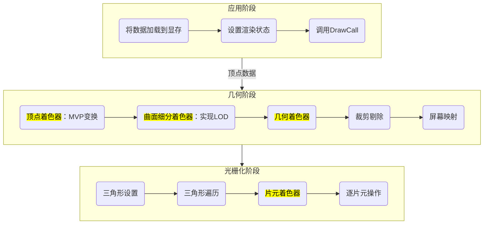
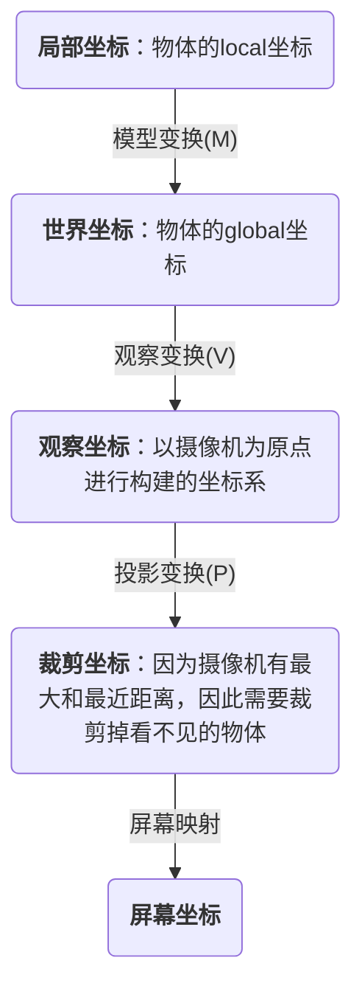

# 渲染管线


## 总览




## 应用阶段（Application Stage）

输入顶点数据：收集并输出图元信息，<br/>而图元信息包括了这个过程就叫一次DrawCall。

### 将数据加载到显存

所有需要渲染的数据，都需要从硬盘加载到内存，然后再从内存加载到显存中。这是因为显卡处理显存的速度更快。

这里所传输的数据包括了法线方向、顶点数据、shader、贴图、材质球、灯光等数据，

例如unity的应用阶段会传输下面的内容。

```c#
struct a2v //application to vertex shader
{
    float4 vertex : POSITION;
    float3 normal : NORMAL;
    float4 color : COLOR;
    float4 tangent : TANGENT;
    float4 texcoord : TEXCOORD0;
}
```


### 设置渲染状态

这个阶段，CPU会设置这些顶点会使用哪个着色器，材质等。

### 调用Draw Call

CPU通过这个命令，将需要被渲染的图元列表传递给GPU。每调用一次drawcall，GPU就要进行一次运算。因此优化的时候，要尽可能减少drawcall的调用数量。


## 几何阶段（Geometry Stage）

### 顶点着色器

顶点着色器是逐顶点进行遍历，且无法得到顶点之间的关系。

顶点着色器有两个任务：坐标变换和逐顶点计算颜色。

1. 进行坐标变换，**将局部坐标转为裁剪坐标**。




2. 计算顶点的颜色

   

   


顶点着色器运行在GPU上，虽然用c#脚本也能修改顶点位置，但是这个脚本运行在CPU上，更加消耗性能。


### 曲面细分着色器（可选）

曲面细分着色器：动态生成不同曲面数量的模型，和LOD（Levels of Detail）很像，但是LOD是CPU处理的，而着色器是GPU处理的。而且LOD需要提前准备高模低模的模型，而LOD是动态生成的。

### 几何着色器（可选）

可以对顶点增删，

可以完成破碎的特效，对模型外形进行操作。

### 裁剪

不可编程。剔除掉不在摄像机内的顶点。

### 屏幕映射

将图元的xy坐标，转化为屏幕坐标系（Screen Coordinates）。屏幕坐标系是二维坐标系，和屏幕分辨率相关。


## 光栅化阶段（Rasterizer Stage）


### 三角形设置（Triangle Setup）

用之前的顶点，来生成三角形。

### 三角形遍历（Triangle Traversal）

该阶段会检查每一个像素是否被一个三角网格所覆盖。如果被覆盖的话,就会生成一个片元（fragment）。

这个阶段也被称为扫描转换（Scan Conversion）。 

而一个片元并不是真正意义上的像素，而是包含了很多状态的集合。包括屏幕坐标、深度信息等。


### 片元着色器（Fragment Shader）

片元着色器中，最重要的技术就是纹理采样。

blender结点

### 逐片元操作（Per-Fragment Operations）/输出合并

1. 决定每个片元的可见性。通过模板测试、深度测试等。
2. 如果一个片元通过了测试，就需要把它的颜色和颜色缓冲区的颜色进行合并。


裁剪测试：剪裁测试用于绘制区域，我们可以指定一个矩形剪裁窗口，当启用剪裁测试后，只有 在这个窗口之内的像素才能被绘制，其他像素会被丢弃。剪裁窗口以外的像素将不会 被修改。

Alpha测试：如果片元的透明度不足，那么对应片元舍弃。

模板测试：

深度测试：z-buffer，颜色缓冲区（1帧）


混合：颜色混合  ，alpha混合

渲染路径

动态合批

颜色空间：liner、gamma


# 其他


应用阶段：将内存中的数据传递给GPU的显存

几何阶段：讲3D物体的顶点坐标转换为屏幕2D坐标

光栅化阶段：对2D点进行着色


图元：组成像素的基本单元

片元：未来的像素点 

像素：屏幕上包含RGBA的点

顶点——图元——片元——像素


# 输出结构体的内容


```
  void surf (Input IN, inout SurfaceOutputStandard o)
        {
            fixed4 c =  _Color;
            o.Albedo = c.rgb;

        }
```


# 压缩数组

`float3`   `int4`


片元着色器：颜色


//涂抹语法  smearing

0.Albedo = 1  //(0,0,0)


//遮罩语法 masking

0.Albedo.gb = Color.gb


获取矩阵的值

float4X4 matrix


float first = matrix._m00;

float last= matrix._m33;

获取行或者对角线的值


# 贴图滚动特效


```glsl
Shader "ShaderStudy/纹理映射"
{
    Properties
    {
        _Color ("Color", Color) = (1,1,1,1)
        _MainTex ("Albedo (RGB)", 2D) = "white" {}
        _ScrollingXSpeed("ScrollingXSpeed",Range(0,10))= 0
        _ScrollingYSpeed("ScrollingYSpeed",Range(0,10))= 2
    }
    SubShader
    {
        Tags { "RenderType"="Opaque" }
        LOD 200

        CGPROGRAM
        // Physically based Standard lighting model, and enable shadows on all light types
        #pragma surface surf Standard fullforwardshadows

        // Use shader model 3.0 target, to get nicer looking lighting
        #pragma target 3.0

        sampler2D _MainTex;

        struct Input
        {
            float2 uv_MainTex; 
        };


        fixed4 _Color;

        float _ScrollingXSpeed;
        float _ScrollingYSpeed;


        UNITY_INSTANCING_BUFFER_START(Props)
        UNITY_INSTANCING_BUFFER_END(Props)

        void surf (Input IN, inout SurfaceOutputStandard o)
        {
            fixed2  scrollUV = IN.uv_MainTex;

            fixed xScroll = _ScrollingXSpeed * _Time;
            fixed yScroll = _ScrollingYSpeed * _Time;
            scrollUV += fixed2(xScroll,yScroll);


            // tex2D就是根据纹理的坐标来找到这个贴图对应点的颜色
            fixed4 c = tex2D (_MainTex, scrollUV) * _Color;
            o.Albedo = c.rgb;

            o.Alpha = c.a;
        }
        ENDCG
    }
    FallBack "Diffuse"
}

```


# 法线映射


```glsl
Shader "ShaderStudy/法线贴图"
{
    Properties
    {
        _Color ("Color", Color) = (1,1,1,1)
        _NormalMap ("NormalMap",2D)="bunp"{}

        _NormalMapStrength("NormalMapStrength",Range(0,1)) = 1
    }
    SubShader

    {
        Tags { "RenderType"="Opaque" }
        LOD 200

        CGPROGRAM
        // Physically based Standard lighting model, and enable shadows on all light types
        #pragma surface surf Standard fullforwardshadows

        // Use shader model 3.0 target, to get nicer looking lighting
        #pragma target 3.0

        sampler2D _NormalMap;

        struct Input
        {
            float2 uv_NormalMap;
        };


        fixed4 _Color;
        float _NormalMapStrength;

        UNITY_INSTANCING_BUFFER_START(Props)
        UNITY_INSTANCING_BUFFER_END(Props)

        void surf (Input IN, inout SurfaceOutputStandard o)
        {


           float3 normalMap =  UnpackNormal( tex2D (_NormalMap, IN.uv_NormalMap));
           normalMap.x*= _NormalMapStrength;
           normalMap.y*= _NormalMapStrength;
          normalMap = normalize(normalMap);

          
            o.Albedo = _Color.rgb;
            o.Normal =normalMap;
        o.Alpha = _Color.a;
        }
        ENDCG
    }
    FallBack "Diffuse"
}

```


# 透明材质

1. 需要把tag修改

   ​    Tags { "RenderType"="Opaque" } //Opaque代表不透明


```
Shader "ShaderStudy/透明材质"
{
    Properties
    {
        _Color ("Color", Color) = (1,1,1,1)
        _MainTex ("Albedo (RGB)", 2D) = "white" {}
    
    }
    SubShader

    {
        Tags { 
        "RenderType"="Transparent" 
        "IgnoreProjector"="True" //不会产生影子
        "Queue"="Transparent"  //使用透明的渲染队列，保证先渲染不透明物体再渲染透明的
        }
        LOD 200
        Cull Off

        CGPROGRAM
        // Physically based Standard lighting model, and enable shadows on all light types
        #pragma surface surf Standard alpha:fade

        // Use shader model 3.0 target, to get nicer looking lighting
        #pragma target 3.0

      
      sampler2D _MainTex;
        struct Input
        {
            float2 uv_MainTex;
        };


        fixed4 _Color;
   
        

        UNITY_INSTANCING_BUFFER_START(Props)
        UNITY_INSTANCING_BUFFER_END(Props)

        void surf (Input IN, inout SurfaceOutputStandard o)
        {
            fixed4 c = tex2D (_MainTex,IN.uv_MainTex)*_Color;
            o.Albedo = c.rgb;
            o.Alpha = c.a;
        }
        ENDCG
    }
    FallBack "Diffuse"
}

```


原理：

1. 透明的物体是在非透明物体之后才渲染的，所以会有透明感
2. 当不透明物体出现在透明物体前面时，如果还渲染透明物体会很奇怪
3. 所以当不透明物体遮挡之后，默认不绘制透明物体


Cull Back这个东西又是什么意思？

"Cull Back" 主要用于计算机图形学中的面剔除（Face Culling）。当我们渲染一个图形时，不需要渲染那些用户无法看到的面。例如，当你看一个立方体时，你一次只能看到三个面，其他三个面在立方体的另一边，所以没必要去渲染他们。


"Cull Back" 表示剔除背向观察者的面，将它们从渲染过程中排除，以此来提高渲染的效率。具体来说，这通常是通过比较面的法向量和从观察者到面的向量来实现的。如果两个向量的方向相反，那么这个面就被认为是背向观察者的，应当被剔除。


我这个材质是一个玻璃材质，使用Cull Back会不会很奇怪？因为我玻璃是透明的，但是我却看不到背面

你提出了一个很好的问题。一般来说，对于完全透明的对象如玻璃，我们通常不会使用剔除（Culling），因为既然是透明的，我们需要从一侧看到另一侧。如果使用了"Cull Back"，那么你看到的将只是玻璃的前面，而看不到它的背面，这将产生一种不自然或者说不真实的效果。所以在实际应用中，我们通常不会对透明物体使用背面剔除。


那么我是不是应该写Cull off？

是的，对于一个透明的物体如玻璃，"Cull Off" 是比较合适的设置。"Cull Off" 会禁用面剔除功能，这意味着图形的所有面都会被渲染，包括那些从相机角度看不见的面。这对于玻璃这样的透明物体来说，能够创建出正常的渲染效果，让你可以从一个面看到另一个面。
