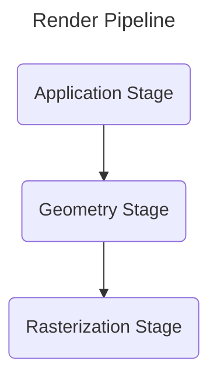
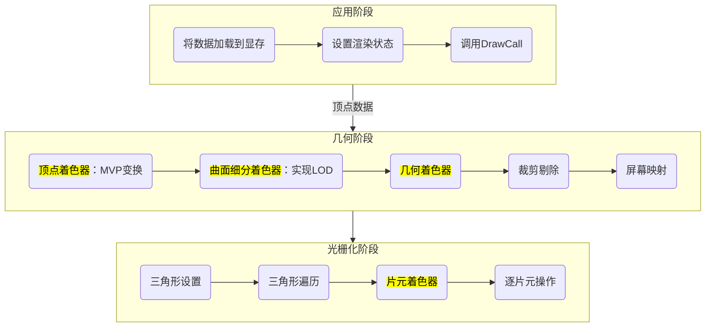
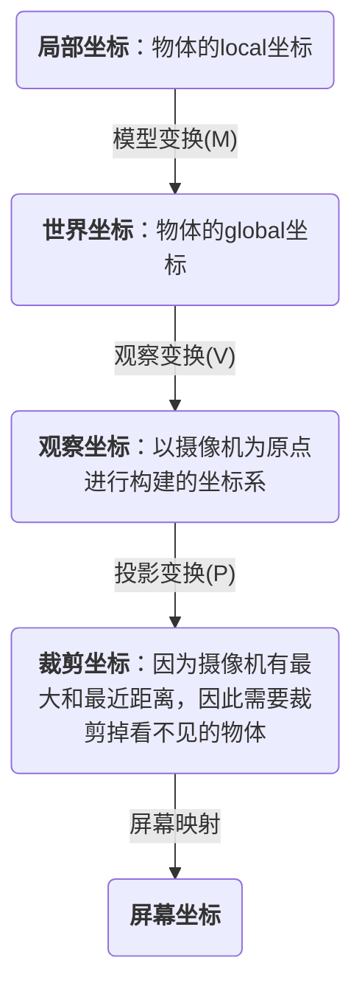

# Render Pipeline





## 应用阶段（Application Stage）

CPU向GPU传递数据。并决定哪些数据需要传递，以及这些数据的渲染状态。


### 1. 剔除（culling）

CPU会把摄像机视野内的数据传递到GPU，所以需要进行剔除。

1. 视锥体剔除（Frustum Culling）：剔除摄像机视野范围之外的物体。
2. 遮挡剔除（Occlusion Culling）：被遮挡的物体将不会参与剩下的渲染管线，可以提高性能。但是透明物体不应该参与遮挡剔除。
3. 层级剔除（Layer Culling Mask）：在unity中，可以在摄像机的culling mask中选择渲染的layer，可以手动剔除一些层级的物体。


### 2. 确定渲染顺序（sort）


unity中的render queue可以控制。不透明物体默认2000，透明物体3000。render queue越小，越先被渲染。

unity中小于2500的都会被视为不透明渲染队列。会**按摄像机距离从前到后排序**。这是为了优化性能。因为前面的物体渲染之后，后面的被挡住的部分就不需要渲染了，会自动剔除。这个会在深度测试中执行。也就是说不管之前是否会开启Occlusion Culling，之后都会执行。

unity中大于2500的都会被视为半透明渲染队列。会**按摄像机距离从后到前排序**。这是为了渲染的正确性，只有这样才有透明效果。


下图中，最终渲染顺序可以看出unity的执行逻辑


### 3. 打包数据 Batch


这个阶段，CPU会把模型的各种信息（顶点坐标，法线，UV，顶点颜色，灯光信息，世界变换矩阵，VP矩阵等）进行打包。


下图是obj模型的数据，第一个是顶点坐标，第二个是法线，第三个是UV坐标。最后一个是索引列表（indices array），

1/1/1 代表了第一个顶点的uv是1，第二个是uv，第三个是法线。


### 4. 调用DrawCall

1. SetPass Call：在调用draw call之前，还需要配置渲染状态。包括混合模式、深度测试、剔除模式等。
2. Draw Call：CPU命令GPU渲染。


## 几何阶段（Geometry Stage）


### 顶点着色器（Vertex Shaders）

这个就是shader里面经常用到的部分了。顶点着色器处理的顶点都是独立的，无法得到与其它顶点的关系。


顶点着色器的核心任务就是**模型转化与相机转换（Model- & Camera transformation）**，也就是把顶点坐标从模型空间转换为裁剪空间。也就是Model，View和Projection的变换。他们将模型空间（Object Space）按照顺序转换为世界空间（World Space）相机空间（View Space）就裁剪空间（Clip Space）

在转为viewSpace的时候，正交投影所使用的模型是cuboid，而透视投影使用的是frustum。因此，我们可以把frustum四周压缩，挤成cuboid，然后按照正交投影来处理即可。这种立方体叫做 CVV。


### 曲面细分着色器（Tessellation Stage）

这一阶段可以在原有的顶点上加入更多顶点，让之后生成的曲面更加润滑。这个也可以制作**贴图置换（Displacement Mapping）**


### 几何着色器（Geometry Shader）

可以对模型的顶点增删改，但是极其消耗性能。


### 裁剪（Clipping）


裁剪（clipping）和剔除（culling）是不一样的。剔除会把不需要渲染的物体直接删掉。而裁剪则会把视野外的三角面裁剪为新的小三角。


### NDC标准化设备坐标

对透视裁剪空间来说，GPU需要对裁剪空间中的顶点执行齐次除法（其实就是将齐次坐标系中的w分量除x、y、z分量），得到顶点的**归一化的设备坐标（Normalized Device Coordinates, NDC**），经过齐次除法后，透视裁剪空间会变成一个x、y、z三个坐标都在[-1,1]区间内的立方体。对于正交裁剪空间就要简单得多，只需要把w分量去掉即可。


### 背面剔除（Back Face Culling）


### 屏幕映射（Screen Mapping）

此时的GPU已经得到了[-1,1]区间的坐标，但是屏幕的分辨率往往是2560*1440的，所以需要把NDC的值转为屏幕坐标。

此时也会记录z值。


把NDC的坐标转为屏幕坐标。


## 光栅化阶段（Rasterization Stage）


### 图元装配（Primitive Assembly）

这个阶段中，GPU会把一个一个的顶点都变成三角面。


### 三角形遍历（Triangle Traversal）/光栅化（Rasterization）

把三角面变为屏幕的像素。也就是真正的片元。

片元会携带信息，包括深度值，法线，顶点颜色，切线，以及自定义的数据等。


### 片元着色器（Fragment Shader）/像素着色器（Pixel Shader）


**纹理采样**

，UV*纹素坐标


**纹理过滤**


如果把一个小纹理映射到很大的纹素坐标，可能导致很模糊。所以可以采用双线性插值，采样周围四个颜色做插值。也就是unity之中图片属性的filter mode。point代表默认映射，bilinear代表双线性插值。


**mipmap**

如果把一个大纹理映射到很小的纹素坐标，也会导致很模糊。所以也会进行处理。这个功能对应unity中图片属性的generate mip maps


**纹理寻址模式**


当纹理uv映射的范围超过了纹素坐标，则可以设置一个填充方案。也就是tiling and offset。

对应unity的warp mode。

#### Wrapping纹理寻址模式

它使Direct3D在每一个整数结点（integer junction）对纹理进行重复。假设我们要创建一个正方形图元，并将纹理坐标声明为(0.0,0.0)、(0.0,3.0)、(3.0,3.0)和(3.0,0.0)。这时，如果我们设置了纹理寻址模式，就可以使纹理在U、V方向都重复三次。，如下图所示：


#### 镜像纹理寻址模式

和wrapping差不多，但是是镜像的


#### 钳位纹理寻址模式

只使用一次纹理，将边缘像素的颜色抹去。


#### 边界颜色纹理寻址模式

在纹理坐标超过范围的地方使用一个任意的颜色，也就是边界颜色。


**纹理压缩格式**


### 逐片元操作（Per-Fragment Operations）/合并阶段（Output-Merger）

这个阶段会把之前的片元数据拿来，处理遮挡关系，处理半透明的混合。


alpha测试：当alpha低于某个值时剔除

模板测试（stencil test）

深度测试（depth test）


深度测试时，shader中可以配置深度写入（zwrite），深度测试（ztest）

深度测试可以提前，以便优化性能。叫做early z。因为顶点着色器之后就已经知道深度信息了，所以可以提前。


混合（blending）

混合会把两种颜色进行混合


shader中可以配置

Blend SrcAlpha OneMinusSrcAlpha    =    SrcColor * SrcAlpha +DestColor*(1- SrcAlpha )

Blend SrcAlpha One =  SrcColor*SrcAlpha +DestColor *1.0


帧缓冲区，包括颜色缓冲区，深度缓冲区，模板缓冲区。


背面剔除（Backface Culling）


# 参考文献和视频


[技术美术入门：渲染管线概述](https://www.bilibili.com/video/BV1Q54y1G7v3/?spm_id_from=333.999.0.0&vd_source=1fb8226c3ee5a8bb358e3fa9f18e29f0)

[猴子也能看懂的渲染管线（Render Pipeline）](https://zhuanlan.zhihu.com/p/137780634)

[细说图形学渲染管线](https://positiveczp.github.io/%E7%BB%86%E8%AF%B4%E5%9B%BE%E5%BD%A2%E5%AD%A6%E6%B8%B2%E6%9F%93%E7%AE%A1%E7%BA%BF.pdf)


# 渲染管线


## 总览




## 应用阶段（Application Stage）

输入顶点数据：收集并输出图元信息，<br/>而图元信息包括了这个过程就叫一次DrawCall。

### 将数据加载到显存

所有需要渲染的数据，都需要从硬盘加载到内存，然后再从内存加载到显存中。这是因为显卡处理显存的速度更快。

这里所传输的数据包括了法线方向、顶点数据、shader、贴图、材质球、灯光等数据，

例如unity的应用阶段会传输下面的内容。

```c#
struct a2v //application to vertex shader
{
    float4 vertex : POSITION;
    float3 normal : NORMAL;
    float4 color : COLOR;
    float4 tangent : TANGENT;
    float4 texcoord : TEXCOORD0;
}
```


### 设置渲染状态

这个阶段，CPU会设置这些顶点会使用哪个着色器，材质等。

### 调用Draw Call

CPU通过这个命令，将需要被渲染的图元列表传递给GPU。每调用一次drawcall，GPU就要进行一次运算。因此优化的时候，要尽可能减少drawcall的调用数量。


## 几何阶段（Geometry Stage）

### 顶点着色器

顶点着色器是逐顶点进行遍历，且无法得到顶点之间的关系。

顶点着色器有两个任务：坐标变换和逐顶点计算颜色。

1. 进行坐标变换，**将局部坐标转为裁剪坐标**。




2. 计算顶点的颜色

   

   


顶点着色器运行在GPU上，虽然用c#脚本也能修改顶点位置，但是这个脚本运行在CPU上，更加消耗性能。


### 曲面细分着色器（可选）

曲面细分着色器：动态生成不同曲面数量的模型，和LOD（Levels of Detail）很像，但是LOD是CPU处理的，而着色器是GPU处理的。而且LOD需要提前准备高模低模的模型，而LOD是动态生成的。

### 几何着色器（可选）

可以对顶点增删，

可以完成破碎的特效，对模型外形进行操作。

### 裁剪

不可编程。剔除掉不在摄像机内的顶点。

### 屏幕映射

将图元的xy坐标，转化为屏幕坐标系（Screen Coordinates）。屏幕坐标系是二维坐标系，和屏幕分辨率相关。


## 光栅化阶段（Rasterizer Stage）


### 三角形设置（Triangle Setup）

用之前的顶点，来生成三角形。

### 三角形遍历（Triangle Traversal）

该阶段会检查每一个像素是否被一个三角网格所覆盖。如果被覆盖的话,就会生成一个片元（fragment）。

这个阶段也被称为扫描转换（Scan Conversion）。 

而一个片元并不是真正意义上的像素，而是包含了很多状态的集合。包括屏幕坐标、深度信息等。


### 片元着色器（Fragment Shader）

片元着色器中，最重要的技术就是纹理采样。

blender结点

### 逐片元操作（Per-Fragment Operations）/输出合并

1. 决定每个片元的可见性。通过模板测试、深度测试等。
2. 如果一个片元通过了测试，就需要把它的颜色和颜色缓冲区的颜色进行合并。


裁剪测试：剪裁测试用于绘制区域，我们可以指定一个矩形剪裁窗口，当启用剪裁测试后，只有 在这个窗口之内的像素才能被绘制，其他像素会被丢弃。剪裁窗口以外的像素将不会 被修改。

Alpha测试：如果片元的透明度不足，那么对应片元舍弃。

模板测试：

深度测试：z-buffer，颜色缓冲区（1帧）


混合：颜色混合  ，alpha混合

渲染路径

动态合批

颜色空间：liner、gamma


# 其他


应用阶段：将内存中的数据传递给GPU的显存

几何阶段：讲3D物体的顶点坐标转换为屏幕2D坐标

光栅化阶段：对2D点进行着色


图元：组成像素的基本单元

片元：未来的像素点 

像素：屏幕上包含RGBA的点

顶点——图元——片元——像素
