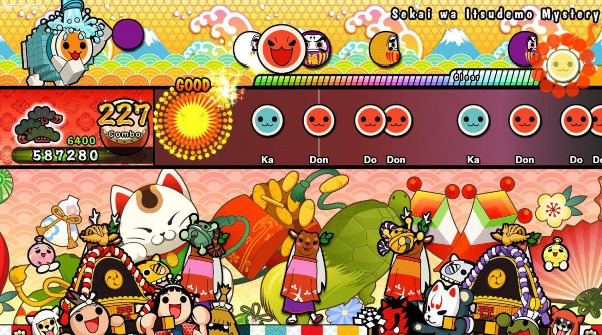

# 音游当今存在的设计问题

## 传统音游的设计规范

所谓的音游，是指音乐游戏（Music Game）。

在当今的音游设计中，设计的核心思维就是：**以音乐节奏为核心。根据音游的节奏，玩家需要进行恰当的输入**。在一些音游中，除了节奏之外，还有音高和时长的控制。

在传统设计中，往往用一个类似于钢琴键盘的虚拟键盘来供玩家输入。在游玩的时候也类似钢琴。用键盘不同的按键代表音高，玩家通过按键的时间决定音符的播放时长。节奏则是由玩家的一次输入抬起决定的，也就是用`ON_BUTTON_UP`绑定玩家的输入，若时长小于某个阈值则判定为一次点击。

整体来说，当代音游将音乐分为三个要素：

- 节奏：这部分是游戏核心要素。玩家需要根据屏幕的提示进行准确的输入。
- 音高：可选要素。需要玩家根据音游音高的变换，进行滑动或者点击。
- 时长：可选要素。需要玩家根据音符的长度来决定按键的时间。

所以一般的音游也将输入类型分为三种：*点击音符（Click Note），长按音符（Hold Note）和拖动音符（Drag Note）*。分别对应节奏，时长和音高。

---

以上的三个核心，只有节奏是核心要素。但是现代的音游中往往都是将三者结合。很少单独出现。

例如知名游戏《deemo》，可以说是的教科书一般标准的音游了。

除此之外，也有很多经典游戏选取了其中部分要素。或者仅用一个元素。

例如日本国民级游戏《太鼓达人》，仅仅使用 了节奏。

还有PSP的经典游戏《啪嗒砰(Patapon)》，也是以节奏为核心构建的。

因为音游的操作方式较为单一，因此上手快。但是如果想要达成full combo的成就，难度就会极高。

往往需要玩家多次练习或者背谱来完成perfect成就。

这种游戏的爽点实际上并不是音乐，而是多次练习之后的进步。最开始高难度的乐谱甚至不到50%的命中率，但是经过练习最后能够到达100%的命中，这种进步感和成就感是音游最重要最核心的设计。

说起来是很接近黑魂类游戏的设计思维。黑魂也是需要背招式的。如果某个boss做出了某个动作，玩家需要来记忆它下一招是什么，然后输入正确的指令进行弹反或者闪避等。

虽然后期的音游也对此进行了若干改进，但是核心思想还是根据节奏进行输入。

例如《dancing line》虽然也是基于节奏进行输入。但是相比于其余的音游更注重视觉的体验。

## 现代音游的创新

现代音游的设计是基于传统游戏的。这个基于是意思是：**现代音游游戏是继承于传统音游的**。也就是说现代音游的核心要素实际上也是**节奏**。不过相比于传统音游添加了更多的要素。

- 节奏+画面

  知名游戏《跳舞的线》删掉了音高和音符时长的输入控制。同时加入了画面作为核心要素。

  在传统音游的基础上大胆创新，将视觉体验作为卖点。
  

- 节奏+RPG

  《节奏地牢》可以说是RPG中最音游的，或者是音游之中最RPG的。
  
  
  
- 节奏+双手操作

  《缪斯计划》本质上还是节奏类的音游，但是在ui设计上将分区化为了不同的部分。按键点击的时候让人有两手分别演奏的感觉。

- Cytus II

  《Cytus II》这种2D的音游可以说在设计上大大加强了音游的可视化。之前的音游都是在一个键盘上演奏，本游戏拓展到了一个2D平面。在演奏时，两手可以同时控制音符时长，节奏。但是无法控制音高。

  在本游戏中按键实际上还是有三种。长按按键，点击按键和滑动按键。本质上来说仅仅是将传统音游的1维操作空间提升到了2维。

  另外值得一说的是，虽然提升到了2维，但是实际上曲子是动态的1维。在游戏内部，实际上是有一个操作线，每次在操作线上的音符就是需要输入的音符。设计上来说实际上就是将键盘不动音符下落的设计改为了，音符不动键盘移动的设计。

  

  可以看到图中的线是在移动的。

  

  实际上也有一些游戏虽然改到了2d但是实际上还是单纯的节奏游戏，甚至只用鼠标在一个位置点就可以了。比如《3D定制女仆2》，在游玩时居然只用鼠标单点就行了，甚至都不用移动。
  
  
  
  

- 横板过关+节奏

  《喵斯快跑》可以说是这一类的经典之作。将节奏巧妙地转为了敌人的子弹和敌人等物品。同时加入了角色技能和HP等RPG游戏常见设计，增强了游戏的游戏性。

  

  

例子还有非常多，这里就不一一举例了。

可以看到，现代的音游虽然做出来很多改进方案，但是本质上还是以节奏为核心。**当代所作的诸多改进都是针对节奏可视化的改进**。《喵斯快跑》将节奏具象为敌人的分布。《Cytus II》将节奏分布到整个2d空间。但是实际上没有对音游做出本质上的改变。现代音游的设计思路都是：节奏——操作方式——游戏。这样的设计流程。

首先先考虑一段节奏，然后对节奏设计交互的方式，可以两个手、可以横在一排、可以分布到2D、可以改变角色的某种状态等等。最后再依照这个游戏核心构建游戏。

# 改进思路

## 音游一定是节奏吗？

通过刚才的分析我们可以看到。音游实际上最核心的就是节奏，音游实际上可以被称为是一种**节奏游戏**。

如果想要进一步改革音游，仅仅停留在传统音游的思想上是不行的。这时候有一个问题就呼之欲出了。音游一定要是节奏游戏吗？能不能有一种不以节奏为核心要素的音游呢？

这个问题一时间很难回答。我认为首先需要回到音游最开始的形态——乐器演奏进行研究。

## 探索音游和乐器演奏的区别

我们首先需要知道音游和乐器演奏的区别。

实际上关于音游一直有一个令人感到有趣的话题。

> 擅长玩音游的人，弹钢琴一定很厉害吗？或者说，弹钢琴很厉害的人，玩音游就很厉害吗？

实际上这两点是没有什么可比性的。

就像擅长玩FPS的玩家，不一定真的就能在现实中大杀四方一样。

音游作为一个游戏，和真实的演奏差距是非常大的。游戏的目的就是娱乐，音游虽然很难，但是实际上很巧妙地降低了提升的门槛，只要多次练习，进步是非常显著的。也就是所谓的学习曲线低。而乐器的演奏难度远远高于音游。

例如对于同样一个曲子《小星星》，音游映射到键盘只有4个按键，而且不用考虑踏板和力度。绝大多数人都可以在第一次游玩就拿到高分。

但是钢琴的话演奏难度就会高的吓人，首先就是需要10个手指共同配合完成，中间还有穿指的指法，再加上脚下的3个踏板，大部分人基本上需要一天甚至一周才可以完整地弹下来。对于小提琴和其余乐器来说，难度会更高。我在学习钢琴的时候，小星星就是弹了整整一周才勉强熟练。而小提琴光是演奏音阶一周都无法熟练，练成小星星几乎要两周的时间，如果要加上揉弦，那么要几乎一个月以上的时间。

音游和乐器在难度上的区别决定了乐器演奏难以成为游戏。

因为学习门槛太高，会严重降低对玩家的正反馈。而音游最绝妙的地方在于学习门槛低，大部分人经过一两天的练习就可以拿到full combo，正反馈很高。

诚然，如果一个乐器长久坚持下来，也能够非常熟练的弹奏曲子，这时候也会有很多人觉得“爽”。

但是如果一个系统的反馈过慢，就不适合用来做交互。学习也是一样的，如果现在好好学习，可能十几年后会怎样怎样。这个反馈时间太长了，导致很多人并不喜欢学习。

但是问题是，为什么还是有人喜欢演奏乐器？演奏乐器带来的欢乐在哪里？

实际上在演奏的时候，真正的乐趣在于“演奏乐曲”，在于自己DIY音乐的快感。

比如说一个人游玩音游，他的理由可能是“我喜欢音游full combo”带来的爽点。而一个人去学钢琴，理由很可能是“我喜欢听《卡农》，我想要自己演奏它。”我很少听说有谁是我喜欢弹钢琴，所以我去弹钢琴。

所以对于乐器演奏者来说，最重要的感觉是“**自己在乐器中的参与感**”，自己开心了就演奏欢乐的曲子。悲伤了就演奏悲伤的曲子。

就算是不懂乐器的人，面对自己喜欢的乐器，也会像指挥家一样去随音乐摇摆、指挥、打节拍。

总结一下。

音乐最核心的设计是快速的反馈。而音乐则是，自己参与到音乐创作、音乐演奏的快感。自己指挥音乐的快感。

这个点就是音游和乐器演奏的不同。

那么有没有可能，我们可以设计一款基于“演奏乐器”的音游？

## 基于乐器演奏的音游设计

之前我们说过，音游的爽点在于多次练习之后的成长，但是乐器演奏的反馈曲线非常平缓，多次练习之后也难以得到快速的进步。

所以说如果要开拓新的设计思路。就不能在高难度练习上下功夫了。高难度的音游在游玩上一定程度破坏了音乐的体验。在音乐高潮的时候，玩家作为“演奏者”需要将大部分精力都放在输入指令上。可能并没有太多的精力去欣赏画面和音乐。

但是我们可不可以有一个新的思路？玩家可不可以来当乐队的指挥或者是观众？

我认为是可以的。

我们不妨将乐器演奏解耦成三个元素：

- 学会乐器之后的快感。
  - 展示给别人看的优越感，具有功利性。
  - 满足攻克困难的快感
- 享受音乐的旋律
  - 单纯听音乐
- 享受自己演奏的快感
  - 自己演奏出音乐的成就感
  - 自己DIY喜欢音乐的趣味性

