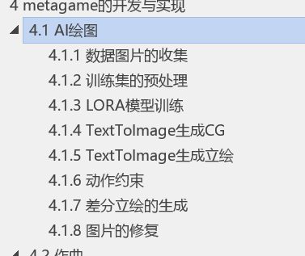

# 摘要

在传统视觉小说中，从共通线到主线的过渡一直是难以解决的问题。在共通线往往有大量无意义的选项。

有些游戏虽然对此进行了改进，但是往往都是基于线性选择设计的。也就是说进入某一个结局需要满足XXX条件和XXX条件。在设计的时候路线会极其混乱。因此在本文提出了一种新的设计方法。

关键字：视觉小说、游戏设计

# 传统视觉小说中的问题

在传统的视觉小说中，各个女主线的进入方式可以说是百花齐放。一般来说常见的有如下几个方式：

- **若干干扰选项+一个关键选项**

  例如：《命运石之门》中，前几个女主线的进入方式完全由是否发送dmail来决定，与之前的选项完全没有关系。

  > 不可逆的重启（打工战士线）：第六章最后坚持不发送d-mail。
  >
  > 分离丧失的未视感（菲利斯线）：第七章最后坚持不发送d-mail。
  >
  > 背德与再生的链接（琉华子线）：第八章最后坚持不发送d-mail。

- **若干干扰选项+若干关键选项**

  例如：《千恋万花》中，小丛雨线，实际上是由几个关键选项决定的。

  > 1.敷衍过去
  >
  > 2.不好说
  >
  > 3.看着不奇怪
  >
  > 4.单独行动*
  >
  > 5.摸头*
  >
  > 6.有点担心
  >
  > 7.少说两句

  带星号的代表必选选项，其他的代表任意。

- **全部都是关键选项**

  同样以命运石之门为例：进入助手线的时候，必须完全按照关键字进行回复

  >  收信：写好了?
  >
  > 回复关键词：科学家
  >
  > 收信：科学家？？
  >
  > 回复关键词：粪筐科学家
  >
  > 此处没有完全列举。

  

可以看到，在视觉小说中，如果想要进入特定的主线，往往需要在共通线选择正确的选项。无论其关键选项占比有多少，一定会需要一个关键选项。

这样可能会导致很多问题。

- 有可能玩家在共通线时想选择A角色，但是选错了关键剧情，导致无法进入角色线
- 过于错综复杂的选项树会导致很多隐藏结局难以达成。

能不能用一个非线性的方法来解决上述问题？

# 解决方案

## 点积的定义

假定两个向量$\vec{a} $、$\vec{b} $，那么其点积就是：$\vec{a}  \cdot \vec{b} = \vert a\vert \vert b\vert \cos \theta$

可以看到，两个向量点积的大小由其模长和夹角决定。若两个向量均为单位向量，那么点积则由其夹角决定。最大值为1，此时两个向量夹角为0，最小值为-1，此时两个向量方向相反。

## 视觉小说的设计思路

在传统的视觉小说中，在策划阶段我们需要做的时剧情的设计，然后根据剧情进行选项和路线的设计。也就是所谓的自顶向下。

如果引入了向量，那么我们就可以进行模糊匹配。

就是说，开发者和玩家只需要去关注某一个选项会带来怎样的影响即可。不需要设计具体的路线。具体内容见下文。

下文将用一个简易的游戏DEMO作为例子来进行讲解。

# 基于向量的视觉小说设计（案例）

## 引子

在视觉小说中，玩家选择女主的理由大致可以分为以下三个部分

- 颜值或者设定戳xp

  经典的就是白毛红瞳。没有理由，大家就是喜欢这种。

- 性格戳xp

  比如我很喜欢「美少女万華鏡」里面的れんげ，虽然画风一般般，但是性格和经历非常戳我。

- 与男主的经历，或者是自身身世能引起共鸣

  这种会让人联想到身边的人，或者在漫长的路途中慢慢积累了对角色的感情。

## 女主的设计

- 女主的属性可以分为**静态特征**和**动态特征**，其静态特征包括身高，体重等属性；其动态特征可以分为：兴趣集，兴趣持续时间等。[^1]在此基础上，还需要加入人物的**故事背景和经历**。分别对应上文的三个部分。

  也就是说，女主的属性大致上可以包括三个部分：

  1. 女主天生就拥有的属性

  2. 女主后天养成和学到的属性

  3. 女主的经历。

     
  
   虽然2和3都是后天养成的，但是经历往往是被迫的，和后天的兴趣和技能往往都是自己主动掌握的。

- 因为女主的属性众多，不可能所有的属性都一样重要，因此可以引入权重。对于不同属性赋予不同权重。

下面将会详细讨论。

### 静态特征的设计

例如我现在需要设计一个视觉小说。游戏中有三个女主。其各个属性如下：

| 属性（权重）   | A            | B            | C            |
| -------------- | ------------ | ------------ | ------------ |
| 年龄           | 18           | 24           | 20           |
| 身高           | 低           | 中           | 高           |
| 发色及眼睛颜色 | 白发（红瞳） | 黑发（红瞳） | 黑发（蓝瞳） |
| 胸围           | A            | B            | C            |
| 种族           | 人类         | 精灵         | 人类         |
|                |              |              |              |
|                |              |              |              |

**静态属性在游戏中扮演的角色往往是第一印象**，虽然会起到重要作用，但是决定性的还是动态特征和人物经历。

例如我之前玩过一个叫做《茂伸奇谈（ものべの）》的游戏。在玩最初两个章节的时候，最喜欢的角色是爱丽丝。但是随着剧情的推进，爱丽丝线的剧情薄弱就体现出来了。虽然人设非常戳xp，但是没有一个优秀的剧情支撑，还是无法起到决定性因素。

### 动态特征的设计

在一些大型的ADV中可以考虑使用MBTI人格分析法来处理。但是为了方便起见，这里使用了日系经典的性格模型。

|            | A        | B    | C        |
| ---------- | -------- | ---- | -------- |
| 性格       | 活泼开朗 | 傲娇 | 大和抚子 |
| 兴趣       | 网球     | 游泳 | 读文学书 |
| 喜欢的动物 | 猫猫     | 狗   | 兔子     |

动态特征往往会起到非常重要的作用。动态特征只能通过剧情来一点点了解，不能一下子了解。

一般来说幸福的婚姻双方的性格会更加相似.。[^2]

### 人物经历的设计

一般来说人物和玩家的经历是起到决定性因素的。比如《爱上火车》中，有着众多的女主，但是86的人气是压倒性的高过其他人。这个正是因为86就是官方女主，描写她的剧情要远大于其他人。

|              | A                                                            | B                                                            | C                                                            |
| ------------ | ------------------------------------------------------------ | ------------------------------------------------------------ | ------------------------------------------------------------ |
| 过去经历     | 曾加入音乐社团                                               | 儿时受到虐待                                                 | 平凡，但是学习很好                                           |
| 和主角的经历 | 在一次偶然相遇，随后一起巡游世界，见过无数或浪漫或悲伤的故事。 | 被主角所救，之后一直寄宿在主角家中，一起度过单调但是幸福的生活。 | 作为主角的青梅竹马，一直上着同一个学校，一直都是邻居。相处了无数平凡的日子。 |
|              |                                                              |                                                              |                                                              |

## 玩家的偏好模型建立

玩家在设计的时候，表是和女主一样的。两者都是用一个向量来表示。

具体运算见下文。

整个游戏系统最核心的地方实际上并不是向量计算和女主设计这种东西，实际上在于如何计算玩家的偏好。

男主的数据由如下构成：

- 对女主的加权系数
  - 第一印象：
- 对女主的特征偏好

| 男主的印象 | A    | B    | C    |
| ---------- | ---- | ---- | ---- |
| 第一印象   | 10   | 5    | 0    |
|            |      |      |      |
|            |      |      |      |

| 男主的偏好 |       |      |
| ---------- | ----- | ---- |
| 静态特征   | (19,) |      |
| 动态特征   |       |      |
| 人物经历   |       |      |

## 玩家和女主的匹配运算

我们不妨建立一个向量，$\vec n=(x_1,x_2,x_3,,,,x_n)$，x分别代表女主的各项属性。

女主A ：

$\vec 静态特征=(18,低,白发红瞳,A,人类)$

$\vec 动态特征=(活泼开朗,网球,猫猫)$

$\vec 人物经历=(加入音乐社,一起旅行)$

然后我们需要设计一个数值映射表，这个表是为了衡量女主各个属性之间的数值大小。

|      |             |      |
| ---- | ----------- | ---- |
| 性格 | 阳光活泼：1 |      |
|      |             |      |
|      |             |      |

 

# 引用

[^1]:［201310565879. X］西安工程大学 基于性格相似度匹配计算的网络社区用户好友推荐方法

[^2]:MBTI十六种人格类型汇总（婚姻篇）https://zhuanlan.zhihu.com/p/397263584?ivk_sa=1024320u

