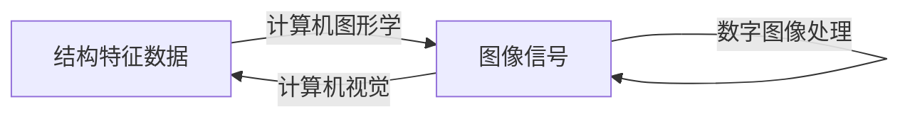

  

# 目录

[TOC]


# 序章

图形学之父——伊凡·苏泽兰

## 什么是图形学

**是一种使用数学算法将二维或三维图形转化为计算机显示器的栅格形式的科学**。

计算机图形学是研究怎样利用计算机来显示、生成和处理图形 的原理、方法和技术的一门学科。


## 图形和图像

两者的关系越来越模糊


- **图像**：指计算机内以位图(bitmap)形式存在 的灰度信息 

  图像是外部设备捕捉到的景象，是**位图**

  -Photoshop等软件制作

- **图形**：含有几何属性，或者说更强调场景的集合表示，是由场景的几何模型和景物的物 理属性共同组成的

  图形是计算机生成的，是**矢量图**

  -Autocad等软件制作


图形按照其构造来分，可以分为规则对象和不规则对象

- 规则对象：是指能用欧氏几何去描述的对象，比如说点、直线、圆等
- 不规则对象 ：不可以用欧氏几何描述的，比如说云朵、草等。

## 各个相关学科的关系



## 图形学的研究动态

- 计算机动画
- 人机交互
- 地理信息系统
- 真实感图形绘制
- 虚拟现实
- 并行图像处理


## 计算机图形系统


## 分辨率

- 屏幕分辨率

  决定了显示系统的最大可能分辨率

- 显示分辨率

  显示控制器在不同显示模式下的分辨率
  
- 存储分辨率

  指**帧缓冲区**的大小，一般用**字节**表示

  存储分辨率必须大于显示分辨率
  
  8bit 1bit

如果显示分辨率为640*480，显示一副二值图像，需要640\*480/8KB的帧缓冲区

如果显示分辨率为640*480，显示一副256色图像，需要640\*480KB的帧缓冲区

如果显示分辨率为1024*1024，显示一副16色图像，需要1024\*1024/2KB的帧缓冲区


##   交互式绘图技术

- 回显

  指数据能够即使回馈，例如在cmd窗口里面，输入一个数据就要求有一个返回值

  在绘图技术中，指绘图时若干参数信息即时显示

- 约束

  画图时，按住某个键可以约束绘制正方形，直线，圆等。

- 引力域

  绘制时，一些关键点会自动吸附。

- 橡皮筋技术

  绘图的时候，首先点击了之后，该点就会定住不动，另一端可以自由变换。

- 草拟技术

  用户绘图之后，用直线或者曲线拟合用户的图形。

- 拖动

  拖动对象的时候，需要实时显示，以便拖放到正确的位置

- 旋转

- 形变

  就是拉伸

## 输入设备

- 定位设备：指定一个点的坐标位置（鼠标）
- 笔画设备：指定一系列点的坐标位置
- 数值设备：输入一个整数或者实数
- 字符串设备：输入一串字符（键盘）
- 选择设备：选择某个菜单项
- 拾取设备：选择显示图形的组成部分

## 用户接口设计

- 反馈

  用户所有的操作都需要有反馈

- 一致性原则

  一个图标或者一个菜单命令应该代表一种含义，不可以含义不一样

- 回退和出错处理

  操作可以undo

- 联机帮助

  用户可以随时请求帮助

- 视觉效果设计

  颜色别胡搁着设计，一定要像个人

  

  


# Rasterization

<p style="text-align:center; font-size:3em" >光栅化</p>


几个概念

屏幕可以分为一组像素（pixel）组成的数组，数组的大小就是屏幕分辨率。这也是为什么叫1080p的原因

光栅的raster来源于德语，意思是屏幕

pixel是picture element的缩写


为什么用三角形来充当模型的基本元素？

- 三角形是最简单的多边形

- 三角形的三个点可以确定唯一一个平面

  四边形就不行，有可能会从中间掰弯

- 三角形的内外非常清晰

  可以直接用叉积来判断点是否在三角形内

  


## 直线扫描转换

### 数值微分法（DDA）

原理：直线x坐标加1，y坐标加k。也就是说假如第一个点是(x,y)那么下一个点理论上就是(x+1,y+k)。但是遗憾的是，我们的显示器像素都是整数的，第二个点必须取到(x+1,y)或者(x+1,y+1)。具体选择哪一个点，则由(x+1,y+k)距离两个点的距离来决定。这个过程可以用四舍五入来计算。


计算公式可以表示为：

| 直线的斜率   | 公式                                                         |      |
| ------------ | ------------------------------------------------------------ | ---- |
| $|k|\leq 1 $ | $\left\{\begin{array}{l}x_{i+1}=x_{i}+1 \\ y_{i+1}=int(y_{i}+k)\end{array}\right.$ |      |
| $|k|>1$      | $\left\{\begin{array}{l}y_{i+1}=y_{i}+1 \\ x_{i+1}=int(x_{i}+1 / k)\end{array}\right.$ |      |

可以看到，DDA仍然需要进行取整运算


例如对（0，0）和（8，6）进行直线转换

计算$k=6/8=3/4=0.75$

| $x_{i+1}=x_i+1$ | $ y_{i+1}=y_i+k$ | $int(y_i)$ | 点       |
| --------------- | ---------------- | ---------- | -------- |
| 0               | 0                | 0          | （0，0） |
| 1               | 0.75             | 0          | （1，0） |
| 2               | 1.5              | 1          | （2，1） |
| 3               | 2.25             | 2          | （3，2） |
| 4               | 3                | 3          | （4，3） |
| 5               | 3.75             | 3          | （5，3） |
| 6               | 4.5              | 4          | （6，4） |
| 7               | 5.25             | 5          | （7，5） |
| 8               | 6                | 6          | （8，6） |


### 中点画线法

原理：直线的隐式方程为：
$$
F(x,y)=ax+by+c
$$
若直线的两个点为$(x_0,y_0)，(x_1,y_1)$那么$a=y_0-y_1，b=x_1-x_0，c=x_0y_1-x_1y_0$

 

隐式方程将空间分成了三个区域，点在直线上方的话，带入方程为正；点在直线上为0；点在直线下为负数。

  

该算法在判断的时候每次把中点带进去。假如为正，说明中点在直线上方，也就是说直线更接近下方的点，因此会取$(x+1,y)$。

也就是说我们判断下一个点的时候首先需要去判断中点的值。

我们不妨设中点$(x+1,y+0.5)$，中点的数值为$d_0=F(x+1,y+0.5)=a(x+1)+b(y+0.5)+c$，

若$d>=0$，则下一个构造点为$(x+2,y+0.5)$：

​	$d_1=F(x+2,y+0.5)=a(x+2)+b(y+0.5)+c=a(x+1+1)+b(y+0.5)+c=a+d$

若$d<0$，则下一个构造点为$(x+2,y+1.5)$：

​	$d_1=F(x+2,y+1.5)=a(x+2)+b(y+1.5)+c=a(x+1+1)+b(y+0.5+1)+c=a+b+d$

​	

然后再来确定初始点$d_0$的数值：

$d_0=F(x+1,y+0.5)=a(x+1)+b(y+0.5)+c=F(x_0,y_0)+a+0.5b$，又因为$(x_0,y_0)$在直线上，所以其结果为0。上式可以化简为$d_0=a+0.5b$

为了避免d~0~的小数问题，不妨把所有的增量都乘以2。

因此伪代码如下：

```pseudocode
a=y0-y1
b=x1-x0
d = 2a+b
while(没画完直线){
	x+=1
	if(d>=0){
		d=d+2a
	}else{
		d=d+2(a+b)
		y=y+1
	}
}
```


中点画线是根据中点判断具体画法

$y_{i+1}=\left\{\begin{array}{l}y+1，d<0\\ y，d \geq 0\end{array}\right.$

$d_{i+1}=\left\{\begin{array}{l}d+a，d\geq 0\\ d+a+b，d < 0   \end{array}\right.\\d_0=a+0.5b$


例如对（0，0）和（8，6）进行直线转换

$a=y_1-y_2=-6;$

$b=x_2-x_1=8; $

$d_0=-6+0.5*8=-2$


| x    | d           | y    | 点       |
| ---- | ----------- | ---- | -------- |
| 0    | -2          | 0    | （0，0） |
| 1    | -2+(-6+8)=0 | 1    | （1，1） |
| 2    | -6          | 1    | （2，1） |
| 3    | -4          | 2    | （3，2） |
| 4    | -2          | 3    | （4，3） |
| 5    | 0           | 4    | （5，4） |
| 6    | -6          | 4    | （6，4） |
| 7    | -4          | 5    | （7，5） |
| 8    | -2          | 6    | （8，6） |


### Bresenham

Bresenham是对上面两个的改进

原理：

设直线与网格的交点为d

d每次递增k，如果d大于0.5则y=y+1,d=d-1

$$
y_{i+1}=\left\{\begin{array}{l}y+1，d>0.5\\ y，d \leq 0.5\end{array}\right.\\

d_{i+1}=\left\{\begin{array}{l}d+k-1，d>0.5\\ d+k，d \leq 0.5\end{array}\right.
$$

```js
执行Bresenham算法() {
    var x = A[0]
    var y = A[1]
    var k = (B[1] - A[1]) / (B[0] - A[0]);//y/x
    var d = 0
    for (let i = A[0]; i <= B[0]; i++) {
        draw(x,y)//绘制点xy，注意是先画再计算
        x++
        d += k
        if (d > 0.5) {
            y++;
            d=d-1;
        }else if (d <= 0.5) {
            //不做更改
        }
    }
}
```

上述代码d需要和0.5进行比较，仍然是浮点运算。所以可以继续改进：

令e=d-0.5，则e~0~=-0.5。此时判断条件就变成了e是否大于0。

但是这样的算法仍然有问题，那就是e的初始值为-0.5，这仍然是一个浮点数，所以我们可以使用$2e\Delta x$来代替$e$。这个初始值比原来大了$2\Delta x$倍，因此每次加的k也要放大这么多倍。

所以每次k会增加：$k=\frac{\Delta y}{\Delta x}*2\Delta x=2\Delta y$

同样的，之前的d每次减1，现在扩大了$2\Delta x$倍，每次就减少$2\Delta x$。

因此，算法将会变成：

```pseudocode
e=-dx;
x=x0;
y=y0;
while(直线没画完){
	e=e+2dy;
	x+=1;
	if(e>0){
		y+=1;
		e=e-2dx;
	}
}
```


---

**例题：**计算$k=6/8=3/4=0.75$


| x    | d               | y    | 点       |
| ---- | --------------- | ---- | -------- |
| 0    | 0               | 0    | （0，0） |
| 1    | 0.75            | 1    | （1，1） |
| 2    | 0.75-1+0.75=0.5 | 1    | （2，1） |
| 3    | 0.5+0.75=1.25   | 2    | （3，2） |
| 4    | 1               | 3    | （4，3） |
| 5    | 0.75            | 4    | （5，4） |
| 6    | 0.5             | 4    | （6，4） |
| 7    | 1.25            | 5    | （7，5） |
| 8    | 1               | 6    | （8，6） |

## 圆的扫描转换

### 中点画圆法

和直线的中点算法类似，首先构造圆的隐式方程。
$$
F(x,y)=x^2+y^2-R^2
$$
圆上的点$F(x,y)=0$，圆外的点$F(x,y)>0$，圆内的点$F(x,y)<0$。

还是构造中点的判别式，只考虑**八分象限**的第一个象限。随着x的增大，y逐渐减少。
$$
\begin{align*}
d_0&=F(x+1,y-0.5)\\
 &=(x+1)^2+(y-0.5)^2-R^2
\end{align*}
$$
若$d_0>=0$则说明圆比较靠下方，下一个点应该取$(x+2,y-1)$
$$
\begin{align*}
d_1&=F(x+2,y-1)\\
 &=(x+2)^2+(y-1)^2-R^2\\
 &=d+2(x-y)+5
\end{align*}
$$
若$d_0<0$则说明圆比较靠上方，下一个点应该取$(x+2,y-0.5)$
$$
\begin{align*}
d_1&=F(x+2,y-0.5)\\
 &=(x+2)^2+(y-0.5)^2-R^2\\
 &=d+2x+3
\end{align*}
$$


初始点的判别式：
$$
d_0 = F(1,R-0.5)=1+(R-0.5^2)-R^2=1.25-R
$$
同样的，为了消除小数，我们可以将增量整体乘以4。

因此$d_0=5-4R$，$d_1$增量为$8(x-y)+20$或者$8x+12$


### Bresenham画圆法


## 椭圆的扫描转换

## 多边形的填充

### X—扫描线

1. 首先确定多边形的$y_{min}$和$y_{max}$

2. 从$y_{min}$到$y_{max}$每次用一条扫描线填充

3. 计算扫描线和多边形的交点

4. 将交点排序，两两配对，然后填充两两之间的像素。

   

---

问题来了，交点之间是如何进行取舍的呢？

- 两个交点的线段在下方为0
- 在上方为2
- 各在一边为1


### 有效边表法

x扫描线最大的问题就在于每次都要计算交点，这个太过于消耗资源。

因此为了更快速地计算交点，可以增加一个有效边表。


有效边表（Active Edge Table）:

| 交点的x坐标 | 多边形最大y坐标 | 斜率的倒数 | 下一个边表 |
| ----------- | --------------- | ---------- | ---------- |
| x           | y~max~          | 1/k        | next       |


边表（Edge Table）：

| 最低点的x坐标 | 多边形最大y坐标 | 斜率的倒数 | 下一个边表 |
| ------------- | --------------- | ---------- | ---------- |
| x\|y~min~     | y~max~          | 1/k        | next       |

这个x|y~min~就是说，在y最小值那个地方开始标记。也就是边表的起始位置从最低点开始。

AET表的好处就在于，每此想要找到一个交点，只需要给上一个x加上1/k就可以了，速度很快。


ET表

ET表有4个部分组成，分别是扫描线接触到的x坐标，直线y坐标的最大值，斜率的导数1/k，下一个节点的指针

**ET表只扫描边**


| 扫描线 | 边                | 边表                     |
| ------ | ----------------- | ------------------------ |
| y=1    | $A_1A_7$,$A_2A_3$ | [1,3,1/2]   ->   [7,5,0] |
| y=2    | $A_7A_6$,$A_6A_5$ | [3,3,-1] ->  [3,6,1/4]   |
| y=3    |                   |                          |
| y=4    | $A_5A_4$,$A_4A_3$ | [6,6,-1]  -> [6,5,1]     |
| y=5    |                   |                          |
| y=6    |                   |                          |


y=4的时候的AET表

[3.5,6,1/4]   [6,6,-1]   [6,5,1]   [7,5,0]

### 边缘填充法

可以按照任意顺序处理多边形的边，从该边到右边对所有像素取补。


如图，可以看到，首先对上边进行取补，之后对左边取补，最后对右边取补，取完之后刚好可以把整个多边形取补色。


缺点也很明显，如果多边形的边数很多，效率会很低。因为右边的某一个像素可能会被访问多次。


改进的思路就是加入一个栅栏，每次从边到栅栏之间的颜色取补，不用全部向右。这种方法叫做**栅栏填充算法**。


可以看到，加入了栅栏之后，并不是统一向右取补色了，而是统一朝向栅栏取补色。


### 种子填充法

4邻域种子填充法

1. 起始点的种子入栈

2. 起始点出栈

3. 按照左上右下的顺序，将其余点入栈

   

 


```pseudocode
function 四联通(int x,int y,Color fill_color,Color init_color){
	Color color = getColor(x,y)
	if(color == init_color){
		draw(x,y,fill_color);
		四联通(x+1,y,fill_color,init_color);
		四联通(x,y+1,fill_color,init_color);
		四联通(x-1,y,fill_color,init_color);
		四联通(x,y-1,fill_color,init_color);
	}
}
```


## Aliasing与antialiasing

### Samping Artifacts

采样瑕疵

- jaggies（锯齿）

- Moire Patterns（摩尔纹）

  将一个图像的奇数行和奇数列去除掉，图像就会缩小，但如果还是放大成原来的大小，就会产生摩尔纹

- Wagon Wheel Illusion

  人眼的采样频率跟不上轮胎的速度


**产生的原因：采样率过低**


1. 先做模糊
2. 再采样三角形


### supersampling

SSAA（SuperSampling Anti-Aliasing）超采样抗锯齿

原理就是把分辨率成倍的放大，假如显示器是1024*1024，那么画面就会变成2048\*2048，然后再把放大之后的画面缩小到原先的大小。

如果以4倍抗锯齿为例，现在的每个像素有4个采样点，然后取各个子像素的平均颜色


### MSAA

MSAA（MultiSampling Anti-Aliasing），多重抗锯齿采样

MSAA只对Z缓存（Z-Buffer）和模板缓存（Stencil Buffer）中的数据进行抗锯齿的处理。

和SSAA类似，MSAA只会对边缘的点进行超采样。但是不支持延时渲染。


### area sampling

区域取样


### FXAA

FXAA（Fast Approximate Anti-Aliasing）：快速近似抗锯齿

在光栅化之后，主动地将图像的像素平滑掉。


## 内部外部点的判断

- 奇-偶规则（Odd-even Rule）：奇数表示在多边形内，偶数表示在多边形外

- 非零环绕数规则（Nonzero Winding Number Rule）：若环绕数为0表示在多边形外部，非零表示在多边形内部。

  首先使多边形的边变为矢量。将环绕数初始化为零。再从任意位置p作一条射线。当从p点沿射线方向移动时，对在每个方向上穿过射线的边计数，每当多边形的边从右到左穿过射线时，环绕数加1，从左到右时，环绕数减1。处理完多边形的所有相关边之后，若环绕数为非零，则p为内部点，否则，p是外部点。


## 例题

利用Bresenham转换(1,1)到(8,5)

dx=7，dy=4，d0=-dx

每次d恒定增加2dy，也就是8

每次大于0，d减少2dx，也就是14

-7  +8

| d         | 点    |
| --------- | ----- |
| -7+8=1    | (1,1) |
| 1-14+8=-5 | (2,2) |
| -5+8=3    | (3,2) |
| 3-6=-3    | (4,3) |
| -3+8= 5   | (5,3) |
| 5-6=-1    | (6,4) |
| -1+8=7    | (7,4) |
|           | (8,5) |


| d         | 点       |      |
| --------- | -------- | ---- |
| -7+8=1    | （1，1） |      |
| 1+8-14=-5 | （2，2） |      |
| -5+8=3    | （3，2） |      |
| 3-6=-3    | （4，3） |      |
| -3+8=5    | （5，3） |      |
| 5-6=-1    | （6，4） |      |
| -1+8=7    | （7，4） |      |
|           | （8，5） |      |


# Transformation

<p style="text-align:center; font-size:3em" >变换</p>

## Model Transformation


### Matrix

#### scale

$$
\left[\begin{array}{l}
x \\
y \\
1
\end{array}\right]=\left[\begin{array}{ccc}
s_x & 0 & 0 \\
0 & s_y & 0 \\
0 & 0 & 0
\end{array}\right]\left[\begin{array}{l}
x_{0} \\
y_{0} \\
1
\end{array}\right]
$$

**其中s~x~和s~y~可以不一样**，如果不一样的话就是不等比缩放


#### reflection

- 关于x轴镜像
  $$
  \left[\begin{array}{l}
  x \\
  y \\
  1
  \end{array}\right]=\left[\begin{array}{ccc}
  -1 & 0 & \text 0 \\
  0 & 1 & 0 \\
  0 & 0 & 1
  \end{array}\right]\left[\begin{array}{l}
  x_{0} \\
  y_{0} \\
  1
  \end{array}\right]
  $$
  
- 原地水平镜像
  $$
  \left[\begin{array}{l}
  x \\
  y \\
  1
  \end{array}\right]=\left[\begin{array}{ccc}
  -1 & 0 & \text { fWidth } \\
  0 & 1 & 0 \\
  0 & 0 & 1
  \end{array}\right]\left[\begin{array}{l}
  x_{0} \\
  y_{0} \\
  1
  \end{array}\right]
  $$

- 原地垂直镜像
  
  $$
  \left[\begin{array}{l}
  x \\
  y \\
  1
  \end{array}\right]=\left[\begin{array}{ccc}
  1 & 0 & 0 \\
  0 & -1 & \text { fHeight } \\
  0 & 0 & 1
  \end{array}\right]\left[\begin{array}{c}
  x_{0} \\
  y_{0} \\
  1
  \end{array}\right]
  $$


#### shear

$$
\left[\begin{array}{l}
x \\
y \\
1
\end{array}\right]=\left[\begin{array}{ccc}
1 & b & 0 \\
c & 1 & 0 \\
0 & 0 & 1
\end{array}\right]\left[\begin{array}{l}
x_{0} \\
y_{0} \\
1
\end{array}\right]
$$

错切变换的推导：


#### rotate

- 二维旋转
  $$
  \left[\begin{array}{l}
  x \\
  y \\
  1
  \end{array}\right]=\left[\begin{array}{ccc}
  \cos \theta & -\sin \theta & 0 \\
  \sin \theta & \cos \theta & 0 \\
  0 & 0 & 1
  \end{array}\right]\left[\begin{array}{l}
  x_{0} \\
  y_{0} \\
  1
  \end{array}\right]
  $$

- 三维旋转
  $$
  \mathbf{R}_{x}(\alpha)=\left(\begin{array}{cccc}
  1 & 0 & 0 & 0 \\
  0 & \cos \alpha & -\sin \alpha & 0 \\
  0 & \sin \alpha & \cos \alpha & 0 \\
  0 & 0 & 0 & 1
  \end{array}\right)
  \\
  \mathbf{R}_{y}(\alpha)=\left(\begin{array}{cccc}
  \cos \alpha & 0 & \sin \alpha & 0 \\
  0 & 1 & 0 & 0 \\
  -\sin \alpha & 0 & \cos \alpha & 0 \\
  0 & 0 & 0 & 1
  \end{array}\right)
  \\
  \mathbf{R}_{z}(\alpha)=\left(\begin{array}{cccc}
  \cos \alpha & -\sin \alpha & 0 & 0 \\
  \sin \alpha & \cos \alpha & 0 & 0 \\
  0 & 0 & 1 & 0 \\
  0 & 0 & 0 & 1
  \end{array}\right)
  $$


------


推导：我们不妨从二维变换开始来推导


------

为什么三维旋转中，绕y轴旋转会和其他的不一样？

按照右手螺旋定则，xy可以推出z，yz推出x，zx推出y。也就是说，绕y轴旋转的时候，实际上是从z轴到x轴的旋转。但是我们一般习惯上把x到z的角度视为正的角度。也就是说我们认为的角度刚好和真正的角度相反。因此所有的α都取符号，经过化简就得到了这个结果。

6


#### transition

$$
\left[\begin{array}{l}
x \\
y \\
1
\end{array}\right]=\left[\begin{array}{lll}
1 & 0 & \Delta x \\
0 & 1 & \Delta y \\
0 & 0 & 1
\end{array}\right]\left[\begin{array}{l}
x_{0} \\
y_{0} \\
1
\end{array}\right]
$$


### Homogeneous Coordinates

**为什么需要齐次坐标？**

以二维变换为例。

在二维变换中，平移变换只用一个二维矩阵是无法表示的。必须表示成一个加法的形式。因此我们也可以发现，**平移变换并不是线性变换！！**
$$
\left[\begin{array}{l}
x^{\prime} \\
y^{\prime}
\end{array}\right]=\left[\begin{array}{ll}
a & b \\
c & d
\end{array}\right]\left[\begin{array}{l}
x \\
y
\end{array}\right]+\left[\begin{array}{l}
t_{x} \\
t_{y}
\end{array}\right]
$$
但是我们也发现，这样子表示的矩阵就没有归一化。因此我们可以将矩阵拓展一个维度，在三维矩阵中，就可以来表示平移变换了。


------


接下来是**点（Point）与向量（Vector）在齐次坐标中的表示**

- 二维点可以表示为：$(x,y,1)^T$
- 二维向量可以表示为：$(x,y,0)^T$

这是因为，向量是具有平移不变性的。也就是说，一个向量进行平移操作之后需要和之前是完全一样的。假如我们将这个向量进行平移变换：
$$
\left(\begin{array}{c}
x^{\prime} \\
y^{\prime} \\
w^{\prime}
\end{array}\right)=\left(\begin{array}{ccc}
1 & 0 & t_{x} \\
0 & 1 & t_{y} \\
0 & 0 & 1
\end{array}\right) \cdot\left(\begin{array}{l}
x \\
y \\
0
\end{array}\right)=\left(\begin{array}{c}
x \\
y \\
0
\end{array}\right)
$$
可以看到，vector并没有发生变换，这样也符合定义。若对点进行平移变换，那么结果就会发生改变。


------

然后是**点与向量进行运算的结果**


- $vector+vector =vector$

  两个向量的末尾都是0，因此加完还是0

  两个向量相加还是一个向量，这个很容易理解

- $point-point=vector$ 

  点的齐次坐标末尾都是1，减完就是0

  这样，两个点相减就变成了向量。实际上两个点相减的向量，从末尾指向开头的点。

- $point+vector=point$

  这个可以理解为点沿着向量移动，最后还是一个点

- $point+point =  midpoint$

  两个点相加，最后一个坐标变成了2，这个是没有定义的 。所以我们可以手动将向量每一项都除以2，确保最后一项为1。此时，这个点就变成了$(\frac{x_1+x_2}{2},\frac{y_1+y_2}{2},1)$，也就是两个点的中点。


### Affine Map

Affine Map = Linear Map + Translation
$$
\left[\begin{array}{l}
x^{\prime} \\
y^{\prime}
\end{array}\right]=\left[\begin{array}{ll}
a & b \\
c & d
\end{array}\right]\left[\begin{array}{l}
x \\
y
\end{array}\right]+\left[\begin{array}{l}
t_{x} \\
t_{y}
\end{array}\right]
$$

**仿射变换是指线性变换和平移变换的结合**。

所有线性变换都可以用一个扩充了齐次坐标的矩阵表示。


那么问题来了。在进行仿射变换的时候，是先进行线性变换还是先平移变换呢？

答案是：**先进行线性变换，之后再进行平移变换**。

看上面的定义也可以知道，首先是进行的线性变换，之后才平移的。

### Composite Transform与Inverse Transform

可以对一个点连续进行多次变换，具体就是左乘变换矩阵，矩阵M可以表示为$M=M_2M_1$，从后往前乘。但是要注意顺序不可以错！

比如说要将一个图片旋转45°，那么首先要做的并不是直接旋转。因为旋转矩阵都是针对于原点的变换。因此**首先应该将图片平移至原点。**然后乘以变换矩阵，最后再平移回去。而这个平移过来，再平移回去，实际上互为逆变换（Inverse Transform）。因此实际上这两个矩阵互为逆矩阵。

逆变换其实就是对一个变换左乘逆矩阵就行了


## View Transformation

视图变换主要是确定照相机

确定照相机的三要素：

- Position：相机的坐标点

  一般来说，**相机的坐标点会默认设置为$(0,0,0)$**。

- gaze direction：相机的朝向

  **一般相机的朝向会默认朝向$-z$轴**

- up direction：相机的垂直方向

  光有位置和朝向还是不够，因为相机可以旋转，虽然方向是这个方向，但是相机可能是倒着拍照的。因此需要确定垂直方向。

  **一般默认为$y$轴**


在确定相机的适合，会根据上述规则来以此变换

1. 将照相机放到原点
   $$
   T_{\text {view }}=\left[\begin{array}{cccc}
   1 & 0 & 0 & -x_{e} \\
   0 & 1 & 0 & -y_{e} \\
   0 & 0 & 1 & -z_{e} \\
   0 & 0 & 0 & 1
   \end{array}\right]
   $$

2. 将$\vec g$旋转到-z，将$\vec t$旋转到y

   然后我们会发现，这个矩阵并不好写。因为将一个点旋转到坐标轴并不容易。但是将坐标轴的点转到任意一个方向就很容易。因此我们可以先求出逆变换。

   这个变换的逆变换实际上就是将$x$旋转到$\vec g \times t $，将y旋转到$\vec t$，z旋转到$-\vec g$
   $$
   R_{\text {view }}^{-1}=\left[\begin{array}{cccc}
   x_{\hat{g} \times \hat{t}} & x_{t} & x_{-g} & 0 \\
   y_{\hat{g} \times \hat{t}} & y_{t} & y_{-g} & 0 \\
   z_{\hat{g} \times \hat{t}} & z_{t} & z_{-g} & 0 \\
   0 & 0 & 0 & 1
   \end{array}\right]
   $$
   因此，真正的变换矩阵就是$R_{\text {view }}^{-1}$的逆矩阵。又因为$R_{\text {view }}^{-1}$是正交矩阵，所以其逆矩阵就是其转置矩阵。
   $$
   R_{\text {view }}^{-1}=\left[\begin{array}{cccc}
   x_{\hat{g} \times \hat{t}} & y_{\hat{g} \times \hat{t}}  &z_{\hat{g} \times \hat{t}}  & 0 \\
   x_{t} & y_{t} &z_{t}  & 0 \\
   x_{-g}  & y_{-g} & z_{-g} & 0 \\
   0 & 0 & 0 & 1
   \end{array}\right]
   $$
   


### 变焦与缩放

窗口与视区

窗口在用户坐标系定义，用于指定显示内容

视区在设备坐标系定义，用于指定显示的位置。

窗口的内容最后都是通过视区显示的。


- 变焦是指缩放观察窗口，因此可以产生变焦距的效果
- 缩放是指将图像进行缩放，会对图像整体缩放，不会对局部变换


如果视区不变，而窗口移动的话，就会有图像移动的错觉，这就是**漫游**。


## Projection Transformation

投影变换包括正交投影和透视投影。实际上当我们的相机和物体离得足够远的时候，所看到的画面基本上就是正交投影了，也就是说当我们离物体足够远的时候，透视关系就不是很明显了。这也是摄影中，焦距越长，视场角越小的道理。

### Orthographic Projection

正交投影的变换需要两步

1. 将物体的中心点移动至原点
2. 将物体缩放到一个（-1，1）
2. 所构成的立方体内，这个立方体就叫做**规范化观察体**（Normalized View Volume）。立方体半径为2。

$$
M_{\text {ortho }}=\left[\begin{array}{cccc}
\frac{2}{r-l} & 0 & 0 & 0 \\
0 & \frac{2}{t-b} & 0 & 0 \\
0 & 0 & \frac{2}{n-f} & 0 \\
0 & 0 & 0 & 1
\end{array}\right]\left[\begin{array}{cccc}
1 & 0 & 0 & -\frac{r+l}{2} \\
0 & 1 & 0 & -\frac{t+b}{2} \\
0 & 0 & 1 & -\frac{n+f}{2} \\
0 & 0 & 0 & 1
\end{array}\right]
$$


#### 三视图


- 主视图
  $$
  T_v=\left[\begin{array}{cccc}
  1 & 0 &0 &0 \\
  0&0&0&0 \\
  0&0&1&0\\
  0&0&0&1
  \end{array}\right]
  $$
  实际上这个主视图是长这个样子的：
  
  
  
  
  
- 俯视图
  
  1. 写出俯视图的矩阵
     $$
     \left[\begin{array}{cccc}
     1 & 0 &0 &0 \\
     0&1&0&0 \\
     0&0&0&0\\
     0&0&0&1
     \end{array}\right]
     $$
     
  2. 逆时旋转90°
  
     
     $$
     \left[\begin{array}{cccc}
     1&0&0&0\\
     0&cos(-90°)& -sin(-90°) &0  \\
     0&sin(-90°)&cos(-90°)&0\\
     0&0&0&1
     \end{array}\right]
     $$
     问题来了，为什么是逆向？实际上根据右手螺旋定则，我们可以发现x轴旋转的正方向是逆时针，而现在要把这个俯视图平面折到下面，这个就是顺时针了，所以是负数。
  
  3. 再向下平移$z_0$的距离
     $$
     \left[\begin{array}{cccc}
     1 & 0 &0 &0 \\
     0&1&0&0 \\
     0&0&1&-z_0\\
     0&0&0&1
     \end{array}\right]
     $$
  
- 侧视图
  
  1. 写矩阵
     $$
     \left[\begin{array}{cccc}
     0 & 0 &0 &0 \\
     0&1&0&0 \\
     0&0&1&0\\
     0&0&0&1
     \end{array}\right]
     $$
  
  2. 正旋转90°
     $$
     \left[\begin{array}{cccc}
     
     cos(90°)& -sin(90°) &0 &0 \\
     sin(90°)&cos(90°)&0&0\\
     0&0&1&0\\
     0&0&0&1
     \end{array}\right]
     $$
  
  3. 移动-x~0~的距离
     $$
     \left[\begin{array}{cccc}
     1 & 0 &0 &-x_0 \\
     0&1&0&0 \\
     0&0&1&0\\
     0&0&0&1
     \end{array}\right]
     $$
     

  


### Perspective Projection

正交投影所使用的模型是cuboid，而透视投影使用的是frustum。因此，我们可以把frustum四周压缩，挤成cuboid，然后按照正交投影来处理即可。


（n代表near，f代表far）

在转换的时候有以下几个规则

- 近平面的点不可以更改
- 远平面的中点坐标不发生更改
- 远平面的z值不发生改变


首先的问题就是，怎末挤压？

我们希望把远平面的物体压缩和正交投影一样大，只需要把y压缩成$y'$即可。那么不妨用侧视图来观察。

根据相似三角形，压缩之后的$y'$就可以计算出来了。


注意这里的$y'$实际上是把y进行挤压之后得到的值。

同理$y^{\prime}=\frac{n}{z} y \quad x^{\prime}=\frac{n}{z} x$（这里认为z的长度为正值）。

现在已经知道了xy的坐标，但是z仍然不知道。这是为什么呢？刚才不是说远平面的z值不发生改变吗？实际上这个z是指把物体变换到近平面之后的值。还记得规范化观察体吗？所有的z坐标在变换之后都会被压缩到（-1，1）的区间内。这个变换之后的z我们现在是不知道的。

不过我们还是可以来推导一下当前的变换矩阵。

假设变换后的点为$\begin{bmatrix}
    \frac{nx}{z}\\
    \frac{ny}{z}\\
    unknown\\
    1
\end{bmatrix}$，对其整体乘以z，其结果不变$\begin{bmatrix}
    nx\\
   ny\\
    still \enspace unknown\\
    z
\end{bmatrix}$

那么就
$$
M
\begin{bmatrix}
    x\\
    y\\
    z\\
    1
\end{bmatrix}=
\begin{bmatrix}
    nx\\
   ny\\
    still \enspace unknown\\
    z
\end{bmatrix}
$$
因此M就可以计算出来：
$$
M = \begin{bmatrix}
    1 & 0 & 0&0\\
    0 & 1 & 0&0\\
    ? & ? & ? & ?\\
    0 & 0& 1& 0\\
\end{bmatrix}
$$
并且

然后就是这四个问号的推导了

- 对于在近平面的任意一点$(x,y,n,1)^T$一定会变换会自己$(x,y,n,1)^T$

  为了计算方便和统一性，我们同样将这个点乘以n，变成$(nx,ny,n^2,n)^T$

  所以
  $$
  M
  \begin{bmatrix}
      x\\
      y\\
      n\\
      1
  \end{bmatrix}=
  \begin{bmatrix}
      1 & 0 & 0&0\\
      0 & 1 & 0&0\\
      ? & ? & ? & ?\\
      0 & 0& 1& 0\\
  \end{bmatrix}
  \begin{bmatrix}
      x\\
      y\\
      n\\
      1
  \end{bmatrix}=
  \begin{bmatrix}
      nx\\
     ny\\
      n^2\\
      n
  \end{bmatrix}
  $$
  

  因此，M一定是
  $$
  M = \begin{bmatrix}
      1 & 0 & 0&0\\
      0 & 1 & 0&0\\
      0 & 0 & ? & ?\\
      0 & 0& 1& 0\\
  \end{bmatrix}
  $$
  这是因为第三行的结果是n^2^，不带xy，所以前面两项一定是0。

  并且我们还可以知道$\begin{bmatrix}
      0 & 0 & ?_1&?_2\\
  \end{bmatrix} \begin{bmatrix}
      x \\
      y \\
      n\\
      1 \\
  \end{bmatrix} = n^2$

- 远平面的中点坐标不发生改变

  因为远平面的z坐标为f，中点的xy坐标都为0。所以可以列矩阵如下，为了方便起见只列出第三行。

  $\begin{bmatrix}
      0 & 0 & ?_1&?_2\\
  \end{bmatrix} \begin{bmatrix}
      0 \\
      0 \\
      f\\
      1 \\
  \end{bmatrix} = \begin{bmatrix}
      0 \\
      0 \\
      f\\
      1 \\
  \end{bmatrix}$​

  同样进行同乘f的变换。

  $\begin{bmatrix}
      0 & 0 & ?_1&?_2\\
  \end{bmatrix} \begin{bmatrix}
      0 \\
      0 \\
      f\\
      1 \\
  \end{bmatrix} = \begin{bmatrix}
      0 \\
      0 \\
      f^2\\
      f \\
  \end{bmatrix}$

  所以我们就可以列出一个二元一次方程组
  $$
  \begin{cases}
  An+B = n^2\\
  Af+B = f^2
  \end{cases}
  $$
  所以可以解出：$\begin{cases}
  A = n+f\\
  B = -fn
  \end{cases}$

  所以我们最终的M矩阵就是
  $$
  M = \begin{bmatrix}
      1 & 0 & 0&0\\
      0 & 1 & 0&0\\
      0 & 0 & n+f & -nf\\
      0 & 0& 1& 0\\
  \end{bmatrix}
  $$

但是这个还没有结束，实际上这个仅仅是把一个透视投影变成了正交投影，现在还没有进行正交变化。所以还要乘以正交矩阵。


## Clip

### Cohen-Sutherland算法

 对屏幕用四个二进制数进行编码，设编码$RC=C_3C_2C_1C_0$


- 在屏幕**左边**的点$C_0$为1

- 在屏幕**右边**的点$C_1$为1

- 在屏幕**下边**的点$C_2$为1

- 在屏幕**上边**的点$C_3$为1

也就是说，按照**左右下上**的顺序给屏幕进行编码。

  

---

若一条直线的两个点为$RC_0$和$RC_1$

- 若$RC_0|RC_1=0$，说明两个点都在屏幕内部，**简取**。
-  若$RC_0\&RC_1≠0$，说明两个点肯定都在屏幕外的同一侧，**简弃**。
- 若既没有简取，也没有简弃，则需要与窗口进行求交运算


---

例如有一个线段的两个端点为（0001，0100），现在如何进行切割？


首先进行或运算：$0001|0100=0101\neq 0000$，说明不能简取

然后进行与运算：$0001\&0100=0000$，说明不能简弃

所以要进行裁剪

1. 设P1为0001，因为右边为1，所以选取视窗与直线的左交点，此时这个点已经在视窗内了P

   P1=0000。

2. 判断新的P1和0100是否可以简取和简弃。

   $0000\&0100=0000$不能简弃

   $0000|0100=0100$，不能简取

   因此还需要切割。

3. 将P1设为另一个端点的值0100，也就是说始终保持P1为切割点

4. 因为0100在下方，所以取视窗内下方的交点，同样为（0，0，0，0）

5. 然后再对其进行分析

   (0000)|(0000)=0000可以简取


### Liang-Barsky算法

使用参数方程来表示直线
$$
P=P_0+t(P_1-P_0)\\
\left\{\begin{array}{l}x=x_0+t(x_1-x_0)\\ y=y_0+t(t_1-t_0)\end{array}\right.\\
$$
t=0时表示P~0~点，t=1时表示P~1~点


利用参数方程的时候，判断一个点是否在屏幕内需要满足两个不等式
$$
wxl \leq x_1+t(x_2-x_1) \leq wxr \\
wyb\leq y_1 +t(y_2-y_1) \leq wyt
$$
对其进行化简，得到：
$$
t(x_1-x_2) \leq x_1 -wxl \\
t(x_2-x_1) \leq wxr-x_1 \\
t(y_1-y_2) \leq y_1-wyb \\
t(y_2-y_1) \leq wyt-y_1
$$
这个玩意看上去实际上还是挺复杂的为了看上去舒服一点，我们不妨设：
$$
p_1 =x_1-x_2  \qquad q_1 = x_1 - wxl （左边）\\
p_2 = x_2-x_1  \qquad q_2 =  wxr -x_1（右边）\\
p_3 =y_1-y_2  \qquad q_3 = y_1 - wyb （下边）\\
p_4 = y_2-y_1  \qquad q_4 =  wyt -y_1（上边）\\
$$
这样之后，我们所有的不等式都可以表示为：$tp_i \leq q_i$，其中$i=1,2,3,4$


而且我们可以发现，在考虑延长线之后，**入边**总是左边和下边。**出边**总是右边和上边。而我们推导的公式中，$p_1,q_1,p_3,q_3$刚好表示的就是左右下上。


---

LiangBarsky算法将直线分为两类：与窗口平行的、不与窗口平行的

首先考虑**平行**的情况：

- 若$p_1$或$p_2$等于0，说明$x_1=x_2$，直线是垂直的，也就是与y轴平行

  - 若$q_1<0||q_2<0$

    则直线在左边界或者右边界之外。

  - 若$q_1\geq 0 \&\&q_2 \geq 0$

    则直线的x坐标位于窗口内，

- 若$p_3$或$p_4$等于0，说明$y_1=y_2$，直线是水平的，也就是与x轴平行


### Sutherland-Hodgeman算法

该算法是多边形裁剪

对多边形的裁剪可以看为是用屏幕窗口对多边形的裁剪。


在处理多边形的顶点的时候会遇到4种情况


### 文字裁剪

- **串精度裁剪**：当字符串中的所有字符都在裁剪窗口内时，就全部保留它，否则舍弃整个字符串。
- **字符精度裁剪**：在进行裁剪时，任何与窗口有重叠或落在窗口边界以外的字符都被裁减掉。
- **笔划、像素精度裁剪**：将笔划分解成直线段对窗口作裁剪。需要判断字符串中各字符的哪些像素、笔划的哪部分在窗口内，保留窗口内部分，裁减掉窗口外的部分。


## 例题

---

-:books:相对于点$(x_F,y_F)$的旋转变换

1. 先将点移至原点
2. 旋转
3. 再平移回去


---


:books: 拉伸如图所示的图形


1. 逆时针旋转45°
2. 拉伸
3. 顺时针旋转45°


---


:books: 相对于任意直线$ax+by+c=0$进行对称变换

1. 将直线化为截距式

   $y= -\frac{a}{b}x-\frac{c}{b}$	

   

2. 将直线平移到原点

   $\begin{bmatrix}
       1 & 0 & 0\\
       0 & 1 & \frac{c}{b}\\
       0 & 0 & 1\end{bmatrix}$

   

3. 将直线旋转到x轴，注意是**顺时针**

   $\begin{bmatrix}
       cos\theta & sin\theta & 0\\
      -sin\theta & cos\theta & 0\\
       0 & 0 & 1\end{bmatrix}$  

   其中：

   $cos\theta = \frac{b}{\sqrt{a^2+b^2}}$

   $sin\theta = \frac{-a}{\sqrt{a^2+b^2}}$


4. 做关于x轴的对称变换

   $\begin{bmatrix}
       1 & 0 & 0\\
      0 & -1 & 0\\
       0 & 0 & 1\end{bmatrix}$

5. 直线逆时针旋转$\theta$，并反平移回去

   $\begin{bmatrix}
       1 & 0 & 0\\
       0 & 1 & -\frac{c}{b}\\
       0 & 0 & 1\end{bmatrix} \cdot\begin{bmatrix}
       cos\theta & -sin\theta & 0\\
      sin\theta & cos\theta & 0\\
       0 & 0 & 1\end{bmatrix} $​


---


:books:将XOY坐标系上某一点$P(x,y)$变换到$x'o'y'$坐标系，该点坐标如何变化？


1. 将$x'o'y'$坐标平移到原点
2. 将$x'$轴旋转到$x$轴上

此时，p点也会相应的改变。要注意，此时$x'o'y'$相当于已经变成了$xoy$了，p点此时的坐标已经变换好了。


---

:books:将三角形A(0,0)，B(1,1)，C(5,2)放大两倍，保持C(5,2)不变
$$
T=
\begin{bmatrix}
1&0&5\\
0&1&2\\
0&0&1
\end{bmatrix} 
\begin{bmatrix}
2&0&0\\
0&2&0\\
0&0&1
\end{bmatrix} 
\begin{bmatrix}
1&0&-5\\
0&1&-2\\
0&0&1
\end{bmatrix}
$$


# Visbility/occlusion

## Painter's Algorithm

在渲染画面的时候，首先渲染比较远的物体，然后渲染近距离的物体。这个方法就和欧洲的油画家是一样的，因此叫”画家算法“。

画家算法是按照物体距离摄像机的远近进行排序，所以可能存在一种问题，如果两个物体距离一样，或者距离彼此之间嵌套，就只能随机绘画了。这就会导致很多问题。


 如图，三个三角形距离屏幕的距离一样远，但是彼此之间不能随机画。

## Z-Buffer Algorithm

为了解决上述问题，我们可以对每一个像素都进行排序。

也就是说在生成原图的同时，也会生成一个深度图。

具体做法就是使用**帧缓冲区（frame buffer）**和**深度缓冲区（depth buffer）**分别保存每一个像素的**颜色**和**z值**。在渲染的时候，根据z值来进行着色。

**总的来说，渲染的时候，同时生成两幅图，一个是实际的结果图，另一个是储存着深度信息的图。**


```pseudocode
function zBuffer(){
	init(frameBuffer)	/*把所有frame buffer初始化为默认颜色*/
	init(zBuffer)	/*z buffer全部初始化为无穷大*/
	foreach(所有图形){
		foreach(像素){/*遍历每个图形的每个像素*/
			if(像素.z < z buffer[x,y]){
				frameBuffer[像素.x,像素.y] = 像素.rgb
				zBuffer[像素.x,像素.y] = 像素.z
			}
		}
	}
}
```


**注意：我们使用的仍然是右手系，理论上来说，z越大，距离摄像机反而越近。但是为了方便起见，我们这里的z特指于摄像机的距离。z越大，离摄像机越远。**


当然了，这个算法也是存在问题的。如果两个像素的深度一样，那么就会出现抖动。这个抖动就叫做**深度冲突（Depth Fighting）**。


**Z-Buffer无法处理透明物体！！**


# Shading

<p style="text-align:center; font-size:3em" >着色</p>

## Blinn-Phong Reflectance Model 

光线大致可以分为三种

- 镜面反射（Specular Highlights）
- 漫反射（Diffuse Reflection）
- 环境光（Ambient lighting）


---

三维中的面基本上都是曲面，但是在一个极小的区域内可以看作是一个平面。对于这个区域，我们就把它叫做**shading point**


I是光照向量，n是法向量，v是观察向量，为了方便起见，**这三个都是单位向量**。


---

着色（shading）不是阴影（shadow），着色的结果只有明暗，没有阴影。


---

### Diffuse Reflection

漫反射


漫反射的光照强度和光线的入射角度有关，与观察角度无关。

如果物体直面光源，最亮，侧一点的话就会变暗。这和地球的赤道是一样的。之所以赤道这么热，就是因为赤道会被太阳直射。高纬度地区太阳光的夹角会变大，能量接受的少。


因此我们可以得到一个结论，漫反射强度和入射光与法向量的夹角有关。

而夹角可以用$cos\theta$表示，而因为这两个都是单位向量，因此$cos \theta =\vec{l} \cdot \vec{n} $


---

除了这个之外，影响漫反射强度的还有与光源的距离。

光在传播时，能量和光源距离成平方反比。

假设光球最开始的半径为1，那么最开始光球表面积为$4\pi 1^2 $，每一个点的能量为E，之后传播了r的距离之后变成了$4\pi r^2$，此时总能量为$4\pi E$，那么每一点的能量就变成了$E/r^2$。因此传播了r的距离之后，光球上某一点的能量变成了$E/r^2$。

---

综合上面两个公式，我们可以推导出漫反射的方程：
$$
L_d=k_d(I/r^2)max(0,\vec{l}\cdot\vec{n})
$$

- $k_d$为漫反射系数
- $I/r^2$就是光源传播到该点剩余的能量
- $max(0,\vec{l}\cdot\vec{n})$是光源和法向量的$cos\theta $，之所以要取0，是因为若光源和法向量垂直，此时就认为已经不能接收到光源了。若夹角为钝角，此时物体就已经背向光源了，应该为0，不可以出现负数。


### Specular Term

镜面反射

如果我们的观察方向和反射光方向相近，就会看到高光。

实际上这个东西还可以描述为：如果，我们的观察方向$\vec v$和反射光方向接近，那么$\vec v $和入射光$\vec l$的半程向量$\vec h$和法向量也会相近。


半程向量$\vec h =bisector(\vec v,\vec l) = \frac{\vec v+ \vec l}{||\vec v+\vec l||}$

所以，如果我们要看观察方向和反射光方向是不是接近，只需要看半程向量和法向量是否接近就可以了。

为什么不直接算反射光和观察方向的点积呢？其实原因很简单，就是反射光方向不好算。
$$
L_s=k_s(\vec I/r^2)max(0,\vec n  \cdot \vec h )^P
$$

- $P$就是高光的范围，指数越大，高光消失的越快。
- $k_s$就是镜面反射系数


### Ambient Term

环境光


环境光认为不管在哪里看都是一样的，和入射光和和观察方向都没有关系。
$$
L_a = \vec k_a \cdot \vec I_a
$$

- $k_a$：环境光系数

### Blinn-Phong Reflectance Model 

$$
L=L_a+L_d+L_s\\
=\vec k_a \cdot \vec I_a+k_d(I/r^2)max(0,\vec{l}\cdot\vec{n})+k_s(\vec I/r^2)max(0,\vec n  \cdot \vec h )^P
$$


## Shading Frequencies

在着色的时候，使用不同的着色频率，会有不同的效果。 

### Flat Shading

逐平面着色


### Gouraud Shading

逐顶点着色


逐顶点着色的时候，问题在于，如何确定顶点的法向量。

可以把若干平面的法向量进行加权。


$$
N_v = \frac{\sum_{i} N_i}{||\sum_i N_i||}
$$

- $\sum_i$就是平面的面积

### Phong Shading

逐像素着色

要注意，这个Phong Shaing并不是Phong模型，而是指一种着色频率。只不过这两个东西都是Phong发明的。


这三种模型虽然着色效果不同，但是不一定Flat Shading就一定不如Phong Shading。如果建模十分精细，面数很多，那么实际上效果差不多。


像素向量的计算同样是依靠点的向量计算的


## Pipeline

1. Inputs

   在三维空间中输入各个顶点

2. 投影

   将各个点投影到屏幕上

3. 形成各个三角形

4. 光栅化

   将各个三角形离散化，并变成屏幕上的像素

5. 着色

6. 将离散的三角形组合到一起


## Texture Mapping

所谓的纹理，实际上就是贴图

在纹理坐标上一个三角形，会对应建模的一个三角形


### Barycentric coordinates

重心坐标

假设三角形三个顶点为$ABC$，对于任意一点$(x,y)$，存在一个$(\alpha ,\beta,\gamma)$的线性组合。
$$
(x,y)=\alpha A+\beta B+\gamma C \\
\alpha +\beta +\gamma =1
$$
若重心点在三角形内，那么$\alpha ,\beta, \gamma $均大于零


例如点A的重心坐标就是$(1,0,0)$，因为$(\alpha ,\beta,\gamma)=(1,0,0)$的时候，$(x,y)=\alpha A+\beta B+\gamma C =A$


---

如何求任意一点的重心坐标？

重心坐标可以用面积比来计算，每个点对应的面积都是相同的。
$$
\alpha = \frac{S_A}{S_A+S_B+S_C}\\
\beta = \frac{S_B}{S_A+S_B+S_C}\\
\gamma = \frac{S_C}{S_A+S_B+S_C}\\
$$


---

三角形的重心和重心坐标并不一样

三角形重心的重心坐标是$(\frac{1}{3},\frac{1}{3},\frac{1}{3})$，因为重心每一块的面积都是相同的。


## Texture Magnification

纹理太小的时候就会被放大

为了解决放大的问题，可以对像素进行插值。纹理上的一个像素叫做texel（纹理元素）

- Nearest Interpolation（最近邻插值）
- Bilinear Interpolation（双线性插值）
- Bicubic（双三次插值）


纹理太大的时候，也需要缩小


如果纹理太大的时候，往往只能用一个中心点代替一片纹理，这就会产生严重的走样。

### Mipmap

为了解决走样问题，我们可以使用mipmap

## Bump Mapping

# Geometry


## ways to represent Geometry

- implicit：隐函数

  这种形式是隐式的，因为通过给定的方程不容易看出来几何的形状

  但是这种方程很容易判断一个点是否在物体内部

  $f(x,y,z)=x^2+y^2+z^2-1$

- explicit：参数方程

  这种形式是显示的，通过遍历每一个xyz，就可以把物体的形状画出来

  但是这种方程不容易看点是否在物体内部

  $f(u,v)=cosu+sinv$

  

## Constructive Solid Geometry

几何之间可以进行一些集合运算，从而形成复杂的图形


## Distance Function

距离函数会返回**空间中任何一个点到物体表面的最短距离**。


## Curves 

### Bézier Curves


- 插值

  曲线通过所有型值点

- 拟合

  曲线需要尽量通过型值点

- 逼近

  曲线不过型值点，要尽量逼近型值点

  


 给定n+1个控制点$P_i(i=0,1,2,3,,,n)$，则n次Bezier曲线的定义为
$$
p(t)= \sum\limits_{i=0}^N P_iB_{i,n}(t),t\in[0,1]
$$

其中，$P_i$是各个控制点，而$B_i$则是大名鼎鼎的Bernstein基函数，其表达式为：
$$
B_{i,n}(t)=C_n^it^i(1-t)^{n-i}
$$

我们可以看到，实际上这个玩意就是对$B_{i,n}$算加权平均数。


---

Bernstein基函数的性质

- 一阶导数：

  Bezier曲线起点的切线位于前两个点的连线上，终点的切线位于最后两个点的连线上。

- 二阶导数

  Bezier曲线在起点与重点的二阶导数由前三个控制点和后三个决定


---

Bezier曲线的性质

- 总是通过起点与终点
- 对称性：若将控制点顺序颠倒，图像和原来的一样，但是方向相反。
- 全局控制性：随便动一个控制点，整个曲线都会动
- 凸包性：对于(0,1)内的t，P(t)必定位于一个凸包内


---

最常见的Bezier曲线就是三次Bezier曲线（cubic bezier curve）了
$$
p(t)=\sum\limits_{i=0}^3 P_iB_{i,3}(t)=(1-t)^3P_0+3t(1-t)^2P_1+3t^2(1-t)P_2+t^3P_3\\t\in[0,1]
$$


---

根据Bezier曲线的定义确定的参数方程绘制Bezier曲线，因其计算量过大，不太适合在工程上使用。

因此我们可以使用**de Casteljau**算法

该算法可以通过自变量t的变化来确定一个点的位置。


1. 计算$p_0^1、p_1^1和p_2^1$

   在四个端点连成的线段中，分别在t的位置选取控制点。因为t的范围是[0,1]，所以随着t的变化刚好可以把线段取完。

   图中以$t=0.5$为例。
   $$
   \left
   	\{\begin{array}{l}
   		P_0^1(t)=(1-t)P_0^0(t)+tP_1^0(t)\\ 
   		P_1^1(t)=(1-t)P_1^0(t)+tP_2^0(t)\\ 
   		P_2^1(t)=(1-t)P_2^0(t)+tP_3^0(t)
   	\end{array}
   \right.
   $$

2. 计算下一个控制点
   $$
   \left
   	\{\begin{array}{l}
   		P_0^2(t)=(1-t)P_0^1(t)+tP_1^1(t)\\ 
   		P_1^2(t)=(1-t)P_1^1(t)+tP_2^1(t)
   	\end{array}
   \right.
   $$

3. 计算最后一个控制点
   $$
   \left
   	\{\begin{array}{l}
   		P_0^3(t)=(1-t)P_0^2(t)+tP_1^2(t)
   	\end{array}
   \right.
   $$


## Surfaces

### Point Cloud

一个曲面可以用一系列点的集合来表示


### Polygon Mesh

多边形面


# 附录

## 环境的搭建

### opencv的搭建

首先是opencv环境的搭建

1. 下载：https://opencv.org/releases/

2. 安装，假设安装目录是 `C:\Users\闫辰祥\Downloads\Programs`

3. 打开环境变量，在系统变量的path加入`C:\Users\闫辰祥\Downloads\Programs\opencv\build\x64\vc15\bin`

4. 在C:\Users\闫辰祥\Downloads\Programs\opencv\build\x64\vc15\bin中，找到

   ==opencv_world455d.dll==、==opencv_world455.dll==、==opencv_videoio_ffmpeg455_64.dll==，在其他版本中名字会变，但是核心的就是opencv_world和ffmpeg，只要名字有这个就行

5. 将bin目录里面的==opencv_ffmpeg455_64==.dll复制到**C:\Windows\System32**这个文件夹里面

6. 将bin目录下面的两个opencv_world复制到**C:\Windows\SysWOW64**里面

---


然后是VS环境的搭建

1. 在VS中，菜单栏->视图->其他窗口->属性管理器，找到**Debug的x64**

   

2. 右键这个，然后选择属性，VC++目录->常规->包含目录，添加`C:\Users\闫辰祥\Downloads\Programs\opencv\build\include`和`C:\Users\闫辰祥\Downloads\Programs\opencv\build\include\opencv2`

3. 在下面的库目录中添加`C:\Users\闫辰祥\Downloads\Programs\opencv\build\x64\vc15\lib`

4. 下面的链接器->输入->附加依赖项，添加`opencv_world455d.lib`，d就是代表debug模式

### Eigen的搭建

1. 下载：http://eigen.tuxfamily.org/index.php?title=Main_Page

2. 在项目属性中，C++-->常规-->附加包含目录

   添加Eigen所在文件的目录

