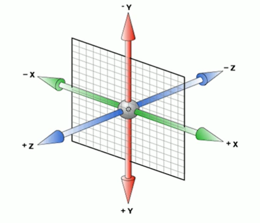

# CSS理论

## 样式的书写位置

### 行内样式

```css
<span style="color: red;">内联样式</span>
```

### 内嵌样式

用的最多，把需要用的css代码都集中放到style标签里面

```css
<style type="text/css">
  span{
    color: red;
  }
</style>
<span>内嵌样式</span>
```

### 链接样式

如果css代码很多的话，可以单独打包到一个文件里面，然后这样导入，做到html和css的分离。

```css
<link rel="stylesheet" href="" type="text/css">
```

### 导入样式

跟链接样式类似，可以导入外部的css代码，不过这个是写在style里面的。一共有6种写法。

```css
<style>
  @import 某某某;
  @import '';
  @import "";

  @import url();
  @import url('');
  @import url("");
</style>
```

也就是说css不关心引号的写法，没有也可以。

# 元素的显示模式

## 块级元素

- 独占一行
- 高度、宽度、内外边距都可以控制
- 默认宽度是父元素的100%
- 里面可以放行内或块级元素
- `<p>、<h1>`这种文字类的标签，里面不允许放入块级元素。


常见的有`<h1>到<h6>、<div>、<ul>、<ol>、<li>`


## 行内元素

- 一行可以有多个行内元素
- 不能直接设置宽高
- 宽度由其内容撑起
- 行内元素只能容纳文本或者其他行内元素
- 特别的`<a>`里面不允许再放a标签了。但是a标签里面允许放入块级元素。不过为了安全，最好把a标签先转成块级元素。


常见的有`<a>、<span>、<strong>`等

## 行内块元素

- 一行可以有多个元素
- 宽度由内容撑起
- 宽度、高度、内外边距可以直接控制


常见的有`、<input/>、<td>`等

## 显示模式的转化

有时候，一些行内元素也需要转化成块级元素。比如说a标签，我们有时候需要a标签的面积比较大，以便用户点击，但是又设置不了其宽高，这就很不方便。此时我们就可以使用`display`属性就可以进行转化了。

```css
a{
  display: block; /*转化为块级元素*/
  width: 100px;
  height: 100px;
  background-color: blanchedalmond;
}
```

同样的，有时候我们也需要转化成其他的元素。

```css
display: block; /*转化为块级元素*/
display: inline; /*转化为行内元素*/
display: inline-block; /*转化为行内块元素*/

display: none; /*隐藏该元素*/
```


# CSS样式的特性

## 层叠性

css中，如果设置相同的样式，那么新设置的会覆盖掉原来的。

```css
div{
  background-color: rosybrown;
  background-color: pink;
}
/*最终会留下来pink*/
```

## 继承性

css中，子标签会继承父标签的部分样式。

```css
div {
  color: red;
}
```

```html
<div>
	<span>我的颜色是继承来的</span>
</div>
```


继承的属性主要都是文字和颜色相关的。

- font-开头的
- text-开头的
- line-开头的
- color

## 选择器的权重

如果两个选择器对同一个元素进行样式的设置，那么究竟以谁的为准呢？

```css
#box1{
  color: slateblue;
}
div {
  color: red;
}
```

```html
<div id="box1">我是div</div>
```

答案是以id选择器为准，这是因为css的选择器实际上有一套隐藏的权重，根据选择器的权重来判断最终的样式。


| 选择器               | 权重   |
| -------------------- | ------ |
| 通配符选择器、继承   | 0000   |
| 元素选择器           | 0001   |
| 类选择器、伪类选择器 | 0010   |
| ID选择器             | 0100   |
| 行内样式             | 1000   |
| !important           | 无穷大 |


要注意两点

1. 继承的权重是0

```css
#box1{
  color: slateblue;
}
p {
  color: red;
}
```

```html
<div id="box1">
  <p>我是div的子元素</p>
</div>
```

最终文字会是红色，因为id选择器给父元素设置的样式权重是0，也就是说只要子元素设置了样式，就会覆盖掉父元素的。

其实这个用的很多，比如说a标签等一些标签就会有默认的样式，其本质就是：

```css
a {
  text-decoration: underline;
  color: blue;
}
```

所以对body设置样式`body{color:red;}`，你会发现a标签根本没有变化。这就是因为body的样式继承到a之后，权重为0.然后被a标签的元素选择器给覆盖掉了。


2. `!important`的权重是无穷大

```css
div{
  color: slateblue !important;
}
#box1 {
  color: red;
}
```

```html
<div id="box1">
  我是div
</div>
```

最终颜色会是蓝色，因为设置了`!important`之后，样式的权重就会无穷大。

## 权重的叠加

对于复合选择器，选择器的权重则是各个选择器权重的和。

```css
li {
  color: darkblue;
}

ul li {
  color: darkred;
}
```

```html
<ul>
  <li>html</li>
  <li>css</li>
  <li>JavaScript</li>
</ul>
```

在本例中，颜色最终会变成darkred。因为ul是一个元素选择器，权重为1；li权重也是1，两个一加权重就是2了。比单独一个li权重大。所以最终是暗红色。


要注意`a:hover`这种选择器权重是11。a是1，伪类选择器是10，一加是11。

# 基本样式速查

## 文字相关

### 复合属性

```css
font: font-style font-weight font-size/line-height font-family; /*书写顺序*/
font: normal 400 20px/1.5 '微软雅黑';
```

其中 font-size 和 font-family 属性不能省略。

```css
font: 20px '微软雅黑';
```

### 字符间距

```css
letter-spacing: 20px;
```


### 文字竖向排列

```css
writing-mode: tb-rl;
```

```css
writing-mode: vertical-rl;
text-orientation: upright;
```


### 文字颜色

```css
color: black;
color: #bababa;
color: rgb(165, 70, 70);
```


### 文字大小

```css
font-size: 19px;
```

要注意！

```css
body{
	font-size: 19px;
}
```

这种情况对h1等h标签不起作用，标题标签比较特殊，需要单独设置。

```css
h1{
	font-size: 19px;
}
```

### 文字加粗

```css
font-weight: 700; /*bold粗细*/
font-weight: 400; /*正常粗细*/
font-weight: bold;
font-weight: normal;
```

### 斜体

```css
font-style: italic; /*字体倾斜*/
font-style: normal; /*恢复正常*/
```


### 文本对齐

```css
text-align: center; /*文字居中*/
text-align: left; /*文字左对齐*/
text-align: right;  /*文字右对齐*/
```


### 文本装饰

```css
text-decoration: none; /*啥都没有*/
text-decoration: underline; /*下划线*/
text-decoration: overline; /*上划线*/
text-decoration: line-through; /*删除线*/
```


### 行间距

```css
line-height: normal; /*默认值，自动设置合理的行间距*/
line-height: 20px;
line-height: 2; /*代表行间距是文字大小的2倍（2*font-size）*/
```

| 值      | 描述                                                 |
| ------- | ---------------------------------------------------- |
| normal  | 默认。设置合理的行间距。                             |
| 某数字  | 设置数字，此数字会与当前的字体尺寸相乘来设置行间距。 |
| 某某px  | 设置固定的行间距。                                   |
| %       | 基于当前字体尺寸的百分比行间距。                     |
| inherit | 规定应该从父元素继承 line\-height 属性的值。         |

行间距包括了三部分

- 上边距
- 文字
- 下边距

而文字的大小是固定的，font-size设置了多少就是多少，所以改变行间距本质上就是改变上下边距的大小。例如我字体大小是20px，行间距是24px，那么上下边距就是2px。要注意：上下边距一定是相等的。


### 文字阴影

```css
text-shadow: 10px 5px 2px #FF0000;
```

| 参数       | 描述                                   |
| ---------- | -------------------------------------- |
| 第一个参数 | 必需。阴影离文字的水平距离。允许负值。 |
| 第二个参数 | 必需。阴影离文字的垂直距离。允许负值。 |
| 第三个参数 | 可选。代表这个阴影有多模糊。           |
| 第四个参数 | 可选。阴影的颜色。                     |


### 首行缩进

```css
text-indent: 2em; /*1em就是当前元素一个文字的大小*/
text-indent: 10px;
```


### 字体族

这个可以指定字体，默认从左开始，如果电脑没有装这个字体，就会使用右边的字体。如果都没有，就会使用浏览器默认字体。

```css
font-family: '微软雅黑',"Times New Roman",Georgia,Serif;
```

如果字体中间有空格，需要加引号，如果没有可以不加。


除了加载本地字体，也可以加载外部字体

```css

@font-face {
    font-family:"" ;
    src: url('');
}
```


### 禁止文本换行

```css
p
{
    white-space: nowrap;
}
```

### 文本省略

需要同时设置三个属性

```css
white-space: nowrap;
overflow:hidden;
text-overflow: ellipsis;
```


## 列表相关

```css
list-style:none;
```


## 背景相关

### 复合属性

```css
background: 颜色 图片url 是否重复 位置是否固定 位置坐标;
background: black url() no-repeat fixed center center;
```


### 背景颜色

背景颜色默认都是透明的

```css
background-color: transparent; /*默认透明*/
background-color: gray;
background-color: #bfc;
background-color: rgb(red, green, blue);
background-color: rgba(red, green, blue, alpha); /*alpha在0到1之间*/
```


### 背景图片

```css
background-image: none; /*默认没有背景图片*/
background-image: url("");
```


### 背景图片重复

```css
background-repeat: repeat; /*默认，xy轴都重复*/
background-repeat: no-repeat; /*背景图像将仅显示一次*/
background-repeat: repeat-x; /*只在x轴重复*/
background-repeat: repeat-y; /*只在y轴重复*/
```

### 背景尺寸

```css
background-size: 50px;
background-size: contain;  /*等比缩放，占满整个容器，但是会留白*/
    background-size: cover;/*同样是等比缩放，但是不会留白，因此有一部分图片会看不见*/
```


### 背景开始的位置

设置background-attachment:fixed;才能兼容 Firefox 和 Opera 浏览器。

```css
background-attachment: fixed;/*兼容Firefox 和 Opera 浏览器*/
```


`background-position`有两个值，第一个是x轴的坐标，第二个是y轴的。

```css
background-position: 20px 50px; /*离左侧20px，离顶部50px*/
background-position: right center; /*水平右对齐，垂直居中*/
```

其中`right center`和`center right`顺序可以互换。因为right只能表示水平方向，所以center只能是垂直方向。两边互换浏览器也能分析出来。**也就是说方位名词的顺序可以互换**。

如果只写了一个参数，那么另一个默认是center

```css
background-position: right;/*第二个参数默认是center*/
```


常用的位置：

```css
background-position: left top;/*左上角*/
background-position: center top;/*上*/
background-position: right top;/*右上角*/

background-position: left center;/*左*/
background-position: center center;/*中间*/
background-position: right center;/*右*/

background-position: left bottom;/*左下角*/
background-position: center bottom;/*下*/
background-position: right bottom;/*右下角*/
```


### 背景附着

```css
background-attachment: fixed; /*背景位置固定*/
background-attachment: scroll; /*背景滚动*/
```

注意！在使用radial-gradient等情况的时候，建议加上这个，可以方式背景重复

### 背景渐变


1. 径向渐变

   ```css
   background-image: radial-gradient(circle, red 5%, green 15%, blue 60%);
   ```

2. 线性渐变

   ```css
   background-image: linear-gradient(#e66465, #9198e5);
   ```

   

## 尺寸相关

### 宽度

```css
width:100px;
```


### 溢出

如果你的文本过大，超过了设计的尺寸，就会发生溢出

```css
overflow: visible; /*默认，即使超出也可见*/
overflow: scroll;/*显示滚动条*/
overflow: hidden;/*不显示*/

/*也可以单独设置xy方向的溢出*/
overflow-y: visible;
overflow-x: visible;
```


## 边框相关


## 鼠标相关

一般搭配伪类使用


### 鼠标悬停样式

| 值         | 描述                                                |
| ---------- | --------------------------------------------------- |
| url        | 想传送的url                                         |
| default    | 默认光标（通常是一个箭头）                          |
| auto       | 默认。浏览器设置的光标。                            |
| crosshair  | 光标呈现为十字线。                                  |
| pointer    | 光标呈现为指示链接的指针（一只手）                  |
| move       | 此光标指示某对象可被移动。                          |
| e\-resize  | 此光标指示矩形框的边缘可被向右（东）移动。          |
| ne\-resize | 此光标指示矩形框的边缘可被向上及向右移动（北/东）。 |
| nw\-resize | 此光标指示矩形框的边缘可被向上及向左移动（北/西）。 |
| n\-resize  | 此光标指示矩形框的边缘可被向上（北）移动。          |
| se\-resize | 此光标指示矩形框的边缘可被向下及向右移动（南/东）。 |
| sw\-resize | 此光标指示矩形框的边缘可被向下及向左移动（南/西）。 |
| s\-resize  | 此光标指示矩形框的边缘可被向下移动（南）。          |
| w\-resize  | 此光标指示矩形框的边缘可被向左移动（西）。          |
| text       | 此光标指示文本。                                    |
| wait       | 此光标指示程序正忙（通常是一只表或沙漏）。          |
| help       | 此光标指示可用的帮助（通常是一个问号或一个气球）。  |


## 列表

```css
list-style-type:none
```


## 其他常用样式

### 透明

请设置在[0-1]之间

```css
opacity: 值;
```

### 圆角

```css
/*默认全部角*/
border-radius: 25px;
/*分别设置*/
border-radius: 15px 50px 30px 5px:
```

## 禁止用户选中

```css
 user-select:none;
```


## 盒子阴影

```css
box-shadow: h-shadow v-shadow blur spread color inset;
box-shadow: 15px 15px 20px 10px black;
```

| 值         | 说明                                                         |
| :--------- | :----------------------------------------------------------- |
| *h-shadow* | 必需的。水平阴影的位置。允许负值                             |
| *v-shadow* | 必需的。垂直阴影的位置。允许负值                             |
| *blur*     | 可选。模糊距离，就是有多糊。                                 |
| *spread*   | 可选。阴影的大小                                             |
| *color*    | 可选。阴影的颜色。在[CSS颜色值](https://www.runoob.com/cssref/css_colors_legal.aspx)寻找颜色值的完整列表 |
| inset      | 可选。内阴影，元素凹进去的感觉。                             |


# 盒模型

## 概述

盒模型相关的样式包括:

- 内外边距
- 边框

CSS认为,每一个文档的元素都是一个盒子,这个盒子包括自身的大小,边框大小,内边距和外边距.如下图:


如果在浏览器(以chrome为例)里面用开发者工具查看,可以发现,实际上内外边距,外边距还有边框都是占地方的,

```css
p{
  border: #ADFF2F 10px solid;
  padding: 20px;
  margin: 30px;
  width: 50px;
  height: 50px;
}
```


这些样式的区别就在于,内边距是算在元素本身的大小里面的,啥意思呢,就比如你元素宽20px,内边距你两边各加10px,那么你这个元素整体就宽40px.边框也是一样的,但是外边距不会算在元素里面。

**也就是说内边距和边框会影响盒子大小。**

## 边框

### 概述

一个元素有上下左右四个边框(废话),css允许分别定义各个方向上边框的样式.比如说

```css
border-color:red green blue pink;
```

分别为上,右,下,左指定不同颜色.也就是从上开始,顺时针排列.

<p style="border-style:solid; border-color:red green blue pink;border-width:5px;width:100px;height:100px"></p>


```css
border-color:red green blue;
```

如果只写三个,那么第一个是上边框,第二个是左右边框,第三个是下边框.

<p style="border-style:solid; border-color:red green blue;border-width:5px;width:100px;height:100px"></p>

```css
border-color:red green;
```

只写两个的话就是上下边框,左右边框

<p style="border-style:solid; border-color:red green;border-width:5px;width:100px;height:100px"></p>

```
border-color:red;
```

一个的话肯定就是全部红喽;

<p style="border-style:solid; border-color:red;border-width:5px;width:100px;height:100px"></p>

这样分别指定样式的操作,在边框里面是通用的,也可以来指定宽度,表现等.如果不想这样隐式指定,也可以显示指定.

```css
border-top-width: 15px;
border-right-color: blue;
border-left-style: solid;
border-bottom-color: red;
```

像这样子,直接指定也是可以的.

**注意:!!!!!!!!!!!!!!只有把width,style和color都指定了之后才能正常显示边框,否则不会显示!!!!!!!!!!!!!!!!!!.**

### 边框样式

```css
border-style: solid;
```

| 值      | 描述                                                         |
| ------- | ------------------------------------------------------------ |
| none    | 定义无边框。                                                 |
| hidden  | 与 "none" 相同。不过应用于表时除外，对于表，hidden 用于解决边框冲突。 |
| dotted  | 定义点状边框。在大多数浏览器中呈现为实线。                   |
| dashed  | 定义虚线。在大多数浏览器中呈现为实线。                       |
| solid   | 定义实线。                                                   |
| double  | 定义双线。双线的宽度等于 border\-width 的值。                |
| groove  | 定义 3D 凹槽边框。其效果取决于 border\-color 的值。          |
| ridge   | 定义 3D 垄状边框。其效果取决于 border\-color 的值。          |
| inset   | 定义 3D inset 边框。其效果取决于 border\-color 的值。        |
| outset  | 定义 3D outset 边框。其效果取决于 border\-color 的值。       |
| inherit | 规定应该从父元素继承边框样式。                               |

### 边框宽度

```css
border-width: 20px;
```

| 值      | 描述                           |
| ------- | ------------------------------ |
| thin    | 定义细的边框。                 |
| medium  | 默认。定义中等的边框。         |
| thick   | 定义粗的边框。                 |
| 某某px  | 自定义宽度                     |
| inherit | 规定应该从父元素继承边框宽度。 |

### 边框颜色

```css
border-color:red green blue pink;
```

跟字体颜色一样,详情参考颜色表.

### 边框合并

```css
border-collapse: collapse;
```

### 边框圆角化

```css
border-radius: 10px;
```

这个玩意的原理，就是用一个半径为10px的圆和四条边做切线，半径越大，角就越圆。


  <div style="width: 200px;
  height: 200px;
  background-color: darksalmon;">
  <div style="  width: 100px; height: 100px;
  background-color: darkseagreen;
  border-radius: 50%;">
  </div></div>


根据这个原理，我们可以制造出圆形和圆角矩形

```css
border-radius: 50%; /*圆形，值为宽度的一半*/
border-radius: 高度的一半; /*圆角矩形*/
```


圆角属性也可以分别设置四个角，从左上角开始，顺时针转一圈。也可以单独设置。

```css
border-top-left-radius: 10px; /*左上角*/ 
border-top-right-radius: 10px;  /*右上角*/
border-bottom-left-radius: 10px; /*左下角*/
border-bottom-right-radius: 10px; /*右下角*/
```


### 简写

因为边框想要生效必须指定三个属性,写起来确实很麻烦,为了增加程序员的寿命,HTML支持边框的简写

```css
border:5px solid red;
```

像这样,可以一次性设置三个属性.

## 内边距

```css
padding: 20px;
padding-left: 20px;
padding-right: 20px;
padding-top: 20px;
padding-bottom: 20px;
```


**若设置width，padding会增加盒模型的大小。但是若不设置width，则不会影响其大小。**

```css
/*在这种情况下，子元素没有设置width，虽然设置了padding，但是不会超过父元素的width*/
#box1 {
  width: 200px;
  height: 200px;
  background-color: darksalmon;
}

#box2 {
  padding: 20px;
  background-color: darkseagreen;
}

/*子元素一旦设置了width，那么padding就会把盒子撑大从而超过父元素的width*/
#box1 {
  width: 200px;
  height: 200px;
  background-color: darksalmon;
}

#box2 {
  width:100%;
  padding: 20px;
  background-color: darkseagreen;
}
```

```html
<div id="box1">
	<div id="box2">内盒子</div>
</div>
```


第一种虽然设置了padding，但是不会影响盒子大小

<div style=" width: 200px; height: 200px; background-color: darksalmon; margin:0 auto;">
	<div style="padding: 20px; background-color: darkseagreen;">内盒子</div>
</div>


第二种加了width，则会影响盒子大小。

<div style=" width: 200px; height: 200px; background-color: darksalmon; margin:0 auto;">
	<div style=" width: 120%; padding: 20px; background-color: darkseagreen;">内盒子</div>
</div>


## 外边距

### 概述

```css
margin: 10px;
```


对于一个块级盒子，可以设置外边距使其水平居中

```css
margin: 0 auto;
```


**注意！对于行内元素，请只设置左右的外边距。如果非要设置，请转换成块级元素。**

### 外边距塌陷

当子元素和父元素同时设置了 `margin-top`属性时，子元素并不会真的和父元素有外边距。而是和父元素的外边距重叠。值为其中较大的那项。

```css
#box1 {
  width: 200px;
  height: 200px;
  background-color: darksalmon;
  margin-top: 100px;
}

#box2 {
  width: 100px;
  height: 100px;
  background-color: darkseagreen;
  margin-top: 50px;
}
```

```html
<div id="box1">
  <div id="box2"></div>
</div>
```


可以看到，子元素并没有向下移动，而是和父元素整体向下了。而且向下的值为max(100px,50px)。

### 外边距坍塌的解决

1. 为父元素设置上边框

```css
#box1 {
  width: 200px;
  height: 200px;
  background-color: darksalmon;
  margin-top: 100px;
  border-top: 1px solid transparent;
}
```

2. 为父元素设置上内边距

```css
#box1 {
  width: 200px;
  height: 200px;
  background-color: darksalmon;
  margin-top: 100px;
  padding-top: 1px;
}
```

3. 为父元素设置`overflow: hidden;`

```css
#box1 {
  width: 200px;
  height: 200px;
  background-color: darksalmon;
  margin-top: 100px;
  overflow: hidden;
}
```

## 清除网页默认的内外边距

网页自带内外边距，我们在写代码时需要先手动清除。

```css
* {
  margin: 0;
  padding: 0;
}
```

# 选择器

## 基本选择器

### 通配符选择器

就是全选的意思,选中html文档中所有的元素.

```css
*{
  margin:0;
  padding:0;
}
```

### 元素选择器

可以直接选择某一个标签,然后直接对HTML中所有这种标签进行批量编辑.

```css
p{
  color:red;
}
```

这个就是让所有p标签内部文字颜色变为红色.

### 类选择器

可以批量选择自定义的类,用于某一类特定的标签。

**而且在html中，一个标签可以指定多个类，但是要用空格隔开。**

html:

```html
<ul>
  <li class="blue">java</li>
  <li class="blue">c#</li>
  <li class="blue">sql</li>
  <li class="blue big">css</li>
</ul>
```

css:

```html
<style type="text/css">
	.blue{
		color:blue
	}
  .big{
    font-size:30px;
  }
</style>
```

一般类选择器选择的都是某一类标签,在需要添加这个类的标签前面加上`class`,后面可以指定想要的类,类名可以随便起.在css里面用点类名的办法,选择所有该类.

一般来说,类选择器都是批量选择很多该类的标签,比如说ul的列表,li有很多很多条,为每一个li单独设计样式岂不是累死了,所以可以给他们起一个类名item,批量添加这些li的样式.

### ID选择器

只能选择某一个特定的标签,一般只有一些特殊含义的标签才用起ID.还是刚才的例子.

html:

```html
<ul id="language-list">
  <li class="item">java</li>
  <li class="item">c#</li>
  <li class="item">sql</li>
  <li class="item">css</li>
</ul>
```

css:

```html
<style type="text/css">
	#language-list{
		color:blue
	}
</style>
```

ID选择器中,css用#加ID名就可以选中标签,一般一个网页里面这个语言列表可能就这么一个,所以比较特殊,可以用ID选择器来选中,直接操作这个标签.

## 复合选择器

### 包含选择器

选择所有div里面所有的span标签，子元素里面的span标签也会被选上，

```css
div span{
	color:red;
}
```

```html
<div>
  <span>外层span</span>
  <ul>
    <li> <span>里面的span</span> </li>
  </ul>
</div>
```


### 子选择器

选择div下的子元素，只能选择最近一层子元素，也就是亲儿子。里面的span不会被选上。

```css
div > span{
	color:red;
}
```

```html
<div>
  <span>外层span</span>
  <ul>
    <li> <span>里面的span</span> </li>
  </ul>
</div>
```


### 相邻选择器

说是选相邻，其实也不是真正的相邻元素，它只能按照+前后的顺序排列的元素，也就是说#s1之后必须是#s2，顺序颠倒也不行。

```html
<head>
	<style>
		#s1 + #s2{
			color:red;
		}
	</style>
</head>
<body>
		<div>
			<span id="s1">s1</span>
			<span id="s2">s2</span>
			
		</div>
</body>
```

### 兄弟选择器

相邻选择器选择的元素必须是相邻的同级元素，而兄弟选择器的要求就低一点了，只要是在#s1后定义的#s2就能被选中，中间可以不用相邻，隔着其他元素也可以。

```html
<head>
	<style>
		#s1 ~ #s2{
			color:red;
		}
	</style>
</head>
<body>
		<div>
			<span id="s1">s1</span>
			<span></span>
			<span id="s2">s2</span>
		</div>
</body>
```

### 并集选择器

如果你想同时给多个不同元素设置样式，可以用并集选择器

```css
body, h2, p, table, th, td, pre, strong, em {color:gray;}
```

像这样，彼此之间用逗号隔开，表示同时选中。

## 伪类选择器

名字虽然很酷，其实没那么复杂，这个玩意可以来操作一些特殊的类，比如超链接的样式，输入框聚焦后的样式等等。写法就是在需要添加的元素后面冒号，然后加入想加入的伪类即可。

### 动态伪类

#### 锚点伪类

```css
a:link {color: #FF0000}		/* 未被访问的超链接 */
a:visited {color: #00FF00}	/* 已访问的链接 */
```

#### 行为伪类

```css
a:hover {color: #FF00FF}	/* 鼠标移动到超链接上的时候 */
a:active {color: #0000FF}	/* 鼠标点下去的一瞬间 */
input:focus{color: #bfbfbf;} /*获取到焦点后，一般用于文本框*/	
```


#### 顺序问题

注意！！！！！

这几个伪类在书写时顺序不能乱动，必须按照下面的顺序来，否则不能正常显示。

```css
a:link{

}
a:visited{

}
a:hover{

}
a:active{

}
```


### 结构伪类

#### first-child

顾名思义,就是选择第一个子元素,但是这里面有很多坑,必须注意

先看html:

```HTML
<p><span>我是span</span>我是p</p>
<p><span>我是span</span>我是p</p>
```


- 选择所有p标签中,第一个p标签

```css
p:first-child{
  color: red;
} 
```


- 选择所有p标签内部第一个子元素

```css
p>:first-child {
	color: red;
}
```


#### before和after

可以用这两个伪类,在某个元素前面或后面插入文本.用content来控制文本内容.

```css
p:before
{
	content:"我是before加的";
}
p:after
{
	content:"我是after加的";
}
```

### 状态伪类

这个是用来选择表单元素的。

- enabled

选中所有可用的表单元素

```html
<head>
	<style>
		input:enabled{
			color: #bfbfbf;
		}	
	</style>
</head>
<body>
	<form action="">
		<input type="text">
		<input type="button" value="按钮">
	</form>
</body>
```

此时将会把文本框和按钮都选中，因为默认情况下表单元素是enabled

- disabled

选中所有不可用的表单元素

```html
<head>
	<style>
		input:disabled{
			color: red;
		}	
	</style>
</head>
<body>
	<form action="">
		<input type="text">
		<input type="button" value="按钮" disabled>
	</form>
</body>
```


## 属性选择器

如果你想选择带某个属性的标签,可以用属性选择器.但是里面也有很多坑,需要注意.

- 指定某种属性

```css
a[href] {color:red;}
```

这个例子就是选择所有有href属性的a标签.也可以同时指定多个属性:

- 指定同时具有多种属性

```css
a[href][title] {color:red;}
```

这个就是选择同是有href和title属性的a标签

- 精确指定某个具体属性

```css
p[class="A B"] {color:red;}
```

选择某个有具体属性的标签,注意这个要求严格等于,也就是说你的class也必须是"A B",多一个空格都不行.这时候我们就可以使用下面的写法了.

- 含有某种属性

```css
p[class~="A"] {color: red;}
```

用这个~可以表示含有A的class,不用严格匹配.

属性选择器也支持三种正则语法:

- 包含某字符串的属性

```css
a[href*="dashepi.com"] {color: red;}
```

选择a标签的超链接中包含"dashepi.com"这个字符串的所有a标签

- 以某字符串开头的属性

```css
a[href^="www."] {color: red;}
```

选择href以"www."开头的a标签

- 以某字符串结尾的属性

```css
a[href$=".cn"] {color: red;}
```

选择href以".cn"结尾的a标签

- 以xxx-开头或者值为xxx的标签

  ```css
  /* 写 显示图片阴影 */
  
  img[alt|="shadow"] {
      box-shadow: var(--shadow);
  }
  
  ```

  

1. 


# 浮动带来的问题


## 高度塌陷


## 清除浮动

我们布局时，父元素的高度有时候并不是确定的，比如说纵向的导航栏，数量有可能改变。所以说我们不能把高度写死。但是不写高度又会发生高度塌陷。怎么办呢？

这时候就需要我们来想办法解决高度塌陷了。这就是我们大名鼎鼎的*清除浮动*。

清除浮动有三种方法：

- 额外标签法

在子元素的最后面额外加一个标签。**而且必须是块级元素**。

```html
<div id="box1">
  <div id="box2">我是box1的子元素</div>
  <div style="clear: both;"></div>
</div>
<div id="box3">
  我是box1的兄弟元素，我在box1下面。因为块级元素独占一行啦。
</div>
```

- 给父元素添加overflow

属性设置为`hidden、scroll、auto`都可以。

- 增加`:after`伪元素，本质上就是给子元素后面再增加一个空元素。然后清除浮动。

```css
.clearfix::after {
  content: "";
  display: block;
  height: 0;
  clear: both;
  visibility: hidden;
  *zoom: 1;/*兼容IE6和7*/
}
```


## 清除浮动最终解决代码

只要给父元素加上这个类就可以了。

不用管它什么意思

```css
.clearfix::before,
.clearfix::after {
  content: "";
  display: table;
  height: 0;
  clear: both;
  visibility: hidden;
}

.clearfix {
  /*兼容IE6和7*/
  *zoom: 1;
}
```


# BFC

## 概述

BFC(Block formatting context)直译为"块级格式化上下文"。如果开启了BFC，元素就会被单独划分一个BFC的渲染区域，不会影响外界。BFC可以理解为元素的一个隐藏属性。

如果在布局的时候出现了不符合预期的时候，就可以开启BFC。


## 开启BFC

1. 根元素`<html>`
2. 设置浮动，并且float不是none
3. 设置绝对定位，position为absolute或者fixed
4. 设置overflow，除了visible和clip都可以
5. contain值为layout、content、paint的元素
6. 设置display为flow-root等


## 高度塌陷

刚才我们说过，一般，浮动的元素都要有一个文档流的父元素，以便布局。

```css
#box1 {
  height: 200px;
  /*如果不加，那么就会高度塌陷 */
  background: skyblue;

}

#box2 {
  float: left;
  width: 100px;
  height: 100px;
  background: lightcoral;
}

#box3 {
  width: 300px;
  height: 300px;
  background: lightblue;
}
```

```html
<div id="box1">
  <div id="box2">我是box1的子元素</div>
</div>
<div id="box3">
  我是box1的兄弟元素，我在box1下面。因为块级元素独占一行啦。
</div>
```


你会发现，我这个父元素加了一个height之后，才能显示背景颜色。如果把height去掉，背景颜色就会消失。也就是说如果子元素浮动，那么父元素的高度就会塌陷为0。**也就是说父元素无法被浮动的子元素撑开**。而文档流中，父元素会被子元素撑开的。

```css
#box1 {
  /* height: 200px; 如果不加，那么就会高度塌陷 */
  background: skyblue;

}
#box2{
  float: left;
  width: 100px;
  height: 100px;
  background: lightcoral;
}
#box3{
  width: 300px;
  height: 300px;
  background: lightblue;
}
```

```html
<div id="box1" >
  <div id="box2">我是box1的子元素</div>
</div>
<div id="box3">
  我是box1的兄弟元素，啊嘞嘞？我怎末跑上面来了？我兄弟人没了？
</div>
```

解决：在父元素添加`overflow: hidden`

## 外边距塌陷

当两个div都设置了外边距的时候，

1. 两个块元素是父子关系
2. 两个块元素上下挨着

```html
<div style="width: 100px; height: 100px; background-color: skyblue;  margin-bottom: 100px;">外边距怎末只有100px！！</div>

<div style="width: 200px; height: 200px; background-color: blueviolet; margin-top: 100px;">纳尼！</div>
```


## 浮动元素覆盖

```html
<div style="width: 100px;  height: 100px;float: left; background-color: blue; "></div>
<div style="height: 200px;width: 200px;background-color: red;"></div>
```

<div style="width: 100px;  height: 100px;float: left; background-color: blue; "></div>
<div style="height: 200px;width: 200px;background-color: red;"></div>


如果开启了BFC，元素之间就不会相互干扰了


```html
<div id="test1" style="width: 100px;  height: 100px;float: left; background-color: blue; "></div>
<div id="test2" style="height: 200px;width: 200px;background-color: red; overflow: hidden;"></div>
```

<div id="test1" style="width: 100px;  height: 100px;float: left; background-color: blue; "></div>
<div id="test2" style="height: 200px;width: 200px;background-color: red; overflow: hidden;"></div>


# 传统布局

传统布局使用`dispaly、float、position`这三个属性来布局。

## position

- static

  默认的布局，从上到下，从左到右

- relative

  相对定位，相对于原本的位置偏移，不脱离文档流

- absolute

  绝对定位，相对于包含自己的容器定位，脱离文档流

- fixed

  固定定位，相对于浏览器可视窗口定位

- sticky

  相当于relative+fixed，在移动到某个地方之后开启固定定位

  ```html
  <div  style="height: 200px; overflow:scroll;">
      <p style="background-color:lightgrey; position:sticky; top: 0px;">This is header A</p>
      <p>This is content A</p>
      <p>This is content A</p>
      <p>This is content A</p>
      <p>This is content A</p>
  
      <p style="background-color:lightgrey; position:sticky; top: 0px;">This is header B</p>
      <p>This is content B</p>
      <p>This is content B</p>
      <p>This is content B</p>
      <p>This is content B</p>
  
      <p style="background-color:lightgrey; position:sticky; top: 0px;">This is header C</p>
      <p>This is content C</p>
      <p>This is content C</p>
      <p>This is content C</p>
      <p>This is content C</p>
  
      <p style="background-color:lightgrey; position:sticky; top: 0px;">This is header D</p>
      <p>This is content D</p>
      <p>This is content D</p>
      <p>This is content D</p>
      <p>This is content D</p>
  
  </div>
  ```


## float


```css
float: none;
float: left;
float: right;
```

一旦加了浮动的属性，就会出现一些特殊的特性

- **浮动元素会脱离文档流**，不再保留原先的位置。
- **浮动元素会具有行内块元素的特性**。也就是说，如果行内元素浮动，那么就不需要转化成行内块元素。
- 浮动的元素，会自动往上面飘。比如说设置了left，就会向左上角飘。而且浮动的元素顶端都是对齐的。**但是要注意，浮动的元素还是受父元素的约束。也就是说向左飘，也无法飘出父盒子的范围**。


所谓的浮动，正如字面含义一样，确确实实是漂浮起来了。也就是说，没有浮动的元素，会自动往上跑。浮动的元素会把它给盖住。

```css
  <div style="width: 100px; height: 100px; background-color: skyblue; float: left;">我浮动起来了</div>
  <div style="width: 200px; height: 200px; background-color: blueviolet;">我被挡住了</div>
```


# Flex布局

传统的网页布局是靠 [`display`](https://developer.mozilla.org/en-US/docs/Web/CSS/display) 属性 + [`position`](https://developer.mozilla.org/en-US/docs/Web/CSS/position)属性 + [`float`](https://developer.mozilla.org/en-US/docs/Web/CSS/float)属性完成的，不仅难用，而且bug频出。后来W3C忽悠引出了flex布局，用于替代传统布局。

flex是Flexible Box的缩写，意思是弹性布局。采用了flex布局的元素被称为flex容器（flex container），它的子元素会自动成为flex项目（flex item）

开启flex的方式为：

```css
display:flex;
```

以下是几个注意点：

- 父元素设置了flex属性之后，子元素的行内元素就可以设置大小了。
- 父元素设置了flex属性之后，子元素的`float`、`clear`和`vertical-align`属性将失效。
- 子元素不会自动换行，flex会自动调整子元素大小，保证在一行内能装下。


## 父元素的属性

- flex-direction：主轴方向
- flex-wrap：控制换行
- justify-content：主轴上子元素的排列方式
- align-content：控制侧轴上子元素的对齐方式（多行）
- align-items：控制侧轴上子元素的对齐方式（单行）
- felx-flow：符合属性，相当于设置了`flex-direction`和`flex-wrap`

### flex-direction

主轴方向，**默认主轴方向水平向右。**

| 值             | 作用                   |
| -------------- | ---------------------- |
| row（默认值）  | 水平方向，方向从左到右 |
| row-reverse    | 水平方向，方向从右到左 |
| column         | 垂直方向，方向从上向下 |
| column-reverse | 垂直方向，方向从下向上 |

### justify-content

主轴上元素的排列方式，假设主轴方向为默认值。

| 值                   | 作用                                     |
| -------------------- | ---------------------------------------- |
| flex-start（默认值） | 从主轴开始的位置排列元素，也就是靠左对齐 |
| flex-end             | 从主轴最后的位置排列元素，也就是靠右对齐 |
| center               | 元素居中排列                             |
| space-around         | 元素在主轴上均匀分布                     |
| space-between        | 先贴紧两边，再平均排列剩余的元素         |

### flex-wrap

控制元素是否换行。flex布局中，子元素不会自动换行，而是会自动调整width，强行加到一行里面。

| 值               | 作用   |
| ---------------- | ------ |
| nowrap（默认值） | 不换行 |
| wrap             | 换行   |

### align-items

控制侧轴上子元素的对齐方式（单行），侧轴就是不是主轴的轴，主轴是x，那么侧轴就是y。主轴是y，那么侧轴就是x。

它的属性和主轴排列是一样的，假设侧轴是从上到下。

| 值                   | 作用                                                         |
| -------------------- | ------------------------------------------------------------ |
| flex-start（默认值） | 从侧轴开始的位置排列元素，也就是靠上对齐                     |
| flex-end             | 从侧轴最后的位置排列元素，也就是靠下对齐                     |
| center               | 元素居中排列                                                 |
| stretch              | 拉伸，将子元素的高度拉到和父元素一样。**前提是不能给子元素设置高度** |
| baseline             | 沿着子元素中的第一行文字对齐                                 |

### align-content

如果子元素设置了`flex-wrap`，也就是变成了多行，此时就可以使用这个属性了。

| 值                   | 作用                                     |
| -------------------- | ---------------------------------------- |
| flex-start（默认值） | 从主轴开始的位置排列元素，也就是靠上对齐 |
| flex-end             | 从主轴最后的位置排列元素，也就是靠下对齐 |
| center               | 元素居中排列                             |
| space-around         | 元素在侧轴上均匀分布                     |
| space-between        | 先贴紧上下，再平均排列剩余的元素         |
| stretch              | 设置子元素均分父元素的高度               |

### felx-flow

符合属性，相当于设置了`flex-direction`和`flex-wrap`。

```css
flex-flow:row wrap;
```


## 子元素的属性

### flex

这个属性代表了子元素在分配剩余空间时的权重。也就是说如果有3个子元素，而且都不设定宽度，那么`flex:1;`，就说明每元素的权重都是1，最后结果就是三等分。如果某一个元素的flex是2，就说明它的权重为2，最终它占二分之一，其余元素各四分之一。

```css
flex:1;
```

而且要注意，这个flex分配的是**剩余空间**，假如父元素100xp，有几个子元素已经设定了宽度20px，那么flex将会分配80xp的宽度。

### align-self

可以单独控制某个元素在侧轴上的排列。和`align-items`完全一样。

| 值                   | 作用                                                         |
| -------------------- | ------------------------------------------------------------ |
| flex-start（默认值） | 从侧轴开始的位置排列元素，也就是靠上对齐                     |
| flex-end             | 从侧轴最后的位置排列元素，也就是靠下对齐                     |
| center               | 元素居中排列                                                 |
| stretch              | 拉伸，将子元素的高度拉到和父元素一样。**前提是不能给子元素设置高度** |
| baseline             | 沿着子元素中的第一行文字对齐                                 |

### order

按照数值进行排列，数值越小越靠前。默认值为0。

```css
order:0;
```


# Grid布局

和flex一样，采用了grid布局的元素被称为grid容器（grid container），它的子元素会自动成为grid项目（grid item）。要注意的是，项目只是指第一层的子元素，子元素里面的子元素不是项目。


```html
<style>
    #outer {
        display: grid;


        /* 一行有几个元素，每一个元素有多宽 */
        grid-template-columns: 1fr 1fr 1fr;

        column-gap: 24px;
        /*列间距*/
        row-gap: 24px;
        /*行间距*/

        align-items: center;
        /*垂直方向上对齐元素*/

        /* 水平方向对齐 */
        justify-items: center;


        /* 对整个块进行垂直对齐 */
        align-content: center;
        /* 对整个块进行水平对齐 */
        align-content: center;
        /* grid-template-areas: ""; */
    }

    #outer div {
        background-color: azure;
    }
</style>

<div id="outer">
    <div>1</div>
    <div>2</div>
    <div>3</div>
    <div>4</div>
    <div>5</div>
    <div>6</div>
</div>

```


# 动画

## 定义与使用

定义：

```css
@keyframes 名字{
	from{
		/* 开始的样式  */
	}
	to{
		/* 结束的样式  */
	}
}
```

使用：

```css
#test{
  width: 200px;
  height: 200px;
  background-color: #ADFF2F;
  /* 调用的动画名称 */
  animation-name: 刚刚定义的名字;
  /* 执行动画的时间 */
  animation-duration: 150ms;
}
```

## 动画序列

`from to`只能用于一个过程，一次执行完，如果想要分步执行，可以设置时间点，来设置每一个时间点的状态。

```css
@keyframes move {
	0% {
		transform: translate(0px, 0px);
	}

	25% {
		transform: translate(1000px, 0px);
	}

	50% {
		transform: translate(1000px, 500px);
	}

	75% {
		transform: translate(0px, 500px);
	}

	100% {
		transform: translate(0px, 0px);
	}
}

```

## 常用的属性

| 属性                        | 描述                                                         |
| --------------------------- | ------------------------------------------------------------ |
| @keyframes                  | 规定动画。                                                   |
| animation                   | 所有动画属性的简写属性，除了 animation\-play\-state 属性。   |
| animation\-name             | 规定 @keyframes 动画的名称。                                 |
| animation\-duration         | 规定动画完成一个周期所花费的秒或毫秒。默认是 0。             |
| animation\-timing\-function | 规定动画的速度曲线。默认是 "ease"。                          |
| animation\-delay            | 规定动画何时开始。默认是 0。                                 |
| animation\-iteration\-count | 规定动画被播放的次数。默认是 1。                             |
| animation\-direction        | 规定动画是否在下一周期逆向地播放。默认是 "normal"。          |
| animation\-play\-state      | 规定动画是否正在运行或暂停。默认是 "running"。               |
| animation\-fill\-mode       | none：不改变默认行为。   forwards ：当动画完成后，保持最后一个属性值（在最后一个关键帧中定义）。 |

## 缓慢执行样式

```css
transition: height 1s;
```


# 3D转换 

## 坐标规定

- x轴：水平向右 ，x右边是正值，左边是负值
- y轴︰垂直向下 ，y下面是正值，上面是负值
- z轴︰垂直屏幕 ，往外面是正值，往里面是负值



## 3D位移

可以直接来创建某一方向的位移

```css
transform: translateX(20deg);/*围绕x轴旋转*/
transform: translateY();
transform: translateZ();
```

但是要注意，如果把这三行代码放在一起，后面的会覆盖上面的，所以如果想同时设置多个坐标，需要用其他方法。

```css
transform: translate3d(x,y,z);
```

## 3D透视

就是指的近大远小，**如果想要某一个元素拥有透视，需要给其父元素设置透视**。

```html
<!DOCTYPE html>
<html>
	<head>
		<style>
			#out{
				perspective: 500px;
			}
			#in{
				width: 100px;
				height: 100px;
				background-color: #BC8F8F;
				transform: translate3d(0,0,60px);
			}
		</style>
	</head>
	<body>
		<div id="out">
			<div id="in">
				123
			</div>
		</div>
	</body>
</html>
```


# 高级属性

## 滤镜

```css
filter: grayscale(100%);
```


## scroll-snap-type

父元素设置这个

```
ul {
  scroll-snap-type: x mandatory;
}
```

 子元素这个

```
li {
  scroll-snap-align: center;
}　
```


# 值与单位

## 长度

## 颜色

### 具名颜色

指可以直接使用颜色名字来设置颜色

例如：

```css
h1{color:gray;}
```


### RPG与RGBA

可以用RGB颜色，三个值的取值范围是0\~255或者0~100%，但是颜色值不能混用百分数和整数。

例如：

```css
h1{color:rgb(191，127，127);}
h2{color:rgb(75%.50%.50%);}
```

而RGBA则是在RGB的基础上增加了透明度，alpha值范围是0~1。alpha为0的时候代表完全透明，1代表完全不透明。

### 十六进制RGB和RGBA

因为RGB取值范围是0~255，所以可以使用十六进制的00到FF来一一替换。

例如：

```css
h1{color:#BBFFCC;}
```

如果十六进制中两个数字一样，那么可以缩写。

```css
h1{color:#BFC;}
```


若加上透明通道，则可以在后面再加两个十六进制数

```css
h1{color:#BBFFCCAA;}
```

### HSL和HSLA

HSL代表着Hue、Saturation、Lightness。色相取值为0\~360，饱和度取值为0\~100%，明度取值为0~100%。

例如：

```css
h1{color:hsl(180,50%,75%);}
h1{color:hsla(180,50%,75%,0.5);}
```


# CSS函数

## var和calc

可以用来定义和计算变量

变量用用两个减号--来开启，使用时直接用var加变量名即可

```js
--stand-length:500px;
--height:var(--stand-length);
--width:calc(var( --height)*0.618);
```


# 附录1——动画案例

## 热点图

```html
<!DOCTYPE html>
<html>
	<head>
		<style>
			#test {
				width: 200px;
				height: 200px;
				background-color: black;
				opacity: 0.5;
			}
			@keyframes hotspot{
				0%{}
				70%{
					width: 40px;
					height: 40px;
					opacity: 1;
				}
				100%{
					width: 70px;
					height: 70px;
					opacity: 0;
				}
			}
			.hotspot{
				position: absolute;
				top: 100px;
				left: 100px;
			}
			.hotspot #dot{
				width: 8px;
				height: 8px;
				background-color: aqua;
				border-radius: 50%;
			}
			.hotspot [class^="wave"]{
				width: 8px;
				height: 8px;
				box-shadow: 0 0 12px aqua;
				
				position: absolute;
				top: 50%;
				left: 50%;
				transform: translate(-50%,-50%);
				border-radius: 50%;
				
				animation: hotspot 1.2s linear infinite;
			}
			.hotspot .wave2{
				animation-delay: 0.4s;
			}
			.hotspot .wave3{
				animation-delay: 0.8s;
			}
		</style>
	</head>
	<body>
		<div id="test">
			<div class="hotspot">
				<div id="dot"></div>
				<div class="wave1"></div>
				<div class="wave2"></div>
				<div class="wave3"></div>
			</div>
		</div>
	</body>
</html>
```

## 使用逐帧动画

```css
@keyframes play{
  0%{
    background-position: 0,0;
  }
  100%{
    background-position: -图片长度,0;
  }
}
.anima{
  width: 200px;
  height: 100px;
  background: url(图片位置) no-repeat;
  animation: play 2s steps(有几张图) infinite;
}
```

## 炫彩背景

```html
<!DOCTYPE html>
<html lang="ch">
<head>
  <meta charset="UTF-8">
  <title>Document</title>
  <style>
    body{
      background: black;
    }
    a {
      z-index: 1;
      position: absolute;
      left: 50%;
      top: 50%;
      transform: translate(-50%, -50%);
      background: linear-gradient(90deg,#03a9f4,#f441a5,#ffeb3b,#03a9f4);
      background-size: 400%; /*把背景设置的很大，以便待会用动画移动*/
      width: 400px;
      height: 100px;
      line-height: 100px;
      color: black;
      text-transform: uppercase; /*字母大写*/
      border-radius: 50px;
      text-align: center;
      text-decoration: none;
    }
    a::before{
      content: "";

      z-index: -1;

      /* 把大小做的比a本身大一点 */
      position: absolute;
      top: -5px;
      bottom: -5px;
      left: -5px;
      right: -5px;
      background: linear-gradient(90deg,#03a9f4,#f441a5,#ffeb3b,#03a9f4);
      background-size: 400%; /*把背景设置的很大，以便待会用动画移动*/
      border-radius: 50px;

      filter: blur(20px) ;
    }

    @keyframes 流光{
      100%{
        background-position: -400% 0;
      }
    }

    a:hover{
      animation: 流光 8s infinite;
    }
    a:hover::before{
      animation: 流光 8s infinite;
    }
  </style>
</head>

<body>
  <a href="javascript:;">test</a>

</body>

</html>
```


# 附录2——常用样式

### normalize.css

```css
*{
  margin: 0px;
  padding: 0px;
}
a{
  text-decoration:none;
}
```


# 附录3——实用技巧

## 元素垂直水平居中

如果只设置了left和top，那么实际上是左上角居中了，而不是真正的居中。

```css
position: absolute;
left: 50%;
top: 50%;
transform: translate(-50%,-50%);
```


如果是flex布局则可以

```css
align-items:center;  
justify-content:center;
```


## 行内元素和行内块元素水平居中

只需要给父元素设置`text-algin: center;`就可以了。

```html
<table>
  <div style="text-align: center;">
    <span>123</span>
    <br/>
    <input type="text" value="hello world">
  </div>
</table>
```


## 文字垂直居中

css本身没有这个操作，但是我们可以设置文字行高等于其高度，这样就可以自动垂直居中了。

```css
div{
  height: 100px;
  width: 100px;
  line-height: 100px;
  background-color: blanchedalmond;
}
```


## 设置长宽相等

- (根据宽度设置高度)如果确定width:100%;则设置高度 height: 100vw;

- (根据高度设置宽度)如果确定高度height:100%;则设置 width: 100vh;

- (根据宽度设置高度)如果确定width:60%;则设置高度 height: 60vw;

- (根据高度设置宽度)如果确定高度height:60%;则设置 width: 60vh;

- ```css
  width: 20%;
  height: 20vw;
  ```

## 设置标签水平垂直居中

```css
父元素{
  display: flex;
}

子元素{
  /*水平居中*/
  margin: 0 auto;
  /*垂直居中*/
  align-self: center;
}
```

## 设置背景图片全屏

```css
position: fixed;
top: 0;
left: 0;
width: 100%;
height: 100%;
min-width: 1000px;
z-index: -10;
zoom: 1;
background-color: #fff;
background-repeat: no-repeat;
background-size: cover;
-webkit-background-size: cover;
-o-background-size: cover;
background-position: center 0;
background-image: url("~assets/img/background/001.png");
```

## 设置div全屏

有的时候需要把div全屏显示，但是发现它只能被里面的子元素撑起来，这是因为原来浏览器默认的body，和html是没有高度的。或者说高度是auto的。所以只需要把这两个都设置为100%就可以了。

```css
* {
  margin: 0;
  padding: 0;
}
body,html{
  height: 100%;
}

div {
  height: 100%;
  background-color: #ccc;
}


```

```css

    min-width: 100vw;
    height: 100vh;
```

## 用border实现一个三角形

```css
#test{
    height: 0px;
    width: 0px;
    border: 40px solid black;
    border-top: none;
    border-left-color: transparent;
    border-right-color: transparent;

}
```


# 样式案例

## 滚动贴合

横向滚动

```css
#container{
    scroll-snap-type: x mandatory;
    overflow-y: hidden;
    flex-direction: row;
    width: 100vw;
    height: 100vh;
}

#container .component {
    width: 100vw;
    height: 100vh;
    justify-content: center;
    align-items: center;
    display: flex;
    flex-shrink: 0;
    scroll-snap-align: start;
}
```

## 背景增加灰色效果

可以选择多重渲染，让图片也加上颜色滤镜

```css
background-blend-mode: multiply;
background-color: rgba(62, 62, 62, 0.465);
background-image: url(../../image/背景/黄昏.jpg);
```

