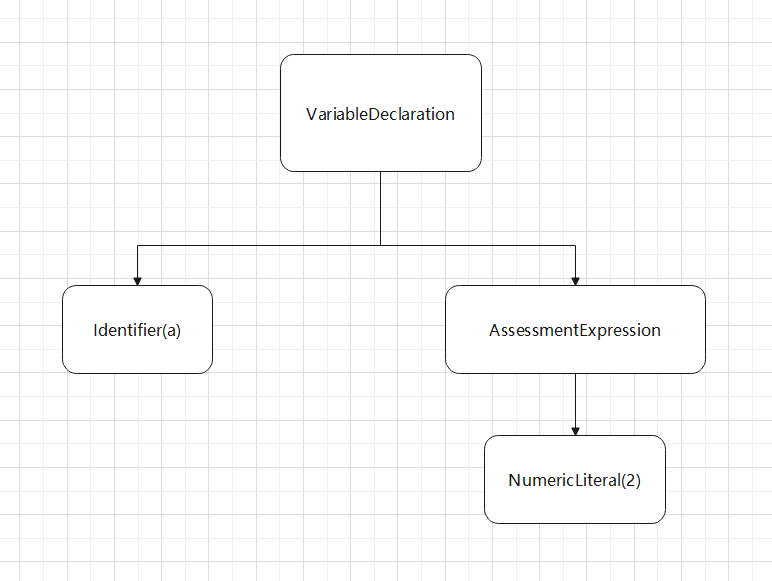
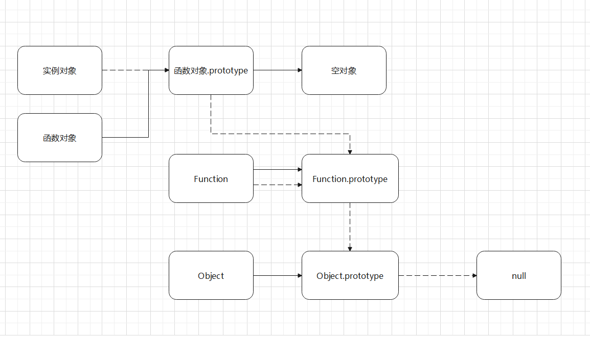

# 语法基础

本文采用了最新的es6语法,可以放心食用.

## 专业术语

为了防止在文中反复解释一些术语,我将一些常用术语的解释放在了这里.这意味着你并不需要直接看这里.等之后遇到了这些术语再翻上来看才是正道.


### ECMAScript

ECMA本来是指欧洲计算机制造商协会，不过这个组织现在没事就喜欢制定一些标准，其中ECMAScript就是其中一个标准。ECMA-262这个标准的语言，一般被叫做JavaScript。但是实际上JavaScript是对ECMA进行了扩充。

node.js也是对ECMAScript标准的一个扩充。

实际上JavaScript包含三部分

- ECMAScript
- DOM
- BOM

### 字面量

字面量就是代码意义上的常量,说白了就是可以放到赋值号右边的都可以叫字面量.这样子这个赋值表达式的值就如字面上一样,你赋值号右边写的是啥,值就是啥,非常容易理解.

**注意,我下面代码中赋值语句的右边是字面量,我写这个语句只是方便理解,别理解错了.**

```javascript
var 字符串字面量 = "hello world!";
var 数值字面量 = 996;
var 数组字面量 = ["java","c++","JavaScript"];
var 函数字面量 = function(){};
var 对象字面量 = {};
var 布尔字面量 = true;
```

### 函数与方法

理论上对象的函数就叫做方法,但是JavaScript是纯面向对象的语言,万物皆对象.所以函数和方法并没有C++那种半面向对象语言那种严格.一般来讲,window对象的方法叫做函数,其他对象的函数叫做方法,不过也没有那么较真就是了.

### 弱类型（动态类型）

JavaScript是一种动态类型的语言，这意味着一个变量可以存放任意类型的数据。这样可以提高程序的灵活性。但是也会降低代码的正确性。

## 注释

JavaScript提供了单行注释和多行注释

```javascript
//单行注释

/*
多行注释
*/
```

虽然JavaScript的标准没有提供文档注释，不过有些强大的编译器仍然可以识别并解析JavaScript的文档注释。

```javascript
/**
* 文档注释
*/
```


## 关于结尾的分号

JavaScript并没有强制要求你加上分号,也没有要求一定不加,一般情况下看自己喜好就行.

**不过以` ( 和[开头的代码，前头必须加分号 **

```js
function test(){
    console.log("hello world")
}
test()

//1.立即执行函数前面加分号
;(function(){
    console.log("匿名函数前面要写分号")
})()

//2.数组前加分号
;[1,2,3].forEach(element => {
    console.log(element)
})

//3.模板字符串前面加分号
;`test`.toString()
```

如果代码前是一个函数调用，那么编译器就会把前面的小括号和后面的解析到一起去，所以必须加分号。


## 双引号与单引号

JavaScript不区分单引号和双引号,字符串可以随意用这两种引号,不像其他语言严格取分大小写。

不过ESlint标准，要求字符串必须是单引号。

## 输入与输出

输出有两种常用方式

```javascript
alert("hello world")//弹窗
console.log("Hello World")//控制台输出
```

输入可以使用prompt方法，这个会直接弹出一个弹窗，也就是说需要浏览器环境

```javascript
var age = prompt("输入年龄")
console.log(age)
```

## 严格模式和非严格模式

在脚本或函数开头写下这句声明就可以开启严格模式，之后会添加很多限制，比如不允许使用未声明的变量什么的。

```javascript
'use strict'；
```

**注意：这句代码只允许写在脚本或者函数的开头！**

## let与const  [es6]

## 代码的加载

如何在网页中加载脚本呢？常用的方法如下：

- DOMContentLoaded和window.onload 

  这两个的区别就是DOMContentLoaded会等待DOM元素加载完成后执行，而DOMContentLoaded仅仅是当DOM元素执行完就开始执行。但是比如说img标签也是DOM元素，其中的src却需要更多的资源加载。

  ```html
  <!DOCTYPE html>
  <html lang="zh">
  <head>
      <meta charset="UTF-8">
      <title>标题</title>
      <script>
          window.onload = function () {
              console.log("DOM和各种外部库，图片什么的都也加载好了！")
          }
  
  
          if (document.readyState == 'loading') {
              document.addEventListener("DOMContentLoaded", function () {
                  console.log("绑定监听，并加载成功！")
              })
          } else {
                  console.log("如果此时document已经没有加载了，那么直接执行")
  
          }
      </script>
  </head>
  <body>
      
  </body>
  </html>
  ```

- 导入外部脚本

  ```html
  <script src="./test.js"></script>
  ```

- 使用模块化

  一个js文件导出代码

  ```js
  //test.js
  function add(a, b) {
      return a + b;
  }
  export {add}
  ```

  html文件导入

  ```html
  <!DOCTYPE html>
  <html lang="zh">
  
  <head>
      <meta charset="UTF-8">
      <title>标题</title>
      <script type="module">
          import  {add} from "./test.js"
          console.log(add(3,5))
      </script>
  </head>
  <body>
  </body>
  </html>
  ```

- 动态导入

  还是一样的js文件，但是html部分却使用了import。要注意这个导入的是整个模块，用里面的方法需要手动去找。

  ```js
  window.onload = async function () {
      const module = await import('./test.js')
      console.log(module.add(3,5))
  }
  ```

  


## Hello World

浏览器环境下，直接打开浏览器，F12找到console就能看到。

```html
<!DOCTYPE html>
<html>
	<head>
		<meta charset="utf-8">
		<title></title>
		<script type="text/javascript">
			console.log("Hello World");
		</script>
	</head>
	<body>
	</body>
</html>

```

node环境下，用node命令执行语句。

```javascript
console.log("Hello World");
```


# 垃圾回收


# 数据类型


在JS中，基本数值类型包括：

| 类型             | 值            | 构造函数  |
| ---------------- | ------------- | --------- |
| null             | null          | ==无==    |
| undefined        | undefined     | ==无==    |
| string           | "hello world" | Sting()   |
| number           | 123           | Number()  |
| bigint    [ES10] | 123n          | BigInt()  |
| boolean          | true false    | Boolean() |
| symbol   [ES6]   |               | ==无==    |
| object           | {}            | Object()  |


JS中的5大简单数据类型其实就是**值类型**，而object是**引用类型**。

## boolean

布尔类型只有true和false，跟其他语言一模一样。


## number

### 数字的存储

### 特殊的number常量

几个特殊的常量

- `NaN`：

  NaN即非数值（Not a Number），是一个特殊的数值；**在js中任何数值和非数值运算都会返回NaN，不会影响其他代码执行。**
  **任何涉及NaN的操作都会返回NaN；除了NaN+字符串。**

  在js中，只有一个东西不等于自己，那就是NaN。

  ```js
  NaN==NaN
  //false
  ```

  判断NaN的时候，可以使用官方提供的API`Number.hbv isNaN()`，原理如下。

  ```js
  function isNaN(n){
      return typeof n == 'number' && n!=n
  }
  ```

  

- `Number.MAX_VALUE`
  最大值

- `Number.MIN_VALUE`
  可表示的最小正数

- `Infinity`    或者      `Number.MIN_VALUE*2`:

  无穷大

- `-Infinity`    或者    `-Number.MAX_VALUE*2`

  无穷小

- `Number.MAX_SAFE_INTEGER`

  可以安全表示的最大整数

- `Number.MIN_SAFE_INTEGER`

  可以安全表示的最小整数

```javascript
var intNum = 77; //十进制整数；

var octalNum = 070;  //八进制56

var hexNum = 0xA  //十六进制10

var floatNum = 10.1 //浮点数
document.write("数值型的变量数据类型是"+typeof(floatNum));
```


判断非数值类型：

如果非数值就会返回true。 

```javascript

```


## string

```javascript
var string ="我叫string数据类型是";
document.write(string);
document.write(typeof(string));
```


## undefined

声明但是未定义的变量，都是undefined

```javascript
var a;
document.write("我是a，我是没有定义值，所以数据类型是"+typeof(a));
a=null;
document.write("我是a，我是没有定义值，所以数据类型是"+typeof(a));
```


## object

object是所有对象的父类，所有引用变量都是object类型。

 object是引用数据类型，里面操作的都是对象的引用（指针）

```javascript
var a=[1,2,3];
document.write(typeof(a));
var b={
  name:123
};
document.write(typeof(b));
var c=function(){};
document.write(typeof(c));
```

## null

null也是一种object类型的数据，但是这个代表空对象。

实际上这个玩意就是JS设计时的bug，理论上来说null 的类型就是null，但是因为这个bug存在的时间已经非常长了，大家早都习惯了，而且修理起来很困难，现在我们一般把这种没法修的bug叫特性。

JavaScript的特性之一就是`typeof null === 'object'`。

而`null instanceof Object == false`


所以我们为了准确判断null，可以使用以下的代码。

```javascript
var a = null;
(!a && typeof a === "object");//true
```

因为null是唯一一个false并且typeof会返回object的类型。

这时候就可以理解，为什么空对象返回是true，如果其他对象返回值也是flase，那么就无法来判断null了。

## bigint    [ES10]

在JS中，可以安全表示的最大整数为`Number.MAX_SAFE_INTEGER`，也就是9007199254740991，如果超出了这个值，运算会静默失败。

```js
const maxInt = Number.MAX_SAFE_INTEGER;
console.log(maxInt) //9007199254740991
console.log(maxInt+1) //9007199254740992
console.log(maxInt+100) //9007199254741092
console.log(maxInt+1000) //9007199254741992
```

可以看到，值已经无法再增加了。

对于这种情况，我们可以定义bigint类型，来计算这种超大的数。

```js
const maxInt = BigInt( Number.MAX_SAFE_INTEGER);
console.log(maxInt) //9007199254740991n
console.log(maxInt+1n)//9007199254740992n
console.log(maxInt+100n)//9007199254741091n
console.log(maxInt+1000n)//9007199254741991n
```


**注意！bigint不可以和number的数进行直接运算。**

比如：

```js
1000n/10n  //100n
1000n/10   //Uncaught TypeError: Cannot mix BigInt and other types, use explicit conversions
```


同样的，无法用+运算符转型为number

```js
+100n //Uncaught TypeError: Cannot convert a BigInt value to a number
```


## symbol  [ES6]

- symbol类型没有构造函数，只能用Symbol()函数来构建。

  ```js
  let sym = Symbol('sym')
  ```

- 获取Symbol的时候，只能使用`Object.getOwnPropertySymbols`方法

  ```js
  var age = Symbol('age')
  girl={}
  girl[age] = 14
  console.log( Object.getOwnPropertySymbols(girl))
  ```

  


symbol类型是专门为对象服务的，symbol可以定义对象的私有属性。

**定义symbol的时候，必须要用中括号！**

```js
let girl  = {
    name:"莲华",
    [Symbol('age')]:14
}

console.log(girl.name) //'莲华'
console.log(girl.age) //undefined
```

同时，symbol对于Object.entries、Object.keys和for……in不可见。


除此之外，symbol属性是唯一的，多个对象生成的symbol是不一样的。

```js
Symbol("test") == Symbol("test") //false
```

如果有特殊的需要，可以使用symbol的全局注册表

```js
let sym1 = Symbol.for("test")
let sym2 = Symbol.for("test")
console.log(sym1 == sym2) //true
```


# 类型转换

## 显式类型转换

### 数值

正常情况下，如果字符串里面是纯数字，那么这个方法就会返回字符串里面的值

```javascript
123 === Number("123")
```

如果字符串里面有非数值型数据，那么返回NaN

```javascript
isNaN( Number("123a") ) //true
```

注意！有一些特殊的数值转换

```javascript
Number(null) === 0
Number(true) === 1
isNaN(Number(undefined)) //true
```


也可以用`parseInt()`方法，强制转化成整数。而且会去掉末尾的单位。

**注意：只能去掉末尾的。**

```javascript
console.log(parseInt("100px")) //100
```

同样的，也有`parseFloat`方法。

### 字符串

- toString()

  这个方法不会改变原来数据的值。

  ```js
  var a = 1;
  a.toString();
  ```

- 使用构造函数

  ```js
  var b = 1;
  String(b);
  ```

- 如果是数组的话，还可以使用`join`方法，来填充分隔符。

  ```js
  var a = ["物理","化学","生物"]
  console.log(a.join("和")+"都不会")
  //物理和化学和生物都不会
  ```

  


### 布尔

JS中只有5种数强转后会变成false。剩下的都是true。

```javascript
console.log(Boolean(0));
console.log(Boolean(undefined));
console.log(Boolean(null));
console.log(Boolean(NaN));
console.log(Boolean(''));
```


## 隐式类型转换

在JavaScript中，隐式类型转换实际上是隐式调用了显示类型转换的方法。数值型是转换的最后结果，具体过程如下：


所有的比较都会向下进行转换。比如说字符串和布尔比较实际上会转为数值类型。


```javascript
//隐式转换的话就是
[1] == true

//首先转换成字符串
[1].valueOf().toString() === '1'
//然后转化成数值
Number([1].valueOf().toString()) === 1
//bool类型直接强转
Number(true) === 1
//最后
1 === 1
```


在转换的过程中，如果有一边出现了null或者undefined，则仅当两边都是null或者undefined之一时，才会判定true。


---


我们不妨看一些例题

```js
true+1	//2，true转型为1

[]+[] //''，因为[]的toString就是空字符串

[]+{} //'[object Object]'，因为{}的的toString是[object Object]

1/'string'  //NaN，string转型之后会变成NaN，之后进行的运算都是NaN

```


### 布尔

- `!!`运算符可以快速隐式转型为bool

  ```js
  !!114514  //true
  ```

- 只有以下几种类型转型为false

  ```js
  !!undefined === false
  !!null === false
  !!NaN === false
  !!'' === false
  !!0 === false
  !!-0 === false
  ```

  除此之外的数据都为true！！！

- 布尔值进行运算时，会转型为number

  ```javascript
  0 == false
  1 == true
  ```

  

  如果使用了`!`运算符，那么数据将会直接转换为bool类型。需要记住。


### 数值

- 进行四则运算的时候，会隐式转换成数值类型。

  ```javascript
  console.log("12"-1); //11
  console.log("12"*1); //12，这个可以用于快速地转换成数值。
  ```


- `number`和`bigint`可以隐式转换。

  ```js
  10 == 10n
  ```

  

- **数值和null相加会变成数值本身，因为null会隐式转换成0。而和undefined相加会变成NaN。**

  ```JavaScript
  console.log(1+null) //1
  console.log(1+undefined) //NaN
  ```

- 对一个数据使用+运算符，会自动转型到number

  ```js
  var str = "string"
  str = +str; //转型到number
  console.log(str)
  ```

  

### 字符串

```javascript
"123" == 123
```

同样的，模板字符串也可以转换

```javascript
var age = 10
`${age} `== 10
```

特别的，空字符串将转换为0

```javascript
'' == 0 == false
```


字符串拼接会发生隐式转换，任何和字符串拼接的变量都会变成字符串。除了对象。

```javascript
console.log("hello "+null)
console.log("hello "+undefined)
console.log("hello "+NaN)
console.log("hello "+false)
console.log("hello "+1)
console.log("hello "+{age:123})

/*
hello null
hello undefined
hello NaN
hello false
hello 1
hello [object Object]
*/
```


### 数组

数组也是对象，所以数组第一步会转化成字符串。如果数组里面有字符串的话，会自动拼接。

```javascript
[1,2,3] == '1,2,3'
['name','age'] == 'name,age'
[1] == '1'
```

如果数组只有一个数值，那么转换成的字符串还能转换成数值型

```javascript
[1] == '1' == 1
```

特别的，如果数组为空，将转换为空串

```javascript
[] == '' == 0 == false
```

### 特殊转换

另外还有一些特殊类型的隐式转换

- NaN和任何数据都不相等，包括他自己。

```javascript
NaN != NaN
```

- undefined 可以隐式转换为 null

```javascript
undefined == null
```

## 包装类

### 基本类型与对象的转换

基本数据类型有时候也会转换成引用类型。

首先看这个例子。

```javascript
var name = "もみじ";
console.log(name.length);
//3
```

这时你一定会奇怪，为什么我一个string还能有属性？而且还能正常打印出来？实际上这就是包装类。当你对一个基本数据类型进行属性方法等操作时，实际上内部会先`new String(name)`。然后调用方法`new String(name).length`。之后立刻销毁对象。

也就是说虽然看上去对一个数值类型进行了对象的操作，实际上确确实实是生成了一个临时对象。

要格外注意，临时对象使用完后立刻会销毁。

```javascript
var name = "もみじ";
name.color = "紅色";
console.log(name.color);
//undefined
```

本例中，首先生成一个临时对象并且给这个临时对象赋予属性color，之后对象被销毁。之后再次生成一个临时对象，此时这个对象是没有color属性的，所以返回值为undefined。

### 基本对象执行方法

虽说可以自动进行包装类，但是数字对象是不可以直接使用方法的。

```js
//1.toString(); 错误！数字字面量不可以直接使用方法

(1).toString(); //正确

"hello world".toUpperCase() //字符串无需加括号
("hello world").toUpperCase() //但是加了也可以

```


### js中内置的包装对象

- String
- Number
- Boolean
- Object
- Function
- Array
- Date
- RegExp
- Error


# 数据类型的判断

## null与object

为什么typeof null是object？

实际上这是一个历史问题，在最早JavaScript版本中，数据有标记位和数据位组成。

000：object

001：integer

010：double

100：string

110：boolean

而null则是数据位和标记位都为0，因此会被判断成object


在ES6阶段，也有人提案修复这个bug，但是没有通过


# 运算符

## 除法

跟其他的语言不太一样，JavaScript的除法是保留小数的。

```javascript
3/2==1.5
```

如果想只取整数，可以使用数学函数来截取。

```javascript
Math.floor(3/2) == 1
```


## 等于与严格等于

等于运算符`==`允许JavaScript的解释器进行隐式转换，而严格等于不允许。

```javascript
console.log("520"==520)//true
console.log("520"===520)//false
```


## 不等和严格不等

同样的，`==`允许隐式转型，而`!==`不允许。

```javascript
console.log("520"!=520)//false
console.log("520"!==520)//true
```


## void

void在其他语言一般都用于代表方法的返回值类型为空，但是在JavaScript里面却是一种运算符。void运算符执行的表达式，返回值永远是undefined。

```javascript
console.log(void (3==2));//undefined
void (console.log("hello world"));//执行了方法，但是返回值永远是undefined
```


void经常用于HTML中a标签。用来表示点击不发生跳转。

```html
<a href="javascript:void(0)">单击此处什么也不会发生</a>
```


除此之外，void还用于箭头函数，防止内存泄漏。箭头函数标准中，允许在函数体不使用括号来直接返回值。 如果右侧调用了一个原本没有返回值的函数，其返回值改变后，则会导致非预期的副作用。 安全起见，当函数返回值是一个不会被使用到的时候，应该使用 `void` 运算符，来确保返回 undefined（如un下方示例）。这样，当 API 改变时，并不会影响箭头函数的行为。

```javascript
button.onclick = () => void doSomething();
```

## !!

!!可以把其他类型的数据快速转成bool类型。因为一个!就是把数据转化为bool并且取反，而两个就是把数据取反后再变回来，相当于直接把数据转换成了bool类型。

```javascript
//下面都是false
!!undefined
!!null
!!0
!!false

//下面都是true
!!true
!!"1"
!!1,
!!{}
!![]
```

## instanceof

我们可以用`instanceof`运算符来判断两个两个对象间的关系。如果 `A instanceof B == ture `代表A是B的实例对象。

```javascript
Student instanceof Object == true
```

## typeof

可以来查看数据类型。

```javascript
var a =1;
console.log(typeof(a));
```


# 字符串

## 创建

```javascript
//用字面量创建
var dream ="愿天下没有996!";
```


## 模板字符串 [es6]

模板字符串是超级无敌强化之后的字符串,用**间隔符**(ESC下面那个符号)来引用.

下面简述它的两个主要功能

1. 可以在字符串内直接使用变量,并计算
2. 可以在字符串内保留回车,不用自己拼接回车了.

当一个字符串拼接的过长时,原来那种+号的写法过于繁琐,所以可以使用模板字符串,直接把变量放在里面

```javascript
//注意,return中的是间隔符,并不是引号.
function KillerQueen(name,age){
	return `我叫${name},今年${age}岁`
}
console.log(KillerQueen("吉良吉影",33));
```

不仅仅是这样,模板字符串里面的变量也可以进行运算,并且保留回车.

```javascript
function Real_GDP_per_capita(money){
	return `
		赵家有钱${money}万,隔壁9个穷光蛋;
		平均起来算一算,各个都是赵${money/(9+1)}万`;
}
console.log(Real_GDP_per_capita(1000));
```

## 字符串的解构

可以把字符串结构成一个数组，每一个数组的元素代表字符串的一位。

```javascript
var string = "123456789"
var [a,b,c] = string
console.log(a,b,c)
//输出：
//1 2 3
```


# 数组

## 数组与对象

在JavaScript中，数组是对象的一个子类。实际上数组就是一个特殊的对象，数组的key就是其下标，value就是数组元素。

注意数组和一般的对象有一个不一样的地方，就是它会把`a['3']=1`自动转型成`a[3]=1`。

```javascript
var a = [];
a['3'] = 4;
console.log(a)
//[ <3 empty items>, 4 ]

var b = {};
b['3'] = 4
console.log(b)
//{ '3': 4 }
```


## 数组的创建

1. 使用字面量

```javascript
var a =[1,2,3];
```

2. new一个

```javascript
var a  = new Array(1);//创建长度为1的数组
var a  = new Array(1,2);//创建一个数组，其元素为[1,2]
```


## 数组的解构 [es6]

指得是可以把数组里的内容一次批量导出并赋值。

```javascript
var loli=["86","波莱特","日日姬"]
var [loli1,loli2,loli3]=loli
console.log(loli1,loli2,loli3)
//输出：
//86 波莱特 日日姬
```


## 数组元素增加

### 手动改length

修改完之后，末尾会出现几个空的元素。默认用empty填充。

```javascript
var a  = [1,2,3];
a.length=5;
console.log(a);
//[ 1, 2, 3, <2 empty items> ]
```

### 用下标动态添加

```javascript
var a  = [1,2,3];
a[3]=4;
console.log(a);
//[ 1, 2, 3, 4 ]
```

同样的，如果修改的下标过大，中间就会有很多地方元素为empty。

```javascript
var a  = [1,2,3];
a[10]=4;
console.log(a);
//[ 1, 2, 3, <7 empty items>, 4 ]
```

### push

在数组尾部添加元素。

```javascript
var a  = [1,2,3];
a.push(4)
console.log(a);
//[ 1, 2, 3, 4 ]
```

### unshift

在数组最头头添加元素。

```javascript
var a  = [1,2,3];
a.unshift(4)
console.log(a);
//[ 4, 1, 2, 3 ]
```


## 数组元素的删除

### delete

```javascript
var arr = [1, 2, 3, 4];
delete arr[0];

console.log(arr);   //[undefined, 2, 3, 4]
```

可以看出来，delete删除之后数组长度不变，只是被删除元素被置为undefined了。


### pop

删除最后一项

```javascript
var colors = ["red", "blue", "grey"];
var item = colors.pop();
console.log(item);      //"grey"
console.log(colors.length);    //2
```


### shift

删除第一项

```javascript
var colors = ["red", "blue", "grey"];
var item = colors.shift();
console.log(item);      //"red"
console.log(colors.length);    //2
```


## 数组的遍历

### forEach

forEach可以使用**回调函数**来操作数组的数据。回调函数里面的参数，就是数组里面的元素。

```javascript
[1,2,3,4,5].forEach(
  function(num){
    console.log(num)
  }
);
//1
//2
//3
//4
//5
```

## 判断数组相等

```javascript
JSON.stringify(data1) == JSON.stringify(data2)
```


# 函数

## 简介

​	JavaScript的函数就是对象,万物皆对象.但是JavaScript是弱数据类型的,所以在使用函数的时候和别的强数据类型语言还是有差别.

就比如说,函数不用写返回值类型,没有返回值也不用 `return void;` ,并且定义时需要显式定义.

## 函数的创建方式

### 赋值表达式创建

这种表达式的右边是一个匿名函数。

```javascript
var print = function(){
	console.log("hello world!")
}
print()
```

### 直接创建

```javascript
function print(){
  console.log("hello world!")
}
print()
```

### 用Function构造函数创建

不推荐使用。构造函数需要用Function来创建函数，Function里面的参数就是函数体，需要用引号括起来，但是里面没有提示，非常不好用。

```javascript
var print=new Function(
  `console.log("hello world!") `
)
print()
```

另外用构造函数创建函数时，`new Function()`的new可以省略。


### 箭头函数 [es6]

这个东西看着复杂,实际上就是一个简化版匿名函数,

我们可以用匿名函数来参考着看.

```javascript 
var fun1 = function (id){
	console.log("匿名函数"+id);
}
var fun2 = (id) => {
	console.log("箭头函数"+id);
}
fun1(0);
fun2(1);
```

箭头函数还可以进一步简写：

- 若函数只有一个参数，可以省略小括号，但是没有参数的话，必须加一个空括号()。

- 函数只有一行代码的话，可以省略大括号。**注意！省略大括号的时候，那么编译器默认会给前面加上return，返回该语句。**

  ```js
  var fun1 = function(){1+1}
  
  var fun2 = ()=> 1+1 //箭头函数省略了大括号会默认有返回值。
  
  console.log(fun1(),fun2())//undefined 2
  ```

  为了出现不必要的bug，可以使用**void运算符**来强行让返回值为undefined。

  ```js
  var fun2 = ()=> void (1+1)
  console.log(fun2())//undefined
  ```

  

## 函数参数的特性

### 函数参数匹配

JavaScript语法非常自♂由，允许调用参数时，参数不用匹配。

```javascript
function add(a, b) {
  return a + b;
}

console.log(add(1, 2));  //3
console.log(add(1)); //NaN
console.log(add(1, 2, 3)); //3
```

可以看到，如果参数传的太多，那么JS不会去接受多出来的实参。如果太少，那么就把没有赋值的形参默认为undefined。所以`1+undefined==NaN`。

### arguments

JS的函数默认有一个重要的参数，那就是arguments。在函数调用的时候，**所有的实参都会传到arguments里面**。这个arguments对外隐藏，跟this一样。

```javascript
function show() {
  console.log(arguments)
}
show("萝莉",12);
//[Arguments] { '0': '萝莉', '1': 12 }
```

可以看到arguments把实参全都接收了，而且数据的格式很像一个数组。**其实arguments就是一种伪数组**。它可以通过下标进行访问，并且拥有length属性。但是没有数组的方法。

### …rest和…spread

rest和spread就像是反函数和函数。rest的意思的剩余的，spread则是展开、摊开的意思。这两个语法都会用到**扩展运算符**，这种特殊的运算符。


在函数传参的时候，有时候函数的参数数量是不确定的，这时候就可以使用rest参数。rest参数会统一获取剩下所有参数。

```javascript
function Lolis(loli1,loli2,...lolis){
    console.log(loli1)
    console.log(loli2)
    console.log(lolis)
}
Lolis("雷姆","伊莉雅","波莱特","巧克力");


//输出
雷姆
伊莉雅
['波莱特', '巧克力']
```

可以看到，其实rest参数会把传进来的所有参数封装成数组。相当于收尾工作，所以这个参数只能写在最后面。


spread和rest刚好相反，rest是来打包参数的，而spread可以把一个数组拆开成为一堆零散的数据。

```js
var lolis=["雷姆","伊莉雅","波莱特","巧克力"]

function Lolis(loli1,loli2,loli3){
    console.log(loli1)
    console.log(loli2)
    console.log(loli3)
}
Lolis(...lolis,"小丛雨")

//输出
雷姆
伊莉雅
波莱特
```

这时候，函数接受了几个就能用几个，多余的参数只能去arguments里面找。

而且spread仅仅是解构数组，所以任何位置都可以写。


### 默认参数(ES5)

在ES5中，我们可以通过以下方式来模拟默认值。

```js
function test(a,b){
    a=a||1
    b=b||2
    console.log(a,b)
}

test()//1，2
```


但是这个写法也是有着bug存在的。

```js
function test(a,b){
    a=a||1
    b=b||2
    console.log(a,b)
}

test(0,0)//1，2
```

我现在需要给a,b传入0，0的值。但是0被隐式转换为了false。最终还是变成了默认值。

我们不妨做出以下改进。

```JS
function test(a, b) {
    a = (typeof a !== "undefined") ? a : 1
    b = (typeof b !== "undefined") ? a : 1
    console.log(a, b)
}

test(0, 0)
```


### 默认参数（ES6）

ES6中，可以直接给参数赋值。

```js
function test(a = 1, b = 2) {
    console.log(a, b)
}

test() //1，2
```


并且和java不一样，js的默认参数之后可以跟普通参数。调用时，如果想使用默认参数，需要写undefined。

```JS
function test(a = 1, b) {
    console.log(a, b)
}

test(undefined,0) //1，0
```

### 默认参数对arguments的影响

```js
function test(a, b=2) {
    console.log(arguments.length)//1
    console.log(a===arguments[0])//true
    console.log(b===arguments[1])//false
  

    a=3
    b=4
    
    console.log(a===arguments[0])//false
    console.log(b===arguments[1])//false
}

test(1)
```


## 数组添加元素

1. `Array.push()`
2. `Array.unshift()`
3. `Array.length`


## 函数返回值

如果你没有自己写的话，默认为undefined。


## 立即执行函数

​	把一个匿名函数前后都用小括号括起来就变成了立即执行函数,这种函数只能用一次,一旦程序运行到这里立刻执行.

因为没有名字,之后无法被其他程序调用.

```javascript
(function(){
  document.write("我是匿名函数")
})(); 
```

## 函数的length

函数的length就是其参数的个数。几个参数length就是几。

```javascript
function test(a,b,c){}
console.log(test.length)//3
```


## 回调函数

回调函数指的是那些由我们自己定义，但是由系统自动调用的函数。

```javascript
function callBack(fun){
	fun()
}
callBack(function(){
	console.log("hello world")
})
```

上面这个例子中，我们定义了一个匿名函数，但是这个函数自动被callBack函数调用执行了，这种被自动调用的函数就是回调函数。

## eval函数

eval简直太强大了，js的这个函数，可以让你输入一个字符串，并且直接运行你字符串里面的代码。

```javascript
function DIY(str){
  eval(str);
}
DIY("console.log('hello world!')");
//hello world!
```


## name属性

```js
function test1() {
    
}
var test2 =   function (params) {
    
}

var obj ={
    get test3(){
            return ""
    }
}

console.log(test1.name)//test1
console.log(test2.name)//tes2
console.log(test1.bind().name)//bound test1
console.log((new Function()).name)//anonymous
```


## apply，call和bind方法

bind方法就是把所执行的函数做了一个打包，而不是直接运行。

```javascript
function show(){
  console.log(this)
}
var obj={name:"我是obj啦"}
show.bind(obj)()

var show2 = show.bind(obj)
show2()
//输出结果都是
//{ name: '我是obj啦' }
```

可以看到，实际上bind就是把`obj.show()`这个函数进行了一个保存，不需要每次都去apply和call了，直接可以用一个新的函数去执行。

apply最多可以接收两个参数：this对象和参数数组

call则可以接受多个参数：this对象，和一连串参数。

## [[Call]]和[[Construct]]

js函数的内部有两个不同的方法。当通过new关键字调用的时候，执行[[Construct]]方法。如果没有new则调用[[Call]]方法。注意，不是所有的函数都有[[Construct]]方法，比如箭头函数就没有。

通过这两个属性，我们就可以判断一个函数是否是被new出来。

```js
function maigo(namae) {
    if(typeof new.target !== "undefined"){
        this.namae = namae
        console.log(new.target)//[Function: maigo]
    }else{
        console.log("你哈呐~如果想要和我在一起，请来new我哦~")
    }
}
maigo()//当成普通函数使用
var maigo1 = new maigo("迷子")
console.log(maigo1.namae)
```

其中如果你使用new来创建对象，new.target就会被赋值为其new的构造函数。如果没有用new，那么就会赋值为undefined。

这个new.target被称为==元属性==。元属性是指非对象的属性。new就不是一个对象，但是它仍然拥有target属性。


## 块级函数

在ES5中，如果在

## 高阶函数

如果一个函数的参数或者返回值也是一个函数，那么这就是一个高阶函数。

最有代表性的高阶函数是数组的`filter、map和reduce`

```javascript
const nums = [2, 4, 8, 16, 32, 64, 128, 256, 512, 1024];
//filter用来过滤想要的数据
//filter函数会调用一个回调函数
//回调函数的参数n会遍历nums数组的元素
//回调函数必须返回一个boolean值,
//若为true则把数据压入新数组,false则过滤掉
var newNums = nums.filter(
  function (item) {
    if (item > 100)
      return true;
  }
);
console.log("newNums:"+newNums);

//map用来对原数据进行一次映射
//对数组进行一次映射,遍历数组每一项,把数据存入n中,
//return的值存入新的数组
var newNums2 = newNums.map(
  function (item) {
    return item * 10
  }
);
console.log("newNums2:"+newNums2);

//用于集合中的所有数据,可以进行如全部加一遍的操作
//reduce一共传参两个,第一个是回调函数,第二个是给oldValue初始化的值
//回调函数中,oldValue除第一次外,每次值被赋值为函数return的值
//item依旧遍历之前的数组
var newNums3 = newNums2.reduce(function (oldValue, item) {
  return oldValue + item;
}, 0);
console.log("newNums3:"+newNums3);

var totle = nums.filter(function (item) {
  if (item > 100)
    return true;
}
                       ).map(function (item) {
  return item * 10;
}
                            ).reduce(function (oldValue, item) {
  return oldValue+item;
}, 0);
console.log("totle:"+totle);
//箭头函数写法
var totle2=nums.filter(item=>item>100).map(item=>item*10).reduce((pre,item)=>item+pre);
console.log("totle2:"+totle2);
```


# 对象

## 万物皆对象

JavaScript只有对象，甚至没有类的概念，可以说是真真正正面向对象的语言。但是很快大家就发现了，虽然说着没有类，但是没有又不行，只能用各种方法间接实现。最终在ES6中引入了类的概念。

记得我在开头说过的吗？JavaScript中不区分函数和方法，因为所有的一切都是对象，方法也是函数对象。

## 对象的分类


## 对象的创建方式

### 字面量创建

```javascript
var girl={
				name: '雷姆',
				age: 18,
				loveStyle: function(){
					console.log("最喜欢你啦！抱抱！")
				}
}
```


### 用Object创建

一般不怎么用这种

```javascript
var girl = new Object();
girl.name = '雷姆';
girl.age = 18;
girl.loveStyle = function() {
	console.log("最喜欢你啦！抱抱！")
}
```


### 构造函数

构造函数用this来添加属性，其实原理和Object一样的。首先new的时候，this就指向了new出来的内存空间。之后给内存赋值，最后把这个内存起始地址返回给LeiMu，这样就通过this，间接完成了属性的添加。

```javascript
function Girls(){
	this.name = '雷姆';
	this.age = 18;
	this.loveStyle = function() {
		console.log("最喜欢你啦！抱抱！")
	}
}
var LeiMu = new Girls();
```


### 工厂模式

一种设计模式，这样写出来不用加new

```javascript
function createGirls(name, age) {
	var o = new Object();
	o.name = name;
	o.age = age;
	o.loveStyle = function () {
		console.log("最喜欢你啦！抱抱！")
	}
	return o;
}
var congYU = createGirls("小丛雨", 513);
congYU.loveStyle()
```

### 实例化类

ES6特有。

```javascript
class Loli
{
  constructor(age){
    this.age = age||14;
  }
}
var loli = new Loli();
console.log(loli.age)
```


## 对象属性和方法简写 [es6]

如果在对象中的参数已经在外界被定义过了，那么可以直接写变量名，而不用再去写键值对。

```javascript
var a=16
var b=2
var show=()=>{
  console.log("hello world")
}
var obj={
  a,b,show
}
obj.show()
//输出
//hello world
```

如果不想用这个变量名，可以按照原本的语法来写。

```javascript
var a=12
var b=2
var show=()=>{
  console.log("hello world")
}
var obj={
  age:a,
  b,show
}
obj.show()
console.log(obj.age)
//输出
//hello world
//12
```


而方法简写

## 对象的解构 [es6]

指得是可以把对象的键批量导出的一种语法。在export中用得很多。

```javascript
var loli={
	name:"小可爱86酱",
	age:70
}
var {name,age}=loli
console.log(name,age)
//输出
//小可爱86酱 70
```

其实这里面就用到了属性的简写，实际上的代码应该是这样。

```javascript
var loli={
	name:"小可爱86酱",
	age:70
}
var {name:name,age:age}=loli
console.log(name,age)
//输出
//小可爱86酱 70
```

首先var了一个对象，这个对象有两个属性，也就是左边的name和age，而这两个属性又解构的loli被传入了两个参数，分别是右边的name和age。

如果不是很理解可以看这个代码：

```javascript
var loli={
	name:"小可爱86酱",
	age:70
}
var {name:MYname,age:MYage}=loli
console.log(MYname,MYage)
//输出
//小可爱86酱 70
```

也就是说右边的值是自定义的，也是需要被传入数据的。

## 对象的展开

对象的展开就是指把一个对象展开成一个个的键值对，一般用于把两个对象直接合并。看一下例子就明白了。

```javascript
var c = { hasPointer: true }
var java = { isOOP: true }
var CPP = {...c,...java}
console.log(CPP)
//结果
//{ hasPointer: true, isOOP: true }
```

可以看到，CPP通过`...`的语法，可以把c和java的属性直接解析出来并且把结果传入CPP对象中。

如果不用这种展开的语法会怎么样呢？

```javascript
var c = { hasPointer: true }
var java = { isOOP: true }
var CPP = { c, java }
console.log(CPP)
//结果
//{ c: { hasPointer: true }, java: { isOOP: true } }
```

可以看到，这个其实直接把指针传进去了，而不是传的值。

**这种语法其实可以理解为一种多继承，在本例中C++继承了c的指针和java面向对象的思想。所以以后使用多继承可以考虑这种对象的展开语法。**

## 对象的数据的访问与添加

对象的数据可以用点运算符来访问，也可以用下标运算符来指定访问的key。

```javascript
var loli = {
	name:"小丛雨",
	age:13
}
console.log(loli.name);  //小丛雨
console.log(loli["age"]); //13
```


也可以用下标运算符修改指定key的value。如果这个key不存在，那么对象会自动添加这个键值对。

```javascript
var obj ={}
obj["name"]="loli"
console.log(obj)
//name: "loli"
```

也可以用成员运算符来添加key

```javascript
var obj ={}
obj.name="loli"
console.log(obj)
//name: "loli"
```

`.name`的语法被叫做**属性访问**，`["name"]`的语法被叫做**键访问**。

## with

with可以来批量修改对象的属性或方法

使用with前：

```javascript
var loli = {
	name:"小丛雨",
	age:13
}
loli.name="宁宁";
loli.age = 15;
console.log(loli)
//{name: "宁宁", age: 15}
```

使用with后：

```javascript
var loli = {
	name:"小丛雨",
	age:13
}
with(loli){
	name="宁宁",
	age=15
}
console.log(loli)
//{name: "宁宁", age: 15}
```

但是不推荐使用with，因为with可能会导致很多bug。比如下面这个

```javascript
var loli = {
	name:"小丛雨",
	age:13
}
var book = {
	price:30
}

function change (obj){
	with(obj){
		name="宁宁",
		age=15
	}
}

change(loli)
change(book)

console.log(loli)//{name: "宁宁", age: 15}
console.log(book)//{price: 30}
```

可以看到，我明明把loli和book对象传了进去，但是最后只有loli对象正常输出了，这是为什么？其实当book对象进入with代码块之后，发现直接对一个未声明的属性赋值，按照编译器的规定，**一切未声明的属性全都归属window对象**。所以这个name和age实际上被添加到了window对象上面去。

```javascript
//a没有用var声明，默认添加到了window对象上
a=13
console.log(a)
```


## 删除对象属性

```js
delete obj.a
```


## get与set


跟c#的一模一样，很普通的语法。 

```JS
var rennge = {
    _age : 14,
    get age(){
        return this._age
    },

    set age(num){
        this._age = num
    }

}

console.log(rennge.age)
rennge.age=15
console.log(rennge.age)
```


## 属性描述符

### 获取与修改

其实JavaScript中，每个对象的属性都有很多属性，包括是否只读，是否可枚举等。

```javascript
//查看某个属性
var obj = {a:1}
var result =  Object.getOwnPropertyDescriptor(obj,"a");
console.log(result)
//{ value: 1, writable: true, enumerable: true, configurable: true }
```


```javascript
//添加或修改属性
var obj = {a:1}
Object.defineProperty(obj,"a",{
  value:2,
  writable:true,
  configurable:true,
  enumerable:true
});
```

### 数据描述符

#### writable

writable决定了该属性是否可以被修改，如果设置为false，那么该属性就无法被修改。

```javascript
var obj = {a:1}
Object.defineProperty(obj,"a",{
  writable:false,
});

obj.a = 2;
console.log(obj.a) //1
```

可以看到，虽然代码没有报错，但是该值没有修改成功。

如果是在严格模式下，代码会报错。

#### configurable

这个玩意决定了你是否能使用`defineProperty`函数，如果为false，那么对该属性使用`defineProperty`会不起效果。而且，如果你再写`configurable:true`会直接报错。也就是说如果把` configurable:false`设置了之后，那么操作不可逆，不能再设置回来。

但是这个操作还有两个特殊的地方

1. 即使把属性设置了` configurable:false`，我们还是可以把writable设置为flase，但是无法设置为true。

   ```javascript
   var obj = {a:1}
   //把属性设置为不可修改配置
   Object.defineProperty(obj,"a",{
     writable:true,
     configurable:false
   });
   
   //但是仍然可以把writable设置为false
   Object.defineProperty(obj,"a",{
     writable:false,
   });
   
   //可以看到属性赋值失败了，因为该属性是只读的
   obj.a = 2;
   console.log(obj.a) //1
   ```


这个属性也决定了该属性是否可以被delete删除

#### enumerable

可否枚举，也就是说在for……in的时候，是否可以被打印出来。在循环与迭代一章会详细讲解。


### 访问描述符

set与get

如果给某个对象定义了get或者set属性，那么这个属性就会变成**访问描述符**，JavaScript会忽略它们的value和writable属性。

有两种方法可以来设定getter和setter。

```js
var girl = {
    _name_: "蓮華",
    //可以直接在对象内部进行getter和setter的设定
    get name() {
        return this._name_;
    },
    set name(newName) {
        //no!!!!!!!
        //永远喜欢莲华！
    }

}
//也可以通过外界属性描述符设定
Object.defineProperty(girl, "age", {
    get: function () {
        return this._age_;
    },
    set: function (age) {
        if (age < 25 && age > 8)
            this._age_ = age;
        else
            this._age_ = 14;
    }
})

console.log(girl.age);
girl.age = 5;
console.log(girl.age);
```


可以看到，实际上getter和setter都是通过创建一个新的变量来完成对私有数据的封装的，但是实际上这个变量并不是私有的，还是可以通过`girl._age_`和`girl._name_`来进行访问的。

但是这样子在心理上似乎能感觉好一点，至少大部分人都知道下划线开头的变量是私有变量，不应该随意访问。


# 类 ES5

## 创建

虽然我很不喜欢用ES5，但是RPGMakerMV，人家用的是ES5的语法，而且一眼望过去，成片成片的原型链，各种骚操作。太难了。

话不多说，ES5没有直接的类继承什么什么的，必须依靠显示原型来间接完成类的继承与创建。

```javascript
//构造函数
function Girl(){
    //在构造之后，会调用原型的初始化函数
    this.initialize.apply(this,arguments)
}

//将构造函数指向其对象
Girl.prototype.constructor=Girl;
//初始化函数
Girl.prototype.initialize=function(){
    this._age=14;//私有变量
}

Girl.prototype.play = function(){
    console.log("ね～～～～～")
}

var girl = new Girl();
girl.play();

```

## 复制继承并重写父类的某一个方法

```js
var newFun = Father.prototype.fun;
 Father.prototype.fun = function() {
        newFun.call(this);
		//代码
};
```


## 继承

```js
function Scene_Base() {
    this.initialize.apply(this, arguments);
}

Scene_Base.prototype = Object.create(Stage.prototype);
Scene_Base.prototype.constructor = Scene_Base;

Scene_Base.prototype.initialize = function() {
};

```


## 静态类

核心的设计思想就是直接在构造函数的对象上面添加属性和方法。

```js
function DataManager() {
    throw new Error('This is a static class');
}

DataManager._globalId       = 'RPGMV';

DataManager.isItem = function(item) {
    return item && $dataItems.contains(item);
};
```


# 类 ES6

## 特性

- ES5的构造函数可以提升，但是class不能提升。在执行声明语句之前，一直在临时死区里面。
- 类中的代码自动运行在严格模式下，且无法强行脱离。
- 类中，所有的方法都是不可枚举的。
- 用new以外的方法调用构造函数会报错。
- 在类中，无法修改类名。

## 类的创建方式

ES6中，可以用类来创建对象，因为ES6真的很香，跟java他们用法差不多，现在你就能发现ES6有多香了。ES5学起来简直难受的一批，浑身不舒服.

```javascript
class Loli {
  constructor(age) {
    this.age = age;
  }
	gulu_gulu()
	{
		console.log("咕噜咕噜~~~");
	}
	showAge(){
		console.log(`人家今年${this.age}岁`);
	}
  //静态方法
	static ne()
	{
		console.log("呐呐呐呐呐呐呐呐呐呐呐呐呐呐呐呐");
	}
}
var 巧克力 = new Loli(14);
巧克力.gulu_gulu();
巧克力.showAge();
Loli.ne();
```

可以看到,程序正常运行:


## 类的继承

用extends表示继承哪个类,之后用super来指定继承的属性,默认继承全部的方法.

```javascript
class 天然呆萝莉 extends Loli {
	constructor(age,name) {
		//用super来直接继承属性
	  super(age);
		this.name=name;
	}
	//方法默认全部继承过来,无论是普通方法,还是静态方法.
	showInfo(){
		console.log(`嘟嘟噜~~,${this.name}です,今年${this.age}岁`)
	}
}
var 椎名真由理 = new 天然呆萝莉(14,"椎名真由理");
椎名真由理.showInfo();
椎名真由理.gulu_gulu();
天然呆萝莉.ne();
```

可以看到程序正常运行:


## 重载

JavaScript没有重载，只有重写。

## 实例方法和实例属性

```javascript
class A{
  //实例属性直接写就行，只能通过对象调用
  message = "hello world"
  
  show(){
    console.log(this.message)
  }
}
var a = new A()
a.show()
```


## 静态方法和静态属性

在前面加上static就行了，**只能**通过类来调用。

```javascript
class A{
  static message = "hello world"

  static show(){
    console.log(this.message)
  }
}
A.show()
console.log(A.message)

// var a = new A()
// a.show()
//这两个会报错，JavaScript中静态属性只能由类来访问。
```

## 静态类

```js
/***定义静态类***/
var Core = {};
Core.StaticClass = (function(){
    var Return = {
        Property: "Test Static Property",    //公有属性
        Method: function(){    //公有方法
            alert(_Field);    //调用私用字段
            privateMethod();    //调用私用方法
        }
    };    //定义返回的公有对象
 
    var _Field = "Test Static Field";    //私有字段
    var privateMethod = function(){    //私有方法
        alert(Return.Property);    //调用属性
    }
 
    return Return;    //生成公有静态元素
})();
```


# 词法作用域和执行上下文

## 编译基本过程

V8引擎在处理js代码的时候需要用到3个组件：

1. 解析器（parser）：用于把js代码解析成抽象语法树AST。
2. 解释器（interpreter）：将AST解释成字节码（bytecode）
3. 编译器（compiler）：将字节码转换成机器码

### 分词/词法分析

在这个过程中，解释器会把代码分成一个一个有实际意义的代码块，也就是所谓的**词法单元**。

比如说`var a = 2;`就会变成`var `  `a`   `=`   `2` 4个单独的词法单元。

### 语法分析

这个阶段，会把刚才的词法单元转化成一棵**抽象语法树**。



### 解释执行

将高级语言转化为机器语言

## LHS和RHS

这个就是左值和右值的关系，其他语言虽然也有，但是在编译原理这里意思略有不同。

LHS代表左值查询，例如`a=1`，这种带赋值语句的表达式，就会调用左值查询，因为这种赋值语句会实实在在更改内存数据，所以左值查询实际上是去查找a所在内存。

RHS虽说是右值查询，实际上代表的是所有非左值查询，比如`console.log(a)` `function f(a){}`。右值查询需要去查找a这个变量的值究竟是多少，而不关心内存什么的，他的任务就是查到a的值多少。

比如下面这个代码

```javascript
function f(a){
  var b=a;
  return a+b;
}
var c = f(2);
```

这个代码一共包括3个LHS和4个RHS

1. `f(2)`执行，进行实参传递，隐式赋值`a=2`，执行1次LHS
2. `var b=a`，首先要对a进行RHS，找出其值。之后执行赋值语句LHS。此时执行2次LHS，1次RHS
3. `return a+b`首先要去查找a和b的值，调用2次RHS，然后return。此时执行2次LHS，3次RHS
4. `var c = f(2)`首先去查找f(2)return的值，调用一次RHS，最后赋值调用LHS。此时执行3次LHS，4次RHS


## 执行上下文

### 产生

执行上下文储存着程序运行所需要的各种变量。

四种情况会生成执行上下文：

- 开始执行全局代码
- 进入function的函数体
- 进入eval函数
- 进入module代码

### 执行过程

执行上下文分为**全局执行上下文**和**函数执行上下文**。说白了这个就是**预编译的作用域**。

在预编译前，首先会把window确定为全局执行上下文对象，之后进行预编译。对于函数也是如此，在执行函数前，首先会把要执行的函数确定为函数执行上下文对象，然后进行预编译。

***注意！定义函数并不会产生执行上下文对象！只有调用才会产生。***

```javascript
//1.全局执行上下文对象产生
function outer(){
	//3.即将调用inner方法，再次产生一个函数执行上下文
	inner()
}
function inner(){}
//虽然定义了，但是没有被调用，不会产生执行上下文
function free(){}
//2.即将调用outer方法，outer函数执行上下文对象产生
outer()
```

也就是说在js执行中，每调用一次方法，就会产生一个执行上下文对象。那么js是如何管理这些执行上下文的呢？实际上，js会用一种**执行上下文栈**来储存管理这些对象。

在代码即将执行时，首先就会把全局执行上下文入栈，之后每进行一个方法调用就会把当前正在执行的函数执行上下文入栈，执行完毕时出栈。如果函数嵌套调用的话，就按照调用顺序依次入栈。

> inner函数执行上下文      <-栈顶
>
> outer函数执行上下文
>
>  全局执行上下文


### 变量提升与方法提升

JavaScript为了提高性能，会把代码直接预编译，之后再解释。预编译分为全局预编译和局部预编译，全局预编译发生在页面加载完成时执行，而局部预编译发生在函数执行的前一刻。对应着全局执行上下文和函数执行上下文。

所谓的全局预处理实际上干了这么三件事：

1. 把var定义的全局变量添加为window的属性，并把值设置为undefined。
2. 把function声明的全局函数添加为window的方法，并且把这个函数对象指向对应的堆内存。
3. 把this指向window对象

这就是所谓的**变量提升**和**方法提升**。


局部预编译略有不同：

在执行函数体之前会进行函数的局部预编译。

1. 给形参赋值，并把形参添加为函数执行上下文对象的属性。
2. 给arguments赋值，建立一个伪数组，并把这个添加为上下文对象的属性
3. 把var声明的变量添加为属性，并且把值设置为undefined。
4. 把function声明的方法，添加为上下文对象的方法
5. 把this指向调用当前函数的对象。


理论的东西虽然很重要，但是不举个例子实在是过于抽象。

看看下面这两个代码，它的执行结果是什么？

```javascript
//代码1
a = 2;
var a;
console.log(a); 
//代码2
console.log(a); 
var a = 2;
```

答案是：第一个是2，第二个是undefined。

这个看上去虽然很抽象，但是结合上面的理论来看的话，就能够理解了。

首先把var声明的变量提到最头头，并且赋值为undefined。然后顺序执行代码。

也就是说，实际上代码执行起来应该是这个样子。

```javascript
//代码1
var a = undefined;
a = 2;
console.log(a); 
//代码2
var a = undefined;
console.log(a); 
a = 2;
```


其次，方法也是会提升的。注意下面两个代码。

```javascript
//代码1
test()
function test(){
  console.log("hello world！")
}
//代码2
test()
var test =  function (){
  console.log("hello world！")
}
```

第一个会正常打印结果，但是第二个则会报错。

实际上函数提升只限于function声明的，函数赋值表达式本质上还是一个var声明的变量，所以不会提升。实际上他们执行的代码如下：

```javascript
//代码1
function test(){
  console.log("hello world！");
}
test();
//代码2
var test = undefined;
test();
test =  function (){
  console.log("hello world！");
}
```


另外要注意！**先执行变量提升，后执行方法提升**。也就是说，如果变量名和方法名重名，那么方法会把变量覆盖掉。

```javascript
function a(){}
var a;
console.log(typeof a)//function
```

**如果对变量进行了赋值操作，那么就会重新把变量覆盖回来。**

```javascript
function a(){}
var a=1;
console.log(typeof a)//number
```


还要注意，JS中var会无视块级作用域。

```javascript
console.log(fn)
if(false){
	var fn = 1;
}
//undefined
```

### let、const与临时死区

要注意，let是不会变量提升的，如果对let提前引用的话，会报错。

```js
console.log(a)
let a =1;
//报错！！！！
```

这是为什么呢？实际上JS引擎有一个被称为==临时死区==的东西。

JavaScript引擎在进行预编译的时候，如果遇到var 声明的变量，就提升至作用域顶部。如果遇到let和const则放到临时死区（temporal dead zone）里面。访问TDZ中的变量会触发错误。只有执行了变量的声明之后，变量才会从TDZ中移除。

```js
console.log(a) //undefined
if(false){
    let a = 1
}
```

如果访问的变量不在TDZ中，则显示undefined。


### 全局作用域的绑定

var还有一个致命的特点就是会覆盖全局作用域的变量。

```js
var a = 1
var a = 2
console.log(a)//2
```

就是这样，如果把一个变量声明两遍，那么之前那个会被顶替掉

```js
let a = 1
let a = 2
console.log(a)//报错，a已经被声明过了。

var a = 1
let a = 2
console.log(a)//报错，a已经被声明过了。

```

let声明的变量则直接报错。就算之前那个是var也照样报错。

```js
var a = 1
function test(){

    let a = 2
    console.log(a)
}
test()
console.log(a)
```

如果在局部区域用let定义了同名变量，那么只会覆盖原变量，而不会替换。跟C语言差不多。


## 词法作用域

词法作用域其实就是指得作用域。作用域有三种：

- 全局作用域
- 函数作用域
- 块作用域

### 全局作用域和函数作用域

顾名思义，在js文件中，整个都是全局作用域。在函数内部的是函数作用域。

在函数作用域的变量，不会泄露到外界，可以有效封装。

```javascript
var a ="全局作用域";
function show(){
  var a = "函数作用域";
  console.log(a);
}
show();
console.log(a)
```


### 块作用域 [es6]

JavaScript本来没有块作用域，但是ES6之后新增了块作用域。可以用let声明局部变量。但是var声明的变量还是会忽视块作用域。

**特别注意：java，C++之类的语言是有块级作用域的，别到时候学了JavaScript不会写java了。**

```javascript
{var a=1}
console.log(a)//1

{let b=1}
console.log(b)//报错
```

### 作用域链

查找一个变量的时候，是先查找当前作用域，之后查找上一级，这样的查找顺序很像一个链表，因此叫做作用域链。

**不过要注意，作用域链的查找是按照函数作用域来进行的，而不是块作用域，最终会抵达全局作用域。**

```javascript
var a = "我是全局作用域"
var block ={
	a:"我是块作用域",
	show:function(){
		console.log(a)
	}
}
block.show()//我是全局作用域
```

可以看到，虽然块作用域也定义了a变量，但是直接被忽视了。


```javascript
var a = "我是全局作用域"
var block ={
	a:"我是块作用域",
	show:function(){
		var a = "我是函数作用域"
		console.log(a)
	}
}
block.show()//我是函数作用域
```

如果是函数作用域就不会被忽视。


### 访问未定义变量

如果所使用的变量未被定义，有可能触发ReferenceError异常。

是否触发跟LHS河RHS有关系。


如果你直接对一个未声明的变量使用RHS，那么查询会一直抵达全局作用域，如果还没有找到，那么就会抛出异常。

```javascript
console.log(a)
```


**如果你对一个未声明的变量使用LHS，那么在“非严格模式”下，引擎就会在全局作用域下创建这个变量。**

```javascript
function addA(){
  a=1;
}
addA();
```

编译器会沿着作用域链一直查找a的定义，结果直到全局作用域都没有找到，所以最后在全局作用域创建了一个a。此时这个a就是全局作用域的变量了。


## 作用域与执行上下文

### 预编译


1. 创建全局执行上下文。并把全局上下文压入执行上下文栈。

2. 找到所有全局作用域中var声明的变量。并放到**全局对象**中。
3. 找到所有的函数声明。并放到**全局对象**中。
4. 找到let、const和class声明的变量。并放到**全局scope**中。

```javascript
var a  = 1 ;
function aaaaaa(){}

let b  = 1 ;
const c = 1;
```


这是我在chrome掐断点的结果，可以看到chrome中把全局对象叫Global，而把scope叫做Script。

注意在访问变量时，**首先会访问全局scope，之后再访问全局对象。也就是说先访问let和const的再访问var的**。


5. 做名字重复的处理

彼此间名字不能重复，**而且var和function重名的话，function优先**。

6. 登记并把var声明的变量初始化为undefined。
7. 把全局作用域的function登记，并初始化为函数对象。

```javascript
console.log(fn)
function fn(){}
//ƒ fn(){}
```

8. 把块级作用域的function登记，但是初始化为undefined。

```javascript
console.log(fn)
if(false){
  function fn(){}
}
//undefined
```

9. 登记let、const和class的变量，但是**不进行初始化**。

```javascript
console.log(a);
let a = 1 ;
//Uncaught ReferenceError: Cannot access 'a' before initialization at xxxxxxx
```

我们把这种let提升后的变量叫做临时死区(temporal dead zone)。因为虽然这些变量进行了变量提升，但是还是不可使用。

10. 执行语句。

### 语句执行

我们以下面的代码为例：

```

```


# 函数原型

这个是函数最重要的地方

## 函数，对象，函数对象和实例对象

函数对象其实就是函数指针，保存着这个函数在内存中的地址。

```javascript
function Student(){}
Student()
```

上面这个代码中，Student就是函数对象，保存着Student这个函数在堆中的地址值。

而`Student()`是函数，代表编译器去访问并执行Student指针所指向的内容。

```javascript
var XiaoMing=new Student()
```

如果0用这个函数去构造对象，那么这个XiaoMing就是实例对象。其实就是类和对象的关系。


其次，要注意，函数对象是可以new的，也就是可以有子类的。而有一些静态对象是不能new的，那些静态对象就不是函数对象。

## prototype（显式原型）

 每个**函数对象**都拥有prototype属性，**这个实际上是一个指针，指向一个被称为原型对象的对象**。prototype就是显式原型的指针，可以直接通过属性的方式去访问。

如果这个函数对象是新定义的，那么这个prototype默认指向一个空对象。

```javascript
function Student(){}
console.log(Student.prototype)
```

这个空对象是在定义函数时就创建的，相当于下面这个代码

```javascript
this.prototype= new Object()
```

显式原型默认是一个空对象，但是这个空对象并不是完全空，它里面也有两个默认值constructor和\__proto__。

constructor非常特殊，因为constructor指向Student函数对象，而函数对象的prototype又指向原型对象。刚好是一个双链表的结构。


我们可以来直接操作显式原型，为里面添加方法和属性。并且，在显式原型中添加的方法和属性可以直接在实例对象中使用。

```javascript
var 小明=new Student()
Student.prototype.study=()=>{
	console.log("学习使我快乐")
}
小明.study()
```


## \__proto__(隐式原型)

所有函数都有隐式原型和显式原型属性，但是实际上这两个都是指针类型，都指向函数的原型对象。**但是函数对象更强调显式原型的属性，而实例对象更强调隐式原型属性**。

一旦一个实例对象被创建，其隐式原型就会自动指向构造函数的显式原型。这就导致实际上Student构造函数的prototype和实例对象小明的\__proto__，实际上都指向了Student的原型对象。

```javascript
function Student() { }
var 小明=new Student()
console.log(小明.__proto__==Student.prototype)
//结果为true
```

实际上在实例对象被创建时，编译器会自动执行这句代码

```javascript
this.__proto__=Student.prototype
```

## 隐式原型链

在拥有了以上基础的情况下，我们就来思考这样一个问题。在刚才为显式原型添加了方法后，为什么可以直接就用实例对象调用了？究竟是如何调用的？其实这个就是原型链。

首先，实例对象在调用方法或属性时，首先会去查看自己有没有这个方法。如果有就直接用了。

```javascript
function Student() {
	this.study=()=>{
		console.log("构造函数添加的方法")
	}
}

Student.prototype.study=()=>{
	console.log("原型对象的方法")
}

var 小明=new Student()
小明.study=()=>{
	console.log("我自己手动添加的方法")
}
小明.study()
//结果为：
//我自己手动添加的方法
```

如果自己没有手动定义方法（其实就是重写），那么就回去调用构造函数提供的方法。

```javascript
function Student() {
	this.study=()=>{
		console.log("构造函数添加的方法")
	}
}

Student.prototype.study=()=>{
	console.log("原型对象的方法")
}

var 小明=new Student()
小明.study()
//结果为：
//构造函数添加的方法
```

其次，如果自己没定义，构造函数也没有，**那么紧接着就回去查看`__proto__`属性所指向的原型对象，调用原型对象的方法**。

```javascript
function Student() {}

Student.prototype.study=()=>{
	console.log("原型对象的方法")
}

var 小明=new Student()
小明.study()
//结果为：
//原型对象的方法
```

**如果Student的原型对象也没有，那么就会去原型对象的对象找。**直到抵达原型链的尽头，如果到了尽头还没有找到，就会报错说not defined。

因为这条原型链一直是依据`__proto__`来查找原型对象的，所以也叫做**隐式原型链**。


**记住 实例对象的隐式原型指向其构造函数对象的显示原型对象。**


## 隐式屏蔽

刚才我们说到，编译器会沿着原型链去查找数据，但是如果修改这个值会如何呢？

实际上，如果这个值在原型上的话，就会发生**隐式屏蔽**的bug。

```javascript
function Student() {}
//可以看到这个a在原型对象上
Student.prototype.a=1

var 小明=new Student()
//修改的这个a并不是原型对象的值
小明.a+=1
console.log(小明.a) 
console.log(Student.prototype.a) 
//结果为
//2
//1
```

这种bug原理其实很简单，编译器在处理`小明.a+=1`的时候，首先会通过原型链找到`Student.prototype.a`，之后进行`a+=1`。最后在小明这个对象中新建一个属性a，把刚才赋值的结果再赋值给`小明.a`。

总结一下：

- 读取属性时，会直接去原型链查找结果
- 修改时，先去找结果，之后把这个修改的结果加入本对象中

如果想避免这种情况，请务必直接写`Student.prototype.a+=1`！！！

## 原型链的结构

刚才我们只看了原型链调用数据的过程，现在我们来仔细看一下整个原型链的整体结构。

#### Function链

首先我们先定义了Student函数，而这个定义的过程`function Student() {}`相当于`var Student=new Function()`，也就是说我这个Student函数对象本身就是一个实例对象，所以同时拥有`prototype`和`__proto_`属性，prototype默认指向空对象（下文会说到），而`__proto__`则指向了其构造函数`Function`的原型对象。

```javascript
Student.__proto__==Function.prototype
```

Function是什么？Function本身就是用来构造其他函数的函数对象，`Function()`就是构造其他函数的构造函数。那你自己也是一个函数啊？那你这个函数是谁构造的呢？

答案是`Function`的构造函数就是自身，也就是说:

```javascript
Function.prototype==Function.__proto__
```

没错，Function非常特殊，它自己就是自己的构造函数，他自己就是自己的实例对象，所以他的两个原型属性相等，指向了Function的原型对象。

那么Function的原型对象是什么？Function的原型对象就是一个对象，所以它由`new Object`产生，这就代表，Function的隐式原型指向构造函数Object的原型对象。

```javascript
Function.prototype.__proto__==Object.prototype
```

而Function.prototype没有prototype了，因为他并不是一个函数对象。

这样，这条链就完了。

#### Object链

刚刚说到，创建一个新的函数对象Student时，其prototype默认指向空对象。这个空对象的构建过程是什么呢？首先需要new一个Object，那么既然是new出来的，那么这个Object()就是一个构造函数了，那么刚才我们说过，一切函数都是由Function构造函数创建的，所以

```javascript
Function.prototype==Object.__proto__
```

之后，Object本身肯定也有一个`prototype`属性，它指向Object的原型对象。这个原型对象非常重要，里面定义了toString，VauleOf等重要方法。而`Object.prototype.prototype==undefined`，很简单，因为Object的原型对象本身并不是一个函数，所以没有prototype。但是所有对象都有隐式原型，这就麻烦了。你Object的原型对象也是一个对象，如果让他也默认指向一个空对象，那么那个空对象也会有一个隐式原型，就会指向下一个空对象，导致无限递归。

为了避免这种情况，我们规定：

```javascript
Object.prototype.__proto__==null
```

这样这条链就完结了。

#### 实例对象链

首先我要强调，只有函数对象才有prototype，普通的实例对象的`prototype==null`。

```javascript
小明.prototype==null
```

小明作为实例对象，拥有`__proto_`属性，指向其构造函数的`prototype`。

```javascript
小明.__proto__==Student.prototype
```

还记得我刚刚说过的吗？Student的prototype在一开始就被创建了，相当于new了一个空对象。那么既然是被new出来的空对象，那么也就是一个实例对象喽，既然是实例对象，那么这个Student的原型对象也拥有一个`__proto__`，指向Object构造函数的原型对象。

也就是说：

```javascript
Student.prototype.__proto__==Object.prototype
```

而`Student.prototype`是一个普通的实例对象，所以没有prototype。

```javascript
null==Object.prototype.prototype
```

这样这条线也完了。

## 总结

- 被谁new，隐式原型就指向谁的显示原型。
- 能new谁，谁就有显示原型。而且隐式原型指向Function.prototype




# this

精通this是你从JS萌新变成JS巨佬的必经之路,但是想熟练掌握这个东西,并不是一件轻松的工作..


this的指向由其调用函数的上下文决定的。


## 下马威

不要说你很懂this，在java或者其他高级语言里面，this的指向或许比较简单，一般都是指向类的实例对象。但是在JavaScript中，this真的是要人老命。

首先来看看这个代码，看看结果和你想的是否一样。

```javascript
function add(){
  this.num++;
}
add.num = 0;
add();
console.log(add.num);
```

答案是0。add的num根本就没有增加！

原因其实也不是很简单，首先`add.num = 0;`这句代码确确实实为add增加了一个num属性，但是我们要注意，`add()`这句代码实际上是缩写的，完整版应该是`window.add()`。也就是说，此时this又变成了window，而window没有num属性，所以说`this.num++;`的时候，window对象动态生成了一个num属性，并且++。

总结一下，在执行add()之前，只有add有num属性。而在执行add();的时候，this指向发生了变化，指向了window。而window对象没有num属性，所以动态生成了一个num属性，并且++。


当然解决这种bug的方法也很简单，第一种是在函数内部用函数名去访问属性。

```javascript
function add(){
  add.num++;
}
add.num = 0;
add();
console.log(add.num);
```

第二种就是让this强行指向add。

```javascript
function add(){
  this.num++;
}
add.num = 0;
add.call(add);
console.log(add.num);
```


如果你不想犯这种错误，建议平时就不要用this，或者说仔细看看我下面的讲解。

## this与函数调用栈

this其实和全局执行上下文是紧密相关的。其实就是函数的调用栈。this永远指向栈顶元素。


如果以函数的形式调用this，那么this就是调用对象。

因为这个调用栈为：小丛雨->show

然后从show开始，沿着栈去查找上一层指针，也就是小丛雨。

```javascript
var 小丛雨={
  age:18,
  name:"小丛雨",
  show:function(){
    console.log(this)
  }
}
小丛雨.show()
//输出
//{age: 18, name: "小丛雨", show: ƒ}
```

可以看到，this就是调用该方法的对象。

比较特殊的是，所有全局函数都是定义在window对象上的，所以全局函数的this都是window

```javascript
function Student() {
  console.log(this) 
}
Student()
//输出
//Window 
//实际上相当于window.Student()
```


this当然不可能这么简单，来看点难的吧！在回调函数中，this将会怎么样呢？

```javascript
function recall(fn){
  this.data =1;
  fn();
}
var data = 0;

recall(
  function(){
    console.log(this.data);
  }
)
//调用栈为
//window->recall->fn
//然后打印data，沿着调用栈去找，最后在recall里面找到1
//打印1
```


## 在构造函数中

首先来看看执行构造函数的流程：

1. 创建一个新的对象
2. 链接原型
3. 绑定this
4. 如果函数没有return语句，那么在new表达式中，会自动return this

```javascript
function Girls() {
  this.name = '雷姆';
  this.age = 18;
  this.show= function() {
    console.log(this)
  }
}
var LeiMu = new Girls();
LeiMu.show();
//输出
//Girls {name: "雷姆", age: 18, show: ƒ}
```

也就是说实际上代码应该是这个样子的

```javascript
function Girls() {
  var temp = new Object();
  temp.name = '雷姆';
  temp.age = 18;
  temp.show = function () {
    console.log(this);
  }
  //注意，实际上是不能给this赋值的，我这只是为了说明而已
  this = temp;
  return this;
}
var LeiMu = new Girls();
LeiMu.show();
```

另外，在调试的时候可以发现，在创建这个对象的时候，首先会开辟一片内存空间，this会一直指向这个内存空间。之后Girls把this直接return了，赋值给了LeiMu，所以之后LeiMu也指向了这个空间，这样就完成了地址的接力棒。

## 调用call和apply时

call方法里面是谁，this就指向谁，这个最简单。

```javascript
function show(){
  console.log(this)
}
var obj={name:"我是obj啦"}
show.apply(obj)
//输出
//{ name: '我是obj啦' }
```

## super的指向

super指向其父类的显式原型。


## let与this

let声明的变量并不依附于this

```js
console.group("1")
let a = 1;
console.log(a) //1
console.log(this.a) //undefined
console.groupEnd();

console.group("2")
var b = 2;
console.log(b) //2
console.log(this.b) //2
console.groupEnd();
```

注意！在node环境下，this.b 也是undefined


## 全局环境下的this

默认指向window

```js
function  fun1(params) {
    console.log(this)
}
fun1() //window
```

在严格模式下，undefined

```js
function  fun1(params) {
    'use strict'
    console.log(this)
}
fun1() //undefined
```


```js
var obj = {
    fun:function(){
       console.log(this);
    }
}
var temp = obj.fun
temp()//window
```


## 存在上下文时

```js
const obj1 = {
    text: "1",
    fun: function () {
        return this.text
    }
}
const obj2 = {
    text: "2",
    fun: function () {
        return obj1.fun()
    }
}
const obj3 = {
    text: "3",
    fun: function () {
        var fn = obj1.fun
        return fn()
    }
}

console.log(obj1.fun());//1
console.log(obj2.fun());//1
console.log(obj3.fun());//undefined
```


因为第三个return fn() 的时候，这个fn()其实是window调用的，obj3调用了fun，而fn由window调用。因此是undefined


现在问题来了，如果想要obj2返回2该怎么办？

如果不用apply之类的话，可以

```js
const obj2 = {
    text: "2",
    fun: obj1.fun
}
```


## 构造函数与this

构造函数中，this分为两种情况

- 显示返回一个对象

  此时this绑定到了显示的对象上面

  ```js
  function fun1() {
      this.data =1
      var obj = {}
      return obj
  }
  var obj1 = new fun1()
  console.log(obj1.data);//undefined
  ```

- 返回一个值

  此时this绑定到了new的对象上面

  ```js
  function fun2(){
      this.data =1
      return "返回值"
  }
  var obj2 = new fun2()
  console.log(obj2.data);//1
  ```

## 箭头函数的this

箭头函数的this会根据上下文决定，并不一定是window

```js
    var obj = {
        func: function () {
            setTimeout(()=>{
               console.log(this)
            })

        }
    }

    obj.func() //{func: ƒ}
```

## this的优先级

- 用call和apply显示绑定优先级高

  ```js
  function foo(a){
      this.a =a
  }
  const obj1 = {
      a:1,
      foo:foo
  }
  
  const obj2 = {
      a:2,
      foo:foo
  }
  
  obj1.foo.call(obj2)//2
  obj2.foo.call(obj1)//1
  ```


- bind也是

  ```js
  function foo(a){
      this.a =a
  }
  const obj1 = {}
  var bar = foo.bind(obj1)
  bar(2)
  console.log(obj1.a)//2
  ```

- 但是作为构造函数就不一样了

  ```js
  function foo(a){
      this.a =a
  }
  const obj1 = {}
  var bar = foo.bind(obj1)
  bar(2)
  console.log(obj1.a)//2
  
  var baz = new bar(3)
  console.log(baz.a)//3
  ```

  此时构造函数的this已经断掉了obj1


# 闭包

## 闭包的创建

**当一个内部函数使用外部函数的数据时，就产生了闭包。**

```javascript
function outer(){
	var a=1;
	function inner(){
		console.log(a)
	}
}
outer()
```

下面这种情况就不会产生闭包，因为函数的定义并没有被执行，此时必须要调用inner才能产生闭包。

说白了，就是函数的私有数据被外界访问了，那么就会形成闭包。

```javascript
function outer(){
	var a=1;
	var inner = function(){
		console.log(a)
	}
	//inner() 调用了inner()就会产生闭包 
}
outer()
```


闭包实际上是一种内存泄漏，因为一旦outer函数的数值被占用，就无法被垃圾回收，所以其实就是内存泄漏。

## 闭包的作用

### 实现静态局部变量

闭包可以让外部函数的局部变量不会被释放，相当于续命（膜）。利用这个特性，可以来间接实现静态变量。

```javascript
function outer(){
	var a=1
	var add = function(){
		a++
		console.log(a)
	}
	return add
}
var out = outer()
out()//2
out()//3
out()//4
```

可以看到，a这个局部变量没有被释放，一直在内存中。间接实现了静态变量。

并不是所有的变量都不会被释放，只有被内部函数使用的数据才会保留，剩下的数据都会被释放，包括add这个变量。之所以还能执行add方法，是因为out保留了add方法的指针，这才使add的内存没有被回收。

### 回调函数

回调函数经常会使用闭包，原理就是回调函数会调用外部数据。

**只要使用了回调函数，就使用了闭包！**

```javascript
function showDealy(msg){
	//内部箭头函数调用了外部的msg数据，产生闭包
	setTimeout(()=>{
		console.log(msg)
	})
} 
showDealy("hello world")
```

### 模块化（对象导出）

使用闭包可以实现模块化。

```javascript
//module.js
function module (){
	function say(){
		console.log("永远喜欢波莱特")
	}
	function say2(){
		console.log("永远喜欢爱丽丝")
	}
	return{
		say:say,
		say2:say2
	}
}
```

```html
<!--index.html-->
<!DOCTYPE html>
<html>
	<head>
		<meta charset="utf-8">
		<title></title>
	</head>
	<body>
 		<!--引入外部模块-->
		<script type="text/javascript" src="module.js"></script>
		<script type="text/javascript">
      //引用
			var loveModule =  module()
			loveModule.say()
			loveModule.say2()
      //或者使用js对象解构赋值
      var {say,say2} =  module()
			say()
			say2()
		</script>
	</body>
</html>
```

### 模块化（添加window属性）

```javascript
//mpdule.js
(function module (){
	function say(){
		console.log("永远喜欢波莱特")
	}
	function say2(){
		console.log("永远喜欢爱丽丝")
	}
	window.module={
		say:say,
		say2:say2
	}
})()
```

```html
<!--index.html-->
<!DOCTYPE html>
<html>
	<head>
		<meta charset="utf-8">
		<title></title>
	</head>
	<body>
		<script type="text/javascript" src="module.js"></script>
		<script type="text/javascript">
      //添加window对象的属性之后可以直接调用module对象
			module.say()
			module.say2()
		</script>
	</body>
</html>
```


## for循环与闭包

首先看这段代码，猜猜看执行结果是什么。

```javascript
for (var i = 0; i < 5; i++) {
  setTimeout(function () {
    console.log(i);
  }, i*1000);
}
```

for执行5次，每隔1s打印一个数字，5秒刚好打印完5个。你是这么想的吗？

实际上打印结果将是5个5。

其实很好理解，for循环终止的时候，i 刚好等于5。然后回调函数过了1秒以后又回来取得i的值，此时 i 已经是5了，所以不论过了几秒，都会打印5。

这个代码之所以没有按照我们的思路来执行，是因为实际上他们共享了一个作用域，而我们希望他们各自的 i 都有自己的作用域。解决方案如下：

1. 使用立即执行函数来构造一个独立的作用域，
2. 给这个作用域创立一个独立的变量来储存共有变量的值。

```javascript
for (var i = 0; i < 5; i++) {
  (function(j){
    setTimeout(function () {
      console.log(j);
    }, j*1000);
  })(i)
}
```

首先我们用一个新的变量 j 来储存 i 的值，此时这个 j 就是独立于全局作用域的，仅仅在函数内部。之后，全局作用域把 i 的值传了过来，这样就能保证每个作用域的数据独立了。

## 闭包的生命周期

闭包的创建只有一个要求，**内部函数使用了外部函数的数据**，而且内部函数不需要调用，只需要执行定义就可以。所以一旦满足这个要求，闭包就会产生。

另外要注意变量提升和方法提升。

```javascript
function outer(){
	//此时闭包已经产生，因为有变量提升和方法提升
	var a=1
	function add(){
		a++
		console.log(a)
	}
	return add
}
var out = outer()
```


```javascript
function outer(){
	
	var a=1
	var add = function (){
	//在赋值语句执行完毕之后闭包产生，因为此时才去执行函数的定义。
		a++
		console.log(a)
	}
	return add
}
var out = outer()
```


闭包的死亡其实很简单，只需要把外部函数的数据释放就可以了

```javascript
function outer(){
	var a=1
	function add(){
		a++
		console.log(a)
	}
	return add
}
var out = outer()
//一旦out指向了null，那么垃圾回收器就会把outer的数据回收，闭包消失
out=null
```


# 异常处理

注意：JavaScript是解释型语言，所以一旦遇到异常之后，剩下的代码就不会执行了。

## 异常类型

### ReferenceError

引用错误，一般指引用的变量不存在

1. 访问了不存在的变量

```javascript
console.log(a)
//Uncaught ReferenceError: a is not defined
```

2. 在初始化前访问变量

注意，只有var声明的变量会进行变量提升，所以let和const声明的变量，必须先声明后使用。

```javascript
console.log(a)
let a =1;
//Uncaught ReferenceError: Cannot access 'a' before initialization
```

### TypeError

类型错误，指的是数据类型和使用的不一样

1. 把普通变量当成函数

```javascript
var a =1
a()
//Uncaught TypeError: a is not a function
```

### RangeError

范围错误，一般是指堆栈溢出

1. 递归导致栈溢出

```javascript
function fn(){
  fn()
}
fn()
//test.html:9 Uncaught RangeError: Maximum call stack size exceeded
```

### SyntaxError

语法错误

```javascript
var a = ?????
console.log(a)
//Uncaught SyntaxError: Invalid or unexpected token '??'
```

## try catch

使用了捕获之后，程序就可以一直运行下去

```javascript
try{
	var a =1
	a()
}catch(error){
	console.log("error message:"+error.message)
	console.log("error stack:"+error.stack)
}
```

## throw

```javascript
throw new Error("对异常的描述信息")
```

## 自定义异常

继承Erroe类，可以用于自定义异常

```javascript
function MyError(message) {
  this.name = 'MyError';
  this.message = message || 'Default Message';
  this.stack = (new Error()).stack;
}
MyError.prototype = Object.create(Error.prototype);
MyError.prototype.constructor = MyError;
```

# XML与JSON

## JSON

JavaScript Object Notation（JavaScript对象表示法），简称JSON，其实就是一种更加规范的JavaScript对象。JSON的用途非常广泛，主要用于配置文件，还有数据的传递。

### 实例

```json
{
  "girls":[
    {
      "name":"まゆり",
      "age":18
    },
    {
      "name":"よしの",
      "age":18
    }
  ]
}
```


### 字符串转JSON

```javascript
var jsonObject= JSON.parse(jsonstr);
```


### JSON转字符串

```javascript
var jsonstr =JSON.stringify(jsonObject);
```


### 对象转JSON

```javascript
JSON.stringify(studentInfo);
```

### 遍历JSON对象

如果find到了数据，会返回true

```js
const fs =  require('fs') 
fs.readFile('./data.json', 'utf8', (err, data) => {

  const db = JSON.parse(data);
  const flag = db.girls.find((i) => 
    i.name == "まゆり"
  ) //要注意这个箭头函数不能带大括号，虽然我也不知道为什么
  if (flag)
   console.log('ok')
  else
    console.log('no')
})
```

## 访问本地JSON

```js
DataManager.loadDataFile = function(name, src) {
    var xhr = new XMLHttpRequest();
    var url = 'data/' + src;
    xhr.open('GET', url);
    xhr.overrideMimeType('application/json');
    xhr.onload = function() {
        if (xhr.status < 400) {
            window[name] = JSON.parse(xhr.responseText);
            DataManager.onLoad(window[name]);
        }
    };
    xhr.onerror = this._mapLoader || function() {
        DataManager._errorUrl = DataManager._errorUrl || url;
    };
    window[name] = null;
    xhr.send();
};
```


## XML

Extensible Markup Language

### 获取XML文件并解析

```javascript
//打开XML文件
var xhr = new XMLHttpRequest();
xhr.open("GET", "data.xml");
xhr.send(null);

setTimeout(() => {
  if (xhr.readyState == 4) {
    if (xhr.status >= 200 && xhr.status < 300) {

      //获取XML的字符串
      var xmlString = xhr.response;

      //把字符串转成对象
      var ObjectParser = new DOMParser(); 
      var data = ObjectParser.parseFromString(xmlString, "text/xml");

      console.log(data);//测试结果
    }
    else {
      console.log("服务器状态错误");
    }
  } else {
    console.log("没有服务器")
  }

}, 2000);
```

### XML DOM

```javascript
data.getElementsByTagName("name")[0] //获取name节点
data.getElementsByTagName("name")[0].nodeName //获取name节点的节点名，还是name
data.getElementsByTagName("name")[0].innerHTML //获取内容
```


# 正则表达式

https://regex101.com/r/6aa35p/1/

以`/ /`来打开正则表达式的范围。

```js
/^1[34567]\d{9}$/
//1开头，第二个数字为34567中的一个,之后有9个数字，并且以9个数字结束
```

## 限定符

| 限定符                   | 说明                         | 代码     | 匹配结果           |
| ------------------------ | ---------------------------- | -------- | ------------------ |
| ?                        | 前一个字符可有可无           | abc?     | ab 和 abc          |
| *                        | 前一个字符可以有多个或没有   | ab*c     | abbbc 和 abc 和 ac |
| +                        | 前面的字符必须出现1次以上    | ab+c     | abc 和 abbbc       |
| {出现次数}               | 前面字符出现的次数           | ab{2}c   | abbc               |
| {出现最小次数，最大次数} | 前面字符出现的次数范围       | ab{2,3}c | abbc 和 abbbc      |
| {出现最小次数，}         | 字符至少出现多少次，最高不限 | ab{2,}c  | abbc 和 abbbbc     |
| \|                       | 或运算符                     | a(b\|c)  | ab 和ac            |
| [0-9]                    | 所有数字                     |          |                    |
|                          |                              |          |                    |

## 元字符

| 字符 | 说明                     |      |
| ---- | ------------------------ | ---- |
| \d   | 所有数字                 |      |
| \w   | 所有字母                 |      |
| \s   | 空白符，包括tab          |      |
| \D   | 所有非数字               |      |
| \W   | 非单词字符               |      |
| \S   | 非空白符                 |      |
| .    | 任意字符（不包括换行符） |      |
| ^a   | 以a开头                  |      |
| b$   | 以b结尾                  |      |


# Promise

异步编程在程序开发中用的非常非常广泛，数据库访问、文件读写都需要用到。在ES5中，我们通常使用回调函数来解决，但是在ES6中，我们拥有了promise这种强大的工具来处理异步操作。

```js
//文件读写
require('fs').readFile('/test.txt',(err,data)=>{})

//ajax
$.get('/server',(data)=>{})

//定时器
setTimeout(()=>{},3000)
```


## 为什么需要promise

1. 可以解决回调地狱

   什么是回调地狱？简单来说，就是回调函数嵌套了好几层，可读性太差,不便于异常处理。

2. 指定回调函数的方式更加灵活

## 基本用法

- promise的构造函数内需要传递一个函数，第一个值为resolve，第二个为reject，都是promise内部定义的。
- then方法，需要传递两个函数，第一个是onResolved成功回调，第二个是onRejected失败回调
- catch方法，只能接收失败的回调


```js
var name = "莲华"

var promise = new Promise((resolve, reject) => {
    setTimeout(() => {
        if (name == "莲华")
            resolve("结婚");
        else
            reject("全部图图")
    },1000)
})


promise.then(result => void console.log(result))
    .catch(result => void console.log(result))
    .finally(() => {
    console.log("永远喜欢莲华")
})
```


## 实例

### ajax封装

```js
    function myAjax(url) {
        var promise = new Promise((resolve,reject) => {
            var xhr = new XMLHttpRequest()
            xhr.responseType = 'json'
            xhr.open('GET',url)
            xhr.send()
            xhr.onreadystatechange = function () {
                if (xhr.readyState == 4) {
                    if (xhr.status >= 200 && xhr.status < 300 || xhr.status === 304) {
                        resolve('ok')
                    }
                }
                reject('no')
            }
        })
        return promise
    }
    myAjax('https://api.apiopen.top/getJok').then(data=>{
        console.log(data)
    })
```


### 延时调用

下面是一个promise的实例，首先会生成一个随机数，如果该值小于0.5就会成功，如果大于0.5就会失败。

promise成功时，用resolve来表示，失败时用reject来表示。这两个方法里面都可以传参数，这个参数会传递到then里面去。

then有两个回调函数作为参数，第一个是resolve后调用，代表成功，第二个是reject后调用，代表发生错误。这个是系统自己调用的。

```js
const promise = new Promise((resolve,reject)=>{
  setTimeout(function(){
    var data = Math.random();
    if(data<0.5)
      resolve(data);
    else
      reject(data);
  },1000)
})

promise.then(value=>{
  console.log("成功，值为"+value)
},reason=>{
  console.log("失败，原因为"+reason)
})
```

换句话说，promise的构造函数里面写触发成功或失败的条件，而then里面写成功或失败之后的事件。

### 文件读取

```js
const promise = new Promise((resolve,reject)=>{
  require('fs').readFile('/test.txt',(err,data)=>{
    if(err)
      reject(err);
    resolve(data);
  })
})

promise.then(value=>{
  console.log("成功，值为"+value.toSting())
},reason=>{
  console.log("失败，值为"+reason)
})
```


我们把Promise里面的那个函数叫做**执行器函数**。执行器函数里面的代码是**同步执行的**。

## util.promisify

这个东西可以直接把一个异步的方法封装成promise对象。注意这个最好封装官方提供的异步方法。

```js
const fs = require('fs')
const util = require('util')
const myReadFile =  util.promisify(fs.readFile);
myReadFile('data.json').then(value=>{
  console.log(value.toString())
})
```


```js
const util = require('util')
const myReadFile =  util.promisify(setTimeout);
myReadFile(1000).then(()=>{
  console.log('hello world')
})
```

## 链式调用

```js
let b = new Promise((resolve,reject) => {
  resolve(1)
  })
  .then((r) => { 
    console.log(r); 
    return 3
  })
  .then((r) => {
    console.log(r)
  })
```


## promise的属性

### *PromiseState*

这个属性决定了promise在then的时候，到底是进入第一个回调函数，还是进入第二个。

PromiseState有三个属性

- pending ：默认值
- resolved 或者 fulfilled：表示成功
- rejected：表示失败

promise在创建的时候默认都是pending，如果调用了resolve或者reject之后，这个参数就会发生变化，**而且一个promise对象这个属性只能改变一次**。

**在promise中throw一个异常，也会导致状态变为reject**。

### *PromiseResult*

这个属性保存了你在promise时，传进来的参数。

```js
const promise = new Promise((resolve,reject)=>{
  setTimeout(function(){
    var data = Math.random();
    if(data<0.5)
      resolve(data); //这些data就会被传入到PromiseResult中去，以便then时来调用。
    else
      reject(data);
  },1000)
})
```


## Peomise.resolve()

这个方法比较特别，它的参数可以接收一个任意类型的数据，然后快速生成一个promise对象。

```js
var promise = Promise.resolve([1,2,3])
```

之后它会返回一个promise对象，其PromiseState为fulfilled，PromiseResult为刚才传入的值。


如果传入的参数为一个Promise对象，那么这个Promise对象触发了什么，就会传入什么属性。

```js
const promise = Promise.resolve( new Promise((resolve,reject)=>{
  resolve("data")
}))

promise.then(data=>void console.log(data))
```

## Peomise.resolve()

可以快速创建一个失败的promise对象

这个要注意，就算里面传入的对象是resolve，仍然会失败

```js
const promise = Promise.reject( new Promise((resolve,reject)=>{
  resolve("data")
}))

promise.catch(data=>void console.log(data))
//catch之后的值是为fulfiled，因为之前resolve了
```

## Promise.all()

当全部的promise都resolve的时候

```js
let promise1 = new Promise((resolve,reject)=>{
    resolve(1)
})

let promise2 = Promise.resolve(2)
let promise3 = Promise.resolve(3)

var result =  Promise.all([promise1,promise2,promise3])
console.log(result)
//状态为：fulfilled
//PromiseResult为一个数组，里面包含各个promise的返回值 [1,2,3]
```


如果有任何一个出现了reject，那么就会返回reject，并且result为第一个reject的值。

```js
let promise1 = new Promise((resolve,reject)=>{
    resolve(1)
})

let promise2 = Promise.reject(2)
let promise3 = Promise.reject(3)

var result =  Promise.all([promise1,promise2,promise3])
console.log(result)
//如果有任何一个
//状态为：rejected
//PromiseResult 2
```


## 多回调函数

当PromiseState发生改变的时候，所有的then都会被执行；同样的，如果没有状态的改变。then里面的方法就不会执行。

## async和await

### 基础

如果对一个函数使用async修饰，那么就会返回一个promise对象，其值为函数的返回值，状态为fulfilled。

```js
var a =  async function test(){
  return 520;
}()
console.log(a)
//Promise { 520 }
```

如果该函数的返回值是一个promise对象，那么这个生成的promise对象将和返回的一样。


await必须写在async函数中，但是async函数可以没有await。

**await一般修饰一个promise对象**，如果promise对象的状态为成功，那么就会返回值。

```js
async function test(){
  var p = new Promise((resolve,reject)=>{
    resolve("ok")
  })
  var message = await p; //p状态成功，会直接返回"ok"
  console.log(message)
}
test()
```

如果await修饰的promise状态为失败，那么会抛出一个异常，其参数为reject的值。

```js
async function test(){
  var p = new Promise((resolve,reject)=>{
    reject("no")
  })
  try{
  var message = await p;
  }catch(err){
    console.log(err) //捕获异常，打印reject的值。
  }
}
test()
```

### 用法

如果有一堆异步的操作，但是又需要他们同步执行的时候，await就用到了。比如说我现在需要依次访问3个文件，并且打印他们的内容，如果单纯写3个readfile绝对会出大问题，因为异步操作并不确定哪个文件先被访问，但是如果对他们用await修饰的话，就能同步执行了。

```js
const fs = require('fs')
const util = require('util')
var filereader  = util.promisify(fs.readFile);

async function test (){
  try{
    var data1 = await filereader('test1.txt');
    var data2 = await filereader('test2.txt');
    var data3 = await filereader('test3.txt');
    console.log(data1+data2+data3);
  }catch(err){
    console.error(err);
  }
}

test();
```


## 手写Promise

```js
  class myPromise {
        // 声明3个状态，分别为pending等待/resolve解决/reject拒绝
        static PENDING = 'pending'
        static FULFILLED = 'fulfilled'
        static REJECT = 'rejected'
        constructor(executor) {
            // executor为执行者
            // 一开始是等待状态
            this.status = myPromise.PENDING
            this.value = null
            // 用于保存需要执行的函数
            this.callbacks = []
            // 这里使用try..catch的原因是如果在promise中出现了错误信息的情况，就直接丢给reject来处理
            try {
                // class内this遵循严格模式，此处的this是指向的window
                // 使用bind认为干预this指向
                executor(this.resolve.bind(this), this.reject.bind(this));
            } catch (error) {
                // 把错误信息给reject来处理
                this.reject(error)
            }
        }
        // 类方法
        resolve(value) {
            // 这里需要增加一个判断，如果当前Promise的状态为pending的时候，才能进行状态更改和处理
            if (this.status === myPromise.PENDING) {
                // 执行类方法的时候就要改变Promise的状态和值
                this.status = myPromise.FULFILLED
                this.value = value
                setTimeout(() => {
                    // 这里还是要处理为异步任务，如果promise内出现异步处理的函数内还有同步任务
                    // 那么需要先解决同步任务，再进行Promise的状态改变和处理
                    // 可以结合后文的图片来理解[图：Pending状态下的异步处理]
                    this.callbacks.map(callback => {
                        // 这里应该这样理解，当状态异步改变的时候，先把then里面的方法保存起来，然后等状态改变了
                        // 就从之前保存的函数中，拿到then里面的对应方法执行
                        callback.onFulfilled(value)
                    })
                })
            }
        }
        reject(reason) {
            if (this.status === myPromise.PENDING) {
                this.status = myPromise.REJECT
                this.value = reason
                setTimeout(() => {
                    this.callbacks.map(callback => {
                        // 这里用map应该是存入的时候使用了数组push，这里map会对每个数组数据进行处理，这里数组只有1个数据
                        // 所以是执行1次，存入的又是一个对象所以可以用callback.onRejected获取对应函数
                        callback.onRejected(reason)
                    })
                })
            }
        }
        // then方法的实现
        then(onFulfilled, onRejected) {
            // 两个函数不是必须传入的，例如会出现then(null,onRejected)的情况
            if (typeof onFulfilled !== 'function') {
                // 自己封装一个空函数上去
                // 同时返回value的值，由此来实现穿透
                onFulfilled = () => { return this.value }
            }
            if (typeof onRejected !== 'function') {
                // 自己封装一个空函数上去
                onRejected = () => { return this.value }
            }
            // 这里是返回一个全新的promise，是为了让then支持链式调用
            // 将返回的Promise进行保存用于之后返回判断
            let promise = new myPromise((resolve, reject) => {
                if (this.status === myPromise.PENDING) {
                    // 这里是等待状态，在promise内部的函数是异步执行的，例如过多少秒之后才解决，
                    // 那么我们手写的Promise就应该在pending状态下，保存需要执行的函数.
                    // 异步改变状态的时候，会先来到这里保存函数
                    this.callbacks.push({
                        // 这里将保存的函数进行了一次包装，如果异步then中出现了错误，也会全部交给onRejected来处理
                        onFulfilled: value => {
                            this.parse(promise, onFulfilled(value), resolve, reject)
                            // try {
                            //    // 这里的更改主要是针对Promise的内部函数的异步处理
                            //    let result = onFulfilled(value)
                            //    // 通过instanceof来判断result是否是通过myPromise实现的，从而确定是否是返回的Promise
                            //    if (result instanceof myPromise) {
                            //       // 如果是Promise的话，目的还是要改变Promise的状态，并且返回值
                            //       // 此时 result 是一个Promise
                            //       // 这里相当于重新执行了一次返回的Promise，递归
                            //       result.then(resolve,reject)
                            //    } else {
                            //       // 普通值直接返回
                            //       resolve(result)
                            //    }
                            // } catch (error) {
                            //    // then的异步处理中出现error就交给onRejected处理
                            //    // 同时这里的处理函数从onRejected改为reject，相当于把错误代码交给了
                            //    // 最后一个then来处理
                            //    reject(error)
                            // }
                        },
                        onRejected: reason => {
                            this.parse(promise, onRejected(reason), resolve, reject)
                        },
                    })
                }
                // 这里判断状态，必须是解决状态的情况才会执行onFulfilled函数，否则会出现状态没改变也执行的情况
                if (this.status === myPromise.FULFILLED) {
                    // 使用setTimeout将then中的处理变成异步方法，这样才能符合正常promise的运行顺序
                    // 这时这些代码不会立即执行，而是进入下一个loop中
                    // 这里有点小问题，是setTimeout是宏任务，和自带promise相比，这个会比自带的then晚执行
                    setTimeout(() => {
                        // 因为链式调用把之前的值保存，然后传递给下一个then
                        // 函数要是运行了就是把值传递，没有就是传递函数
                        this.parse(promise, onFulfilled(this.value), resolve, reject)
                    }, 0)
                }
                if (this.status === myPromise.REJECT) {
                    setTimeout(() => {
                        this.parse(promise, onRejected(this.value), resolve, reject)
                    }, 0)
                }
            })
            return promise
        }
        // 代码复用
        parse(promise, result, resolve, reject) {
            if (promise === result) {
                // 这里的判断用于限制Promise.then不能返回自身
                throw new TypeError('aaa')
            }
            // 使用try..catch也是为了捕获then中出现的错误，只有写了catch才会有错误信息输出
            try {
                // 这里的更改主要是针对Promise的内部函数的异步处理
                // 通过instanceof来判断result是否是通过myPromise实现的，从而确定是否是返回的Promise
                if (result instanceof myPromise) {
                    // 如果是Promise的话，目的还是要改变Promise的状态，并且返回值
                    // 此时 result 是一个Promise
                    // 这里相当于重新执行了一次返回的Promise，递归
                    result.then(resolve, reject)
                } else {
                    // 普通值直接返回
                    resolve(result)
                }
            } catch (error) {
                // then的异步处理中出现error就交给onRejected处理
                // 同时这里的处理函数从onRejected改为reject，相当于把错误代码交给了
                // 最后一个then来处理
                reject(error)
            }
        }
        // resolve静态方法
        static resolve(value) {
            // 主要还是返回一个Promise
            return new myPromise((resolve, reject) => {
                //也是需要判断传入的是不是Promise
                if (value instanceof myPromise) {
                    // 如果传入的是Promise，那么状态就和传入的Promise一样
                    value.then(resolve, reject)
                } else {
                    // 这种是原生状态，普通值直接返回
                    resolve(value)
                }
            })
        }
        // reject静态方法实现
        static reject(value) {
            // 主要还是返回一个Promise
            return new myPromise((resolve, reject) => {
                reject(value)
            })
        }
        // all静态方法，都成功才成功，返回的还是Promise
        static all(promises) {
            return new myPromise((resolve, reject) => {
                const values = []
                promises.forEach(promise => {
                    promise.then(
                        value => {
                            // 每次成功就保存一次值
                            values.push(value)
                            if (values.length === promises.length) {
                                // 如果存入结果的数组长度等于传入promise的数组长度，那么就相当于所有的Promise都是成功的
                                resolve(values)
                            }
                        },
                        reason => {
                            // 任何一个传入的Promise的状态为reject的话就改变返回的all的promise的状态
                            // 上面的resolve就不会继续走了
                            reject(reason)
                        })
                })
            })

        }
        // race静态方法，谁快用谁，不管成功还是失败，返回的也是Promise
        static race(promises) {
            return new myPromise((resolve, reject) => {
                promises.map(promise => {
                    promise.then(
                        value => {
                            // 状态只改变一次，所以直接使用就可以
                            resolve(value)
                        },
                        reason => {
                            reject(reason)
                        }
                    )
                })
            })
        }
    }
```


## 题目

```js
const promise = new Promise((resolve, reject) => {
    console.log(1)
    resolve()
    console.log(2)
})
promise.then(() => {
    console.log(3)
})
console.log(4)
//1243
```


```js
let p1 = new Promise((resolve, reject) => {
    setTimeout(() => {
        resolve('success')
    }, 1000)
})
let p2 = p1.then(() => {
    throw new Error('error!!!')
})
console.log('promise1', p1)
console.log('promise2', p2)
setTimeout(() => {
    console.log('promise1', p1)
    console.log('promise2', p2)
}, 4000)
//promise1 Promise {<pending>}
//promise2 Promise {<pending>} 
//Uncaught (in promise) Error: error!!!   此时p1进行完了resolve，开始进行then结果报错
//promise1 Promise {<fulfilled>: 'success'}
//promise2 Promise {<rejected>: Error: error!!! 此时p2已经报错了
```


```js
let p = new Promise((resolve, reject) => {
    resolve('success1')
    reject('error')
    resolve('success2')
})

p.then((res) => {
    console.log('then: ', res)
}).catch((err) => {
    console.log('catch: ', err)
})

// then success1
```


```js
Promise.resolve(1).then((res) => {
    console.log(res)
    return 2
}).catch((err) => {
    return 3
}).then((res) => {
    console.log(res)
})
//1，2
```


```js
let p = new Promise((resolve, reject) => {
    setTimeout(() => {
        console.log('once')
        resolve('success')
    }, 1000)
})
let start = Date.now()
p.then((res) => {
    console.log(res, Date.now() - start)
})
p.then((res) => {
    console.log(res, Date.now() - start)
})
//once
//1002
//1002
//Promise.then()可以调用多次，同时所有的then都能获取到res的值，并且输出。
```


```js
Promise.resolve()
    .then(() => {
    return new Error('error!!!')
})
    .then((res) => {
    console.log('then: ', res)
})
    .catch((err) => {
    console.log('catch: ', err)
})
//then:  Error: error!!!
// return new Error('error!!!') 等价于 return Promise.resolve(new Error('error!!!'))
```


```js
Promise.resolve(1)
  .then(2)
  .then(Promise.resolve(3))
  .then(console.log())
//1
//then内部期望传入函数，如果 不是函数，就发生值穿透，最后console.log是输出的1


Promise.resolve(1).then(value => {return 2})
    .then(Promise.resolve(3))
    .then(console.log)
//2
```


```js
const first = () => (new Promise((resolve, reject) => {
    console.log(3);
    let p = new Promise((resolve, reject) => {
        console.log(7);
        setTimeout(() => {
            console.log(5);
            resolve(6);
        }, 0)
        resolve(1);
    });
    resolve(2);
    p.then((arg) => {
        console.log(arg);
    });

}));

first().then((arg) => {
    console.log(arg);
});
console.log(4);
//3 7 4 1 2 5
```


```js
    // 定义3个亮灯函数
    function red() { console.log('red'); }
    function green() { console.log('green'); }
    function yellow() { console.log('yellow'); }
    // 亮灯函数
    let myLight = (timer, cb) => {
        // 返回一个Promise
        return new Promise((resolve) => {
            // 定时timer毫秒
            setTimeout(() => {
                // 定时结束后执行cb函数
                cb();
                // 并且更改当前Promise的状态为resolve
                resolve();
            }, timer);
        });
    };
    let myStep = () => {
        Promise.resolve().then(() => {
            // 因为myLight也是返回一个Promise
            // 执行之后传入的是red函数和3000ms的定时
            return myLight(3000, red);
        }).then(() => {
            // 这里的then承接的是上面then返回的Promise，在上面Promise执行完成之后
            // 才会进入这个then开始执行
            return myLight(2000, green);
        }).then(() => {
            return myLight(1000, yellow);
        }).then(() => {
            myStep();
        })
    };
    // 执行函数
    myStep();

//red
//green
//yellow
//无限递归
```


```js
const timeout = ms => new Promise((resolve, reject) => {
    setTimeout(() => {
        resolve();
    }, ms);
});
const ajax1 = () => timeout(2000).then(() => {
    console.log('1');
    return 1;
});
const ajax2 = () => timeout(1000).then(() => {
    console.log('2');
    return 2;
});
const ajax3 = () => timeout(2000).then(() => {
    console.log('3');
    return 3;
});
const mergePromise = ajaxArray => {
    // 在这里实现你的代码
};
mergePromise([ajax1, ajax2, ajax3]).then(data => {
    console.log('done');
    console.log(data); // data 为 [1, 2, 3]
});

// 要求分别输出
// 1
// 2
// 3
// done
// [1, 2, 3]
```


请实现一个mergePromise函数，把传进去的数组按顺序先后执行，并且把返回的数据先后放到数组data中。


# 网络请求

## HTTP

HyperText Transfer Protocol（超文本传输协议）简称HTTP，

### HTTP的请求过程

1. DNS解析，把域名解析成ip地址
2. 建立TCP连接，三次握手
3. 服务器接收数据，并处理，返回
4. 客户端接收数据，进行页面渲染什么的

#### 请求报文

由四部分组成，

1. 请求行
2. 请求头
3. 空行
4. 请求体

下面就是一个http请求的一个例子

```http
POST /test.html HTTP/1.1
Host: 127.0.0.1:8848
Connection: keep-alive

username=admin&password=null
```

#### 请求头

格式如下

```http
请求方法 URL HTTP版本
```

比如

```http
POST /test.html HTTP/1.1
```

请求的方法为POST方法，访问的URL为/test.html，使用的协议版本为HTTP/1.1

#### 请求行

#### 请求体


### 响应报文

由四部分组成，

1. 响应行
2. 响应头
3. 空行
4. 响应体

```http
HTTP/1.1 200 OK
X-Powered-By: Express
x-timestamp: 1603966982798
x-sent: true
Accept-Ranges: bytes
Cache-Control: public, max-age=0
Last-Modified: Thu, 29 Oct 2020 10:07:19 GMT
Date: Thu, 29 Oct 2020 10:23:02 GMT
ETag: W/"146-17573d375e3"
Content-Type: text/html; charset=UTF-8
content-length: 615

<!DOCTYPE html>
<html>
	<head>
		<style>
			#out{
				perspective: 500px;
			}
			#in{
				width: 100px;
				height: 100px;
				background-color: #BC8F8F;
				transform: translate3d(0,0,60px);
			}
		</style>
	</head>
	<body>
		<div id="out">
			<div id="in">
				123
			</div>
		</div>
	<script>document.write('<script src="//' + (location.host || 'localhost').split(':')[0] + ':35929/livereload.js?snipver=1"></' + 'script>')</script><script>document.addEventListener('LiveReloadDisconnect', function() { setTimeout(function() { window.location.reload(); }, 500); })</script></body>
</html>
```

可以看到，响应体直接就是一个网页源码， 浏览器就是用这个来获取网页的。

#### 响应头

格式如下

```http
HTTP版本 状态码 原因
```

### 响应行

#### 响应体

### URL的结构


## 跨域

- 浏览器有同源策略

- 所谓的域，就是说协议，ip和端口号都要一致。

  但是这时候问题就来了，比如`login\hat-soft.top`和`index\hat-soft.top`不同源，但是域名是一样的

## Ajax

Asynchronous JavaScript and XML

用于前端页面向后台请求数据的

### 基础结构

//设置响应类型
xhr.responseType='json'

```js
//1.创建xhr对象
const xhr = new XMLHttpRequest()
//2.初始化，设置请求方式和url
xhr.open('POST','http://127.0.0.1:3000/')
//3.请求体内容
xhr.send()
//4.返回后端结果
xhr.onreadystatechange=()=>{
  //一共右4个state，直到4时，代表服务器把结果全部返回了
  if(xhr.readyState==4){
    if(xhr.status>=200 && xhr.status<300)
      console.log(reponse);
  }
}
```


### GET/POST请求

```js
xhr.open('GET','http://127.0.0.1:3000/')
xhr.open('POST','http://127.0.0.1:3000/')
```


### 设置响应类型

```js
const xhr = new XMLHttpRequest()
xhr.open('GET','http://127.0.0.1:3000/')
xhr.send()
//设置响应类型
xhr.responseType='json'
xhr.onreadystatechange=()=>{
  if(xhr.readyState==4){
    if(xhr.status>=200 && xhr.status<300)
      //可以直接用对象的方式去访问json数据
      ctn.innerText=xhr.response.name
  }
}
```


### 网络请求超时

```js
const xhr = new XMLHttpRequest()
//超时设置，单位为毫秒
//服务器如果超过这个时间没有响应，那么请求自动取消
xhr.timeout=2000;
//超时回调函数，如果服务器超时响应超时则调用。
xhr.ontimeout=function(){
  alert("网络异常！！！")
}
xhr.open('GET','http://127.0.0.1:3000/')
xhr.send()
xhr.onreadystatechange=()=>{
  if(xhr.readyState==4){
    if(xhr.status>=200 && xhr.status<300)
      ctn.innerText=xhr.response
  }
}
```

### 取消网络请求

常用来防止请求重复发送

```html
<!DOCTYPE html>
<html lang="ch">

<head>
  <meta charset="UTF-8">
  <title>Ajax测试</title>
  <style>
    #content {
      margin-top: 10px;
      width: 300px;
      height: 200px;
      border: 1px black solid;
    }
  </style>
  <script>
    window.onload = function () {
      const start = document.getElementById("start")
      const content = document.getElementById("content")
      let xhr = new XMLHttpRequest()
      let isSending = false
      //正常申请页面
      start.onclick = () => {
        if(isSending==true)
          xhr.abort()
        xhr.open('GET', 'http://127.0.0.1:3000/')
        xhr.send()
        xhr.onreadystatechange = () => {
          if (xhr.readyState == 4) {
            isSending=false
            if (xhr.status >= 200 && xhr.status < 300)
              content.innerText = xhr.response
          }
        }
      }
    }
  </script>
</head>

<body>
  <button id="start">加载页面</button>
  <div id="content"></div>
</body>

</html>
```


## Fetch

### GET

```js
fetch('https://dog.ceo/api/breeds/image/random')
    .then(response => response.json())
    .then(data => void console.log("收到的数据URL为",data.message))
```


### POST

```js
fetch('https://jsonplaceholder.typicode.com/users',{
    method :'POST',
    headers:{
        'Content-Type':'application/json'
    }, 
    body:JSON.stringify({name:"Kamren"})
})
.then(response=>response.json())
.then(data=>console.log(data))
```


## http://httpbin.org/

这个网站可以来模拟各种响应

## Axios

### 安装

```shell
npm install axios --save
```


```javascript
axios({
  url: '',
  method: 'post',
  params:{}
  //请求体参数
  data:{}
  //请求头
  headers:{}
}).then(response => {
  console.log('请求结果：', response);
});
```


# 事件循环（Event Loop）


JavaScript中有调用栈（Call Stack）、微任务队列（Microtask Queue）和消息队列（Message Queue）组成，

在js中，函数调用会压入栈，如果遇到异步操作如setTimeOut，会将里面的内容输入到消息队列，变成消息；而遇到Promise，则会压入到微任务队列。**只有调用栈被清空，才能去执行微任务队列的内容；只有执行完了微任务，才会执行消息队列。**这就是为什么setTimeOut的时间只是最小延迟。


所以我们可以将JavaScript代码分为三种：

- 消耗很多资源的**宏任务**，比如`setTimeOut`
- 消耗较少资源的**微任务**，比如`Promise.then`，注意！！！是promise.then是微任务，promise本身不是微任务
- 可以立即执行的**同步任务**


js在事件循环的时候，首先会以此扫过代码，如果是同步任务就立刻执行，如果是微任务就放到微任务队列中，如果是宏任务就放到消息队列中。

然后执行微任务队列。执行完毕之后，进行浏览器的渲染，进行数据更新。最后才进行宏任务的执行。


# 循环与迭代

## label循环

label不仅仅可以用于循环，也可以用于任何一个地方。只要是块就可以用，通过break来结束

比如：

```js
test: {
    console.log('test1')
    break test;
    console.log('test2')
}
//test1
```

代码运行到`break test`的时候，会跳转到test，然后把整个代码块都跳过


在循环中，label可以发挥强大的力量

```js
var num = 0;
test: {
    for (let i = 0; i < 10; i++) {
        for (let j = 0; j < 10; j++) {
            if (i == 5 && j == 5) {
                break test;//不加标签的话就是95
            }
            num++
        }
    }
}
console.log(num) //55


```

本来break只能break里面那一层循环，但是一旦使用了label， 就会把整个循环全部跳出去


同样的

```js
var num = 0;
test: 
for (let i = 0; i < 10; i++) {
    for (let j = 0; j < 10; j++) {
        if (i == 5 && j == 5) {
            continue test;//不加标签的话就是99
        }
        num++
    }
}

console.log(num)//95
```


## for……in（对象）

这种语法可以遍历对象的**键**。

```js
var test = {age:10,name:"loli"};
for (let key in test){
  console.log(key+":"+test[key]);
}
//age:10
//name:loli
```


如果对象是数组，那么就会返回数组的键。

```javascript
var a = [1,2,3,4,5];
for(let i in a)
 console.log(i)
//0
//1
//2
//3
//4
```


这是为什么？为什么for……in可以遍历对象的键？


## for……of（数组）

首先来看看这个代码

```js
var a = [1,2,3,4,5,"你好"]
for(let i of a)
  console.log(i)
```

结果会直接输出a数组的元素。这看上去平淡无奇，但是我们对一个对象使用for……of会怎么样呢？

```js
var test = {age:10,name:"loli"};
for(let i of test)
  console.log(i)
//Uncaught TypeError: test is not iterable
```


一切的一切都是因为**迭代器 （iterator）**的缘故。

for……of遍历的本质就是 使用数组内部的迭代器来遍历其数据，而普通的对象之所以无法使用for……of就是因为普通的对象没有迭代器。

我们简单来看一下for……of的原理

```javascript
var array = [1,2,3]
var it = array[Symbol.iterator]() //数组自带Symbol.iterator属性，并且该属性还是一个函数
console.log(it.next()) //{ value: 1, done: false }
console.log(it.next()) //{ value: 2, done: false }
console.log(it.next()) //{ value: 3, done: false }
console.log(it.next()) //{ value: undefined, done: true }
```

value是当前的值，done用来表示遍历是否结束。


现在我们既然明白了原理，也不妨给对象也写一个类的迭代器。

核心就是需要给对象设定一个`Symbol.iterator`属性。

```javascript
var loli = {
  name: '86',
  age: 14
}
Object.defineProperty(loli, Symbol.iterator, {
  enumerable: false,
  writable: false,
  configurable: true,
  value: function () {
    var o = this;
    var index = 0;
    var keys = Object.keys(o);
    return {
      next: function () {
        return {
          value: o[keys[index++]],
          done: (index > keys.length)
        };
      }
    };
  }
})

for (let i of loli)
  console.log(i)
```


也可以使用生成器，

```js
var loli = {
    name: '86',
    age: 14,
    *[Symbol.iterator](){
        for(let key in loli)
            yield "key:"+key +" value:"+loli[key]
    }
  }
  
  
  for (let i of loli)
    console.log(i)
```

可以看到，代码简单了不少，这就是语法糖的奥妙。

## 迭代器

首先来自制一个迭代器吧。

```js
function myIterator(arr) {
        var i = 0;
        return {
            next: function () {
                return {
                    value: arr[i++],
                    done: i >= arr.length ? true : false
                }
            }
        }
    }

var it = myIterator([1, 2, 3, 4, 5])
console.log(it.next())
console.log(it.next())
console.log(it.next())
console.log(it.next())
console.log(it.next())
console.log(it.next())
```

## 生成器

如果在函数名前面添加星号，就可以创建生成器。

生成器里面会使用`yield`关键字。

```js
function *createIterator(array) {
    for(let i  =0 ;i<array.length;i++ ){
        yield array[i]
    }
}

let it = createIterator([1,3])
console.log(it.next())
console.log(it.next())
console.log(it.next())
```

yield其实就是语法糖，引擎会自动帮你封装一个迭代器。只需要每次yield一个值即可。

**注意！yield只能在生成器内部使用！**就算是生成器内部的函数也不行。

```js
function *createIterator(array) {
    array.forEach(element => {
        yield element    
    });
}

let it = createIterator([1,3])
console.log(it.next())
console.log(it.next())
console.log(it.next())
//SyntaxEror
```

生成器不需要返回值，如果写了的话，将会被视为最后一个值。

```js
function * myGenerator(){
    yield 1
    yield {value: undefined, done: true}
    yield 3 
    return '最后一个值'
}
var it = myGenerator()
console.log(it.next()) //{value: 1, done: false}
console.log(it.next()) //{value: 2, done: false}
console.log(it.next()) //{value: 3, done: false}
console.log(it.next()) //{value: '最后一个值', done: true}
console.log(it.next()) //{value: undefined, done: true}
```


## forEach

对象

```javascript
var test = {age:10,name:"loli"};
Object.keys(test).forEach(key => {
  console.log(key)
});
```


数组

```js
var a =[1,2,3,4,5]
//里面传一个回调函数
a.forEach((num)=>{
    console.log(num)
})
//1 2 3 4 5
```


# 控制台调试

JavaScript的控制台除了`consolo.log()`之外还有很多强大的功能。

## copy函数


```js
let loli = {name:"莲华",age:14};
copy(loli);
```

此时这个JSON对象就被复制到了你的复制粘贴缓存区中了，可以直接把这个JSON文本粘贴到任意地方，非常方便。


当然了，除了对象之外，其他任何类型的数据都可以copy下来

```js
var c
copy(c)
```


## 占位符与样式

- `%s` 字符串

  ```js
  let str = 'hello '
  console.log("%s world",str);
  ```

- `%d` 或 %i 整数

- `%f` 浮点数

- `%o` 对象的链接

  ```js
  let loli = {
      name :'yoshino'
  }
  console.log("小萝莉%o",loli.name);
  ```

  

- `%c` CSS格式字符串 如果方法的第一个参数中使用了占位符，那么就依次使用后面的参数进行替换。

  ```js
  console.log("%c我是红色","color:red");
  console.log("我是%c绿色","color:#bbffcc");
  ```

  


在ES6之后，可以通过模板字符串来代替一些占位符


## 打印的方法


### `console.log()`

最常用的方法，经常用于调试

### `console.warn("hello world") `

打印一条警告信息


### `console.info("hello world")`

### `console.error("hello world") `

### `console.dir()`

这个方法基本上和`console.log()`差不多，但是强大的地方在于它能够打印DOM元素的属性和方法。


可以查看某个对象或者变量的具体信息，实际上在控制台直接输出这个对象也可以。

```js
let loli = {name:"莲华",age:14};
console.dir(loli)
```

这个方法基本上和`console.log`差不多，但是在打印DOM元素的时候，`console.log`会打印DOM元素本身，而`console.dir()`

会打印其DOM对象

```html
<body>
   <div id="test"></div>

</body>
<script>
    var test = document.getElementById("test")
    console.log(test)
    console.dir(test)
</script>
```


可以看到第一个仅仅输出了DOM元素，而第二个会将详细信息显示出来。


### `console.clear()`

清除控制台的信息

```js
console.clear()
```


### `console.assert()`


断言输出

接收2个参数，第一个为断言条件，第二个为断言信息，只有当断言条件为false时，才会输出断言信息。

```js
console.assert(true, 'true')
console.assert(false, 'false')
```


客户端的`console.assert()`打印断言，并不会阻塞后续代码的执行，只是在断言的表达式为false的时候，向控制台打印你的内容。

而在`node.js`中，值为假的断言将会导致一个`AssertionError`被抛出，使得代码执行被打断。这两者是有区别的。


### `console.count()`

打印计数

有时，我们需要统计一段代码的执行次数，那么就可以使用这个方法。

```js
for (let i = 0; i < 30; i++) {
    console.count("index");
}
console.countReset("index");//重启计数器

console.count("index2"); //根据不同的字符串来标记不同的计数器。
```


如果不传参的话默认输出default

```js
console.count();
```


### `console.time()`


计时

这个方法可以跟踪并输出执行代码所需要的时间。

```js
console.time('test');
//代码
console.timeEnd('test');
```


- 页面中最多能同时运行10,000个计时器
- 该方法并不会将结算结果返回到js中，而只是能打印在控制台上。所以不能使用此方法在js中来作为普通计时器使用或者进行性能收集器的一部分。
- 没有传参的话，默认是default


### `console.group()`

只要把代码包在group里面，就可以对控制台的信息进行分组管理。

```js
console.group('1')
    console.log("a")
    console.log("b")
    console.log("c")
console.groupEnd()
```


### `console.table()`

表格输出

把一个对象以表格的方式输出。

```js
console.table(loli)
```


### `console.trace()`

打印函数调用栈

```js
function test() {
    test2()
}

function test2(){
    console.trace()
}


test()
```

## 性能分析

console.profile()


## 命令菜单

1. 按F12，打开控制台
2. 按ctrl+shift+p，打开命令菜单

| 命令       |      |      |
| ---------- | ---- | ---- |
| screenshot | 截图 |      |
|            |      |      |
|            |      |      |


点击一个元素，HTML右边会出现$0 的符号。然后在console中输入\$0，可以打印这个DOM元素。


## 强制刷新

按住shift+F5


# canvas 2D

## canvas标签

canvas是HTML5中新增的一个标签，只有`width`和`height`两个属性。表示画布的宽度和高度。

canvas的默认宽高是300*150px

**注意：不要用css来设置该标签的长宽，否则会失真！！！**

在设置宽高的时候请直接使用其属性来设置，否则canvas会出现拉伸的情况。

```html
<!DOCTYPE html>
<html lang="zh-ch">
<head>
  <meta charset="UTF-8">
  <title>Document</title>
  <style>
    canvas {
      border: black 1px solid;
    }
  </style>
</head>
<body>
  <canvas width="500px" height="500px">
    您的浏览器不支持canvas，请换成天下第一的chrome浏览器。
  </canvas>
  <script> 
    var canvas = document.getElementsByTagName('canvas')[0]; //获取canvas元素
    var ctx = canvas.getContext('2d'); //获取上下文环境（画笔）
    var text = "hello world";
    ctx.font = "bold 30px 微軟雅黑";
    ctx.fillText(text,160,200);
  </script>
</body>
</html>
```


**再次强调！！！不要在css中设置canvas的宽高！否则无法正确获取**

```html
<!DOCTYPE html>
<html>
<head>
    <meta charset="UTF-8">
    <title>Document</title>
    <style>
        canvas {
            width: 500px;
            height: 500px;
        }
    </style>
</head>
<body>
    <canvas id="canvas"></canvas>
</body>
<script>
var canvas =  document.getElementById('canvas')
console.log(canvas.width,canvas.height)
 //300 150
 //虽然设置了500*500，但是还是显示的是默认的宽高
</script>
</html>
```


## 图形绘制

### 图形样式


## 直线

```js
cxt.moveTo(50, 100);
cxt.lineTo(150, 50);
cxt.stroke();
```

## 矩形

```js
ctx.fillRect(x,y,width,height);//填充矩形
ctx.strokeRect(x,y,width,height);//描边矩形
```

​          

```js
ctx.rect(x, y, width, height);
ctx.stroke();
//先确定范围再绘制
```

## 圆弧


# 概述

## 基本结构

### 获取canvas对象

有了这个就相当于拥有了画布，我们才能在这上面作画。

```js
 var canvas = document.getElementsByTagName('canvas')[0]; //获取canvas元素
```

### 获取上下文环境

这个就相当于画笔，拥有了这个我们才能进行绘画。

```js
 var ctx = canvas.getContext('2d'); //获取上下文环境（画笔）
```

除了'2d'，之后还拥有3d的绘画机制。

# 文字

## 绘制文字

```js
 ctx.fillText("内容",x,y);//实心字
 ctx.strokeText("内容",x,y);//空心字
```

## 字体样式

```js
ctx.font = "bold 30px 微軟雅黑";
ctx.textBaseline=“top”;
```

## 文字阴影

```js
ctx.shadowBlur =20;
ctx.shadowColor = "rgba(0,0,0,1)";
ctx.shadowOffsetX = 10;
ctx.shadowOffsetY=10;
```


# 图形

所有的图形都有描边和填充两种操作，分别用`stroke`和`fill`来表示

## 填充与描边

```javascript
//先设置颜色再绘制，顺序不能反过来
//填充矩形
ctx.fillStyle = 'green';
//前两个代表xy坐标，后面两个代表矩形大小
ctx.fillRect(100,200,50,50); 

//描边矩形
ctx.strokeStyle = 'red';//矩形边框
ctx.strokeRect(200,200,50,50);
```

## 绘制图形


## 路径

```javascript
//描述路径
ctx.beginPath();
ctx.moveTo(100,100);
ctx.lineTo(200,200);
ctx.lineTo(300,200);
ctx.closePath(); //可以不闭合
//绘制路径
ctx.strokeStyle = 'red';
ctx.stroke(); //描边 
ctx.fill(); //填充
```

## 圆弧 arc

```javascript
//(x,y)代表圆心，radius代表半径，startAngle和endAngle代表圆弧的起始位置和终点位置的弧度角
//anticlockwise代表逆时针方向绘制，false的话就会变成顺时针，默认顺时针
//ctx.arc(x,y,radius,startAngle,endAngle,anticlockwise);
ctx.arc(200,200,100,0,2*Math.PI,false); //圆的弧度是2派
ctx.stroke();
```

关于角度的问题，因为圆弧用的是弧度角所以一眼看不出来到底是多少度，所以推荐使用下面的写法

```javascript
120*Math.PI/180  //120°
180*Math.PI/180  //180°
```

## 圆弧 arcTo

```javascript
ctx.moveTo(70,20)

//控制点的坐标
var cx = 120 
var cy = 20 
//结束点的坐标
var x2 = 120
var y2 = 70
//半径
var radius = 50

ctx.arcTo(cx,cy,x2,y2,radius);
ctx.stroke();
```

这个东西的方向是根据你moveTo的点所决定的。


## 二次贝塞尔曲线

```javascript
ctx.moveTo(30,120);

//控制点坐标
var cx = 100 
var cy = 20
//结束点坐标
var x2 = 160
var y2 = 120

ctx.quadraticCurveTo(cx,cy,x2,y2);
ctx.stroke();
```

## 三次贝塞尔曲线

```javascript
ctx.moveTo(30,120);

//控制点1坐标
var cx1 = 20 
var cy1 = 20
//控制点2的坐标
var cx2 = 120
var cy2 = 120
//结束点坐标
var endX = 160
var endY = 120

ctx.bezierCurveTo(cx1,cy1,cx2,cy2,endX,endY);
ctx.stroke();
```

# 线条

# 线条样式

在我们使用`stroke`方法的时候，我们就绘制了线条，本章将会对线条的样式进行说明。

## 颜色

```js
ctx.strokeStyle = 'red';
ctx.fillStyle = "rgb(255,165,0)";
```

## 透明度

```js
ctx.globalAlpha = 0.2;
```


## 线条粗细

**线条的取值为无单位的整数，默认值是1。**

```javascript
ctx.lineWidth = 1; //默认宽度为1
```

。/## 线帽

```javascript
ctx.lineWidth = 16;

//默认样式为butt，无线帽
ctx.moveTo(20,20);
ctx.lineTo(180,20);
ctx.lineCap = 'butt';
ctx.stroke();

//round，圆形线帽
ctx.beginPath();
ctx.moveTo(20,70);
ctx.lineTo(180,70);
ctx.lineCap= 'round';
ctx.stroke();

//square，正方形线帽
ctx.beginPath();
ctx.moveTo(20,120);
ctx.lineTo(180,120);
ctx.lineCap = 'square';
ctx.stroke();
```

增加了线帽之后，线条的长度就会增加。**该长度等于线宽**，如果线宽为$lineWidth$，那么左右两边会分别增加$\frac{lineWidth}{2}$的长度

## 线条连接处

当两个线条相交时，该样式可以设置样式相交点的表现

```javascript
ctx.lineWidth = 16;

//默认样式为miter
ctx.moveTo(100,100);
ctx.lineTo(200,100);
ctx.lineTo(200,200);
ctx.lineJoin = 'miter';
ctx.stroke();

//round 圆形
ctx.beginPath();
ctx.moveTo(300,100);
ctx.lineTo(400,100);
ctx.lineTo(400,200);
ctx.lineJoin = 'round';
ctx.stroke();

//bevel 斜面
ctx.beginPath();
ctx.moveTo(500,100);
ctx.lineTo(600,100);
ctx.lineTo(600,200);
ctx.lineJoin = 'bevel';
ctx.stroke();
```

join本身就有交会点的意思

## 线条连接的长度

只有1，2，3三个值

```js
ctx.miterLimit =1;
```


# 图片

## 基本格式

```js
var img = new Image();
img.src=  "./戴珍珠耳环的少女.jpg";
//等待图片加载之后再渲染
img.onload=function(){
  ctx.drawImage(img,100,100);
}
```

## 三个重载

```js
context.drawImage(img,x,y);
context.drawImage(img,x,y,width,height);
context.drawImage(img,裁剪的x,裁剪的y,裁剪的宽度,裁剪的高度,x,y,width,height);
```

## 制作视频

drawImage方法不仅可以接收一个img对象，也可以接收一个video对象。

```js
var video = document.getElementsByTagName('video')[0];
video.onplay = function(){
  var play = setInterval(function(){
    ctx.drawImage(video,0,0,700,400);
  },17)
  }
video.onpause = function (){
  clearInterval(play);
}

```


# 动画

## 坐标移动

注意：这个方法会把整个坐标系都进行移动。

```js
ctx.translate(100,0);//把整个坐标系沿x轴移动100px
```

## 坐标旋转

注意：这个旋转会把整个坐标系都旋转。

```js
ctx.rotate(45*Math.PI/180);
```

## 坐标缩放

```js
ctx.scale(1,2);//x轴扩大1倍，y轴扩大2倍
```


## 清空畫面

canvas本身不能改变已经绘制的东西，所以若想实现动画的效果，就必须先清屏再重新绘制。

```javascript
var left =  100;
setInterval(() => {
  //从(0,0)点开始，清理当前画面大小的矩形区域
  ctx.clearRect(0, 0, canvas.width, canvas.height);
  ctx.fillRect(left++,100,50,50);
}, 100);
```

`save()`把当前状态推入到绘图堆栈中，而`restore()`从绘图堆栈中的顶端弹出最近保存的状态，并且根据这些存储的值来设置当前绘图状态。

# 画笔状态保存

## save和restore

```js
ctx.fillStyle='red';
ctx.save();//保存画笔状态

ctx.fillStyle = 'blue';
ctx.restore();//恢复画笔状态，中间所有的设置都会无效
ctx.fillRect(100,100,50,50); 
```


## Path2D 对象

这个对象功能非常强大，它可以来储存你之前所绘制的路径等信息。仅限于简单的路径。

```js
function draw() {
  //储存了rectangle的信息
  var rectangle = new Path2D();
  rectangle.rect(10, 10, 50, 50);

  //储存了circle的信息
  var circle = new Path2D();
  circle.moveTo(125, 35);
  circle.arc(100, 35, 25, 0, 2 * Math.PI);

  ctx.stroke(rectangle);
  ctx.fill(circle);
}

draw()
```

# 元素遮挡关系

```js
ctx.fillStyle = "skyblue";
ctx.fillRect(100, 100, 200, 200);

// ctx.globalCompositeOperation = 'destination-over';
// ctx.globalCompositeOperation = 'destination-in';
// ctx.globalCompositeOperation = 'destination-out';
// ctx.globalCompositeOperation = 'destination-atop';
ctx.globalCompositeOperation = 'source-over'; //默认值
// ctx.globalCompositeOperation = 'source-in';
// ctx.globalCompositeOperation = 'source-out';
// ctx.globalCompositeOperation = 'source-atop';

ctx.fillStyle = "pink";
ctx.fillRect(200, 200, 200, 200);
```


| 属性                | 功能                           |                                                             |
| ------------------- | ------------------------------ | ----------------------------------------------------------- |
| copy                | 只显示后来的                   |  |
| source-over（默认） | 后来的图像覆盖之前的           |  |
| source-in           | 后来的图像在上面，且只显示交集 |  |
| source-out          | 只显示后来的图像               |  |
| source-atop         | 后来的图像在上面               |  |
| destination-over    |                                |  |
| destination-in      |                                |  |
| destination-out     |                                |  |
| destination-atop    |                                |  |
| xor                 |                                |  |
| lighter             |                                |                                                             |

# 区域裁剪

使用rect方法，划定一个区域；之后使用clip方法进行裁剪

注意，这个裁剪并不是真的把画布裁剪掉。而是说，之后画布上的内容，只能在裁剪的区域内显示。也就是说这个区域裁剪实际上是说裁剪显示的区域。

```js
context.rect(0, 0, 50, 50)
context.clip()
```


# 颜色渐变

## 线性渐变

线性渐变由两个部分组成，第一个是渐变的区域`createLinearGradient`，第二个是具体渐变的颜色`addColorStop`。

其中addColorStop取值为0到1。代表颜色占比。


```js
var grd=ctx.createLinearGradient(0,0,170,170);//渐变区域为（0，0）点到（170，170）点
grd.addColorStop(0,"pink");
grd.addColorStop(0.1,"red");
grd.addColorStop(0.2,"white");
grd.addColorStop(1,"black");
ctx.fillStyle=grd;
ctx.fillRect(20,20,150,100);
```

## 径向渐变

代表从(74,75)这个圆，一直渐变到（90，60）.第一个圆半径为5，第二个为100

```js
var grd=ctx.createRadialGradient(74,75,5,90,60,100);
grd.addColorStop(0,"red");
grd.addColorStop(1,"white");
ctx.fillStyle=grd;
ctx.fillRect(10,10,150,100);

```


# 实例

## 正多邊形

```javascript
/**
 * 創建一個正多边形，之後需要用stroke方法打印出來
 * @parm ctx 需要被渲染的上下文
 * n 几多边形
 * dx，dy 圆心坐标
 * size 图形的大小
*/
function createPolygon(ctx, n, dx, dy, size) {
  ctx.beginPath(); 
  var degree = (2 * Math.PI) / n;
  for (let i = 0; i < n; i++) {
    var x = Math.cos(i*degree);
    var y = Math.sin(i*degree);
    ctx.lineTo(x*size+dx,y*size+dy);
  }
  ctx.closePath();
}
```

这个玩意的原理实际上是先画一个圆，然后根据多边形的弧度角来计算具体坐标。

比如说要画一个正三角形，那么首先算出弧度角

$  \frac{2 \pi}{3} = 120^{\circ} $

设角度从0开始，然后算出xy坐标，$x=cos(degree),y= sin(degree)$

## 绘制调色板

```javascript
function printColor(n) {
  var colorPath = 255/n;
  for (let i = 0; i < n; i++)
    for (let j = 0; j < n; j++) {
      var color = 'rgb(' + Math.floor(255 - colorPath * i) + ',' + Math.floor(255 - colorPath * j) + ',0)';
      ctx.fillStyle = color;
      ctx.fillRect(j * 25, i * 25, 25, 25);
    }
}

printColor(20)
```

## 圆角矩形

```javascript
function createRoundedRect(ctx,width,height,radius,offsetX,offsetY){
  ctx.beginPath();

  //上面 
  ctx.moveTo(offsetX+radius,offsetY);
  ctx.lineTo(offsetX+width-radius,offsetY);
  ctx.arcTo(offsetX+width,offsetY,offsetX+width,offsetY+radius,radius);

  //右边
  ctx.lineTo(offsetX+width,offsetY+height-radius);
  ctx.arcTo(offsetX+width,offsetY+height,offsetX+width-radius,offsetY+height,radius); 

  //下面
  ctx.lineTo(offsetX+width-radius,offsetY+height);
  ctx.arcTo(offsetX,offsetY+height,offsetX,offsetY+height-radius,radius);

  //左边
  ctx.lineTo(offsetX,offsetY+radius);
  ctx.arcTo(offsetX,offsetY,offsetX+radius,offsetY,radius);    
  
   ctx.closePath();
}
createRoundedRect(ctx,300,500,50,120,100);
ctx.stroke();
```

## 时钟

```js
function drawClock() {
  setInterval(() => {
    ctx.save();

    ctx.clearRect(0, 0, 700, 700);
    //把坐标原点设为圆心，并且逆时针旋转90°
    ctx.translate(350, 350);
    ctx.rotate(-90 * Math.PI / 180);

    //把圆心画出来
    ctx.beginPath();
    ctx.arc(0, 0, 3, 0, 360 * Math.PI / 180, false);
    ctx.fill();
    ctx.closePath(); //可以不闭合


    //绘制圆的外形
    ctx.moveTo(300, 0);
    ctx.arc(0, 0, 300, 0, 360 * Math.PI / 180, false);
    ctx.stroke();


    //绘制表的刻度
    for (let i = 0; i < 12; i++) {
      ctx.beginPath();
      ctx.rotate(2 * Math.PI / 12);
      ctx.moveTo(300, 0);
      ctx.lineTo(280, 0);
      ctx.stroke();
      ctx.closePath(); //可以不闭合
    }
    for (let i = 0; i < 60; i++) {
      ctx.beginPath();
      ctx.rotate(2 * Math.PI / 60);
      ctx.moveTo(290, 0);
      ctx.lineTo(295, 0);
      ctx.stroke();
      ctx.closePath(); //可以不闭合
    }


    //绘制时针
    ctx.beginPath();
    var date = new Date();
    date.hours = date.getHours() % 12;
    ctx.save();//保存当前状态
    ctx.rotate(date.hours * 2 * Math.PI / 12);
    ctx.moveTo(200, 0);
    ctx.lineTo(-30, 0);
    ctx.lineWidth = 5;
    ctx.stroke();
    ctx.restore();
    ctx.closePath(); 
    //绘制分针
    ctx.beginPath();
    date.minutes = date.getMinutes();
    ctx.save();//保存当前状态
    ctx.rotate(date.minutes * 2 * Math.PI / 60);
    ctx.moveTo(230, 0);
    ctx.lineTo(-30, 0);
    ctx.lineWidth = 2;
    ctx.stroke();
    ctx.restore();
    ctx.closePath(); 
    //绘制秒针
    ctx.beginPath();
    date.seconds = date.getSeconds();
    ctx.save();//保存当前状态
    ctx.rotate(date.seconds * 2 * Math.PI / 60);
    ctx.moveTo(250, 0);
    ctx.lineTo(-30, 0);
    ctx.strokeStyle = 'red';
    ctx.stroke();
    ctx.restore();
    ctx.closePath(); 

    ctx.restore();
  }, 1000)

}
```


## 对话框

```javascript
function draw() {
    var canvas = document.getElementById("canvas");
    var context = canvas.getContext('2d');
    context.fillStyle = "rgba(255,255,255,0)";
    context.fillRect(0, 0, 150, 150);
    context.beginPath();
    context.moveTo(75, 25);
    context.strokeStyle = '#c00';
    context.quadraticCurveTo(25, 25, 25, 62.5);
    context.quadraticCurveTo(25, 100, 50, 100);
    context.quadraticCurveTo(50, 120, 30, 125);
    context.quadraticCurveTo(60, 120, 65, 100);
    context.quadraticCurveTo(125, 100, 125, 62.5);
    context.quadraticCurveTo(125, 25, 75, 25);
    context.stroke();
    context.fill();
    context.closePath();
}
```


# 动画循环

```js
function mainUpdate() {
    ctx.clearRect(0, 0, canvas.width, canvas.height);
    Stars.update()
    Meteors.update()
    Buildings.uptate()
    requestAnimationFrame(mainUpdate);
}

requestAnimationFrame(mainUpdate);

```


# 习题


```js
var a = 1;

//注意！这个是非匿名执行函数  
(function a() {
    a = 2;
    console.log(a)
})()

/*
ƒ a() {
        a = 2;
        console.log(a)
    }
*/
```

1. 一个作用域中，函数和变量重名，以函数优先
2. 非匿名立即执行函数的函数名是只读的
3. 在非严格模式下对函数名赋值会静默失败


```js
var a = [0];
if(a){//'0'转为了true
    console.log(a == true) // false
}else{
    console.log(a)
}
//false

```

1. [0].valueOf() == [0]
2. [0].toString() == "0"
3. Number("0") == 0
4. Number(true) == 1


```js
var date = new Date();
console.log(1,new Date()-date) 
setTimeout(() => {
    console.log(2,new Date()- date);
}, 500);

Promise.resolve().then(console.log(3,new Date() - date));

while(new Date() - date<1000){}
console.log(4,new Date() - date); 


//1 3 4 2 
```

1. Promise.then()是微任务，但是then里面的代码是同步任务，所以会先执行，之后then会来处理执行的结果

如果把then里面的参数改为函数，那么函数不会执行

```js
Promise.resolve().then(
    function(){
        console.log(3,new Date() - date)
    }

);
//1 4 3 2
```


# 类型转换

1.  NaN和任何东西比较都是false，包括它自己
2.  null == undefined
3.  对象会调用valueOf()方法取得原始值，再调用toString()方法变成字符串
4.  字符串会调用parseInt()转为数值类型
5.  布尔值，0是false，1是true


# 面试题

## arguments相关


在严格模式下，arguments和实参不会相互影响

在非严格模式下，会影响


```js
function side(arr){
    arr[0] = arr[2]
}

//c有缺省值，所以在解析的时候会采用ES6的解构，默认为严格模式
function fn(a,b,c=3){ 
    c=10;
    side(arguments);//因此arguments不会影响实参
    return a+b+c; 
}

fn(1,1,1)//12
```


```js
function side(arr){
    arr[0] = arr[2]  //10  1  10
}

//没有缺省参数，默认非严格模式
function fn(a,b,c=3){ 
    c=10;
    side(arguments); 
    return a+b+c; 
}

fn(1,1,1)//21
```


## 作用域相关


## 类型转换相关


## 异步输出相关


```js
for(var i=0;i<3;i++){
    setTimeout(function(){
        console.log(i)
    },1000*i) 
}
//3 3 3
//分别在0，1，2秒打印
```


1. 

## 数组输出

```js
/*
随机生成一个长度为10的整数类型的数组，

例如[2,10,3,35,5,11,10,11,20]，

将其排列成一个新数组，要求新数组形式如下，

[[2,3,5],[10,11],[20],[35]]

*/

//1.随机生成整数
function getRandomNum (n,m){
   return Math.ceil( Math.random()*(m-n)+n);
}

var arr = Array.from({length:10},()=>{
    return getRandomNum(0,99);
})

//2.数组去重
arr = [...new Set(arr)]


//3.排序
arr = arr.sort((a,b)=>{
    a-b;
})

//4.分类聚合

var map={}
arr.forEach((data)=>{
    var key = Math.floor( data/10);
    if(!map[key]){
        map[key]= []
    }
    map[key].push(data);
})


var result = []
for(let key in map){
    result.push(map[key])
}

console.log(result)
```


## JS数据类型有哪些？

数值型：string、number、null、undefined、boolean

引用型：object


## null和undefined的区别


1. 作者在设计js的都是先设计的nu1l (为什么设计了null:最初设计js的时候借鉴了java的语言)

2. null会被隐式转换成0，很不容易发现错误。
3. 先有nu11后有undefined，undefined会转为NaN，出来undefined是为 了填补之前的坑。

具体区别: JavaScript的最初版本是这样区分的: null是一个表示"无"的对象(空对象指针)，转为数值时为0; 
undefined值，转为数值时为NaN。


## 隐式转换题

1. null==undefined

## `==`和`===`的区别

`==`是比较值，而`===`除了值还会比较类型

## toString方法的理解

- 来自于Object.prototype.toString()

- 如果此方法在自定义对象中未被覆盖，那么toString() 返回"[object type]"，其中type 是对象的类型

- ```js
  var number  = (1).toString();
  var date  = new Date().toString()
  var array = [1,2,3].toString()
  var string  = "123".toString()
  var boolean = true.toString()
  var func = (function(){}).toString()
  var obj = {}.toString()
  console.log(number) //1
  console.log(date) //Tue Dec 14 2021 11:49:55 GMT+0800 (中国标准时间)
  console.log(array) //1,2,3
  console.log(string) //123
  console.log(boolean) //true
  console.log(func) //function(){}
  console.log(obj) //[object Object]
  ```


## 对象的key是字符串类型

```js
var a =  {
    test1 : 1,
    test2 : 2
}

for(i in a ){
    console.log(typeof i) //string
}
```


## 题目


```js
var name ="natsuha";
(function(){
    if(typeof name == 'undefined'){
        //注意这个name会变量提升，因此name会变成undefined
        var name = 'sumi'
        console.log(name)

    }else{
        console.log(name)
    }
})()
```


```js
var a = {}

var b = {
    key:1
}

var c = {
    key:2
}

a[b] = "123" //因为b是一个对象，所以实际上会对a对象里面添加一个[object Object]属性
a[c] = "456" //因为c也是一个对象，所以实际上也是给里面加一个[object Object]属性
//所以说最后两个属性是一样的，下面的属性会覆盖上面的
//所以说最后答案是456


console.log(a[b]);
```


```js
function Foo(){
    getName = function(){console.log(1)}
    return this;//此处this是指window，因为是window调用的
}
Foo.getName = function(){console.log(2)}
Foo.prototype.getName = function(){console.log(3)}
var getName = function(){console.log(4)}
function getName(){console.log(5)}

Foo.getName();//2
getName();//4
Foo().getName();//1
getName();//1
new Foo().getName();//3

```


# async与defer

- async：async和html是同步解析的，谁先解析完谁先执行
- defer：等html解析完之后，按照顺序执行

```html
<script async src="./schedule.js"></script>
<script defer src="./schedule.js"></script>
```


# 函数柯里化

柯里化，英语：Currying，是把接受多个参数的函数变换成接受一个单一参数（最初函数的第一个参数）的函数，并且返回接受余下的参数而且返回结果的新函数的技术。


```js
// 普通的add函数
function add(x, y) {
    return x + y
}

// Currying后
function curryingAdd(x) {
    return function (y) {
        return x + y
    }
}

add(1, 2)           // 3
curryingAdd(1)(2)   // 3
```


现在要求，设计一个函数，使得下面的结果可以正常输出

- add(1)(2)(3)
- add(1,2,3)(4)
- add(1)(2)(3)(4)(5)

```js

```


# 节流（throttle）

```js
function test() {
    console.log('test')
}

//节流
function throttle(func, delay) {
    let preTime =0;
    return function () {
        let nowTime = new Date()
        if(nowTime-preTime > delay){
            test()
            preTime = nowTime;
        }

    }
}

window.addEventListener('click', throttle(test, 1000))
```


# 防抖（debounce）


```js
function test(){
    console.log("test")
}

function debounce(func,delay){
    let timer;
    return function(){
        clearTimeout(timer)
        timer =  setTimeout(func,delay)
    }
}

window.addEventListener('click',debounce(test,1000))
```


# 手写promiese


# 设计模式

## 装饰器模式

如果想为老的代码增加新的功能，那么不要直接去修改源码。

```js
function oldFun(){
    //旧功能
}
```


这个模式在RPGMakerMV中很常见

```js
var _old = old 
function newFun(){
    _old()
    //新功能
}
```

## 发布订阅者模式（观察者模式）


> 定义对象间的一种一对多的依赖关系，当一个对象的状态发生改变时，所有依赖于它的对象都得将得到通知


```js
class 发布者{
    constructor(){

        this.订阅者队列 = []
    }
    发布通知(){
        this.订阅者队列.forEach(订阅者对象 =>{
            订阅者对象.接受消息();
        })
    }
    加入新的订阅者(订阅者对象){
        this.订阅者队列.push(订阅者对象);
    }

}

class 订阅者{
    constructor(){

    }
    接受消息(){
        console.log("收到消息！")
    }
}


var 电视台 = new 发布者();
var 小王 = new 订阅者();
var 小张 = new 订阅者();
电视台.加入新的订阅者(小王);
电视台.加入新的订阅者(小张);

电视台.发布通知()//收到消息！收到消息！
```


# 重构

## 多个if的重构

```js
function getAge(girl) {
    if (girl == "芳乃") {
        return 17
    } else if (girl == "蓮華") {
        return 18
    } else if (girl == "むらさめ") {
        return 500
    } else {
        return 0
    }

}
console.log( getAge("蓮華") )


function getAge2(girl){
    const map ={
        "芳乃":17,
        "蓮華":18,
        "むらさめ":500
    }
    return map[girl]?map[girl]:0;
}
console.log( getAge2("蓮華") )
```


# 策略模式


# 惰性模式

在dom绑定事件的时候，往往需要判断浏览器的兼容性


自执行实现

函数重写实现


# 附录1——常用代码

## 禁用鼠标右键菜单

```js
function stopMouseMenu() {
    document.oncontextmenu = function () {
      return false;
    };
 }
```


## 把伪数组转真数组

```js
var divs = document.getElementsByTagName('div')
divs = [...divs]
```


## 随机数


```js
//返回[m,n]之间的整数
function random(m,n){
  return Math.ceil(Math.random()*(n-m+1)+m-1);
}
```


## 数组去重 

```javascript
[...new Set([1, "1", 2, 1, 1, 3])]
```


## 五星制评分打印

```js
function getRating(rating) {
    if(rating > 5 || rating < 0) throw new Error('数字不在范围内');
    return '★★★★★☆☆☆☆☆'.substring(5 - rating, 10 - rating );
}
```


## 给对象添加方法

```js
function addMethod(object, name, fn) {
    var old = object[name];
    object[name] = function(){
        if (fn.length == arguments.length)
           return fn.apply(this, arguments)
        else if (typeof old == 'function')
           return old.apply(this, arguments);
    };
}

```


## 多维数组拆成一维

```js
var foo0 = [1, [2, 3], [4, 5, [6,7,[8]]], [9], 10];
 
var foo1 = foo0.join(',').split(',');

console.log(foo1); //["1", "2", "3", "4", "5", "6", "7", "8", "9", "10"]

```


## 块作用域的妙用

```js
var content = 'hello world'
{
    let content = 'fuck world'
    console.log(content)
}
```


## 变量交换


```javascript
var a = 1
var b = 2
var [a,b]=[b,a]
console.log(a,b)
```

### 


## 数组浅拷贝

```js
var a = [1,2,3]
var b = [...a]
```


## 取整

```javascript
var a = ~~2.33

var b= 2.33 | 0

var c= 2.33 >> 0
```

## 金钱格式化

```javascript
function formatCash(str) {
  return str.split('').reverse().reduce((prev, next, index) => {
    return ((index % 3) ? next : (next + ',')) + prev
  })
}
console.log(formatCash('1234567890')) // 1,234,567,890
```

## JSON深拷贝

```javascript
var a = {
    a: 1,
    b: { c: 1, d: 2 }
}
var b=JSON.parse(JSON.stringify(a))
```

## 最大值与最小值

```javascript
var numbers = [5, 458 , 120 , -215 , 228 , 400 , 122205, -85411]; 
var maxInNumbers = Math.max.apply(Math, numbers); 
var minInNumbers = Math.min.apply(Math, numbers);
```

## 如何使a同时等于三个数

```javascript
let a = {i:1,valueOf:()=>{return a.i++;}}
a==1&&a==2&&a==3 //true
```

## 图片懒加载


```js
const imgs = document.querySelectorAll('img')

const callback = entries =>{
    
    
    entries.forEach(entry =>{
        if(entry.isIntersecting){
            const img = entry.target
            const data_src  = img.getAttribute('data-src')//注意此处需要在自定义属性里面写url
            img.setAttribute('src',data_src)
            observer.unobserve(img)
            console.log('触发')
        }
    })
}


const observer =  new IntersectionObserver(callback)

imgs.forEach(function(img){
    observer.observe(img)
})

```

## 一元运算符+转数字

```js
function toNumber(val){
    return +val;
}
```


## ES5默认参数

```js
    a = (typeof a !== "undefined") ? a : 1
```


## 数字的位数

```js
num.toString().length
```

## 对象的比较

如果有两个对象，


## 弹窗

```js
function showDialog(content) {
    var layer = document.createElement("div");
    layer.id = "layer";
    var style = {
        background: "#ccc",
        position: "absolute",
        zIndex: 10,
        width: "auto",
        height: "40px",
        left: "50%",
        top: "0%",
        marginLeft: "-100px",
        marginTop: "10px",
        padding: "4px 10px"
    }
    for (var i in style) {
        layer.style[i] = style[i];
    }
    if (document.getElementById("layer") == null) {
        document.body.appendChild(layer);
        layer.innerHTML = content;
        layer.style.textAlign = "center";
        layer.style.lineHeight = "40px";
        setTimeout("document.body.removeChild(layer)", 3000)
    }
}

```


# 附录2——JavaScript对象方法速查

## Array

- splice

  从数组中添加或删除元素。

- sort

  排序

  a-b是从小到大

  ```js
  var a = [1,123,1232,3345345,412,5].sort((a,b)=>a-b)
  console.log(a) //[1, 5, 123, 412, 1232, 3345345]
  ```

  


- 把数组的内容拼接成一个字符串

  默认情况下，会把拼接的字符串用逗号间隔

  ```js
  var fruits = ["Banana", "Orange", "Apple", "Mango"];
  var energy = fruits.join();
  //'Banana,Orange,Apple,Mango'
  ```

  也可以指定分隔符

  ```js
  var fruits = ["Banana", "Orange", "Apple", "Mango"];
  var energy = fruits.join('和');
  //'Banana和Orange和Apple和Mango'
  ```

- 拼接两个数组

  ```js
  var loli1 = ["雷姆","伊莉雅","波莱特","巧克力"];
  var loli2 = ["86","香子兰","牛顿"];
  console.log(loli1.concat(loli2));
  ```

- 数组元素反转

  ```js
  var a = [0, 1, 2, 3, 4, 5, 6, 7, 8, 9];
  a.reverse();
  console.log(a)
  ```

  


### 排序

```javascript
var a = [1,3,5,2,-1,34,566,0,23];
a.sort(function(a,b){
	return a-b; //升序排序
});
console.log(a);
```


### every

每一项都要符合

```js
var a = [0,1,2,3,4,5,6,7]
var result = a.every(value=> value<10)
console.log(result) //true
```

### some

```js
var a = [9000,100,200,300,400,500,600,7]
var result = a.some(value=> value<10)
console.log(result) //true
```


### flat [ES10]

扁平化数组

```js
var test = [
    1,2,3,
    [1,2,3],
    [[1],[2,3]],
    [[[1,2,3]]]
]
console.log(test.flat())
console.log(test.flat().flat())
console.log(test.flat(Infinity))
```

### flatMap [ES10]

flat是把一个多维数组扁平化，而flatMap 是把对数组处理的结果扁平化

```js
var test = [1,2,3,4,5]
console.log(test.map(value=>[value,value*2]))
//0: (2) [1, 2]
//1: (2) [2, 4]
//2: (2) [3, 6]
//3: (2) [4, 8]
//4: (2) [5, 10]
```

如果想要对结果扁平化的话

```js
var test = [1,2,3,4,5]
console.log(test.flatMap(value=>[value,value*2]))
//(10) [1, 2, 2, 4, 3, 6, 4, 8, 5, 10]
```


## Object

### Object.keys()

- 返回可枚举的属性

  ```js
  var obj = {
      a:1,
      b:2
  }
  Object.defineProperty(obj,'c',{
      value:3,
      enumerable:false
  })
  console.log(Object.keys(obj)) //a,b
  ```

- 继承属性也可以返回

  ```js
  class A {
      constructor() {
          this.a = 1
      }
  }
  class B extends A {
      constructor(){
          super()
          this.b =2
      }
  }
  
  var b = new B();
  console.log(Object.keys(b)) //['a', 'b']
  ```

- 返回的顺序

  大于0的数整数，排序

  负数和小数不排序

  字符串按照给定的顺序排序

  Symbol不显示

  ```js
  var obj = {
      1:1,
      3:3,
      "S":"S",
      2:2,
      [Symbol(123)]:123,
      98:98,
      6:6,
      "G":'G'
  }
  console.log(Object.keys(obj))
  // ['1', '2', '3', '6', '98', 'S', 'G']
  ```

- 传入null或者undefined报错。因为这两个默认转型成对象会报错

  ```js
  Object.keys(null)
  Object.keys(undefined)
  //VM140:1 Uncaught TypeError: Cannot convert undefined or null to object
  ```

- 传入数字

  数字会默认进行包装类的转换，变成Number对象，而Number对象没有key，所以为空数组

  ```js
  Object.keys(123)//[]
  ```

- 传入字符串

  同样进行包装类的转换，而字符串的键是下标

  ```js
  Object.keys('1231asd')// ['0', '1', '2', '3', '4', '5', '6']
  ```

  


## Date

- 现在是几几年

  ```js
  (new Date()).getFullYear()
  ```

- 现在是几月份

  从0到11。

  ```js
  (new Date()).getMonth()
  ```

- 今天是几号

  从1到31

  ```js
  (new Date()).getDate()
  ```

- 现在是礼拜几

  周日为0，周一是1

  ```js
  (new Date()).getDay()
  ```

- 现在是几点

  使用24小时制

  ```js
  (new Date()).getHours()
  ```

- 当前是几分钟

  ```js
  (new Date()).getMinutes()
  ```

- 现在是几秒

  ```js
  (new Date()).getSeconds()
  ```

- 现在是几毫秒

  ```js
  (new Date()).getMilliseconds()
  ```

  

## String

- 字符串拼接

  ```js
  str1.concat(str2);
  ```

- 字符串切片

  ```js
  var str="Hello world!";
  var n=str.slice(1,5);
  //n
  //ello
  ```

- 将字符串分割为字符串数组

  ```js
  var str="How are you doing today?";
  var n=str.split(" ");
  
  //['How', 'are', 'you', 'doing', 'today?']
  ```

- 去除字符串两边的空白

  ```js
  var str = "       Runoob        ";
  str.trim();
  
  //Runoob
  ```

  ### 字符串分割为数组 split() 
  
  这个函数会把字符串直接按照指定字符截断，并存入数组之中。
  
  ```javascript
  var string = "1 2 3 4 5";
  var array = string.split(" ");
  array.forEach(
    function(num){
      console.log(num)
    }
  );
  //1
  //2
  //3
  //4
  //5
  ```
  
  
  
  es6 新增字符串方法
  
  - includes()
  
  - startWith()
  
    ```javascript
    //字符串开头字母之后的字符串是否为h
    str.startWith("h");
    //字符串开头第2个字母之后的字符串是否为ello
    str.startWith("ello",1);
    ```
  
    
  
  - endWith()
  
  - toUpperCase()/toLowerCase()
  
    ```javascript
    //可以把str里面的字母全部变成大写/小写，但是不会改变a本身的数据
    str.toUpperCase()
    str.toLowerCase()
    ```
  
  
  
  
  ### 替换字符串字串
  
  ```js
  String replace(char oldChar, char newChar)
  ```
  
  


# 附录3——js库推荐

