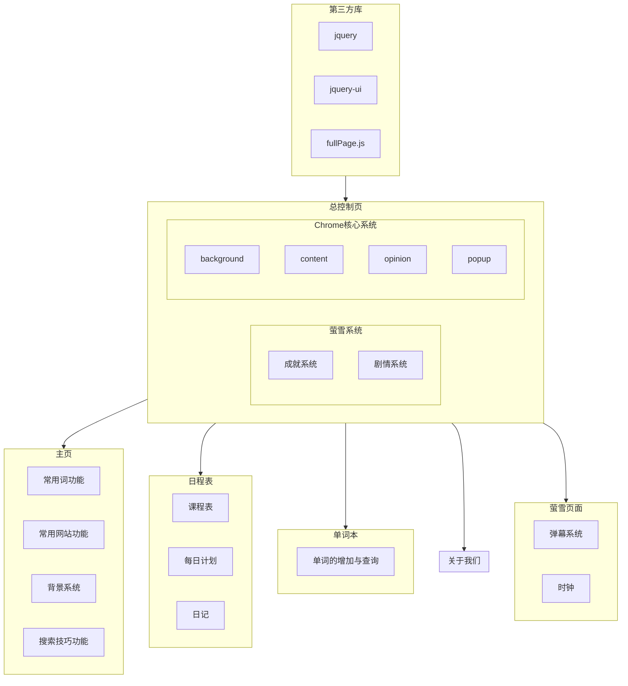

***\ *封面\****   

学习助手Chrome浏览器拓展工具的设计与实现

# 1.设计任务与要求

本次选题的内容是基于Chrome浏览器的拓展开发，目的有两个，第一个是美化默认的浏览器新标签页，第二个是帮助广大学生以及自学者进行高效的学习。在开发中查阅资料，仔细调研，基于《Web应用开发技术》课程所讲授的理论和实践知识，设计实现一个功能完整、界面美观、有实用价值的学习助手浏览器拓展工具。

任务为按照Web开发的一般步骤、设计并实现一个基于Web服务的Chrome浏览器扩展工具。学习助手拓展工具以标签页管理方式运行，功能包括：搜索功能、日程表功能、学习计划功能、日记功能、学习助手系统、单词本功能等。在此基础上完成拓展工具的需求分析、总体设计、内容组织与风格设计、工具应用的数据结构设计，确定开发环境，完成浏览器拓展工具的开发、测试及发布等。

意义在于可以美化浏览器外观的同时，使其拥有强大的辅助学习的功能。

<!--主要说明所选课题的目的、任务和意义。-->

# 2.需求分析

## （1）功能需求

本拓展的功能可以分为以下几个部分：

- 搜索模块
- 课程表模块
- 单词本模块
- 学习助手模块

**搜索模块**，是本拓展最为核心的部分，主要功能包括存储常用关键字，搜索时提示关键字，浏览器搜索技巧的提示、常用网页、动态背景等功能。

**课程表模块**，是本拓展的一个附加模块，主要包括课程表的自定义、每日计划、日记系统等。

**单词本模块**，可以添加自定义的单词，并支持代码和缩略语等多方位的数据记录。

**学习助手模块**，可以对其余模块进行管理，同时也是本拓展游戏方向的核心。包括剧情系统，成就系统等。在每次点开拓展的时候，都会根据当前剧情进度自动加载一个json文件，json文件们包含在story文件夹下。

## （2）性能需求

网站的canvas没有使用硬件减速，可能需要较高CPU的支持。

## （3）数据需求

网站完全运行在离线环境下，不需要有前置数据。

## （4）运行需求

因为本拓展是运行在浏览器环境的，所以只能在浏览器环境运行。

因为本拓展基于Chrome内核，因此浏览器内核需要chrome内核。

本拓展使用了v3版本的拓展架构，请保证chrome版本大于88

本拓展在未来可能会使用webgl，因此请确保浏览器能够支持webgl。

本拓展使用了indexedDB数据库，需要浏览器支持

<!--根据课题调查和分析网站的业务内容、处理的需求，撰写系统的需求说明。具体可以包括：（1）功能需求（功能划分、功能描述）；（2）性能需求（网站性能要求等）；（3）数据需求（网站涉及的数据要求）（4）运行需求（用户界面、软硬件环境等）。-->

-----

# 3.系统设计 

根据网站需求分析，进行网站系统设计，完成网站系统的总体功能框架设计、模块的详细设计、功能分配、处理流程、主要处理的原理及实现算法等。

# 4.数据库设计

本拓展使用的数据库为indexedDB，是一种nosql型数据库。在最初选择数据库的时候，有websql和indexedDB两种选择。websql是关系型数据库，使用的是mysql语言，我们相对来说熟悉这种语言和数据库的使用，但是websql并不是H5的标准规范，在未来可能会有被废弃。而且若要在web中使用mysql，必须以字符串的形式进行执行。代码不够优雅，因此选择了更贴合原生的indexedDB。这种nosql的数据库以键值对进行保存，更贴合js对象。

数据库设计的示例如下，主键设为自动递增的自然数，

| index | 主键 | 值                                                           |      |
| ----- | ---- | ------------------------------------------------------------ | ---- |
| 0     | 1    | {word: 'shader', translate: '着色器', describe: '一种进行着色的渲染引擎'} |      |
| 1     | 2    | {word: 'SPA', translate: '单页面富应用', describe: '一种开发模式'} |      |
| 2     | 3    | {word: 'em', translate: '强调', describe: 'em标签默认是黑体'} |      |
| 3     | 4    | {word: 'html', translate: '超文本标记语言', describe: '一种用于标记的语言'} |      |
| 4     | 5    | {word: 'SPA', translate: '单页面富应用', describe: '一种开发模式'} |      |
| 5     | 6    | {word: 'layout', translate: '布局', describe: '在前端中常指页面的布局'} |      |
| 6     | 7    | {word: 'abbr', abbr: 'abbreviation', translate: '缩写', describe: '一般是指abbr标签'} |      |
| 7     | 8    | {word: 'promise', translate: '承诺', describe: '指JavaScript中一种异步函数', example: 'var promise = \nnew Promise((resolve, reject) => {\n…else\n            reject("不结婚")\n        },1000)\n})'} |      |
| 8     | 9    | {word: 'test', translate: '测试', describe: '测试用'}        |      |

索引为word，约束类型为unique：false。

<!-- 设计网站涉及到的数据库。注：如果网站未涉及数据库，则可忽略该项。-->

# 5. 网站系统开发

<!--根据网站设计，利用相应的开发平台，编程实现网站系统并发布。-->  

网站的发布依赖于Chrome浏览器商店，拓展不可以单独运行在服务器上，只能通过浏览器拓展管理器进行加载。

## 游戏系统

萤雪游戏系统的设计

核心系统由`$systemManager`进行管理与控制，

开始时主要进行创建游戏区域，加载CSS和更新绑定事件等。

因为我在设计这个游戏系统的时候，并没有将其单纯集成到拓展之中，而是更倾向于将其设计为一个独立的游戏系统，可以在任何web环境下独立运行。所以在设计的时候特别注意了降低其耦合性，

可以看到，在游戏的main.js中只需要加入这一句话即可运行游戏系统，换而言之，这个游戏系统是完全独立于浏览器拓展，作为插件一般的存在的。

除此之外就是游戏的剧情系统设计

在设计剧情系统的时候，参考了分镜头稿本的设计，以剧情内容，立绘信息，事件回调三个部分构成。这三个字段都是可以省略的。因为 故事剧情以json文件进行保存，在每次进入游戏的时候，都会判断当前故事的进度，并进行读取。读取到的json数据会进行一个对象的构造。因为我的构造函数全部设置了缺省参数，所以容错率很高，可以空缺任意一个字段。。’

之所以要再进行封装，这是因为，游戏中这些数据除了其值之外还会额外调用一些方法。因此需要再一次封装。

另外，除了这种长篇的内容，我还考虑到了一些短的即时剧情。因为游戏中不可能所有的数据都是提前保存到json里面，需要实时构造新的剧情。所以我对构造函数进行了重载，如果传入对象不是json，也可以单纯进行构造。

如图，单纯进行new脚本也是可以的，通用性很强。

因为考虑到游戏中不可能单纯进行富文本的展示，所以我也设计了一个消息回调的系统，事件的调用同样写在json中。

而具体的执行由游戏的脚本对象负责。

## 主页系统

包括搜索技巧，搜索区域，关键字管理，常用网站等几个部分

其中考虑到以后可能会有很多不同的背景，因此把背景动画系统专门设计成了一个独立的系统。只需要导入canvas标签，并在main.js文件开启动画即可

该动画系统目前仅支持一种背景，但是由于采用了模块化的设计，对其进行后续开发非常容易

## 发布

本拓展不需要站点发布，但是发布的时候，需要依靠浏览器拓展的支持，

在浏览器的拓展界面点击加载已经解压的拓展程序即可

# 6.运行结果和测试

(1) 运行界面及其效果图；

(2) 调试中发现的问题。

在调试时，发现主页的部分元素因为z-index过高，   导致部分按钮被挡住了，修改方法就是把被挡住元素的z-index进行加大。

其次，数据库查询的时候会有bug，目前是根据word索引来查询其内容，但是这个索引在建立数据库的时候，没有写唯一约束，就可能导致多个单词相同的时候，只能搜出来一个单词的翻译。目前以及把它改成了按照主键搜索了。

# 7.总结与体会

在本次课程设计中，我们小组实现了以学习助手为核心的Chrome浏览器拓展，在开发过程中，遇到了很多问题，其中最大的问题就是，chrome最近把内核升级了，Chrome拓展的版本号从V2到了V3，以前很多的教程和代码都不能使用了。因此只能去官网查询新的资料。但是官网最近又将很多范例网页删除了，因此开发时遇到了很多的问题都无法解决。

在开发的过程中，因为最开始策划的不清楚，导致很多功能需求不明确，直到最后才意识到很多功能设计的不合理。

在今后的开发中我们会更加努力学习web知识，对项目进行持续的优化与改进，创造出更加完善的项目。

<!--包括对系统实现的技术方案评价；网站开发成果的质量评价；课程设计过程中开发时间分配与分工评价；经验与教训；总结与体会。-->

# 8.参考资料

[^1]: https://developer.chrome.com/ Chrome开发者官网
[^2]: https://www.wenjiangs.com/docs/chrome-extension-development Chrome拓展及应用开发
[^3]:https://blog.csdn.net/qq_41887214/article/details/123624068 Chrome插件(扩展)开发全攻略

<!--写出具体的主要参考文献，标明其作者、出处、年代、若是期刊文章，需要给出期刊名。（按学术论文参考文献格式汇总）-->

 

