# markdown简介

- 创始人：约翰·格鲁伯（John Gruber）

## 历史


## 语法变体

### GitHub Flavored Markdown

2017年，GitHub发布了基于CommonMark的GitHub Flavored Markdown（GFM）的正式规范。


### Markdown Extra

### LiaScript

# markdown语法

本markdown语法基于GFM（ **G**itHub **F**lavored **M**arkdown。）


## 标题

- 使用`#`标记标题

  最多支持==六级==标题

  ```markdown
  # 一级标题
  ## 二级标题
  ### 三级标题
  #### 四级标题
  ##### 五级标题
  ###### 六级标题
  ```

- 使用`=和-`标记

  支持两级标题

  ```markdown
  一级标题
  =================
  
  二级标题
  -----------------
  ```

  


## 列表


- 无序列表

  ```markdown
  - 无
  - 序
  - 列
  - 表
  ```

  或者

  ```markdown
  + 无
  + 序
  + 列
  + 表
  ```

  或者

  ```markdown
  * 无
  * 序
  * 列
  * 表
  ```

  


- 有序列表

  ```markdown
  1. 有
  2. 序
  3. 列
  4. 表
  ```

  

  

## 任务列表

```markdown
- [ ] 这是一个任务列表项
- [ ] 需要在前面使用列表的语法
- [ ] normal **formatting**, @mentions, #1234 refs
- [ ] 未完成
- [x] 完成
```

## 文本高亮

```markdown
==高亮==
```


## 斜体

```markdown
*斜体* 
_斜体_
```


## 粗体

```markdown
**粗体**
__粗体__
```


## 斜体粗体

```markdown
***斜体加粗***
```


## 删除线

```markdown
~~删除线~~
```


## 上标与下标

```markdown
文本^上标^ 
文本~下标~ 
```


## 表格

`---- `代表左对齐

` :--:`代表居中

`---:`代表右对齐

```markdown
| 表头 | 表头 | 表头 |
| ---- | :--: | ---: |
| 内容 | 内容 | 内容 |
| 内容 | 内容 | 内容 |
```


使用HTML的办法可以实现表格内的列表

**快捷键：shift+enter**


## 代码块

- 单行代码

  ```markdown
  `单行代码`
  ```

  

- 多行代码

  ~~~markdown
  ```程序语言
  	多行代码
  ```
  ~~~

  


## 数学公式

```markdown
$单行公式$
```


```markdown
$$
	多行公式
$$
```


## 引用

用`>`+空格，后面就可以来写需要的引用了。

```markdown
> 
> 引用 1
>
> > 引用2
```


引用里面还可以嵌套列表

> 1. 第一项
> 2. 第二项
>
> 
>
> -  无序列表
> - 无序列表
>
> 


## 图片

```markdown   

	
```

鼠标文字可选


## emoji

快捷键<kbd>win+.</kbd>，可以打开emoji菜单。

```markdown
:horse:
```

:horse:


## 脚注

所谓的脚注就是对一些名词的注释，在书籍里面经常能看到。

```markdown
定义脚注[^1]

引入具体内容
[^1]:脚注内容
```


## 水平分割线


```markdown
---
或者
***
```


## 目录

```markdown
[TOC]
```

## 链接

- 内联链接

  可以加描述也可以不加

  ```markdown
  [显示文本内容](链接地址 "提示信息文本")
  
  [This link](http://example.net/) 
  ```

- 内部链接

  url前面加上标题的markdown代码就行

  ```markdown
  [示例](##yaml "描述信息") 
  ```

- 参考链接

  ```markdown
  [百度一下，你就知道][度娘]
  [知乎-有问题，就会有答案][知乎]
  
  <!-- 这里是变量区域 -->
  [度娘]: http://www.baidu.com 
  [知乎]: https://www.zhihu.com  
  ```

- url链接

  直接用尖括号后面跟上http，后面加上url就可以了

  ```markdown
  <http://url>
  ```

  

# YAML语法

YAML是<u>（AML Ain't a Markup Language）</u>的递归缩写，

## 基本语法

- 大小写敏感
- 使用缩进表示层级关系
- 缩进不允许使用tab，只允许空格
- 缩进的空格数不重要，只要相同层级的元素左对齐即可

## 注释

使用#作为注释

```yaml
--- #注释

```


## 纯量


```yaml
boolean: 
	- Yes 
    - TRUE  #true,True都可以
    - FALSE  #false，False都可以
float:
    - 3.14
    - 6.8523015e+5  #可以使用科学计数法
    - !!float 123             # 严格浮点数
int:
    - 123 # 整數
    - 0b1010_0111_0100_1010_1110    #二进制表示
null:
    nodeName: 'node'
    parent: ~  #使用~表示null
string:
    - 哈哈
    - 'Hello world'  #可以使用双引号或者单引号包裹特殊字符
    - "123"                   
    - newline
      newline2    #字符串可以拆成多行，每一行会被转化成一个空格
    - !!str 123               # 严格字符串
date:
    - 2018-02-17    #日期必须使用ISO 8601格式，即yyyy-MM-dd
datetime: 
    -  2018-02-17T15:02:31+08:00    #时间使用ISO 8601格式，时间和日期之间使用T连接，最后使用+代表时区
```


## 数组

也被称为序列（sequence） / 列表（list）


区块格式（block format）

```yaml
--- #小萝莉们
- 小丛雨
- 小智乃
- 小康娜
```


内联格式（inline format）

用中括号包围，并用逗号+空白区隔

```yaml
--- #小萝莉们
[小丛雨, 小智乃, 小康娜]
```

## 对象

又称为映射（mapping）/ 哈希（hashes） / 字典（dictionary）

```yaml
 --- 
 芳乃:
   name: 芳乃
   age: 18
```


内敛形式

```yaml
 ---
 芳乃:{name: John Smith, age: 33}
```


## 文本换行

### 保留换行(Newlines preserved)

```yaml
data: |
	可
	以
	换
	行

```

根据默认，每行开头的缩进（以首行为基准）和行末空白会被去除，而不同的缩进会保留差异。


### 折叠换行(Newlines folded)

```yaml
data: >
   折叠文字将会
   被收进一个
   段落      
   
   空白的行代表
   段落之间的间隔
```

和保留换行不同的是，只有空白行才视为换行，原本的换行字符会被转换成空白字符，而行首缩进会被去除。

## 树

yaml的各个数据结构可以被折叠起来。

&代表着锚点标记的位置；<<代表着合并到锚点。*代表锚点的id。


```yaml
#眼部雷射手術之標準程序
---
- step:  &id001                  # 定義錨點標籤 &id001
    instrument:      Lasik 2000
    pulseEnergy:     5.4
    pulseDuration:   12
    repetition:      1000
    spotSize:        1mm

- step:
     <<: *id001                  # 合併鍵值：使用在錨點標籤定義的內容
     spotSize:       2mm         # 覆寫"spotSize"鍵值

- step:
     <<: *id001                  # 合併鍵值：使用在錨點標籤定義的內容
     pulseEnergy:    500.0       # 覆寫鍵值
     alert: >                    # 加入其他鍵值
           warn patient of 
           audible pop
```


## 综合

```yaml
萤雪人物:
	- 
		name:萤雪
		age:24
	-   
		name:映月
		age:18
```


# YAML Front Matter

这个东西是专门加强markdown文件信息能力的标记。

它必须位于文档开头，开启代码如下

```yaml
---
title: 文档的标题
---
```


## 导出HTML

网页的标题就是这个

```yaml
---
title: 文档的标题
---
```


## 导出PDF

PDF文件的属性中可以查看下面的信息

```yaml
---
title: 标题
author: 作者
creator: 创作文章的程序
subject: 文章的主题
keywords: [关, 键, 字]
---
```


# 结构与样式语法


## html语法


### 缩写

```html
<abbr title="爷的青春结束了">爷青结</abbr>
```

<abbr title="爷的青春结束了">爷青结</abbr>


### 地址

```html
<address>地址</address>
```

<address>地址</address>

### 对话框

```html
<dialog open>这是打开的对话窗口</dialog>
```

<dialog open>这是打开的对话窗口</dialog>


### 进度条

```html
<progress value="90" max="100"></progress>
```

<p>
    <progress value="90" max="100"></progress>
</p>


### 语义化标签

| html标签   | 含义          |
| ---------- | ------------- |
|            |               |
|            |               |
| `<bdi>`    |               |
| `<time>`   | 定义日期/时间 |
|            |               |
| `<nav>`    | 定义导航链接  |
|            |               |
| `<footer>` | 定义页脚      |
|            |               |


### 隐藏内容

需要`<details>`和`<summary>`搭配使用

```html
<details>
<summary>显示的内容</summary>
隐藏的内容
</details>
```


<details>
<summary>显示的内容</summary>
	隐藏的内容
</details>


### 下划线

```html
<ins>这个表示下划线，填空题经常会看到</ins>
<u>u也有同样的下划线</u>
```


### 换行

```html
<br/>
```

常和原生的markdown表格搭配使用


### 键盘文本

```html
<kbd>ctrl</kbd>+<kbd>c</kbd>
```


<kbd>ctrl</kbd>+<kbd>c</kbd>


### 平假名与拼音

```html
<ruby>  蓮華 <rt> れんげ </rt> </ruby>
<ruby>  莲华 <rt> lián huá </rt> </ruby>
```

 <ruby>  蓮華 <rt> れんげ </rt> </ruby>                     <ruby>        莲华 <rt> lián huá </rt> </ruby>


### HTML转义字符

| 显示 | 说明           | 实体名称  | 实体编号  |
| ---- | -------------- | --------- | --------- |
|      | 半方大的空白   | `&ensp;`  | `&#8194;` |
|      | 全方大的空白   | `&emsp;`  | `&#8195;` |
|      | 不断行的空白格 | `&nbsp;`  | `&#160;`  |
| <    | 小于           | `&lt;`    | &#60;     |
| >    | 大于           | `&gt;`    | &#62;     |
| &    | &符号          | `&amp;`   | &#38;     |
| "    | 双引号         | `&quot;`  | &#34;     |
| ©    | 版权           | `&copy;`  | &#169;    |
| ®    | 已注册商标     | `&reg;`   | &#174;    |
| ™    | 商标（美国）   | ™         | &#8482;   |
| ×    | 乘号           | `&times;` | &#215;    |
| ÷    | 除号           | `&pide;`  | &#247;    |

### 音频


```html
<audio  controls="" preload="none"> <source id="mp3" src="xxx.mp3"> </audio>
```

<audio  controls="" preload="none"> <source id="mp3" src="xxx.mp3"> </audio>


### 视频


```html
<video width="320" height="240" controls="controls">
  <source src="movie.mp4" type="video/mp4">
</video>
```

<video width="320" height="240" controls="controls">
  <source src="movie.mp4" type="video/mp4">
</video>


### 内嵌网页

用`iframe`标签实现。


<iframe src="https://space.bilibili.com/36163336/favlist?fid=1589150436&ftype=create" style="height:500px;width:100%"></iframe>


### 注释

在markdown中，注释虽然可以被渲染，但是在导出来的时候，注释是不可见的。

```html
<!--注释-->
```

<!--注释-->

### 表格

```html
<table>
    <caption>表格标题</caption>
	<thead>
		<tr>
			<th>妹子</th>
			<th>特征</th>
		</tr>
	</thead>
	<tfoot>
		<tr>
			<th>总体评价</th>
			<th>都是我老婆</th>
		</tr>
	</tfoot>
	<tbody>
		<tr>
			<td>牛顿</td>
			<td>金毛双马尾</td>
		</tr>
		<tr>
			<td>哈雷</td>
			<td>大胸软萌</td>
		</tr>
		<tr>
			<td>拉瓦锡</td>
			<td>腹黑</td>
		</tr>
	</tbody>
</table>
```


### 表单

### 列表

```html
<dl>
  <dt>定义列表</dt>
  <dd>是专门写定义的列表,如下</dd>
  <dt>定义:</dt>
  <dd>我是内容</dd>
</dl>
```


<dl>
  <dt>定义列表</dt>
  <dd>是专门写定义的列表,如下</dd>
  <dt>定义:</dt>
  <dd>我是内容</dd>
</dl>
## CSS语法

### 图片样式


### 文字样式

```html
<span style="font-size:2rem;color:red; background:yellow;">测试</span>
```


<p id="a">123 **qwe**</p>


# 绘图语法

## Sequence语法

通过js-sequence实现的图表。

```sequence
Andrew->China: Says Hello
Note right of China: China thinks\nabout it
China-->Andrew: How are you?
Andrew->>China: I am good thanks!
```


```sequence
Title: 标题：复杂使用
对象A->对象B: 对象B你好吗?（请求）
Note right of 对象B: 对象B的描述
Note left of 对象A: 对象A的描述(提示)
对象B-->对象A: 我很好(响应)
对象B->小三: 你好吗
小三-->>对象A: 对象B找我了
对象A->对象B: 你真的好吗？
Note over 小三,对象B: 我们是朋友
participant C
Note right of C: 没人陪我玩
```


## Flowchart语法

```flow
st=>start: Start
op=>operation: Your Operation
cond=>condition: Yes or No?
e=>end

st->op->cond
cond(yes)->e
cond(no)->op
```


```flow
st=>start: 开始框
op=>operation: 处理框
cond=>condition: 判断框(是或否?)
sub1=>subroutine: 子流程
io=>inputoutput: 输入输出框
e=>end: 结束框
st->op->cond
cond(yes)->io->e
cond(no)->sub1(right)->op
```


## mermaid语法

### Sequence Diagrams（时序图）

```gfm
%% Example of sequence diagram
  sequenceDiagram
    Alice->>Bob: Hello Bob, how are you?
    alt is sick
    Bob->>Alice: Not so good :(
    else is well
    Bob->>Alice: Feeling fresh like a daisy
    end
    opt Extra response
    Bob->>Alice: Thanks for asking
    end
```


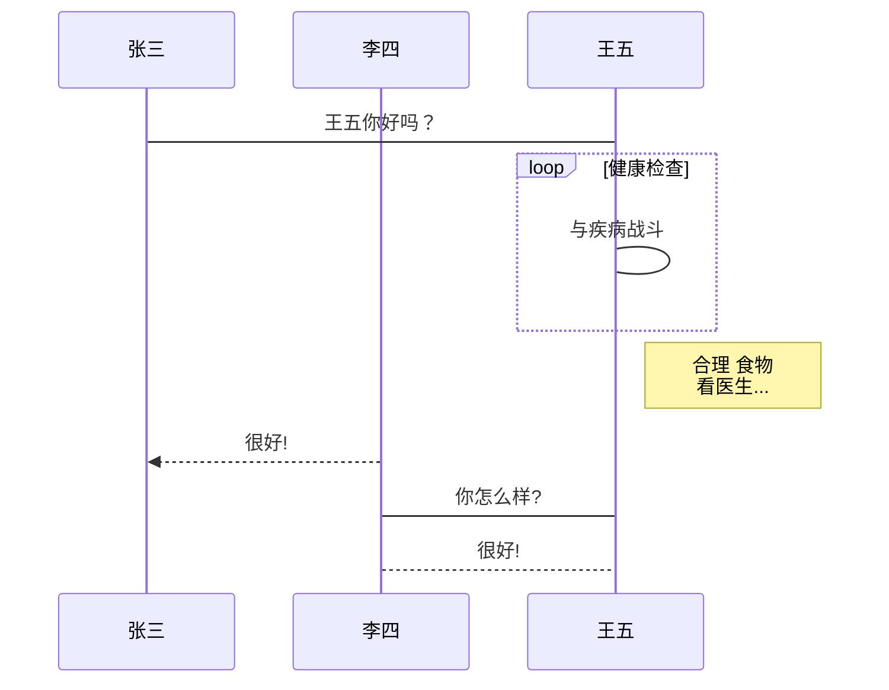


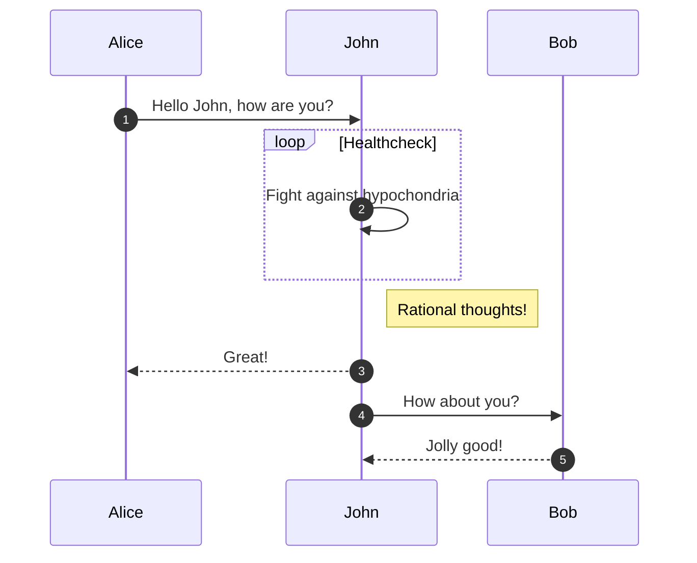


### Flowcharts（流程图）


要注意`graph`和`flowchart`的区别在于，graph对子图不支持。如果需要强大的效果还是需要用flowchart。

#### 图表方向

- TB - 从上到下
- TD - 自上而下/与自上而下相同
- BT - 自下而上
- RL - 从右到左
- LR - 从左到右


#### 基本语法

基本语法如下：

- 用**flowchart**开启流程图

- 然后就是在流程图中节点的内容，可以直接用文字标记。也可以用id后面加内容。

- **如果一个节点拥有了id**，那么还可以来规定节点的形状。详细见下文。

  ```markdown
  id1(圆形边框)
  ```

- 两个顶点的相连见下文。

#### 子图

```markdown
flowchart TD
	subgraph CPU
	id(1)
	end
```


#### 节点形状

- 圆形

  ```markdown
  id1(圆形边框) 
  ```

  

  ```mermaid
  flowchart  TD 
  	id1(圆形边框) 
  ```

- 圆角边框

  ```markdown
  id2([圆角边框])   
  ```

  ```mermaid
  flowchart  TD 
  	id2([圆角边框])  
  ```

- 矩形边框

  

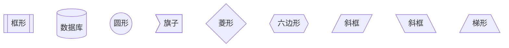


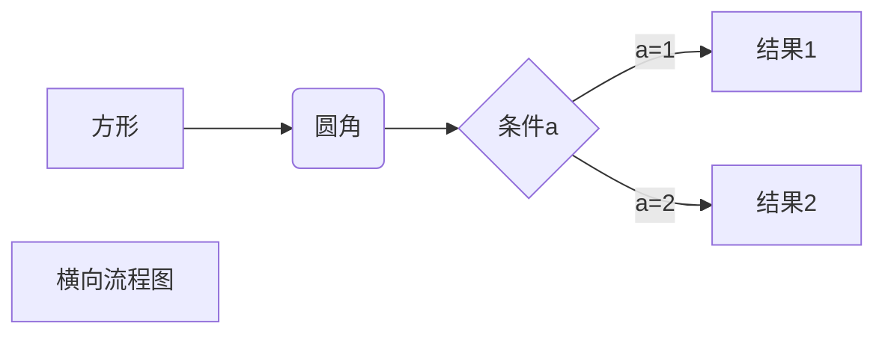


#### 连接线条的样式


- A link with arrow head（箭头）

  ```markdown
  flowchart LR
      A-->B
  ```

  

  ```mermaid
  flowchart LR
      A-->B
  ```

- An open link

  ```markdown
  flowchart LR
      A --- B
  ```

  

  ```mermaid
  flowchart LR
      A --- B
  ```

- Text on links（带有文字的连接）

  ```
  flowchart LR
      A-- This is the text! --B
  ```
  
  或者是
  
  ```
  flowchart LR
      A---|This is the text|B
  ```
  
  

 

​    

  ```mermaid
  flowchart LR
      A-- This is the text! ---B
  ```

  

- A link with arrow head and text

  ```
  flowchart LR
      A-->|text|B
  ```

  或者是

  ```
  flowchart LR
      A-- text -->B
  ```

  

  ```mermaid
  flowchart LR
      A-->|text|B
  ```

- Dotted link

  ```
  flowchart LR;
     A-.->B;
  ```

  ```mermaid
  flowchart LR;
     A-.->B;
  ```

  


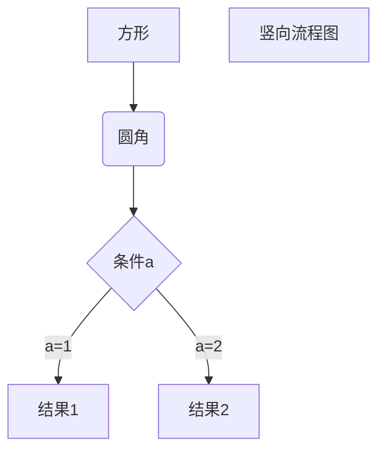


#### 内置html

在内容中直接写html元素即可

```
flowchart TD

subgraph 原始艺术[原始艺术]
   1[<li>新石器时代艺术</li><li>古埃及艺术</li><li>两河流域艺术</li>]
end
```


#### 内置CSS

fill、stroke、stroke-width、color`是CSS中的概念，分别表示`填充、边框、边框宽度、字体颜色

1. 使用style关键字进行定义
2. 使用classDef关键字定义

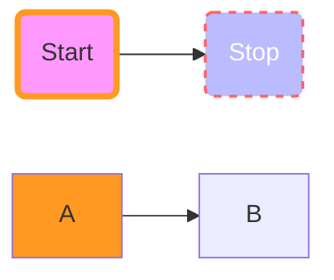


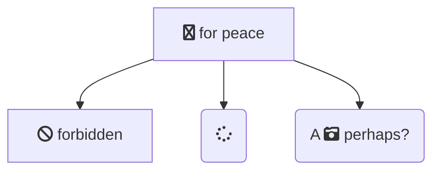


### Gantt Charts（甘特图）


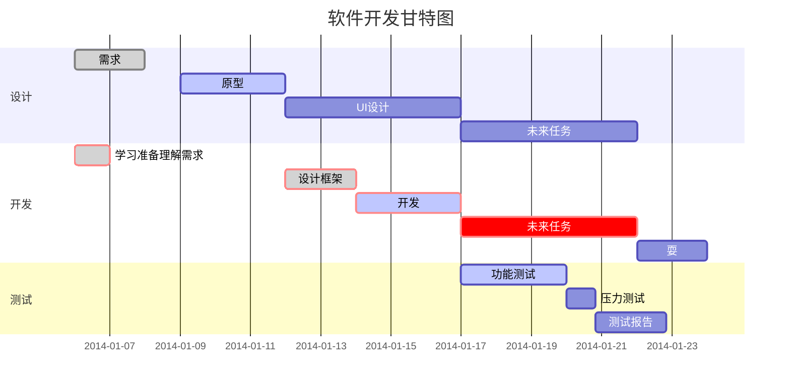


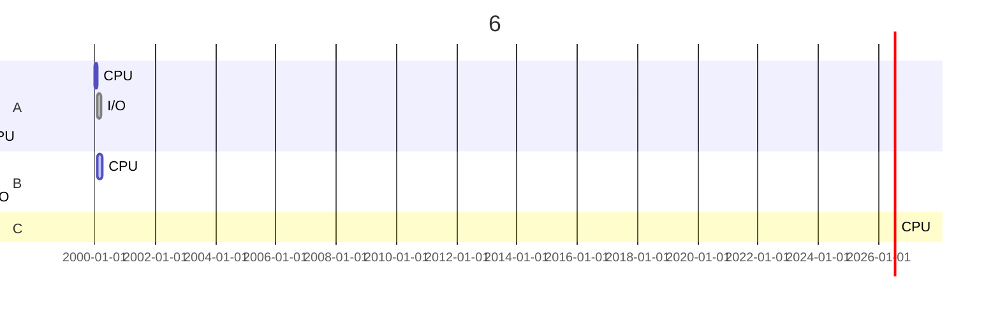


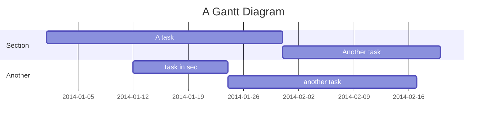


### Class Diagrams（类图）

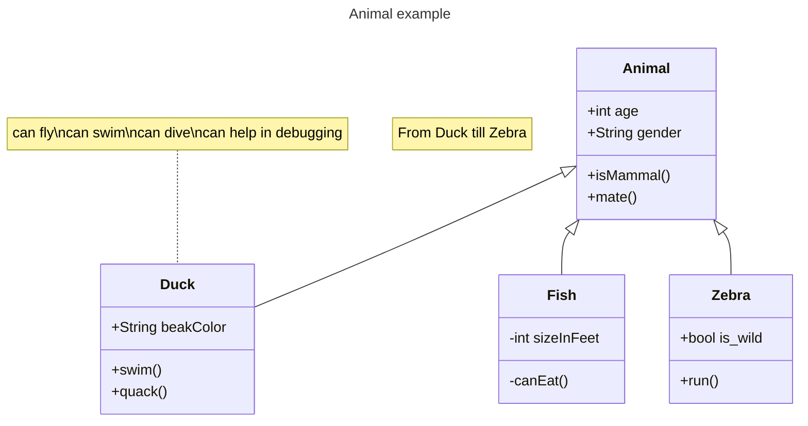


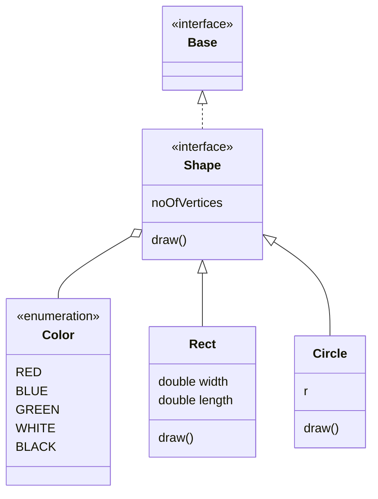


### State Diagrams（状态图）

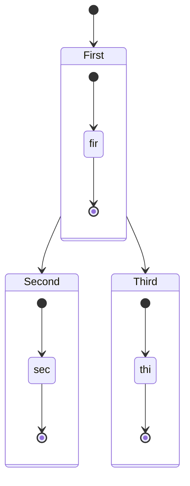


### User Journey Diagram（用户旅程图）

> 用户旅程高度详细地描述了不同的用户在一个系统、应用程序或网站中完成特定任务的步骤。这种技术显示了当前（现状）的用户工作流程，并揭示了未来工作流程中需要改进的地方。(维基百科)


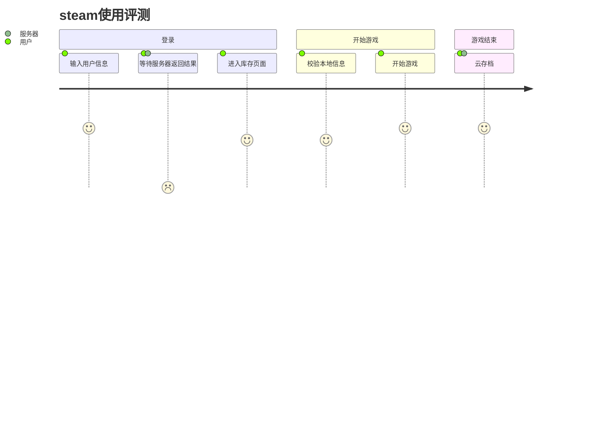


### Pie Charts（饼图）

```
pie 
    title 计算机系性别比例图
    "男" : 50
    "女" : 20
    "伪娘" : 30
```


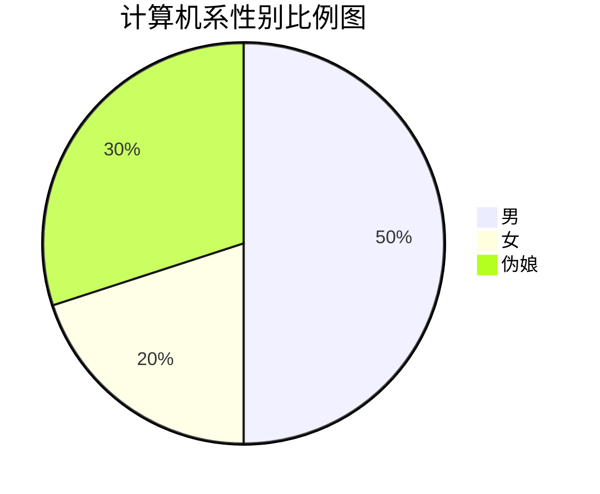

### ER图

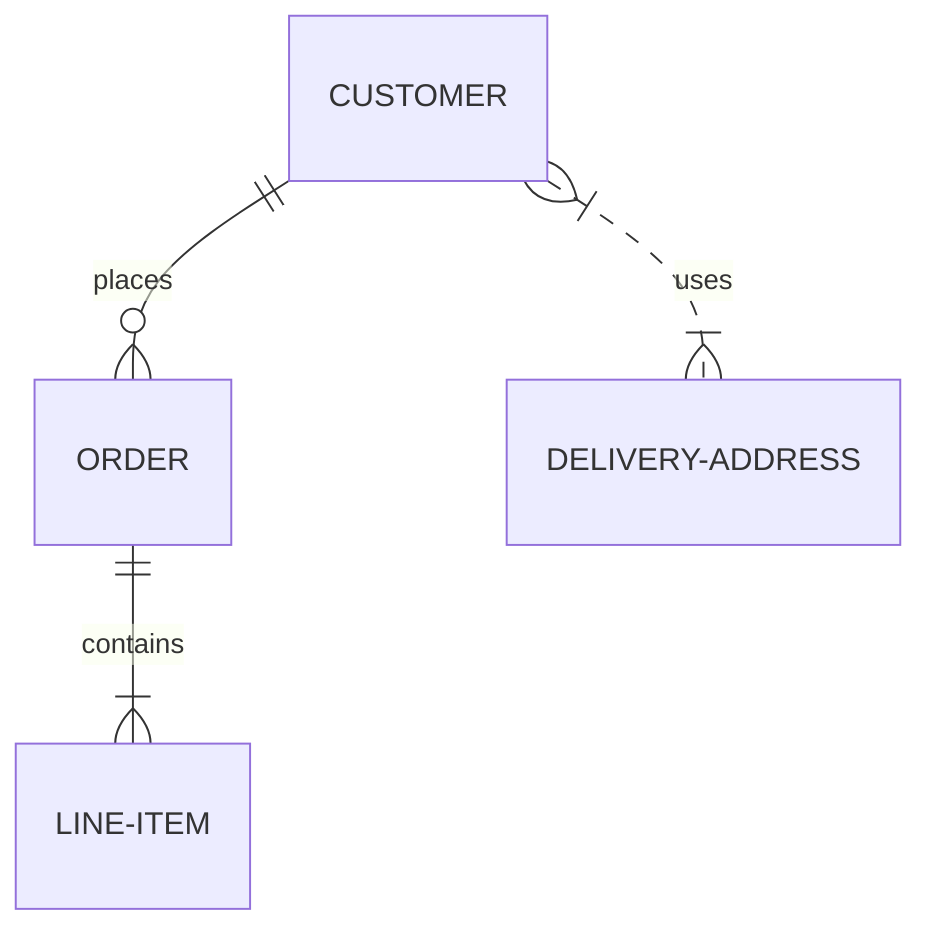


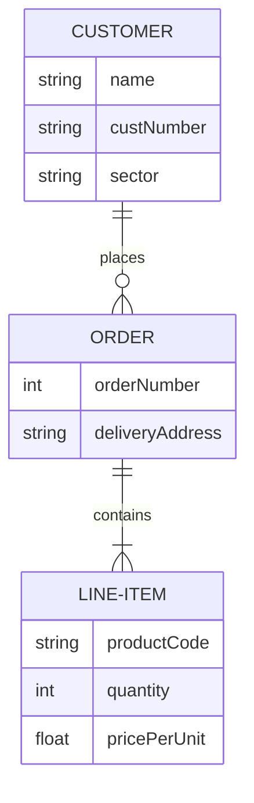

### git图


# latex数学公式语法

## 微积分


## 数理逻辑

## 线性代数

### 向量

```latex
\vec{a} 
```

### 点积

```latex
点乘：a \cdot b

叉乘：a \times b

点除：a \div b

分数：\frac {a} {b}
```


### 圆形矩阵

```latex
\begin{pmatrix}
    1 & 0 & 0\\
    0 & 1 & 0\\
    0 & 0 & 1\\
\end{pmatrix}
```

$$
\begin{pmatrix}
    1 & 0 & 0\\
    0 & 1 & 0\\
    0 & 0 & 1\\
\end{pmatrix}
$$

### 方形矩阵

```latex
\begin{bmatrix}
    1 & 0 & 0\\
    0 & 1 & 0\\
    0 & 0 & 1\\
\end{bmatrix}
```

$$
\begin{bmatrix}
    1 & 0 & 0\\
    0 & 1 & 0\\
    0 & 0 & 1\\
\end{bmatrix}
$$


### 行列式

```latex
\begin{vmatrix}
    1 & 0 & 0\\
    0 & 1 & 0\\
    0 & 0 & 1\\
\end{vmatrix}
```

$$
\begin{vmatrix}
    1 & 0 & 0\\
    0 & 1 & 0\\
    0 & 0 & 1\\
\end{vmatrix}
$$


### 复杂矩阵

```latex
A = 
    \begin{pmatrix}
        a_{11} & a_{12} & \cdots & a_{1n}\\
        a_{21} & a_{22} & \cdots & a_{2n}\\
        \vdots & \vdots & \ddots & \vdots\\
        a_{n1} & a_{n2} & \cdots & a_{nn}\\
    \end{pmatrix}
```

$$
A = 
    \begin{pmatrix}
        a_{11} & a_{12} & \cdots & a_{1n}\\
        a_{21} & a_{22} & \cdots & a_{2n}\\
        \vdots & \vdots & \ddots & \vdots\\
        a_{n1} & a_{n2} & \cdots & a_{nn}\\
    \end{pmatrix}
$$


## 转义字符表


数学公式一般`$  $`来包起来,表示行内公式,而比较重要的大型公式则用`$$  $$`包起来.

```latex
%建议加入宏包
\usepackage{listings}
```


## 基础语法

### 加减乘除

```latex
$x_1 = 3 + 2 - 1$
$x_2 = t_1 \times t_2$
$x_2 = t_1 \cdot t_2$
$y = \frac{x_1}{x_2}$
$y = {x_1}/{x_2}$
$y = {x_1} \div {x_2}$
$y = {x\pm y}$
```

结果如下:
$x_1 = 3 + 2 - 1$
$x_2 = t_1 \times t_2$
$x_2 = t_1 \cdot t_2$
$y = \frac{x_1}{x_2}$
$y = {x_1}/{x_2}$
$y = {x_1} \div {x_2}$
$y = {x\pm y}$


### 上标和下标

```latex
$a^2$
```

$a^2$

```latex
$x_1$
```

$x_1$

```latex
$x^n_0$
```

$x^n_0$


## 角度

```latex
120^{\circ}
```

$120^{\circ}$


## 绝对值

```latex
$\vert$
```

$\vert$

### 向上取整,向下取整

```latex
$\lfloor x \rfloor$
```

$\lfloor x \rfloor$

```latex
$\lceil x \rceil$
```

$\lceil x \rceil$

### 根式

```latex
\sqrt{3}
\sqrt[n]{3}
```

$\sqrt{3}$      $\sqrt[n]{3}$

### 花体字母

```latex
%写花体字母要加下面的宏包
\usepackage{amsthm,amsmath,amssymb}
\usepackage{mathrsfs}
\usepackage{amssymb}

$\mathbb{R}$
$\mathcal{R}$
$\mathscr{R}$
```

$\mathbb{R}$  $\mathcal{R}$  $\mathscr{R}$

### 循环小数

```latex
0.\dot{9}
```

$0.\dot{9}$


## 求和

行内情况：

```latex
p = \sum\nolimits_{n=1}^Na_n
```

$p = \sum\nolimits_{n=1}^Na_n$

独立情况：

```latex
p = \sum\limits_{n=1}^Na_n
```

$p = \sum\limits_{n=1}^Na_n$

## 多行公式

### 多行公式

自带序号

```latex
\begin{gather}
a+b=b+a\\
ab=ba
\end{gather}
```

$$
\begin{gather}
  a+b=b+a\\
  ab=ba
\end{gather}
$$

如果不想要序号可以使用gather*

```latex
\begin{gather*}
a+b=b+a\\
ab=ba
\end{gather*}
```

如果只想要个别有序号,可以指定notag

```latex
\begin{gather}
a+b=b+a \notag\\
ab=ba
\end{gather}
```

## 一个公式写成多行

```latex
\begin{equation*}
\begin{split}
\cos2x&=\cos^2x-\sin^2x\\
&=2\cos^2x-1
\end{split}
\end{equation*}
```

$$
\begin{equation*}
  \begin{split}
  \cos2x&=\cos^2x-\sin^2x\\
  &=2\cos^2x-1
  \end{split}
  \end{equation*}
$$

## 分段函数

```latex
D(x)=\begin{cases}
1,&\text{如果} x \in \mathbb{Q};\\
0,&\text{如果} x \in \mathbb{R} \setminus \mathbb{Q}.
\end{cases}
```

$$
\begin{equation*}
D(x)=\begin{cases}
1,&\text{如果} x \in \mathbb{Q};\\
0,&\text{如果} x \in \mathbb{R} \setminus \mathbb{Q}.
\end{cases}
\end{equation*}
$$

## 公式对齐

```latex
\begin{align*}
  A &= B + C \\
    &= C + D + C \\
    &= 2C + D
\end{align*}
```

$$
\begin{align*}
  A &= B + C \\
    &= C + D + C \\
    &= 2C + D
\end{align*}
$$


## 数理逻辑

```latex
\bar{q} \to p
```

$\bar{q} \to p$


## 特殊符号

| 语法         | 效果             | 语法         | 效果           | 语法           | 效果              |
| :----------- | :--------------- | :----------- | :------------- | :------------- | :---------------- |
| \bar{x}      | $\bar{x}$        | \acute{\eta} | $\acute{\eta}$ | \check{\alpha} | $\check{\alpha} $ |
| \grave{\eta} | $ \grave{\eta} $ | \breve{a}    | $\breve{a}$    | \ddot{y}       | $\ddot{y}$        |
| \dot{x}      | $\dot{x}$        | \hat{\alpha} | $\hat{\alpha}$ | \tilde{\iota}  | $\tilde{\iota}$   |


|            |              |      |
| ---------- | ------------ | ---- |
| \sin\theta | $\sin\theta$ |      |
|            |              |      |
|            |              |      |


## latex转义字符表

## 格式符号

|   代码   |            解释             |
| :------: | :-------------------------: |
|  \qquad  |            空格             |
|   \par   |            换行             |
|   \\\    |            换行             |
| \newline |            换行             |
| \newpage | 命令结束当前页,开始新的一页 |

## 希腊字母表

如果想要使用希腊字母请用数学符号块`$ $`来包起来,latex认为这些属于数学符号

| 代码     | 小写符号   | 代码     | 大写符号   |
| -------- | ---------- | -------- | ---------- |
| \alpha   | $\alpha$   | \Alpha   | $\Alpha$   |
| \beta    | $\beta$    | \Beta    | $\Beta$    |
| \gamma   | $\gamma$   | \Gamma   | $\Gamma$   |
| \delta   | $\delta$   | \Delta   | $\Delta$   |
| \epsilon | $\epsilon$ | \Epsilon | $\Epsilon$ |
| \zeta    | $\zeta$    | \Zeta    | $\Zeta$    |
| \nu      | $\nu$      | \Nu      | $\Nu$      |
| \xi      | $\xi$      | \Xi      | $\Xi$      |
| \omicron | $\omicron$ | \Omicron | $\Omicron$ |
| \pi      | $\pi$      | \Pi      | $\Pi$      |
| \rho     | $\rho$     | \Rho     | $\Rho$     |
| \sigma   | $\sigma$   | \Sigma   | $\Sigma$   |
| \eta     | $\eta$     | \Eta     | $\Eta$     |
| \theta   | $\theta$   | \Theta   | $\Theta$   |
| \iota    | $\iota$    | \Iota    | $\Iota$    |
| \kappa   | $\kappa$   | \Kappa   | $\Kappa$   |
| \lambda  | $\lambda$  | \Lambda  | $\Lambda$  |
| \mu      | $\mu$      | \Mu      | $\Mu$      |
| \tau     | $\tau$     | \Tau     | $\Tau$     |
| \upsilon | $\upsilon$ | \Upsilon | $\Upsilon$ |
| \phi     | $\phi$     | \Phi     | $\Phi$     |
| \chi     | $\chi$     | \Chi     | $\Chi$     |
| \psi     | $\psi$     | \Psi     | $\Psi$     |
| \omega   | $\omega$   | \Omega   | $\Omega$   |

## 比较运算符

| 代码        | 符号        | 含义     |
| ----------- | ----------- | -------- |
| \le 或 \leq | $\le$       | 小于等于 |
| \leqslant   | $\leqslant$ | 小于等于 |
| \ge 或 \geq | $\ge$       | 大于等于 |
| \geqslant   | $\geqslant$ | 大于等于 |

## 常用运算符

| 代码            | 符号              | 含义   |
| --------------- | ----------------- | ------ |
| \approx         | $\approx$         | 约等于 |
| \%              | $\%$              | 模     |
| \mod            | $ 3 \mod 4$       | 模     |
| \neq            | $\neq$            | 不等于 |
| \frac{x_1}{x_2} | $\frac{x_1}{x_2}$ | 除法   |


## 数理逻辑

| 代码          | 符号        | 含义 |
| ------------- | ----------- | ---- |
| \lnot 或 \neg | $\lnot$     | 非   |
|               |             |      |
| \wedge        | $\wedge$    | 析取 |
| \bigwedge     | $\bigwedge$ |      |
| \vee          | $\vee$      | 合取 |
| \bigvee       | $\bigvee$   |      |
| \to           | $\to$       | 蕴含 |
| \forall       | $\forall$   | 任意 |
| \exists       | $\exists$   | 存在 |
|               |             |      |
|               |             |      |
|               |             |      |
|               |             |      |


## 推理证明


| 代码               | 符号                 | 含义     |
| ------------------ | -------------------- | -------- |
| \because           | $\because$           | 因为     |
| \therefore         | $\therefore$         | 所以     |
| \rightleftharpoons | $\rightleftharpoons$ | 充要条件 |
| \Rightarrow        | $\Rightarrow$        | 单向推理 |
| \forall            | $\forall$            | 任意     |
| \exists            | $\exists$            | 存在     |
| \leftrightarrow    | $\leftrightarrow$    | 命题等值 |
| \Leftrightarrow    | $\Leftrightarrow$    | 公式等价 |
|                    |                      |          |


## 集合论

| 代码        | 符号          | 含义     |
| ----------- | ------------- | -------- |
| \subseteq   | $\subseteq$   | 包含     |
| \subsetneqq | $\subsetneqq$ | 真包含   |
| \in         | $\in$         | 属于     |
| \ni         | $\ni$         | 属于     |
| \notin      | $\notin$      | 不属于   |
|             |               |          |
| \cup        | $\cup$        | 并集     |
| \bigcup     | $\bigcup$     | 广义并集 |
| \cap        | $\cap$        | 交集     |
| \bigcap     | $\bigcap$     | 广义交集 |
| \oplus      | $\oplus$      | 对称差   |
|             |               |          |
| \varnothing | $\varnothing$ | 空集     |
|             |               |          |
|             |               |          |
|             |               |          |
|             |               |          |
|             |               |          |
|             |               |          |
|             |               |          |
|             |               |          |
|             |               |          |
|             |               |          |
|             |               |          |
|             |               |          |
|             |               |          |
|             |               |          |
|             |               |          |
|             |               |          |

## 微积分

| 代码        | 符号          | 含义         |
| ----------- | ------------- | ------------ |
| \sum        | $\sum$        | 求和         |
| \prod       | $\prod$       | 连乘         |
| \lim        | $\lim$        | 极限         |
| \int        | $\int$        | 不定积分     |
| \iint       | $\iint$       | 二重不定积分 |
| \iiint      | $\iiint$      | 三重不定积分 |
| \oint       | $\oint$       | 曲线积分     |
| \mathrm{d}x | $\mathrm{d}x$ | 微分算子     |
| \mathrm{d}y | $\mathrm{d}y$ | 微分算子     |
| \infty      | $\infty$      | 无穷         |
| \triangle   | $\triangle$   |              |
| \nabla      | $\nabla$      | 全微分       |


# Typora使用技巧


## 在导出的HTML中使用Yaml的变量

在偏好设置中——找到导出——html。然后选择`在<head/>中添加`，就可以将yaml的变量动态的导入了。


```yaml
--- 
author: 闫辰祥
description: markdown教程
---
```


```html
<meta charset="UTF-8">
<meta name="author" content="${author}">
<meta name="description" content="${description}">
```


<!-- 123123-->


<abbr>asd</abbr>


## 图片保存到相对路径

一般来说,如果复制图片到Typora里面,Typora会默认把图片存入C:\Users\17966\AppData\Roaming\Typora\typora-user-images这个路径下,为了更好管理资源,或者移植到别的计算机,我们应该使用相对路径来存放资源.

我个人喜欢把图片放到本目录下的img文件夹里面,这也是一种良好的代码习惯,甚至官方的示例文档也是这末做的,所以直接照搬我的路径就行

1. 左上角文件-偏好设置
2. 直接照我的改,路径为`./img`

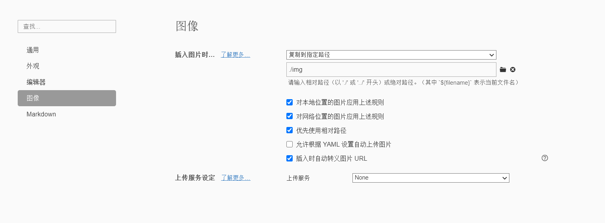


## pandoc安装

Typora支持导出的文件类型很多，但是需要借助第三方插件，我们就使用pandoc就行了。

1. 在github下载最新版pandoc 下载地址：https://github.com/jgm/pandoc/releases/tag/2.10.1
2. 下载.msi文件
3. 双击.msi安装，之后会默认装到 C:\Users\17966\AppData\Local\Pandoc
4. 打开cmd输入`pandoc --help`测试安装是否成功，成功的话就有一大推提示命令
5. 如果不成功，需要手动配置环境变量

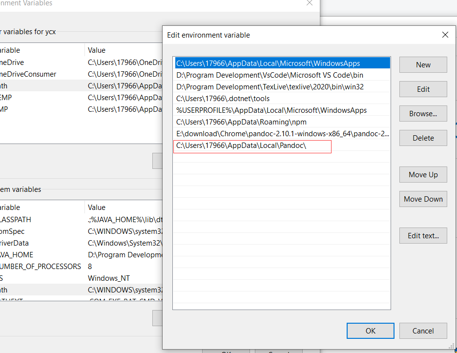

6. 重启电脑

注意:导出latex默认不支持中文,需要把tex文件里面`\documentclass[]{article}`修改为`\documentclass{ctexart}`之后一切正常,非常好用.


## 为typora的图标加入动态alt

```css
#write .md-image:after {
  content: " (" attr(alt) ")" !important;
  color: black;
  text-align: center;
  width: 100%;
  display: inline-block;
} 
```


# Typora主题编写

## 重写主题

### typora渲染层级

typora的样式渲染有四个层级

1. Typora的基本风格

2. 当前主题的CSS

3. base.user.css 在主题文件夹下

4. {current-theme}.user.css 在主题文件夹下。

   如果要为**特定主题**修改某些CSS ，例如“ Newsprint”，则可以创建newsprint.user.css并附加所需的CSS。

### 主题命名

- 不可以带大写字母
- 不可以有空格

例如ying-xue就是ok的，typora会自动将其变成Ying Xue

### typora常用变量


一般来说，常用的变量有：

```css
:root {
   --bg-color:  #ffffff; /*改变背景色*/
   --text-color: #333333; /*改变文字颜色*/
   --md-char-color: #C7C5C5; /*改变元字符的颜色，例如 markdown 中的“*”*/
   --meta-content-color: #5b808d; /*改变元内容的颜色，例如 markdown 中的图像文本和链接地址*/

   --primary-color: #428bca; /*主按钮的颜色*/
   --primary-btn-border-color: #285e8e;
   --primary-btn-text-color: #fff;

   --window-border: 1px solid #eee; /*边栏等的边框*/

   --active-file-bg-color: #eee; /*文件树或文件列表中当前项的背景色*/
   --active-file-text-color: inherit;
   --active-file-border-color: #777;

   --side-bar-bg-color: var(--bg-color); /*改变边栏颜色*/
   --item-hover-bg-color: rgba(229, 229, 229, 0.59); /*鼠标悬停时控件项的背景，如侧边栏中的菜单*/
   --item-hover-text-color: inherit;
   --monospace: monospace; /*代码的等宽字体*/
}
```


### 自定义背景


```css
content {
  background: url(./fzm-seamless.notebook.texture-14.png);
  background-repeat: repeat;
}

#write {
  padding-left: 120px; /*adjust writing area position*/
}

body {
  background: #F3F3F3; 
  /*Please set this background color as close to the background image as possible.
  titlebar for seamless window on macOS will use this background color. 
  typora for Win/Linux will use this to judge whether typora is in dark mode or light mode*/
}
```


### 让标题自动带序号

1. 打开文件——偏好设置——外观——打开主题文件夹

2. 新建一个base.user.css文件

3. 在里面写下面的代码

   ```css
   /** initialize css counter */
   #write, .sidebar-content,.md-toc-content {
       counter-reset: h1
   }
   
   #write h1, .outline-h1, .md-toc-item.md-toc-h1  {
       counter-reset: h2
   }
   
   #write h2, .outline-h2, .md-toc-item.md-toc-h2 {
       counter-reset: h3
   }
   
   #write h3, .outline-h3, .md-toc-item.md-toc-h3 {
       counter-reset: h4
   }
   
   #write h4, .outline-h4, .md-toc-item.md-toc-h4 {
       counter-reset: h5
   }
   
   #write h5, .outline-h5, .md-toc-item.md-toc-h5 {
       counter-reset: h6
   }
   
   /** put counter result into headings */
   #write h1:before, 
   h1.md-focus.md-heading:before,
   .outline-h1>.outline-item>.outline-label:before,
   .md-toc-item.md-toc-h1>.md-toc-inner:before{
       counter-increment: h1;
       content: counter(h1) " "
   }
   
   #write h2:before, 
   h2.md-focus.md-heading:before,
   .outline-h2>.outline-item>.outline-label:before,
   .md-toc-item.md-toc-h2>.md-toc-inner:before{
       counter-increment: h2;
       content: counter(h1) "." counter(h2) " "
   }
   
   #write h3:before,
   h3.md-focus.md-heading:before,
   .outline-h3>.outline-item>.outline-label:before,
   .md-toc-item.md-toc-h3>.md-toc-inner:before {
       counter-increment: h3;
       content: counter(h1) "." counter(h2) "." counter(h3) " "
   }
   
   #write h4:before,
   h4.md-focus.md-heading:before,
   .outline-h4>.outline-item>.outline-label:before,
   .md-toc-item.md-toc-h4>.md-toc-inner:before  {
       counter-increment: h4;
       content: counter(h1) "." counter(h2) "." counter(h3) "." counter(h4) " "
   }
   
   #write h5:before,
   h5.md-focus.md-heading:before,
   .outline-h5>.outline-item>.outline-label:before,
   .md-toc-item.md-toc-h5>.md-toc-inner:before  {
       counter-increment: h5;
       content: counter(h1) "." counter(h2) "." counter(h3) "." counter(h4) "." counter(h5) " "
   }
   
   #write h6:before,
   h6.md-focus.md-heading:before,
   .outline-h6>.outline-item>.outline-label:before,
   .md-toc-item.md-toc-h6>.md-toc-inner:before {
       counter-increment: h6;
       content: counter(h1) "." counter(h2) "." counter(h3) "." counter(h4) "." counter(h5) "." counter(h6) " "
   }
   
   /** override the default style for focused headings */
   #write>h3.md-focus:before,
   #write>h4.md-focus:before,
   #write>h5.md-focus:before,
   #write>h6.md-focus:before,
   h3.md-focus:before,
   h4.md-focus:before,
   h5.md-focus:before,
   h6.md-focus:before {
       color: inherit;
       border: inherit;
       border-radius: inherit;
       position: inherit;
       left:initial;
       float: none;
       top:initial;
       font-size: inherit;
       padding-left: inherit;
       padding-right: inherit;
       vertical-align: inherit;
       font-weight: inherit;
       line-height: inherit;
   }
   ```

   


# 附录


## 如何将markdown文件添加入创建新文件的上下文？

1. 新建一个`txt`文件

2. 把下面的代码粘贴进去

   ```shell
   Windows Registry Editor Version 5.00
   
   [HKEY_CLASSES_ROOT\.md]
   @="markdown"
   
   [HKEY_CLASSES_ROOT\.md\ShellNew]
   "NullFile"=""
   
   [HKEY_CLASSES_ROOT\markdown]
   @="Blank Markdown file"
   ```

3. 把文件的后缀改成`reg`

4. 双击文件注册

5. 完成


此时大家已经发现了，下面那个`Blank Markdown file`就是菜单的名字，理论上来说改成中文也可以那么，我们不妨修改一下。

1. 把下面的代码粘贴过去

   ```shell
   Windows Registry Editor Version 5.00
   
   [HKEY_CLASSES_ROOT\.md]
   @="markdown"
   
   [HKEY_CLASSES_ROOT\.md\ShellNew]
   "NullFile"=""
   
   [HKEY_CLASSES_ROOT\markdown]
   @="空白Markdown文件"
   ```

2. 修改字符集为`ANSI`

   一些手快的同学可能已经发现了，直接写中文会出现乱码。这是因为，现在大部分文本编辑器的字符集都默认是`utf-8`。但是，windows用的是`ANSI`字符集，因此会乱码。所以把字符集改的一样就可以了。

## html与markdown对照表


| html标签       | markdown语法  | 含义     |
| -------------- | ------------- | -------- |
| `<h1>`到`<h6>` | `#`到`######` | 标题     |
| `<hr/>`        | `---`         | 水平线   |
| `<b>`          | `**`          | 粗体     |
| `<mark>`       | `==`          | 高亮字体 |
| `<blockquote>` | `>`           | 引用     |
| `<strong>`     | `**`          | 粗体     |
|                |               |          |
|                |               |          |
|                |               |          |


## typora主题模板

```less
/**
 * 导入样式
 */

 @import '';

 @font-color: #5B83AD;
 @body-font: '';
 @header-font: '';
 @monospace-font: '';
 @background-color: white;
 
 html {
      /* 默认尺寸 */
     font-size: 16px;
     background-color: @background-color;
 }
 
 html,
 body {
     font-family: @body-font;
 }
 
 // on Windows/Linux, it is the part that is not titlebar or status bar.
 content {
 
 }
 
 #write {
     // size of writing area:
     padding-left: 10ch;
     padding-right: 10ch;
 }
 
 /**
  * ---------------------
  * 块级元素
  */
 

  /* yaml */
 pre.md-meta-block {
     
 }
 
 /* 标题 */
 h1, h2, h3, h4, h5, h6 {
 }
 
 /* 表格 */
 table {
 }
 
 /* table header */
 thead {
 }
 
 // table row
 tr {}
 
 // table cell
 td,
 th {
 }
 
 // tooltip above tables
 .md-table-edit {
 
 }
 
 // lists
 ol, ul {
 
 }
 
 li {
 
 }
 
 // blockquote
 blockquote {
 
 }
 
 // hr
 hr {
 
 }
 
 p {
 
 }
 
 // diagram panel
 .md-diagram-panel {
 
 }
 
 // diagram panel in preview
 #write .md-focus .md-diagram-panel {
 
 }
 
 // reference link definition
 .md-def-link {
 
 }
 
 // footnote definition
 .md-def-footnote {
 
 }
 
 /**
  * Code Fences
  * see http://support.typora.io/Code-Block-Styles
  */
 
 /**
  * Mermaid Diagrams
  * see https://github.com/knsv/mermaid/blob/master/dist/mermaid.css
  */
 
 /**
  * Inline Elements
  */
 
 // basic styles
 
 code {
 
 }
 
 strong {
 
 }
 
 em {
 
 }
 
 a {
 
 }
 
 img {
 
 }
 
 // extend styles
 
 mark {
 
 }
  
 del {
 
 }
 
 sub {
 
 }
 
 sup {
 
 }
 
 /**
  * Source Code Mode
  * see http://support.typora.io/Code-Block-Styles
  */
 #typora-source {
     .cm-header {
 
     }
 
     .cm-strong {
 
     }
 
     .cm-em {
 
     }
 
     .cm-link {
 
     }
 
     .cm-string {
 
     }
 
     .cm-comment {
 
     }
 }
 
 /**
  * Control UI (optional)
  */
 
 // button style
 .btn,
 .btn .btn-default {
     
 }
 
 // outline area when popover
 #outline-dropmenu {
 
 }
 
 // side bar
 .pin-outline #outline-dropmenu {
 
 }
 
 // when sidepanel is visible
 .pin-outline #write {
 
 }
 
 // dialogs
 .modal-content {}
 .modal-title {}
 
 // search panel
 #md-searchpanel {
 
 }
 
 #write div.md-toc-tooltip {
     background-color: @background-color;
 }
 
 /**
  * Control UI on Mac (optional)
  */
 
 // quick open panel
 #typora-quick-open {
     //background-color: #525C65;
 }
 
 #md-searchpanel,
 .on-search-panel-open header,
 .modal-content,
 .popover,
 .context-menu {
     //background-color: @dialog-background;
 }
 
 .popover.bottom > .arrow:after {
     //border-bottom-color: @dialog-background;
 }
 
 /**
  * Control UI on Windows/Linux (optional)
  */
 
 // context menu
 .context-menu {}
 
 // statue bar
 footer {
 
 }
 
 /**
  * Control UI on Windows Unibody Style (optional)
  */
 
 // left side mega menu
 .megamenu-content {
 
 }
```


