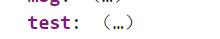
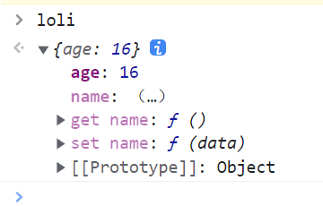

# 简介

一套用于构建用户界面的**渐进式**JavaScript框架，所谓的渐进式是指如果开发轻量级应用，可以引用简单的vue库，如果是复杂的项目，则可以引入更复杂的库。 

vue的特点：

1. **组件化**

2. **声明式**编码

   所谓的声明式编码，是和**命令式编码**对立的存在。命令式编码就是说如果想显示一个对象，就得先创建，然后初始化，最后放到舞台上面。一步一步按照命令完成的。

3. 虚拟DOM

# 引入

- 使用ui页面创建

  ```
  vue ui
  ```

- 使用url引入

  ```html
  <script src="https://cdn.jsdelivr.net/npm/vue@2/dist/vue.js"></script>
  ```

  

# Hello World

```html
<!DOCTYPE html>
<html lang="zh-Ch">

<head>
    <meta charset="UTF-8">
    <script src="./vue.js"></script>
    <title>Document</title>
</head>

<body>
    <div id="app">{{msg}}</div>
</body>

<script>
    const vue = new Vue({
        el:'#app',
        data :{
            msg:"hello world"
        }
    })
</script>
</html>
```

# 模板语法


## 插值语法

两个花括号，代表把hello world这个值插入到msg里面

```vue
<!DOCTYPE html>
<html lang="zh-Ch">

<head>
    <meta charset="UTF-8">
    <script src="./vue.js"></script>
    <title>Document</title>
</head>

<body>
    <div id="app">{{msg}}</div>
</body>

<script>
    const vue = new Vue({
        el:'#app',
        data :{
            msg:"hello world"
        }
    })
</script>
</html>
```


## 指令语法

### 文本填充 v-text

v-text会直接替换标签内的全部内容，类似于花括号语法，但是这个是全部替换，那个是指定替换。

```vue
<div id="app">
  <div v-text="msg">test</div>
</div>
<script>
  var app = new Vue({
    el: '#app',
    data: {
      msg:"hello world!!"
    }
  })
</script>
```


### 单向数据绑定 v-bind

v-bind可以动态绑定一个类或者动态绑定样式。简写时前面用冒号。


- 绑定class


```vue
<!-- head标签内 -->
<style type="text/css">
  .active{
    width: 100px;
    height: 100px;
    background-color: #42B983;
  }
</style>

<!-- /body标签内 -->
<div id="app">
  <div v-bind:class="{ active: isActive }"></div>
</div>
<script>
  var app = new Vue({
    el: '#app',
    data: {
      isActive: true
    }
  })
</script>
```

绑定多个动态class

```vue
<!-- head标签内 -->
<style type="text/css">
  .active{
    width: 100px;
    height: 100px;
    background-color: #42B983;
  }
  .big-font{
    font-size: larger;
  } 
</style>

<!-- /body标签内 -->
<div id="app">
  <div v-bind:class="[{ active: isActive },fontClass]">绑定class</div>
</div>
<script>
  var app = new Vue({
    el: '#app',
    data: {
      isActive: true,
      fontClass:"big-font"
    }
  })
</script>
```


绑定style

```vue
<div id="app">
  <div v-bind:style="{color:colorBind}">绑定style</div>
</div>
<script>
  var app = new Vue({
    el: '#app',
    data: {
      colorBind: "red",
    }
  })
</script>
```

注意!如果绑定的样式含有短线,那么就要替换成对应的驼峰法。

例如：background-color ->backgroundColor


- 绑定一般的属性

vue会直接把字符串里面的数据绑定。

也就是说value后面那个值是data里面的变量

实际上加上v-bind之后，里面的数据就会被当成js语句执行。

```vue
<input type="text" class="input" v-bind:value= "name"  v-bind:test= "Date.now()"/>
<script>
  var app = new Vue({
    el: '#app',
    data: {
      name:"岳盛秦"
    }
  })
</script>

```


### 双向数据绑定 v-model

- 双向绑定一般应用于表单元素
- 如果绑定的值是value，那么默认可以不用加value，`v-model:value= "msg"`可以简写为` v-model= "msg"`，因为绑定的值一般都是value，所以可以省略。

一般属性

```vue
<body>
    <div id="app">

        <input type="text" class="input" v-model:value= "msg"/>

        <!-- 简写属性-->
        <input type="text" class="input" v-model= "msg"/>
    </div>
    
</body>

<script> 
    const vue = new Vue({
        el:'#app',
        data :{
            msg:"hello world"
        }
    }) 
</script>
```


与checkbox结合

```vue
<p id="app">
	<!-- 单选框 -->
	<input type="checkbox" v-model="isAgree"> 同意协议
	<button v-bind:disabled="!isAgree">下一步</button>
	<br />
	<br />
	<br />
	<!-- 复选框 -->
	<input type="checkbox" v-model="hobby" value="傲娇"> 傲娇
	<input type="checkbox" v-model="hobby" value="天然呆"> 天然呆
	<input type="checkbox" v-model="hobby" value="病娇"> 病娇
	<input type="checkbox" v-model="hobby" value="三无"> 三无
	<br />
	<span>你喜欢的萝莉类型为:{{hobby}}</span>
</p>
<script>
	const vue = new Vue({
		el: "#app",
		data: {
			isAgree: false,
			hobby: [],
		},
	})
</script>
```


与radio结合

 v-model其实和value绑定, v-model="sex"就是value为sex属性.

什么意思呢,就是说点击这个input之后,浏览器就会去找v-model绑定的元素是谁,一看发现是sex,然后就会把value的值赋值给sex,最后根据此时sex的值去判断到底选中谁.所以说假如默认赋值为''男"的话,浏览器先开始就会选中value为男的选项.

如果默认sex写的在value里面没有,那么先开始谁都不会选中,点击一次之后,value的值传了进来,之后就一切正常了.

```vue
<p id="app">
	<input type="radio" value="男" v-model="sex">男
	<input type="radio" value="女" v-model="sex"> 女
	<br />
	<span>{{sex}}</span>
</p>
<script>
	const vue = new Vue({
		el: "#app",
		data: {
			sex: '男',
    //sex:'秀吉',
		},
	})
</script>
```

修饰符

```vue
  <p id="app">
    <span>lazy可以让数据在失去焦点或者回车才会更新</span>
    <br/>
    <input type="text" v-model.lazy="message" >
    <span>{{message}}</span>
    <br/>
    <span>number可以让数据变为number类型,如果你希望如此</span>
    <br/>
    <input type="text" v-model.number="message2" >
    <span>{{message2}}</span>
    <br/>
    <span>trim可以让数据头尾去除空格</span>
    <br/>
    <input type="text" v-model.trim="message3" >
    <span>{{message3}}</span>
    <br/>
  </p>

    <script>
        const vue=new Vue({
          el:"#app",
          data:{
            message:"123",
            message2:345,
            message3:"",
          },
        })
    </script>
```


### 条件渲染 v-if 和 v-show

### 列表循环 v-for

key是用来提高列表渲染效率的，必须要选择唯一的那个值。在数组中，index是唯一的，那么就把index设为key。在对象中，键是唯一的，就把key设为key。

数组循环

对于普通数组而言，v-for就类似于JavaScript中的foreach语法，直接遍历每一项。

```vue
<div id="app">
  <ul>
    <li v-for="item in Language" :key="item">
      {{item}}
    </li>
  </ul>
</div>
<script>
  var app = new Vue({
    el: '#app',
    data: {
      Language:["java","c++","python","c#"]
    }
  })
</script>
```

但是对于对象数组而言，直接输出并不是一个好主意。

```vue
<div id="app">
  <ul>
    <li v-for="item in Language" :key="item">
      {{item}}
    </li>
  </ul>
</div>
<script>
  var app = new Vue({
    el: '#app',
    data: {
      Language:[{name:"java"},{name:"c++"},{name:"python"},{name:"c#"}]
    }
  })
</script>

<!--结果会变成这样：-->
{ "name": "java" }
{ "name": "c++" }
{ "name": "python" }
{ "name": "c#" }
```

我们可以使用访问属性的方式来遍历

```vue
<li v-for="item in Language" :key="item">
	{{item.name}}
</li>
```

v-for还支持打印数组的下标

```vue
<div id="app">
  <ul>
    <li v-for="(item,index) in Language" :key="index">
      第{{index}}个元素：{{item}}
    </li>
  </ul>
</div>
<script>
  var app = new Vue({
    el: '#app',
    data: {
      Language:["java","c++","python","c#"]
    }
  })vue
</script>
```


对象循环

类似于数组循环，但是在for的时候，访问的就不是属性了。而是键值对。

```vue
<div id="app">
  <ul>
    <li v-for="(value,key) in loli" :key="key">
      {{key}}为：{{value}}
    </li>
  </ul>
</div>
<script>
  var app = new Vue({
    el: '#app',
    data: {
      loli:{
        name:"时雨",
        age:14,
        height:150
      }
    }
  })
</script>
```

### 事件处理 v-on

v-on用于绑定事件处理函数，在JavaScript里面就是onclick,onmousedown之类的，但是vue里面不加on。

```vue
<body>
  <div id="app">
    <p>{{ message }}</p>
    <button v-on:click="reverseMessage">反转消息</button>
  </div>
<script>
var app5 = new Vue({
  el: '#app',
  data: {
    message: 'Hello Vue.js!'
  },
  methods: {
    reverseMessage: function () {
      this.message = this.message.split('').reverse().join('')
    }
  }
})
</script>
```

v-on的简写属性为，简写时前面用@

```html
 <button @click="reverseMessage">反转消息</button>
```


v-on可以传参，这个需要注意，在默认情况下，vue会自动传递一个event参数，也就是鼠标事件。

```vue
<body>
    <div id="app">
        <input type="button" value="按钮" v-on:click="test">
    </div>
    
</body>

<script> 
    const vue = new Vue({
        el:"#app",
        methods:{
            test(event){
                console.log(event)
            }
        }
    }) 
</script>
```

如果手动写了参数，那么这个event对象就会被顶替掉了

```vue
<body>
    <div id="app">
        <input type="button" value="按钮" v-on:click="test(123)">
    </div>
    
</body>

<script> 
    const vue = new Vue({
        el:"#app",
        methods:{
            test(event){
                console.log(event)//打印的是123
            }
        }
    }) 
</script>
```

这就是问题所在，如果传入了参数就会丢失event对象，如果想要保留，需要用户在参数使用占位符`$event`来标记。

```vue
<body>
    <div id="app">
        <input type="button" value="按钮" v-on:click="test($event,123)">
    </div>
    
</body>

<script> 
    const vue = new Vue({
        el:"#app",
        methods:{
            test(event,num){
                console.log(event,num)//两个都能打印
            }
        }
    }) 
</script>
```

#### 事件修饰符

```js
<a href="" @click.prevent = "test">测试</a>
```

鼠标事件：指令修饰符

- .stop 阻止事件冒泡

- .self 当事件在该元素本身触发时才触发事件，也就是event.target是当前元素的操作对象时才会触发

- .capture 在事件的捕获阶段触发事件

- .prevent 阻止默认事件

- .once 事件只触发一次
- .passive 事件的默认行为立即执行，无需等待事件回调执行完毕;

键盘事件：键盘修饰符


如果即想要阻止默认行为，也想要阻止冒泡，可以把属性连续写。

.stop.prevent


#### 内联代码

如果代码比较短，可以不需要绑定函数，注意里面不需要写this!

```html
data: {
	a: 1,
},
<input type="button" value="按钮" v-on:click="a=3">
```


#### 键盘事件的修饰符

对于键盘事件，如果需要只能空格键触发的话可以使用语法糖：

```vue
<input type="button" value="按钮" @keyup.enter="test">
```

这个叫做按键别名

vue自己支持9种常用的。如果需要自定义的话，也可以自行用按键名绑定

例如` @keyup.enter`这个enter是小写的，是vue自己提供的。但是实际上回车键的键名叫做Enter。具体可以去查

对于一些两个单词组成的键名，例如CapsLock，就需要用分隔符来绑定`@keyup.caps-lock`


但是要注意，对于系统修饰键：`ctrl,alt,shift,meta`

如果绑定的是keyup，那么要先按下这个键+一个其他键，再抬起其他键才有反应。也就是说先按ctrl，然后按下w，再抬起w才行。

而绑定的是keydown，那么正常触发

如果需要组合按键的话，可以使用

```html
<input type="button" value="按钮" @keyup.ctrl.y="test">
```


#### 自定义键盘按键的别名


#### 事件也可以写在data?

下面是有关methods方法的数据代理问题。

写到methods中的方法，不需要进行数据代理。但是如果写到了data里面就会进行数据代理。

```html
<div id="app"> 
    <button v-on:click="test">
        测试
    </button>
</div>
<script>
    Vue.config.productionTip = false
    var vm = new Vue({
        el: '#app',
        data: {
            msg: 'hello world',
            test: function () {
                console.log("测试")
            }
        },
        methods: {}
    })
</script>

```

如果把test方法写到了data里面，同样可以正常运行，但是vm会把test进行数据代理



这会加大vue的负担，因为数据代理只需要数据进行代理。方法是不需要代理的，所以还是老老实实写在methods里面吧


### v-cloak

VUE渲染的时候，首先会把html页面全显示到网页上，之后再进行替换。这就会导致，如果用户的计算机比较慢，就会直接看到VUE渲染前的页面，体验很差。为了避免这种情况，可以使用v-cloak指令，这个指令首先会把页面隐藏，然后在内存中把页面替换好之后再显示。

使用v-cloak需要先在head里面设置样式才能使用。

```vue
<!--head标签里面-->
<style type="text/css">
  [v-cloak]{
    display: none;
  }
</style>
<!--body标签里面-->
<div id="app">
  <div v-cloak>{{msg}}</div>
</div>
<script>
  var app = new Vue({
    el: '#app',
    data: {
      msg:"hello world!"
    }
  })
</script>
```

### v-once

如果只想让某一个标签只被渲染第一次，也就是说绑定的值就算变化了，这个标签内容也不会改变

```vue
<div id="app">
  <div v-once>{{msg}}</div>
</div>
<script>
  var app = new Vue({
    el: '#app',
    data: {
      msg:"hello world!!!!"
    }
  })
  app.msg="fuck you world!";
</script>
```

可以看到，虽然修改了msg的值，但是v-once作用下，只保留了第一次渲染的值。


# 模板语法

## 引入

```html
<script src="https://cdn.jsdelivr.net/npm/vue/dist/vue.js"></script>
```


## 基本结构

```vue
<!DOCTYPE html>
<html lang="en">

<head>
    <meta charset="UTF-8">
    <meta name="viewport" content="width=device-width, initial-scale=1.0">
    <title>Document</title>
    <script src="https://cdn.jsdelivr.net/npm/vue/dist/vue.js"></script>
</head>
<body>
    <div id="app">
        {{ message }}
    </div>
    <script>
        var app = new Vue({
            el: '#app',
            data: {
                message: 'Hello World!'
            }
        })
    </script>
</body>
</html>
```

## moustache语法

将html中的变量用花括号圈起来，在vue里面进行赋值，这种动态数据绑定的方法，就算moustache语法。因为俩个大括号很像胡子？？？？？？我并不理解就是了。

## JavaScript语法支持

在花括号内部，vue支持使用JavaScript语法。

- 四则运算

```vue
<div id="app">
  <div>0{{num+1}}</div>
</div>
<script>
  var app = new Vue({
    el: '#app',
    data: {
      num:720
    }
  })
</script>
```

- 三元表达式

```vue
<div id="app">
  <div>我喜欢{{lolisuki?"萝莉":"幼女"}}</div>
</div>
<script>
  var app = new Vue({
    el: '#app',
    data: {
      lolisuki:true
    }
  })
</script>
```

- 调用方法（以字符串为例）

```vue
<div id="app">
  <!--把字符串变成大写-->
  <div>{{msg.toUpperCase()}}</div>
</div>
<script>
  var app = new Vue({
    el: '#app',
    data: {
      msg:"abcdefg"
    }
  })
</script>
```

# 计算属性（computed）

```html
<!DOCTYPE html>
<html lang="zh-Ch">

<head>
    <meta charset="UTF-8">
    <title>Document</title>
    <script src="./vue.js"></script>
</head>

<body>
    <div id="app"> 
    <input type="text" v-model="a">
    <input type="text" v-model="b">
    {{add}}

    </div>


</body>

<script>
    Vue.config.productionTip = false
    var vm = new Vue({
        el: '#app',
        data: {
            a:1,
            b:1
        },
        computed:{
            add:{
                get(){
                    return Number(this.a)+Number(this.b)
                }
            }
        }
    })

</script>

</html>
```


要注意，计算属性只会被调用一次

```js
add:{
    get(){
        console.log("调用！")
        return Number(this.a)+Number(this.b)
    }
}
```

最终这个结果只会调用一次

**计算属性会缓存！**

但是问题是以后数据改变了怎么办？所以计算属性，有两个调用时期，第一个是初始化，第二个是依赖的数据改变

set被调用时，只有数据修改才会被改变

```js
add:{
    get(){
        console.log("调用！")
        return Number(this.a)+Number(this.b)
    }
    
}
```


计算属性的简写

如果set不需要的话可以简写计算属性

```js
computed: {
    add() {
        return Number(this.a) + Number(this.b)
    }
}
```


# 监视属性（watch）

## 基本结构

```vue

<body>
    <div id="app">
        <input type="text" v-model="a">
        <input type="text" v-model="b">
        {{add}}
    </div>


</body>

<script>
    Vue.config.productionTip = false
    var vm = new Vue({
        el: '#app',
        data: {
            a: 1,
            b: 1
        },
        computed: {
            add() {
                return Number(this.a) + Number(this.b)
            }
        },
        watch:{
            a:{
                handler(newValue,oldValue){
                    console.log("a发生了变化，先前为"+newValue+"之后为"+oldValue)
                }
            }
        }
    })

</script>
```

## 监视时初始化

如果开启了immediate属性，那么在页面初始化的时候就会被检测到

```js
watch:{
    a:{
        immediate:true,//加了这个初始化时会直接调用一次
            handler(newValue,oldValue){
            console.log("a发生了变化，先前为"+newValue+"之后为"+oldValue)
        }
    }
}
```


## 深度监视

如果属性有多级，那么就需要开启深度监视

```js
'girl.nane':{
    handler(newValue,oldValue){
        console.log("妹子名称改变")
    }
},
```

如果开启的话

```js
girl:{
    deep:true,//是否深度监视
        handler(newValue,oldValue){
        console.log("妹子发生改变")
    }
}
```

### 监视的简写

如果监视不需要deep和immediate，那么可以开启简写

```vue
<!DOCTYPE html>
<html lang="zh-Ch">

<head>
    <meta charset="UTF-8">
    <title>Document</title>
    <script src="./vue.js"></script>
</head>
<body>
    <div id="app">
        <input type="text" v-model="a">
    </div>
</body>

<script>
    Vue.config.productionTip = false
    var vm = new Vue({
        el: '#app',
        data: {
            a:10
        },
        watch: {
            a(newValue, oldValue) {
                console.log("a发生了变化，先前为"+newValue+"之后为"+oldValue)
            }
        }
    })

</script>
</html>
```


# 生命周期


## 1.beforeCreate

## 2.created

当调用这个函数的对象创建完毕时，立刻回调这个函数。

## 


# 组件化

## 建立全局组件

1. Vue.component("name",{})方法来注册组件，第一个参数是组件名字，第二个是组件的定义，其中最重要的就是template，它规定了组件的结构内容。
2. 在需要使用的地方直接用组件名的标签就可以了。

```vue
<!DOCTYPE html>
<head>
  <meta charset="UTF-8">
  <script src="https://cdn.jsdelivr.net/npm/vue/dist/vue.js"></script>
  <title>Document</title>
</head>
<body>
  <div id="app">
    <span>Vue</span>
    <cpn></cpn>
  </div>
  <script>
    //注册全局组件
    //组件名字就是cpn，可以用<cpn></cpn>来使用
    Vue.component('cpn',{
      //模板的内容
      template:'<div><span>我是组件</span></div>',
    })

    const vue = new Vue({
      el:"#app",
    })
  </script>
</body>
</html>
```

## 组件的数据

vue中，除了vue这个大的父组件可以直接用`data:{}`的语法，剩下的组件都必须使用函数的语法。因为组件之间彼此是独立的，而不写函数的话，默认定义的都是全局变量。这就导致所有组件共享数据，不安全。

而写成函数的形式，数据就会被函数封装成局部变量，这样就可以各用各的数据了。

```javascript
data:function() {
	return {
		count: 0
	}
}
```


## 组件抽离

### 1.抽离template

因为template里面是一个字符串，使用可读性很差，还没有代码提示，所以可以把这部分抽离成html代码，提高可读性。html提供了template标签，来定义模板，**要注意，模板里面必须用一个div来包含所有代码**。

```vue
<body>
  <div id="app">
    <span>Vue</span>
    <cpn></cpn>
  </div>
  <template id="tep">
      <div>
        <span>我是组件</span>
      </div>
  </template>
  
  <script>
    Vue.component('cpn', {
      template: '#tep',
    })

    const vue = new Vue({
      el: "#app",
    })
  </script>
</body>
```

### 2.抽离component

现在虽然简单多了，但是还是比较麻烦。每次都要注册vue的**全局组件**，我们可以考虑注册局部组件减少代码量。

1. 首先建立一个对象cpn，把组件的内容写到对象里面
2. 在父组件vue里面声明组件
3. 在html中使用

```vue
<div id="app">
  <span>Vue</span>
  <cpn></cpn>
</div>
<template id="tep">
    <div>
      <span>我是组件</span>
    </div>
</template>

<script>
  const cpn={
    template: '#tep',
  }

  const vue = new Vue({
    el: "#app",
    components:{
      cpn
    }
  })
</script>
```


## 子组件通信父组件

子组件给父组件传递数据，使用的是`this.$emit("对外展示的方法名",数据);`，这样就把子组件的数据对外传递了。那该如何接收呢？在父组件内，用`v-on`来绑定刚才的方法名，然后调用父组件的方法。此时父组件的参数就是子组件的数据了。

```vue
<!DOCTYPE html>
<html lang="en">

<head>
  <meta charset="UTF-8">
  <script src="https://cdn.jsdelivr.net/npm/vue/dist/vue.js"></script>
  <title>Document</title>
</head>

<body>
  <div id="app">
    <span>我是父组件Vue</span>
    <cvue v-on:vue-click="showChildMessage"></cvue>
  </div>

  <template id="cvue">
    <div>
      <button v-on:click="vueClick">我是子组件</button>
    </div>
  </template>


  <script>
    //子组件
    const cvue = {
      template: '#cvue',
      data() {
        return {
          lolis:["傲娇","病娇","天然呆"]
        }
      },
      methods: {
        vueClick(){
          //用$emit来暴露数据和接收数据的方法
          this.$emit("vue-click",this.lolis);
        }
      },
    }


    const vue = new Vue({
      el: "#app",
      components: {
        cvue,
      },
      methods: {
        //父组件的参数就算子组件暴露的数据
        showChildMessage(lolis){
          alert(lolis);
        }
      },
    })
  </script>
</body>

</html>
```

## 父组件通信子组件

父组件不能直接把数据给子组件，而是通过父组件给子组件的prop属性传递数据来间接实现。那首先就算给子组件建立prop属性，之后用`v-bind`把子组件的prop数据和父组件绑定。

```vue
<!DOCTYPE html>

<head>
  <meta charset="UTF-8">
  <script src="https://cdn.jsdelivr.net/npm/vue/dist/vue.js"></script>
  <title>Document</title>
</head>

<body>
  <div id="app">
    <span>我是父组件Vue</span>
    <cvue v-bind:cmessage="message"></cvue>
  </div>

  <template id="cvue">
    <div>
      <span>我是子组件{{cmessage}}</span>
    </div>
  </template>


  <script>
    const cvue = {
      template: '#cvue',
      props: {
        cmessage:{
          type:String,
          default:"默认值",
        }
      },
    }


    const vue = new Vue({
      el: "#app",
      data: {
        message: "hello world",
      },
      components: {
        cvue,
      }
    })
  </script>
</body>

</html>
```

## 插槽

### 普通插槽

对于template的模板来说，如果一次性写死，有可能造成代码难以复用，所以把这些模板写的越抽象，日后功能就会越强大。template就提供了这样的功能，也就是插槽。

使用方法其实非常简单，就是在template里面加一个slot标签，表示这个可以被替换。

我这个例子里面写了一个span标签，就表示默认情况下插入这个萝莉span，如果在html中你插入了其他的数据，那么就会替换我原来的值。这个`<span>萝莉</span>`，就是默认值。

```vue
<body>
  <div id="app">
    <cvue></cvue>
    <cvue><span>幼女</span></cvue>
  </div>

  <template id="cvue">
    <div>
      <span>
        我喜欢：
        <slot><span>萝莉</span></slot>
      </span>
    </div>
  </template>


  <script>
    const cvue = {
      template: '#cvue',
    }


    const vue = new Vue({
      el: "#app",
      components: {
        cvue,
      }
    })
  </script>
</body>
```

### 具名插槽

在开发中，一个模板里面其实可能出现多个插槽，如果还是像刚才一样直接插入，可能会导致二义性，也就是分不清到底是给谁插的。为了避免这种情况，vue提供了具名插槽。

具名插槽使用起来也很简单，首先给slot起名字，使用的时候用slot属性去找对应的name就可以了。 

```vue
<body>
  <div id="app">
    <cvue>
      <span slot="first">身娇</span>
      <span slot="second">体柔</span>
      <span slot="third">易推倒</span>
    </cvue>
  </div>

  <template id="cvue">
    <div>
        <div>萝莉有三好</div>
        1.<slot name="first"></slot>
        2.<slot name="second"></slot>
        3.<slot name="third"></slot>
    </div>
  </template>


  <script>
    const cvue = {
      template: '#cvue',
    }
    const vue = new Vue({
      el: "#app",
      components: {
        cvue,
      }
    })
  </script>
</body>
```


# 自动调用函数

```js
  methods: {
    onClickInit() {
      var settingTitles = document.getElementsByClassName("setting-title");
      var settingContents = document.getElementsByClassName("setting-contents");

      for (let i = 0; i < settingTitles.length; i++) {
        settingTitles[i].onclick = function () {
          for (let i = 0; i < settingContents.length; i++) {
            settingContents[i].style.display = "none";
          }
          settingContents[i].style.display = "block";
        };
      }
    },
  },
  mounted(){
      this.onClickInit()//自动调用函数
  }
```


# VUE开发模式和生产模式

在vue官网可以引入两种模式的vue代码


在生产模式同样可以关闭提示

```js
Vue.config.productionTip = false
```


# VUE挂载点的理解

我们都知道如果想要挂载Vue实例，一般都需要写

```js
el:'#app'
```

实际上这个是一个语法糖，我们那个#app其实是缩写，完整版应该往下

```js
el:document.querySelector("#app"),
```

也就是说只要获取到DOM节点就可以进行挂载


其次还有一个地方，那就是**$mount**，我们都知道el可以挂载元素，实际上$mount也可以

```js
const vue = new Vue({
    data :{
        msg:"hello world"
    }
}) 
vue.$mount('#app')
```

于是结合最开始的例子，我们也可以发现，这个里面也是语法糖。里面应该传入DOM节点

```js
const vue = new Vue({

    data :{
        msg:"hello world"
    }
}) 
vue.$mount(document.querySelector("#app"))
```


# data的理解

data如果想要获取到数据，有两种写法

```js
data :{
    msg:"hello world"
}

data :function(){
    return{
        msg:"hello world"
    }

}
```


**另外要注意data里面的函数不能写成箭头函数！**

因为之所以能用函数，是因为function的this指向了vue自己，一旦写箭头函数，指针就指向了window，所以data中不能写箭头函数。

另外，这个函数写法过于复杂，所以为了简化，可以缩写为：

```js
data(){
    return{
        msg:"hello world"
    }

}
```

# MVVM理解

MVVM是**Model-View-ViewModel**的简写。也就是**模型、视图、视图模型**。

- 模型（**M**odel）：对应着data里面的数据
- 视图（**V**iew）:对应着vue中的模板，我们实际上看到的页面，也是就DOM就是View
- 视图模型（**V**iew**M**odel）:Vue实例对象，负责联通Model和View。其中主要有两个作用，一个是数据绑定，就是把Model的数据绑定到View中，另一个的监听DOM，把数据传给Model


比如说双向绑定，我们修改了data中的值，那么vue就会控制view的变化。同样的，如果view的数据变化，同样也能通过vue传回来。

我们在data中写的数据，最后都会被挂载到ViewModel里面去。比如说

```js
const vue = new Vue({

    data(){
        return{
            msg:"hello world"
        }

    }
}) 
vue.$mount(document.querySelector("#app"))

console.log(vue)
```

实际上在网页中，我们可以看到数据最后被挂载到了vue实例对象上面去了。也就是VM。换句话说，我们之所以能够在{{}}中访问数据，实际上只是在访问VM的数据，而不是直接访问model的数据。

也就是说，其实{{}}里面可以访问任意VM里面的数据，比如`$attrs`、`$el`什么的。但是没有必要。


# VUE的数据代理

数据代理的基本原理就是依靠getter和setter实现的。

```js
let _name = '丛雨'

var loli = {
    age : 16
}

Object.defineProperty(loli,'name',{
    get:function(){
        return _name;
    },
    set:function(data){
        _name = data;
    }
})

```




vue的数据代理原理如下

1. 用户在new Vue的时候，需要传入一个配置对象，里面就有一个data

2. 这个data会被处理为`_data`

3. 然后vue给这些属性绑定getter和setter

4. 用户修改View之后，就会调用setter

   


也就是说通过vm对象来代理_data对象里面的数据。


# webpack

webpack是一个JavaScript的静态打包工具，webpack会把你写的代码进行打包，把ES6，commonJS等浏览器可能不支持的语法转化为ES5，确保所有浏览器都支持。非常非常方便，再也不用考虑兼容。

webpack是我们面向正式项目开发的第一步。

如果下面的看不懂，建议先去看看node的模块化。

## 安装

首先得要有node的环境，没有的去看我node的教程。然后安装 webpack和webpack-cli

先介绍一下安装类型

```shell
npm install webpack -g  //全局安装
npm install webpack --save-dev // 项目内局部安装
//还可以指定版本号
npm install webpack@3.6.0 --save-dev
```

挑一个进行安装，我的如下

```shell
npm install webpack webpack-cli --save-dev
```


## 打包与运行

首先初始化环境，在项目根目录运行

```shell
npm init -y
```

之后打包，默认采用最新的版本命令，如果是4.0之前的webpack版本，请去掉-o

```powershell
webpack 要打包文件的路径 -o 目标路径\文件名字
//我的代码如下
webpack  .\src\main.js -o .\dist\bundle.js
```

这时候可能会出现错误：

```shell
webpack : File C:\Users\17966\AppData\Roaming\npm\webpack.ps1 cannot be loaded because running scripts is disabled on 
this system. For more information, see about_Execution_Policies at https:/go.microsoft.com/fwlink/?LinkID=135170.
```

这是因为没有开启权限，用powershell开启一下权限就可以了。

在powershell里面输入：之后A就可以了。

```powershell
set-ExecutionPolicy RemoteSigned
```

还可以再输入下面的指令确认

```powershell
get-ExecutionPolicy
```

运行就很简单了，建一个index.html，引入打包后的js文件

```html
<!DOCTYPE html>
<head>
  <meta charset="UTF-8">
  <title>Document</title>
  <script src="./dist/bundle.js"></script>
</head>
<body>
</body>
</html>
```


## 配置

### webpack.config.js

这个是需要我们自己创建的一个配置文件。如果每次都要用刚才那一大串命令来打包，未免太麻烦了，也没有一个更加简单的方法呢？仅仅输入webpack就可以执行上述的命令。当然可以了，这时候我们只需要把命令都配置进webpack.config.js里面，就可以用webpack来简化命令了。

首先需要指定一个入口的main.js文件，这个是用的相对路径，比较好处理。之后还有一个输出打包文件的路径，这个需要绝对路径，我们可以用node里面的path模块来进行绝对路径的拼接。

```javascript
var path = require("path");
// npm init
//配置之后自动打包
module.exports = {
  entry: "./src/main.js",
  output: {
    //打包路径
    path: path.resolve(__dirname, "dist"),
    //文件名
    filename: "bundle.js",
  }
}
```

### package.json

其实在实际开发中，我们都是用`npm run build`来打包。那如何把这个npm的命令和webpack的命令结合起来呢？

首先我们要知道`npm run xxx`是什么意思，其实很简单，如果在命令行输入这个命令，那么编译器就会去寻找package.json文件中的`  "scripts"`键，也就是属性名，然后去寻找里面的xxx命令并运行。也就是说，如果想要执行`npm run build`，其实就是在package.json中的script里面配置一个build属性就行了。

```json
  "scripts": {
    "test": "echo \"Error: no test specified\" && exit 1",
    "build": "webpack"
  },
```

之后就可以用`npm run build `命令执行打包了。

```shell
npm run build
```

配置这个好处在于，这个命令会调用局部的webpack指令，也就是位于，而不是全局的，可以防止全局版本和局部版本不兼容的bug。

## 文件结构

我们既然开始模块化开发了，那么就要有一套严格的代码标准。以确保可读性和重用。

- 根目录
  - dist：打包好的文件，这个是放到服务器上的最终代码
  
  - src：源代码，你写的都在这里
    
    - CSS文件夹：存的样式文件
    
    - JS文件夹：存的各种js代码
    - VUE文件夹：存放各种vue文件
    
    - main.js：入口js文件，链接了各种js文件，这种入口文件就单独拿出来，不要放到文件夹里面。
    
  - index.html：主html文件，核心文件。


## loader

刚才webpack的命令只能打包js和json，如果只是这样就太鸡肋了。所以肯定还有别的技术来打包其他的文件。这种技术就是loader。

### css loader

css可以来打包css文件，需要安装css-loader和style-loader，css-loader负责加载样式，style-loader负责将样式加入DOM中，缺一不可。

```shell
npm install  css-loader style-loader --save-dev
```

之后需要配置webpack.config.js

```javascript
module.exports = {
  entry: "./src/main.js",
  output: {
    path: path.resolve(__dirname, "dist"),
    filename: "bundle.js"
  },
  module: {
    rules: [
      {
        test: /\.css$/,
        use: ["style-loader","css-loader"]
      }
    ]
  }
}
```

注意use里面的顺序不能更改！！因为loader是从右往左加载的，所以要把css-loader写在右边。

使用时直接在main.js里面require就行了。

### vue loader

这个在后面会说到，看到后面的时候可以回到前面来看，或者复习用。

首先是安装：

vue-loader用于加载vue文件，vue-template-compiler用于编译vue文件。

```shell
npm install vue-loader vue-template-compiler --save-dev
```

然后是配置：

```javascript
{
  test: /\.vue$/,
  loader:"vue-loader",
}
```

然后你会发现还是报错，这是因为Vue Loader v15 现在需要配合一个 webpack 插件才能正确使用，所以还要配置下面的部分：

```javascript
// webpack.config.js
const VueLoaderPlugin = require('vue-loader/lib/plugin')

module.exports = {
  // ...
  plugins: [
    new VueLoaderPlugin()
  ]
}
```


## vue与webpack

### 安装与配置

这个是运行依赖的，因为项目写好后运行也是需要用vue支持的。而webpack仅仅是打包时要用到。

```shell
npm install vue --save
```

之后在webpack.config.js中添加，因为vue版本很多，默认的版本是仅仅运行时依赖，这就会导致无法使用template，所以要修改默认版本。

```javascript
  resolve:{
    alias:{
      "vue$":"vue/dist/vue.esm.js",
    }
  },
```

之后切记，script要放在vue挂载标签的下面！！！！，因为页面加载的时候是安装顺序执行的，如果像以前一样放在head里面，就导致渲染msg的时候，msg还没有加载出来。跟之前学DOM一样的原理。

```html
<!--index.html-->
<body>
  <div id="app">
    {{msg}}
  </div>
  <script src="./dist//bundle.js"></script>
</body>
```

```javascript
//main.js
import Vue from 'vue'

var app = new Vue({
  el: '#app',
  data: {
    msg: 'Hello Vue!'
  }
})

```

### 组件抽离

之前我们已经学过一次组建抽离了，但是这次我们是基于webpack进行的更加抽象的抽离。

#### 抽离index.html

目前我们的index.html里面还是有实际的结构和数据，`<div id="app">{{msg}}</div>`，这个对于模板化开发来说实在是太不像样子，所以我们首先要把主html的内容抽出来。

vue提供了这样的方法，vue也是一个组件，是所有组件的父组件。所以vue也会有template属性，**这个template会在编译时直接替换el挂载点所在标签的全部内容**。也就是说，vue内定义的template会直接替换`<div id="app">{{msg}}</div>`。

这样一来，我们就可以直接把index.html中大大简化，也就是说只保留`<div id="app"></div>`，剩下的全部在main.js实现

```html
<!--index.html-->
<body>
  <div id="app"></div>
  <script src="./dist//bundle.js"></script>
</body>
```

```javascript
//main.js
import Vue from 'vue'

var app = new Vue({
  el: '#app',
  template: ` 
<div id="app">
  {{msg}}
</div>`,
  data: {
    msg: 'Hello Vue!'
  }
})
```

#### 抽离main.js

现在index.html简单了，但是main.js却复杂了，但是我们之前已经学过了如何抽离template，所以其实main.js非常好模板化。

1. 把vue中的template抽成组件
2. 在vue的components中注册
3. 在template中直接把注册好的组件写上，替换挂载点的内容。

```javascript
import Vue from 'vue'
const App ={
  template: ` 
  <div id="app">
    {{msg}}
  </div>`,
  data() {
    return {
      msg: 'Hello Vue!'
    }
  },
}
var app = new Vue({
  el: '#app',
  template: `<App/>`,
  components:{
    App
  }
})

```

#### 抽离到.vue文件

这时候就到了另一个重点了，我们之前抽离template是直接放到html里面的，现在我这个main.js是一个完完全全的js文件，抽不出来，该怎么办呢？？？其实很容易想到，抽到另一个html文件不就可以了？虽然可以，但是这样就让文件彼此逻辑太混乱了，我这个template,data,style等文件明显就是一体的，强行抽开不太合适，怎么办呢？vue的设计大佬们引出了一个vue文件，用于集合上述的格式。

在VUE文件夹里面建立一个App.vue文件，然后把刚才那个App移植到APP.vue文件里面

```vue
<!-- App.vue -->
<template>
	<div>
		{{msg}}
	</div>
</template>

<script>
	export default {
		name: "App",
		data() {
			return {
				msg: "hello VUE！",
			}
		},
	};
</script>

<style>
</style>

```

然后main.js里面就只用引入App就可以了

```javascript
//main.js
import Vue from 'vue'
import App from "./VUE/App.vue"
var app = new Vue({
  el: '#app',
  template: `<App/>`,
  components:{
    App
  }
})
```

## 插件

插件是用于拓展webpack功能的，在webpack.config.js中的plugin中使用，一般来说按需添加。

这里以一个版权插件为例：

```javascript
// webpack.config.js
const webpack = require("webpack")

module.exports = {
  // ...
   plugins: [
    new webpack.BannerPlugin("版权归本人所有")
  ]
}
```

之后可以发现在bundle.js里面多了一个注释，里面写着你的版权信息。


# VUE结构

```js
var app = new Vue({
  el: '#app',
  template: `<App/>`,
  components:{
    App
  }
})
```


# 知识点

vue容器和标签的一一对应的，不可以多对应


16

