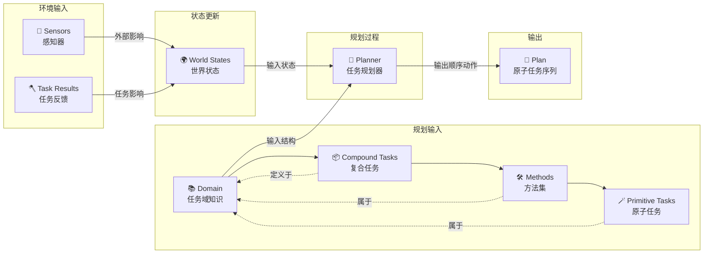
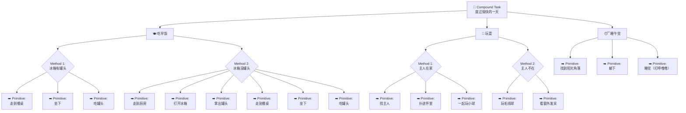

当前游戏中的常用的AI方法，大致有三种：
- 状态机（FSM-Finite State Machine)
- 行为树（BT-Behavior Tree）
- 层次任务网络（HTN-Hiearchical Task Network）
- GOAP（Goal-Oriented Action Planning）

# 状态机（FSM-Finite State Machine)

- 主要由程序使用代码构建状态机进行开发和维护，策划负责发起需求，但不参与逻辑的具体构建和维护，开发速度快，适合AI需求量小或则需求稳定的项目。  
- 状态机最大的问题就是状态间极为复杂的关联关系，给策划后续的拓展和调整是一个极为困难的工作。
- 为了解决这种情况，有些游戏会把相关的状态机归为到一个子集中，例如DOOM2016版：在状态机的基础上将状态进行分类，产生状态集的概念，从而减少集与集之间的关联数量。搞分层状态机。

# 行为树（BT-Behavior Tree）

- 让状态可以复用
- 可以维护更复杂的逻辑

# 层次任务网络（HTN-Hiearchical Task Network）

- 把**复合任务**变为若干的**方法**
- 把**方法**变为若干**原子任务**
- planner输出的都是原子任务
- 每次环境变化都可以会改变当前的任务。如果环境变化影响了当前任务的前提条件（比如原子任务的执行条件不再满足），那么planner通常会**中断当前计划，重新规划**，这意味着之前的任务序列会被清空或废弃。

# GOAP（Goal-Oriented Action Planning）