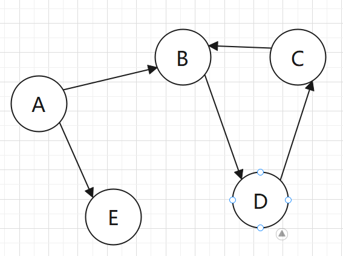
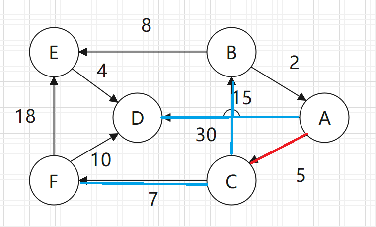
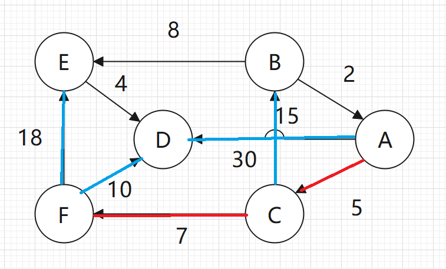
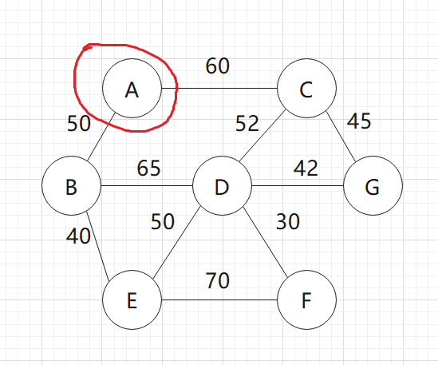
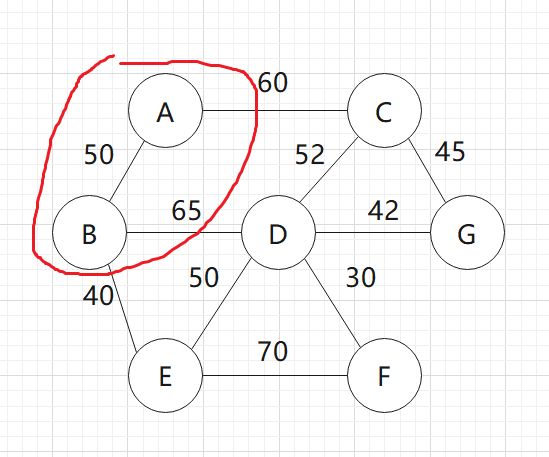

# 一、填空题（20分）

1. 顺序表中，插入、删除一个数据元素时，所需要移动的元素个数。

   - 插入：$\frac{n}{2}$

   - 删除：$\frac{n-1}{2}$

2. 顺序循环队列中，已知存储空间大小capacity和front、rear的当前位置，计算队列中元素的个数。

   (rear-front+capacity)%capacity

3. 给定单链表中某节点的指针p，写出在其之后插入或删除一个结点的语句。

   ```c
   //插入
   Node tempNode = (Node*)malloc(sizeof(Node));
   tempNode->next = p->next;
   p->next = tempNode;
   
   //删除
   p->next = p->next->next;
   ```

4. 理解完全二叉树的概念及二叉树的性质，给定树的深度求节点数。

   - 完全二叉树：把一棵满二叉树最右边的几个叶子结点删去就变成了完全二叉树。

   - 已知深度求节点数：若深度为k（k从0开始）,那么节点数为$2^{k+1}-1$。

5. 掌握基数排序方法，能够分析决定“桶个数”、“排序总趟数”的因素，并写出每趟排序的结果。

   - 桶个数：进制数决定了“桶个数”，几进制就需要几个桶。
   - 排序总趟数：排序元素的位数决定了排序的趟数，有几位就需要排序几趟。

   设序列为{710,342,045,686,006,841,429,134,068,264}，

   第一趟：{71**0**,84**1**,34**2**,13**4**,26**4**,04**5**,68**6**,00**6**,06**8**,42**9**}，把原先的数据按照最后一位排序。

   第二趟：{0**0**6,7**1**0,4**2**9,1**3**4,8**4**1,3**4**2,0**4**5,2**6**4,0**6**8,6**8**6}，把原来的数据按照第二位来排序，从左至右依次排序，中间顺序不要乱。

   第三趟：{**0**06,**0**45,**0**68,**1**34,**2**64,**3**42,**4**29,**6**86,**7**10,**8**41}，最后排序第一位。

6. 掌握有向图和无向图的邻接表存储结构，计算边界点与边条数。

   所谓的邻接表就是把某个顶点所指向的顶点都用链表链接起来，有向图就是指谁就链接谁，无向图则是全部链接。

7. 将给定关键字序列调整为最大堆（或最小堆），然后用序列表示。

   例如初始序列为：[10,50,32,5,76,9,40,88]，构造一个大顶堆。

   然后按照这个序列构造一棵二叉树

   

   之后调整**最后一个非叶子节点**。所谓的这个东西，就是先找到最后一个结点，也就是88，然后找到其父节点，这个5就是最后一个非叶子节点了。

   然后用这个5和其子节点对比，如果子节点大于父节点，那么就交换两者。（小顶堆的话则是在根节点小于叶节点时交换）

   

   如果发生了交换，那么还要再调整发生交换的子节点，因为5结点已经是叶节点了，没有子节点了，所以这步跳过。

   我们刚才调整了88，现在就要调整其前一个结点32，就这样不断调整前一个结点，如果发生了交换，就要再去调整子节点。

   

8. 哈夫曼树的特点，包括节点数。

   所有的编码结点都是叶子节点。

9. 掌握希尔排序算法，能够写出每趟排序的结果。

10. 顺序查找的平均查找长度分析。P250

    $ASL=\sum\limits_{n=1}^nP_iC_i=\sum\limits_{n=1}^n\frac{1}{n}i=\frac{n+1}{2}$

    $P_i$就是第i个数据出现的概率，在顺序查找中概率都是一样的，也就是$\frac{1}{n}$，$C_i$则是第i个数据的比较次数，第几个数据就需要几次。

# 二、简答题（20分）

1. 无向图、有向图采用邻接矩阵结构存储时，如何判别图中有多少条边，两个顶点之间是否有边、一个顶点的度。

   - 无向图：

     $V=\left[\begin{array}{c}0 \\ 1 \\ 2 \\ 3 \\ 4\end{array}\right]  \qquad \qquad	A=\left[\begin{array}{lllll}0 & 1 & 1 & 1 & 1 \\ 1 & 0 & 0 & 1 & 0 \\ 1 & 0 & 0 & 0 & 1 \\ 1 & 1 & 0 & 0 & 0 \\ 1 & 0 & 1 & 0 & 0\end{array}\right]$

     无向图的边都是对称的，所以只需要看右上角或者左下角有几个1就行了。

     查看顶点之间边时，如2，3两个顶点，那么就去矩阵中找2，3顶点所在的边，在图中对应的是三行四列，值为0，所以没有边。

2. 顺序循环队列如何判断队列满和队列空？三种方法P60

   - 少用一个存储单元

     ```pseudocode
     /*判满*/
     (rear+1) % maxsize == front
     /*判空*/
     rear == front
     ```

   - 设置标志位

     ```pseudocode
     /*判满*/
     rear==front && flag == 1
     /*判空*/
     rear==front && flag == 0
     ```

   - 设置计数器

     ```pseudocode
     /*判满*/
     count>0 && rear == front
     /*判空*/
     count == 0
     ```

     

3. 顺序表中插入或删除一个元素，分析其时间复杂度。

   要求：移动元素的次数

4. 利用堆栈实现输入序列到输出序列的转换。

   习题3-8

   这个东西就是所谓的栈序列，假设序列为{a,b,c,d,e,f,g}，问下面哪些元素可以用出栈序列得到。

   (1) {d,e,c,f,b,g,a}	(2) {f,e,g,d,a,c,b}	(3) {e,f,d,g,b,c,a}	(4) {c,d,b,e,f,a,g}

   

   

   

   

   

   

   

   

   

   

   

   

   

   

   

   这个东西核心就是要知道栈是先入后出的，假如b元素出栈，那么之后a元素一定不能出栈了，因为a在b前面。做这种题核心就是查看出栈序列，看看某元素的后面有没有其之前的**序列**，有的话这个序列就是错的。

   (1) ok	(2) f后面有ac这个序列，错误	(3) g后面有序列bc，错误  (4) ok

5. 写出某种排序算法的基本思想，并举例说明算法的稳定性。

   - 希尔排序：把数据每次分成若干个组，每次在组内进行简单插入排序，然后每一轮把组内的数据扩大，直到把所有的数据都放到组内。算法不稳定。

     [5,4,$4^*$,3]      

     [$4^*$,3,5,4]   //组内有两个数据，每次隔一个比较

     [3,$4^*$,4,5]   //发现相同数据的顺序乱了，所以不稳定

   - 快速排序：这个算法是对冒泡排序的改进。冒泡是每次选取一个最大值归位，快排是每次选取一个随机元素归位，灵活度大，所以速度很快。

     [5,3,3*,9]

     [3*,3,5,9] //顺序改变了，不稳定

   - 堆排序：首先建立一个大顶堆（或者小顶堆），每次把堆顶元素拿出来，然后调整堆。因为堆只有lgn这么高，所以速度超级快。但是不稳定。

     [11,5,10,5*]

     [10,5,5*] //11出堆

     [5*,5]  //10出堆，可以看到顺序已经变了

     

     

6. 掌握图的深度优先搜索和广度优先搜索，会写出遍历结果的序列。

   一般都是有向图的。

   

   深搜就是沿着一条边走到底：ABDC，然后换另一个E，答案就是ABDCE

   广搜就是每次把这个顶点的所有邻接点都找到，ABE，然后找B的DC，答案就是ABEDC

   

# 三、算法构造题（8分）

1. 已知一颗二叉树的中序遍历结果和后序/先序遍历结果，构造这颗二叉树，并写出先序/后序遍历序列。

   已知中序遍历序列①DCBGEAHFIJK，后序遍历序列②DCEG B FH KJ I A

   第一步：首先先分析中序遍历序列，每次把这个序列中间的元素找出来

   DCBGE ==A== HFIJK
   
   然后找到左右两边的中间元素
   
   DC ==B== GE    ==A==    HF ==I== JK
   
   遇到这种偶数的情况就不用再分了，因为中序遍历是最中间遍历根节点，所以在文中高亮的结点一定是父节点。然后就可以先画一个草图了。
   
   
   
   大概就是这样子，在父节点左边的就是左子树，右边的就是右子树。
   
   然后开始分析后序遍历序列，根据中序遍历的结论先把父节点找到，
   
   DCEG==B==  FHKJ==I==  ==A==
   
   因为后序遍历是最后访问根节点的，所以可以看到高亮结点左边的都是其子树。第一个结点D就是树的最左的子树，在右边的就是其父节点，以此类推。
   
   
   
2. 根据给定的关键字序列，画出每次插入后的二叉排序树，并计算查找成功的平均查找长度ASL。

    所谓的二叉排序树满足以下的性质：左边结点的值小于根节点的值，右边结点的值大于根节点的值。

   课本P257.

   ASL=lb(n+1)

   

# 四、算法理解题（32分）

1. 给定某通信电文的组成字符及其出现的频率，要求构造相应的哈夫曼树，并设计哈夫曼树。

   假设字符和频率如下表所示：

   | 字符 | 频率 |
   | ---- | ---- |
   | A    | 17   |
   | B    | 12   |
   | C    | 5    |
   | D    | 28   |
   | E    | 55   |
   | F    | 3    |

   设计哈夫曼树的原理非常简单，只需记住以下几步：

   1. 把字符以频率为基准，按照从小到大的顺序排列。

      {3,5,12,17,28,55}

   2. 选取两个最小的值构造二叉树，并规定权值小的为左子树，权值大的为右子树。其父节点的权值为两结点之和。

      然后删掉已经加入树中的结点，加入新的结点。

      

      

2. 利用Dijkastra算法求图中某顶点到其余各顶点的最短路径，画出求解过程。

   习题9-5，例题p209

   Dijikastra算法核心就是每次找一个最短路径。

   

   从A点出发，首先就是C和D，路径分别为5和30，所以到达C。

   

   此时蓝色的线表示还未确定的顶点，然后再次运算，到达B需要25，到达D需要30，到达F需要12，所以这次到达了F。

   

   然后再次在所有的蓝色顶点进行计算，到达B。最后到达E。这样就完成了所有顶点的最短路径。

3. 给定关键字序列，写出某排序算法的第一趟过程和结果。

   习题10-4，例题p238，p229

4. 给定关键字序列和哈希函数，进行哈希查找，要求画出用线性探查法解决冲突时所构成的哈希表，计算查找成功时的平均查找长度。

5. 掌握Prim算法，会利用Prim算法求解最小生成树，并能画出过程。

   习题11-18
   
   这个算法本质就是”画圈圈“。
   
   
   
   算法步骤如下：
   
   1. 找到当前节点相邻边中权值最小的结点
   2. 把该结点和之前的结点看作一个大结点。
   3. 重复1到2，直到所有的顶点都被访问了
   
   
   
   假如从顶点A开始，我们会发现周围权值最小的结点是B；
   
   
   
   
   
   然后把A和B当作一个结点，发现周围的权值{40,65,60}，所以选择E结点；
   
   
   
   然后把ABE当作一个大结点，选择D。以此类推。
   
   最后答案是	ABEDFGC
   
   

# 五、算法设计与实现题（15分）

不带头节点的单链表操作：包括插入、遍历、统计结点数等，要求写出数据结构、算法思想及C语言实现函数。

- 数据结构

  ```c
  struct ListNode{
  	int data;
  	ListNode* next;
  };
  int length = 0;
  ```

- 建立

  ```c
  ListNode* createLinkedList() { //不带头节点的单链表
  	ListNode* fakeHadeNode = (ListNode*)malloc(sizeof(ListNode));
  	fakeHadeNode = NULL;
  	return fakeHadeNode;
  }
  ```

- 插入

  ```c
  void push(ListNode** headNode, int position, int data) {
  	if (position <= 0 || position > length + 1) {
  		printf("插入位置不正确！！！");
  		return;
  	}
  
  	//创造一个新的结点
  	ListNode* tempNode = (ListNode*)malloc(sizeof(ListNode));
  	tempNode->data = data;
  	tempNode->next = NULL;
  
  	if (*headNode == NULL)
  	{
  		*headNode = tempNode;
  		length++;
  		return;
  	}
  
  	ListNode* searchNode = *headNode;
  	//找到所插入的位置的上一个
  	for (int i = 1; i < position-1 ; i++)
  		searchNode = searchNode->next;
  	tempNode->next = searchNode->next;
  	searchNode->next = tempNode;
  
  	length++;
  }
  ```

- 删除

  ```c
  void remove(ListNode** headNode, int position) {
  
  	if (position<=0 || position>length)
  	{
  		printf("删除有误！");
  		return;
  	}
  
  
  	ListNode* searchNode = *headNode;
  	//找到所插入的位置
  	for (int i = 1; i < position; i++)
  		searchNode = searchNode->next;
  	searchNode->next = searchNode->next->next;
  	length--;
  }
  ```

- 打印

  ```c
  void show(ListNode* headNode) {
  	ListNode* searchNode = headNode;
  	while (searchNode != NULL)
  	{
  		printf("%d ", searchNode->data);
  		searchNode = searchNode->next;
  	}
  }
  ```

  

# 六、算法应用题（5分）

图书管理：现有若干种图书（假定种类数为n），每种书的登记信息包括书号、书名、著作者、库存量等，回答以下问题：

（1）需对这些书按照每种书的库存量进行排序，在满足给定的算法空间复杂度情况下，选择什么排序算法使得算法的时间复杂度最优？采用那种存储方式最方便。

若空间复杂度为n：归并排序

若空间复杂度为1：堆排序

若空间复杂度为mn：基数排序

（2）若采用折半查找算法进行查找，计算查找成功时的平均查找长度。

折半查找每次查找的规模都会缩减一半，可以用一棵完全二叉树来模拟，

还是老样子，先列公式：

$ASL=\sum\limits_{n=1}^kP_iC_i=\sum\limits_{n=1}^k\frac{1}{n}2^{i-1}i=\frac{n+1}{n}lb(n+1)-1$

$k=log_2(n+1)$

在折半查找中，还是假设数据都是平均分配的，所以查找第i个数据的概率也是$\frac{1}{n}$，接下来是该数据查找的次数，我们知道二叉树每一层的结点有$2^{i-1}$个，在该层里面查找的次数就是i次。比如第2层的情况，$2^{2-1}*2$，就代表第二层有$2^{2-1}$个元素，每个元素需要比较$2$次。

一共需要比较多少次呢？有几层就需要几次。我们知道二叉树的层数为$log_2(n+1)$，所以连加这么多次。


整理人：闫辰祥

qq：1796655849

遇到错误请给我说一下！！谢谢。


​	
