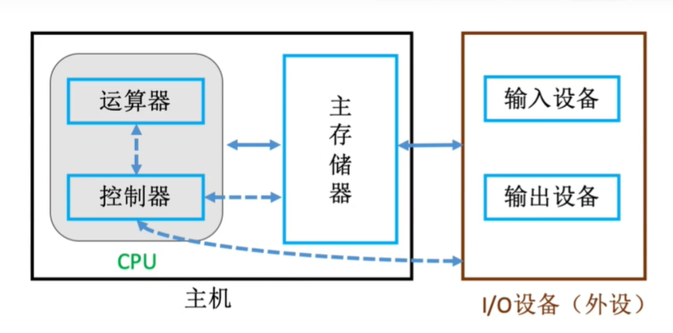
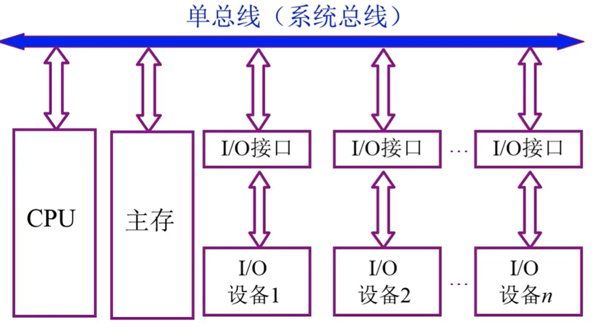
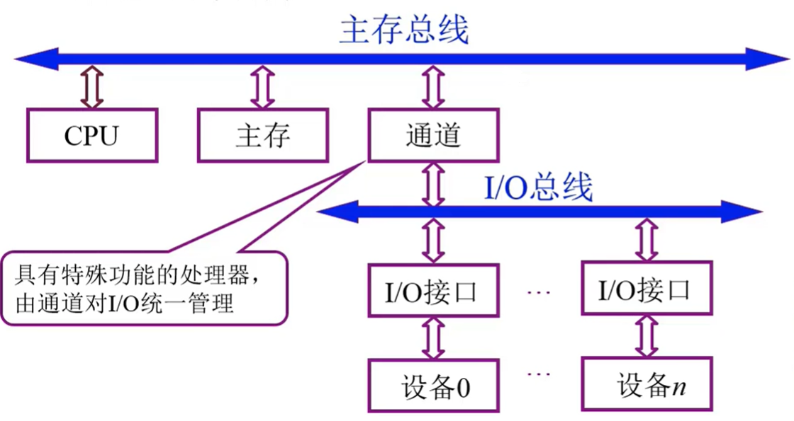
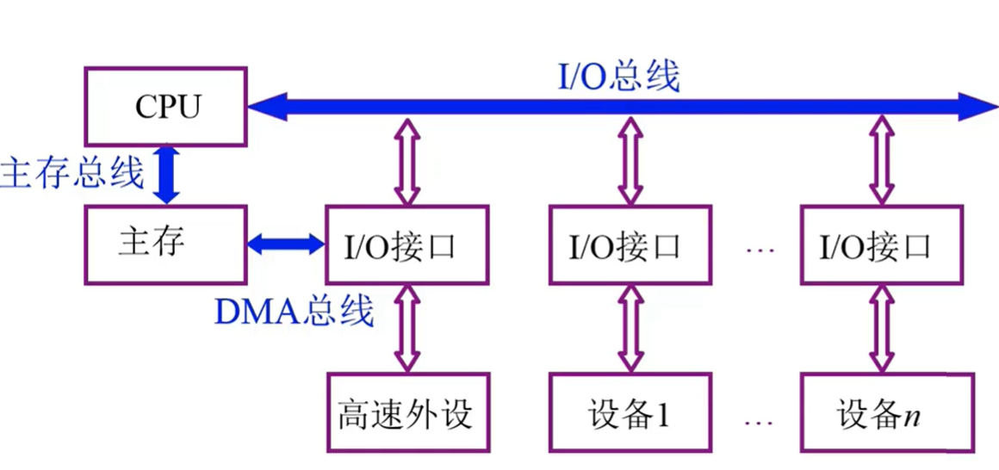
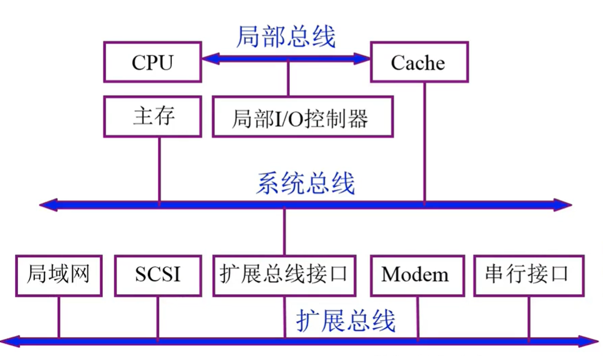
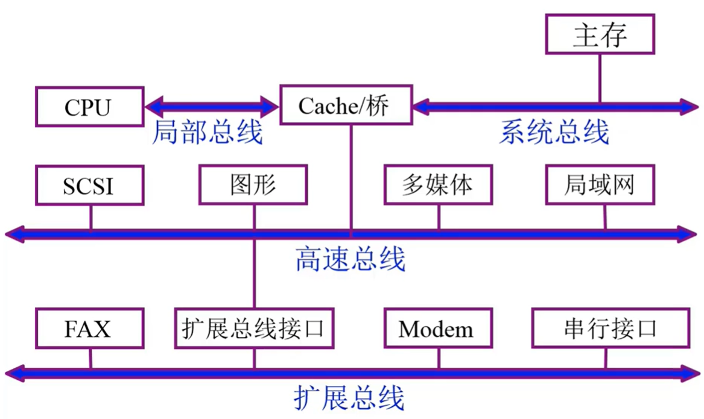
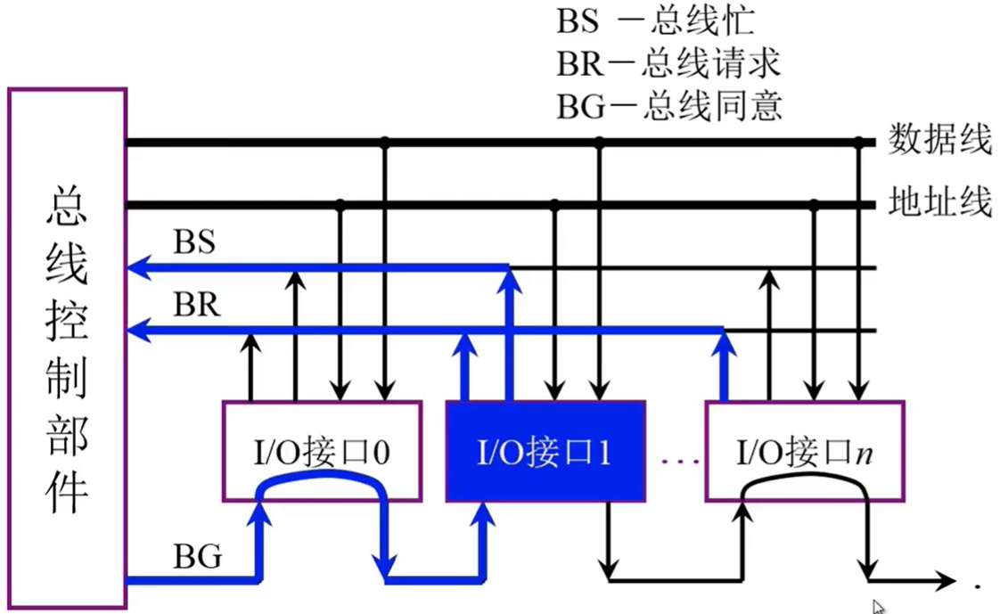
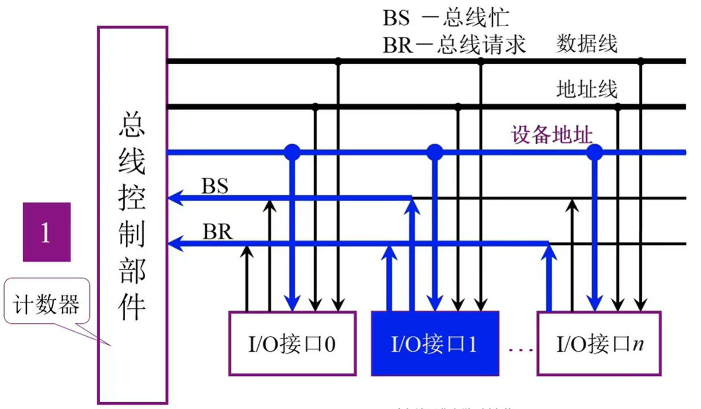
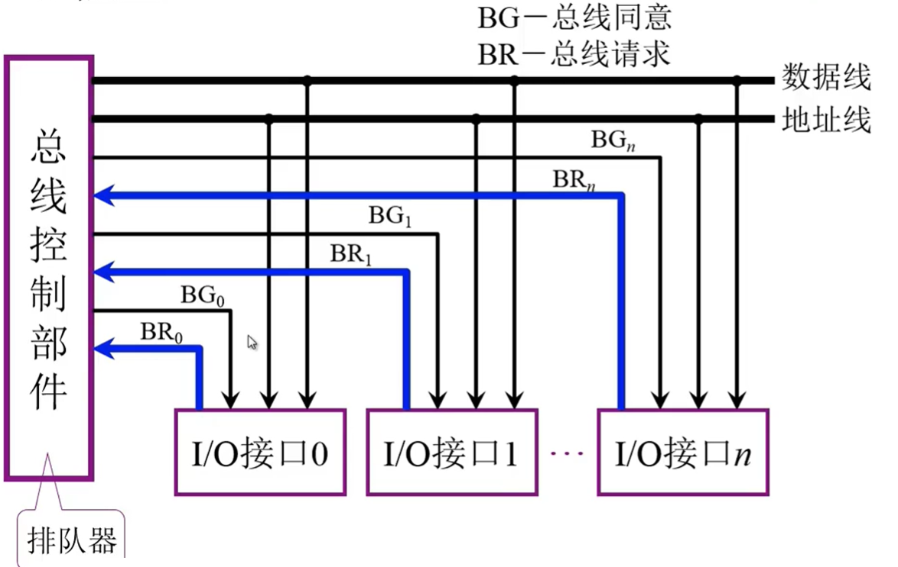

# 基础知识

## 冯诺依曼体系结构

1. 计算机硬件由运算器、控制器、存储器、输入设备和输出设备五大部分组成
2. 计算机处理的数据和指令一律用二进制数表示
3. 顺序执行程序

## 现代计算机架构

1. 以存储器为核心,首先把数据放入存储器,之后控制器控制运算器处理数据,最后发送给输出设备
2. 主机并不是指电脑那个主机,而是特指主存储器+运算器+控制器




**另外要注意主机只包括主存储器,也就是内存,机械硬盘什么的都属于辅存储器,应该归属于I/O设备.**

## 指令

包括操作码和地址码两部分

## 性能指标

### CPU性能指标

1. 时钟周期:时钟周期是计算机中最基本的、最小的时间单位,也就是cpu内部所产生一个bit信号所需时间
2. 主频(时钟频率):指cpu工作频率就是1s内所完成的时钟周期,即时钟周期的倒数.
3. CPI(Clock cycle Per Instruction):执行一条指令所需的时钟周期数
4. IPS ( Instructions Per Second ） :每秒执行多少条指令
5. FLOPS(Floating-point Operations Per Second）:每秒执行多少次浮点运算

### 系统性能指标

1. 数据通路带宽:数据总线一次所能并行传送信息的位数（各硬件部件通过数据总线传输数据)

2. 吞吐量:指系统在单位时间内处理请求的数量。它取决于信息能多快地输入内存，CPU能多快地取指令，数据能多快地从内存取出或存入，以及所得结果能多快地从内存送给一台外部设备。这些步骤中的每一步都关系到主存，因此，系统吞吐量主要取决于主存的存取周期。

3. 响应时间:指从用户向计算机发送一个请求，到系统对该请求做出响应并获得它所需要的结果的等待时间。通常包括CPU时间（运行一个程序所花费的时间）与等待时间（用于磁盘访问、存储器访问、/o操作、操作系统开销等时间）。
   

### 总线性能指标

1. 总线宽度:总线的根数
2. 标准传输率:每秒传输的最大字节数(MB/s)
3. 时钟同步/异步: 同步或者不同步
4. 总线复用: 地址线与数据线复用
5. 信号线数:地址线、数据线和控制线的总和
6. 总线控制方式:突发、自动、仲裁、逻辑、计数
7. 其他指标:负载能力


# 冯诺依曼体系结构简介

## 主存储器

### 存储的基本原理

如果想要读取主存储器的数据,

1. 首先主存会去MAR找到你所需数据的地址,
2. 然后根据地址去存储体中取出数据,
3. 放入MDR中
4. 你最终是从MDR里面读取数据


- MAR:Memory Address Register (储存地址寄存器)

- MDR:Memory Data Register (储存数据寄存器)

此时我们就可以发现,MAR决定了寻址的范围,比如说MAR有8 bit,那么就最多可以访问$2^8$这么多地址,而MDR则决定了一次可以存储数据的最大值.

### 存储体结构

- 存储单元:每个存储单元存放一串二进制代码
- 存储字(word):存储单元中二进制代码的组合,就比如说100 0001这个二进制代码,既可以表示65这个数字,也可以表示ASCII的A,也就是说这个二进制组合根据不同理解有着不同含义.
- 存储字长:存储单元中二进制代码的位数
- 存储元:即存储二进制的电子元件，每个存储元可存1bit


## 运算器

运算器是用来进行运算的组件,包括算术运算和逻辑运算.


- ACC:累加器，用于存放操作数，或运算结果。
- MQ:乘商寄存器，在乘、除运算时，用于存放操作数或运算结果。
- X:通用的操作数寄存器，用于存放操作数
- ALU:算术逻辑单元，通过内部复杂的电路实现算数运算、逻辑运算
  

## 控制器

控制器工作的流程如下:

1. PC 来取指令
2. IR 分析指令内容
3. CU 执行具体的指令


- CU(Control Unit):控制单元，分析指令，给出控制信号
- IR(Instruction Register):指令寄存器，存放当前执行的指令
- PC(Program Counter):程序计数器，存放下一条指令地址，有自动加1功能

## 主机工作的完整流程

以高级语言的一次计算为例来了解计算机详细运行原理

```c
int a=2,b=3,c=1,y=0;
void main()
{
  y=a*b+c;
}
```


### 第一条指令-取数


0. 初始状态,PC=0,指向MAR
1. PC通过地址总线访问MAR,并且把存储的地址赋值给MAR,此时MAR=0,PC自增1,此时PC=1
2. MAR发现要访问的地址为0,就去存储体中访问0号地址
3. MAR找到0号地址之后,就把这个指令的内容传给MDR,此时MDR的值就是(<span style="color:red">000001</span> <span style="color:brown">0000000101</span>)
4. 把MDR的数据放入IR分析
5. IR把前六位的操作码送给CU去处理
6. CU发现这个指令是取数指令,所以指挥IR把该指令的地址码发给MAR以便取数.
7. 此时MAR的二进制值为101也就是5,所以去存储体访问5号地址
8. 拿到5号地址的内容(也就是2)以后,再发给MDR暂存,此时MDR=2
9. MDR把内容发给ACC,此时ACC=2

### 第二条指令-乘法


1. IR访问MAR,把自身的值(1),赋给MAR,此时MAR=1,IR自增,此时为2
2. MAR去存储体访问1号地址
3. 把1号地址的内容存到MDR里面去
4. 继续把MDR的内容交给IR来分析
5. IR还是把操作码给CU,CU发现是取数再乘法的指令,
6. CU随后指挥IR把地址码发给MAR
7. MAR去访问二进制为110的地址(十进制6)
8. 把6号地址的数据存入MDR
9. MDR把数据放入MQ,也就是乘商寄存器
10. ACC把被乘数放入通用寄存器X
11. CU指挥ALU完成乘法操作,并把结果放在ACC里面

### 第三条指令-加法


1. IR访问MAR,把自身的值(2),赋给MAR,此时MAR=2,IR自增,此时为3
2. MAR去存储体访问2号地址
3. 把2号地址的内容存到MDR里面去,也就是加法指令
4. MDR把内容交给IR来分析
5. IR把操作码给CU,CU发现是取数再加法的指令,
6. CU随后指挥IR把地址码发给MAR
7. MAR去访问二进制为111的地址(十进制7)
8. 把7号地址的数据存入MDR
9. MDR把数据放入通用寄存器x
10. CU指挥ALU完成加法操作,并把结果放在ACC里面,因为ACC是累加的,所以此时的值为a*b+c


### 第四条指令-存储


1. 老规矩了,PC给MAR赋值,之后自增为4
2. MAR访问存储体
3. 把数据传给MDR
4. IR分析数据
5. CU拿到操作码,发现是给存储体写入数据,而且地址码为8号,
6. CU指挥IR去把地址码赋给MAR,找到需要存储数据的地址是哪个
7. 然后CU又去指挥ACC把数据存到MDR里面,以备数据写入
8. MAR在存储体找到了所需要储存的位置
9. MDR根据MAR的信息,把数据存入内存之中.此时8号地址也就是y,此时y=a*b+c;

### 第五条指令-终止


1. PC赋值MAR之后自增
2. MAR访问4号地址的内容
3. 把数据存到MDR
4. IR分析数据
5. CU发现是停机指令,之后系统中断.

# 数据编码

计算机只能存二进制数据,但是我们平时用的都是十进制还有字符串什么的,那应该怎么样才能存储这些数据呢?

我们一般都采用编码,人为地把这些数据转化为二进制数据,以便让计算机存储.

## 数字


## 字符和字符串

### ASCII码

使用7位二进制数来表示常用的字符,最高位为0,这个最高位是用来进行奇偶校验的.

# 总线

总线(bus)就是连接计算机各个部件的信息传输线.一个时间点,只能有一个设备使用总线.

## 总线的分类

1. 片内总线:就是cpu内部的总线
2. 系统总线:计算机各部件的总线,包括:"数据总线,地址总线,控制总线"
3. 通信总线:用于计算机系统之间或计算机系统与其他系统(如控制仪表,移动通信等)之间的通信

## 总线结构

### 单总线结构

这种结构非常不行,CPU和主存之间访问非常频繁,如果你这边把他们都串在一起,主存在访问I/O设备的时候,CPU只能干等,因为总线一个时间内只能有一个组件访问.所以效率很低.



### 双总线结构

这样速度就更快了,不解释



### 三总线结构

DMA(Direct Memory Access)直接存储器访问,再次改进



### 三总线结构改进

这个模型的问题在于,多个外设都连接在一条总线上,导致个别外设性能受影响



### 四总线结构

这种结构可以把高速设备和低速设备分类管理,大大提高速率



## 总线控制


### 链式查询

1. 各个I/O接口通过BR来请求总线控制权
2. 总线控制部件通过BG从0开始依次访问各个I/O接口
3. 发现这个接口正在请求总线,之后把控制权交给接口,接口通过BS发布总线已占用的信号.

这个方式缺点就在于各个I/O优先级是根据接入的顺序决定的,0号接口每次都能被最先服务,而n号接口可能一直都不能被服务到.



### 计数器定时查询

1. 各个I/O接口通过BR请求总线控制
2. 总线控制部件内部有一个计数器,可以指定开始位置,比如说开始是0,那么就去访问0号接口看看是否需要服务,如果没有,计数器自增,访问1号接口,以此类推.
3. 如果接口需要服务,那么就通过BS发出总线占用的信号.



### 独立请求方式

每个接口都有自己专属BR,虽然很快,但是很费钱.



# 数据运算

## 移位

### 算数移位

移位的时候，负数的反码需要添1，因为反码是原码取反得到的。

负数的补码需要注意，因为补码最后加了一个1，所以导致后面的位数进位了，相当于取反了，又变成了原码，所以左移添0。而右移的时候，左边还是反码所以补1。

| 码制     | 添的值           |
| -------- | ---------------- |
| 正数     | 0                |
| 负数原码 | 0                |
| 负数反码 | 1                |
| 补码     | 左移添0，右移添1 |

### 逻辑移位

## 溢出

我们知道,补码实现的机制就是靠加一个模数溢出来取模,从而实现补码.但是假如我们自己运算时加的数太大或太小也会溢出.

假设机器字长1字节,理论上125+23=148.但是实际上$(0111,1101)+(0001,0111)= (1001,0100)$,计算机判定第一位为负数,误以为这个是补码,原码就变成了$(1110,1100)_原=-108$.这个很容易理解,因为,模运算就跟钟表一样,是一圈循环的,详细参见上图.

也就是说,两个正数相加溢出会变成负数,同样的,两个负数相加,因为最高位都是1,加完之后,符号位变成0,之后高位溢出(被模掉),反而变成了正数.

总结一下:

- 正数+正数会上溢变成负数
- 负数+负数会下溢变成正数.

## 乘法运算


# 数据存储

以8位2进制为例


- 无符号整数

  所有的位置都是数据位，在8bit情况下，表示的范围就是8位2进制的范围。

- 定点整数

  第一位为符号位，剩下的全都是数据位。小数点不占位，默认在最后。

  $[x]_原 =1000 0001. $        表示-1

- 定点小数

  第一位为小数位，之后是小数位（但是不占位），剩下的都是数据位。

  $[x]_原 =1.100 0000  $  表示-0.5

  接下来说一下定点小数的表示范围，因为定点小数是无限趋近于1的，不妨设一个单位矩形。

  0.1的时候，代表矩形填充了一半。

  

  0.11代表剩下的又被填充了一半

  

那么这个二进制所能表示的面积就是1减去还剩下的面积。此时我们需要注意到一个非常关键的东西，那就是最后一个填充的方块，他的面积刚好就是剩余的面积。也就是说我们如果想要计算红色区域的面积，只需要1-最后一个红色方块的面积。就相当于1-黑色区域的面积了。用公式来说就是，如果有n位2进制，那么最大面积就是$1-2^{-n}$。


- 补码

  因为原码反码都会有-0的存在，而引入补码之后就没有这个问题了。

  定点整数：1000 0000的补码是0000 0000

  定点整数：0000 0000的补码也是0000 0000 

  所以补码的0只有一个。那么就产生了一个问题，这-0和+0最后补码是一样的，就会造成一位的浪费，所以规定1000 0000这个补码为$-2^7$，所以补码能表示的负数要比原码多一位。


n指的是数据位的长度

| 类型       | 原码范围                    | 补码范围           | 注释            |
| ---------- | --------------------------- | ------------------ | --------------- |
| 无符号整数 | $0 \sim 2^n-1$              |                    | 若8位2进制，n=8 |
| 定点整数   | $-(2^n-1) \sim 2^n-1$       | $-2^n \sim 2^n-1$  | 若8位2进制，n=7 |
| 定点小数   | $-(1-2^{-n}) \sim 1-2^{-n}$ | $-1 \sim 1-2^{-n}$ | 若8位2进制，n=7 |


 

移码：就是把补码的符号位取反。可以方便补码来比较大小


```

```


# 2019/1/21


2.1 数据的表示方法
2.2定点数的加减运算
2.3定点数乘法运算
2.4定点数除法运算
2.5浮点数的运算