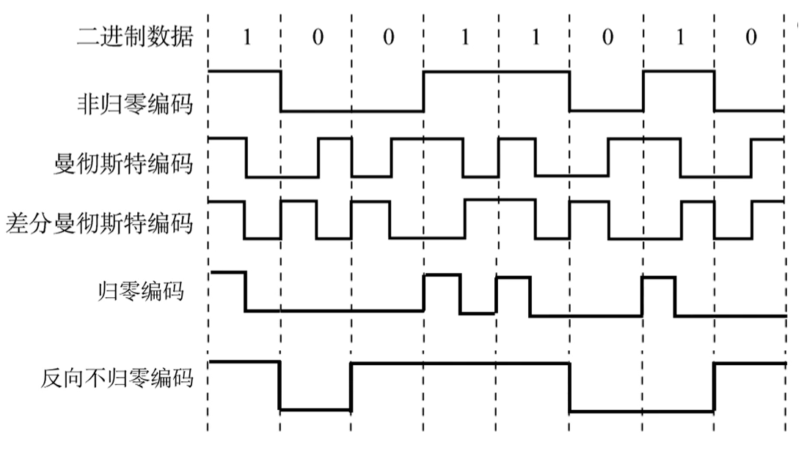
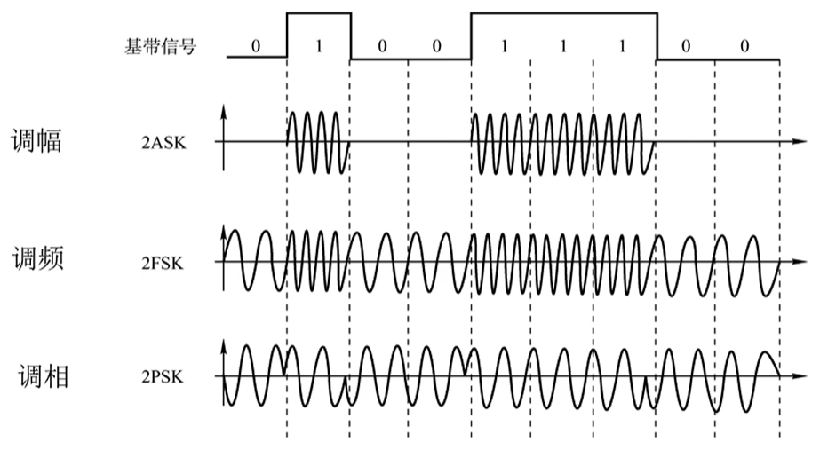
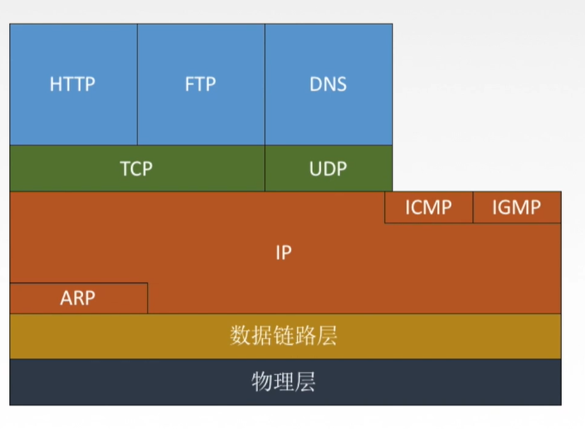
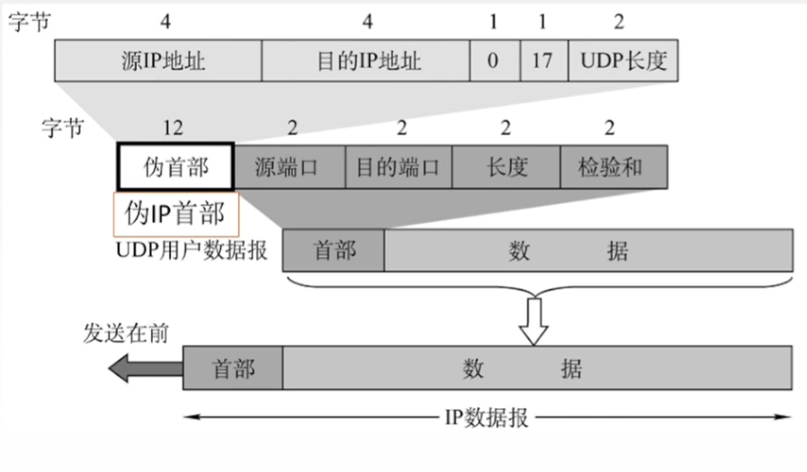
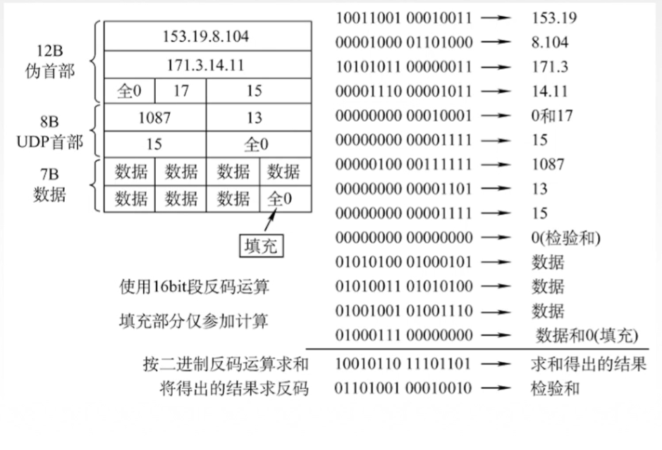

# 概述

## 发展

美国在二战的时候，为了保证战场的通信，发明了网络。

## 常用的网络模型

网络有多种模型

### OSI 模型

- OSI 开放系统互连参考模型 (Open System Interconnection)

- ISO组织于1984年提出开放系统互连参考模型,

- 上面三层是资源子网,用于数据处理

- 下面三层是通信子网,用于数据通信

  

OSI七层模型

<ol reversed="reversed">
  <span style="color:red">资源子网<span>
    <li>应用层(application layer)</li>
    <li>表示层 (presentation layer)</li>
    <li>会话层 (session layer)</li>
  <span style="color:black">沟通两者<span>
 		<li>传输层 (transport layer)</li>
  <span style="color:blue">通信子网<span>
    <li>网络层 (network layer)</li>
    <li>数据链路层 (data link layer)</li>
    <li>物理层 (physical layer)</li>
</ol>
### 分层的原则

- 各层相互独立,每层只实现一种相对独立的功能
- 上层单向使用下层提供的服务
- **水平协议,垂直服务**


### 五层模型

<ol reversed="reversed">
    <li>应用层(application layer)</li>
 		<li>传输层 (transport layer)</li>
    <li>网络层 (network layer)</li>
    <li>数据链路层 (data link layer)</li>
    <li>物理层 (physical layer)</li>
</ol>


# 1.物理层

## 任务

物理层的任务就是接收并转换物理信号。


## 专业术语

### 信道

指的是信息传输的媒介,比如说网线,电话线什么的.

### 吞吐量

表示单位时间内通过某个接口(或信道)的数据量

### 时延

指数据(报文/分组/比特流)从网络一段传送到另一端所需的时间,也叫延迟,单位是s

一个完整的时延,包括以下的组成

1. 发送时延(传输时延):

   从发送第一个bit到最后一个bit所需的时间

2. 传播时延:

   取决于电磁波的传播速度和链路长度

3. 排队时延:

   等待输出/输入链路可用

4. 处理时延: 

   检错,找路由器出口

一般的高速链路指的是高发送速率,剩下的时延不可改变.

### 时延带宽积

$$ 时延带宽积(bit) = 传播时延(s)*带宽(bit/s)  $$

类似于路程=速度*时间,时延带宽积指的是A现在向B一直以某bit/s的速度发送bit,到第一个数据到B为止,一共发送了传播时延s,

那么现在在链路中存放的未到达的数据就是时延带宽积,也就是说反映了从A到B这个链路中,可以储存多少bit的数据.

### 往返时延 RTT

就是说发送方发送一个数据,得到对方响应所需的时间.

RTT=传播时延*2+对方处理时间


## 码元和波特


#### 码元

所谓的**码元**就是指信息转化为2进制的信息量,比如说二进制的$(1010011)_2$，一个0或者1就是一个码元,而对于十进制来说,1234567890,一个1或者2,3就是一个码元.虽然码元代表的是最基本的信息量,但是所包含的bit并不一定相同,这是因为数据的传输都要变成二进制传输的.

比如说二进制的100011,码元就是1bit,因为你一个基本的信息就是0或者1,刚好只占1bit.而对于10进制来说,我发一个6,那你用二进制传过去是不是就变成了110,那你是不是就是3bit的信息量了.所以说想看一个10进制的数转到二进制有几位,可以看一波计算机导论,如果你忘了,我这再给你说一下:

$$ 10进制转2进制位数=\lceil log_2(10进制的数据) \rceil$$

比如说 10进制的6占 $log_2(6)=\lceil 2.585\rceil=3$,也就是3位二进制数.

继续上面的,10进制数,一共有10种数,在传输中就有10种电信号,那么就称这种码元为10进制码元,20种电信号就是20进制码元.其实这个与进制并没有严格关系,是按照电信号种类决定的,不过名字叫个几进制码元罢了.

但是进制数不代表bit数,比如说30进制码元,那么就有30种电信号,那么一定需要$log_2(30)=\lceil 4.9069\rceil=5$位 二进制数表示.那么1个30进制码元的bit数就有5个bit

#### 码元速率-波特

波特就是单位时间传送的码元个数

指的就是码元的传输速率,其定义为每秒钟传送码元的数目,老铁一秒扣了100个6,那你码元速度就是300码元每秒,我们用单位"波特",表示码元的传输速率,符号为Baud.

$1 Baud = 1 码元/秒$ 

#### 比特率

也叫数据传输率,一般就是指比特传输的速率,单位是 b/s ,kb/s ,Mb/s ,Gb/s ,Tb/s.这里要和波特区分一下,因为码元所携带的信息量不一定是1bit,所以 1Baud也不一定是1bit/s.

#### 带宽

指的是单位时间在网络上传输数据的最高数据传输率,很好理解,反正我家就没有上过10Mb/s,明明买的千兆带宽.

#### 信道带宽

指的是能通过的信道能通过的最高频率和最低频率之差,也就是可以通过的信号频率范围.

## 奈氏准则

### 码间串扰

信号会失真,虽然都是废话,但是这个真的很重要,影响失真的一般有以下几个因素:

1. 码元传输速率

2. 信号传输距离

3. 噪声干扰

4. 传输媒体质量

虽然都是失真,但是也分轻重缓急,还记得刚才的信道带宽是什么吗,不觉得加一个这个非常突兀吗?实际上并不是所有信号都能在信道上畅通无阻的,如果频率太低能量就太少,很快就会被消耗.如果能量太高就会发生**码间串扰**失真.

接下来我们好好说说码间串扰.假如你发送码元的频率很高,也就是说码元传输速率非常高,那么就可能导致接收方收到的码元都挤在一起完全无法取分谁是谁.就好比你看电视,一个一个看都是静态的,假如现在连续播放这些图片,就好像这个人物动起来了一样,实际上图片都是静态的,但是他们数据传输的实在是太快了,以至于你根本分不清谁是谁.码间串扰的原理当然不是这个,但是可以这样理解.

实际上码间串扰是因为电信号在传播的时候都是波形的,离得太近就会发生波的叠加,导致信号不可认.

#### 奈氏准则的引出

这个问题在当时困扰了很多的人,为了解决这个问题,一个叫奈奎斯特的巨佬站了出来.他说:在理想低通（无噪声，带宽受限）条件下，为了避免码间串扰，

​																	$$极限码元传输速率= 2W Baud$$，

其中W是信道带宽，注意此处的带宽单位是Hz。

大佬说话都喜欢加点专业名称,但是咱可不是大佬,还是说的清楚点比较好,那这句话什么意思呢?就是说啊,我现在找一个理想的信道,设一个频率值,保证比这个频率值低的信号都能传过来,而高频率的信号都被过滤掉.在这样一种理想信道的情况下,码元最高传输速率就是两倍的信道带宽.

#### 奈氏准则表示数据率

虽然奈氏准则描述的是码元传输极限速率,但是码元本身可以计算所对应的bit,所以可以间接表示数据传输速率

$$极限码元传输速率= 2W Baud= 2Wlog_2(几种电信号)$$

举个例子吧:
在无噪声的情况下，若某通信链路的带宽为3kHz，使用的是10进制码元(10种电信号)，则该通信链路的最大数据传输率是多少?

1. 首先需要计算极限码元速率

   $$极限码元传输速率= 2W Baud= 2 \times 3000= 6000 Baud$$

2. 然后把Baud 换算成bit/s,此时需要确定10进制码元有几bit

   $log_2(10)=\lceil 3.3219\rceil=4$

3. 然后转换

   $6000Baud = 4\times 6000bit/s =24000bit/s $
   
   

### 香农定理

#### 信噪比

刚才奈奎斯特大佬给出了码元极限传输速率,现在并没有给出极限的bit传输速率,比如说我一下子整一个1024进制,那你一个码元就占10bit,这样下去总不可能bit传输速率无穷大吧?

好在信息论泰斗香农研究了这个问题,他发现,噪声在信息传递中扮演者非常非常重要的角色,如果像奈奎斯特那样不考虑噪声,那么总是很难计算实际的传输率.他还发现,噪声的影响是相对的,虽然你有噪声,但是我信号的频率你噪声的影响就越小,因此**信噪比**就是决定噪声影响的重要因素.

信噪比=信号平均功率/噪声平均功率,常记为S/N，并用分贝（dB）作为度量单位，即:

​																					$$ 信噪比(dB) = 10log_{10}(\frac{S}{N})$$

之所以转换一下,是因为S/N的值往往特别大,需要变小.

#### 香农公式

接下来就是公式本体了:在带宽受限且有噪声的信道中，为了不产生误差，信息的数据传输速率有上限值,公式为:

$$信道极限传输速率=Wlog_2(1+\frac{S}{N})$$

光看这个可能难以理解,我们举个例子吧:

电话系统的典型参数是信道带宽为3000Hz，信噪比为30dB，则该系统最大数据传输速率是多少?

1. 首先计算S/N

   $$30dB=10log_{10}(\frac{S}{N}) $$

   $$\frac{S}{N}=1000$$

2. 然后计算极限传输速率

   $$极限速率=3000log_2(1+1000)\approx 30kb/s$$

#### 推论

1. 信道的带宽或信道中的信噪比越大，则信息的极限传输速率就越高。
2. 对一定的传输带宽和一定的信噪比，信息传输速率的上限就确定了。
3. 只要信息的传输速率低于信道的极限传输速率，就一定能找到某种方法来实现无差错的传输。
4. 香农定理得出的为极限信息传输速率，实际信道能达到的传输速率要比它低不少。
5. 从香农定理可以看出，若信道带宽W或信噪比s/N没有上限〈不可能），那么信道的极限信息传输速率也就没有上限。

### 两个公式的对比

学完上面的两条公式,很多人就会迷了,这两个也太像了吧,到底有啥区别呢?现在来整体总结一下

#### 奈氏准则

1. 考虑的是码元传播中自身发生的干扰.

2. $理想低通信道下的极限数据传输率=2Wlog_2(N)$,其中N指的是N种电信号,也就是N进制码元,W指信道带宽

3. 要想提高数据率，就要提高带宽/采用更好的编码技术。

#### 香农定理.

1. 考虑的是外界噪声的影响.

2. $信道的极限数据传输速率=Wlog_2(1+\frac{S}{N})$,其中$\frac{S}{N}$指信噪比,W指信道带宽
3. 要想提高数据率，就要提高带宽/信噪比。


实际中极限传输速率由二者共同决定,举个例子:

二进制信号在信噪比为127:1的4kHz信道上传输，最大的数据速率可达到多少?

首先算奈氏准则:

$max1=2\times 4000 \times log_2(2) =8000bit/s$

然后是香农定理:

$max2=4000\times log_2(1+127)=28000bit/s$

然后$maxTrue=min(max1,max2)=8000bit/s$

## 编码与调制

### 基带信号与宽带信号

- 基带信号(数字信号):就是原本的信号,比如图片数据,视频数据.

- 宽带信号(模拟信号):将基带信号进行调制后形成的频分复用模拟信号,所谓调制就是把基带信号的频率范围调高.宽带信号也就是经过调频后的基带信号。

现在这样说大家肯定一脸懵逼,不着急,接着看就知道了.

- 在传输距离较近时，计算机网络采用基带传输方式(近距离衰减小，从而信号内容不易发生变化),

- 在传输距离较远时，计算机网络采用宽带传输方式（远距离衰减大，即使信号变化大也能最后过滤出来基带信号）.

现在我想大家应该明白这是什么意思了吧,就跟高中电路一样,低压电损耗太大,必须加压才能远距离传输,但是你家如果自己用发电机发电,就没必要加压了,直接用就行.

- **将数字信号或模拟信号转化为数字信号的技术称为编码**
- **将数字信号或模拟信号转化为模拟信号的技术成为调制**

### 数字信号调编码为数字信号



- 非归零编码:跟二进制数据保持一致,但是如果出现连续的0或1,就会变成一条直线,完全无法区分.
- 归零编码:每次接收数据1后,在一码元内变为0.同样的,0太多也看不清.
- 反向不归零编码:信号电平翻转表示o，信号电平不变表示1。
- 曼彻斯特编码:将一个码元分成两个相等的间隔，前一个间隔为低电平,后一个间隔为高电平表示码元1;码元0则正好相反。也可以采用相反的规定。该编码的特点是在每一个码元的中间出现电平跳变，位中间的跳变既作时钟信号（可用于同步），又作数据信号，但它所占的频带宽度是原始的基带宽度的两倍。
- 差分曼彻斯特编码:如果为1,前半部分和上一个后半部分相同,为0则和上一个的后半部分相反(**同1异0**).常用于局域网传输.

### 数字信号调制为模拟信号

一般把数字信号变成模拟信号就下面几种,一目了然,不言而喻.



### 模拟信号编码为数字信号

这个生活中最常见,比如说平时录音,就是把你的声波信号转化成二进制数据.这其中有三个步骤:

1. 抽样:对模拟信号周期性扫描，把时间上连续的信号变成时间上离散的信号。为了使所得的离散信号能无失真地代表被抽样的模拟数据，要使用采样定理进行采样: $f_{采样频率}\geqslant2f{信号最高频率}$
2. 量化:把抽样取得的电平幅值按照一定的分级标度转化为对应的数字值，并取整数，这就把连续的电平幅值转换为离散的数字量。
3. 编码:把量化的结果转为二进制编码.

### 模拟信号调制为模拟信号

为了实现传输的有效性，可能需要较高的频率。这种调制方式还可以使用频分复用技术，充分利用带宽资源。在电话机和本地交换机所传输的信号是采用模拟信号传输模拟数据的方式;模拟的声音数据是加载到模拟的载波信号中传输的。

## 物理层设备

### 中继器

物理信号在传输的时候，会发生衰减，所以需要中途加强信号。中继器可以对**数字信号**进行**再生和还原**

中继器两端是不同网段，并不是子网。

中继器只负责无脑转发数据，因此端口两边的协议也要一样。

### 集线器


## 奈奎斯特定理（计算）

 在物理层发数据，不能一下子发太多，否则会造成**码间串扰**。其实就是说，你发的太多了，数据都叠一起了，分不清了。

那么总得有一个最大值吧？这个值就是**奈奎斯特定理**算出来的。
$$
极限传输速率= 2WBaud=2Wlog_2V (单位 b/s)
$$
W是带宽，V是码元的电频数目。所谓的码元电频数目，你就记住：

**几进制的码元，电频数就是几！！码元有几种，电频数就是几！！！**

2WBaud是指最大码元传输速率，如果已知了最大码元速率，之后再乘以$log_2V$即可


例题1

某信道最高码元速率为2000码元/秒，现在码元振幅有16种，那么最高数据率是多少？

解：已知了最高码元速率，只需要再乘以$log_216$即可。

$最大速率=2000*log_216=8000$


例题2

若某通信链路的带宽为3kHz，使用的是10进制码元(10种电信号)，则该通信链路的最大数据传输率是多少?

解：$最大速率= 2 * 3000 *\lceil log_210\rceil = 24000bit/s$


## 信道复用

如果每一个主机之间都拉一条线，那么线也太多了吧。为了方便，我们就可以用一根线来处理多个数据。那么问题来了，这么多数据挤在一起，该怎么样互相区分呢？

- **频分复用**

  将不同的数据用不同的频率发出去，然后始终占有这个频段。

- **时分复用**

  把一个时间段划分成多个小段，不同用户占据不同的时间段。

- **波分复用**

  实际上还是频分复用。指的是把光波用不同频率发出去。用光纤传播。

- 码分复用

  


# 2.数据链路层

## 任务

数据链路层是管理点到点的数据传输问题，而网络层是端到端的。

点到点就是指路由器结点之间，而端到端是指主机与主机之间。


确保两个链路之间的通信

- 为网络层提供服务，**无确认无连接服务，有确认无连接服务，有确认面向连接服务**
- 链路的管理，即连接的建立、维持、释放。
- 封装成帧与透明传输：把网络层的IP数据报加上帧首部和帧尾部，封装成帧。
- 流量控制
- 差错控制

## 封装成帧与透明传输

核心思想就是如何界定帧的长度？

另外还有一个问题，那就是数据报的长度不能太长，必须小于MTU（Maximum Transfer Unit）：帧数据部分长度上限。

### 字符计数法

每个帧的第一个字节来标明帧的长度。


但是如果帧首部出现了差错，比如说第一帧的5变成了4，那么后续所有的帧都会错位。


### 字符填充法

这个思路是把网络层的**IP数据报**加上帧首部和帧尾部。 首部和尾部的一个重要作用就是进行**帧定界**，也就是划分这个帧的范围。接收方通过查看**帧定界符**就可以知道帧的起始位置和结束位置。


帧定界符有两个，分别是

- SOH（start of header）：表明帧的开始，十六进制为01
- EOT（end of transmission）：表明帧的结束，十六进制为04

- ESC（Escape）：转义字符


### 零bit填充法

这次帧的定界符不再使用SOH和EOT了，而是使用`0111 1110`这个二进制。首尾都是这个。

之后为了避免数据报中也出现这个值，可以使用下面的方法

- 发送端扫描整个数据报，如果出现5个1，就在后面加1个0。
- 接收方也扫描整个数据报，如果出现了5个1，就删除后面的一个0。


### 违规编码法

在曼彻斯特编码中，只会出现“高-低”，“低-高”两种情况，所以我们就可以用“高-高”和“低-低”来界定帧的起始和终止。


## 差错控制

将差错控制的任务交给数据链路层,可以在路由器处就发现数据出错,不用等到数据到了目标主机再去检查错误,可以节省资源。

差错大概可以分为两种：

- 位错：bit从0变成了1，或者从1变成了0。
- 帧错
  - 丢失
  - 重复
  - 失序

而数据链路层负责的是**位错**。为了避免这种错误，我们就需要用编码技术来判断数据是否出现了差错。

编码有两种

- 检错编码
  - 奇偶校验码
  - 循环冗余校验码
- 纠错编码
  - 海明码


### 奇偶校验码

#### 原理

这个校验码非常简单,是根据你bit流中'1'的奇偶数量决定的,分为奇校验和偶校验两种.我们先看奇校验.

假如你原来的数据是 11011010,原数据1的数量为奇数,那么我就在bit流的前面(或者后面)添加一个0,确保1的数量为奇数.如果接受到数据的时候1还是奇数,那么就可以断定数据正常送到(其实不一定).

偶校验和上面的一样,原来的数据是 11011010,为了保证1的数量为偶数,就在后面(或前面)添加一个1.数据到达之后再判断1是否为偶数.

这其实并不能很好校验数据差错,比如说采用奇校验,发送的数据为  011011010 ,现在路上发生了差错,数据到达后变成了000011010,但是1的数量还是奇数,这就产生了问题.但是如果只变化了一位 111011010 现在就能看出来了.

也就是说,**奇偶校验码只能检验出奇数数量的变化**

#### 偶校验的异或实现

奇偶校验码的校验位可以通过异或运算得到.

比如说对 111 1001进行偶校验,首先

1. 对其每一项进行异或运算:1⊕1⊕1⊕1⊕0⊕0⊕1=1

2. 之后用原数据加上这个校验位1111 1001

如果想进行校验,只需要异或每一项,如果为0,说明1的个数为偶数,也就是没问题(其实不一定).1⊕1⊕1⊕1⊕1⊕0⊕0⊕1=0.如果不为0,说明出错了.


### 循环冗余校验码

#### 1. 选择一个生成多项式

循环冗余码的原理倒没那么复杂,说白了就是把原数据加上校验码之后,除以一个数并保证余数为0.之后发给对面,如果他们收到的这个数据除以同样的数也没有余数,说明这个数据没问题.


接下来就是令人头疼的地方了,到底选哪个数作为除数呢?我这边选一个996,你那边选一个0721,两边谁都不能说服谁,怎么办呢?

这时候人们就想出来一个点子,任意一个由二进制位串组成的代码都可以和一个系数仅为‘0’和‘1’取值的多项式一一对应。例如：代码1010111对应的多项式为$x^6+x^4+x^2+x+1$，而多项式为$x^5+x^3+x^2+x+1$对应的代码101111。这时候只需要定一个标准的多项式,就可以确定一个标准的除数了.

常用的循环冗余校验标准多项式如下：

CRC(12位) =$X^{12}+X^{11}+X^3+X^2+X+1$

CRC(16位) = $X^{16}+X^{15}+X^2+1$

CRC(CCITT) = $X^{16}+X^{12} +X^5+1$

CRC(32位) = $X^{32}+X^{26}+X^{23}+X^{22}+X^{16}+X^{12}+X^{11}+X^{10}+ X^8+X^7+X^5+X^4+X^2+X+1$

以CRC(16位)多项式为例，其对应校验二进制位列为1100 0000 0000 0101。

**我们把这个多项式叫==生成多项式==**

#### 2. 计算校验码

现在有了除数了,但是我们必须确保原数据加校验码之后,一除余数为0.这时候靠猜肯定是不行了,我们需要来手动计算校验码.

首先确定校验码的位数,这个其实很简单,生成多项式最高次幂是多少,就有多少位,比如生成多项式为10011,那么就有4位校验码.之后,你校验码有几位,就在原数据后面补几个0,最后除以生成多项式,你校验码有几位,就余几位作为你的校验码.

假设我们需要发送的数据为11 0101 1011,生成多项式为10011.之后用(数据+校验码与多项式进行**模2除法**,也就是说,进行运算时一律进行异或运算,并不像往常的除法那样相减.

因为生成多项式最高次幂为4,所以在原数据后面补4个0,即 11 0101 1011 0000 之后模2除以10011 余数为1110,这个余数就是校验码.

#### 3. 检查与纠错

这个没啥说的,对方收到你的数据之后,用同样的生成多项式进行模2除法,如果结果不为0,说明出错,为0说明正确.

其实循环冗余码也可以进行单bit纠错,除完之后余数是几,就说明第几位出错,非常方便.

但是要注意,设你校验码的位数为r,数据位为k,那么若$$2^r ≥ k+r+1$$,才能进行纠错.原理之前解释过了,r位的校验码最多表示$2^r$种状态,正确,第一位错,第二位错,,,,,,等等,一共有k+r+1种情况,只有你的校验码足以表示这么多情况时,才能使用纠错的功能.

实际中,生成多项式都比较短,而数据都特别大,所以一般只用于检查错误,不用于纠错.


### 海明校验码

海明码是基于偶校验码的加强版,它把数据划分成多个区域,分别进行偶校验,从而实现纠错.海明码不仅仅能够检查出错误,还能够检查出到底哪一位出了错.

**注意海明码只能检查1位的错误.**

#### 1.确定校验码的位数

海明码就是超级加强版奇偶校验码,奇偶校验码只有一个校验位,也就是说只能反映两种信息"对",或者"错".为了提高更多的信息,就需要适当增加校验的位数,但是到底加多少才合适呢?

假设原来的数据有k位,校验位有r位,那么这r位校验码最多可以表示$2^r$这么多种状态,而这些状态包括了,"正确状态,第0位出错,第1位出错,第二位出错等信息",而这些位数总共有k+r+1这么多位(包括校验码出错,还有原数据出错,还有正确状态),所以说,这$2^r$种状态至少大于k+r+1,才可以表示每一位出错外加正确情况.

所以我们可以列出不等式:	$$2^r ≥ k+r+1$$

比如说我们需要发送数据$D=101101$ ,

则:$k=6$ ,$$2^r ≥ 6+r+1$$

所以:$r≥4$

所以D的海明码应该有6+4=10位.数据位6位,校验位4位.

#### 2.确定校验码和数据的位置

说到校验位的位置,我们很自然就想把它塞到数据位的前面,但是海明码可不是那种随便的码.如果你全部一股脑放到了最前面,那么到底该如何分组进行校验呢?所以海明码规定把校验码$P_i$放到第$2^{i-1}$的位置.剩下的位置由数据位依次填充.如下图所示:

| 数据位         | 10    | 9     | 8     | 7     | 6     | 5     | 4     | 3     | 2     | 1     |
| -------------- | ----- | ----- | ----- | ----- | ----- | ----- | ----- | ----- | ----- | ----- |
| 数据位的二进制 | 1010  | 1001  | 1000  | 0111  | 0110  | 0101  | 0100  | 0011  | 0010  | 0001  |
| 数据           | $D_6$ | $D_5$ | $P_4$ | $D_4$ | $D_3$ | $D_2$ | $P_3$ | $D_1$ | $P_2$ | $P_1$ |
| 值             | 1     | 0     |       | 1     | 1     | 0     |       | 1     |       |       |

#### 3.求出校验码

由上表可知,$P_1$数据位的第一位是1,同样第一位为1的还有$D_1$,$D_2$,$D_4$,$D_5$,所以:

$$ P_1 =  D_1 \oplus D_2 \oplus D_4 \oplus D_5 = 0$$ 

$P_2 $右边第二位为1,同理,右边第二位为1的还有$D_1$,$D_3$,$D_4$,$D_6$,所以:

$$ P_2 =  D_1 \oplus D_3 \oplus D_4 \oplus D_6 = 0$$ 

同理得出 $P_3=0$,$P_4=1$.

所以101101的海明码应该为 ==00==1==0==011==1==01.

注意,这一步进行异或的数据位,就是所求校验码的管辖数据.比如$P_1$管理$D_1,D_2,D_3,D_4$.

#### 4.检错与纠错

假设第5位(也就是$D_2$)出错,因此,接收到的数据位为0010001101.

| 数据位         | 10    | 9     | 8     | 7     | 6     | 5     | 4     | 3     | 2     | 1     |
| -------------- | ----- | ----- | ----- | ----- | ----- | ----- | ----- | ----- | ----- | ----- |
| 数据位的二进制 | 1010  | 1001  | 1000  | 0111  | 0110  | 0101  | 0100  | 0011  | 0010  | 0001  |
| 数据           | $D_6$ | $D_5$ | $P_4$ | $D_4$ | $D_3$ | $D_2$ | $P_3$ | $D_1$ | $P_2$ | $P_1$ |
| 值             | 1     | 0     | 1     | 1     | 1     | 0     | 0     | 1     | 0     | 0     |

接着令所有校验码和管辖范围内的数据进行异或运算.

1. $$S_1 = P_1 \oplus D_1 \oplus D_2 \oplus D_4 \oplus D_5 = 1$$ 

2. $$S_2 = P_2 \oplus D_1 \oplus D_3 \oplus D_4 \oplus D_6 = 0$$ 

3. $$S_3 = P_3 \oplus D_2 \oplus D_3 \oplus D_4 = 1$$ 

4. $$S_4 = P_4 \oplus  D_5 \oplus D_6 = 0$$ 

然后从高到低排列: $S_4S_3S_2S_1=(0101)_2=5$,也就是第五位错了.

这个的原理很复杂,但是我们可以简单看看皮毛.看上面的式子,一旦$D_2$出错,那么对应的式子中,只要有$D_2$那么整体就会为1.也就是说只要让每个位出错时,剩下的式子刚好能表示其位置就好了.

比如说$D_4$出现在前三个式子,那么一旦$D_4$出错,刚好就是$(0111)_2$,十进制就是7.具体构造这里不说了,了解大概原理即可.

*顺便一提,如果没错的话,那么算下来都是0.*

#### 5.完整版海明码

但是现在这个版本的海明码还是有问题啊,假如说$P_1$和$P_2$同时变化,那么答案算下来就是3(用我刚才讲的,直接把含有$P_1$和$P_2$的式子变为1).

但是第三位并没有错,错的是世界(误),错的是$P_1$和$P_2$.那么就反映了一个问题,海明码可以找出一个bit的错误,但是不能找出多个bit的错误,那么怎末区分发过来的海明码到底是错了几个位呢?

为了解决这个问题,人们手动在最后头加一个全体校验码,以便检查到底错了几个bit.

这个$P_全$就是对整体进行一个偶校验,本例中,$P_全=1$

| 数据位 | 11     | 10    | 9     | 8     | 7     | 6     | 5     | 4     | 3     | 2     | 1     |
| ------ | ------ | ----- | ----- | ----- | ----- | ----- | ----- | ----- | ----- | ----- | ----- |
| 数据   | $P_全$ | $D_6$ | $D_5$ | $P_4$ | $D_4$ | $D_3$ | $D_2$ | $P_3$ | $D_1$ | $P_2$ | $P_1$ |
| 值     | 1      | 1     | 0     | 1     | 1     | 1     | 0     | 0     | 1     | 0     | 0     |

那么现在就有这么几种情况:

1. $S_4S_3S_2S_1=0$且全体偶校验成功.说明数据正常.
2. $S_4S_3S_2S_1!=0$且全体偶校验失败,说明有一位出错,改正即可.
3. $S_4S_3S_2S_1!=0$且全体偶校验成功.说明数据两位出错,需要重传.

那三个怎么办呢?我也不知道,有机会补坑吧.


## 流量控制

数据发送方往往发的比较快，但是接收方接收的比较慢。所以需要流量控制。

数据链路层和传输层都有流量控制，但是数据链路层是点对点的，也就是路由器之间。而传输层则是主机之间。

**数据链路层**的流量控制思路就是：接收方收不下就不回复确认。

传输层的流量控制思路则是：接收端给发送端一一个窗口公告。告诉对面别发了。


### 停止等待协议

每次发送完一个帧就停止发送，等待对方回应，收到确认后再发送下一个帧。

这时就有两个问题

- 帧丢失了

  如果发送方没有收到回复，那么会自动重传。那么这个超时到底是设置为多少的时间比较合适呢？

  答案是应该**比帧传输的往返RTT略长一点点**。

- 回复的消息迟到了

  如果回复的消息迟到了，这边已经重发过了。那么接收方丢弃发送方重复发来的数据，并再发送一遍确认数据。

  发送方只也是一样的，我只接收一次确认数据，只会来的那个直接丢弃。


### 后退N帧协议(GBN)

发送窗口大小>1，接收窗口=1

停止等待协议的效率实在是太低了，所以人们改进了一下。发送方每次可以一下子发送很多帧，但是接收方，依然每次只接收一个。而且是**按序接收**。

假如现在窗口大小为5，发送方一下子发送了5个数据，0 1 2 3 4。

现在012都到了，3丢失，4到了，那么接收方只接收012，在接收4的时候，发发送**ATK2**，也就是确认2号帧。这样发送方，就会收到4个确认信号，分别是0122，最后一个2丢弃，**然后重新发送34**。

也就是说，接收方必须按照顺序接收，如果任意一个数据丢失，那么发送方会发送这个数据及其之后所有的数据。


### 选择重传协议(SR)

发送窗口大小>1，接收窗口>1


## 介质访问控制

介质访问控制(medium access control)简称MAC。 是解决当局域网中共用信道的使用产生竞争时，如何分配信道的使用权问题。

- 静态划分信道

  - 频分多路复用
  - 时分多路复用
  - 波分多路复用
  - 码分多路复用
  
- 动态分配信道

  - 轮询访问：令牌传递协议
  - 随机访问：
    - ALOHA协议
    - CSMA协议
    - CSMA/CD协议
    - CSMA/CA协议
  
  
  
  
  


也就是说，在使用广播信道的时候，大家消息共用一个信道，乱发可能会造成碰撞，那么该如何避免呢？

### ALOHA协议

所有的数据想发就发，发现数据碰撞了，等待一个随机时间，之后继续发。


### CSMA协议

  先听再发。

也就是说在发送数据前，站点首先会检测电压的波动。如果电压波动很大，就说明当前有多个站点同时发送数据。


- 1-坚持CSMA

  当某站要送数据时，先监听信道，若信道忙，就坚持监听，直到信道空闲为止，当空闲时立即发送一帧。若两个站同时监听到信道空闲，立即发送，必定冲突，即冲突概率为1，故称之为1-坚持型。假如有冲突发生，则等待一段时间后再监听信道。

  > 这个就比如做核酸，先开始人都贼多，所以就一直有人在群里问，“现在人多不？”过了一会，人少了，老师就@全体成员，说人少了，赶紧去做吧！然后大家都去了，这才发现，大家都以为人少了，所以人都来了，这一下子全排队了。此时解决方法就是，先回宿舍，然后继续在群里问。

- 非坚持CSMA

  当某站监听到信道忙状态时，不再坚持监听，而是随机后延一段时间再来监听。其缺点是很可能在再次监听之前信道已空闲了，从而产生浪费。

  > 这个就是说，做核酸的时候，群里面一问，发现人是真的多，然后就先去打游戏，过了随机的时间之后再问，发现人已经少了。然后再去做。缺点就是说，可能人早都少了，工作人员白白等了很多时间，还有人不来做。

- P坚持CSMA

  这种方式适合于时隙信道，当某站准备发送信息时，它首先监听信道，若空闲，便以概率P传送信息，但是也可能以（1-P）的概率推迟发送，等到下一个时间片再发送。如果信道忙，则等待一个随机时间再次重复。P坚持型CSMA可以算是1－坚持型CSMA和非坚持型CSMA的折衷，这两者算是P－坚持算法的特例，即P分别等于1和0时的情形。
  对于P坚持型CSMA，如何选择P值，需要考虑如何避免在重负载情况下系统处于不稳定状态。假如当介质忙时，有N个站有数据等待发送，则当前的发送完成时，有NP个站企图发送，如果选择P过大，使NP＞1，则冲突不可避免。最坏的情况是，随着冲突概率的不断增大，吞吐率会降为0。所以必须选择P值使NP＜1。如果尸值选得过于小，则通道利用率会大大降低。


|          | 1坚持    | 非坚持                 | p坚持                                |
| -------- | -------- | ---------------------- | ------------------------------------ |
| 信道空闲 | 立刻发送 | 立刻发送               | p概率发送，1-p概率，下一个时间片发送 |
| 信道忙   | 继续监听 | 等待随机时间后继续监听 | 等待随机时间后继续监听               |

### CSMA—CD协议

**截断二进制指数规避算法**

核心思想就是现在人太多了，我待会过来吧。

那么这个待会是多久呢？这个就是我们需要计算的核心内容了。

首先设一个k，k是**重传次数**。也就是你发几次，这个k就是几。但是为了防止k太大，规定，**k最大为10**。

之后创建一个数组，里面存放0到$2^k-1$的数据。[0,1,2,4,,,,$2^k-1$]

等待时间就是$2*k*数组中随机一个数据$

如果重传了16次，数据还是没有发送，则丢弃这个帧。


例如第1次重传，k=1，数组为[0,1]，所以等待时间就是2*0=0，或者2\*1=2

如果是第2次，k=2，数组为[0,1,2,3]，等待时间为2*2\*0，或者2\*2\*1等。

如果是第11次，k=10，因为k最大只能取10，数组为[0,1,,,,,,$2^{10}-1$]等待时间为2\*10*0等等。


### CSMA—CA协议

## 局域网与以太网

### 以太网的自学习

通过交换机实现


| 动作     | 交换表状态   | 向哪些接口准发帧  | 说明                       |
| -------- | ------------ | ----------------- | -------------------------- |
| A发送给D | 无           | 除A以外，进行广播 | D接收了帧，同时记录A的端口 |
| D发送给A | (A,1)        | 1                 | A已经被记录，可以直接送到  |
| E发送给A | (A,1)，(E,5) | 1                 | 记录E的端口                |
| A发送给E | (A,1)，(E,5) | 5                 | 直接发送给E                |


## 广域网

### PPP协议

只支持**全双工链路**。


## 链路层设备

### 网桥

网桥可以划分网段，每一个网桥的左右两边都是不同的网段。

而且只有在同一个网段的数据才会冲突，也就是所谓的**冲突域**。


### 交换机

# 3.网络层

## 任务

网络层的任务是什么?网络层负责的是端到端的数据传输,这点毫无疑问.但是究竟是怎样的传输呢?

把数分组传递到另一边的计算机上去。单位为**数据报**。

以Internet社团为代表的阵营认为,网络层仅仅负责发送数据包就可以,剩下的不用管.(实际上他们最终获得了胜利),另一派以电话公司为代表则认为网络层应该负责可靠传输,也就是先建立一个虚拟的连接,然后用这个虚拟的电路进行通信.

其实这两种思想都为计算机网络带来了重大贡献,没有优劣,所以请带着敬意去学习他们吧.




## 路由选择和分组转发

## 网络层的两种网络

就如同上文所述,对网络层服务的两种诠释带来了两种网络

### 数据报网络(datagram network)

你的主机首先把数据包发送给你家的路由器,之后就麻烦了,路由器会通过路由算法,把你的数据包直接拆散,然后发给与它相连的若干路由器,也就是说路径非常随机,有的数据包可能绕很远,,有的则很快就能送到.

这也代表着在进行一些实时流量的服务时(视频聊天什么的),网络服务并不好.但是这种网络非常稳,就算中间有几个路由器坏了也完全不影响正常使用.

### 虚电路网络(virtual circuit network)

虚电路顾名思义,通信之前先建立一条虚拟的连接,为了避免像数据报网络一样,为每个数据包确定路径.虚电路网络首先会去找到目标主机,然后把中间一条路径确定下来,保存在中间路由器的表中.之后数据传输就会非常快,网络质量也非常好.但是建立虚电路非常耗费资源,而且如果这个路径中,有一台路由器崩溃,那么整个链接都会断掉,而且会丢失路由器内存中的数据.

### 对比

| 问题 | 数据报网络 | 虚电路网络 |
| ---- | ---------- | ---------- |
|      |            |            |
|      |            |            |
|      |            |            |

## 网络互联的设备

中问设备又称为中问系统或中继(relay)系统。

- 物理层中继系统:转发器(repeater)。
- 数据链路层中继系统:网桥或桥接器(bridge)。
- 网络层中继系统:路由器(router)。
- 网络层以上的中继系统:网关(gateway)。


## IP地址

我们讨论的都是ipv4的地址。ipv4的地址都是32位的,其实已经用完了,所以现在才有了ipv6.

ip地址并不是真正指向主机的，而是指向一个网络接口，就比如说路由器有多个网络接口，所以就有多个ip地址。

### 常用的命令

```shell
ipconfig
```


### IP地址与端口号

ip地址是用于定位你主机的，知道ip地址就知道你大概的位置了，但是你一个计算机上面，可能会有多个软件，为了区分不同的软件，就会给不同软件的网络服务加上端口号，比如说QQ的端口号是4000，那么计算机就会默认把QQ相关的信息发给4000端口。

### 分类寻址(classful addresing)

ip地址一共有五类,如下图所示,但是仅仅划分了网络号和主机号还是不够,就比如说我192.168.0.1 这个ip地址究竟是哪一类网络呢?

为了可以从ip地址本身就能看出来分类,人们规定,

1. A类地址开头必须是0,主机范围就变成了  1.0.0.0 ~ 127.255.255.255
2. B类地址开头必须是10,主机范围就变成了  128.0.0.0 ~ 191.255.255.255
3. C类地址开头必须是110,主机范围就变成了  192.0.0.0 ~ 223.255.255.255
4. D类地址开头必须是1110,主机范围就变成了  224.0.0.0 ~ 239.255.255.255
5. E类地址开头必须是1111,主机范围就变成了  240.0.0.0 ~ 255.255.255.255

ABC是我们可以正常用的地址，D是组播地址，E是科研用的地址，老百姓用不到的。

**注意:主机地址全0代表本地地址,全1代表广播地址,别给自己用**


**特殊的ip地址**

- 127.0.0.1     本地环回地址（lockback）

可以来测试网卡是否正常工作，ping 127.0.0.1能通，说明网卡好着呢。

- 169.254.0.0   代表DHCP获取失败，这个是windows默认分配的一个地址。

### 子网掩码(subnet mask)

子网掩码是用来帮助计算机确定网段的，你主机ip的网络号有几个字节，就写几个255。

比如说，假设你主机的ip是192.168.1.1。这个是c类网络，那么子网掩码就是 255.255.255.0。同样的，A类网络就是255.0.0.0。

|          |                 二进制                  |    十进制     |
| :------: | :-------------------------------------: | :-----------: |
|    ip    | 1100 0000.1010 1000.0000 0001.0000 0001 |  192.168.1.1  |
| 子网掩码 | 1111 1111.1111 1111.1111 1111.0000 0000 | 255.255.255.0 |
|  网络号  | 1100 0000.1010 1000.0000 0001.0000 0000 |  192.168.1.0  |

之后子网掩码和你ip地址按位与,算下来的结果就是你的网络号,很好理解,因为后面你主机号的地方子网掩码全都是0,保证完整保留你的网络号,以便判断你在哪个网段.

为什么要有这个子网掩码呢?可以设想,假如你想与隔壁王大叔家ping一下,那么这时计算机就会把你的ip和子网掩码做**按位与运算**,结果就是192.168.1.0.

假如王大叔家里面主机ip是 192.168.2.1 ，他家子网掩码也是 255.255.255.0 。一计算发现结果是 192.168.2.0.很明显和你家计算结果不一样,那么就不在一个网段,ping不通。

假如很不幸,他家ip是 192.168.1.123 ,那么一计算刚好也是192.168.1.0 说明他家和你家是一个网段.那你可能需要去看看咋回事了。


因为子网掩码很长，所以也可以缩写。

255.0.0.0  缩写为8。

255.255.0.0 缩写为16。

也就是说掩码有几个1，就缩写为几。


总结一下，子网掩码按位与你的主机ip就可以来判断你家的网段。

### 子网划分

VLSM（Variable Length Subnet Mask）中文叫可变长子网掩码，我们待会就会用这种技术来进行子网划分。

有了上面的基础,现在我们就可以来进行一些实用的操作了.

假如你穿越到了二次元后宫动漫中,你家分到了一个B类网络 : 128.196.0.0 ,好家伙这一下子你就傻眼了,因为这个网段里面足够容下65,535这么多个ip,而你所有后宫,加上你城堡里面打杂的史莱姆总人数都不到10,000人 ,这一下子多出来这么多怎末能合理使用呢?

这时候隔壁标准跑龙套的神圣帝国派来了一个使者,他说啊,他们国家人数众多,眼看着ip就要分完了,能不能分给他们几个啊?你刚想拒绝,使者又补充到,如果事成,老国王愿意把金发傲娇萝莉公主也送到你的后宫里面.

虽然萝莉不萝莉不重要,但是如何划分ip引起了你的注意,假如说把你这个网段的ip直接划分过去,那么也就是说你和几公里之外的那些村民们不得不使用同一个网段,先不说同一个网段配置多个路由器很麻烦,主要是你一个子网之间可以直接通信,你这边隐私的小天地岂不是分分钟被暴露出去吗?也就是说你需要找到一个把你这个网段划分成不同子网的办法.

 其实方法很简单,只要网络号相同,就在一个网段,B类网络前16位是网络号,这16位是人家给你定死的,但是假如我强行把网络号看作17位呢?也就是说从主机号那里抢过来一位,那么此时你的网络号就有这么两个了.

|                   |                   二进制                    |    十进制     |
| :---------------: | :-----------------------------------------: | :-----------: |
|  原来的网段起点   | **1000 0000.1100 0100**.0000 0000.0000 0000 |  128.196.0.0  |
| 现在1号网段的起点 | **1000 0000.1100 0100.0**000 0000.0000 0000 |  128.196.0.0  |
| 现在2号网段的起点 | **1000 0000.1100 0100.1**000 0000.0000 0000 | 128.196.128.0 |

ps:加粗的为网络号,可以看到,这种划分方式抢走了一位主机号,但是多出来一个网段.

也就是说,之前你的ip范围是 128.196.0.0 ~ 128.196.255.255

现在被划分成立两个 第一个ip范围是  128.196.0.0 ~ 128.196.127.255

第二个ip范围是  128.196.128.0 ~ 128.196.255.255

这样子,你通过多写一位主机号划分了两个网段.

但是还没有结束,此时主机号已经发生了改变,子网掩码也要相应变化,

还记得子网掩码的作用吗?就是通过子网掩码按位与ip地址来判断网络号,现在网络号多了一位,子网掩码也要往后面加一个1,二进制后面多一个1,整体就大128.(毕竟是点分十进制嘛)

|          |                   二进制                    |    十进制     |
| :------: | :-----------------------------------------: | :-----------: |
|    ip    | **1000 0000.1100 0100.1**000 0000.0000 0001 | 128.196.128.1 |
| 子网掩码 | **1111 1111.1111 1111.1**000 0000.0000 0000 | 255.255.128.0 |
|  网络号  | **1000 0000.1100 0100.1**000 0000.0000 0000 | 128.196.128.0 |

注意:这个ip无所谓的,毕竟同一个网段下面谁配这个结果都一样.

好啦,你经过一番操作之后,终于配好了两个网段,老国王也没有食言,把他金发傲娇萝莉送了过来.

"才,才不是因为想和你一起学网络技术,才答应当你后宫的呢!!"

就这样,你和你的后宫们继续快乐地生活在二次元的世界里面.(完)........(并没有)

### 超网

### ip地址与mac地址

ip地址决定了数据最终的目的地,而mac地址决定了路由下一跳的目的地

## ARP协议

地址解析协议(Address Resolution Protocol)简称ARP,可以把一个ip地址解析为mac地址.

查看本机arp 

```shell
arp -a
```

### 工作流程


## DHCP协议

### 功能概述

动态主机配置协议(Dynamic Host Configuration Protocol)简称DHCP,DHCP其实是一个应用层的协议,主要作用是集中的管理、分配IP地址.

接下来我来翻译成人话.有一天,你回到家,发现后宫们纷纷都在抱怨ip地址不够用,这怎么可能?你家网段有65,535个ip位,虽然现在家里人口也暴增了不少,但是总人数也没有6万啊.这时你一问才知道,原来ip虽然够用,但是你不知道到底是哪个ip还空缺着.

有的人用了128.196.0.1 发现被占用,然后又随便换了一个128.196.123.101 这下可以用了.接下来所有人都这样子给自己划ip,很快就彻底乱了,谁也不知道到底还剩下哪个ip空缺着.

最可怕的是,隔壁王国的使团前几天来访,连wifi的时候,每个人都给自己划分了一个ip,但是现在他们人走了,但是ip没还回来,这下就导致资源不够用了,而且之前自己后宫用的几个ip不注意也被人家抢走了.

也就是说,你现在需要设计一个协议,至少满足以下功能.

1. 自动管理,分配ip,确保一个ip地址分配给一台主机

2. 可以分配临时ip,一旦时间到期,或者主机放弃该ip,那么该ip可以重新使用

3. 可以分配永久ip,可以让后宫不用担心超时或者离开后ip被占用.

于是你就构思出来这么一套流程.

### 工作流程

1. 主机广播DHCP发现报文
2. DHCP服务器广播DHCP提供报文,拟分配ip
3. 主机广播DHCP请求报文
4. DHCP服务器广播DHCP确认报文

这套流程解释起来就是,

1. 首先想要ip的主机需要先广播一下"谁有多余ip啊,给我分一个啊!!!!"
2. 然后负责分配DHCP的服务器响应:"我这有一个空余的,你要不要,要了我就给你了?"
3. 主机广播请求报文:"要要要,gkd,这ip是我的了,其他兄弟们别跟我用混了"
4. DHCP服务器广播:"好嘞,我已经把ip给他了,其他人别问我要这个ip喽."

## ICMP协议


# 4.传输层

## 任务

给用户主机的多个进程直接提供服务

传输层是主机有的层.传输层有两个任务:

1. 传输层提供进程和进程之间的逻辑通信。之所以叫逻辑通信,指的是其实这个进程之间没有直接通信,而是通过路由器那些一步步传过去的,但是表面上看感觉就是进程间直接通信了.
2. 复用和分用,指的是多个进程发送数据共用一个协议,而且每个进程都能收到各自的回应.
3. 传输层对收到的报文进行差错检测。


## 传输层的寻址与端口

1. 复用:应用层所有的应用进程都可以通过传输层再传输到网络层。
2. 分用:传输层从网络层收到数据后交付指明的应用进程。

端口指的是软件的端口,用于标明每个进程之间的身份.这里的端口并不是硬件那个端口.**端口号只有本地意义，在因特网中不同计算机的相同端口是没有联系的。端口号长度为16bit，能表示65536个不同的端口号。**

有一些端口号经常被使用,我们平时用的时候要注意别用重了.


接下来还有一个关键点,那就是套接字Socket.Socket包含了主机ip和端口号,也就是说有这个东西就可以找到一台主机上的进程.

## UDP协议

### 特点

- UDP使用最大努力交付，即不保证可靠交付。
- UDP是面向报文的，适合一次性传输少量数据的网络应用。
- UDP是无连接的，减少开销和发送数据之前的时延。
- UDP无拥塞控制，适合很多实时应用。也就是说发送方一直发数据,就像钉钉那种,虽然学生可能掉帧,但是老师那边可以一直讲.
- UDP首部开销小，8B，TCP20B。

### UDP首部格式


分用时，找不到对应的目的端口号，就丢弃报文，并给发送方发送ICMP“端口不可达”差错报告报文。

### UDP伪首部

伪首部是一个特殊的东西,这个之所以叫伪首部,是因为伪首部只有在计算检验和时才出现,不向下传送也不向上递交。伪首部有几个特殊的字节需要说明.

- 0 用来填充用的,就是保证你伪首部都是4字节的整数
- 17 就是指我用的这个协议是UDP协议
- UDP长度:UDP首部+数据部分长度（不包括伪首部）。



### UDP校验



发送端:

1. 填上伪首部

2. 把UDP首部最后那个校验和全部变成0

3. 如果数据部分没填完,那么把后面补0,确保你这一定得填满了.

4. 伪首部+首部+数据部分采用二进制反码求和

5. 把和求取反后的结果填入UDP首部的校验和.

6. 去掉伪首部，发送


在接收端:

      1. 填上伪首部
      2. 伪首部+首部+数据部分采用二进制反码求和
      3. 结果全为1则无差错，否则丢弃数据报/交给应用层附上出差错的警告。

## TCP协议

### 特点

- TCP是面向连接（虚连接）的传输层协议。打call
- 每一条TCP连接只能有两个端点，每一条TCP连接只能是点对点的。
- TCP提供可靠交付的服务，无差错、不丢失、不重复、按序到达.
- TCP是全双工通信

### TCP首部结构

# 5.应用层

## 任务

直接给用户的主机提供服务

### 客户/服务器模型

也就是Client-Server(C/S)结构

服务器:提供计算服务的设备。

   1. 一直开机

   2. 具有永久性的访问地址/域名

客户机:请求计算服务的主机。

1. 与服务器通信，使用服务器提供的服务
2. 间歇性接入网络
3. 可能使用动态IP地址
4. 不能与其他客户机直接通信,必须经过服务器

### P2P模型

1. 不存在永远在线的服务器
2. 每个主机既可以提供服务，也可以请求服务
3. 任意端系统/节点之间可以直接通讯
4. 节点间歇性接入网络
5. 节点可能改变IP地址
6. 网络健壮性强

## DNS

域名系统 (Domain Name System) 简称DNS

将一个域名解析成ip地址

## HTTP


# 总结


# 概述

## 数据传输时的三种交换方式

1. 报文
2. 分组
3. 电路


## 五层结构

- 应用层（应用进程之间）
- 传输层（主机进程之间）
- 网络层（主机之间）
- 数据链路层
- 物理层

## 性能指标

- 发送时延：发送一个数据所用的时间
- 传播时延：数据到目的地所用的时间
- 处理时延：路由器转发数据的时候，处理的时间
- 排队时延：如果路由器正忙，就需要等待。这个就是等待的时间。
- 带宽：指的是这个信道所能承载的**最高数据率**。
- 时延带宽积：$带宽×传播时延$


# 数据链路层

## 信道

- 点对点（PPP）
- 广播（CSMA/CD）


## CSMA/CD

在广播信道里面如何避免信号碰撞


计算时间（计算题）

p110 3-20  到3-25

p91

最短帧为什么是64 bit


mac地址


VLan的定义


# 网络层

## 虚电路和数据报

## IP协议

## ip地址划分

主机号全0代表网络本身，主机号全1代表广播

| 类型           | 网络号   |
| -------------- | -------- |
| A类（1~126）   | 0开头    |
| B类（128~191） | 10开头   |
| C类（192~223） | 110开头  |
| D类（224~239） | 1110开头 |
| E类（240~255） | 1111开头 |


- 127.0.0.0为本地环回地址 


## 子网掩码的计算

## 子网划分和构造超网（计算）

4.22题


表4-4


TTl


分组转发（计算题）

## ICMP协议

## IPV6

0压缩


## RIP协议

## OSPF


## IP多播

# 传输层

可靠传输

运输层的端口

## UDP

### 停止等待协议

1. 无差错
2. 出现差错

## 滑动窗口协议

## 超时重传选择

## TCP拥塞控制


5-21


# 应用层

## DNS

## FTP、TFTP

## HTTP

无连接的


填空 判断 分析 计算 综合


闫辰祥
