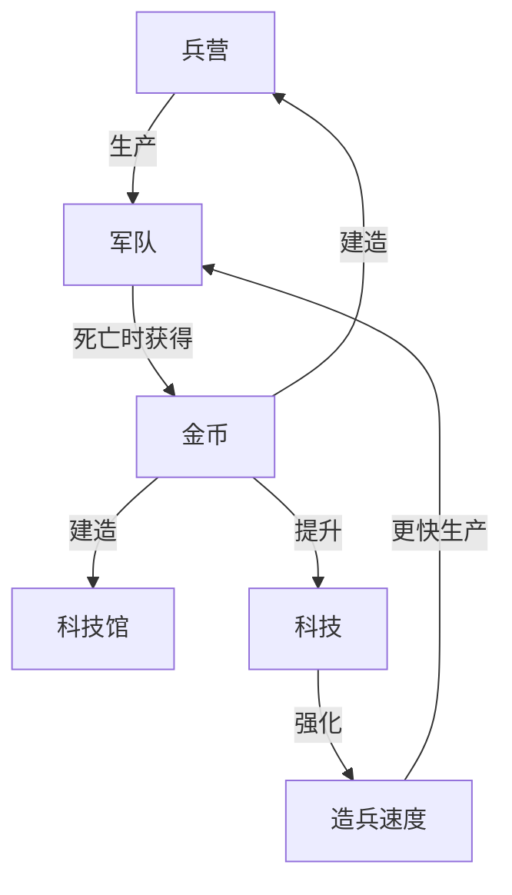

循环

# 机制
1. 玩家登场时拥有一个英雄和一个兵营，可以花费金币制造建筑
2. 兵营会每隔一段时间自动生产士兵，士兵会自动朝向敌人方向进攻
3. 杀死敌方士兵或者当自己的士兵死亡时会产生金币。击杀敌方士兵获得50%的金币，自己士兵死亡获得100%金币
4. 击败敌方英雄则胜利

# 建筑

| 名称  | 功能                     |
| --- | ---------------------- |
| 兵营  | 每隔5s生产一个士兵             |
| 防御塔 | 每隔1s攻击一次，消灭周围5范围内的一个敌人 |
| 英雄  | 拥有特殊的被动技能，当所有英雄死亡时游戏失败 |
| 科技  | 升级科技                   |

