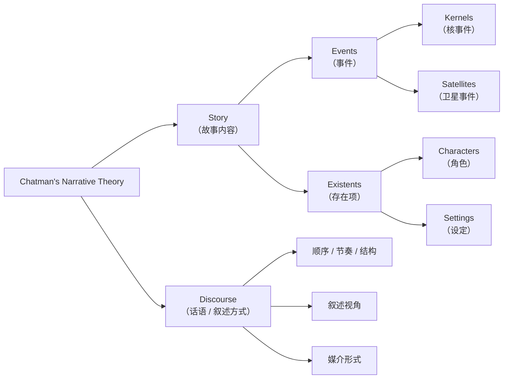

# Roland Barthes（罗兰巴特）

## 叙事代码理论（Five Narrative Codes）

这是巴特在他的经典著作《S/Z》中提出的五个“**代码（Codes）**”，用来解构文本叙事。他认为所有叙事文本都是由这五种代码交织构成的，就像织布一样。

- Hermeneutic Code（谜题代码 / 启示码）：
	- 当作家故意对读者隐瞒信息，使某个情节点得不到解释时，他们就在使用诠释代码。读者只能对这一事件做出自己的解释，或者质疑它在故事的后面如何被解决。
	- 激发读者/玩家的**好奇心与期待**
	- “他是谁？”、“这个城市为何被诅咒？”
- Proairetic Code（行动代码）
	- 情节是将事件排列成一个连贯而有意义的顺序。行动代码是由以前的事件引起的情节点，并导致其他行动。
	- 构建**紧张与进展**，一步步推动剧情发展
	- 玩家解锁门、战斗胜利、逃离区域等
- Semantic Code（语义代码）
	- 巴特认为，一些代码在文本中是“含义的闪光点”。这些符号不是简单地在表达层面上起作用，而是带有超出其基本定义的内涵，让读者对人物、环境和情节有更多的了解。
	- 詹姆斯·邦德穿着燕尾服，开着华丽的汽车，这暗示他的成熟。韦恩庄园是一座宏伟的豪宅，以暗示蝙蝠侠具有雄厚的财力支持，而彼得·帕克则住在一个简单的公寓里，显示了他卑微的背景。前往霍格沃茨的火车从9又3/4站台出发，意味着哈利·波特即将进入的魔法世界。
	- 赋予某些词、物、角色**额外意义**
	- 《塞尔达》中的“剑”象征勇气
- Symbolic Code（象征代码）
	- 构建**隐性的主题对立**、二元对立、深层结构
- Cultural Code（文化代码 / 引用码）
	- 美剧《生活大爆炸》充满了对科幻经典的引用，包括《星际迷航》和《星球大战》。例如，霍华德的床头有两把仿制的光剑，拉吉给他一个光剑皮带扣作为道歉。如果不了解这个情节背后的文化，它本身对观众来说很可能是无意义的。
	- 通过玩家已有的**文化知识**激发理解和共鸣
	- 《刺客信条》引用历史事件

# Henry Jenkins（亨利·詹金斯）

- 著名媒体学者，MIT教授
    
- 在2004年的文章《Game Design as Narrative Architecture》中提出：
    
    > 游戏叙事可以不是传统线性结构，而是“**空间叙事（Spatial Narratives）**”“**环境叙事（Environmental Storytelling）**”
    
- 他并未直接使用“Emergent Narrative”这一术语，但提出了“**narrative architecture**”作为基础。

# 西蒙 查特曼叙事学理论（Seymour Chatman）

这哥们认为在经典叙事学理论中 叙事文本由故事（story）和话语（discourse）两个部分构成，分别指涉叙事的内容和叙事表达的方式。

- Story指的是故事本身
- discourse指的是讲这个故事的方式。包括叙述视角、叙述顺序、媒介选择等。

# 茨维坦·托多洛夫（Tzvetan Todorov）

