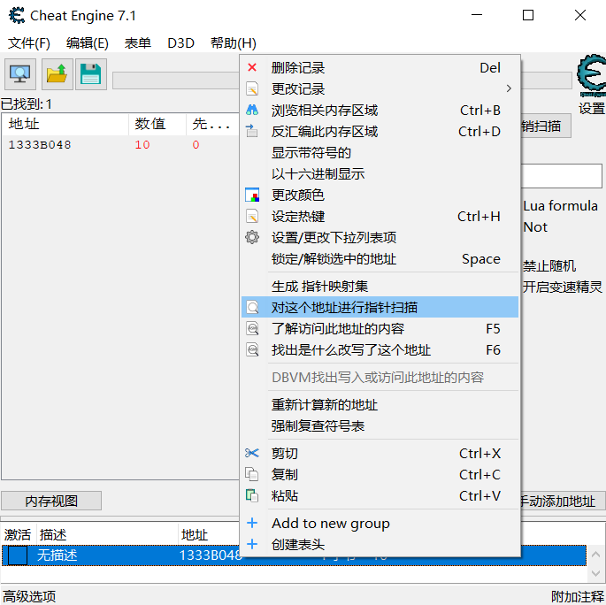
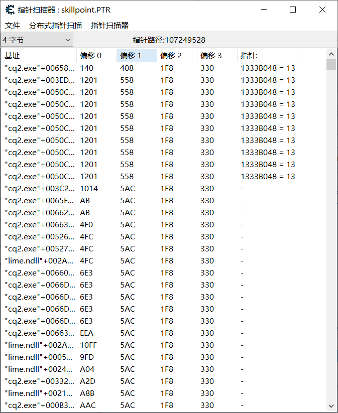
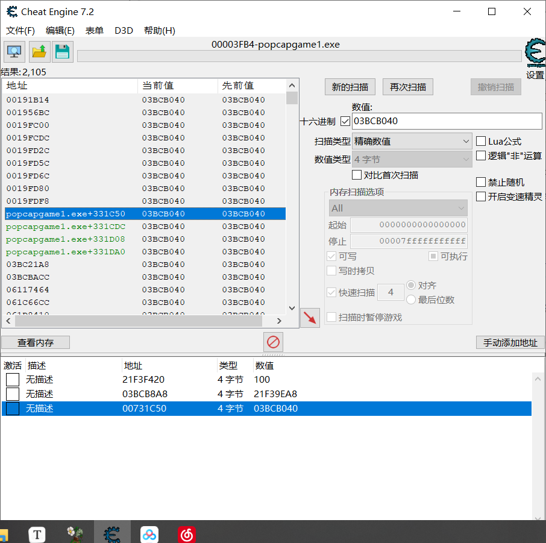

# 临时变量扫描

## 全部搜索

如果你并不确定地址的类型，可以选则全部搜索。

但是这个全部搜索并不是真的全部搜索，还需要额外设置一下，首先点编辑-设置-扫描设置，然后会出现下图

这个里面就是全部搜索的内容，可以看到实际上并没有点全，不过其实已经够用了。如果没搜到的话可以都点上试试。

## 地址的分组

扫描到的地址如果直接放到一堆，会显得非常非常乱，所以合理地归类整理地址是非常好的习惯。

# 查找基址

## 指针扫描法

本方法需要多次重开游戏，并且多次查找想要修改的值地址。适用于地址容易查找的情况。

1. 首先找到变量的本次的地址

   

2. 对这个地址进行指针扫描

   

3. 然后按照这个模式来搜索，**注意偏移量要大，最大级别要小**！如果没搜到指针的话，可以提高偏移量，但是尽量不要提高级别。

   

4. 接下来会弹出一个保存路径，注意！***路径必须是纯英文！！！！！***否则无法显示。

5. 扫描之后，就会出现这个结果图，可以看到有非常多的指针啊。

   

6. 然后就要想办法减少指针数量，点指针扫描器，然后点重新扫描。这时候就会有如下窗口。

   ​	方法1：是把游戏关掉再打开，再次扫描你所需的那个变量，找到之后把地址粘过来搜索。这样子虽然那个变量的内存变了，但是基址不会变，可以比较精确扫描到基地址。虽然很麻烦，之前的变量还得重新搜索，但是，真的很有效果。

   ​	方法2：是直接在游戏中修改你那个变量的数值，然后点要查找的数值，直接扫描。但是精确度比较低。

   

   

7. 然后又会让你保存结果，建议不要覆盖原来的，这样没搜到的话还可以接着上一次的搜。

8. 如果一直搜不到的话，返回第一步，重新搜索，提高偏移量什么的。

9. 一般来说搜到几百个就可以了，基本上就可以用了。使用方法就是随便找个地址双击就行了。

## 手动找基址法

本方法不需要重开游戏，也不需要多次查询地址。但是难度较高。

1. 首先找到想要修改的值的地址。

2. 右键，点击“找出是什么改写了这个地址”或者F6。

3. 在游戏中使这个变量变化。此时有一个就会有一个指令出现。

   

4. 然后双击这个指令，会进入详细信息页面。这个红字括号里面那个5578就是指针的**一级偏移**了。接下来我们去寻找二级偏移，

   对着这个页面右击复制

   

5. 接下来在CE中搜索这个地址，别忘了点十六进制。搜索到了之后，开头都是00XXX之类的东西，我们只需要找到0X开头的就可以了，只需要一个就行，只要是一个0开头的随便找一个就可以。

   

6. 对着这个地址右键，选择“找出什么访问了这个地址”。

   

7. 注意！点完之后需要离开按ESC键，因为这个数据非常多，有可能会死机。

   

8. 接下来在出现的数据里面随便找一个双击进去。此时可以看到，这个数据页面和刚开始的是一样的，说明已经找到了二级偏移了，也就是868。

   

9. 之后再次搜索这个地址，还有别忘了点16进制。这个游戏是植物大战僵尸，基址偏移的数量比较少，可以看到已经出现了绿色的地址了，这个绿色的地址就是基址了。点下来，可以看到这个基址就是00731C50

10. 点击手动添加地址，点击指针选项，按照需要增减偏移。在最下面填写基址，上面按顺序填写偏移值，最后点确定。

    

11. 去游戏里面修改这个值，看看是否成功。

# 汇编代码注入

# 修改器导出

1. 点击文件，然后点击导数第二个，从表单生成，，，

2. 在页面左下角点击添加热键

3. 编辑热键，首先输入热键，然后选择按下后的操作，比如说锁定数值，或者增加减少什么的，剩下的可以不写，但是建议还是写上，最后点应用。

   

4. 编辑主页面，标题就是标题，关于一般就写版权和作者信息什么的。然后可以设置一下声音和图标什么的。

   

5. 点击生成修改器，然后选择文件夹储存，注意，储存的名字不能和你要修改的游戏名字一样，比如说我这个修改的游戏叫cq2，那么我修改器就不能叫cq2。注意一定不要写中文！

6. 然后来到修改器制作页面，主要是要修改32位还是64位，这个其实可以打开任务管理器，直接在里面就能看到游戏的位数，然后填进来就行了。其他的暂时不用管，直接点制作。

# 附录

## 常用寄存器

4个数据寄存器（EAX、EBX、ECX和EDX）

eax  累加和结果寄存器

ebx  数据指针寄存器

ecx  循环计数器

edx  i/o指针

esi  源地址寄存器

edi  目的地址寄存器

esp  堆栈指针

ebp  栈指针寄存器

