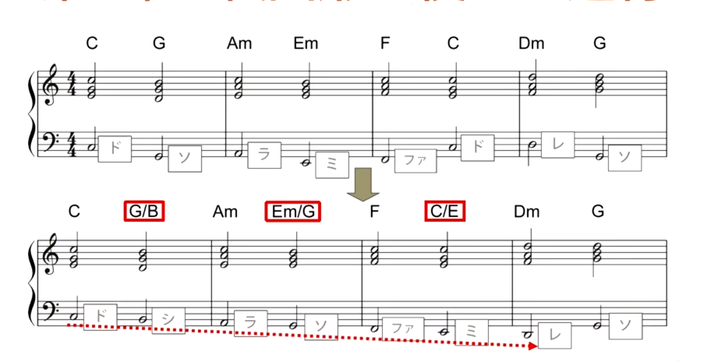
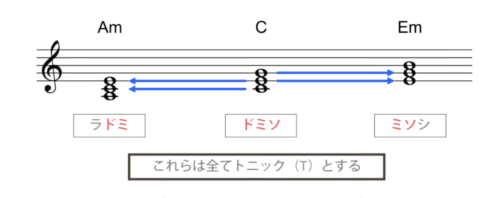
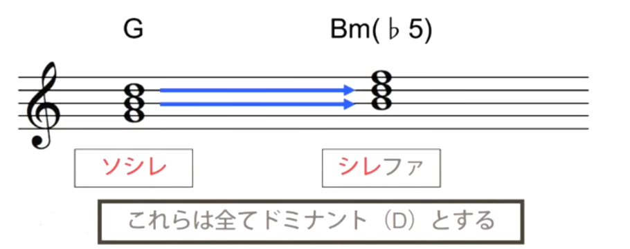

コード理論とは

- 和音の成り立ちや仕組み、機能などを纏めたもと

# 音名

do re mi fa so ra si

上の呼び方はイタリア式音名

|                    | 様々な音名           |
| ------------------ | -------------------- |
| イタリア式（唱名） | do re mi fa so ra si |
| 日本式             | ハニホヘトイロ       |
| 米（音名）         | CDEFGAB              |

# 音程

音と音との距離を表す言葉

全音、半音

# インターバル

全全半全全全半

# 音阶（scale）

natural minor scale  367

全半全全半全全

长调ちょうちょう（大调）

短调たんちょう

# 平行調（へいこうちょう）

关系大小调

关系大小调共享一组音阶，因此在作曲时可以直接过渡改变曲子的氛围

同主调

而同主调的因为本身换了调式

# 三和弦

调内和弦/顺阶和弦（Diatonic Chord）

指的是自然大小调体系下的调内和弦，也即自然大调或小调一级到七级，总共七个和弦。

|      |        | 解释      |
| ---- | ------ | --------- |
| 135  | C      | C大三和弦 |
| 246  | Dm     | D小三和弦 |
| 357  | Em     | E小三和弦 |
| 461  | F      | F大三和弦 |
| 572  | G      | G大三和弦 |
| 613  | Am     | A小三和弦 |
| 724  | Bm(♭5) | B减三和弦 |
|      |        |           |
|      |        |           |

而  Bm(♭5)比较特殊，因为其根音到3音是小三度，而3音到5音同样是小三度。因此其5音比通常的三和弦低半度，所以要标记(♭5)。

# （4和音）七和弦

根音、三音、五音、七音

七和弦不会改变底层三和弦的构成。

与三和弦一样，七和弦的判断核心是看7音。

△代表major，也就是大和弦。

具体是用△7还是直接加7，需要根据根音和7音的音程判断。

如果根音和7音是10半音则加7，如果是11半音则加maj7。但是三和弦都是纯五度（除了个别的），也就是说，在5音的基础上，如果加一个小三度，那么就是7，如果加一个大三度，那么就是△7。

|      |         |           |
| ---- | ------- | --------- |
| 1357 | C△7     | C大七和弦 |
| 2461 | Dm7     | D小七和弦 |
| 3572 | Em7     | E小七和弦 |
| 4613 | F△7     |           |
| 5724 | G7      | 属七和弦  |
| 6135 | Am7     |           |
| 7246 | Bm7(♭5) |           |

 注意上表，实际上属于7和弦的符号只有7，△7。Dm什么的都是三和弦的符号。

因此如果三和弦是小三和弦，而在其7音上又是一个大三度的话，就会出现Cm△7，C小大七和弦。读法直接依次读符号即可。1 ♭3 5 7

# 和弦行进

# 和弦转位（転回形）

| 和弦          | 标记 | 音符 |
| ------------- | ---- | ---- |
| C和弦         | C    | 135  |
| C和弦第一转位 | C/E  | 351  |
| C和弦第二转位 | C/G  | 513  |

和弦是谁的就用谁的符号，/之后来标注转位之后的根音

在和弦转位的时候，根音会转位到上方，因此如果不想其转位，可以用左手演奏根音。此时就不算转位。

# 和弦转位的行进

在卡农的和弦中，如果不使用转位和弦，那么和弦的跳跃就会很严重。通过使用了G/B转位，Em/G转位等将上方最低音变成了下行的。减少了跳跃感。

# 主和弦（Tonic）

Tonic来源于Tone，代表了整个音阶

属和弦（Dominant），来源于Domimi，是主宰的意思。

下属和弦（Subdominant）

终止式（cadence）

 

IV——I的和声进行所构成的结束终止，叫做**变格终止**

V——IV——I的和声进行所构成的结束终止，叫做**复式变格终止**

**正格终止式**：V——I

T：主和弦

D：属和弦

SD：下属和弦

SD——D——T 

TDT

351  247 351

# 代理和弦

主和弦组

Tonic和弦，包括了C，Am和Em，因为其中两个音都是一样的

要注意Em也有两个音和G是一样的，也具有属功能的作用

属和弦组D

Dm和F为下属和弦组SD

除了三个主要的和弦之外，其余功能和弦被称为代理和弦。

同样的TDT的正格终止式

使用135 247  135

和135 247 361，氛围会完全不同

# 属和弦的强进行

低音上行纯四度，或者下行纯五度就叫做强进行

 有一种说法是，因为在泛音列中，115，1和5是一个纯五度，因此在演奏G的时候会和C特别协和，在G上行纯四度下行纯五度都会得到C，所以被称为强进行。

# 三全音（Tritone）

增四度（减五度），也被称为，六半音

而属7和弦（Dominant 7th），就包含了三全音（5724）

否定神学：只能否认X不是神，不能直接肯定的描述神

肯定神学：上帝的本体论

