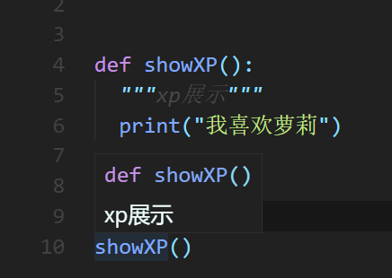

# 基础

## 历史

> 人生苦短，我用Python 
>
> Life is short , you need Python

Python的创始人为吉多·范罗苏姆(Guido van Rossum)

1. 1989年的圣诞节期间，吉多·范罗苏姆为了在阿姆斯特丹打发时间，决心开发一个新的解释程序，作为ABC语言的一种继承
2. ABC是由吉多参加设计的一种教学语言，就吉多本人看来，ABC这种语言非常优美和强大，是专门为非专业程序员设计的。但是ABC语言并没有成功，究其原因，吉多认为是非开放造成的。吉多决心在Python中避免这一错误，并获取了非常好的效果
3. 之所以选中Python(蟒蛇)作为程序的名字，是因为他是BBC电视剧--蒙提·派森的飞行马戏团
   (Monty Python's Flying Circus)的爱好者
4. 1991年，第一个Python解释器诞生，它是用c语言实现的，并能够调用C语言的库文件

## Python的运行

Python是一种解释型语言，是依靠解释器运行的。

Python源代码都是`.py`文件，在终端直接输入`python xxx.py`就可以调用python的解释器。Python运行的时候，首先CPU会把解释器加入内存，然后由解释器进行解释执行。

## 注释

```python
#python用井号当单行注释
```

```python
"""
多行注释用三个单引号或者双引号开启
"""
```


TODO注释

```python
# TODO 表示正在开发的代码，仍需完成
```


## 关键字

下面的代码可以查看关键字列表

```python
import keyword
print(keyword.kwlist)
```


## 基础语法

- 没有分号
- python是弱类型语言，不用声明变量类型
- 严格要求回车与空格
- 不提供num与string的自动类型转换，不会自己把num和string解包装包。

## 基础结构

```python
print("hello world")
myName=input("请输入你的名字")
print("hello!"+myName)
```

# 安装第三方库

直接在终端输入即可

flake8会检查编写代码时的不规范的地方和语法错误。

```shell
pip install flake8
```

yapf是一个代码格式化工具，可以一键美化代码。

```
pip install yapf
```


之后按`alt+shift+f`可以快速格式化。

# 数据类型

在Python中，不需要指定数据类型，但是实际上是有的

## 变量的类型

数值型

- int
- float
- bool：TRUE，FALSE
- complex

非数值型

- 字符串
- 列表
- 元组
- 字典


可以使用type()函数来查看数据类型

```python
asuna={"name":"asuna","age":18}
print(type(asuna))
# <class 'dict'>
```

## 类型转换

数值型的变量可以互相直接运算，这时候就会进行隐式转换。

### 显示转换

| 函数名  | 功能                      | 例子        |
| ------- | ------------------------- | ----------- |
| str()   | 转换为string类型          | str(0721)   |
| int()   | 转换为int类型，会数据丢失 | int("0721") |
| float() | 转换为float类型           | float(0721) |

## 全局变量

用 global修饰的变量会变成全局变量 

## None值

python用None表示null，判空时，用`is None`来表示。

# 运算符

## 算术运算

| 运算符 | 描述 | 例子 |
| ------ | ---- | ---- |
| +      | 加 |      |
| + | 字符串拼接 | "hello"+"world" |
| + | 元组和列表拼接 | [1,2]+[2,3] |
| -      | 减 |      |
| *      | 数值乘 | 2*3==6 |
| * | 字符串乘 | "你好"*10 |
| /      | 除 | 3/2==1.5 |
| //     | 取整除 | 3//2==1 |
| %      | 余 | 3%2==1 |
| **      | 幂 | 2**3==8 |
| in | 判断元素是否存在 |  |

## 逻辑运算
| 运算符 | 描述 |
| ------ | ---- |
| and    | 与   |
| or     | 或   |
| not    | 非   |


# 流程控制

## if语句

```python
gender='男'
if gender=='男':
  print("大叔")
elif gender=='女':
  print("萝莉")
else:
  print("性别有问题")
```


## while语句

continue用于中断此次循环，返回开头。**每个while循环和for循环的结尾会隐式加上continue，以便再次执行。**

例：打印除了6以外其他的数

```python
num=0
while num!=10:
  if num==6:
    num=num+1
    continue
  print(num)
  num=num+1
```

break用于中断整个循环

例：打印6以前的数

```python
num=0
while num!=10:
  if num==6:
    break
  print(num)
  num=num+1
```


## for循环


for后面也能跟else

```python
for xxx in xxx:
  #代码
else
	#for执行完之后会执行else的代码，如果for是通过break完成的，那么不会执行
```


# 函数

## 定义与执行

```python
def add(a,b):
  return a+b
c=add(2,5)
print(c)
```

如果没有返回值，编译器会默认在结尾加上`return None`

## 占位符

如果想定义一个空函数可以这样子

```python
def fun():
  pass
```

## 函数内修改全局变量

函数内不允许直接对全局变量的值进行修改，如果真的这么写了，实际上会在函数内重新定义一个同名局部变量。

```python
a=10
def fun():
  a=100#！！！！不行
fun()
print(a)
#10
```


## 函数的文档注释

函数的注释应该写在函数名的下一行，这种注释就叫文档注释，一般的IDE都可以识别。

```python
def showXP():
  """xp展示"""
  print("我喜欢萝莉")
```



## 多值参数

如果函数的参数不确定就可以使用多值参数。在其他语言里面也有这个，java里面就叫可变长形参。直接用`...`来表示。在python里面语法很不一样。

- `*args`：存放元组参数
- `**kwargs`：存放字典参数

```python
def test(*arg, **kwargs):
    print(arg)
    print(kwargs)


arg = (1, 2, 3, 4, 5)
kwargs = {"name": "null", "age": 12}

test(1, 2, 3, 4, 5, name="null", age=12)
#(1, 2, 3, 4, 5)
#{'name': 'null', 'age': 12}
```


## 参数拆包

如果把元组变量和字典变量同时传过去，那么元组会把所有值都接收。

```python
def test(*arg,**kwargs):
  print(arg)
  print(kwargs)

arg=(1,2,3,4,5)
kwargs={"name":"null","age":12}

test(arg,kwargs)
#((1, 2, 3, 4, 5), {'name': 'null', 'age': 12})
#{}
```

遇到这种情况，就需要把参数拆包。使用在实参中传入*就可以了。

```python
def test(*arg,**kwargs):
  print(arg)
  print(kwargs)

arg=(1,2,3,4,5)
kwargs={"name":"null","age":12}

test(*arg,**kwargs)
```


# 格式输出

## 格式字符串

可以用转义字符来作为输出变量。

```python
name = "小羽"
print("我叫%s" %name)
# 我叫小羽
```

如果有多个变量，可以用括号控制输出。

```python
name = "小羽"
age = 18
print("我叫%s，今年%d岁" % (name, age))
# 我叫小羽，今年18岁
```


| 转义字符 | 含义                   |
| -------- | ---------------------- |
| %s       | 字符串 |
| %d       | 整数 |
| %f | 浮点 | |


## 输出长度

```python
name = "小羽"
print("我叫%6s" %name)
# 我叫    小羽
```

`%6s`就代表空余6位。

同时，如果在%前面写上0，可以默认用0来填补空位，而且似乎只能写0，其余的我试过，好像不行。

```python
print("我叫%s，今年%06d岁" % (name, age))
# 我叫小羽，今年000018岁
```

## 保留小数点后n位

在f前面加点数字就行了

```python
height = 175.345678
print("我叫今年%.2f岁" % height)
# 我叫今年175.35岁
```

## 不换行打印

用end关键字来指定下一行不换行

```python
print("hello ",end="")
print("world")
```

## 多值打印的分隔符

如果print传入多个参数，那么会默认用空格作为分隔符

```python
print("hello","world")
#hello world
```

用sep可以修改分隔符

```python
print("hello","world",sep=",")
#hello,world
```

## pprint模块

pprint模块自带很棒的格式输出。

```python
import pprint
num = {2,3,5,1,5,6,8,1,7,8,2,3,6}
pprint.pprint(num)
#{1, 2, 3, 5, 6, 7, 8}
```

可以看到它会对字典自动排序和去重

# 列表

就是数组

## 负数下标

python允许下标为负数，此时循环到末尾

```python
a=[1,2,3,4,5,6,7]
print(a[-1])
```

打印7

## 数组切片

python提供了切割数组的功能。中间用冒号连接，表示一个左闭右开区间。

```python
a=[1,2,3,4,5,6,7]
print(a[1:2])
#答案
#[2]
```

表示从下标1开始，打印到下标2之前。

## 列表长度

用len()函数也可以展示数组长度

```python
a=[1,2,3]
print(len(a))
```


## 列表的连接与复制

直接用运算符就可以了，无敌。

```python
a=[1,2,3]
b=[4,5,6]+a
c=a*3
print(b)
print(c)
#答案
#[4, 5, 6, 1, 2, 3]
#[1, 2, 3, 1, 2, 3, 1, 2, 3]
```

## 删除元素

用del语句

```python
a=[1,2,3]
del a[1]
print(a)
#[1,3]
```

## in与not in

用in与not in运算符可以判断一个数是否在数组中。

```python
a=[1,2,3]
print(2 in a)
print(4 not in a)
#答案
#True
#True
```

## 多重赋值

python允许用数组多重赋值。跟JavaScript的数组解构一模一样，果然天下语言都差不多。

```python
asuna=["亚丝娜","172"]
name,height=asuna
print(name+"身高为"+height)
#结果
#亚丝娜身高为172
```


## 列表常用方法

| 方法                | 功能                             |
| ------------------- | -------------------------------- |
| .index(data)        | 返回data所在的下标，没有则会异常 |
| .append(data)       | 在数组末尾添加元素               |
| .insert(index,data) | 指定位置添加元素                 |
| .remove(data)       | 删除data元素，返回值为data       |
| .sort()             | 排序                             |
| .reverse()          | 转置数组                         |
| .count(data)        | 统计data在列表中出现的次数       |

# 元组

就是元素不可变的数组

## 定义与使用

元组和列表的区别如下：

1. 元组是不可变的。
2. 用圆括号来定义。

```python
asuna=("亚丝娜","172")
asuna[0]=1
#会报错，因为元组的值不能被修改
```


## 单元素的元组

如果直接定义一个元素的元组，那么解释器会直接把这个元素赋值过来

```python
a = (1)
print(type(a))
# <class 'int'>
```

如果想要定义真正的单元素元组，那么就需要给后面加一个逗号。

```python
a = (1,)
print(type(a))
# <class 'tuple'>
```


## 与列表的相互转换

1. 元组转列表，使用list()方法

```python
asuna=("亚丝娜","172")
print(list(asuna))
```

2. 列表转元组，使用tuple()方法

```python
asuna=["亚丝娜","172"]
print(tuple(asuna))
```


## 格式字符串和元组

还记得那个格式字符串吗？后面不是也有一个括号嘛，实际上那个就是一个元组。

```python
loli=("小羽",18)
print("我叫%s，今年%d岁" % loli)
```


## 元组常用方法

| 方法         | 描述                             |
| ------------ | -------------------------------- |
| .index(data) | 返回data所在的下标，没有则会异常 |
| .count(data) | 统计data在列表中出现的次数       |
|              |                                  |


# 字典

就是对象，和JavaScript的对象一模一样，

## 定义与使用

键值对的字面量来定义字典。字典的无序的，不能用a[0]，这种方式访问，只能用键名直接访问。

```python
asuna={"name":"asuna","age":18}
print(asuna["name"])
```

## 增删改查

赋值语句可以完成增加和修改的功能，如果key不存在会新增键值对，如果存在会覆盖之前的。

```python
asuna={"name":"asuna","age":18}
asuna["name"]="yui"
asuna["height"]=176
print(asuna)
# {'name': 'yui', 'age': 18, 'height': 176}
```


删除可以使用pop方法

```python
asuna={"name":"asuna","age":18}
asuna.pop("name")
print(asuna)
# {'age': 18}
```


## 遍历字典的三个方法

1. 遍历键

其中这个.keys()可以省略，默认就是遍历建

```python
asuna={"name":"asuna","age":18}
for item in asuna.keys():
  print(item)
#name
#age
```

2. 遍历值

```python
asuna={"name":"asuna","age":18}
for item in asuna.values():
  print(item)
#asuna
#18
```

3. 遍历键值对

```python
asuna={"name":"asuna","age":18}
for item in asuna.items():
  print(item)
#('name', 'asuna')
#('age', 18)
```

## get()方法

访问字典中不存在的数据会报错。但是python提供了get()方法，可以允许你自定义，当访问的键不存在时，返回什么值。很像MySQL里面那个IFNULL `SELECT IFNULL(loli_name,0)  FROM lolis;`，也是保护数据的。防止查询到非法数据。

```python
asuna={"名字":"亚丝娜","年龄":18}
print(asuna.get("名字","桐人"))
print(asuna.get("胸围","A"))
#亚丝娜
#A
```

这里面就是说，如果找到了名字的键就打印asuna的值，没有就打印桐人。同样的，如果找到了胸围的键就打印，否则就返回A。

## setdefault()方法

这个方法可以在字典中添加新的键值对。`setdefault(键,值)`。如果所添加的键在原字典中没有，那么就会增加。如果已经存在，那么不变。

```python
asuna={"名字":"亚丝娜","年龄":18}
asuna.setdefault("胸围","B")
asuna.setdefault("胸围","C")
print(asuna)
#{'名字': '亚丝娜', '年龄': 18, '胸围': 'B'}
```

## 字典常用方法

| 方法            | 功能                                       |
| --------------- | ------------------------------------------ |
| len(字典)       | 字典键值对数量                             |
| .updata(新字典) | 合并两个字典，但是新字典会覆盖相同的键值对 |
| .clear()        | 清空字典                                   |


# 字符串

## 原始字符串

如果想在字符串里面使用反斜线一般都是使用转义字符，但是在python里面也可以使用原始字符串，它会保留这些特殊的语法。

在字符串引号前面加上r就可以变成原始字符串了。

```python
str=r"\1\23\\\3"
print(str)
#\1\23\\\3
```

## 多行字符串

用于打印多行字符串，编译器会保留回车,引号等特殊字符。用三个单引号或者双引号开启。顺带一提，markdown的代码块也是用三个单引号开启的。

```python
str='''
#include<iostream>
using namespace std;
int main()
{
  cout<<"hello world!";
  return 0;
}
'''
print(str)
```

一般也用于多行注释。

## 字符串拼接

用加法运算符可以直接拼接

```python
print("hello"+"world")
```

用乘法运算符可以多次拼接

```python
print("hello "*3)
```

## 字符串切片

对于一个字符串可以用`[起始位置:末尾位置:步长]`的语法进行切片，注意切片时[1,2]切出来的是左闭右开区间，2是切不到的。如果末尾位置不写，默认切到最后；如果开头不写，默认从0开始。

- 从1开始切，切到4

```python
str = "0123456789"
print(str[1:5])
#1234
```

- 切末尾两个字符

```python
str = "0123456789"
print(str[-2:])
#89
```

- 切奇数

```python
str = "0123456789"
print(str[1::2])
#13579
```

- 字符串逆序

```python
str = "0123456789"
print(str[-1::-1])
#9876543210
```


## 字符串的方法

### 判断数字的三种方法

string有三个判断数字的方法，

- `.isdecimal()`：可以用来判断普通数字
- `.isdigit()`：可以判断普通数字和unicode
- `.isnumeric()`：可以判断普通数字和unicon和中文数字

从上到下，范围越来越大

### 字符串的查找与替换

- `.startswith("")`：以某字符串开始
- `.endwith("")`：以某字符串开始
- `.find("")`：查找子串在原字符串中的索引位置，如果子串不存在，返回-1
- `.index("")`：跟find方法一样，但是如果子串不存在会报错
- `.replace("把这个","替换为这个")`：注意！这个**会生成一个新的字符串**，不会修改原来的字符串。

### 文本对齐

第二个参数默认为英文空格，可以不填。

- `.ljust(宽度,填充字符)`：向左对齐
- `.ljust(宽度,填充字符)`：向右对齐
- `.center(宽度,填充字符)`：居中对齐

### 删除空白字符

- `.strip()`：去除左右两侧的空白字符
- `.lstrip()`：去除左边的空白
- `.rstrip()`：去除右边的空白字符

### 切割与拼接

- `.split("str")`：split可以把字符串按照某个标志来划分成一个列表，如果不填，默认是空格
- `.join()`：可以把列表按照指定的字符串来拼接


```python
str = "12345 56789"
strList =  str.split()#把字符串按照空格划分
print(strList)

joinStr=" ".join(strList)#用空格拼接列表
print(joinStr)

#['12345', '56789']
#12345 56789
```


### 常用方法

| 方法         | 描述                     |
| ------------ | ------------------------ |
| len(字符串)  | 字符串长度               |
| .count(子串) | 统计字串出现的次数       |
|              | 返回子串出现的位置       |
| .isspace()   | 判断字符串是否只包含空格 |
|              |                          |


# 面向对象

## 封装

### 类和对象

用class来定义类，直接用类+括号来创建对象。

```python
class Loli:
  def show(self):
    print("我是可爱的Loli")


小丛雨 = Loli()
小丛雨.show()
```

**注意：类名要使用大驼峰来命名！**

### 直接增加属性

在类外部，可以直接给对象增加属性，跟JavaScript一模一样。

```python
小丛雨.name="小丛雨"
```


### 构造函数

python中的构造函数是`__init(self)_`，用来为对象添加属性。

```python
class Loli:
  def __init__(self,name):
    self.name=name

  def show(self):
    print("我是可爱的Loli")

小丛雨=Loli("小丛雨")
```

### \__str__

可以自定义打印对象的内容，就跟java中重载toString一样。

```python
class Loli:
  def __init__(self,name):
    self.name=name

  def show(self):
    print("我是可爱的Loli")

  def __str__(self):
    return self.name

小丛雨=Loli("小丛雨")

print(小丛雨)
#小丛雨
```

### 访问级别

在属性前面加两个下划线就是私有属性或方法。**子类和外界不能访问本类私有属性。**

```python
class Loli:
  def __init__(self,name):
    self.name=name
    self.__age=500
```


但是在python中，实际上没有真正意义上的私有，如果非要访问的话可以用`_类名__属性或方法名`来强行访问。

```python
class Loli:
  def __init__(self,name):
    self.name=name
    self.__age=500
  
小丛雨=Loli("小丛雨")
print(小丛雨._Loli__age)
#500
```

## 继承

### 单继承

python中用小括号来表示继承的父类

```python
class Human:
  def __init__(self):
    pass

class Loli(Human):
  def __init__(self,name):
    self.name=name
    self.__age=500
```

### super()

super在python中是一个特殊的类，super()就是一个特殊的对象。super()的作用就是来调用父类的方法。就跟c#和java一样。


```python
class Human:
  def __init__(self):
    pass
  def show(self):
    print("你好！")

class Loli(Human):
  def __init__(self,name):
    self.name=name
    self.__age=500
  def show(self):
    super().show()#重点
    print("我叫%s!" % self.name)
  
小丛雨=Loli("小丛雨")
小丛雨.show()
#你好！
#我叫小丛雨!
```

在本代码中，Loli类的show调用了父类的show方法，然后再执行自己的，相当于对父类方法的拓展。


在早期版本中，也可以用类名加self来调用。

```python
def show(self):
  Human.show(self)
  print("我叫%s!" % self.name)
```

### 多继承

很离谱，没想到python居然支持多继承

```python
class Human:
  pass

class Animal:
  pass

class Loli(Human,Animal):
  def __init__(self,name):
    self.name=name
```


多继承使用起来有很多问题

- 两个父类之间不能拥有同名的属性或方法。如果真的这么写了，那么会按照继承顺序覆盖掉另一个类的。
- 对象调用方法的时候首先会查找本类的方法，然后按照(Human,Animal)的顺序从左向右查找，最后访问object类。


### 新式类与旧式类

object是Python中的基类，但是在Python2以前，类并不是继承object类的，所以叫**旧式类**。Python3以后的类都会默认继承object类，这种就是**新式类**。

所以说以后写代码的时候最好显示指定一下父类`A(object)`

## 类对象

在python中，万物皆是对象，类也是一个对象，被称作类对象。类生成的对象叫做实例对象。类对象在内存中只有一个，而实例对象可以有很多个。

### 类属性

在其他语言里面就是类的静态属性，不过python好像没有静态属性。

```python
class Loli:
    count = 0 #类属性，用来计数萝莉的数量

    def __init__(self, name):
        self.name = name
        Loli.count+=1

```

使用的时候直接类名点就行了。


注意对象名点也可以访问类属性，虽然是废话但是在python中还是要特别强调一下的。如果直接通过对象修改类属性，实际上不会生效，这就是JavaScript中的隐式屏蔽一样，在JavaScript中，直接通过实例对象修改显示原型的属性的话，实际上会在实例对象里面新建一个属性。python也是如此。

```python
class Loli:
    count = 0

    def __init__(self, name):
        self.name = name
        Loli.count+=1


小丛雨 = Loli("小丛雨")
小丛雨.count=99 #这里把count修改为99，但是实际上Loli.count并没有被修改


八六 = Loli("86")
print(八六.count)#实际上类的count还是2
#2   
```

可以看到，虽然把小丛雨的count修改为99，但是实际上Loli.count并没有被修改，因为这句代码实际上会为小丛雨复制一个count属性，等于说修改的实际上是自己的属性，而不受修改的类的。**如果想修改类属性，必须通过类名修改！**

### 类方法

在python中，**类方法可以访问类属性**。定义类方法需要用`classmethod`来修饰，而且里面的参数必须有`cls`。cls是一个类指针，指向调用的类对象。

```python
@classmethod
def 方法名(cls):
	pass
```

### 静态方法

这个要和类方法区分，**静态方法不能访问类属性**。如果你的方法只有输出什么的，可以使用静态方法。

```python
@staticmethod
def show(cls):
	print("我是Loli")
```

调用也是一样的，直接用类名调用就行。


## 重写new方法

`__new__`是object类提供的一个静态方法，可以手动分配内存空间。**在创建对象的时候，new方法会自动被调用！**

重写new方法的格式非常固定：

- 参数必须为`(cls,*args,**kwargs)`。
- 代码必须return`super().__new__(cls)`，否则，python就拿不到申请到的内存地址，也就无法进行初始化等后续工作。

```python
class girlFirend:
  def __new__(cls,*args,**kwargs):
    print("new方法")
    return super().__new__(cls)

  def __init__(self):
    print("初始化")

kangNa=girlFirend()
#new方法
#初始化
```


## 可迭代


```python
  

# class Player:

  

#     # #静态成员和方法

#     # player_list = []

  

#     @staticmethod

#     def AddPlayer(qq,money):

#         Player.player_list.append(Player(qq,money))

  
  

#     # #保存玩家存档

#     # @staticmethod

#     # async def Save():

#     #     temp_dict = []

#     #     for player in Player.player_list:

#     #         print("保存数据"+str(player.qq))

#     #         temp_dict.append( dict(player) )  #将python对象转为字典

  

#     #     #将字典转为json

#     #     with open("./src/plugins/元宇宙模拟器/player_save.json", "w") as json_file:

#     #        json.dump(temp_dict, json_file)  #第一个传入需要转化为json的字典数据，第二个需要保存的文件

  

#     # #读取玩家存档

#     # @staticmethod

#     # async def Load():

#     #     with open("./src/plugins/元宇宙模拟器/player_save.json", "r") as save_data:

#     #         data_list =json.load(save_data)

#     #     for data in data_list:

#     #         print("读取数据"+str(data["qq"]))

#     #         Player.AddPlayer(data["qq"])

#     #     # await metaverse.send(Message("读取成功"))

  

#     #更新玩家存档，先保存，再读取

#     # @staticmethod

#     # async def Update():

#     #     await Player.Save()

#     #     await Player.Load()

  

#     #确保对象可以迭代

#     def keys(self):

#         return ('qq', 'money' )

  

#     def __getitem__(self, item):

#         return getattr(self, item)
```

# 异常

## 单个异常

```python
try:
  pass
except expression:
  pass
```

## 多个异常

```python
try:
  pass
except expression:
  pass
except expression2:
  pass
```

## 捕获所有异常

```python
try:
  pass
except Exception as result:
  pass
```

## else和final

```python
try:
  pass
except:
  pass
else:# 如果没有异常，执行这个
  pass
finally:# 无论有没有异常都会执行这个
  pass
```

## 抛出异常

```python
raise Exception("描述")
```


# 单例模式


## 思路

- 一个类只有一个对象，也就是说内存只分配一次
- 虽然不再分配内存，但是构造函数还是会运行，可以借此来修改对象的属性

```python
class girlFirend:
    address = None

    def __new__(cls, *args, **kwargs):
        """如果单例对象已经存在，那么就不再新分配内存了"""
        if girlFirend.address is None:
          girlFirend.address = super().__new__(cls)
        return girlFirend.address

    def __init__(self,name):#构造函数来修改新对象的属性
        self.name=name
    
    def show(self):
      print(self.name,"内存地址为",girlFirend.address)


kangNa = girlFirend("康娜")
kangNa.show()

congYu = girlFirend("丛雨")
congYu.show()

```


# 模块化

## import

Python中，每个`.py`文件就是一个模块，模块的内容都可以通过`import`来导入。

```python
#module.py
message = "hello world"


#test.py
import module
print(module.message)
```

可以看到，文件直接导入就可以，里面的东西可以直接通过点运算符来使用。


**注意！：在python中，模块名也是标识符。也就是说，python文件必须以字母或者下划线开头，遵循变量命名规范。**

## 起别名

用`as`可以起别名，就跟MySQL一样，经典语法了。注意，模块的命名应该遵守大驼峰命名法。

```python
import xxx as MyMoudle
```

## from import

可以从某个模块导入部分内容，而不用全部导入

```python
from 某某模块 import 某某方法或属性
#导入后可以直接使用，不需要再点
某某方法() 
```

**注意！如果导入一样的方法，会直接覆盖上面的。**

```python
from 某某模块1 import 某某方法1
from 某某模块2 import 某某方法1
#因为python是解释执行，所以会直接覆盖上面的
```

为了避免这种情况，可以使用起别名的方法来解决。

```python
from 某某模块1 import 某某方法1 as 某某方法2
from 某某模块2 import 某某方法1
#这次就好了
```

## 模块的访问顺序

1. 首先会去import指定的路径查找
2. 如果没有，就会去系统目录查找

**注意！：在开发时，给文件起名，不要和系统的模块文件重名**。否则你的文件就会覆盖掉系统文件，导致一些难以发觉的bug。

## 没有缩进的代码

在python中，导入模块时没有缩进的代码会自动执行。也就是说顶头写的代码会自动被执行。但是这就很不爽了，我在我的代码里面辛辛苦苦写了很多的测试代码，我不想删，而你调用我模块的时候又会运行这些测试代码，你也不想看到这些。怎么办呢？

为了避免这种隐患，python提供了一个`__name__`属性。在执行本文件的时候，它的值固定为`__main__`；但是在作为模块调用时，它的值就为模块名。所以我们可以使用这个特点来避免执行测试代码。

```python
if __name__ == "__main__"
	pass
```


# 常用功能

## 强行结束程序

```python
import sys
while True:
  print(123)
  sys.exit()
```

## 随机数

```python
import random
for i in range(5):
  print(random.randint(1,10))
```


1. 一个参数时，表示迭代的次数。（从0开始）

```python
for i in range(10):
  print(i)
```

2. 两个参数时，代表打印范围

```python
for i in range(10,20):
  print(i)
```

3. 三个参数时，前两个代表范围，后面一个代表步长，也就是每隔几个打印一次

```python
for i in range(10,20,2):
  print(i)
```

## 查看内存地址

```python
id()


a=[1,2,3]
print(id(a))
print(id(a[0]))
print(id(a[1]))
print(id(a[2]))
#54326408
#1567598512
#1567598528
#1567598544
```

## 查看一个对象的所有方法

```python
dir()
```


# 下载问题

```python
python -m pip install -i https://pypi.doubanio.com/simple/  --upgrade pip
```

# 文件读写

```python
  
  

class Player:

  

    # #静态成员和方法

    # player_list = []

  

    @staticmethod

    def AddPlayer(qq,money):

        Player.player_list.append(Player(qq,money))

  
  

    # #保存玩家存档

    # @staticmethod

    # async def Save():

    #     temp_dict = []

    #     for player in Player.player_list:

    #         print("保存数据"+str(player.qq))

    #         temp_dict.append( dict(player) )  #将python对象转为字典

  

    #     #将字典转为json

    #     with open("./src/plugins/元宇宙模拟器/player_save.json", "w") as json_file:

    #        json.dump(temp_dict, json_file)  #第一个传入需要转化为json的字典数据，第二个需要保存的文件

  

    # #读取玩家存档

    # @staticmethod

    # async def Load():

    #     with open("./src/plugins/元宇宙模拟器/player_save.json", "r") as save_data:

    #         data_list =json.load(save_data)

    #     for data in data_list:

    #         print("读取数据"+str(data["qq"]))

    #         Player.AddPlayer(data["qq"])

    #     # await metaverse.send(Message("读取成功"))

  

    #更新玩家存档，先保存，再读取

    # @staticmethod

    # async def Update():

    #     await Player.Save()

    #     await Player.Load()

  

    #确保对象可以迭代

    def keys(self):

        return ('qq', 'money' )

  

    def __getitem__(self, item):

        return getattr(self, item)

  
  
  

    #实例属性和方法

    def __init__(self,qq,money):

        self.qq=qq

        self.money = money #初始金币默认1000

  

    def changeMoney(self,num):

        self.money +=num
```


```python
  

class Fund:

    fund_list = []

    @staticmethod

    async def saveGame():

        player_dict = []

        for fund in Fund.fund_list:

            player_dict.append( dict(fund) )  #将python对象转为字典

        #将字典转为json

        with open("./src/plugins/元宇宙模拟器/save.json", "w") as json_file:

            json_dict = json.dump(player_dict, json_file)  #第一个传入需要转化为json的字典数据，第二个需要保存的文件

  

        # await metaverse.finish(Message("保存成功"))

  

    @staticmethod

    async def loadGame():

        with open("./src/plugins/元宇宙模拟器/save.json", "r") as save_data:

            data_list =json.load(save_data)

        for data in data_list:

            Fund.fund_list.append(Fund(data["name"],data["price_per_unit"],data["max_num"]))

        # await metaverse.finish(Message("读取成功"))

  
  

    @staticmethod

    def AddFund():

        pass

  

    @staticmethod

    def InitData():

        Fund.fund_list.append(Fund("任地狱",3,100))

        Fund.fund_list.append(Fund("暗耻",1,50))

  
  

    def __init__(self,name:str,price_per_unit,max_num):

        """

        name ：基金名字\n

        price_per_unit：基金每股的价格 \n

        max_num：最大股数

        """

        self.name=name  #基金名字

        self.price_per_unit = price_per_unit #价格

        self.max_num = max_num #基金的最大数量

        self.num = max_num #当前的剩余股盘数量

  
  

    #确保对象可以迭代

    def keys(self):

        return ('name', 'price_per_unit' ,"max_num","num")

  

    def __getitem__(self, item):

        return getattr(self, item)
```


```python
  
  

#调试用

metaverse = on_fullmatch("保存",rule=to_me)

@metaverse.handle()

async def _(event:GroupMessageEvent):

    await Player.Save()

    await metaverse.finish("保存完毕")

  
  

metaverse = on_fullmatch("读取",rule=to_me)

@metaverse.handle()

async def _(event:GroupMessageEvent):

    # Fund.InitData()

    await Fund.loadGame()

    await metaverse.finish("读取完毕")

  

metaverse = on_command("签到", rule=to_me(), aliases={"签到", "到"}, priority=30)

@metaverse.handle()

async def _(event:GroupMessageEvent,bot:Bot,args: Message = CommandArg()):

    command = args.extract_plain_text()  

    if(command == ""):

        member_id.append(event.user_id)

        await metaverse.finish("收到！")

    if(command == "查询"):

        await metaverse.send("当前已签到成员有：")

        for id in member_id:

            groupMember=await bot.get_group_member_info(group_id= event.group_id,user_id=id)

            await metaverse.send(str(groupMember["card"])+" ")

        await metaverse.finish("查询完成")

  

    if(command == "撤回"):

        member_id.remove(event.user_id)

        await metaverse.finish("收到！")
```