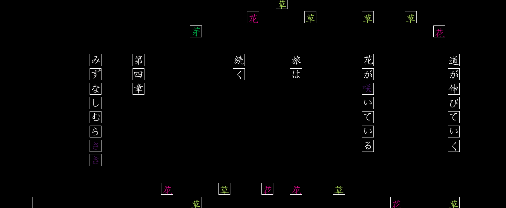
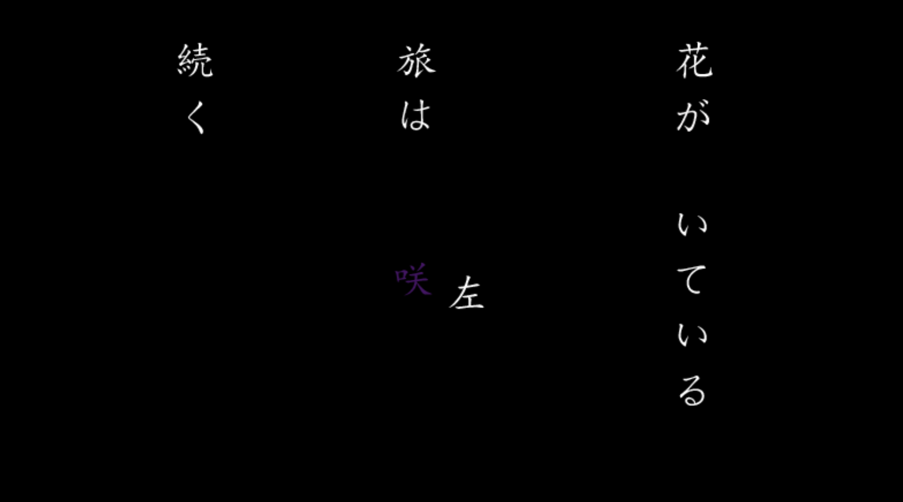
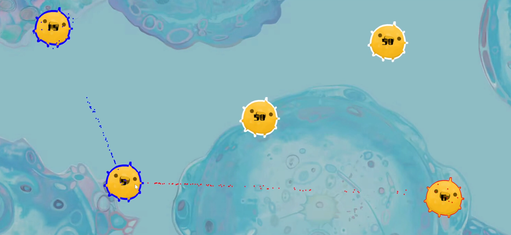
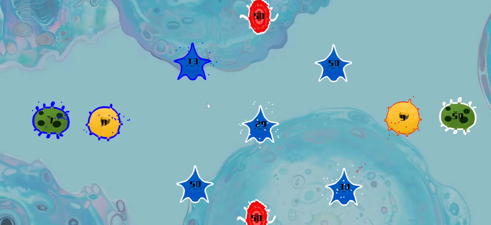
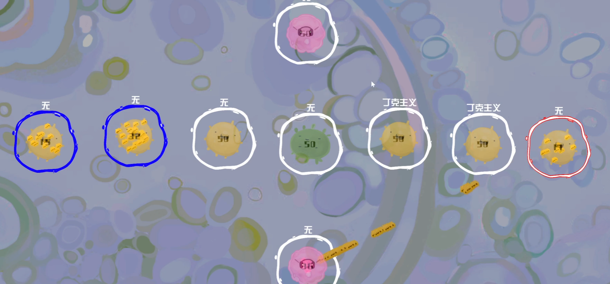

# 自己紹介

初めまして、私は閻辰祥と申します。私は大学でデジタルメディア技術を専攻しました。デジタルメディア技術は、新しいメディアの表現形式と開発方法を研究する学科です。私はゲームを中心に、メディアの表現形式を勉強しました。

私はプログラムや作曲もできます、色々な音楽を作りました。

私は色なゲーム開発経験と受賞歴があります。現在の最高の受賞は、ICSG-国際大学生ゲームコンテストの金賞です。

私の研究方向はmetagameです。

# 作品

## 文旅

まずは、こちらをご覧ください。

このゲームの名前は「文旅」です。

私は色々な国の文化に基づいて、文字を中心に、このゲームを作りました

これはゲームの表現方式の探索です。ゲームの中には複数のゲームタイプがあります。

謎解きタイプのRPGゲームです

<video src="img/演示视频.mp4"></video>

## ナイルの日記

このゲームはメディアの形式を探索します。

ゲームはヒロインと主人公の手帳です。playerは手帳の各部自由に組み合わせることができます。違い部分が組み合わせると、違い結果があった。

<video src="../创作/视频/奈尔效应展示视频.mp4"></video>

## Dyatlov 行動

 https://www.bilibili.com/video/BV1Sd4y1r7F4/?share_source=copy_web&vd_source=7de8c277f16e8e03b48a5328dddfe2ce

次はこのゲームをご覧ください。

このゲームは「の行動」と言われた。

操作方法は簡単ですね。クリックして、食料を貯まて、この酷い状況で生きてる。

このゲームにもmetagameの要素があります、日数を過ごしたら、この謎のカードが見えます。to be or not to be，この問題を考えて、ゲーム失敗や友達の死亡、二つの結局でプレイヤーは選択をしなければならない。

## ムム細胞

https://www.bilibili.com/video/BV1Pe4y137LK/?spm_id_from=333.337.search-card.all.click&vd_source=1fb8226c3ee5a8bb358e3fa9f18e29f0

 本ゲームはRTSゲームです、細胞たちは二つのパーティーに分けられ、互いのパーティーが攻撃することになっている、プレイヤーは青いパーティーです

細胞はどんどん遺伝子が生まれる、遺伝子は細胞たちの武器です。

色々な細胞はそれぞれの特性があります、細胞たちをいかして、戦場に適当な操作や戦略は重要なものです。

ゲームの進展にと共に、細胞たちは「文化」が生まれる。文化はゲームの思想に関してゲーム設定です、

## 回帰（かいき）

このゲームは囲碁（いご）を基づいてデザインしました。このゲームは囲碁の時間性を探索し、RTSやRPG要素を組み合わせた。

地図の中には大量のアイテムがあります。

プレイヤーは「枝」をのびると、未知の地図がだんだん現れる。このアイテムが見つけられる。アイテムは色なエフェクトが起こします。

地図の中にも敵がいます、プレイヤーの「node」は攻撃されたら、この「child-tree」も死にます。囲碁と同じルールです。

ゲームは「node」の数に応じて資源を消費し、プレイヤーは資源を補充するために幹細胞を放置することが必要です

<video src="F:/System Folder/QQ录屏20230714010147.mp4"></video>

## 無料でJavaScript資料がもらえる！

これは私の卒業作品です。このゲームはmetagameというタイプのゲームです。
本ゲームの思想はゲームの本体論を探索しました

ゲームにプレイヤーはコードが書けます

ゲームの中にゲームの企画書が見つかる

ゲームをする際に、複数のゲームウィンドウが開ける、このゲームたちは独自の内容がありますが、互いの連絡もあります。それ以上、ゲームはwebsiteに影響を与える。

一方で、ゲームをする際にこのwebsiteを開けたら、ゲームの資料が見えます。一方で、websiteにも様々なゲームの情報があります。ゲームはもう単なるmagic　circleではなく、ゲームは現実の一部になります。

私の作品展示は以上です
