# 自己紹介

初めまして、私はえんと申します。私の大学専攻はデジタルメディア技術です。デジタルメディア技術は、新しいメディアの表現形式と開発方法を研究する学科です。特にゲームの表現形式を研究する学科です。

私はプログラムに得意です。

私は非常に豊富なゲーム開発経験と受賞（じゅしょう）歴があります。現在の最高の受賞は、ICSG-国際大学生ゲームコンテストの金賞です。

私作曲もできます、色々な音楽を作りました。私は音楽で自分の思考や感情を表現する方法がわかります。

ゲームは何ですか、ゲームにどの方法に認識するか？ゲームの限界はありますか？

私はこの問題を考えています。

私は自分のludology研究の動画が数万の再生量をもらった。

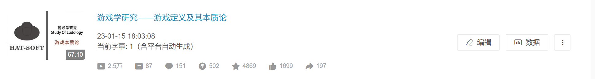

でも、研究と共に質問も増えてきた。そして、私は大学院にいきたい、先生のご指導にもらいたいんです。

# 志望 （しぼう）大学 ／大学院 指導教授 の理由

1. 東京芸術大学を目指します。。現在、ゲームの発展は非常に成熟（せいじゅく）しており、技術も非常に成熟です。しかし、芸術分野はまだ不足しています。私は芸術の知識を学び、ゲーム業界（ぎょうかい）に貢献（こうけん）したいと思っています。

2. 東京芸術大学の芸術分野は非常に豊富です。私は様々な芸術家に学ぶことができます。

3. 東京芸術大学のゲームは私に似合っていると思います。ゲームの表現方法を探しています

   

# 入学ごの学習計画

1. 哲学と芸術学の理論を引き続き学びます。
2. ludologyをもっと詳しく深く勉強したい
3. 暇な時間にピアノ能力や他の楽器（がっき）の練習をしたいと思っています。
4. キャンパス活動に多く参加し、より多くの分野を理解する。

# 卒業ごの計画

1. ゲームデザインに関連する仕事を見つける。
2. 暇に自分が好きなゲームを開発する。
3. ゲーム理論のコミュニティを作りたいです、ゲームデザインなの皆が交流できます。

# 研究計画の説明

前述の通り、私はゲームについて考えました。なぜ最近のゲームは面白くなくなった？

何故「君と彼女と彼女と恋」のようなゲームは面白いですか？

このゲームにきっかけ、私は研究の方向が見つけました、それはmetagameです。

metagameとは、ゲームを超えたゲームです。伝統的はMDA　るーるを採用（さいよう）し、プレイヤーの美学体験（たいけん）に注目するです、でも、metagameは作者のデザインを強調（きょうちょう）します。それで、metagameは芸術品に似ています。

したがって、　私のポートフォリオの方向はmetagame　designです。

私の研究は以下の3つの部分にがあります

1. magic　circleが拡大（かくだい）することで、プレイヤーはゲームに認識することが変わるかどうか？

2. ゲームのmultimedia化の可能性とその表現形式（けいしき）の探求。そしてデザイナーが自分自身の感情を表現する際のメディア可能性

   

3. どのような状況で、ゲームのsaturationが、プレイヤーの認識に影響することができますか？プレイヤーがmetagameにどの程度が受けられるか？

# 作品 

## 文旅

まずは、こちらをご覧ください。

このゲームの名前は「文旅」です。

私は色々な国の文化に基づいて、文字を中心に、このゲームを作りました

これはゲームの表現方式の探索です。ゲームの中には複数のゲームタイプがあります。

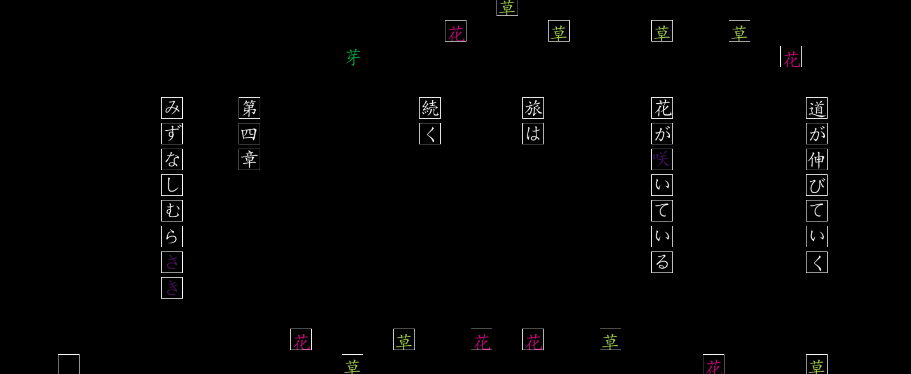

謎解（なぞとき）きゲームですね

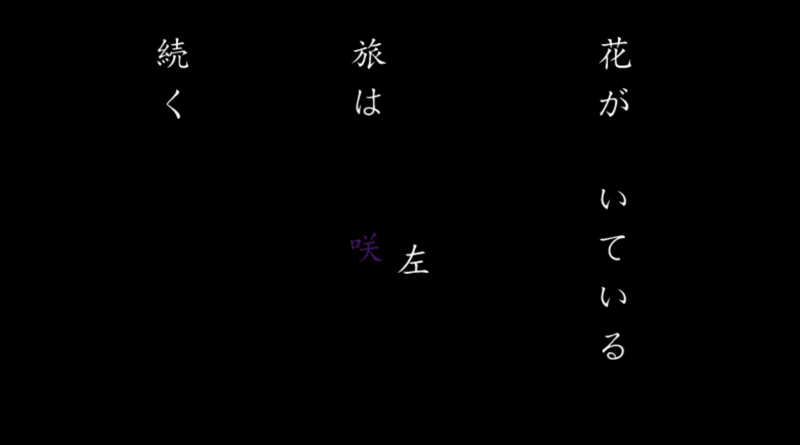

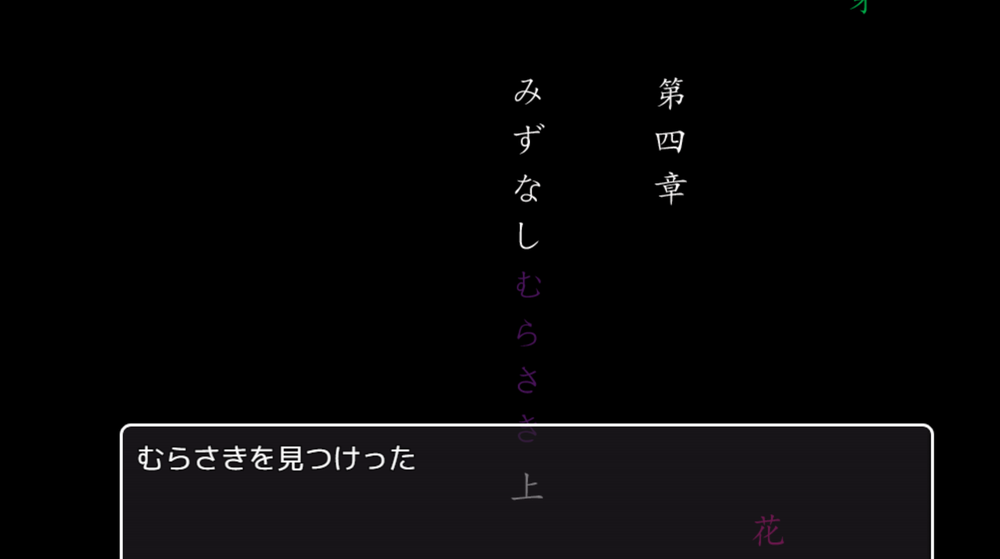

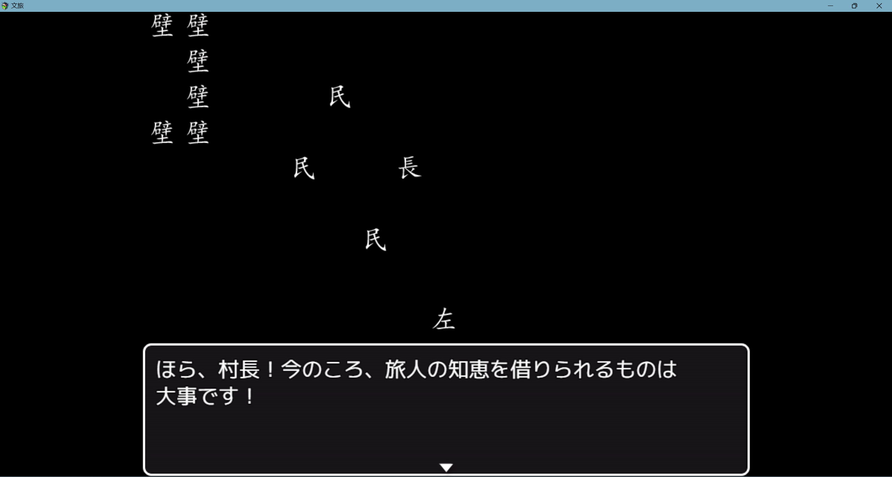

<video src="img/演示视频.mp4"></video>

## ナイル日記

このゲームはメディアの形式を探索します。

ゲームはヒロインと主人公の手帳です。playerは手帳の各部自由に組み合わせることができます。違い部分が組み合わせると、違い結果があった。

<video src="../创作/视频/奈尔效应展示视频.mp4"></video>

## Dyatlov 行動

次はこのゲームをご覧ください。

このゲームは「の行動」と言われた。

操作方法は簡単ですね。クリックして、食料を貯まて、この酷い状況で生きてる。

 https://www.bilibili.com/video/BV1Sd4y1r7F4/?share_source=copy_web&vd_source=7de8c277f16e8e03b48a5328dddfe2ce

今はゲームデザインは勉強しています。

## むむ細胞

https://www.bilibili.com/video/BV1Pe4y137LK/?spm_id_from=333.337.search-card.all.click&vd_source=1fb8226c3ee5a8bb358e3fa9f18e29f0

细胞之间可以互相攻击，

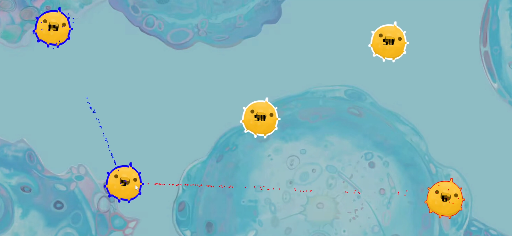

不同的细胞有着不同的功能

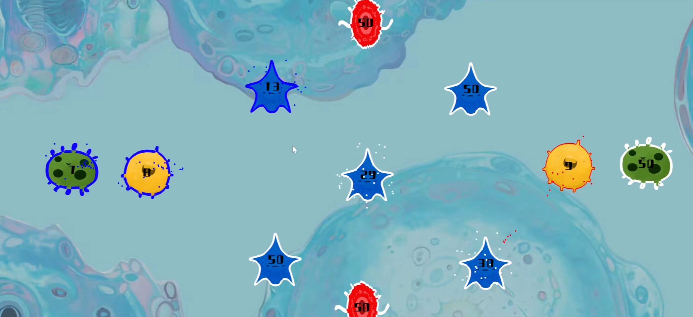

随着关卡的增加，细胞会诞生文化，来对抗玩家的控制。

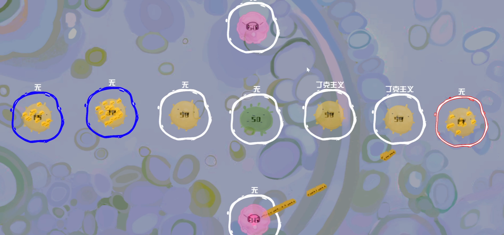

## 無料でJavaScript資料を入手できる！

入手（にゅうしゅ）

これは私の卒業作品です

急に見ると「普通なギャルゲームじゃないですか？」

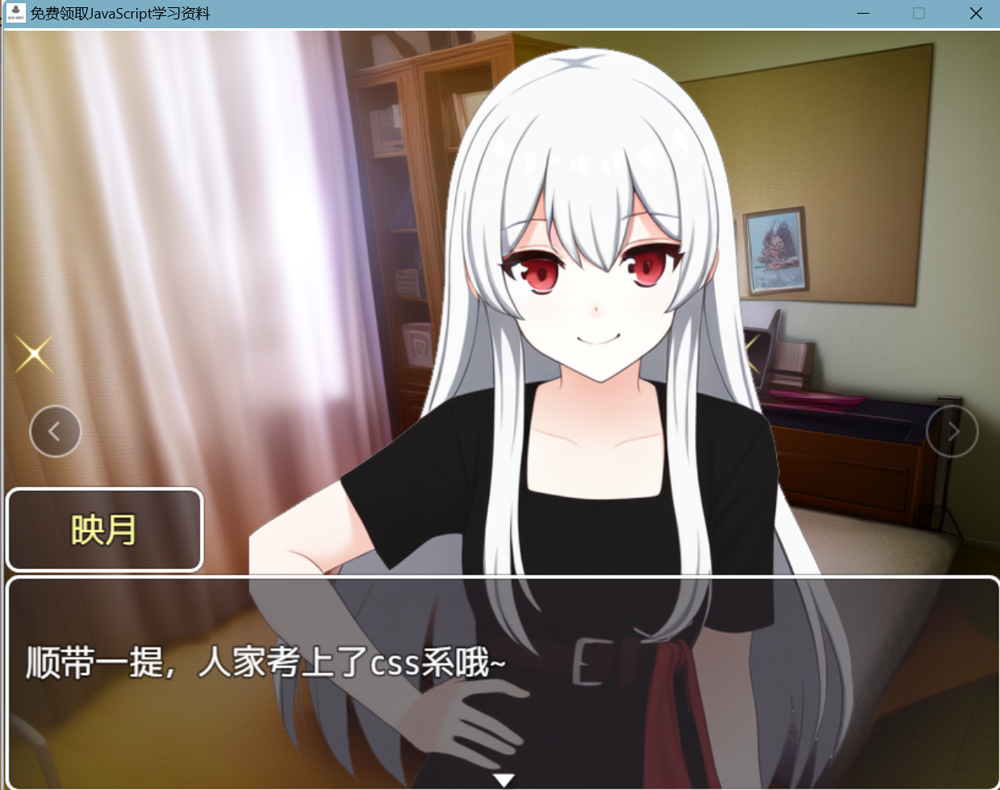

しかし、

画面は真っ黒になった！

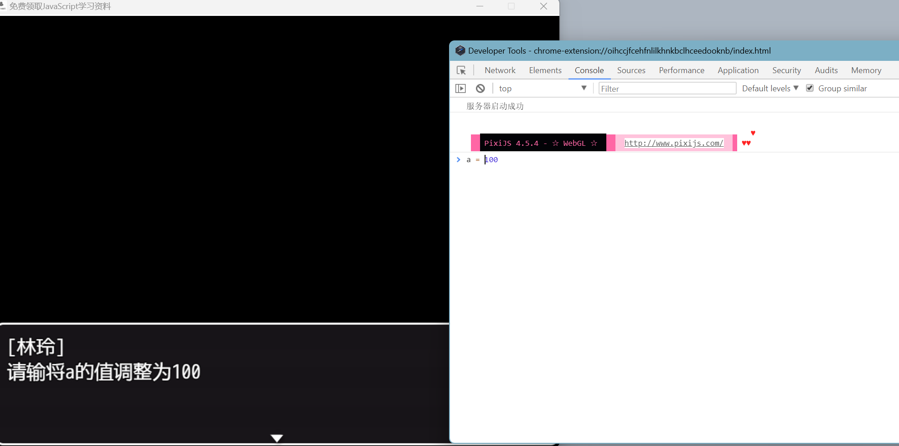

之前所有的游戏数据都会崩坏。

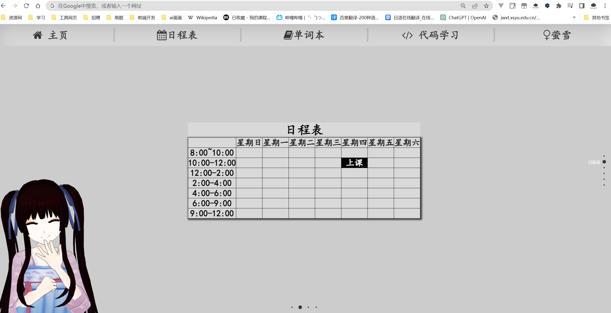

游戏还会跳出游戏之外，变成软件和账号。玩家需要从中找到游戏的线索。

ゲームは時に複数のwindowを同時に開くこともあります、ゲームは互いの存在をわかります。

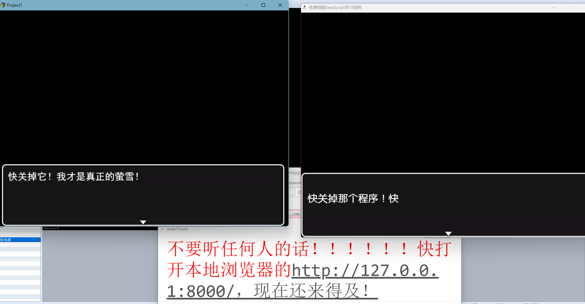

## 作曲

以下は私の個人的な作品の一部です。

交響楽（こうきょうがく）

 <audio src="../创作/作曲/FL/完成/012-花儿主题变奏曲.mp3"></audio>

<audio src="../创作/作曲/FL/昙花片段.mp3"></audio>

<audio src="../创作/作曲/FL/完成/043-独自等待-2021-3-1.mp3"></audio>

# 最 近 の興 味 ・関 心・思考

