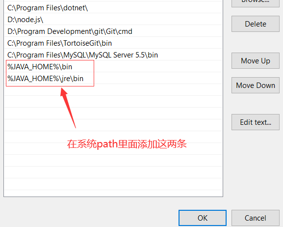

#  安装与配置

## jdk的安装(以jdk14为例)

jdk14安装没有啥难的,记住你安装路径即可.一路next.之后的配置环境才是重点.

### jdk14的修复

装完jdk14有bug,里面没有jre,现在先解决一下这个问题

1. 找到你按照jdk的目录,在那个目录里面直接**按住shift+右键**,可以打开powershell


2. 输入下面的代码

```shell
bin\jlink.exe --module-path jmods --add-modules java.desktop --output jre
```

注意！如果家庭版的Windows在c盘安装时，执行这句代码可能会出现错误。这是因为家庭版Windows没有管理员权限。这时候需要把jdk文件剪切到别的盘里面去。之后再重新执行该代码。


### 环境配置


1. 在系统变量里面新建一个变量,变量名为 `JAVA_HOME `  ,变量值为

   `D:\Program Developme nt\java\jdk_14.0.2` 也就是你jdk所在的文件目录.


2. 在环境变量中的系统变量里面找到Path，添加 `%JAVA_HOME%\bin`  语句和`%JAVA_HOME%\jre\bin`。其实就是用相对路径去访问。





3. 在系统变量里面新建一个变量，变量名为 `CLASSPATH `  ,变量值为`.;%JAVA_HOME%\lib\dt.jar;%JAVA_HOME%\lib\tools.jar`

   


4. 在cmd窗口里面测试

   输入java以及javac只要不报错就行了


## Eclipse的安装

1. 一点进去选第一个


2. 上面jvm不要改,下面安装路径随意(不要有中文)

   


## idea的安装