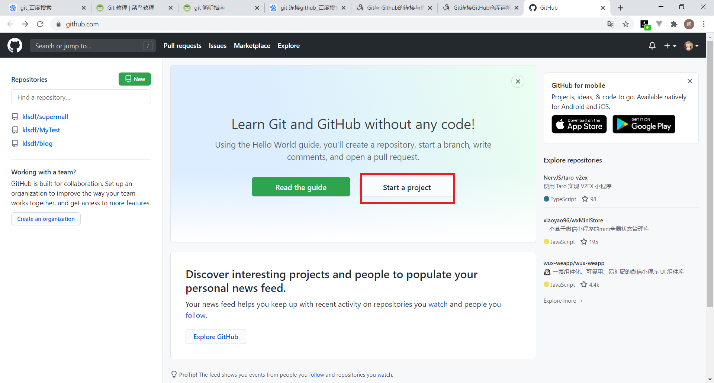
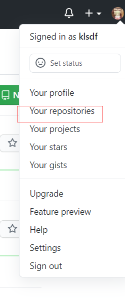
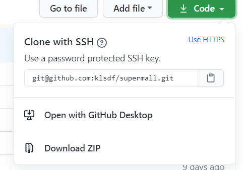
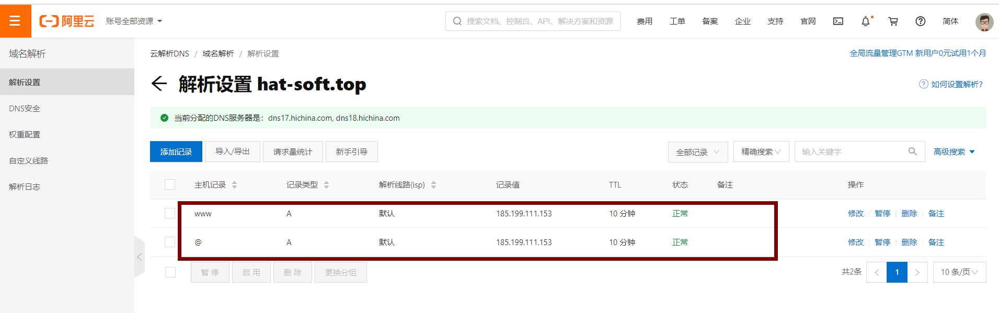
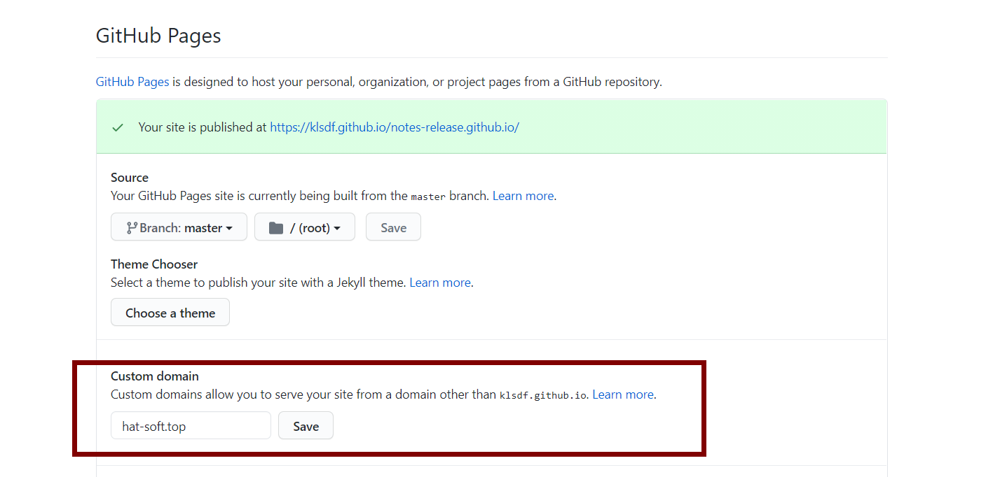
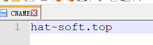
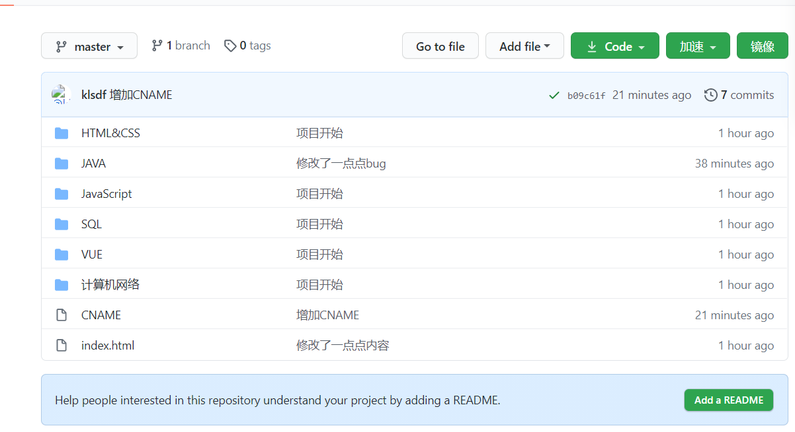

# GIT简介

- .git文件夹被称为仓库区
- .git所在的目录被称为工作区
- git add 命令可以把工作区的文件加入到暂存区

工作区的状态被称为 unstage或者是untracked
暂存区的状态被称为stage


## 0. 配置

### 在GitHub建立项目



之后右上角可以找到你的项目



### 配置作者信息

如果第一次使用git，那么首先需要先配置作者信息。否则无法git commit。

会报错

```
Author identity unknown *** Please tell me who you are.
```

只需要把下面的username和email改成自己的就可以了。

```shell
git config user.name “username”
git config user.email “email”
```


### 配置SSH

第一次使用github会出现这个错误，因为没有配置SSH

```
git@github.com: Permission denied (publickey).
fatal: Could not read from remote repository.

Please make sure you have the correct access rights
and the repository exists.

```

1. 生成ssh

   ```shell
   ssh-keygen -t rsa -C "自己的邮箱"
   ```

2. 此时输入下面的代码看看是否成功生成了id_rsa和 id_rsa.pub文件。

   ```shell
    cd ~/.ssh
    ll
   ```

3. 拷贝密钥ssh-rsa开头

   ```shell
   cat id_rsa.pub
   ```

4. 在GitHub点击用户头像，进入setting

5. 在左侧找到SSH and GPG keys

6. 右边点击new SSH key

7. 取个名字，把之前拷贝的秘钥复制进去，添加就好啦


# 配置命令

```shell
git config -l  #查看当前git环境详细配置


```


# 连接GitHub流程

## 1.在本地创建仓库

```shell
git init
```

## 2.把工作内容添加入暂存区

```shell
git add *
```

## 3.把暂存区内容推入本地数据仓库

```shell
git commit -m "代码提交信息"
```

## 4.连接远程服务器

若之前这个本地仓库已经连接过这个服务器,可以跳过这条.

```shell
git remote add origin git@github.com:某某某/某项目名.git
```

注意!!!后面那串github的地址并不是固定的,需要根据你在github上面的项目决定.



## 5.把本地仓库的数据推入远程仓库

若你第一次提交这个项目,请用下面的代码

```shell
git push -u origin master
```

若不是第一次,可以用下面的代码

```shell
git push
```

# 分支

## 创建分支

```shell
git checkout -b 分支名
```

## 查看分支

查看所有分支

```shell
git branch -a
```

查看远程所有分支

```shell
git branch -r 
```

## 切换分支

```shell
git checkout 目标分支
```

## 合并分支

 将目标分支与当前分支进行合并

```shell
git merge origin/目标分支
```


# 其他操作

## 克隆远程仓库

```shell
git clone  "url"
```

## 查看工作区、暂存区的状态，还有分支

```shell
git status
```

## 拉取远程库

```shell
git pull <别名> <分支名>
```

## 删除

从git中删除指定文件

```shell
git rm 文件名(包括路径) 
```

# github.io

这个可以用来自己创建一个静态的网页

## 创建

1. 在setting里面把项目名字后面加上github.io。
2. 进入page，选择一个主题


## 域名绑定

1. 买一个域名

2. ping你的[http://github.io](https://link.zhihu.com/?target=http%3A//github.io)域名，得到一个IP。我用户名是klsdf，所以写的klsdf.github.io

   ```shell
   ping klsdf.github.io
   ```

   然后我得到一个ip 185.199.111.153

3. 在购买域名的网站修改域名解析，记录类型为A，记录值为你刚刚的ip

   

4. 在github的settings中，往下拉，在domain里面填入你的域名

   

5. 在你的项目的根目录里面新建一个CNAME文件，里面填你的域名，注意不要加http 

   
   
6. 推送到远程仓库
   
   
   
   
   
   然后就好啦！
   
# 从github拉取

1. 新建一个空文件夹
2. **git init**
3. 自己要与origin master建立连接（下划线为远程仓库链接）
	**git remote add origin git@github.com:klsdf/Matrix.git**
4. **git fetch origin develop（develop为远程仓库的分支名）**
5. **git checkout -b dev(本地分支名称) origin/develop(远程分支名称)**
6. **git pull origin develop(远程分支名称)**
7. 


# 命令


```shell
git init 在当前目录新建一个仓库

git init [project-name] 在一个目录下新建本地仓库

git clone [url] 克隆一个远程仓库


git status [file-name] 查看指定文件状态

git status 查看所有文件状态


git add [file-name1] [file-name2] ... 从工作区添加指定文件到暂存区

git add . 将工作区的被修改的文件和新增的文件提交到暂存区，不包括被删除的文件

git add -u . u指update，将工作区的被修改的文件和被删除的文件提交到暂存区，不包括新增的文件

git add -A . A指all，将工作区被修改、被删除、新增的文件都提交到暂存区
git commit -m [massage] 将暂存区所有文件添加到本地仓库

git push 将文件添加到远程仓库

git rm --cached [file-name] 删除暂存区的文件

git rm -rf . 不但删除所有暂存区的文件，还删除所有工作区的物理文件

git pull 从远程仓库拉取代码到工作空间
```


# 常见错误

```
! [rejected] master -> master (fetch first) error: failed to push some refs to ' 。。。'
```

出现这个问题是因为github中的README.md文件不在本地代码目录中，可以通过如下命令进行代码合并

```shell
git pull --rebase origin master
```


git 执行git pull –rebase报错误如下：

```
error: Cannot pull with rebase: You have unstaged changes.
error: Additionally, your index contains uncommitted changes.
```

解决：
先执行git stash
再执行git pull –rebase
最后再执行git stash pop


# 修改作者信息
```shell

git config --global user.name "xxx"
```


# 2020/8/26