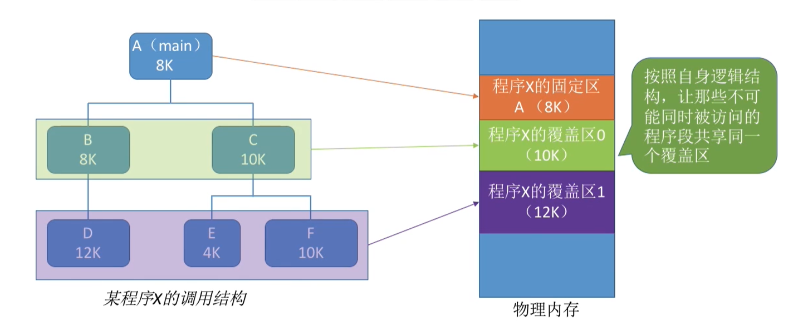
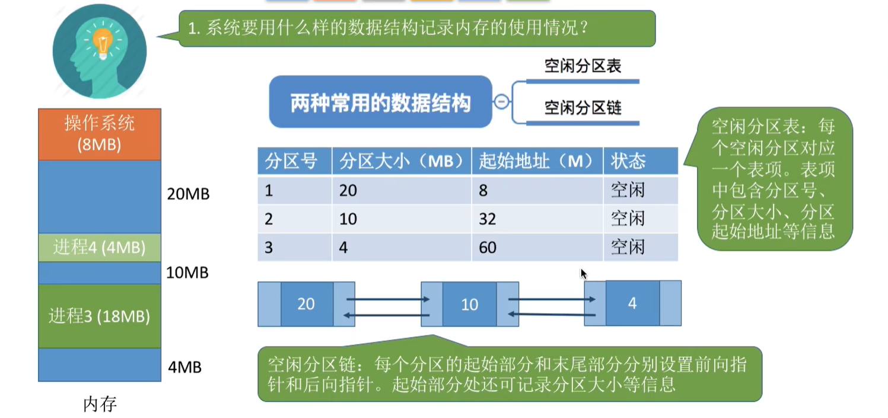
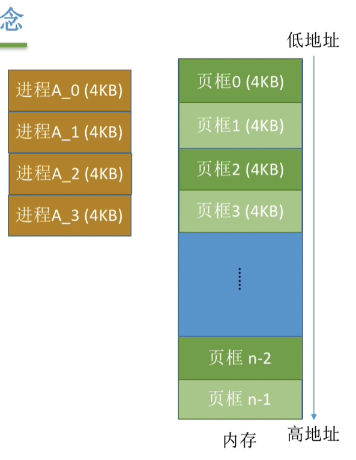
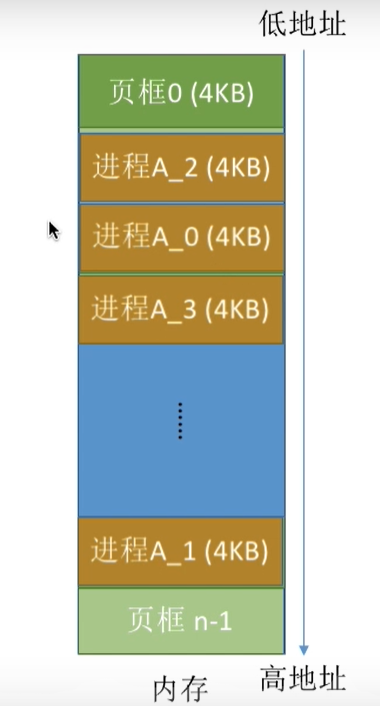

# 进程管理

## 进程状态

# 中断

- 内中断：系统内部发出的中断命令
  - trap：系统调用
  - fault：程序出现bug，但是可以修复，比如缺页中断
  - abort：致命的错误，例如除0。
- 外中断：由外界发出的中断命令
  - I/O中断（比如键盘输入）
  - 人工干预

- 发生中断，就意味着需要操作系统介入开展管理工作，CPU会立即进入核心态
- **用户态>核心态”是通过中断实现的。并且中断是唯一途径。核心态>用户态”的切换是通过执行特权指令，将程序状态字(PSW) 的标志位设置为用户态**

# 系统调用

操作系统中，所有的资源都是由操作系统来控制的，所有涉及资源的操作，都必须通过操作系统代为完成。而让操作系统去操作资源这件事情，就叫做系统调用。

一些语言的库函数会封装这些系统调用的代码，比如printf函数。

- 陷入指令是唯一一个只能在用户态执行，而不可在核心态执行的指令
- 只有陷入核心态才能执行系统调用，也就是必须先内中断才能系统调用

# 进程

- 程序段、数据段、PCB三部分组成了进程实体(进程映像)。 一般情况下，**我们把进程实体就简称为进程**。
- 

# 内存管理

## 基础

内存地址从0开始，每个地址对应一个**存储单元**。如果计算机**按字节编址**，那么一个存储单元就是一个Byte，如果**按字编址**，那么一个存储单元就是一个字。但是要注意，不同计算机的字长是不一样的，所以存储单元的大小可能不一样。

## 数量单位

$1K = 2^{10}$

$1M = 2^{20}$

$1G = 2^{30}$

这就是说，4GB的内存就相当于，存储单元有$4*2^{30}=2^{32}$个。若果是按字节编制的话，就有$2^{32}$Byte。当然，若果是按字编址的话，就有$2^{32}$个字。

## 逻辑地址和物理地址

逻辑地址就是在某个基地址上面加个某数，CE修改游戏经常会用到，也就是指针扫描出来的XXXX+0x某某某某。物理地址就是实际的地址，也就是scan出来的地址。

## 链接的三种方式

1. 静态链接

   在程序运行之前，先将各目标模块及它们所需的库函数连接成一个完整的可执行文件（装入模块），这个玩意就是一大坨整体，内存地址是连续的，之后不再拆开。

2. 装入时动态链接

   将各目标模块装入内存时，边装入边链接的链接方式。

3. 运行时动态链接

   在程序执行中需要该目标模块时，才对它进行链接。其优点是便于修改和更新，便于实现对目标模块的共享。

## 装入的三种方式

所谓的装入，**就是把逻辑地址转化成物理地址**。也就是说程序如何放入到内存中，放到哪里。

1. 绝对装入

   这个就是说在编译阶段就分配好了内存，到时候直接用就行。比如说逻辑地址是80，那么实际上分到的就是80.

2. 静态重定位

   这个是说在内存分配的时候，根据你程序起始地址所进行的重定位。

   比如说，你的逻辑地址是80，但你这个程序的起始地址是100，那么最后分到的地址就是180。

3. 动态重定位

   这个东西很强，装入程序把模块放入内存的时候，并不会立刻把逻辑地址转化为物理地址，而是等到需要使用的时候再去执行。这次CPU会分出来一个重定位寄存器，专门存放装入模块的起始地址，因为装入内存后所有的地址依然是逻辑地址。这种方式需要一个重定位寄存器的支持。

## 覆盖技术

程序一般都有一个模块的调用树，就跟vue那个模块调用一样。这就确保了一些模块只能被上级调用，没有互相调用。这样的话，我们就可以把那些彼此没有互相调用的程序覆盖。

## 对换技术

就是说把一些常用的放到内存，不常用的放到外存。所以外存也会有一个地方来存储这些数据。

外存分为**文件区**和**对换区**，文件区是随机存储的，存储效率高，但是读写效率低。对换区是顺序存储的，读写比较快，但是存储的效率低。

要注意PCB还是需要放在内存的。

## 内存分配

### 单一连续分配：

在单一连续分配方式中，内存被分为系统区和用户区。系统区通常位于内存的低地址部分，用于存放操作系统相关数据;用户区用于存放用户进程相关数据。

内存中只能有一道用户程序，这一个用户程序独占整个用户区空间。这就导致了我4G内存，你只用了100MB，会浪费大量的内存空间。这就是**内部碎片**。

优点:实现简单;无外部碎片;可以采用覆盖技术扩充内存;不一定需要采取内存保护（eg:早期的PC操作系统MS-DOS) 。

缺点:只能用于单用户、单任务的操作系统中;有内部碎片;存储器利用率极低。

### 固定分区分配

20世纪60年代出现了支持多道程序的系统，为了能在内存中装入多道程序，且这些程序之间又不会相互干扰，于是将整个用户空间划分为若干个固定大小的分区，在每个分区中只装入一道作业，这样就形成了最早的、最简单的一种可运行多道程序的内存管理方式。

分区分为大小相等的和大小不等的

分区大小相等:缺乏灵活性，但是很适合用于用一台计算机控制多个相同对象的场合（比如:钢铁厂有n个相同的炼钢炉，就可把内存分为n个大小相等的区域存放n个炼钢炉控制程序)

分区大小不等:增加了灵活性，可以满足不同大小的进程需求。根据常在系统中运行的作业大小情况进行划分(比如:划分多个小分区、适量中等分区、少量大分区)

但是这两种都会造成内存资源的浪费，比如说我现在这个程序需要20MB的内存，但是你划分的都是30MB的，那么我就会浪费10MB的内存。

操作系统需要建立一个数据结构――**分区说明表**，来实现各个分区的分配与回收。每个表项对应一个分区，通常按分区大小排列。每个表项包括对应分区的大小、起始地址、状态（是否已分配）。

### 动态分区分配

这个是为了解决内存浪费而产生的，**动态分区分配**又称为**可变分区分配**。这种分配方式不会预先划分内存分区，而是在进程装入内存时，根据进程的大小动态地建立分区，并使分区的大小正好适合进程的需要。因此系统分区的大小和数目是可变的。(eg:假设某计算机内存大小为64MB，系统区8MB，用户区共56 MB.…）。

不过这个技术也有很大的问题，虽然我可以动态给你分内存，但是随着分的东西不断变多，进程之间的间隙也会越来越小，比若说，进程彼此间距离都剩10MB了，但是我现在一个进程是20MB的，是不是就不能分进来了。这就是**外部碎片**。

## 分页储存管理

### 基本概念

为了解决上面的内部碎片和外部碎片，大佬们将内存空间分为一个个大小相等的分区（比如:每个分区4KB），每个分区就是一个“**页框**”，或称“页帧”、“内存块”、“物理块”。每个页框有个编号，即“**页框号**”(或者“内存块号”、“页帧号”、“物理块号”）页框号从o开始。

将用户进程的地址空间也分为与页框大小相等的一个个区域，称为“**页**”或“页面”。每个页面也有一个编号，即“**页**号”，页号也是从o开始。但是进程的最后一个页面可能没有一个页框那么大。比如进程A有15KB，但是给分到了16KB的内存，这就会造成1KB的浪费。因此，页框不能太大，否则可能产生过大的内部碎片。

操作系统以页框为单位为各个进程分配内存空间。进程的每个页面分别放入一个页框中。也就是说，进程的页面与内存的页框有一一对应的关系。各个页面不必连续存放，也不必按先后顺序来，可以放到不相邻的各个页框中。

### 逻辑地址转物理地址

规定：

$页号=逻辑地址/页面长度$

$页面偏移量=逻辑地址 mod 页面长度$

也就是说，我们这个内存要想分页储存，首先就得知道分几页，一页可以储存多少个地址。假设用32位来表示逻辑地址，页面大小用10位来表示（$2^{10}B=1024B=1KB$），这样的话前面22位就是页号，后面的10位就是页内偏移量。

00000000 00000000 000000**00 00000001**，这个就代表0号分页的1号偏移。

00000000 00000000 000010**00 00000001**，这个就代表2号分页的1号偏移。

也就是说，如果页面大小为$2^kB$，那么后面K位就是偏移量，前面的是页号。

为什么会有这样的规律呢？实际上计算页号时的除法操作，就相当于把后面的位数直接删掉，例如

00000000 00000000 000011**00 00000001**，这个的页号就是00000000 00000000 000011，后面的直接不用看。

而页面偏移量就是把前面的直接删掉不用看。

## 虚拟内存

传统的储存管理模式要求作业必须一次性装入内存，然后才能开始工作。这就会导致两个问题：

1. 作业很大时，内存一次装不下这么多，导致无法运行。
2. 很多作业一起运行时，再想加别的作业，就加不下了，导致并发性下降。

之后，一旦作业进入内存，就会一直霸占着不动，直到运行结束。这也会导致一个问题。

1. 作业在一个时间段内，只需要访问其中一小部分数据即可正常运行，这就导致了内存中会驻留大量的、暂时用不到的数据，浪费了宝贵的内存资源。

因此，**虚拟存储技术**就出现了。操作系统会把暂时用不到的数据直接塞到外存去，需要的时候再拿进来。这个虚拟内存的最大值由两个因素决定。

1. 内存+外存之和
2. 操作系统的寻址范围。

如果你的电脑是32位，那么理论上来说就能最多拥有$2^{32}B=4GB$，但是如果你电脑只有2GB的内存+外存，那么最大虚拟内存还是2GB。同样的，如果你有钱，买了一个2TB的内存，但是实际上你最大虚拟内存还是4GB。

## 页表机制

- 页号：把一个作业分成若干页
- 页框号：把内存分为若干个页框，然后编号。
- 状态位：是否已经被调入内存
- 访问字段：这个页最近被访问了几次
- 修改标志：页调入页框后是否被修改过
- 外存地址：在外存中存放的地址位置。

| 页号 | 页框号 | 状态位 | 访问字段 | 修改标志 | 外存地址 |
| ---- | ------ | ------ | -------- | -------- | -------- |
|      |        | 1      |          |          |          |
|      |        |        |          |          |          |
|      |        |        |          |          |          |

**缺页中断**，这个就是说如果操作系统所请求的页不在内存，便会产生一个缺页中断，然后该缺页的进程阻塞，进入阻塞队列，等页回到了内存时，再进入就绪队列。

如果内存中有空闲块，则为进程分配一个空闲块，将所缺页面装入该块，并修改页表中相应的页表项。如果内存中没有空闲块，则由**页面置换算法**选择一个页面淘汰，若该页面在内存期间被修改过，则要将其写回外存。未修改过的页面不用写回外存。

# 文件系统

## 文件的物理结构

- 连续结构

  所有文件都是连在一起的，每次查找的时候只需要找到第一个文件的开就可以了。

- 串联结构

  就和链表是一模一样的，每个文件块除了存放自己的文件之外，还需要存放下一个文件的指针。

- 索引文件

  建立一张索引表，表中存放着各个文件的起始指针。如果一张表放不下，那么索可以建立多个索引表，表之间用指针链接。

  如果表的数量很多，那么可以建立多重索引，也就是对索引表的索引。

1. 
