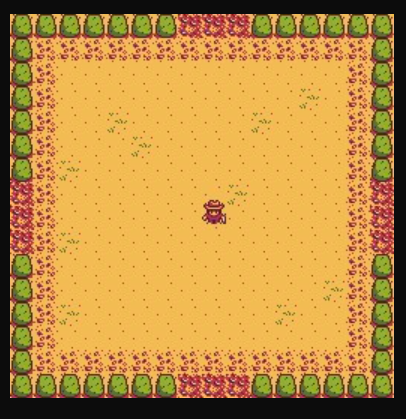
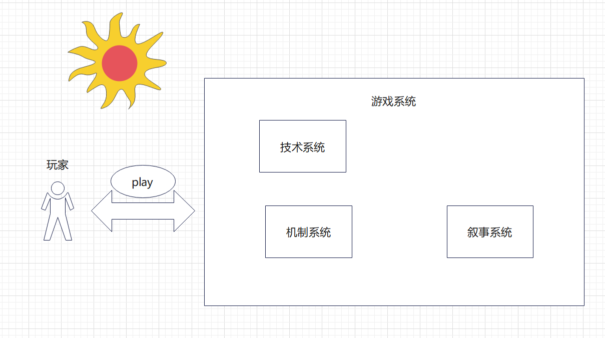
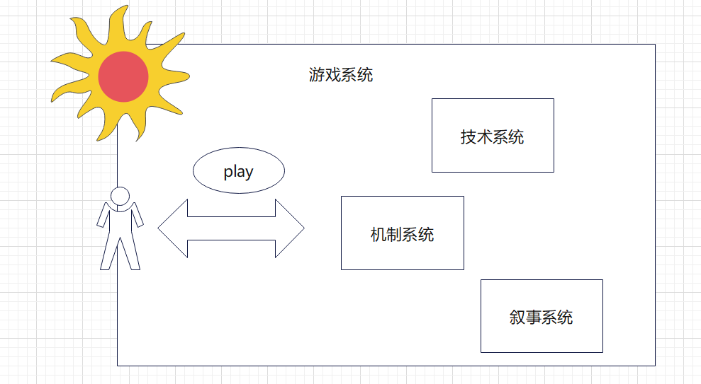
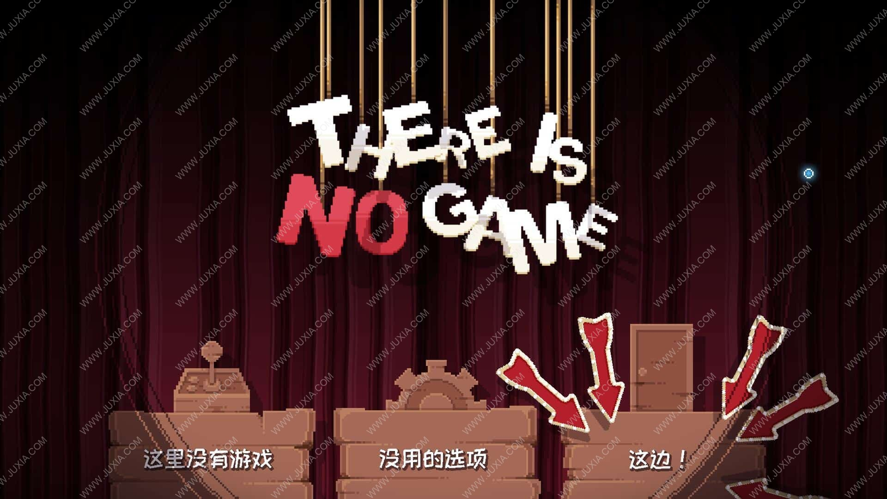

# ludology的基本概念

ludology，国内有一部分翻译为游戏学。但是实际上并没有标准翻译。

因为考虑到很多设计师实际上没有接触过这些，所以简单介绍一下ludology的基本概念。

简单来说，ludology研究的是游戏的本体论，认识论，以及游戏现象等哲学问题。

例如：游戏是什么？玩家和游戏的关系是什么？电子游戏作为一种媒体，有没有其表达的边界？这样的问题。

game design和 ludology的关系。

作为一个设计师，大家都接触过很多设计理论。ludology的成果会反馈到游戏设计上去。

以MDA理论为例，作者思考了电子游戏作为商品时，如何从玩家的美学体验反推机制。

>Games are created by designers/teams of developers, and consumed by players. They are purchased, used and eventually cast away like most other consumable goods. 。
>
>——《**MDA: A Formal Approach to Game Design and Game Research** 》

有了这个理论了，设计师们，才会去设计具体的游戏。

要注意，这些理论的前提是，将游戏视为交互性的。除了ludology同样还有Narratology理论。

后者将游戏设为叙事性的。研究的是叙事结构对于玩家的影响。

# metagame的本体论问题

没有办法直接回答。

是？什么是什么的问题。是是先验的。

我们今天的主题是metagame。但是在研究一个事物之前我们首先要思考两个问题。

对象是否存在。存在的话，对象是什么？[^1]

因此我们不得不先思考一个问题。metagame存在吗？这一点我们可以说，我了解并知道世界上有一种叫做metagame的游戏。例如《心跳文学社》《邪恶铭刻》都是非常经典的metagame。但是实际上这些都是现象。并不是实在。

实例对象。是不是有一个具体的游戏类型叫做metagame？

我们心中对metagame的理解是统一的吗？metagame是什么？

这就展开了我们今天的问题。

我们首先从现象出发，在经验主义角度来进行研究。

## 经验主义

首先我们必须意识到语言的威力。同一个能指所对应的所指实际上会产生很大的差异。

1. 博弈论
2. GDC，metagame被正式提出。超越游戏的游戏方式。

在早期的语境下的metagame是一种超越游戏规则，获得游戏之外信息的行为或现象。

例如：

- 在一次拳击比赛中，A选手得知B选手左手受伤。因此比赛期间一直着重攻击B的左手。
- 某俯视角ARPG游戏中，玩家获得了一把枪，下意识便知道了点击鼠标可以开枪。
- 在steam平台游戏的时候，玩家看到右下角弹出一个弹窗，表明玩家获得某个成就。

这种metagame可以说无处不在，基本上所有游戏都有metagame。

这几个例子看起来差异很大，但是实际上都是metagame。拳击比赛中，A选手得知的信息超越了拳击比赛本身。而玩家知道鼠标可以开枪的这个知识，也并不是来源于游戏本身，可能是来源于其他相似游戏的积累，或者是听朋友介绍过。而游戏平台的成就，也是游戏规则之外的东西，也是metagame。

因此在早期metagame是一种超越游戏规定规则或在游戏规定规则之外运行的游戏方法。就像比喻，排比之于文学。metagame是一种特殊的游戏设计手法或者理念。

而近几年metagame开始急速发展。

- 《君と彼女と彼女の恋》（2013年6月28日发售）
- 《Undertale》（2015年9月15日）
- 《Doki Doki Literature Club!》（2017年9月22日发售）
- 《Inscryption》（2021年10月19日）

实际上我们所讨论的metagame更接近于这种游戏类型。因此我们再次从经验主义角度入手，来分析metagame。

一个metagame都有哪些特征？

常见的特征可以归类为：

- 叙事上采用了meta narrow。
- 在gameplay上延续某一个传统的游戏类型，但是在机制上会影响formal system建立子系统。ADV，游戏的角色可以操作存档和游戏卸载程序。
- 游戏的画面或表现方式会产生多种。
- 玩家的互动

我们现在对metagame的现象有了更深入的了解了。现在问题在于，为什么这些东西被叫做meta？我们在谈论meta的时候到底在谈论什么？

为什么叫元游戏。元？

补充：《**Metagames: On the Ontology of Games Outside of Games**》

当metagame作为一种游戏方法的时候，有5种形式

这个文章的主要观点是，metagame是一种超越或在游戏规则之外的游戏方法，它使用外部因素来影响游戏，或超越游戏设定的所谓限制或环境。metagame概念可以被理解为五个类别：增加、社交、材料、策略和规则元游戏。

- 增加元游戏：增加元游戏是指在游戏中添加新的规则或机制，以改变游戏的玩法。例如，玩家可以在游戏中添加自己的规则，以增加游戏的难度或复杂度。
- 社交元游戏：社交元游戏是指在游戏之外的社交活动中使用的策略。例如，在团队游戏中，玩家可以使用社交元游戏来建立团队合作关系。
- 材料元游戏：材料元游戏是指使用物理材料来影响游戏的策略。例如，在纸牌游戏中，玩家可以使用标记或印记来标记牌堆。
- 策略元游戏：策略元游戏是指在游戏中使用的策略。例如，在围棋中，玩家可以使用策略元游戏来预测对手的下一步棋。
- **规则元游戏**：规则元游戏是指通过讨论和应用社区而出现的规范性规则。例如，在角色扮演游戏中，玩家可以通过讨论和应用社区来制定新的规则，以增加角色扮演的深度和复杂度。

## 理性主义

因此接下来我们会站在理性主义的角度，对metagame进行研究。

在剑桥词典中前缀 *meta-* 源于希腊语前置词意思是“超越“，以及自我参照、递归的涵义，以及形而上学的一种类比。

除去和游戏无关的形而上学，也就是说，实际上meta-前缀代表着两个含义：

- 超越

  在当今英文中，meta的意思就是为”超越，超出“。

- 递归：关于

  该递归是指关于A的A。例如，我拍摄了一部拍摄电影的电影。那么这个就可以叫做metafilm。

  最典型的例子就是HTML语言中的meta标签了。meta标签是提供元信息（meta-information）的标签。而元信息实际上就是关于信息的信息。例如我发了一段文本信息。那么元信息就可以指文本的字数、字体等关于信息的信息。

有了meta-的概念，我们接下来就可以来重新总结metagame的概念。

- 关于游戏的游戏（递归）

  递归在metagame中可以理解为游戏内容中，包含了游戏本身的信息。或者游戏中存在的子系统。

  在《星露谷物语》中，玩家也可以在游戏中玩到游戏的游戏《草原大王》，这属于metagame。

  

  

  《游戏开发物语》中，玩家需要在游戏中开发游戏。因此是metagame。

  《进化之地1》中，这个游戏本身就是描绘游戏发展历史的。也属于递归的metagame。

  《There Is No Game: Wrong Dimension》中，游戏的角色就是游戏本身，也是递归。

  《Doki Doki Literature Club!》中，女主角莫妮卡会修改游戏的规则。也就是创建子游戏。同样是递归。这种建立子系统的行为都是递归行为。

- 超越游戏的游戏（超越）

  在这里超越有两种理解：

  - 游戏内的角色或某种机制做出了超越其设定的行为或者超出了其游戏引导的内容。或者游戏内可以影响游戏外界或者不属于游戏内系统的行为。**这种超越是游戏超越到现实。**

    例如《ゼルダの伝说 梦をみる岛》中，玩家如果和NPC“天天”对话，“天天”就会告诉玩家：

    > 选择重新挑战就能从最后保存的地方开始游戏。但听说如果是在迷宫，就得在入口重新开始。
    >
    > 不过，我还只是个孩子，完全搞不懂这些是什么意思呢！

    

    很明显，对于一个NPC来说，在设定上是无法理解保存等功能的，这些语句超越了游戏本身，因此属于meta元素。

    而steam的成就系统也是一个很好的例子。steam的成就系统并不属于游戏内部的机制。成就系统超越了游戏内部的设定，因此也是meta元素。

    

    《美少女万華鏡　理と迷宮の少女》中，玩家需要输入自己的名字。之后，在结局的时候，女主会叫出玩家的名字。这个过程，女主并不是在叫游戏中的男主，而是在叫现实中的玩家。因此也是meta元素。这种可以直接与游戏外界进行交互的元素同样也是meta元素。

    换句话说，实际上游戏中meta元素实际上是普遍存在的。只要游戏存在IO，那么就会存在meta元素。不过因为IO操作还有新手教程等meta要素实在是太常见了，所以我们本文不会过多探讨这些meta元素。

    

    metagame的行为定义为meta要素。

    

  - 游戏玩家通过自身的现实经验，做出了不符合游戏内设定的行为。**这种超越是现实的玩家超越到游戏中。**

    这种情况常常发生于RPG中。例如《塞尔达传说——旷野之息》中，有些玩家会通过邪道获取大师剑。实际上。因此这种操作是超越了游戏内角色设定的行为。同样是meta元素。

    但是为了更好的代入感，设计师们应该避免metagame的情况发生。避免游戏内的玩家做出超越自身设定的行为。

    
  
    除了电子游戏之外，上文例子中写到的拳击比赛也是玩家超越现实到了游戏中。玩家利用游戏外部的信息来影响了游戏的内容。
  
  而超越游戏的游戏元素有一个很成功的设计，那就是打破**第四面墙**。因为当今很多成功的metagame都存在打破第四面墙的设计，因此很多人都误以为打破第四面墙就是metagame，这是不正确的。**metagame并不是指打破第四面墙的游戏**。而metagame的设计可以打破第四面墙，这个观点最早是来自于机核网2015-11-09的文章《超越游戏：当「Meta」遇见「游戏」 | 机核 GCORES》[^4]。这个观点仅在国内流行，也并不是metagame真正的定义。

到了这里，我们对metgame的理解其实已经比较到位了。

简单总结一下：

metagame的所指经过了两次变化。在早期，metagame是一种游戏方法，凡是超越了游戏规则的行为都是metagame。**meta要素。**

但是现在metagame特指关于自身的游戏建立子系统的行为，和超越其规则的行为。

且慢，这时想必已经有人发现问题了。我仍然没有回应metagame是什么。刚才不过是详细讨论了metagame作为行为的定义而已。我们还是没有定义metagame是什么。

实际上刚才我们所讨论的这些metagame就可以理解为metagame要素。一个游戏是否是metagame仅仅通过metagame要素是不够的。

？meta和metagame的关系是什么？？

## 游戏系统

对于判断一个游戏是否可以理解为metagame，我们还需要判断玩家在游戏系统中的作用。

对于传统游戏来说，游戏的play发生在formal system中。而对于metgame，游戏的play发生在experiential system中。

也就是说metagame是需要玩家参与的，玩家本身需要作为游戏的机制的一部分。

游戏系统也可以用此方法划分，但是划分的方式取决于我们看待其的方式。《rules of play》中将游戏系统划分为了三个层次：[^6]

1. Formal system：包含游戏的规则和数理逻辑。例如《国际象棋》的规则逻辑。

2. Experiential system：玩家在游戏中的体验。

3. Cultural system：游戏所蕴含的文化。例如《国际象棋》中的棋子代表的文化形象。

这三种系统是同时存在的。

1. meta要素
2. 玩家是游戏系统的一部分。魔法圈的收缩与扩张。

# metagame的认识论问题

在了解了metagame的概念之后，我们接下来就会面对一个核心问题：**我们我们会选择metagame的设计？**

在我们游玩metagame的时候，总会产生一些新奇的感受。也许《The Stanley Parable》这种metagame并不好玩，但是我们却从中感受到了其他游戏所没有的魅力。

为什么要设计metagame？metagame带给了我们什么？

## 后现代性

**反传统**

在分析这个问题之前，我们首先来直观感受一下metagame带给我们的体验。

那就是新奇。反传统。

![UNDERTALE | Nintendo Switch download software | Games | Nintendo](data:image/png;base64,iVBORw0KGgoAAAANSUhEUgAAAT4AAACfCAMAAABX0UX9AAAAolBMVEUAAAD////39/cqKiqtra3u7u5cXFxoaGjHx8fj4+Px8fGoqKh+fn4vLy9UVFSDg4OWlpYeHh6cnJy5ubk4ODjY2NjExMQICAhCQkJ3d3eJiYnNzc3n5+cRERFubm5JSUmysrLrAAAVFRWhoaFNTU1ZWVn71daPj486Ojr87Ov4w8X75OPxY2j2oqT4vL3xWl70h4vsABDzc3f6y8z1lpj3rbCq+M0vAAAF0ElEQVR4nO3dCVPiSACG4U4ACRIIEAEhcgmaHWd3xtnj//+1hfSRowkRPhR0vrdqqqBpcjxSEM4RgjHGGGOMMcYYY4yxt7Wuy+Z6oF7Vsq9mbpZqpHahbb+Cbh1ZXQ84lXXUzIke+ONC234FNRRBWw+cwHd3oW2/gsgHRT4o8kGRD4p8UCfw6eO+OfkMn9uQPVTzqZkNfchIPizyke+0yAdFPijyQZEP6hx8nerVfNXOwdcLpknNS+/Mx3cOPl146Z35+MgHRT4o8kGRD4p8UOSDIt8ptR1Xpne9LcZJ9qvNG3mJaJLPVC/uevmL9Qt1AfnSjuDbqAvIl0Y+KPJBkQ+KfFAnPPLekM9k8YXdm6SNheI/JRc8xZV8nlqGaVO9IZ8zi+9dal16N9+rj+EbXno33yvyQZEPinxQ5IMiHxT5oMr5Nt18izd83rQsd9hKuvTenr1yPmtq63S+0mV+9sgHRT4o8kGRD4p8UOQ7qvF4tv2Xnjd8kcxrFXe1pl/y1Md9DU9NdS2eE/gWfpi8S3+/Pd2Sb9iHoiffvHe66eBIdPylfk8/Gdle1g8G2SF3Jh7cfM4gGItJ4BaH59vB2/xQUzT9ZGUNs3EbP8pOaYnFcLqMPPON+5RPDwTFAeutjZG+5Pib4x6+bhwlF+341AdFQjFQ828ehVB/NU/c9Ua5hdU6otZr54bG5jcFTO3eWEx71pbMRVAcbIp5nGyBazbuKR5mZzwIsRbLeJK+GWH49Pf7zEvxH8Sn938v33qa4bPeY3HFU2FkD5/jzMSe50tze+ubItTL1RWEt3z1x7AXGIEr5wvrFl9jaO4zbsv5vr08O99fviWnz8pX6Lr5diAFvnBuVnuA78fqT+ev1Y/k9O/MZ9366t1lpG5/Kd+DeuAzfC+rn8+v5+MbysXbb8B+Or44XXHK1zOLM3y/VivDt+ezi8fxLeztvna+VrSDmwYKJMunRFM+b/d9nLi7MHzPr3//+vn6nJyeiUF7m97TKDmzUFsfjbbnvCq+dvJtn8V9OZ8emFbyee/G95DlW06i/FoP8MnWceaR95/Vv+rUTK5ops762a13509C/5pA5X1f7Itihm8Uyga+LNAzOoGfb6qnnuWwOeXb3N9m+eK7cD/f/X2jyDfygyCYZm59jvP9v+c8X02d1Tumbn1efVmPqvjWu+UHh259urY1pVj1R4RKO8B3J3xf/T0k30Qss1dN+ZoTZXTgvi/b4yG+TAf4Sj9kcjV8y7XnFfhuppldTPnW9iNvtE5qFw6bh+EgjuPxAT43iONeKJ9aGD5nIJfmG75QDvSsrb8avkyaT4jMUybNNxWeHjpw3Kf2ZTJLV7SXb/f0tj+VN/OUTxUVj/sa1tZfN9+mazg0X8szQ6V8twP57LjR2h2tHbrv24HMavLh0uLzjjhs1l0VX+a+7JjnvI1J9m6zik//DNJX5Bu0Xb0vRb5ms4yvJe7n86YmvDK+6k+XlrZnaXterx2JtaOPzyaB4ous9e7ZlJlw093U+1545J2qFScHj/JB1k8umIv8C2LbVQ7yA2+47xvdNCuyXzx7c3v4+jWrvuh3ah15o3l8NIOzTm7W7ocT7CF5Ql61Y+YlqbNK05q5XWFhW5LtyPWWP/47Vn6T/qSRD4p8UOSDIh8U+aDIB0U+KPJBkQ+KfFDkgyIfFPmgyAdFPijyQZEPinxQ5IMiHxT5oMgHRT4o8kGRD4p8UOSDIh8U+aDIB0U+KPJBkQ+KfFDkgyIfFPmgyAdFPijyQS2r95l85TUHst7x36wnX6Zz/kdj5CPfcZEPinxQ5IMiHxT5oCy+4s992geG1ozKq1x6J98vi8+aYf1qkf3V/mJe1TK/TCfwdfYsJh/50sh3IPJBkQ+KfFDkgyIfFPmgyAdFPijyQZEPinxQ5IMiHxT5oDRfXfRl1gzN55XOsNJ8Q/HWa3zWNF/5Dw9rvlHpDKuU76tHPijyQZEPinxQ5IP6EL7/Ab+vidgJXn2nAAAAAElFTkSuQmCC)

《undertale》中拥有LV的设定，在传统游戏中，LV往往约定俗成为等级的意思，等级越高，玩家角色就越强大。而《undertale》中等级越高，越难被伤害，也会越偏离自己的本心 。这个是与传统游戏所不同的，而作者利用叙事诡计，没有直接告诉玩家真相，而是利用玩家的思维惯性，等到最后才告诉玩家真相。这种叙事完全基于反传统的设定。

**metagame并不是和后现代性绑定的关系**。metagame是后现代游戏设计中的一种设计手法。后现代是其重要的特征之一。只是使用metagame的手法可以很好的表达后现代性而已。具体表现在对固有传统的反抗。因为metagame可以关于自身进行超越，因此很适合来对某个游戏系统进行解构。

比如《undertale》的作者不喜欢传统RPG的打打杀杀，他希望制作一款能够和怪物结成好友的游戏，便制作了《undertale》。这实际上是一款反RPG的RPG。同样的，视觉小说《DokiDoki Literature Club》本质上是一款反视觉小说的视觉小说。作者本意是希望用这个游戏讽刺那些传统的galgame。而《there is no game》本身就是一个反游戏的游戏。甚至连标题都叫做no game。

但是要注意的是，当我们将metagame和后现代性绑定，本身就是违背解构主义的。**我们之所以要推崇解构主义，是为了打破罗格斯中心主义的束缚。是为了打破固有的等级层序。**

例如RPG游戏一定要有HP和等级的设定。这时我们设计了新游戏并没有HP和等级的设定。然后我们将其重新推崇为真理。这种反罗格斯中心主义本身还是一种罗格斯中心主义。

最代表的例子或许就是不良学生的刻板印象了。最早期的不良学生为了打破学校的规则会进行烫头，抽烟。随着这种行为的增加。现在一个不良学生不去烫头抽烟的话，反而会被人说不像。因此他为了反抗规则，不得不自己服从一个新的规则。本质上没有改变。

因此metagame要表达的是对系统解构的打破。是一种永恒的先锋。

## 游戏的美学特征和审美疲劳

在了解了metagame的后现代性之后，我们又要疑问了。那我们为什么需要后现代性的metagame？我们为什么在玩metagame的时候产生新奇感？

游戏是什么？游戏说。斯宾塞-席勒的游戏说。

1. aesthetic特征

审美行为。

这时我们就需要提出游戏的美学特征了。

**游戏时会产生审美体验。**

为什么游戏会产生美？

实际上游戏和美学有着非常紧密的关系。游戏是西方美学史上一个非常重要的范畴，从古希腊开始，游戏就已经同人们的哲学思考联系在一起 了，赫拉克利特和柏拉图都谈到过游戏。另外 ，游戏还在维特根斯坦 、海德格尔、伽达默尔 、德里达等人 的思想中一再出现。[^7]

但是前人们对美和游戏的关系，却有着不同的阐述。

康德最早系统地论述游戏，他认为艺术起源于游戏，游戏的本质就是无功利性的。但是这个观点很显然是有局限性的。雄大的西斯廷天顶画，光线细腻的《夜巡》都是艺术家为了赚钱，为了工作创作的。这个是具有功利性的。

因此席勒对康德的理论进行了改进，认为”过剩精力”是文艺与游戏产生的共同生理基础。但是，我们知道，现在很多人在电子游戏中沉迷不能自拔，显然不是精力过剩导致的。

之后席勒再次完善了游戏学体系，他提出：”游戏不仅是审美活动的根本特征，也是人摆脱动物状态达到人性的一种主要标志“。也就是说，游戏来源于美，而艺术来源于游戏。

游戏说也被成为“**席勒-斯宾塞理论**”。是艺术起源的一种学说。

我们总结一下席勒-斯宾塞理论的观点：

- 艺术活动来源于人类的过剩精力。并把过剩的精力用于一种自由的，无功利性的活动中。这种活动就是游戏。

  

这一套理论还是存在不少问题，例如无法解释，人类的游戏天性从何而来。也无法合理地论述游戏的无功利性。而最关键的问题是，将人类和动物的游戏混为一体。动物的游戏可以是发泄精力，而人类的更多是精神需求。正是因为人类的社会活动才使得人类和动物得以区分，而席勒-斯宾塞理论脱离了人类社会的活动。因此理论存在缺陷。

本文的美学观念继承于席勒。

席勒在《美育书简》中阐述了美和游戏的关系。席勒认为美的本质就是人的本质，而人的必要条件是由自由所规定的。美表现为理想与现实的统一，而游戏则是理想和现实统一的显现。[^14]

因此席勒提出了人的三种冲动：“理性冲动”，“感性冲动”，“游戏冲动”。理性冲动是约束自己的行为符合道德标准和法律标准；感性冲动则是。而游戏冲动代表有秩序地发挥生命的冲动、感性的冲动，将感性冲动与理性冲动结合在一起。在游戏冲动下，在理性的前提下自由发挥感性，从而实现“美”。等于说人达到自由就是美，美就是人的本质。这种游戏冲动在席勒那其实就是审美活动与艺术创作。

实际上席勒的美学理论传承于康德，为席勒“审美的游戏”，同康德“自由的游戏”一样，具有无利害，无目的审美倾向，不同之处在于，席勒超越了康德教条的“道德律”束缚，将人的感性欲望恢复，让感性与理性和谐统一，并把人的全面发展作为最终、最高的理想。[^12]席勒的游戏美学中，将美定义为了一种无利害关系，无目的的自由之美。

在此我们对这个理论在此进行改进。我们不妨认为游戏是一种**审美活动**。但是并不一定是无功利性的或者过剩精力产生的。人类在审美的时候，游戏是一种审美方式。人类追寻美是一种本能。而游戏是一种审美活动，这种过程中自然而然产生美。人类因此也自然而然的去进行游戏。

进行游戏一定会进行审美活动。而进行审美就会产生审美疲劳。

审美疲劳是美学中的一个概念。既然游戏是可以产生美的行为，那么必然会发生审美疲劳。审美疲劳具体表现为对审美对象的兴奋减弱，不再产生较强的美感，甚至对对象表示厌弃。[^16]

电子阳痿。

situration design

situration ，active constrain。

很多玩家都会出现库存吃灰。买了的游戏却提不起兴趣去游玩。这是因为玩家对这一种游戏产生了厌倦。在游戏过程中无法再产生审美，因此就会疲劳。

而metagame可以解决传统游戏的审美疲劳。

metagame是后现代主义的产物。后现代主义对现代主义的审美进行了改造。[^17]所以玩家在面对后现代主义的时候，会使用被改造后的，全新的审美观去审视游戏。因此会产生新的美。

这就是meta游戏的反现代性能解决审美疲劳的原因。

后现代主义审美会不会疲劳？

## meta-metagame的设计问题

刚才我们提到了，metagame会解决传统游戏的审美问题。但是metagame最终也会产生审美疲劳吗？如果产生了，那么能不能用meta-metagame来解决metagame的审美疲劳？

这个问题很有意思，首先我们知道，metagame之所以能解决审美疲劳，是因为metagame改造了审美观。这个改造实际上是对现代主义宏大叙事的改造。

而meta-metagame本质上还是在改造现代主义的审美。因此是无法解决后现代主义的审美疲劳的。

**另一方面，metagame本身就是超越的一种设计方式。**本文所讲述的metagame仅仅是在当今下可行的定义和设计。在未来，metagame相比也会不断超越自身的发展，实际上meta-metagame本身就不存在，只有metagame本身的存在。

## metagame的缺陷

因此，我们可以进行下面的研究——游戏中后设文学所带来的一定是益处吗？或者说，在游戏中，我们引入了后设文学，那么代价是什么？

对于一个传统的游戏，以ADV游戏为代表。adventure是这类游戏的核心，在漫长的发展过程中，False document在这种游戏中得到了长足的发展与运用。为了营造代入感，我们会经常看到游戏中出现一些虚构的书信，录像带，书籍等等。例如《The Elder Scrolls 5》中，玩家可以在世界中冒险获得很多书籍，从而进一步了解游戏世界。

而False document为什么会增加代入感？一个虚假的录像带，或者虚假的一通电话为什么可以引导玩家的沉浸体验？

答案就是——suspension of disbelief。

该术语正式使用是在1817年由Samuel Taylor Coleridge所提出来的。[^15]用通俗的语言来讲：在现实中绝不可能出现的事物，如果在作品中出现，那么读者会避免带有批判性思维或者现实中的逻辑去观看，以便获得更好的体验。

例如《ドラゴンクエスト》系列，玩家往往需要和同伴一起在一片奇幻的世界中一起冒险。为了更好体验游戏，玩家在游玩的过程中不会质疑游戏的真实性。不会怀疑为什么世界上有魔法，为什么动物会说话。实际上这种设计就叫做situation game design。

玩家会沉浸在游戏的体验中。

而这种绝妙的默契正是我们能更好体验游戏的原因。而metafiction毫无疑问打破了这个默契，它强调了自身的虚构性。这就会导致强烈的割裂感。

我们能够有沉浸感，是因为我们拥有suspension of disbelief，而metagame之所以有更强的沉浸感是因为其打破了suspension of disbelief。这样就会产生矛盾。

我们在玩metagame的时候，如果产生了悬置不疑，这就说明我们实际上将metagame本身视为了一个虚拟的东西，这样metagame就无法真正打破第四面墙。只能在narrative层面做到meta而已。

也就是说，我们相信metagame是真的打破了第四面墙。实际上metagame是无法打破的。

肯德尔沃尔顿曾提出了一个观点：悬置不疑中玩家实际上并没有真的接受小说和电影的真实性。我们在观看凶杀电影的时候，并不会报警，这是因为我们知道电影的东西都是假的。

在当今很多游戏设计的文章中，都提到了一个被称为**虚构层**的东西。所谓的虚构层，是和机制层所紧密相关的一个层。例如我设计一个RPG游戏，为了防止玩家数值膨胀，所以我要设计一个最大等级。而这个最大等级就属于机制层，是游戏的一个机制。为什么拥有这个机制？我们不能直接告诉玩家这是为了防止数值膨胀，我们或许会告诉玩家在游戏世界中，女神给人类的赐福是有限的，最多只能接受这些等级，再多就无法接受了。用这种虚拟的故事来增加代入感的层就是虚构层。

实际上悬置不疑和虚构层的意思比较接近。都是为了维护玩家的体验而存在的。而metafiction实际上就是把破坏这种体验本身作为一种体验。适当的内容或许会起到调味品一般的效果，但是过多的使用metafiction就会造成**割裂感**。

实际上这种缺陷在现有的metagame中已经严重的体现出来了。

《君と彼女と彼女の恋》中，女主角曾根美雪刻意去打破第四面墙，告诉玩家她知道玩家的存在。但是在游玩的过程中，我们都知道她不可能知道的。因此反而会觉得非常不自然。

不过还是有很多玩家认为莫妮卡和曾根美雪这种形象，反而会加深玩家的代入感。实际上这是因为他们构建了两层suspension of disbelief，第一层是游戏的虚构层，玩家认识到了游戏的虚假性。另一方面，玩家不去否认曾根美雪的不存在。也就是说他们自己又构建了suspension of disbelief，把现实世界也当作了虚构层。

这样当metagame超越到现实之后，就会变成situation game了。但是这种体验非常难以构造。并不是所有玩家都能体验到。

因此对于metagame来说，metafiction虽然非常重要，但是也存在弊端。应该慎重使用。

## metagame的设计范式

game design的理论已经有很多种框架了。

但是不同人所关注的点和方向都是完全不同的。以最为代表性的MDA理论为例子：

- **MDA**理论：

  **Mechanics** describes the particular components of the 

  game, at the level of data representation and algorithms. 

  **Dynamics** describes the run-time behavior of the 

  mechanics acting on player inputs and each othersí 

  outputs over time. 

  **Aesthetics** describes the desirable emotional responses 

  evoked in the player, when she interacts with the game 

  system. [^13]

  

  

作者虽然巧妙的阐述了机制——动态——美学，这样一种由上至下的结构。MDA理论是以商业游戏为出发点的，将游戏作为商品来进行设计的。因此首要的目标是设计机制，最终营造玩家的美学体验。

也就是说，我们已知了玩家的美学，现在求问，我们如何设计机制？

但是metagame在设计的时候会比较特殊。metagame更注重作者而并非玩家。就如《The Stanley Parable》一样，游戏的核心是作者的思想表达，而非玩家的体验。

也就是说，我们知道了自己的美学需求，我们如何表现出来？

因此在设计metagame的时候，应该反向思考。按照Aesthetics到Mechanics的方向来设计。

metagame在设计之初，需要先确定开发者所想的美学体验。

例如，骑自行车时会带来的紧张刺激的感受，那么骑车就可以作为一个游戏的美学基础。

这种体验不一定一种行为，可以是一种思考，一个动作。任何一个产生美学活动的行为，都可以作为美学设计的基础。然后再从这种感受上来塑造gameplay。

以一款RPG类型的meta游戏和RPG类型的商业游戏做对比。

商业游戏的开发流程：

1. player美学
2. 从美学来模拟机制和动态，拟合美学

meta游戏的开发流程：

1. 作者突然有了一个想要表达的思想。
2. 发现ADV很适合表达这个思想。
3. 开发。
4. 售卖，玩家不一定能理解作者的思想。但是游戏系统很有意思。

这就代表了，为了制作metagame而制作metagame是不可取的。在设计metagame的时候，不应该首先去考虑应该选择什么技术，应该选择什么游戏类型。而是先明确自己想要表达的思想。

而且要注意meta设计的目的并不是单纯破坏规则，反抗现代性。它的目的是打破罗格斯中心主义的束缚。打破树状结构，让系统的各个部分呈现去中心化的效果。重视游戏中各个部分的表现。

例如《*UNDERTALE*》并不是指侧重于RPG战斗，同样思考了RPG战斗对于NPC和玩家的意义。将游戏的各个子系统进行了联立。

## metagame中的人物设计问题

我们之前讨论了metafiction的问题。但是对于一个叙事来说，最为重要的两个部分就是剧情结构和人物了。设计师Chris认为，很多电子游戏的败笔总是出现在游戏性与故事叙述的有机结合上。这是因为电子游戏往往以特别机械化或强制的方式来讲故事。[^20]

电子游戏的叙事设计本质是是要描写人。因此对于人的设计有必要再进行论述。

当代的metagame，其角色也往往是游戏的核心亮点。例如《Undertale》中的sans、《君と彼女と彼女の恋》中的向日葵。

按照我们的一般逻辑，既然角色要认识到自己的虚拟的。那么为什么不直接设计一个人工智能呢？

诚然，当今的人工智能技术是不足以完成这个设计的。不过实际上之所以不使用人工智能，并不是因为技术问题，而是设计问题。

游戏中的人物如果真的拥有了智能，拥有了意识。我们就无法保证她真的按照我们的规则去行动，它很可能会做出很多不可预料的事情。

游戏是有剧本的，本质上还是虚构的存在。而如果真的有强人工智能来充当NPC，我们就无法确保游戏的剧情能够按照剧本推进。因此任天堂的《纸片马里奥》中，NPC仍然保留着最传统的设计——只会回答一两句对话。

NPC的对话是为了游戏服务的，不应该为了追求真实而真实。

在早期的游戏设计中，都是拟真的，尽可能模仿自然。但是近代的游戏已经越来越抽象于现实了。这就说明，游戏性和真实性不一定挂钩。

诸如《君と彼女と彼女の恋》在内的很多meta游戏都会让女主爱上玩家，强人工智能中，我们可能无法确保女主还能够爱上玩家。

因此metagame的人物一定要是虚拟的。而虚拟人物本身也并不会影响metagame的设计。正如康德所提出的，“世界是可知的也是不可知的”。我们都知道飞机能够飞起，但是并不知道它能飞的原理是什么。但是这并不影响我们使用飞机。我们可以感知我们所能感知的一切。

metagame也是如此。对于metagame中的人物来说，外界，也就是我们的真实世界本身就是不可感知的。但是这并不影响它们去感知世界。这里的感知就是游戏的规则。譬如我们点击了女主的头，她会歪一下头。她实际上并不能理解我们点击了她的头，更不能理解歪头是什么意思。但是这并不妨碍她能正常交互。

# 群友问题

除了打破第四面墙以外，元游戏还能带来哪些叙事新体验。

想问问metagame有哪些表现形式（不是很懂这类型）

游戏业走向具体的过程

这类游戏的乐趣在于哪里呢

后现代主义审美。老玩家。得先有现代主义审美。

如何把meta游戏解密设计的多元有趣？要做一个和玩家高度交互的meta游戏需要多大的体量？需要考虑多少方面？

有些metagame的meta元素十分自然，有些就十分强行，究竟怎么才能创造出好的meta体验呢。

玩家有没有参与？

如何设计机制

[^1]:黑格尔美学第一卷
[^4]:Metagame 的两种分类 https://zhuanlan.zhihu.com/p/387992052

