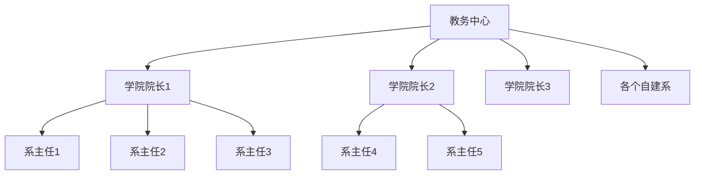

# 社区简介

本社区的名字为帽子社（暂定），**终极目标**是实现一个虚拟大学的社区。

社区内的所有人都可以自由建立院系，并安排自己的教学体系。感兴趣的同学可以加入。


游戏教学


游戏设计


# 痛点分析

- 当前学校内的教育太水

  在当前大学的大部分课程，实际上都是水课。要不是就是内容严重脱离实际，要不然就是内容过于陈旧，技术上早已被淘汰。

  

- 互联网资源过剩，不成体系

  在反乌托邦名著《美丽新世界》中，我们看到了一个十分奇异的现象。真理实际上就摆在我们面前，但是却被庞大的信息所掩盖。虽然网络上学习资源非常多，但是往往不成体系，而且碎片化严重。

  例如我现在想要学习”数字媒体技术“的课程。

  我可以搜索到《C语言基础》、《java基础》、《图形学》等很多课程。

  但是目前没有任何一个社区能完整教授”数字媒体技术“大一到大四的系统课程。也就是说没有这样一个**一条龙**社区。

  

- 付费问题

  现在也有很多优秀的网课和系统的课程，但是多是付费课程。

  


# 核心设计点

## 让教育变成学习

一个社区想要长久存活，就必须有用户的长久活跃。那么问题来了，如何让社区内的家庭成员长久保持活跃？

想要解决这个问题，就要意识到保持活跃的好处。我为什么非要在帽子社进行创作？

实际上，我们很容易就能想到一个词语——”**费曼学习法**“。

所谓的费曼学习法，就是**用教别人的方式，来为自己掌握知识**

在社区内，需要制定自己的学习计划。并定期打卡完成。

例如某同学，在社区内想要学习计算机考研的内容，那么每周就需要发表自己的学习总结。或者发表自己对某个知识点的理解。


## 去中心化的社区

帽子社和其他教育机构最大的区别，就在于帽子社并不是一个培训机构，而是一个教育社区。也就是每个人都有权力建立自己的院系。注意，一般用户只能建立院系，不能建立学院。学院是由教务人员统一安排的。


## 体系化的社区

这个是为了解决互联网资源过剩，不成体系的痛点。

体系化体现在以下几个方面

- 建系的系统化

  在帽子社中，如果要自己成立院系，必须进行大一到大四的学期安排。也就是一共有哪些专业课。

  并且除此之外，还有选修课和进路课。

  必修课是指必须学习并按照顺序进行学习的课程。选修课则是课程额外的课。

  进路课，则是完成了必修课之后可以学习的课程。

  以计算机科学系为例，结构如下：

  

  

  计算机系——大一（必修）——C语言

  计算机系——进路课——考研408

  

  ```mermaid
  flowchart TD
  	subgraph 必修课
          大一 --> 大二-->大三-->大四
      end
      subgraph 选修课
          git 
          计算机硬件常识
          
      end
      
        subgraph 进路课
         考研
         找工作
          
      end
      
  ```

  

  ```mermaid
  flowchart TD
  
  ```

- 视频的体系化

  每个社区的成员，在发表视频的时候，都需要将自己的内容进行划归。

  例如某同学想发表一个他计算机考研的复习视频，那么他就需要需要在计算机学院——进路课下发布。
  
  
  
  也就是说，建系的时候先规定好整个体系。然后成员发布的视频需要在这个体系框架内。以便其他人观看。
  
  


这种设计是为了解决传统课程中没有考研课程，或者就业课程的问题。


# 体系设计

本社区中，从上至下的结构如图：




- 教务中心

  直接的管理层，并提供各项教学服务。


# 早期规划

社区的成立必须要有人。

在前期的目标就是宣传社区的理念，吸引更多人加入。

在前期一共有两个具体工作

1. 打造自学环境
2. 制作教学视频

具体安排

1. 大家首先全部在一个QQ群内，每周末进行一次会议，督促彼此的学习进度。

2. 学有余力的同学可以去出一些系统教程

   例如现在游戏策划。全网都没有一个系统专业的课程，我们就可以打造一个专业的培训课程。


# 中期安排

1. 开发帽子社平台


# 计划表

周计划

|        | 下一周计划         | 系列计划     |
| ------ | ------------------ | ------------ |
| Arkits | MC中服务器搭建一集 | MC服务器搭建 |
|        | 建筑参数化         |              |
|        |                    |              |


