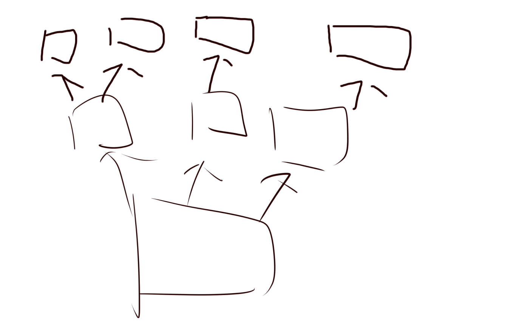

# 讨论信息

许慧坤：拔胡子，跟随节奏拔胡子

lyrics：每一个root，都是另一个的叶子

分形几何

王启杰：

- 本是同根生，相煎何太急。道，太极。肉鸽。

- 叙事，因果

柯冠廷：

- 《生长球》

- 落叶归根，

ColinXu：

昆虫冒险，最终回到老窝。

多个root的叠加，形成**roots**。

点炮：

玩家在游戏中不断的舍弃某个东西，最终会剩余一个，这个就是root

逆向思路。

舍弃的时机，开始舍弃，获得之后舍弃。

书封影：

植物，从根部长出新的植物。

根部可以生长，根部破土而出之后，可以产生新植物。植物需要消耗营养。玩家需要平衡生长速度和营养补给。

WoodCharcoal：

和书封影有点像，但是目标仅仅是一株植物，玩家消耗营养生根啥的都差不多，而游戏不仅仅是单纯生长，而是有一些“色素”在土里，玩家由此可以改变植物的颜色，可以设计一个上色模型，然后每次挑战成功后这株植物可以保存，放在花园里。

**不一定只有一种植物。**

ColinXu：

不一定只有一种植物 我们可以说除了竹子之外还有土豆大蒜水仙花之类的 同时体现diversity还有common的特色（

Oio_：

桌游，

闫辰祥：

root的含义：

- 起源
- 根部
- 

# 人员分工

| 人员         | 职能                        |      |
| ------------ | --------------------------- | ---- |
| WoodCharcoal | 美术                        |      |
| 闫辰祥       | unity程序，轻音乐作曲，策划 |      |
| 小陶         | 美术                        |      |
| 知不知       | UI设计 UX设计 音效/音乐制作 |      |
| mowgli       | 策划，UE程序                |      |
| ColinXu      | 围观                        |      |
| 滩滩         | 建模和SHADER                |      |
| 点炮狂魔女巫 | 美术，策划                  |      |
| 王世杰       | unity程序                   |      |
| Olo          | unity程序                   |      |

# 游戏基本信息

- 游戏名：动植物
- 游戏类型：城镇建设+回合制战略

游戏中玩家将扮演一个动植物，玩家在游戏中不能移动，但是可以长出许多根系，来获取旁边的资源。同时也可以长出一些器官，例如攻击器官，防御器官。

# 游戏规则设计

- 游戏开始，玩家会拥有50点资源

[! ]
  

- 每回合玩家的一个结点消耗一点营养

- 玩家可以从某一个结点的8方向上生长出一个器官

  

- 这些器官也可以继续从上一个生长

- 生长的时候不能互相重合

  

- 器官有多种类型

  

- 器官同样可以升级

- 但是要注意，父节点被摧毁，子树也会被销毁。所以如何保护好父节点非常重要（

- 地图中有许多地形，不同地形有不同的buff，例如矿场，地下古迹，地下迷宫。

- 玩家需要自由探索地图，
- 游戏需要玩家在地图中找到3个培养基（暂定）在这里可以培育花朵/果实，最后结出种子。长出一个新的结点
- 最终玩家会在探索完毕3个培养基的时候遇到boss，boss同样是一个类似root的存在，可以移动，并从一些器官发射子弹等。不同boss有着不同的特性。

- 之后在这个新的root结点基础上开始下一关。
- 

# 系统设计

## 资源设计

| 资源类型 | 说明                                   |      |
| -------- | -------------------------------------- | ---- |
| 营养     | 可以从土地中获取，从地下河可以双倍获取 |      |
| 金属     | 用于升级或者铸造                       |      |
| 。。。   |                                        |      |
|          |                                        |      |
|          |                                        |      |

## 器官设计

| 器官                 | 作用           |      |
| -------------------- | -------------- | ---- |
| 核心root             | 核心，失去会g  |      |
| 须根                 | 采集地下的资源 |      |
| 大脑                 | 提供升级选项   |      |
| 手                   | 攻击或防御敌人 |      |
| 胃                   | 锻造装备       |      |
|                      |                |      |
| 其他器官可以升级解锁 |                |      |
| 或者探索地图时解锁   |                |      |
|                      |                |      |

## 大脑的升级

大脑处可以升级整体的效果

| 科技名称  | 说明        | 需求   |
| --------- | ----------- | ------ |
| 须根加强1 | 每次采集2点 | 1大脑  |
| 须根加强2 | 每次采集3点 | 5大脑  |
| 须根加强3 | 每次采集4点 | 10大脑 |
|           |             |        |
|           |             |        |
| 胃        | 可以建造胃  | 10大脑 |
| 。。。。  |             |        |
|           |             |        |

## 其他器官的升级

## 合成系统

在建造了胃部之后，可以消耗铁，金等元素来锻造武器护甲。并让手来装备。

| 名称     | 说明                           |      |
| -------- | ------------------------------ | ---- |
| 刀       | 可以攻击周围9格的敌人          |      |
| 弓箭     | 可以攻击半径为3的4邻域直线距离 |      |
| 。。。。 |                                |      |
|          |                                |      |
|          |                                |      |

## 探索系统

在游戏的探索中可以分为以下几类

- 野生动物，攻击之后得到肥料（资源

- 避难所废墟，得到食物，或者武器

- 人类基地，击败之后得到食物，武器

- 图书馆，得到信息

- 同类分支，可以选择嫁接过来，或者拒绝

  同伴可以聊天，对话（

- 地下湖，增加资源采集量

- 核废料埋葬处，可以获得一个随机buff（就是神殿系统

- 

## 关卡结构

类似于王国的设计。

虽然有许多关卡，但是本质上还是一个大关卡。

玩家打完第一关之后，会用3个培养基培育出来的种子在新地图探索。

然后随着探索到的古达文物变多，逐渐了解到故事的剧情（例如，人类被核辐射了什么什么的

最终最后4个小关卡打完，游戏胜利

## 剧情设计（暂定

人类核战争之后，大量难民受到了核辐射。玩家也是。并因为核辐射变异成了一种半植物半动物的生物。

玩家在游戏中失忆，需要探索地图才能回想起来。

最终玩家会摧毁战争首领的地下基地。但是自己的家园永远失去了（误

# 废案

双人棋类游戏

- 分为两部分：地上和地下。

  地上负责使用营养来结出果实。

  地下为一个类似围棋的设计

- 玩家各在棋盘两侧，需要分别向下发展根系。

- 玩家如果穿透敌人的根系，可以切断敌人的分支。

- 如果包围了敌方根系，则也判断为切断

- 被孤立的分支会死掉

- 每回合，每个结点可以提供1点营养

- 资源可以向上生长树枝，每生长一节费用分别为100，200，400，800，1600

- 树枝周围可以提供叶子，第一层提供2个位置，随着层数增加，叶子数增加

- 叶子可以升级为生成士兵的果实，也可以升级为花朵来升级科技。

- 最终击败对方的树木即可胜利

  

# 剧情设计

## 故事背景

公元114514年。人类终于完成了大统一。但是不幸的是，新的统治者政策强硬，人民对其政策必须服从。因此一座座危险的实验室就建立起来了。尤其是一些环境改造和生物改造的实验室。

主角正是XXX秘密生物实验室的资深研究员。刚刚订婚，事业也非常顺利。即将升职为实验室主任。事故爆发之前他其实已经意识到这个实验（多物种基因杂交）存在着巨大的隐患，但是自己不能违抗命令，只能继续研究。

事故爆发之后，就在主角等待帝国救援的时候。xxx政府下令完全摧毁这里。于是xx实验室连同无数的工作人员，以及周边的农村全部被夷为平地。并被永远深埋在地下100米。

100年后。周边的一次核试验引发了巨大的地震。将百年前的记忆重新翻出来了。

强大的电离辐射和实验的残存试剂进行了剧烈反应。最终完成了实验。主角的尸体被改造为了一种全新的生物——动植物。

## 关卡1

玩家出生在一片废墟之中，没有任何记忆和意识。单纯凭借生物本能进行着生长。

玩家周围有许多当年残留的尸体。玩家生长到目标位置之后可以和其合体。获得营养。

玩家可以进攻一些设施来了解故事的背景。随着玩家的生长，可以获得越来越多的信息。

但是当地军事基地也发现了玩家的痕迹。并下令摧毁玩家。玩家必须找到足够的营养，来开花结果。

结局是玩家的种子随风飘走，来到下一个地方。而玩家的本体被导弹彻底摧毁。

## 关卡2

玩家来到了一片农村之中，这里同样有着大量实验室。玩家也发现了很多同类的怪物。

这里生活的人类基本上都是罪犯和政府的反抗者，

## 关卡3

玩家来到了城市，这里非常繁华，人们生活的很幸福。

最终玩家见到了帝国的元首，他通过改造已经获得了永生。他告诉玩家，自己100年内为帝国鞠躬尽瘁，100年前这里还是贫穷的乡下，但是现在这里已经变成了繁华的大都市。为了多数人的幸福，必须要牺牲少数人的幸福。一棵植物分工明确，根部注定只能为花朵提供营养，一个植物不可能全部都是花朵，有人幸福注定就会有人不幸福。

而主角在一路上的冒险，明白不起眼的根部才是植物最重要的地方。植物可以没有花朵，但是不可以没有根部。

如果玩家杀死了boss，那么人类会重新陷入战乱。

# 阶段性反思

