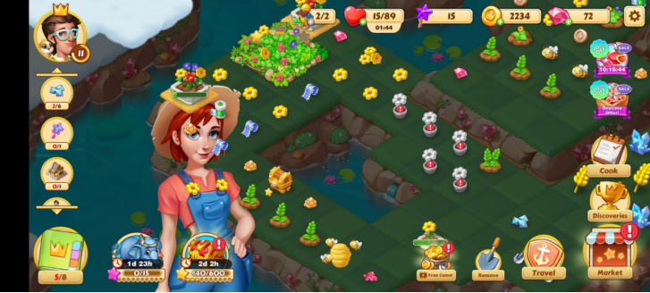

# 看前须知

1. 本文档完全免费，仅供广大策划朋友学习使用，不可以以任何形式售卖。
2. 题目并没有标准答案，里面的答案仅仅是本人个人的答案。仅供参考。
3. 请勿传播文档，下载学习之后请自行删除。


# 吉比特笔试

## 1
某回合制游戏有一个BOSS挑战系统，玩家申请挑战后系统随机派出黑熊妖皇、天煞狂狮、灭天血刺三种BOSS之一,战胜任何一只BOSS就能获得该BOSS携带的其中随机一件宝物。黑熊妖皇携带2个番天印和4个混元金斗;天煞狂狮携带有4个番天印和2个混元金斗;灭天血刺携带3个番天印和3个混元金斗。玩家参与一次该BOSS挑战并胜利后:
(1)他获得番天印的概率是多少?
(2)若该玩家获得的宝物是番天印，请问他挑战的BOSS是黑熊妖皇的概率是多少?

（1）$\frac{1}{3} * \frac{1}{3} +\frac{1}{3} * \frac{2}{3}+\frac{1}{3} * \frac{1}{2} = \frac{1}{2}$

（2）$P (A|B) = (\frac{1}{3}* \frac{1}{3} *\frac{1}{3})/\frac{1}{2} = \frac{2}{27}$

## 2
天帝举行修仙者智谋大会，评选修仙界最为智慧之人，其中一轮比试如下:
天帝为各位修仙者发放了60瓶天河水，其中一瓶添加了蟠桃液，可加速仙草繁育,且
每名修仙者有6株仙草，需要修仙者找出哪一瓶有蟠桃液。
同时已知蟠桃液加速效果生效需要一个时辰， 每名修仙者也仅有一个时辰的时间来分
辨。
备注: -株仙草可浇灌多瓶天河水
(1 )请问核心思路是?
(2 )详细分辨步骤为?

(1)利用二进制的思想，将60瓶水化成二进制,并用仙草来进行测试。
(2)
1.将60瓶仙水编号，并转为2进制。并将仙草排列，代表6位二进制。
2.若编号中有1,则对相应位置的仙草浇水。如第1瓶的二进制为000001,则给第六个仙草浇水。
3.同理给60个仙草浇水。
4.等待1小时之后，查看加速成长的仙草。将其二进制数字转为10进制，则代表哪一瓶是蟠桃液。


## 3
《魔兽世界》是一款知名的MMORPG游戏,被誉为魔幻作品的巅峰。
《魔兽世界》的战斗模式是3D即时制战斗。25人副本的团员配置往往有2个T,若干DPS和若干治疗角色。
请你为《魔兽世界》的25人副本设计一个BOSS, 有以下几个要求，请分别作答。
(1) BOSS是个大块头,巢穴在一个岛屿上，请你为它设计名称和形象。
(2)请你为BOSS写一段简短的背景介绍，不必拘泥于《魔兽世界》现有的背景剧情。
(3)战斗中，BOSS施放某个技能时会喊话“我恨护甲!”，请你根据喊话，为其设计一个技能或战斗机制。
(4)战斗中，BOSS施放某个技能时会喊话“我恨站着不动! !”，请你根据喊话，为其设计一个技能或战斗机制。

(1) 腐朽之树。从远看仅仅是一颗古树,而畸特之处在于它四周完全都是荒地，没有一 -点生气。但是一旦靠近,就会听到它发出低沉的怒吼，
然后被他粗壮的枝干击飞出去。

(2) BOSS作为古树一-族，本来生活在精灵森林之中。但是它却从小就极度社恐，无法和族群生活。长大后更加严重。在漫长的岁月肿，不断
移动自己的根系，最终来到这座孤岛上。因为极度反感有生物靠近他，因此会攻击所有靠近自己的生物。

(3)当BOSS的HP低于60%的时候，BOSS会喊这句话。 效果为:树皮脱落，防御力降低;攻击速度大幅上升。而且会分泌树脂来远程攻击玩
家。沾到会降低移动速度，并且赋予中毒的效果。

(4)当BOSS的HP低于40%，BOSS会喊这句话， 之后会拔出自己的根部，站起来攻击玩家。BOSS移动过后的地方会留下树脂。树脂会随时间消失。BOSS的根部会缠绕玩家，被缠绕之后需要队友的救援。或者随时间挣脱。


## 4
强化一件装备该装备初始等级为0级,每强化成功+ 1等级,失败-1等级(最低为0级),强化概率为50%;计算强化到+ 3等级需要的强化次数期望。


# 西山居笔试

## 1
你只有两个长方体的单面开口的塑料盒子，分别可以装水10升和18升，请问，9个村民放了9口空缸在你面前，分别要1升到9升水，你有无尽的水可以装,请问是否能满足这些村民的愿望，设初始两盒都是装满水，请分别写出倒水的步骤,并且步骤尽可能少。


## 2
玩家在副本中因为打败BOSS获得了3个宝箱奖励:青铜宝箱、白银宝箱、黄金宝箱各1个,打开3种宝箱有均一定几率获得1个玄晶，几率如下:
打开青铜宝箱获得玄晶的几率为0.3
打开白银宝箱获得玄晶的几率为0.5
打开黄金宝箱获得玄晶的几率为0.7

问题1:玩家打开3个宝箱以后，至少获得2个玄晶的几率是多少?

问题2:强化武器需要消耗-定数量的玄晶，消耗的玄晶数量越多强化成功率越高。没有玄晶不能强化武器。已知:
消耗1颗玄晶强化武器成功率为0.3
消耗2颗玄晶强化武器成功率为0.6
消耗3颗玄晶强化武器成功率为0.9
如果玩家利用从3个奖励宝箱开出的玄晶强化自己的武器，强化成功的几率是多少?

（1）0.505

$0.3*0.5*0.7+0.3*0.5*0.3+0.5*0.7*0.7+0.3*0.7*0.5=0.505$


（2）获得一个玄晶为0.4，两个为0.4，三个为0.105

总概率为0.45


## 3

在一个符合物理规则的游戏世界中，存在这样一 个火炬谜题:
点亮区域内全部火炬(共5个)后可以解开谜题。
现在我们需要在此基础_上增加一-些解谜条件,使谜题变得更有趣。
举例: 5个火炬位于五角星的5个顶点，玩家需要按照五角星的一笔画顺序进行点亮。
请再设计三种不同类型的“点亮5个火炬”谜题，尽可能使其规则清晰，难度合理。

- 羊肠小道类:
	1.玩家需要一笔连到终点。过程中可以往回退,
	2.在五角星的道路上,粗细不同。画笔出界则视为游戏失败。
	3.五角星的道路.上存在多个机关:例如云雾，会隐藏部分道路。流星， 会划过屏幕，鼠标碰到视为游戏失败。转动，五确星会缓慢转动。
	4.每到一个结点何以存储游戏。
- 益智类:
	1.玩家长按屏幕可以从一个点发出一个火车，火车会按照五角星的轨道运行。
	2.玩家按键的时长会影响火车的距离。按键越长，火车的燃油越多，行走越远。
	3.除了起始点，玩家需要在5角中设置2个补给站。
	4.火车必须停在下一个补给站的范围内。
	5.从补给站出来的火车一样需要来长按屏幕启动。直到经过5点。
- 陀螺仪类:
	1.玩家需要将油填满五角星。
	2.玩家可以倾斜陀螺仪,使得油从某个顶点流出。
	3.五个顶点的顺序已被指定，若中途到达其他点则失败。
	4.在游戏开始后的10s后，开始点将会着火
	5.火焰会顺着油缓慢燃烧,
	6.若火焰烧到了玩家当前位置。且没有填满5个结点,则游戏失败。
	7.道路并不是完全笔直的。会有桥梁，岔路口等障碍关卡。


## 4
主角要去某地找敌人报仇,他的仇人功力深厚,极其强大,还带着不少的跟班，这是-场危险异常的战斗。目前主角具有如下的能力:

> 通臂拳:连续对身前敌人造成伤害，最后一招会击退敌人。 正常状态的强敌无法被击退。
>
> 破空拳:可将前方-定距离的玩家拉到身前进行攻击。正常状态的强敌无法被拉动。
>
> 迷魂弹:向指定区域扔出暗器，爆炸后一定时间内该区域的敌人可能昏昏欲睡。正常状态的强敌无法昏睡。
>
> 迷踪步:快速向指定方向闪躲一段距离，有短暂无敌时间。

根据上述内容，请为主角设计这个仇人BOSS,需要包含如下内容:

1. 指明游戏题材和类型,简述BOSS战环境和氛围。
2. 简述BOSS形象，设定其技能和战斗流程。
3. 为主角设计一一个合理的、 需要在战斗中临时学会的应对机制或技能。


1. 游戏为俯视角ARPG类型，类似于《暗黑破坏神2》。BOSS战会在一一个道馆中发生。道馆位于竹林深处，整体偏向色和深绿色。

2. BOSS是一个清瘦不苟言笑的中年男子。 内心只考虑利益，而没有情感。身着传统功夫装。
   技能:
   ●铁布衫:发动技能时，BOSS处于无敌状态。但是会被巨大的冲击力"破气”。
   ●梅花镖:向主角方向,扔出3枚梅花镖。随着BOSS第二 阶段，数量会增加。伤害较低。
   ●开山:蓄幼1s,并向主角方向短暂冲刺- -段距离。伤害高。速度快。

   

   战斗流程:
   一阶段的BOSS:
   1.当主角距离BOSS较远时，BOSS发动梅花镖。
   2.3次梅花镖之后会召唤3个小弟。小弟可以冲刺，小弟被击败之后会掉落少回血道具或者回蓝道具。
   3.发动铁布衫,此时所有的攻击都会无效。
   4.玩家使用通臂拳来将小弟弹反到BOSS处。接触到小弟之后，BOSS会眩晕。

   

   二阶段BOSS:站到屋顶之上
   1.发动铁布衫，此时所有的攻击都会无效。
   2.发射3次梅花镖。梅花镖速度和数量变多。
   3.召唤小弟。
   4.玩家使用通臂拳来将小弟弹反到BOSS处。眩晕BOSS。
   5.使用破空拳，将BOSS拉下来，造成大量伤害。

   

3. 机制:

   1. BOSS开山的速度快，需要玩家使用迷踪步逃离。
   2. BOSS的铁布衫需要玩家将BOSS的小弟弹反来接触。
   3. 小弟速度较快，需要玩家使用迷魂弹来眩晕。
   4. 第二阶段的BOSS需要破空拳来拉下来。


## 5

请在你玩过的游戏当中任选一 款,从**游戏设计角度**对其做得最好的一方面进行深入的分析和评价,同时对其做得最有待提升的一方面进行分析并提出改进建议。


我选择《心跳文学社》

《心跳文学社》是metagame的一 个里程碑。对于metagame来说， 最重要的就是其aesthetic设计，只要其aesthetic设计表达了后现代性,那么就是优秀的metagame。这也是MDA理论中最贴近用户层的部分。

作者在设计之初，因为想表现“女主角为什么不能自己追求爱情”这样的美学体验，设计了这个游戏。因此在游戏的底层其实是对传统游戏的反抗，也就是对meta-narrow的一种反抗。因此本游戏的底层是具有后现代性的。因此是一款优秀的游戏。

后现代性会改造现代主义审美，解决现代游戏审美疲劳的问题。因此会好玩，给人眼前一亮的感觉。而metagame本身存在问题。那就是会打破suspect of believee suspect of believe是叙事游戏中约定俗成的概念。而metagame会打破这个约定俗成的观念,引起玩家的矛盾感。所以说,我们不一定非要打破规矩,而是可以构造两层suspect of believe。在设定上让女主莫妮卡并不会真的认识到玩家的存在，不要强调这个游戏真的打破了第四面墙。而是仅仅告诉玩家莫妮卡打破了galgame的规则即可。


## 6

1. 没有截屏到第一个
2. 简要说明该玩法系统的内容和设计思路
3. 设计该玩法系统的原因是什么?目的是什么?
4. 你认为市面上没有出现这种玩法的原因是?


游戏介绍:本游戏是RPG回合类+SRPG+多人联机的设计troguelike的缝合。接近于《火焰纹章》多人版。这种游戏对于火焰纹章和传统RPG玩家来说都
是非常有吸引力的。


系统说明: .
1.在本系统中，游戏内的组队均由玩家来构成。
2.在每一个回合中,玩家可以进行-次操作,例如玩家可以进行一次移动或者使用一 次技能等传统RPG的一次回合内容。
3.游戏内分为两队或者更多以上。每-队玩家需要相互配合击败其他对手，或者地图的野怪等。
4.每次开始双方都是从level1开始游戏。杀死敌人或者野怪可以升级。
5.全地图都是开放的


目的说明:
1.在传统的战棋游戏中，玩家都是一个人控制整 个军队。因此衍生出了很多问题,有的色会冷板凳等级后期太低,无法参战。- 回合时间太长，非常
消耗精力。在长期的战棋游戏中需要刷凹点，这样将随机性变成必然性的行为会使游戏随机性乐趣大打折扣。
2.因此在本系统中,使用了roguelike的设计,玩家每一开始都是一 样的, 不存在等级平衡问题。避免了冷板凳问题。并且避免了刷凹点的行为。


为什么没有这种游戏: .
1.实际上这个系统不可以成为游戏的核心。因为RPG的三要素角色扮演、剧情、成长。这个系统根本没有剧情，会使玩家难以进入心流。
2.而且这种游戏开发出来主要会吸引SRPG玩家，而SRPG的核心就是要不断刷高难度敌人，打爆比自己等级高的敌人。同样的属性和等级,就需要看
玩家的策略，而战棋的策略性还是太低。玩起来很容易无聊。


# 西山居面试

## 1
设计一个弱引导场景，并用弱引导设计BOSS战

## 2
塞尔达传说的设计有哪些不足？可以有哪些改进？

## 3

有什么爱好

答：看番，打游戏（

喜欢的番剧，为什么喜欢？

答：喜欢《绝望先生》


## 4

如何评价二次元类游戏


## 5

如何制作一个武侠类型的关卡？并完成boss战？


# 4399笔试


## 1
分析微博，微信，陌陌的社交模式，并评价优缺点

## 2
游戏策划的5个必备品质

## 3
游戏中的每日任务，玩家一般都会觉得很无聊。如何改进每日任务的设计？写出三个方法。


忘了写的啥了，大概是下面的答案。

1. 利用压力释放理论，将每日任务改造成一个发泄类型的游戏。例如《DOOM》这种。
1. 将每日任务本身作为游戏的一部分。例如《动森》也很无聊，但是其无聊就是其游戏本身。也就是说把每日任务变成生活。
1. 将每日任务加上养成系统。冒险中可以获得一个摇钱树。每天都会成长。每日任务越多，可以获得的肥料，树木就越多。每次进来都感觉在收钱。

# 忘了哪个厂了


## 1

一款游戏中大额付费的用户和小额付费的用户战力差值很大，设计一个能够将大家放到一起的PVP玩法。


没有截屏答案（


## 2

描述对玩家在游戏内结婚的执行及判断流程


分析部分:

- 双方要进行结婚，说明在游戏内经是很熟悉的关系了。
- 结婚是一个游戏内增加玩家滞留的设计，需要双方在游戏内的时长较长或者游戏流程较后时开放。
- 因为国内对于同性恋的态度并不乐观，因此双方需要是异性关系。
- 结婚是一个较为神圣的行为，因此在游戏中结婚不应该过于容易，需要一些]槛。


```js
let 玩家1 = getPlayer(e)
let 玩家2 = getPlayer(1)
if(是否为同性(玩家1,玩家2) == true){
	系统提示("双方不可以为同性")
	return false
}
if(玩家1.没有通过第四章剧情| | 玩家2.没有通过第四章剧情){
	系统提示("进度未达到")
	return false
}
if(高感度为max(玩家1 ,玩家2) === false){
	系统提示("双方好感度不足")
	return false
}
if(!(玩家1.持有结婚戒指| |玩家2.持有结婚戒指)){
	系统提示("需要有结婚戒指")
	return false
}

系统提示("恭喜结婚! ")
return true

```


## 3

款MMORPG 的游戏中有宠物玩法。宠物可以进行变异，最多有九种变异状态。但美术针对同 种宠物只能做出4个外观有进阶变化的资源， 请问这4个资 源如何分配给九种变异状态会更吸引用户付费呢?


分析部分:

可以将玩家的付费思维设计为两种

1.付费以避兔游戏内的重复工作

2.获取付费专属外形


设计部分

可以将宠物的变异状态按照难度进行划分。一共分为三种难度外形和付费外形。变异状态不妨设为1到9，9种。


| 低难度 | 中难度 | 高难度 | 付费 |
| ------ | ------ | ------ | ---- |
| 1      | 5      | 8      | 9    |
| 2      | 6      |        |      |
| 3      | 7      |        |      |
| 4      |        |        |      |


说明:

前1到8中变异状态的获取难度按照指数倍增,前四种获取时间控制在一周或者半个月内。5到7状态，设计控制在半年左右。而8状态的获取时间控制在一年内。而玩家如果付费，则可以直接购买8和9两种状态。8状态的付费金额设置的较低。让大部分玩家都可以能够进行付费。而9状态金额较高。主要吸引已经集齐八种状态的收集玩家。和希望获得专属外观的付费玩家。

# 米哈游笔试

## 1

[从题目A、B中选择- 题完整作答即可(答案第- -句话请表明选择的题目代号) ]

题目A:

以[博物馆]为主题,为任意-款你熟悉的米哈游产品设计-一个[版本主题活动]

背景信息:

a.需求符合所选游戏的定位和内容调性

b.活动- -共开放2周，需在前期提供适当的新内容逐步示出

请撰写-份策划文档，需包含以下三个方面:

1)活动的预期体验(限300字以内)

2)活动的设计思路(限500字以内)

3)活动的玩法流程(制作线框图，可使用工具或手绘，*可离开该页面作图)


题目B: 

选择一个你熟悉的手游(游戏本身不带Rogue-Like要素)， 结合其核心战斗，设计-一个持续7天的Rogue-Like活动玩法。

要求:

a.鼓励玩家每日参与;

b.活动持续过程中，玩家体验会有阶段性的变化。

1)规划设计活动结构; (限300字以内， 可用线框图辅助说明)

2)活动的预期体验; (限300字以内)

3)阐述Rogue-Like流派的设计思路，并设计其中-一个具体的流派。(限400字以内)


B

我选择《传奇商店》
该游戏是-个养成放置类游戏,玩家需要经验商店,贩卖道具,升级店铺。 也可以雇佣冒险家冒险,探索地下城。

1）本游戏rougue化的思路是:在游戏世界中，发现了神秘的地下城。地下城拥有很多宝藏，玩家可以雇佣冒险家来探索。前10层，负责游戏玩法的教学,以及感受rouguelie中损失道具的特性。后面30层可以和。-次必须攻略10层。每日最多可以攻略10次。在第3天之后,会加入工会,并开放pvp。玩家可以和工会合作,一同冒险,也可以去掠夺别的工会。死亡之后会掉落物品,掉落物可以被别的玩家拾取。每-层大概5一10分钟内。

游戏的活动结构可以分为三个部分:

1.单人冒险阶段:玩家在本阶段,需要熱悉地图特性,哪里有陷阱，以及哪里有捷径。以及前期的资源获得。防止在大工会加入让小公会成员无法得到资源。

2.公会合作与工会战阶段:在本阶段,玩家可以尽情来享受随机的趣味性。- -方面可以去击杀怪物和玩家获得大量资源，另一方面玩家也要担心自己死亡之后的损失。


2）本活动的预期目的是为了尝试放置养成和rogue的结合，其次是让玩家使用平时不常使用的道具，促进氪金。因此预期体验有以下几点: 

1.玩家能够意识到游戏的可能性,保持对游戏的新鲜感

2.玩家在地下城中可以获得大量珍贵道具,因为rogue中道具栏有限，因此可以促进大量使用平时不舍得使用的道具获得游戏快感。并了解到这些道具的强大。为以后付费提供思想基础。

3.在不改动原游戏机制的情况下，尝试对游戏进行扩展,不损失原来的用户群体,并增加新的roguelike玩家群体

4.工会战的掠夺性与roguelike的永久损失属性相结合，会极具戏剧性，因此可以让宣传人员大量宣传游戏中的趣味视频，获得高热度。


3）rouglike游戏如今并没有流派之分，但是在早期GDC大会上,一一些游戏设计师确实提出了 "柏林诠释"，尝试为roguelike游戏划定设计理论。该理论也成为了roguelike的设计基础。因此我将以柏林诠释为基础，设计-个盗墓类游戏。

1.画面:游戏的画面必须用字符填充。这将引申为,游戏画面简洁,并能够充分意识到画面的网格性。因此画面中，都以网格为基础，每一个网格都具有其自身的功能性，例如岩浆代表烧伤,草丛可以增加隐蔽值并减少速度,古墓可以生产古尸等。

2.回合制:玩家和敌人的行动都必须是回合制的。玩家的每一步行为都必须有充足的时间思考。这也意味着,玩家会拥有很多解密类技能,战斗本身就是解密。例如玩家可以拥有炸弹,炸弹3回合会爆炸,杀死周围9格的生物。3个古尸从前方3个方向过来,玩家就要计算到底扔多远，什么时候扔。

3.永久死亡:游戏中所有的道具都会永久消失。但是近代生活节奏过快，无法再延续者传统,因此可以修改为roguelite. 玩家的道具会丢失，但是玩家可以在古墓外健身,交友。这些属性并不会消失。

4.随机性:游戏中，古墓的地图都是随机的，道具掉落也是随机的。而且为了增强趣味性，可以尝试在游戏内加_上随机事件。例如特定两个角色组队探索时，遇到某个机关时，或者地图事件时会触发一个随机对话， 增加buff。 也可以一定程度加强了玩家配比队友的趣味性。


## 2

某回合制游戏中有两种属性:攻击和血量。伤害公式为:伤害=攻击方攻击力,并且默认为角色先攻。现有角色A和怪物B，其攻击和血量会随等级增长，初始1级，最高10级。请设计角色A和怪物B 1级~ 10级时各级别的攻击和血量数值，要求满足以下条件:

1)角色A和怪物B等级相同时,角色A预期3回合击杀怪物B

2)角色A等级高于怪物B等级1级时，角色A预期2回合击杀怪物B

3)角色A等级低于怪物B等级2级时(包括2级) ，怪物B击杀角色A

题目:

1)阐述解题思路。

2)给出角色A和怪物B 1级~10级各个等级的具体攻击和血量数值(可以跳出本页使用Excel)。


1)首先列出来四个基本方程,设玩家攻击力, hp,敌人攻击力，防御力为y1, y2, y3, y4, 设等级为x,列出y=ax+b
然后根据题目的条件列出三个约束方程:


$$
x_1=x_2 \\
3y_1 = y_4 \\\\
x_1=x_2+1 \\
2y_1 = y_4\\\\
x_1+2<= x_2\\
2y_1=y_4\\
y_4-n*y_1>0\\
y_2-n*y_3<=0\\
n=int(y_4/y_1)+1
$$


## 3

假设你在做-个Mini-Project后， 在路演中需要用易拉宝(纵向的彩色海报，通常一人多高) 宣传自己的游戏,并招揽游戏玩家来关注游玩。分析以下3个易拉宝:

1)从好到坏排序,分析最好的好在哪里?最坏的坏在哪里? (限100字以内)

2)你认为最好的易拉宝，还有哪些可以优化的空间?说明优化点和理由，并用图示意优化方式。(手绘后拍照 上传或者使用作图软件均可，文字说明限200字以内)


（建议自己找图）


1)对于平面设计来说，我们通常需要站在用户角度分析:

1.游戏的标题是什么?

2.游戏的玩法是什么?

3.游戏的特色是什么?

因此我们可以列出表格:

|            | 标题是否醒目 | 玩法是否清晰 | 特色是否清晰 |
| ---------- | ------------ | ------------ | ------------ |
| 第一个游戏 | 是           | 是           | 否           |
| 第二个游戏 | 否           | 否           | 是           |
| 第三个游戏 | 是           | 否           | 否           |


2)第一个游戏的核心特色没有说清楚。

该游戏希望通过童年时期的游戏行为，来表达游戏的趣味性。但是宣传海报却宣传了自己的地图多样性和角色立绘。因该表达该地图正是玩家小时候心中的梦想，正是玩家一直所期待的场景。在立绘区域，可以重点强调希望玩家重回童年,打出自己的特色口号。


## 4

4.请从下列组合中任选-组(如为系列作品，可任选-作代入分析) :
A.《密特罗德系列》(或者 《死亡细胞》)《奥日系列》 《空洞骑士》 的关卡体验
B.《最终幻想系列》《女神异闻录系列》 《异度之刃系列》 的RPG体验
C.《原神》《崩坏3》 《战双帕弥什》 的战斗体验
对比分析对应的体验和设计的原因。(限600字以内)


A

密特罗德系列大多为横版关卡式冒险游戏。密特罗德系列的关卡体验可以用两个模式来总结:

1.探索

相比于传统的RPG要素，密特罗德更像是一款箱庭游戏。在初始阶段,玩家的探索区域少,随着玩家的成长，探索区域会增加。而探索区域增加，玩家的能力也会增加。这样-种正反馈的设计。
因此在此基础上,我们用以下几个点来概括其核心体验点:

1.非对称成长与非数值成长:密特罗德系列并不是传统RPG那样,玩家等级和敌人等级线性成长。这种线性成长的本质是为了维持心流。但是这种维持的方法，仅仅依靠了直观的参数一等级。 这种单一变量的成长 会让玩家很容易产生疲惫感。而密特罗德的成长维持了两个部分,第一部分是操作的开放，玩家会获得更多能力。第二个部分是玩家自身技术的提升。而关卡的敌人并没有直接的成长，而是会出现相对应玩家能力的新怪物。这就让成长感模糊化,进一步缓解了游戏的无聊。

2.分层探索:密特罗德系列的探索可以分为两层。第- -层是普通玩家。普通玩家得到新的道具,从而获得关卡弱引导,来主动探索未知区域。第二层是收集党玩家。游戏中会有很多直观提示的隐藏区域，包括邪道，在玩家得到能力之后，可以重新探索。而这种非强制的弱引导，一方面满足了普通玩家的探索心里，另- -方面也提供了硬核玩家的空间。大加强了游戏的耐玩性。


## 5

假设你的组长给你安排了-一个工作内容:两周内，在璃月的野外关卡地图里布置100个宝箱。

1)你要问组长哪些问题以明确组长有哪些需求。(限 100字以内)

2)简要说明你的设计思路,并说明你将如何安排这项工作。(限200字以内)


1)在关卡设计时，需要将其分层为,机制，美学,叙事。三个角度。因此在布置宝箱的时候，需要按照以上三个维度来思考。

在机制和设计角度。

1.需要询问,野外地图的地形，包括直接可达区域，技能可达区域，不可达区域，以及地图高度,颜色信息。宝箱在机制上是否是formalsystem的一部分?是否是必要接触目标

在叙事角度:

1.游戏的embedding narrow在游戏中的占比成分是多少?当我们为宝箱加入剧情的时候,是作为主线剧情的补充,还是额外支线剧情的添加?宝箱里面是否需要存在fake papers?仅仅充当叙事的一部分存在?

在美学角度:

1.这个美学是指代，玩家的美学行为，并不是美感。因此我们需要了解,游戏当前的aesthetic是什么。是轻松的游戏?宝箱是作为探索的奖
励。还是说类似魔塔,宝箱本身是puzzle的一部分?需要详细了解游戏节奏。


2)

1.宝箱的功能属性可以拆解为两部分。第-部分为引导，第二部分为奖励。因此,我们可以安排-些明显的宝箱放在地图中央区域。 玩家可以使用元素或者其他机制来解密,打开宝箱。或者也可以单纯拿到- -些剧情物品和补给品。

2.在地图隐蔽的区域设计谜题。玩家需要根据之前获得宝箱的经验来解开谜题，打开宝箱。或者在一些地图的边缘位置设置宝箱，类似于塞尔达传说的呀哈哈，为玩家制造惊喜.

# 剑心笔试

没有拍到题目

好像是给了三个技能？需要用这三个来设计一个关卡。

- 通臂拳，可以将敌人打退一格
- 迷魂弹，可以把敌人沉睡，但是对boss无效
- 迷踪步，可以向前一个闪现


关卡题:

玩法类型:遵循柏林诠释的roguelike游戏。

玩家需要一个一 个地进行移动。

如图，本关卡设计覆盖了三个设计点。


新手引导:玩家很容易理解并发现

1.玩家出生在右下角。目标是到上方的台阶区域。

2.灰色的怪物是无敌的，普通攻击没有伤害。并且因为区域过小，因此玩家会自然而然地使用击退效果的通臂拳。而敌人掉落到岩浆之后,道路会被打开。

3.水晶可以产生小怪,小怪掉落小血包,平衡战斗难度。


战斗:

1.玩家离开新手圈地之后，会进行战斗，因为怪物数量多,因此很难直接胜利，所以会自然想到使用迷魂弹，保证只有一个较强的BOSS可以战斗。

通关:玩家通过新手引导,已经明白了要把敌人推入岩浆,因此自然而然想到了把终点的敌人用破空拳拉进岩浆。通关。

进阶:

玩家会发现一个宝箱，此时虽然把敌人拉进来了，但是还是有一个岩浆挡住了去路。而聪明的玩家可以想到使用迷踪步，。迷踪步可以提供一个距离的闪现，刚好可以过去。而直接使用迷踪步还是会掉落岩浆。这样设计就可以体现关卡的新手引导，老鸟进阶和挑战性。


# 阿里巴巴笔试

## 1

设计师在游戏中推出了一件新装备， 附带能力" 每次攻击有10%几率造成10倍伤害”。设定价值为附带能力增加50%伤害”装备的4倍。新装备在推出后获得玩.家反馈如下:
	A:感觉根本没有10%的几率, 10刀根本爆不出一刀, GCH暗改几率吧。
	B:感觉是不是把倍率调低了?和我以前增加50%伤害的装备比起来推本的速度根本没快多少嘛。
试分析为什么玩家在游戏中会出现如此的反馈，并根据自己推测的原因提出调整的方向。(建议不超过 500字)


# 腾讯笔试

请你选择近期常玩，比较熟悉的一款游戏，完成3个问题

问题一（20分）

\- （1）这款游戏属于什么**类型/品类**？请做出判断，并解释原因

\- （2）这个游戏类型/品类最主要的**特点**是什么？列举并逐个分析（不超过3个）

\- （3）根据你对这个类型/品类的了解，推断当前该类型/品类的**用户特征**

*包括但不限于人口学特征、游戏诉求、性格或行为特点等*

若有数据、资料的引用，请在答题最后标注“数据来源”或“资料来源”。


（1）该游戏属于meta游戏。

因为该游戏以打破第四面墙的手法为叙事核心，而这种手法属于meta设计。该游戏以Meta设计为核心，因此属于meta游戏。

 

（2）Meta游戏并不是一个特定的游戏类型。Meta游戏必须依附于传统游戏类型，例如RPG、RTS等。Meta游戏的判断标准有且只有一个：gamecore中需要包含Meta元素。而Meta元素判断标准有且只有两个：

1. 关于game的game

例如开罗游戏《游戏开发物语》中，玩家要在游戏中开发游戏。这个就是很明显的metagame。

2. 超越game的game

这里的超越有两个方向：

①游戏本身超越了传统游戏的设定，或者游戏超越了自身的设定对现实世界产生了影响。例如《心跳文学社》，游戏中的人物越过了虚构层，打破了游戏中悬置不疑（suspension of disbelief）。这种游戏就是是典型的Meta游戏。

②玩家的行为超越了传统游戏所限制的范围。例如《塞尔达传说——旷野之息》中，有些玩家会在二周目的时候直接打完四神兽，来看NPC的反应。这种行为游戏角色理论上是不会做出来的。玩家的知识和记忆超越了游戏。但是塞尔达并不是以这种meta元素为核心的，所以塞尔达并不是Meta游戏。这种Meta元素虽然大量存在，但是市场上并无以该要素为核心的Meta游戏。

 

（3）用户类型分析：Metagame是后现代主义潮流下，在游戏领域的产物。所以我们可以用分析后现代主义艺术的方法以及分析meta元素的方法来分析游戏客户群体。

后现代主义的特征：

①反传统性

这也是meta游戏设计的核心思想。在席勒-斯宾塞理论中，游戏本身是一种审美体验。而长期游玩传统游戏的玩家，自然而然会感到审美疲劳。这时候，Metagame反传统的功能可以改造玩家审美，从而产生新的审美体验。所以说，Metagame的主要目标群体是***\*对传统游戏非常熟悉，以至于玩腻了的老玩家\****。

 

②元叙事（meta narration）的消亡

元叙事在这里指宏大叙事，在游戏中可以理解为某一种约定俗成的游戏机制或者成熟复杂的系统。这就是说，Metagame并不会追求宏大叙事，游戏本身就是无厘头的展开，也更具有趣味性。因此往往不会出现硬核（hardcore）的设计，这正是面向新玩家的有效设计。通过这种轻松但是又不失乐趣的机制可以***\*吸引很多抱着尝试心态游玩的新玩家\****入坑。例如我个人就是游玩了《邪恶铭刻》之后才开始游玩其它卡牌游戏的。也有很多玩家被《心跳文学社》吸引，才开始了解Galgame。

 

 

③拟象化与Meta的超越性

当今人们接触到的东西都可以被一个虚拟的符号所代替，这就是元宇宙的发展开端。Metagame同样拥有这个特征，玩家希望将情感符号化，寄托于游戏。而传统游戏缺少了和现实世界的直接交互，这时候Metagame能更好的肩负起这个责任。因此一些***\*在现实中孤独、寻求心灵寄托的玩家\****会寻找这种metagame。这种游戏比传统的Galgame有更强的交互能力，因此很多Galgame玩家都极其热衷于这种游戏。比如《ever17》《你和她和她的恋爱》等，大量的Metagame受众群体都是***\*资深的Galgame玩家\****。

 


**问题二**（15分）

\- （1）**拆解你选择的这款游戏**，包括但不限于内容、玩法、功能机制等维度，并**简洁概括各维度特征**，**填入模板**

\- （2）与同类型/品类其它游戏相比，这款游戏的**核心亮点**是什么？列举并逐个分析（数量不超过3个）

\- （3）这款游戏在体验上有哪些**主要痛点？**列举并分析原因，尝试提出优化思路（数量不超过3个）

若有数据、资料的引用，请在答题最后标注“数据来源”或“资料来源”。


1.选择的游戏名称：《心跳文学社》_____________

2.游戏类型是：______Metagame____________

3.玩该游戏的设备是：_______PC________

4.拆解如下


| 一级维度 | 二级维度     | 三级维度           | 该游戏在三级维度上的内容及简单说明                           |
| -------- | ------------ | ------------------ | ------------------------------------------------------------ |
| 机制     | 文字ADV      | 探索               | 游戏提供了大量的方式供玩家去尝试，例如在开始游戏前删除游戏文件，响应玩家的操作。对玩家的探索行为提供正反馈。 |
|          |              | 剧情交互           | 游戏的交互采用了写诗的方式来辅助剧情交互。而诗集本身又可以反应角色的设定，可以对游戏人物做出完善。 |
|          | Metagame     | 超越               | 游戏中有很多超越传统游戏的行为，例如莫妮卡会删除游戏文件等。这种操作对于老玩家来说非常新鲜，可以极大增加游戏趣味性。 |
|          |              | 反传统             | 游戏中实际上是在讽刺传统游戏的女主只能被动的接受程序安排，因此莫妮卡打破第四面墙实际上是传统游戏的枷锁。这也是整个游戏设计核心思想。 |
| 故事     | 一周目的日常 | 共通线             | 共通线是游戏剧情展开的地方，充满了叙事诡计。承担着让玩家放下警惕的作用。 |
|          |              | 写诗               | 玩家做出进入支线的选择，在叙事结构上承担着决定支线的功能，不可或缺。 |
|          |              | 个人线             | 个人线是游戏的高潮，作者试图给玩家一个虚构的美好，来强烈对比接下来的恐怖内容。 |
|          | 多周目的崩坏 | 学校内容           | 通过多周目的轮回，不断制造游戏的压迫感，为莫妮卡的内容做铺垫。 |
|          |              | 莫妮卡内容         | 本游戏的核心内容，玩家和莫妮卡的交流会让玩家有一种强烈的代入感，这是其他Galgame难以达到的。也是游戏中最精妙的设计。 |
|          |              | 结局               | 莫妮卡删除了游戏，故事结束。                                 |
| 美学     | 正常         | 立绘与CG           | 游戏中正常的CG实际上都是用各个组件拼接出来的，也就是用Sprite拼接的，可以更灵活的表达游戏中的各个立绘。本游戏的立绘CG整体上还是使用了传统的UI，这也是为了给玩家埋下陷阱。 |
|          |              | 日式Galgame        | 立绘以日式Galgame画风为基础，可以给玩家一种温馨放松的感受。每一个角色有三张CG，也采用了日式Galgame画风。 |
|          | 反差         | 立绘与CG           | 这部分的立绘是单独绘制的，以便更好表达伤核的设计。           |
|          |              | 伤核               | 游戏之所以采用类伤核的画风，是因为伤核艺术本身就是表达童年创伤和自我安慰，自我逃避的艺术。采用这种画风可以给玩家带来日常中强烈的违和感，更能贴近主题。 |
|          | 人设         | 三个女主           | 和Eva类似，游戏非常巧妙地选取了三个有着悲惨身世的少女。抑郁症、自残、家庭暴力等三个方面。这也是游戏后期莫妮卡对玩家交谈能如此动人心弦的原因。因为真的有很多玩家存在以上问题，莫妮卡对玩家的劝阻可以让玩家感受到被重视的感觉。这种人设和伤核相结合能给真正抑郁症的玩家带来无穷的温馨感，这也是心跳文学社能经久不衰的真正原因。治愈心灵的创伤，永远爱你的莫妮卡。 |
| 技术     | 灵活的功能   | Ren'Py框架         | 使用了Python作为游戏开发语言，动态语言在灵活性方面远超于其它强类型语言，非常适合Metagame的开发。对Python游戏开发者来说是一个宝贵的学习资源。 |
| 营销     | 免费游戏     | 精致但是免费的内容 | 游戏采用了免费的营销手段，在免费游戏中，凭借优秀的品质独树一帜，一下子获得了极高的口碑。 |
|          | 付费DLC      | 原声带和插画       | 付费DLC实际上是免费增加口碑的策略。这体现出开发者对玩家的尊重。 |
|          | 第二部       | 付费本体+新内容    | 第二部作者重制了游戏，并加入了新内容。这让之前的免费玩家获得了购买动力，并再一次造成热潮。 |


（2）核心亮点：

①反现代性和Meta元素的完美结合

《心跳文学社》之所以是一款优秀的Meta游戏，有一个重要原因，那就是它***\*完美的将反现代性和Meta元素相结合\****了。

在设计游戏的时候一个大忌就是自顶向下，不能为了设计一个Meta游戏而设计，Meta元素应该为游戏的核心服务。而《心跳文学社》的设计***\*逻辑是自洽的\****。玩家在游戏中发现不能攻略莫妮卡，这时候玩家就有一种需求，那就是希望攻略莫妮卡。这种场景在其他游戏中也经常出现，例如《美少女万华镜》前四部玩家都是不能攻略莲华的。因此莫妮卡的meta设计是为了解决玩家的交互需求，并且来讽刺其他Galgame种女主角不能主动选择自己命运的机制。

②免费游戏并且质量上乘

在现代社会，决定一个游戏能否成功的要素，除了其本身质量之外，很关键一个因素就是宣传力度。而付费机制就是极其重要，甚至决定性的要素。以国产独立游戏天花板《戴森球计划》为例，其销售总量超过了100万份。（数据来源于SteamSpy），而免费游戏《原神》在2022年上半年的流水就已经超过了200亿。

可以看到免费游戏对于玩家的吸引力非常大。同样的质量，要是能够做到免费，实际上获得的品牌收益会远高于付费游戏。

 

 

 

（3）痛点分析

①虚构层的破坏

metagame会强调game自身的虚构性，这会损害游戏和玩家之间的***\*悬置不疑\****。在现实中绝不可能出现的事物，如果在作品中出现，那么读者会避免带有批判性思维或者现实中的逻辑去观看，以便获得更好的体验。而metagame会强调自身的虚构性，这会严重破坏这种默契的平衡。

例如《心跳文学社》中莫妮卡会一再强调，她能够感知到玩家的存在。实际上我们知道，她不能。但是我们在游玩时却又不得不接受她能够知道玩家存在这个设定。因此这样的叙事逻辑会使玩家感到违和感。

肯德尔沃尔顿曾提出了一个观点：悬置不疑中玩家实际上并没有真的接受小说和电影的真实性。我们在观看凶杀电影的时候，并不会报警，这是因为我们知道电影的东西都是假的。这也是所有游戏都需要去解决的一个问题。

对《心跳文学社》的解决方案是：可以考虑在其中强化虚构层的虚构层。

目前心跳文学社的违和感来源于，莫妮卡强调自身的真实性，而玩家知道莫妮卡是假的。那么可以把莫妮卡是假的这件事情本身作为一个虚构层，例如她自身以为自己是真实的，但是实际上没有意识到自己并不是。开发者可以留下一个这样的支线，以供玩家去解锁。最后需要留下一个问题，莫妮卡是否真实存在，取决于玩家自身。莫妮卡一方面并不存在，但是另一方面，她的程序确确实实是存在的。我们可以这样将虚构层的决定权交给玩家，以解决这个问题。

②审美疲劳

该游戏最大的问题在于它在解决现代主义审美疲劳的同时，也会带来新的后现代主义审美疲劳。玩家在通关游戏之后，面对莫妮卡无尽的对话往往只能选择卸载游戏。通俗点说，就是很容易就玩腻了，不像其他游戏那样可以随时来一把pvp，每次都能有不同体验。

那么解决思路就是如何让玩家在进入游戏时获得不同的体验呢？

第一种朴素的方法就是采用机器学习的方式，引入自然语言处理的库，莫妮卡在和玩家对话的过程中自己也会学习，这样可以大大提高可玩性。

第二种就是采用玩家社区的方法，让玩家提供语料素材，由开发者维护社区，并维持游戏的更新。

第三种则是取消游戏多周目的设定。审美疲劳的原因在于重复大量的进行同一种审美活动。那么设定莫妮卡只能存活三天或者更短时间。这样不可挽回的机制就会让玩家更注重这三天的游戏体验。减少玩家重复的审美活动。


问题三（20分）

从你的角度，抓取**上文介绍的游戏品类相关**的新鲜事，并分析其新奇之处和其背后反映的用户需求变化：

最近两个月内，你在**该品类及其玩家、衍生圈子**发现了什么***\*新鲜且流行\****的现象/行为/趋势，或是新游戏？回答下列问题：

（1）清晰易懂地描述**新鲜事本身/流行程度/用户反馈 **+ **你觉得这件事的特色之处**是什么？

（2）你选择的这个新鲜事，是**如何流行起来的？**尽可能较全面地**推测背后可能反映的变化或小趋势**：

*比如消费人群变化、玩家心态变化、行业变化、产品商业模式变化、营销方法变化等*

（3）请尝试分别**从“玩家”和“研究者****/商业分析”的视角**，描述**这些**变化或小趋势可能**带来的影响**：

*“圈内人”视角可基于你与其他圈子成员的主观感受出发，针对情感、消费情况、纳新与留存情况等方面来展开对于影响的描述；从“研究者**/商业分析”视角出发，则可描述对于圈层用户/产品商业模式/行业未来发展等方面的影响*

若有数据、资料的引用，请在答题最后标注“数据来源”或“资料来源”。


（1）2022年9月26日，南京信息工程大学正式确认，该校信息工程系更名为元宇宙工程系。元宇宙的潮流不知何时起已经从我们的耳边来到了我们的身边。而元宇宙正式迈入“正经行业”也是一个非常重要的标志——元宇宙（metaverse）和元游戏（metagame）的时代已经到来了。

（2）metaverse和metagame都是后现代主义的产物。元宇宙最早兴起于科幻小说《雪崩》，而实际上真正促进元宇宙概念大火的时机是2021年扎克伯格将Facebook更名为META。这个事件仿佛水坝一样，让元宇宙的潮流冲入了各个行业。而和metaverse一脉相承的metagame也受到了很大的冲击。2021年也被称为***\*元宇宙元年\****。

下图分别是metagame《你和她和她的恋爱》和《心跳文学社》中，游戏评论数量数据，可以看到2021年有很大量的提升。


而metagame作为一个很早就存在的概念，也是在最近几年内开始逐渐走入大众视野的。因此可以说实际上人们对metaverse的理论并不熟悉，只是赶鸭子上架跟风。但是随着2022年的到来，metagame和metaverse的理论逐渐完善，在这个基础之上我们不妨预测在未来几年内的趋势：

①meta要素会更广泛出现在各个行业

正如我之前所说，后现代主义思潮下，宏大叙事自身就会被解构。各行业之间不会有很明显的区分。计算机行业可以和医学融合、物理学可以和化学结合、游戏可以和教育结合。万物皆可游戏。Metagame本身就不是一个特定的游戏类型，我们不妨大胆猜想metagame能不能和其他行业结合呢？上班本身是一个工作的过程，但是和metagame与metaverse相结合，工作本身就是在进行游戏的内容，这种泛娱乐化思潮会成为主流。

玩家对于游戏的消费也许不再是现实的直接反馈，而是对虚拟的反馈。充值，可以来给游戏中的虚拟老婆付费，而不是给自身购买虚拟货币。这种将付费模式拓展到币圈的方式可能会成为玩家的主流。

 

②metaverse将会和metagame更紧密的结合

人们实际上已经意识到了，当前的硬件能力和技术经验尚不足以实现真真正正的元宇宙。因此急需一个来作为缓冲的替代品。这时metagame和metaverse的结合将会是一个非常重要的路线。

这是因为元游戏本质上是超越游戏的游戏，玩家期待自己对游戏的交互可以反馈到现实生活中。而元宇宙则是反映了玩家在虚拟世界的拟象化。两者实际上都是单向的，而方向相反。但是如果能够充分发挥两者的优势，人们在虚拟世界所游玩的游戏内容，真实的影响到了现实生活。而现实生活又会映射到虚拟世界。这样既可以弥补当今metaverse自身的技术问题，同时可以加强游戏体验。。

 

（2）影响分析：

①meta要素会更广泛出现在各个行业

对于玩家来说meta作为一个时代潮流，会不可避免地融入生活之中。例如《赛博朋克2077》作为一个游戏，却动漫化了。这种”超越“的要素会越来越多的出现在我们身边。例如音乐软件会同时负担社区功能、购物功能，手机如今已经逐渐成为移动电脑的替代品。玩家所游玩的游戏，也不会再是仅仅一个类型，而是会有越来越多的类型相结合。甚至会出现游戏本身就是软件、网页本身就是游戏、工作本身就是游戏这种meta的设计。

 

而对于开发商来说，时代的潮流也是不可避免的，元宇宙是无论如何都是进行开发的。而如何合理有效地结合多个行业才是最关键的问题。元宇宙的开发不仅体现在一个软件上，打开网页、手机、电脑APP都可以轻松进入这个世界。这对各方面人才的需求量会急剧增加。掌握跨学科知识的人才，会逐渐成为人才市场的香饽饽。

 

同时开发商也会更积极地探索各个行业结合的可行性。例如网易再今年6月份发售的“网易春风元宇宙飞机杯”，将元宇宙、飞机杯、元游戏相结合，引起了一股舆论热潮。像这样多个行业结合的产品会越来越多。因此探索某一个软件的更多可能性，可能会成为是开发商们未来几年的着眼点。

 

②metaverse将会和metagame更紧密的结合

对于玩家来说，现在的元宇宙项目更接近于一个雷声大雨点小的商业产品。在未来，玩家也许会玩到基于metagame的元宇宙项目。依靠metagame多年的发展经验，这种项目的完成度和可玩性都会远大于当前的元宇宙项目。同样的，这种metagame和metaverse结合会带来更多的用户留存。

 

而开发商所面对的用户群体也会发生变化。Metagame本身所带来的群体都是游戏玩家，而当今metaverse项目的用户群体大多都是投资人。如何平衡二者的体验感是开发商要考虑的一个重要问题。开发商相比于之前的商品会更具有娱乐化。


（备注，我不同意我的观点，元宇宙就是纯纯乐色）


# 腾讯面试

记不太清了

1. 如果你加入，你认为你会给团队带来什么样的成果。

2. 如果没有带来你会怎么办？

3. 你做过leader吗？你认为怎么样当leader，怎么样管理团队？

   

# 某西安小厂

给了一个氪金+放置类+三效类手游，写一个分析案。


|                        | 游戏核心设计混乱，突出不足                                   |              | 游戏机制冗余                                                 |
| ---------------------- | ------------------------------------------------------------ | ------------ | ------------------------------------------------------------ |
| 合成机制与消除机制冲突 | 因此游戏的玩法核心在于不断将物品进行合成，因此趣味在于物体的积攒。而游戏中合成后的物体最后却会被销毁，也就是说玩家的付出最后会被消除。是违背游戏核心玩法的。因此可以考虑合成的物品并不会消失，并可以合成到一个永久的高阶建筑物。 | 烹饪系统冗余 | 本游戏中烹饪系统是作为收集紫色钥匙存在的。而烹饪系统，本身就是合成系统的一个重要分支，因此可以将扩展更多功能，例如制作的食物可以来售卖，或者合成其它物品。 |
| 合成的逻辑单一         | 游戏如果以合成为核心的话，就要有更多合成选项。游戏中只有做饭可以将多个素材进行融合。也就是说，合成的逻辑过于单一，只允许相同物品合成，不允许更多的合成可能。 除此之外，钓竿和照相机等物品，在收集的过程中，目的过于公式化。单纯就是为了合成而合成。而不是玩家自愿自发的行为。例如《星露谷物语》，玩家可以自由选择想要种植的作物。而本游戏中，玩家只能合成官方制定的物品。合成自由度低。 | 地形系统冗余 | 在三消或者合成游戏中加入地形设计，主要是为了增加解密要素。 而本游戏中，并不存在解密的关卡设计。同样的，例如《星露谷物语》这种合成类游戏，地形是为了丰富物品合成的种类而增加的。而本游戏中，地形设计仅仅是为了有一个地形而存在。因此可以考虑取消地图，改成单纯的麦田+功能区的设计，或者在不同地形下可以拥有不同功能。例如湖泊可以养鱼，草原可以种花等。 |
| 消除的快感没有充分发挥 | 本游戏的合成机制继承于三消机制，本质上是带给玩家消除快感的游戏。然而本游戏中能够体现消除快感的地方，只有物品合并时能够产生。因此可以参考三消游戏，考虑在多个物体合并的时候，增加更多奖励或者增加更多合并的机会。例如一次合并5物品个以上的时候，可以随机生成其他的物品，或者可以加速周围建筑物的速度等。增加更多融合的回馈。 | 道具系统冗余 | 通过农场和蜂房收集的道具并没有合理的转译成其他的物品。 这会导致玩家失去合成欲，建议加入更多合成机制，例如小麦可以做面包，面包可以钓鱼，养小鸡等。尽可能把循环机制利用起来。 |


|                                     | 交互机制不完善                                               |
| ----------------------------------- | ------------------------------------------------------------ |
| 滑动手势操作冲突                    | 在拖动界面的时候，本来只想拖动游戏界面，但是经常会拖动物体。 可以考虑加入二指移动的手势，使用两个指头来滑动屏幕，单指来移动物体。 |
| 合并机制交互层级过低， 容易造成误触 | 在合并物体的时候，因为手指会挡住界面，经常会错误的合并不想合并的物体， 因此在合并物体时，当界面内还有未合并物体的时候，可以加入二级菜单，提示还有未合并的物体，是否继续合并。玩家需要主动选择是否合并。 |
| 可合并物体不应该有可点击属性        | 游戏中，金币、魔法钥匙等道具既可以点击也可以拖动。这就会导致，拖动物体的时候不免会出现点击操作， 从而导致想要合并的物体被点击使用了。因此对于这种可点击物品，因该设计一个自动合并的队列，避免玩家直接操作。 |
| 拖动物体提示不足                    | 则在游戏后期，物品种类过多，寻找同种类物品会非常困难。因此可以考虑，在拖动物体的时候，高亮可合并的物体，提示玩家可以进行合并。 |


| UI设计问题                                                   |
| ------------------------------------------------------------ |
| 本游戏在移除花坛的时候，会产生类似经验值的王冠， 但是点击头像的时候却无法查看。也无法查看具体的经验值。 |


| BUG问题                                                      |
| ------------------------------------------------------------ |
| 在游戏进入的时候，有概率出现立绘错乱的情况， 需要点击左下角的每日任务才可以继续。 |
| 在进入第二个岛屿时，会卡在引导界面，重进游戏可以解决。       |
| 猜测可能是单机版原因，很多功能无法点击。                     |




|                            | 工人劳动时间不合理                                           |                      | 体力值消耗和工人劳动时间不成关系                             |
| -------------------------- | ------------------------------------------------------------ | -------------------- | ------------------------------------------------------------ |
| 工人劳动时间曲线系数不合理 | 工人的劳动主要体现在移除花坛、蜂房等。时间以花坛为例：分别为3s，5s，10s，15s，20s，35s，半个小时。而移除大花坛的时间最高达到40分钟。也就是说大致上是以线性速度递增的。但是问题在于，这种线性的曲线一般应用于指数函数的初期阶段。往往在游戏初期作吸引玩家达到Aha Moment而使用。而本游戏因为会频繁的合成和消除，因此大部分的时间都会集中在3s到一个小时以内。这就导致了玩家在游戏的时候，会处于两个阶段，可以短时间内完成工作的阶段，以及需要放置等待的阶段。这时候，一小时的等待时间会显得太短，半小时又会显得太长，整体上来说，会严重影响玩家的心流状态。 | 体力值消耗的数值过大 | 以我当前的体力值89为例，恢复一个体力需要3分钟，全部恢复需要4.5小时。而工人的工作时间过短，导致游戏中体力耗尽时，工人们仍然全部空闲。而购买的金币费用却高达350金币，这就导致玩家难以频繁的使用工人。这就会导致致命矛盾。工人的快节奏和游戏的合成机制，促使玩家需要频繁操作。而体力值又限制了玩家操作次数。 |
| 改进                       | 可以考虑，将所有的花坛移除时间都控制在2分钟以内。一个大花坛需要移除9次。也就是说完全移除一个花坛需要20分钟左右。这样高频率的交互可以让玩家保持一直点下去的动力。而广告流星大致10分钟会出现一次，玩家在放置的过程中就会有更高的几率去观看广告。而如果保持一个较长的移除时间，玩家更可能会每隔几个小时来抽空看一下游戏。而游戏本身没有过多的放置要素，因此会很容易导致无聊。或者可以考虑增加时长，以1分钟，5分钟，10分钟，1小时这样的指数函数来递增，以便玩家更好享受放置的乐趣。 | 改进                 | 可以考虑，参考《维纳斯假期》，推出周期活动。在活动期间，赠送体力道具，或者以低价格来出售体力道具。这样也能使玩家拥有更好的付费意愿。 |


总评价

游戏画面精致，玩法新颖，UI自然。但是游戏在机制上设计混乱。一方面希望玩家获得合成的乐趣，另一方面却把合成品收回，会影响玩家积极性。另一方面，游戏的数值设计较小，需要玩家频繁操作，而游戏的核心机制不足以支持玩家高频率游玩，很容易产生疲劳。同时高频率操作和游戏的放置玩法冲突。整体来说，游戏在前一两天会产生很强的趣味性，之后游戏乐趣会快速消去，变成了单纯的工作而不再是游戏。总体设计有待完善。 


# 悦创系统策划笔试题

## 1

根据你的游戏经验，填写以下表格：

| 类型       | 游戏名称             | 你玩了多久 |
| ---------- | -------------------- | ---------- |
| PC端网游   | 帝国时代3            | 300H       |
|            | 死或生维纳斯假期     | 85H        |
|            | 传奇商店             | 50H        |
| PC端单机   | 心跳文学社           | 50H        |
|            | 勇者斗恶龙           | 83H        |
|            | 茂伸奇谈             | 85H        |
| 主机游戏   | 塞尔达传说：旷野之息 | 350H       |
|            | 火焰纹章：风花雪月   | 250H       |
|            | 马里奥奥德赛         | 100H       |
| 移动端网游 | 合成大师             | 50H        |
|            |                      |            |
|            |                      |            |

 

 

## 2

如果一款游戏需要做一个卡牌收集的系统，暂定该系统有12个主题，每个主题需要收集10张卡，收集满一个主题会获得一定奖励，收集满所有主题会获得一个很丰厚的奖励，卡牌可以分星级和稀有度，游戏的核心玩法或付费可以获得卡包开出卡牌，怎么设计该系统，如何吸引玩家参与？

 

1. 因为要吸引玩家参与，所以我们需要知道吸引哪种玩家。

   根据巴图玩家模型，玩家可以分为杀手型、成就型、探索型、社交型

   根据题目我们可以判断出来，本系统主要是为了成就型玩家服务。

2. 因为玩家是成就型，如果想激励这类玩家，需要创造比一般预期玩家能达成的目标还要更高的目标 (如100%完成度，二周目或多周目的流程和玩法)。
3. 而前期的激励机制需要让玩家进入一种状态，那就是aha moment。因此，我们的难度曲线因该满足指数函数。也就是y = a^x+c。
4. 然后将收集难度建模为四个部分。

每个主题有10张卡，每个主题的概率独立。10张卡按照难度等级划分为四个部分。


| **低难度** | **中难度** | **高难度** | **付费** |
| ---------- | ---------- | ---------- | -------- |
| 1          | 5          | 8          | 10       |
| 2          | 6          | 9          |          |
| 3          | 7          |            |          |
| 4          |            |            |          |

 

 

其中高难度的设计是为了让玩家用金钱换时间，因此本游戏的节奏需要快。在第一天的时间内就需要完全获得低难度的卡。而中难度则需要一个礼拜，而高难度可以设计为一个月。

此时低难度是为了让玩家达成aha moment，而中难度是为了让玩家产生浸没成本。

高难度是为了成就型玩家产生乐趣。

 

在大的机制上，我们剩下的就是简单的添加小机制：

1. 让社交性玩家和成就型玩家交互：允许玩家互相交易卡牌。等级越高，可以开放的交易槽越多。开放更多交易槽需要付费。
2. 让杀手型玩家和成就型玩家交互：允许pvp，胜利可以拿走对方的卡牌。并且增加复仇机制，可以再次夺回自己的卡。
3. 每日登录/每日任务：掉落卡牌，并且有低概率掉落低稀有度卡牌。为了增加玩家浸没成本，并且增加成就型玩家的乐趣。

 

 

 

 

 

 

 

## 3

你和恶魔各持有一张数字卡，你持有的数字卡是2，恶魔持有的数字卡是4，但你们互相之间不知道对方的数字是多少。你们两都知道的信息为：数字为整数且你们两手上的数字相乘为8或16。

现设定规则，你们两只能用下面两句话中的一句进行对话且不能撒谎：

A. 我知道你的数字  

B. 我不知道你的数字

假设你和恶魔都极为擅长此类游戏，请推导出接下来发生的对话，直至你知道恶魔手上的数字，对话由你先发起。

1. 我先回答“我不知道你的数字“

   此时信息集合为：

   我知道我是2，我知道恶魔为4或8

   恶魔知道自己是4，恶魔知道我为2或4

2. 恶魔回答“我不知道你的数字“

   此时，因为恶魔回答了不知道。因此它不可能是8，因为如果是8的话，我必须是1或2。

   1的情况下，恶魔必须为8，或者16，因此我必须是1。

   2的情况下，恶魔则必须是4.而恶魔是8.

   因此两个都矛盾，因此恶魔不是8，因此恶魔是4.

3. 我回答我知道你的数字 

   此时我知道恶魔的数字为4。

4. 恶魔回答我知道你的数字 

   因为恶魔也擅长推理，因此我回答我知道的时候，我必须是2，因此恶魔知道了我是2。

 

 

 

 

 

 

 

 

 

 

## 4

请在下方表格第二行填写10个数字，其中第二行每个数字的含义为，第一行中与之位置对应的数字在第二行中出现的次数。

例如：

| 0    | 1    | 2    | 3    | 4    | 5    | 6    | 7    | 8    | 9    |
| ---- | ---- | ---- | ---- | ---- | ---- | ---- | ---- | ---- | ---- |
| N    |      | M    |      |      |      |      |      |      |      |

如果0下面填写N，那么0必须在第二行中出现N次

如果2下面填写M，那么2必须在第二行中出现M次


| 0    | 1    | 2    | 3    | 4    | 5    | 6    | 7    | 8    | 9    |
| ---- | ---- | ---- | ---- | ---- | ---- | ---- | ---- | ---- | ---- |
| 6    | 2    | 1    | 0    | 0    | 0    | 1    | 0    | 0    | 0    |

 


# 绝区0

## 1

完成一份迷宫关 卡的设计案，要求包含以下内容:

a)画出关 卡拓扑图以及迷宫内的玩家动线

b)设计迷宫内的玩法， 如解谜，战斗，收集等

C)写一份迷宫的通关/全收集攻略， 并说明迷宫的设计思路1.完成一份迷宫关 卡的设计案，要求包含以下内容:

a)画出关 卡拓扑图以及迷宫内的玩家动线

b)设计迷宫内的玩法， 如解谜，战斗，收集等

C)写一份迷宫的通关/全收集攻略， 并说明迷宫的设计思路


## 2

参考 Dota2, LOL等游戏，设计一个MOBA游戏内的技能系统实现框架。需要在设计案中体现:

a)如何结合表现， 实现具体技能

b)该框架的运行逻辑， 例如对何种条件监听，触发何种事件

c)若干个具体技能设计样板v


# Hoxi

拆解星露谷物语的 NPC 系统，把 NPC 行为树的配置表结构还原出来。举例：行为树的触发条件有“xx时间，资源到xx数量”，行为树的效果有“行动，对话，发邮件，改变状态.... 等等等”


根据星露谷物语的NPC的进行粗略分析，可以发现，NPC的行为可以分为2个枚举项：

- 行动：指NPC在地图中的移动
- 对话：指玩家触发NPC时进行的对话

这两个行为的逻辑是互相绑定的。例如在雨天的时候，NPC就会不出门，同时对话也会讨论天气。因此，这两者都可以用同一套状态来触发。

将行动抽象为具体动作，将影响因素抽象为状态。以“国民老婆”潘妮为例，可以得到下表：

（因为星露谷中NPC一天会根据不同时间拥有行为，因此时间系统也可以理解为一种状态。为了简化，这里进行了整合。）

| 状态触发                              | 行为                                                         | 优先级 |
| ------------------------------------- | ------------------------------------------------------------ | ------ |
| 1.当春天 2.当周一、周四、周日         | 8:10 上午 起床，走向Joja超市后面。 9:30 上午 站在Joja超市后面的小河边。 1:00 下午 前往社区中心右侧的小花园。 2:00 下午 在社区中心右侧的长椅坐下。 6:00 下午 走向拖车。 7:00 下午 进入拖车，开始洗碗。 9:00 下午 上床睡觉。 | 1      |
| 1.当春天 2.当周二、周三、周五         | 9:00 上午 离开拖车，前往博物馆。 10:00 上午 呆在博物馆内。 2:00 下午 呆在博物馆附近的桥。 4:00 下午 在2柳巷外边，送文森特和贾斯回家。 6:30 下午 离开玛妮的牧场，回家休息。 8:00 下午 晚上到家。 | 1      |
| 1.当春天 2.当周六                     | 9:00 上午 呆在她自己的房间内。 10:00 上午 离开家，在2柳巷旁边和文森特与贾斯见面。 12:00 下午 将贾斯和文森特带到小镇广场北面的操场，看着他们玩耍。 5:00 下午 送贾斯和文森特回城，将他们送到艾米丽和海莉家门口。 6:30 下午 回到拖车 | 1      |
| 1.当夏天                              | （下面的部分不再全部详细列举）                               | 1      |
| （省略）                              |                                                              | 1      |
| 1.当秋天                              |                                                              | 1      |
| 1.当冬天                              |                                                              | 1      |
| 1. 当和玩家是陌生人时 2. 9日和23日    | 上午6:00 在拖车中她的小床上睡觉。 上午9:00 起床后站在卧室里。 上午11:00 离开拖车，走到鹈鹕镇上冰淇淋摊旁边的桥上，并坐下。 下午4:00 回到拖车，洗碗。 下午6:40 上床睡觉。 | 3      |
| 1. 当和玩家好感度大于6时 2. 9日和23日 | 上午6:00 在拖车中她的小床上睡觉。 上午8:10 离开拖车，进入鹈鹕镇，在墓园左边的树下读书。 下午12:30 回家，洗碗。 下午4:00 离开拖车，在星之果实餐吧旁边的长椅和玛鲁坐在一起。 下午6:40 回家休息。 | 3      |
| 1. 下雨时                             | 上午9:00 起床，站在她的卧室中。 上午11:00 进入厨房。 下午1:00 洗碗 下午3:00 坐在沙发上，可能是在看电视。 下午6:00 回到卧室读书。 下午9:00 上床睡觉。 | 2      |
| 1. 结婚 2.周一                        | 8:30 上午 离开农舍去皮埃尔的杂货店。 2:00 下午 离开皮埃尔的杂货店，在镇上读书。 4:20 下午 坐在镇上。 6:10 下午 离开小镇回到农场。 10:00 下午 上床睡觉。 | 4      |
| 1.结婚 2.周二、周三、周五             | 8:30 上午 离开农场，前往博物馆。 2:00 下午 离开博物馆，和文森特与贾斯一起回到镇上。 4:20 下午 走到艾米丽的家，送文森特回家。 5:50 下午 前往玛妮的牧场，送贾斯回家。 6:30 下午 将贾斯留在牧场，然后回家休息。 8:10 下午 抵达农舍 10:00 下午 上床睡觉。 | 4      |
| 1.结婚 2.周四、周六、周日             | 整天待在农场。晚上10:00睡觉。                                | 4      |

优先级越高，事件会优先执行。例如，某一个春天的周一，同时下雨了。那么会同时触发两个状态，但是下雨的优先级更高，因此最终NPC会执行下雨天的行为。除此之外，送礼的优先级会更高，所有NPC都会立刻进行送礼对话的回应。但是送礼不会改变NPC的行为，因此不能算进入新状态。

此外，节假日以及后宫事件等不受状态的影响。因此在特殊事件时，玩家会传送到另一个地图。ai行为不受影响。

其他NPC的执行模式同样。但是对于特殊NPC，例如州长和爷爷等，并没有行为树的具体设计。


# 喵吉托

1. 怎么样改进《言灵计划》
2. 

