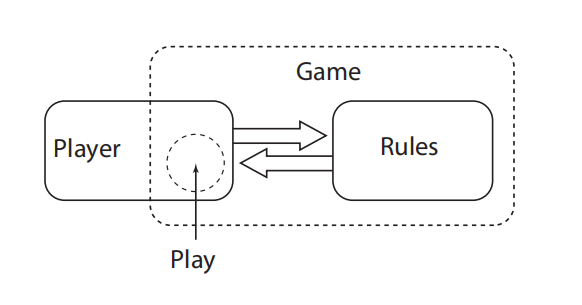

# 第二章

- 约束：情景由约束构成，构成情境的约束决定了玩家可以采取哪些行动，因此约束也决定了情境为玩家提供哪些选择。
- 最常见的约束就是游戏规则。
- 除了规则之外，游戏还有其它的约束。例如现实中物理学的约束，道德的约束等等。以及专业知识的约束。例如围棋棋手不会天元开局，但是实际上可以的。
- 例如棒球。规则没有禁止玩家飞起来。但是实际上受到了物理的约束。
- 大程度依赖物理约束的游戏叫做体育。
- 约束的动态的。在游戏过程中会发生变化。在当前情况下，实际正在限制玩家可以做什么的约束。被称为活性约束。
- 例如国际象棋有升变的规则，但是一般的对局这个机制用不到，而在残局时，因为有升变的可能，玩家的棋就会大大受到限制。这时，升变就从潜在约束变成了活性约束。
- **行动（Moves）是指改变活性约束的行为。**
- 根据约束的不同，我们可以分为三类约束系统。
	作为设计的游戏：指游戏的规则。
	作为体验的游戏：玩家在游戏中受到的约束，例如作为牧师就要多救人。
	作为理解的游戏：玩家受到外部的约束，例如文化，物理。
- 

   cinema. Cuts allow a cinematographer to do things that a theatrical director can’t. Images can be juxtaposed in meaningful ways; the narrative can 

   leap backward or forward in time, allowing the audience to imagine what 

   

   must have happened during the missing interval. The cut is a powerful 

   aesthetic tool and a fundamental, defining characteristic of film as an art 

   form.

2. 悬疑小说真的没有交互？脑内的交互不是交互吗？

   可以赢的书，但是却没有互动

   Furthermore, some books *are* winnable. Murder mysteries are books, 

   but they’re also puzzles. You win a murder mystery by solving the crime 

   before the detective does. The novel isn’t interactive—you can’t change 

   how it ends. But it does present you with a goal and the opportunity to 

   work toward it. The pieces you move when you read a murder mystery 

   aren’t pieces on a board, they’re pieces in your mind—suspects and sup

   positions and hypotheses. You’re trying to figure out an arrangement for 

   these mental pieces that fits within the evidence of text. A murder mystery 

   is winnable without being interactive.

3. 

4. 关于玩家的非交互问题

5. 获胜是为了获得特殊的美学体验（很有意思）

   Winning is a tool that can be deployed within a game to produce particular aesthetic（审美、美学的） effects, but it’s not essential for a game to feel playful.

Most approaches to game design are *transactional*.

transactional？？？事务性的？

作者认为游戏不一定是规则？

## 什么是Situational design？

Situational design更接近于非规则类游戏吗？不是玩家可以在游戏中干什么，而是游戏可以给玩家带来什么。

Situational design is different. It’s a *player-centric* approach to design 

rather than a game-centric one. Instead of focusing on the *actions* the 

player can perform, it focuses on the *situations* the player can encoun

ter. Some of these situations may invite interaction, but just as often they 

may invite anticipation, or interpretation, or introspection, and all of 

these ways to play contribute in their own way to the overall texture of the 

experience. Instead of assuming that all of the player’s actions are directed 

toward winning, it recognizes the existence of a range of other motiva

tions and provides a framework for analyzing how the game’s mechanics 

support these other goals.

赶紧这一段跟我的游戏设计有点像。玩游戏本身就是一种自我反思的过程。游戏的结局不重要。

meta游戏？

. This is not because the 

game adapts itself to its players, but because the play space that each player 

occupies is determined by their individual knowledge and intent.

玩家的游戏体验，是根据自己的知识决定的。这是meta游戏的定义。

游戏设计师之间真的有水平差异吗？

游戏之间的鄙视链真的合理吗？

3. 交互的图标面向功能，不要添加无用的图标
4. 交互的图标要简单，大小均匀一致

- 文字交互、语音交互、动作交互、人体行为交互
- 数据交互
- 图像交互：图像输入、图像识别、二维图像感知
- 

！！！说的很有道理

游戏的交互不一定发生在游戏中，而是发生在玩家的脑海。游戏的静止会带来玩家脑海中的思考。这就类似于战棋，象棋。游戏的静止不代表思考的停止。

By focusing on the player’s experience and not the game’s structure, 

situational design gives us a way to analyze how play unfolds during 

moments of both stillness and aimlessness. If play is something that hap

pens inside the player’s head, then we don’t need to design systems that 

keep the player constantly busy. We can deliberately craft intervals where 

the game holds still, giving the player room to mull over the implications 

and ramifications of their situation. Or we can deliberately create play 

spaces that don’t have any explicit goals, secure in the knowledge that the 

player’s own intrinsic motivations will carry them forward.

独立的游戏系统，里面的规则只能运用到自身

The notion that players invent strategies in response to the challenges 

presented by games is nothing new, of course. But since most games are 

designed along transactional lines, these strategies tend to be limited to 

effective ways to win. If you treat a game as a self-contained system, then 

the strategies you develop in response to it will tend to be meaningful only 

within that system. Getting good at *League of Legends* may have some 

spillover into your day-to-day life, but most of the strategies you learn 

from playing it will only be meaningful in the context of it or similar 

games.

而情景设计，更侧重于让游戏切切实实影响到玩家的生活。

也就是说，情景游戏，是一种游戏的设计方式。主要用于非交互游戏。或者非目标导向的游戏。

Specifically, situational design is good for analyzing non-interac

tive play—the moments during a game when the player is engaged in 

either anticipation or interpretation instead of interaction. It’s also 

good for analyzing non-goal-directed play—the moments during a 

game when the player stops trying to win and instead pursues some 

other objective such as performance or identity construction.

游戏通过允许我们做某些事，来传递信息

Much of the meaning 

that we take away from a game is not a function of the signifiers that it 

transmits to us, but rather of the things it allows us to do. Games don’t tell 

us things; they allow us to perform things. And that performance is where 

much of the meaning of a game lies

情景设计，不是传播，不是告诉玩家什么是什么，而是构建

By situating play in the mind of the player, situational design provides 

a new formalism for understanding how meaning emerges from an aes



thetic experience. Rather than meaning being seen as something that’s 

transmitted, it’s seen as something that’s constructed. Some of a player’s 

moves change the external state of the game, but other moves change their 

internal understanding of the game, and the effects of these internally 

directed moves can linger after the external game ends.

游戏的意义来自于accumulation of strategies，例如游戏《*Journey*》中，游戏并不是通过一个具体的能指（coded signifier）来告诉玩家陪伴。而是构建了一个空间。在这个空间中，陪伴是一个有效的策略。因此玩家在游玩之后会感受到陪伴。

So, the meaning of a game emerges from an accumulation of strate

gies. These strategies are a response to the structure of the game, not a 

recapitulation of it. *Journey* doesn’t contain “companionship” anywhere 

within itself. It doesn’t transmit “companionship” to the player through a 

coded signifier. Rather, it structures a space in which a move toward com

panionship is an effective strategy, and so after the game ends a lingering 

trace of that tendency toward companionship remains behind in the mind 

of the player.

（游戏的体验，来自于玩家自发的策略

|        | 我                                             | 策划         | 美术                               |
| ------ | ---------------------------------------------- | ------------ | ---------------------------------- |
| 9——12  | 学习Situational design，研究游戏设计，代码重构 |              |                                    |
| 13——15 | 策划案重构                                     | 策划案重构   |                                    |
| 16——20 | 代码重构                                       | 文案重构     | 新增立绘与UI，标题界面，CG，背景等 |
| 21     | 测试                                           | 测试         | 测试                               |
| 22     | BUG修复，卡组紧急扩充等                        | 紧急文案增设 | 紧急绘制                           |
| 23     | 如上                                           |              |                                    |
| 24     | 提交作品，以及各种资料PPT等                    |              |                                    |
| 25     | 多余一天以备特殊情况                           |              |                                    |

play（底层）：哲学、艺术学

core

gameplay（上层）：核心玩法

模仿、剩余

game as media  ：situation

international situationist

