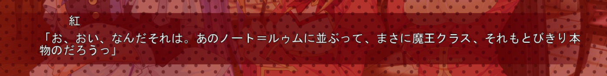

# 黒い翼

こうして：如此，这样

姿（すがた）：姿态

身体（からだ）

包み（つつみ）：包，包裹，包袱。

込む（こむ）：混杂；拥挤。进入其中

細い（ほそい）

密度（みつど）

触れる（ふれる）：【他动词・一段/二类】

 

根本的（こんぽんてき）：

響く（ひびく）：回响，震响

違う（ちがう）：不同 ，差别，不一样；错误，不对；不合，不应该，有出入。

巨大（きょだい）

暗黑（あんこく）

向ける（むける）【他动词・一段/二类】

 

必殺（ひっさつ）

生きる（いきる）：生，活

悲鸣（ひめい）

無表情（むひょうじょう）

あられもない：【イ形容词】不可能有，荒谬。不相称，有失体统。

謝り（あやまり）：谢罪，道歉

覚める（さめる）：【自动词・一段/二类】醒，醒过来；觉醒，醒悟；醒酒。

向かう（むかう）：相对，面对着，朝着，对着。

繋がる（つながる）：【自动词・五段/一类】

繋ぐ（つなぐ）：【他动词・五段/一类】

戦争（せんそう）

諦める（あきらめる）

命（いのち）

実に（じつに）：实在，确实，的确，真；竟，仅仅，足

にして：仅，转眼就；到了……阶段，才……；虽然……但是……，是……同时也是……

正に（まさに）：方，恰，当今；方今，正当。

犯罪者（はんざいしゃ）

見覚え：仿佛见过，眼熟；认识

振り返る（ふりかえる）：回头看，回过头去（看），向后（看）。

浮かべる（うかべる）：浮，泛。

 

 

様子（ようす）

年上（としうえ）：年长，岁数大（的人）。

 

若き（わかき）：年轻人。

乙女（おとめ）：少女，处女。

直す（なおす）：修理，修补，修复。

本気：真实，认真，当真，真的。

望む（のぞむ）：希望，愿望，期望，指望，希求，要求。

喜んで（よろこんで）

幸い（さいわい）

生憎（あいにく）：不凑巧，不合时机。

気がつく：意识到，注意到，觉察，发觉，想到。

周囲（しゅうい）

銀髪（ぎんぱつ）

銀色（ぎんいろ）

凄い（すごい）

電光石火（でんこうせっか）

生まれる（うまれる）：诞生，产生。

 喜ぶ（よろこぶ）：欢喜，高兴，喜悦。

大切（たいせつ）：要紧，重要；贵重。

義務（ぎむ）

振られる（ふられる）：被（异性）拒绝，被甩，受冷遇，碰钉子。（異性への要求が断られる。）

遅い（おそい）

遅刻（ちこく）

遅れる（おくれる）

貧民（ひんみん）

取り柄（とりえ）：优点，长处

しぶとい：顽强的，倔强的。

種族（しゅぞく）

通り（とおり）：来往；通行。

丁寧（ていねい）

迷宮（めいきゅう）

探索（たんさく）

午前中（ごぜんちゅう）：上午

提供（ていきょう）

なり...なり：或是...或是...；也好；...也好（选择）

どうせ：「副詞」无论怎样，无论如何；反正。

にしても：“就连......”，“即使是......也......”。

らしい：根据某些依据表示判断之意。

いい天気になるらしい：天好像要晴。

悪魔（あくま）

噂（うわさ）：传说，谣传，传闻，风言风语。社会上的谈论。

横（よこ）：横；宽度；侧面；旁边；歪，斜。

当然（とうぜん）

背後（はいご）

完璧（かんぺき）：完美，完璧，完美无缺，完好无损，尽善尽美。

おかず：菜，菜肴。

開く（あく）：【自动词・五段/一类】

飛び切り（とびきり）：（抜群の）卓越，出众，优秀，出色，特好。

ノルマ（norma）：定额，劳动基本定额。

増やす（ふやす）：繁殖，增殖，增加。

納得（なっとく）：领会，同意，认可，理解。

内緒（ないしょ）：秘密，不告诉（别人），私下。

夕食（ゆうしょく）：晚饭，晚餐，晚膳。

涼しい（すずしい）

ローブ（robe）：（长袖、肥大的）女袍

種族（しゅぞく）

厄介（やっかい）：麻烦；难为；难对付

叫ぶ（さけぶ）：大声叫。

起こる（おこる）：发生；由来；发作。

怒る（おこる）

起こす（おこす）

 

# 特別

奴（やつ）

戻る（もどる）

女性（じょせい）

気付く（きづく）：发觉，注意到。

姿（すがた）

ちなみに

そもそも：说起来。从一开始；最初。

出番（でばん）：出场，出面。

通り（とおり）：来往；通行。正如所想的一样。

努力（どりょく）：努力，奋斗，专心做事。

とは言え（とはいえ）：虽说…可是…

男子（だんし）

女子（じょし）

変（へん）

諦める（あきらめる）：断念；死心；放弃。

閉じる（とじる）：合上，闭上，盖上。

開く（ひらく）：

生まれ（うまれ）：出生，诞生。

横（よこ）

力（ちから）

はっきり：清楚，分明，清晰。

意識（いしき）

送る（おくる）

素振り（すぶり）：

失格（しっかく）

若い（わかい）：年轻

隠す：「他動詞」

隠れる：「自動詞」

突然（とつぜん）

当然（とうぜん）

噂（うわさ）：传说，谣传，传闻

事実（じじつ）

すっかり：全,都，全都;完全，全部；已经；

驚く（おどろく）

血統（けっとう）

組む（くむ）

根本的（こんぽんてき）

低い（ひくい）：低微，低贱，微贱。低，小。

申し訳ない（もうしわけない）

訳なく（わけなく）：轻而易举。不费事，容易，简单。

 

攻める（せめる）

受ける（うける）

消える：自動詞

消す：他動詞

周囲（しゅうい）

丁度（ちょうど）

置く（おく）

受け取る（うけとる）：领取；收纳。

確認（かくにん）

最高位（さいこうい）

界（かい）

手続き（てつづき）

完了（かんりょう）

 

書類（しょるい）：文件；档案；资料。

秒（びょう）

攻撃（こうげき）

 

空く（すく）

正直（しょうじき）

黙る（だまる）

多少（たしょう）：名詞

宜しい（よろしい）

報告（ほうこく）

用意（ようい）：准备，预备。

旦那（だんな）：主人，老爷。先生

人間失格（しっかく）

伸び（のび）：伸懒腰。

知識（ちしき）

増加する（ぞうかする）

