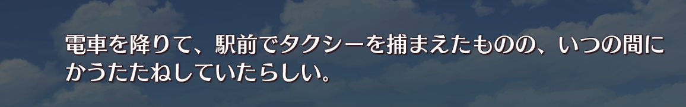
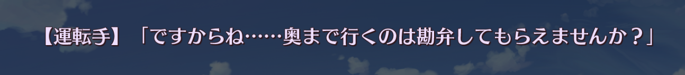
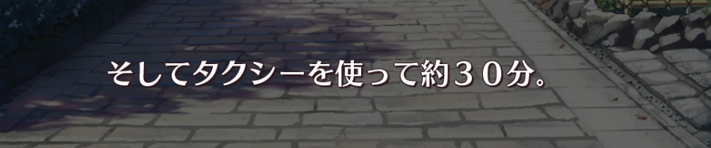
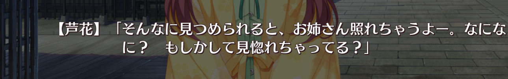
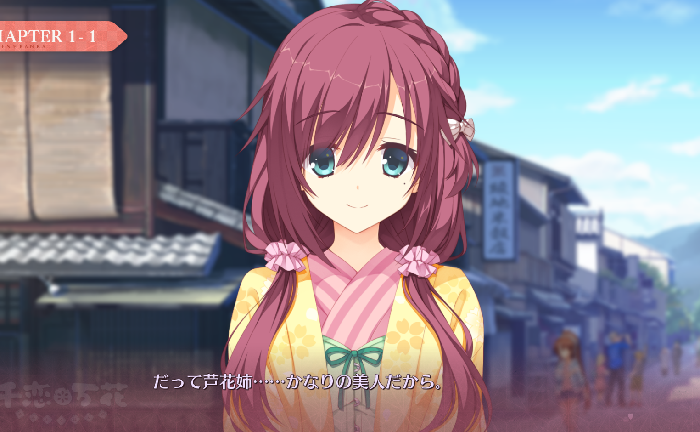
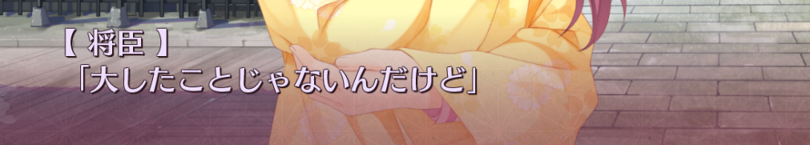
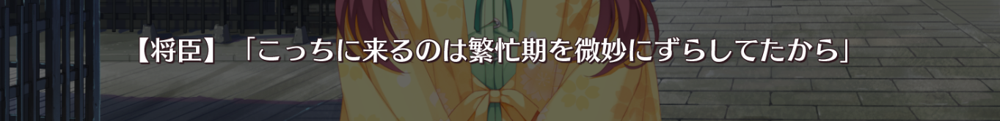
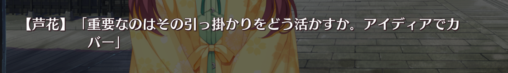

捕まえる（つかまえる）：（在路上）拦车

...ものの...

虽然...但是...（表示前项与后项状况相反）。

勘弁（かんべん）：原谅，饶，饶恕，宽恕，容忍

許す（ゆるす）

約（やく）

約束（やくそく）

交通機関（こうつうきかん）

校長（こうちょう）

公共（こうきょう）

公共施設（しせつ）

照れる（てれる）

かなり：颇，颇为；相当。

かなりの距離

大した（たいした）ことじゃない：没有什么了不起的

ずらす：挪一挪；错一错。

引っ掛かり：关系。关联。

# 文法（ぶんぽう）

...ものの...

虽然...但是...（表示前项与后项状况相反）。

将臣（まさおみ）