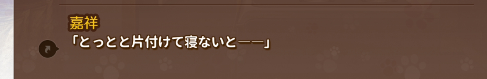
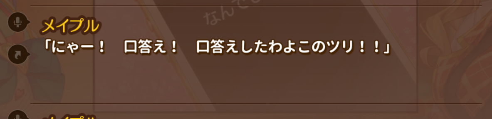

人見知り（ひとみしり）：（小孩）认生，怕生。

縄張り（なわばり）：地盘

わけ：理由

わけを説明する：讲道理。

運ぶ（はこぶ）：搬运，运送。

出来る（できる）：做好，做完（しあがる）。

米（こめ）

味噌汁（みそしる）

焼き魚（やきざかな）：烤鱼

置く（おく）：放；配置；

飼い猫（かいねこ）：饲养的猫

ずつ：一点一点地（等量）

好き嫌い：挑食、挑肥拣瘦，挑拣，挑剔

好み（このみ）：爱好，喜欢，嗜好

 

出かける（でかける）：想要出去，正打算外出

面倒（めんどう）：照顾，照料。

戻る（もどる）

 タイミング（timing）：时机

起こる（おこる）：发生

痺れる（しびれる）：麻木；发麻；激动

頼む（たのむ）：请，雇；依靠，依仗，指望；委托，托付

片付け（かたづけ）：收拾，整理。

匂い（におい）：「名詞」香味儿，香气，芳香。

仕方ない（しかたない）：没办法，不得已，无可奈何。

漏らす（もらす）：漏，漏掉；露出；洒。遗尿；尿床，尿炕。

濡れる（ぬれる）：淋湿，湿润

 

出掛け（でかけ）：名詞、(要)出门时;临走时

 

心配性（しんぱいしょう）：爱操心，好操心

らしく：像

●李さんは本当に男らしい人です。

小李真像个男人阿/小李真是个男子汉啊。《小李是男的》

●李さんは本当に男のような人です。

小李真像个男人/小李真是个男人婆。《小李是女的》

浮かれる（うかれる）： 快活高兴，欢闹。

没去过的地方

えげつない：无情，薄情

 

ばっちり：非常，十分，完美。

頼み込む（たのみこむ）：一再请求，恳求。

要件（ようけん）：事，事情。

口答え（くちごたえ）： ;顶嘴，

生意気（なまいき）：自大，傲慢，不逊

酷い（ひどい）：ひどい

迷惑（めいわく）：麻烦，烦扰，为难，打搅。

食う（くう）