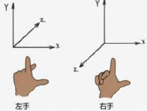

# 什么是3D数学

- 1D：关于计数和度量的数学
  数学上，数轴是个一维的图，整数作为特殊的点均匀地分布在一条线上。数轴是一条规定了原点、方向和单位长度的直线。

- 2D：关于平面的数学

  数学上，相交的两条直线可以确定一个唯一的平面。相交于原点的两条数轴，构成了平面放射坐标系。
  如果两条数轴上的度量单位相等，则称此放射坐标系为笛卡尔坐标系。

- 3D：关于3D空间的数学

  从2D扩展到3D：相对于2D笛卡尔坐标系，我们需要3个轴来表示三维坐标系，一般叫做空间直角坐标系。
  第3个轴一般被称为z轴。一般情况下，3个轴互相垂直。

  在3D中，我们用（x,y,z）来表示一个点。坐标的每个分量分别代表了该点到yz,xz,xy平面的有符号距离。


# 坐标系

## 左手坐标系和右手坐标系


z轴方向的确定有2种方式：左手坐标系与右手坐标系。

- 左手坐标系：伸开左手，大拇指指向X轴正方向，食指指向Y轴正方向，其他三个手指指向Z轴正方向。
- 右手坐标系：伸开右手，大拇指指向X轴正方向，食指指向Y轴正方向，其他三个手指指向Z轴正方向。



- 3D笛卡尔坐标系：右手坐标系
  OpenGL：右手坐标系
  Direct3D：左手坐标系
  Unity3D：左手坐标系（世界坐标系），即+x, +y, +z分别指向右方，上方和前方。


## 世界坐标系（World Coordinate System）

- 全局坐标系是用于描述场景内所有物体位置的方向的基准，也称为世界坐标系。
- 在Unity中创建的物体都是以全局坐标系中的坐标原点（0,0,0），来确定各自的位置的。
- 可以使用transform.position来获取游戏对象的世界坐标。

## 局部坐标系  Local Coordinate System

局部坐标系就是以某个物体为原点的坐标系

- 局部坐标系也称为模型坐标系或物体坐标系。
- 每个物体都有自身独立的物体坐标系。当物体移动或改变方向时，和该物体相关联的坐标系将随之移动或改变向。
- 模型Mesh保存的顶点坐标均为局部坐标系下的坐标。
- transform.localPosition（本地坐标）可以获得物体在父物体的局部坐标系中的位置点。
- 父子关系，子物体以父物体的坐标点为自身的坐标原点。
- 如果该游戏物体没有父物体，那么transform.localPosition获得的依然是该物体在全局坐标系中的坐标。
- 如果该物体有父物体，则获得是在其父物体的局部坐标系中的坐标。
- 检视视图中显示的为localPosition的值。

## 屏幕坐标系  Screen Space

- 屏幕坐标系是建立在屏幕上的二维坐标系。
- 以像素来定义的，屏幕的左下角为（0,0），右上角为（Screen.width, Screen.height），Z值是摄像机世界坐标取反,并且以相机的世界单位来衡量的。
- 鼠标位置坐标属于屏幕坐标，通过Input.mousePosition可以获得该位置的坐标。
  手指触摸屏幕也为屏幕坐标，Input.GetTouch(0).position可以获得单个手指触摸屏幕时手指的坐标。

## 视口坐标系  ViewPort Space

视口坐标系是将Game视图的屏幕坐标系单位化，左下角（0,0），右上角（1,1）。z轴的坐标是相机的世界坐标中z轴坐标的负值。


## 坐标系的转换

### 全局坐标系和局部坐标系


```c#
transform.Translate(translation:Vector3, relativeTo: Space = Space.Self);
```

沿着translation的方向移动|translation|的距离，其结果将应用到relativeTo坐标系中。如果relativeTo为空，则默认为局部坐标系。


```c#
Transform.TransformPoint(Vector3 position) ://将一个坐标点从局部坐标系转换到全局坐标系。
Transform.InverseTransformPoint(Vector3 position)：//将坐标点从全局坐标系转换到局部坐标系。
```


```c#
Transform.TransformDirection(Vector3 direction):将一个方向从局部坐标系转换到全局坐标系。
Transform.InverseTransformDirection(Vector3 direction)：将一个方向从全局坐标系转换到局部坐标系。
Transform.TransformVector(Vector3 vector):将一个向量从局部坐标系转换到全局坐标系。
Transform.InverseTransformVector(Vector3 vector):将一个向量从全局坐标系转换到局部坐标系。
```


Transform.forward, Transform.right, Transform.up：当前物体的物体坐标系的z轴，x轴，y轴在世界坐标系上的指向。**如果Space.World的话，仍然按照自身坐标系移动，不受影响！**

```c#

Vector3.forward ，(0,0,1)的缩写。在transform.Translate()中使用时，如果不表明坐标系，则为物体的局部坐标，即物体自身的正前方。
Vector3.right，(1,0,0)的缩写。
Vector3.up ，(0,1,0)的缩写。

```

参考：https://blog.csdn.net/kaluluosi111/article/details/17206655


### 屏幕坐标系与全局坐标系

Camera.ScreenToWorldPoint(Vector3 position): 将屏幕坐标转换为全局坐标。

```c#
        print(Camera.main.ScreenToWorldPoint(new Vector3(Input.mousePosition.x, Input.mousePosition.y, 100)));
```

注意，如果摄像机z是-10的话，那么转过来之后z会变成90


Camera.WorldToScreenPoint(Vector3 position):将全局坐标转换为屏幕坐标。
Input.mousePosition：获得鼠标在屏幕坐标系中的坐标。


Camera.ScreenToViewportPoint(Vector3 position)：将屏幕坐标转换为视口坐标。
Camera.ViewportToScreenPoint(Vector3 position)：将视口坐标转换为屏幕坐标。


Camera.WorldToViewportPoint(Vector3 position)：将全局坐标转换为视口坐标。
Camera.ViewportToWorldPoint(Vector3 position)：将视口坐标转换为全局坐标。


## 题目

1.一个Cube的Transform信息如下：Position(0,2,5),Rotation(0,0,0),Scale(1,1,1)。它的父物体的Transform信息如下：Position(3,0,0),Rotation(0,90,0),Scale(1,1,1)。请问这个Cube的世界坐标为多少？

(8,2,0)

(0,-90,0)


# 向量

