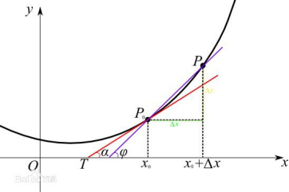

# 极限

在牛顿的年代，计算瞬时速度是一个非常复杂困难的事情，假如给定了路程与时间的函数关系，S=5t² 如何求每一时刻的瞬时速度呢？

我们知道平均速度可以描述一段时间的速度，但假如这段时间非常非常非常小呢？甚至只有1纳秒，是不是就可以把这一纳秒的平均速度当成瞬时速度呢？这个思想能不能实现需要我们去验证，数学和计算机学都是先提出一个思想然后去讨论分析的。

这极小时间的平均速度为 ：

ΔS/ΔT

=[5(t+Δt) ²-5t²]/ Δt

=(10tΔt+5Δt²)/ Δt

=10t+5Δt

=10t

在这个式子的最后，还有一个Δt但是在这个时间极小的情况下，牛顿选择把这个Δt忽略当做0，这个就导致了严重的问题，你先开始把Δt当做分母，说明不为0；你之后又把它当做0，岂不是自相矛盾？

为了解决这个问题，柯西大佬出面来回答了这个问题，他说，其实这个最后还是有一个Δt，但这个值实在是太小了，可以忽略不计，那么怎么去描述呢？

当Δt→0，|ΔS/ΔT﹣10t|的这个结果可以任意小，这两个值可以无限接近。这就引出了一个数学概念——极限。当t→t0，10t0 就是S=5t²的极限。对于极限的定义我们就讲这么多，想看更多的可以参考高数书。

# 一元导数

通过后人的完善，瞬时速度可以描述为下式：
$$
\lim _{x \rightarrow x_{0}} \frac{f\left(x_{0}+\Delta x\right)-f\left(x_{0}\right)}{\Delta x}
$$
有了这个式子，自然而然就想到了去探究其几何意义。

设y=f(x)，那么分子就是纵坐标的差，可以理解为纵坐标的变化量ΔY，分子自然是ΔX。

这时，这个式子的几何意义就很明显了。导数就是方程在某点的斜率，分子为0，方程与x轴垂直，斜率不存在。那么可以推断，当函数是路程与时间的函数时，斜率就是速度。为了方便，将上式描述为：
$$
F^{\prime}(X)=\lim _{x \rightarrow x_{0}} \frac{f\left(x_{0}+\Delta x\right)-f\left(x_{0}\right)}{\Delta x}
$$
导数的由来就是这个了。

接下来简单说一下可导必定连续，连续却不一定可导。理由很简单，x=2，这个方程与x轴垂直，没有斜率，当然没有导数。或者，y=|x|，两边极限不一样，极限不存在，不满足导数的定义。

$p_0$的导数就是这$p_0$个直线在$p_0$处的斜率，但是现在这个ΔX太大了，只有当ΔX足够小的时候，就变成了点$p_0$处的切线，此时就是$p_0$的导数。

#  微分

在导数的基础上，我们可以继续探索。

还记得极限的定义嘛，因为导数就是一个极限，我们当然可以用极限去描述它。
$$
f^{\prime}(x)-\lim _{x \rightarrow x_{0}} \frac{f\left(x_{0}+\Delta x\right)-f\left(x_{0}\right)}{\Delta x}=0
$$
为了方便，我们不妨这么写

# 附录——常用公式

## 重要极限

- $\lim _{x \rightarrow 0} \frac{\sin x}{x}=1$
- $\lim _{x \rightarrow \infty}\left(1+\frac{1}{x}\right)^{x}=e$

## 导数

- $(\arcsin x)^{\prime}=\frac{1}{\sqrt{1-x^{2}}}$
- $(\arccos x)^{\prime}=-\frac{1}{\sqrt{1-x^{2}}}$

## 积分

