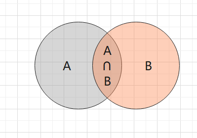

# 例题

## 古典概型

例1：一堆书从左到右或从右向左排列，顺序为1，2，3，4，5的概率

$P=\frac{2}{A_5^5}$ 因为，一堆书随机排列一共有$A_5^5$种排列方式，现在要求只能12345，或者54321，所以分子是2。

例2：4个邮筒两封信，问

（1）前两个邮筒各投入一封的概率

$P=\frac{A_2^2}{4*4}$ 因为两封信都可以随便放，第一次和第二次都有4种可能性。而在前两个邮筒中，2封信一共有$A_2^2$

种排列方式。

（2）第二个邮筒恰有一封

$P=\frac{C_2^1*C_3^1}{4*4}$ 因为，第二个邮筒里面要有一个信，所以先在两封信里面选择一个。之后那个信在三个邮筒里面选择一个。

（3）投入不同的邮筒

$P=\frac{C_4^1*C_3^1}{4*4}$  ，第一封信可以在四个桶里面选，第二个只能在三个里面选。

例3：5个白球，4个黑球，任取三个球

（1）取得2白1黑的概率

$P=\frac{C_5^2*C_4^1}{C_9^3}$

（2）没有黑球的概率

$P=\frac{C_5^3}{C_9^3}$

（3）颜色一样的概率

$P=\frac{C_5^3+C_4^3}{C_9^3}$

例4：a个白球，b个黑球，一共取m个球，问第m个球是白球的概率。

根据抽签原理，不论第几个球，摸到白球的概率都是一样的。所以实际上是求摸到白球的概率也就是$P=\frac{a}{a+b}$

## 几何概型

甲乙约定在一个小时内见面，先到的等对方15分钟，问能成功见面的概率

$\vert y-x \vert \leqslant15$

## 条件概率

有产品100件，90个合格，10个不合格，问第三次才取到合格品的概率

设ABC为第123次取到合格品

$P(\overline{A}\overline{B}C)=P(\overline{A})P(\overline{B}|\overline{A})P(C|\overline {A}\overline{B})=\frac {10}{100} \frac{9}{99} \frac{90}{98}$

首先第一次和第二次没取到，然后第三次取到次品，用乘法公式直接算。

甲厂生产的占60%，乙厂占40%。甲合格率占90%，乙合格率占80%。

设A为甲厂生产的产品，B为合格品

（1）甲厂合格的概率

$P(BA)=P(A)P(B|A)=0.6*0.9$

（2）乙厂生产的合格的概率

$P(\overline{A}B)=P(\overline{A})P(B|\overline{A})=0.4*0.8$

有a个红球，b个黑球。每次摸一个球并放回，然后再放入c个颜色相同的球。问三次都摸到红球的概率

$P(ABC)=P(ABC)=P(A)P(B|A)P(C|AB)=\frac{a}{a+b} \frac{a+c}{a+b+c}\frac{a+2c}{a+b+2c}$

## 全概率

10件产品，

# 概念

## 随机试验与随机事件

确定性：必然，一定发生

随机：偶然，不一定发生，也不一定不发生。

**随机试验：用大写字母E表示**

**①在相同的条件下可以重复。比如抛硬币；**

**②实验结果不止一个；**

**③在做实验前，无法预测是哪个结果**

事件：做实验的一个结果就叫一个事件。

随机事件：某个事件可能发生也可能不发生。

**基本事件：事件不能再分，或相对于实验目的来说不必再分。**

**复合事件：由基本事件复合而成。比如说扔色子点数小于5点这个事件，就是由点数为1，2，3，4这四个事件复合而成的**。

必然事件：每个事件必定发生的事件。就是全集。

不可能事件：一定不发生

以上两个事件并不是随机事件，因为结果已经确定了。

## 样本空间与事件

**样本空间：所有基本事件的集合。**

**样本点：样本空间的元素。**

比如收扔色子，样本空间就是$\Omega={1,2,3,4,5,6}$。

# 公式

## 加法法则

$$
P(A\cup B)=P(A)+P(B)-P(AB) \\
P(A\cup B\cup C)=P(A)+P(B)+P(C)-P(AB)-P(BC)-P(AC)+P(ABC)
$$

## 古典概型

$$
P=\frac{C_M^k C_{N-M}^{n-k}}{C_N^n}
$$

## 条件概率

在A发生的情况下B发生的概率：
$$
P(B|A)=\frac{P(AB)}{P(A)}
$$

这个实际上要这么理解：在A发生后，样本空间就变成了A，然后B发生的概率实际上就是A交B的概率。就是这样。

$$
P(AB)=P(A)P(B|A)
$$

这个实际上就是求AB的交集，AB的交集等于：首先A发生，然后乘上A发生时B发生的概率。

也就是说直接求A中，A和B的交集即可。

换句话说

$P(ABC)=P(A)P(B|A)P(C|AB)$

P(ABC)的概率就是，先A发生，然后A发生后B发生，之后AB发生C发生的概率。

## 伯努利概型

若在n次实验中，事件A正好发生了k次，p为A发生的概率，q为A不发生的概率。那么概率如下：P=C_n^kp^kp^{n-k}

## 全概率公式

1. 若事件两两互斥
2. 所有事件加起来就是全集

## 贝叶斯公式

# 离散型随机变量及其分布

这种概率的随机变量都必须是有限个，或者无限但是可列。比如扔色子就是。

设随机变量X的所有可能值为$x_k(k=1,2...)$，那么$P{X=x_k}=p_k,k=1,2...$

上面这个玩意就叫做**分布律**。

## 二项分布

每次实验后，概率不变时，可以使用这个模型。比如说扔色子，扔到4的概率不论第几次扔都是六分之一。有放回的摸球问题也是一样的，3个红球4个黑球，每次摸到红球的概率都是一样的。如果是不放回的摸球，那么摸到红球的概率就会发生变化，此时就不能用二项分布了。

$$
P(X=k)=C_n^kp^k(1-p)^{n-k}
$$

## 泊松分布

$$
P(X=k)=\frac{\lambda^k}{k!}e^{-\lambda} (k=0,1,2...)
$$

# 连续型随机变量及其概率密度

## 概率密度与分布函数

1. 概率密度就是我们平时看到的函数$f(x)$，代表在x这个点的概率有多大。
2. 分布函数$F(x)$，就是说从$-\infty$积分到x，也就是说$F(x)=\int_{-\infty}^{x}  f(x)dx$
3. 如果想求特定的区间，可以用这个，$P(x_1< X \leq x_2)=F(x_2)-F(x_1)=\int_{x_1}^{x_2}f(x)dx$，原理就是用x2左边的所有面积减x1左边的所有面积，两边重复的刚好被抵消了，剩下的就是x1到x2的。
4. $\int_{-\infty}^{+\infty}  f(x)dx =1$，很容易理解，所有概率相加概率为一。

## 均匀分布

$$
f(x)=\begin{cases}
\frac{1}{b-a},&\text{a<x<b}\\
0,&\text{其他} 
\end{cases}
$$

记作$X\sim U(a,b)$

## 指数分布

  

$$
f(x)=\begin{cases}
\frac{1}{\theta}e^{-\frac{1}{\theta}},&\text{x>0}\\
0,&\text{其他} 
\end{cases}
$$

1. 指数分布有一个非常重要的无记忆性，灯泡在工作100小时后还能亮100小时的概率，和灯泡能亮100小时的概率相等。

## 正态分布

### 一般正态分布

$$
f(x)= \frac {1}{\sqrt{2\pi}\sigma} e^{- \frac{(x-\mu)^2}{2\sigma ^2}} ,-\infty<x<+\infty
$$
记作$X \sim N(\mu,\sigma^2)$。

1. 可以从函数中发现，这玩意是一个偶函数，而且对称轴是$\mu$。
2. 函数的最大值就是e上面最小时，也就是0，e的0次方是1，也就是说函数最大值就是$\frac {1}{\sqrt{2\pi}\sigma}$
3. 由最大值可以看出来，$\sigma$越大，值越小，也就是说$\sigma$越大，函数越胖，越矮。

### 标准正态分布

当$\mu = 0,\sigma = 1$时，我们称X服从标准正态分布。此时，概率密度为：
$$
\phi(x)= \frac {1}{\sqrt{2\pi}} e^{- \frac{t^2}{2}} ,-\infty<x<+\infty
$$

1. 我们用大写的phi来表示其分布函数，也就是$\Phi(x)$。
2. 因为标准正态分布的$\mu=0$，所以关于y轴对称。
3. 因为该函数的密度函数是一个偶函数，所以x轴两边的面积都一样。
4. $\Phi(-x)=1-\Phi(x)$，这个意思是-x左边的面积实际上就是x右边的面积，因为两边是对称的。

### 标准正态分布的转化

可以把任意一个普通的正态分布转化成一个标准正态分布。公式就是把X的值换成$\frac{x-\mu}{\sigma}$

设$X\sim N(1,4)$，求$P( -2 \leq X\leq 2)$。

可以知道$\mu = 1,\sigma = 2$

$P( -2 \leq X\leq 2)=\Phi(\frac{2-\mu}{\sigma})-\Phi(\frac{-2-\mu}{\sigma})　=\Phi(\frac{2-1}{2})-\Phi(\frac{-2-1}{2})$

# 数学期望

## 期望的定义

期望其实反应了平均值

## 数学期望的性质

- $E(C)=C$
- $E(X+C)=E(X)+C$
- $E(CX)=CE(X)$
- $E(kX+b)=kE(X)+b$
- $E(X \pm Y)=E(X) \pm E(Y)$

# 方差

## 方差的定义

两组数据差异很大，但是有可能平均值相等，这时候用期望就不能说明问题了。我们引入方差来说明数据和平均值（期望）的偏离程度。**也就是说方差反应数据的波动**。

我们用D(X)来表示方差。
$$
D(X) = E(X -EX)^2
$$
意思就是说，先算出来每个数据和平均数的差值，然后对这个差值求平均数。

## 方差的推导

核心思想就是把EX当成一个常数。
$$
\begin{equation*}
D(X) = E(X -EX)^2 \\
= E(X^2-2XEX+(EX)^2) \\
= EX^2-2EXEX +E(EX)^2 \\
= EX^2-2(EX)^2 +(EX)^2 \\
= EX^2 - (EX)^2
\end{equation*}
$$

## 方差的性质

- $D(C)=C$      \\\因为常数没有波动
- $D(X+C)=D(X)$   \\\一组数据同时变化了一个C，整体波动还是没有变化
- $D(CX) = C^2D(X)$ \\\一组数据同时加了C倍，大的变的更大了，所以方差就成平方增加
- $若X、Y独立，D(X \pm Y) = D(X)+D(Y) $

# 附录1——常用分布表

| 分布     | 表示                    | 分布列或分布密度             | 期望                | 方差                  |
| -------- | ----------------------- | ---------------------------- | ------------------- | --------------------- |
| 二项分布 | $X\sim B(n,p)$          | $P(X=k)=C_n^kp^k(1-p)^{n-k}$ | $np$                | $np(1-p)$             |
| 泊松分布 | $X\sim P(\lambda)$      | $$                           | $\lambda$           | $\lambda$             |
| 均匀分布 | $X\sim U(a,b)$          | $$                           | $\frac{a+b}{2}$     | $\frac{(b-a)^2}{12}$  |
| 指数分布 | $X\sim E(\lambda)$      | $$                           | $\frac{1}{\lambda}$ | $\frac{1}{\lambda^2}$ |
| 正态分布 | $X\sim N(\mu,\sigma^2)$ | $$                           | $\mu$               | $\sigma^2$            |

