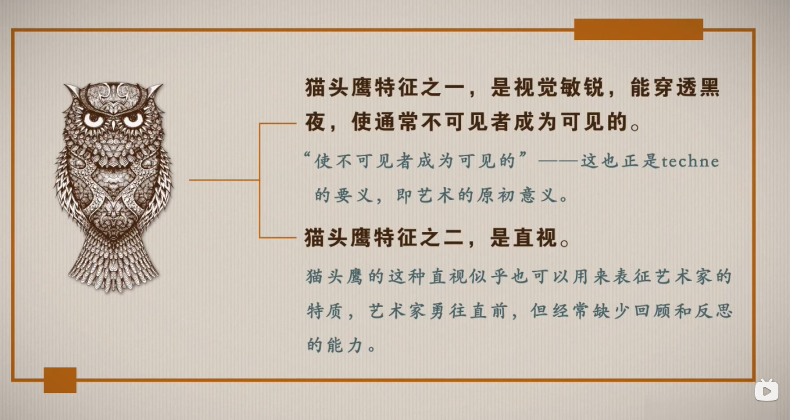
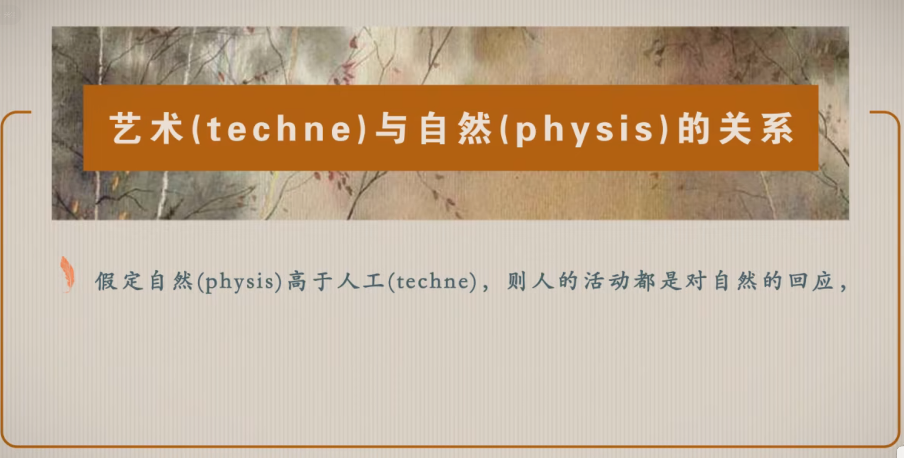
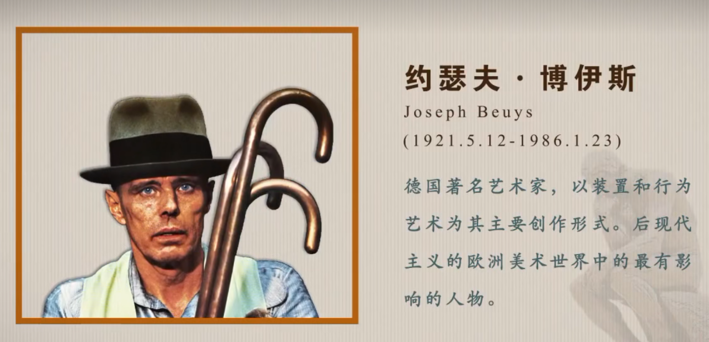

1. 游戏的基础知识
   1. 引擎
   2. 厂商
   3. 分类
   4. 发展史
2. RPG maker MV基础

# 游戏引擎

| 引擎名       | 原名                  | 开发语言                      | 收费   | 代表作                                                       |
| ------------ | --------------------- | ----------------------------- | ------ | ------------------------------------------------------------ |
| 虚幻         | Unreal Engine         | C++、蓝图                     |        | 《虚幻竞技场》、《战争机器》、《质量效应》、《生化奇兵》、《八方旅人》 |
|              | Unity                 | C#                            |        | 《明日方舟》《王者荣耀》《极乐迪斯科》《崩坏3》《马里奥赛车》《纪念碑谷》 |
|              | Cocos                 | Lua 、JavaScript              | 开源   | 《保卫萝卜》《欢乐斗地主》《暖暖环游世界》《传奇霸业》       |
|              | NScripter             |                               |        | 《月姫》《寒蝉鸣泣之时》《水仙》                             |
|              | GameMaker:Studio      | The Game Maker Language (GML) | 收费   | 《undertale》                                                |
| 游戏制作大师 | RPG Maker MV          | JavaScript                    | 204    | 《烟火》《魔女之家》《去月球》《杀戮天使》                   |
| 寒霜         | Frostbite Engine      |                               | 未开放 | 《战地》系列、《极品飞车》系列                               |
| 雷神之锤     | Quake Engine和ID Tech |                               |        | 《雷神之锤》、《重返德军总部》系列、《DOOM》系列             |
| 起源         | Source Engine         |                               | 开源   | 《half life》系列、《CS》系列、《传送门》系列、《求生之路》系列 |
| 雷霆         | RAGE Engine           |                               |        | 《GTA5》、《马克思·佩恩3》、《黑色洛城》、《荒野大镖客》系列 |
|              | cry engine            |                               |        | 《孤岛危机》系列                                             |

# 游戏厂商

- 重返德军总部
- 雷神之锤
- half life：电影化

| 厂商       | 原名                   | 国家 | 代表作                                                       |
| ---------- | ---------------------- | ---- | ------------------------------------------------------------ |
| 任天堂     | Nintendo               | 日本 | 《超级马里奥》系列、《塞尔达传说》系列、《宝可梦》系列       |
| 索尼       | Sony                   | 日本 | 《血源诅咒》、《战神》系列、《最后生还者2》                  |
| 微软       | Microsoft Game Studios | 美国 | 《光环》系列、《上古卷轴》系列、《耻辱》、《辐射》系列、《微软模拟飞行》、《帝国时代》系列 |
| 世嘉       |                        | 日本 | 《索尼克》系列、《猎天使魔女》系列、《如龙》系列             |
| 光荣特库摩 |                        | 日本 | 《无双》系列、《死或生》系列                                 |
| 万代南梦宫 |                        | 日本 | 《嗜血代码》、《太鼓达人》系列、《破晓传说》、《铁拳》系列。《刀剑神域》 |
| v社        | Valve                  | 美国 | 《反恐精英》系列、《半衰期》系列、《传送门》系列             |
| 动视暴雪   | Activision Blizzard    | 美国 | 《暗黑破坏神》系列、《魔兽争霸》系列、《星际争霸》系列       |
| 蠢驴       | CD Projekt             | 波兰 | 《赛博朋克2077》、《巫师》系列                               |
|            | Rockstar Games         | 美国 | 《GTA》系列、《荒野大嫖客》系列                              |
| 宝开       | PopCap Games           | 美国 | 《宝石迷阵》系列、《植物大战僵尸》系列、《祖玛》系列         |
| 卡普空     | CAPCOM                 | 日本 | 《鬼泣》《逆转裁判》《怪物猎人》《生化危机》                 |
| 科乐美     | KONAMI                 | 日本 | 《寂静岭》《合金装备》《实况足球》                           |
| i社        | illusion               | 日本 | 《AI少女》、《Play Home》、《电车之狼》                      |

# 游戏设计的维度

游戏可以被拆解为三个维度：

1. media：指的是游戏的具体表现
2. gameplay：游戏的核心玩法和核心机制
3. aesthetic：游戏的审美活动

我们可以举一个例子来阐述游戏设计。

一切的游戏设计都不能离开自然（physis），这里是自然并不是指大自然（environment），而是指天然存在的事务。我们所创造的游戏，实际上本质是对自然的一种模仿，我们模仿的结果就形成了艺术（techne）。

而对techne的不同形式的加工，会形成不同种类的艺术。

而游戏

# 游戏的定义

# media设计

# 文学理论

理论和常识的区别，

理论来自于反思，而常识来源于经验。

但是常识不能解决经验之外的东西。所以游戏设计理论，可以突破游戏的传统尝试，开发出新的游戏机制

游戏评论和文学评论都是一样的

艺术定义非常难，因为一旦有人下了定义，就会有艺术家打破这种定义，使其成为新的艺术。

在经验中游戏可以被定义，但是在理论中不可定义

属加种差

**文学四要素：世界、作家、作品和读者。**

文学四要素文学四要素是美国学者艾布拉姆提出的,他提出文学是一种活动,由四个相关的 要素组成,即世界、作者、作品和读者,四者共同构成文学活动。

一切文学作品都有源泉，这就是生活，即“世界”；生活要经过“艺术家”的加工改造，这样才能创造出具有意义的文本，即“作品”；作品如果束之高阁，不跟读者、即“欣赏者”见面，也还不能构成完整的文学活动。

世界——作家——文本——读者这四个要素，其间包含了体验、创作、接受三个过程，这才构成完整的文学活动；文学活动不仅是指文学四要素所形成的流程，更重要的是人与对象所建立的诗意关系，是人的本质力量的全部展开。

下定义是很困难的，

本质主义和反本质主义

反本质主义容易变成虚无主义

文学不能定义，但是我们可以描述一个文学作品的文学性

我能不能等同于作者？

不可以

文学是具有伪陈述的

伪陈述

文学事件

# 艺术学原理

策划：设计理论？叙事先行？机制先行？

具体流程，

艺术的原初意义

艺术的感官并不是独立的，而是统一的。没有单独存在的感官。

视觉艺术和音乐艺术本质是一样的。艺术应该是同感艺术。没有孤立的感觉。

视觉优先（西方艺术）
