# 相机的参数

- 快门时间 S

  快门速度越快，进光量越小，画面越暗。

  快门速度越慢，进光量越多，画面越亮。

  一般来说，手持相机时快门速度不可以过慢。因为人类都会手抖，快门太慢就会糊。
  
  所以说快门速度有一个最低值，这个值就是==安全快门==。安全快门的经验值是1分之焦距。比如焦距是100mm，安全快门大概就是1/100。

- 光圈 F

  既可以控制画面的亮度，也可以控制景深

  大光圈的话背景会很虚，也就是小景深，进光量大。

  通常用f加数字来描述光圈，**数字越大，光圈越小**。

- 感光度 ISO

  ISO越低，感光度越低，画面越暗

  ISO越高，感光度越高，画面越亮。如果ISO开的过大，会出现噪点，也就是颗粒感。

  一般来说ISO都会设置在100到800之间

- 白平衡ｋ

  控制画面的冷暖

  K越低，画面越冷；K越高，画面越暖

- 焦距

  焦距越大，所能看的就越远。

**半按快门，选取焦点**

- 景深：景深就是影像前后的清晰范围。景深分为前景深和后景深，
  当镜头对有限远的物体调焦时，后景深大于前景深。

  影响景深的是**焦距，光圈和拍摄主体的距离**

- 视场角：焦距越长，视场角越小

广角镜头有很好的透视效果

# 构图

## 点构图

### 中心点构图

就是把画面主体放到中心，可以强调画面的主题。

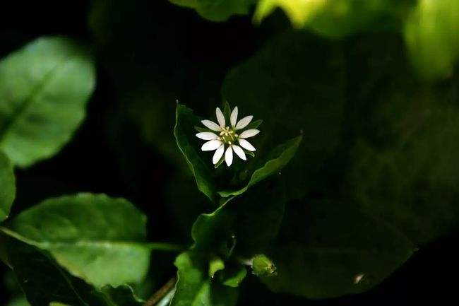

### 三分点构图（九宫格构图）

就是把画面水平和垂直都分三份，这样就就会有4个交点。把画面的主体放于这四个点上，就是三分点构图了。

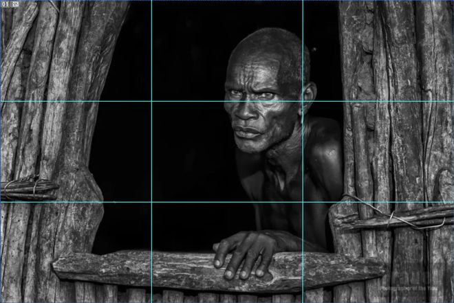

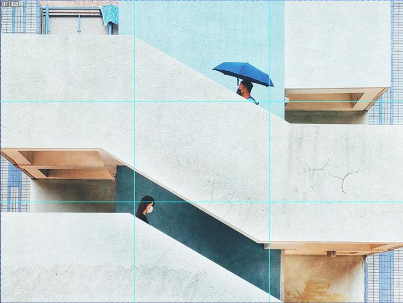

## 线构图

### 对称线构图

指沿着画面的水平居中线或者垂直居中线来构图。

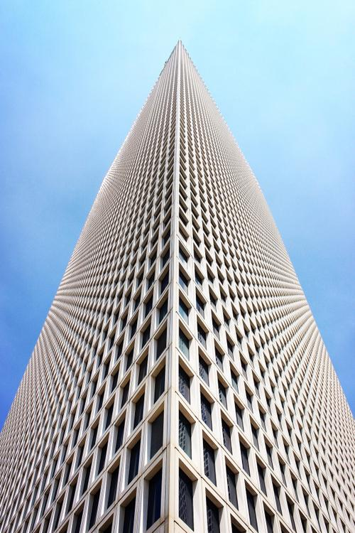

### 三分线构图

顾名思义，就是把三分点都连起来，然后选取其中某条线进行构图。因为上下左右都可以选择，所以构图非常灵活。

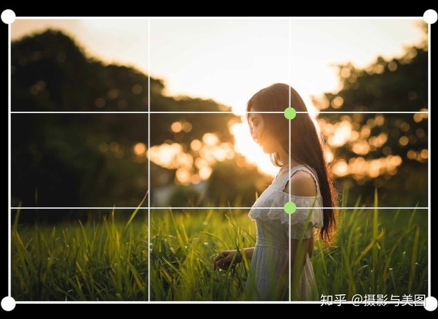

### 对角线构图

可以产生动感

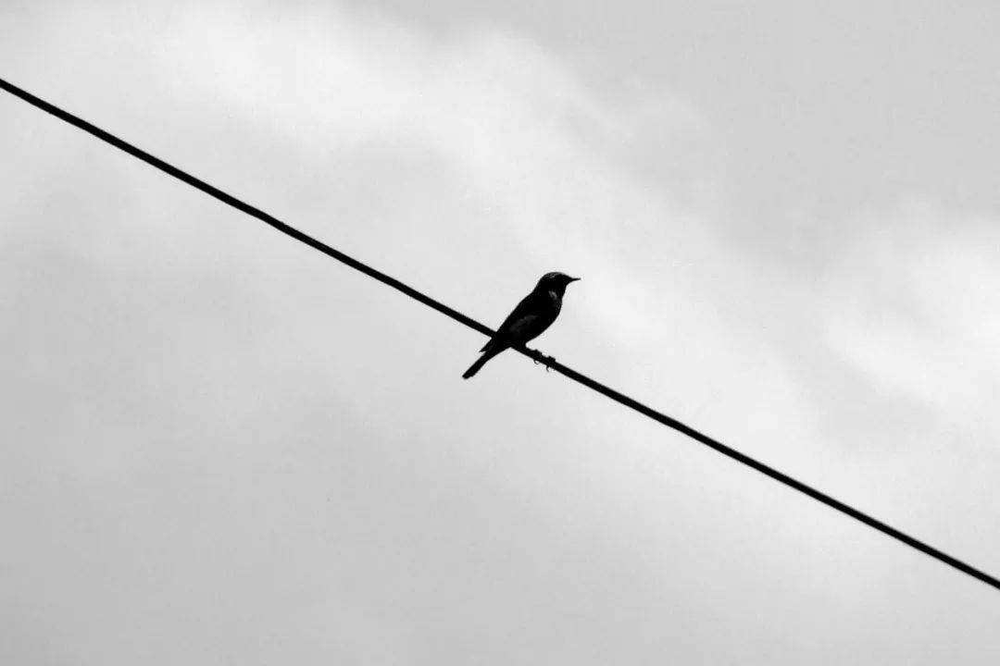

### 曲线构图

可以自己选择曲线，进行构图。

适用于画面中有河流等曲线的场景。

### 引导线构图

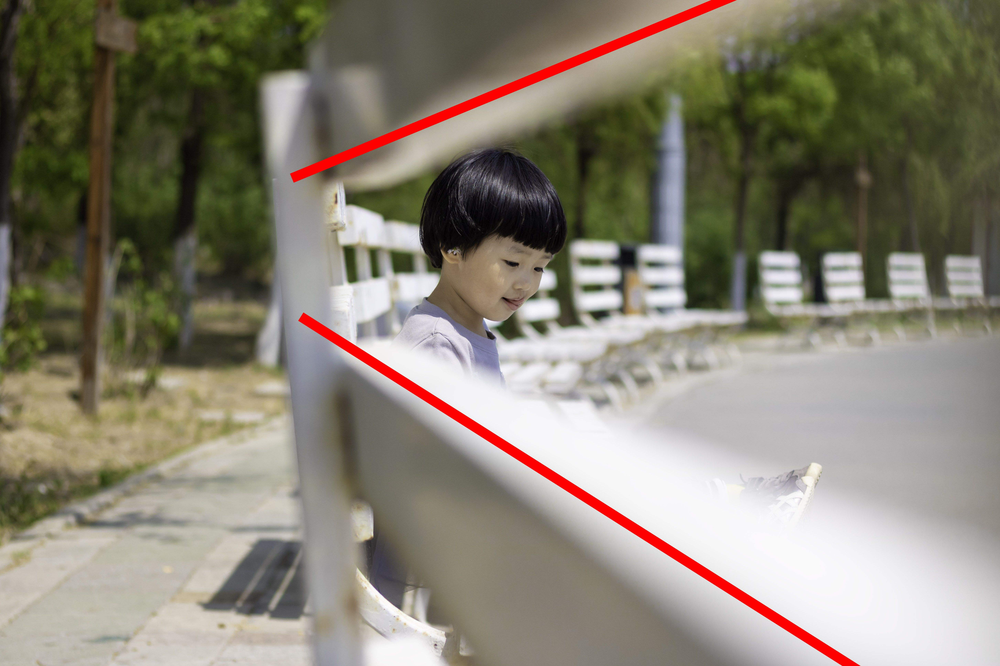

## 面构图

### 前景构图

所谓的前景就是给画面前面蒙上一层画面，但是主要的内容却是后面的。

在镜头前用树叶遮挡之类的操作，都是前景构图。

### 框架构图

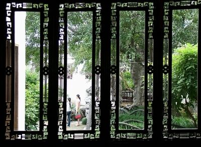

### 填充构图

### 留白构图

主体之外的地方大面积留白

所谓的==空白==，并不一定真的是白色，只要是场景单一，色调相近的都可以是空白。

除了在构图中使用，在拍摄运动物体时，也尽量要给前方留白。这样运动时才不至于一下子冲出拍摄范围。

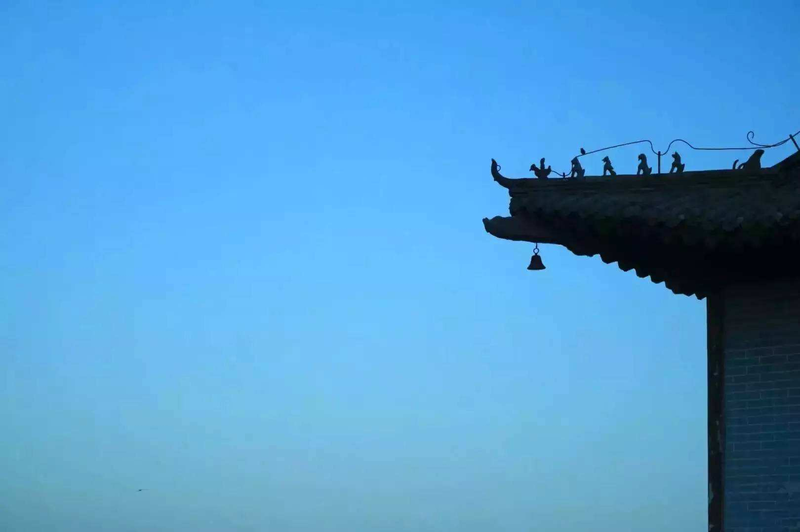

### 重复构图

### 对比构图

# 分镜头稿本

| 镜号 | 机号 | 景别 | 技巧 | 画面 | 解说 | 音乐 | 效果 | 时间 | 备注 |
| ---- | ---- | ---- | ---- | ---- | ---- | ---- | ---- | ---- | ---- |
|      |      |      |      |      |      |      |      |      |      |
|      |      |      |      |      |      |      |      |      |      |
|      |      |      |      |      |      |      |      |      |      |

- 镜号：镜头顺序号

- 机号：摄影机的机号，如果只有一台机子，那么没有实际意义

- 景别：常用的有**远景、全景、近景、中景、特写**等。

- 技巧：包括摄影技巧和组接技巧

  常用的摄影角度有：平、仰、俯。

  运动镜头有：推拉摇移跟

- 画面：画面的内容

- 解说：电视节目的解说词

- 音乐：BGM

- 效果：BGS，SE和ME

- 时间：镜头所占用的时间

- 备注：

# 三点布光

- **主体光**：照亮主体的光。主要的明暗关系由主体光决定，包括投影的方向。

  主光灯在15度到30度的位置上，称==顺光==；在45度到90度的位置上，称为==侧光==；在90度到120度的位置上成为==侧逆光==

- **辅助光**：又称为补光，一般在主光源的另一侧进行照射，亮度通常只有主体光的50%-80%。

- **轮廓光**：又称背光，轮廓光的作用是将主体与背景分离。一般都是用反光板，将光源反射到人物的头发和衣服。以便将人物和背景区分。

# 电影

## 镜头表达

快速镜头用大光圈，慢速用小光圈

室内人像要对焦眼睛，使用M档对光圈和快门速度进行细条

城市夜景ISO要调低M档较小的光圈，曝光时间长

运动人像：低快门速度，大光圈

# 画面的组成要素

- **主体**：画面中所要表现的主要对象，一定要鲜明突出

  影响主体的因素：:one: 主体自身的内容	:two:主体的位置	:three:主体所占面积

- **陪体**：陪体是与主体密切相关并能构成情节的画面部分，主要用于烘托主体

  有了陪体，视觉语言会准确生动很多

- **前景**：前景位于主体前面

  可以加强画面的感染力与空间感

- **背景**：背景位于主体后面，强调主体所处的环境

  选择背景的时候:one:   需要具有特征 :two:力求简洁	:three:要有色调对比

  

# 运动镜头

动态构图是用静止或运动镜头拍摄相对运动或静止的拍摄对象

常用的手法有：**推、拉、摇、移、跟、升、降、甩**

| 镜头表达 | 说明               | 功能                                                         |
| -------- | ------------------ | ------------------------------------------------------------ |
| 推镜头   | 镜头不断推进主体   | 1. 视觉模拟：模拟人眼的效果。  2. 核心突出：不断推进某个人物，展示特写。 3. 环境说明：说明影片的环境，突出影片发生的场景。 |
| 拉镜头   | 镜头不断远离主体   | 1. 孤立感营造。 2. 元素添加：随着镜头的远离，不断有更多物品进入视野，可以补充说明角色的位置关系。 |
| 摇镜头   | 镜头不断摇动       | 1. 交流对话：镜头不断在两个对话人之间摇动。                  |
| 跟镜头   | 镜头跟随主体移动   | 1. 尾随跟从：急速跟随主体移动，营造紧张感 2. 迟缓恐惧：缓慢跟随主体，塑造压抑的气氛，恐怖片多用 |
| 移镜头   | 以水平方式移动镜头 | 1. 速度感：快速移动镜头，画面急速变化，营造速度感 2. 人物引见：跟随主要角色，可以介绍人物 |
| 升降镜头 | 上下移动镜头       | 1. 情绪波动：随着镜头上升，观众可以强烈感受到情绪波动 2. 交代人物退场 |

## 拍摄规范

**稳**：不要左右、上下乱晃手机。乱晃会造成照片里的人或

景物是虚的，看不清楚，所以要拿稳手机

**准**：所拍摄的人或景物对焦、取景、构图以及起幅、落幅

都要准确、到位。对焦准确。准是最核心的原则

**平**：就是像端一碗水一样，要把相机端得与水一样平

**匀**：运动镜头的速度要均匀，不能忽快忽慢

**清**：所拍摄的视频要清楚，不能模糊、不能灰暗

## 轴线规则

在表现被摄物体的运动或被摄物体相互位置关系以及进行摄像机镜头调度时，为了保证被摄对象在电视画面空间中相对稳定的位置关系和同样的运动方向，应该在轴线的一-侧区域内设置机位、安排运动，这就是轴线原则。

越轴：越轴是指摄像机拍摄过程中越过了关系轴线或运动轴线，到轴线的另一侧进行拍摄

越轴的客服方法：

1. 利用运动镜头自己移动到另一个轴线那里
2. 借助主体自身移动
3. 在中间间隔一个特写镜头
4. 利用淡出，淡入等特效

# 相机摄影模式的运用

人像模式拍摄近景比较好，人像模式拍摄的人物清晰，背景模糊

夜景模式：快门速度较慢，需要使用三脚架

微距模式：拍摄尺寸较小的物体，变焦距调制W端，需要仔细调焦

动态模式：拍摄高速运动的物体

慢速快门模式：可以把移动的物体拍摄的很模糊，适合拍摄瀑布

辅助拼接模式：通过对场景的多次拍摄，然后把照片拼接到一起

短片模式：可以拍摄一小段录像

**光圈优先模式是为了控制景深**：大光圈->小景深（虚化背景，突出主体）

# 影调

影调实际上就是值灰度的分布

如果把一个图像进行灰度处理。

如果该图像的像素大部分为低灰度，那么就是==低调==。否则是==高调==或者==中调==。

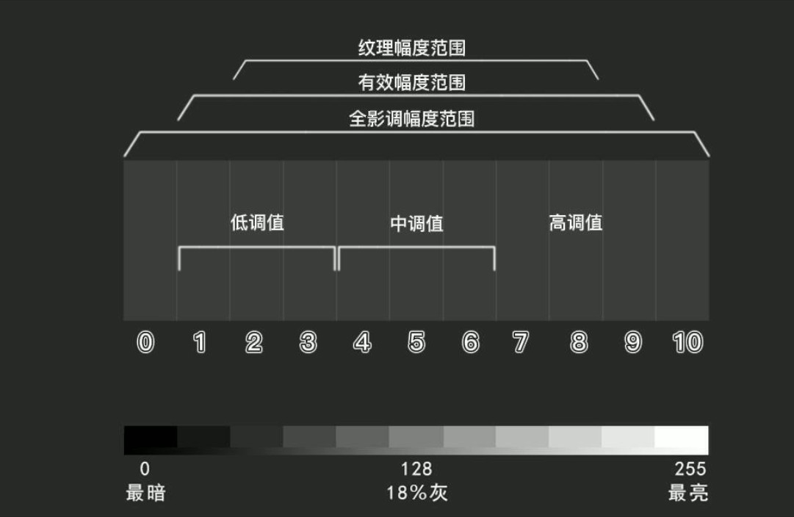

而根据图像中的像素分布也可以来分类，如果像素覆盖的灰度值高，那么就是长调。如果像素基本上都是一个颜色，那么在直方图中就基本上只有很少的灰度，这个就是短调。

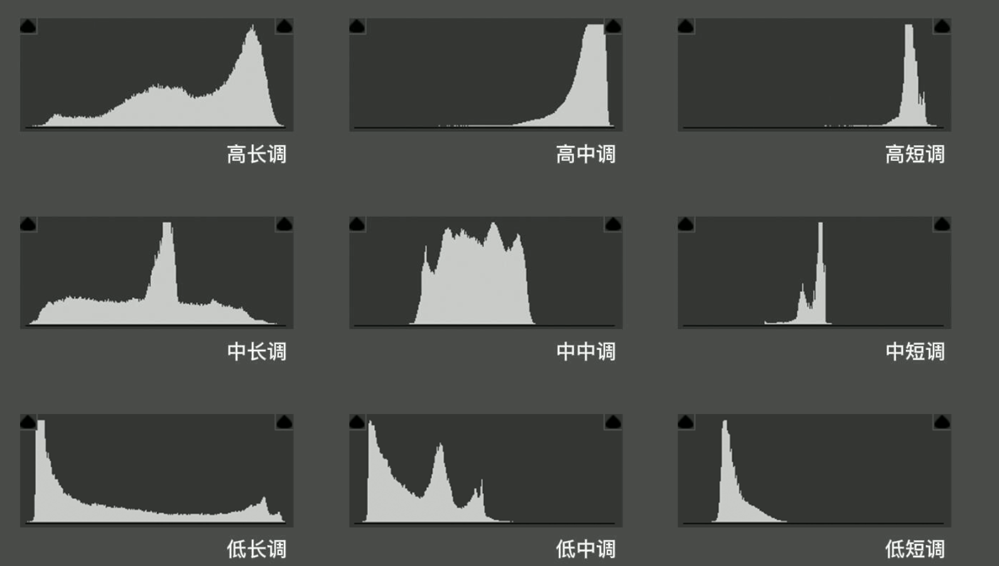

# 逆光摄影

- 第一、能够增强被摄体的质感

  特别是拍摄透明或半透明的物体，如花卉、植物枝叶等，逆光为最佳光线。因为，一方面逆光照射使透光物体的色明度和饱合度都能得到提高，使顺光光照下平淡无味的透明或半透明物体呈现出美丽的光泽和较好的透明感，平添了透射增艳的效果；另一方面，使同一画面中的透光物体与不透光物体之间亮度差明显拉大，明暗相对，大大增强了画面的艺术效果。

- 第二，能够增强氛围的渲染性

- 第三、能够增强视觉的冲击力

- 第四，能够增强画面的纵深感
