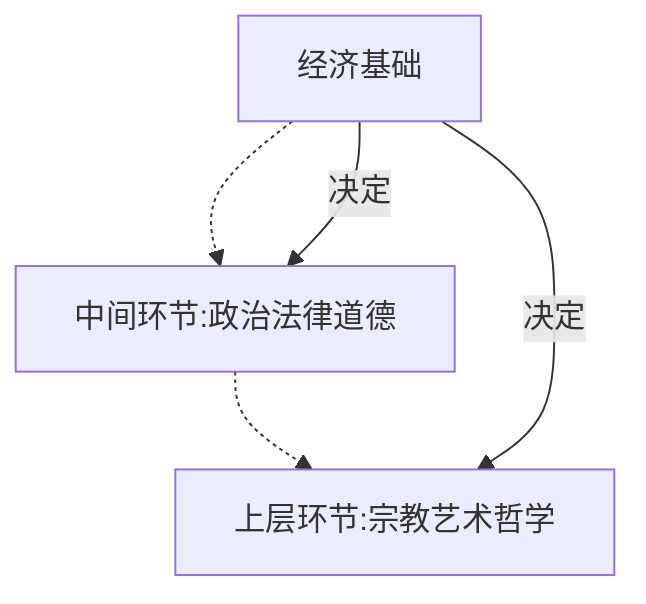
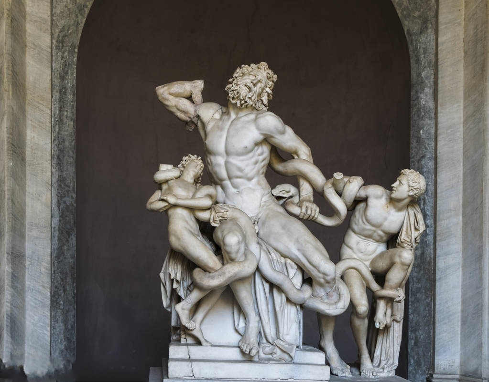
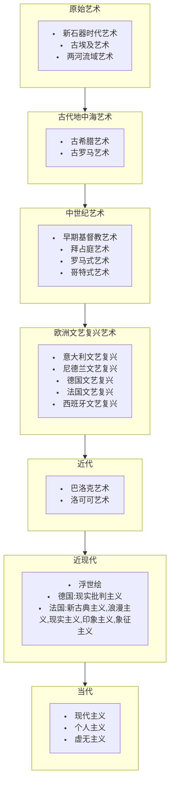
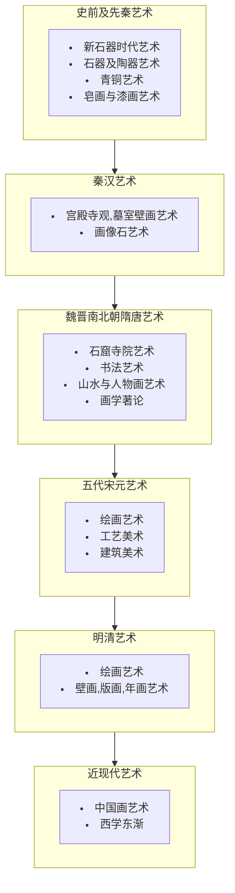
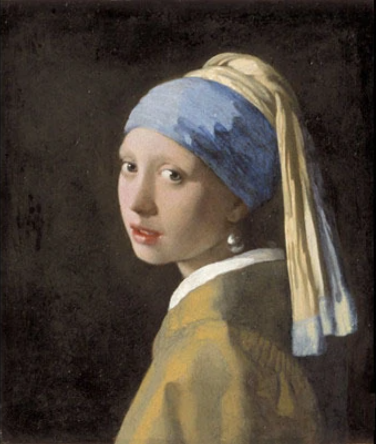
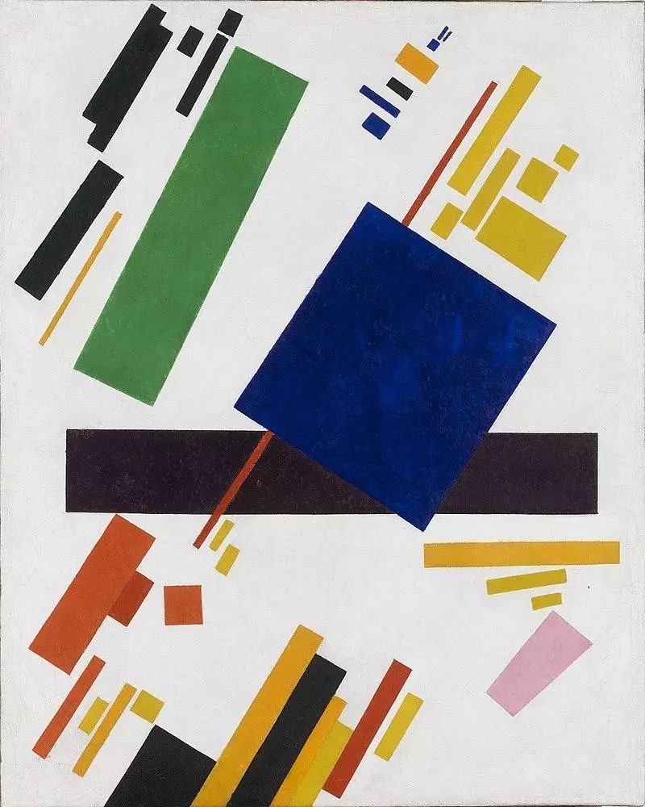

# 艺术的本质

## 艺术存在的位置

## 艺术是怎么被认识的？

- 艺术是对世界的一种认识
- 艺术用形象反映世界
- 艺术反映世界的真实性

个人认为，艺术是一种人生来就存在，自然而然产生的东西，那就是艺术实际上是对美的追求。但是在早期，艺术的表达往往都是比较抽象的，比如说图腾之类的。它是作为一种功能性的存在，是为了达成某种目的存在的。但是在中世纪之后，艺术应该是作为一门技术的，比如画人像之类的。只是相比于其他的技术更具有美。而在照相机发明之后，艺术不需要写实了，因为照相机更加写实。所以之后艺术渐渐的更加抽象。也就是更加反映艺术家对世界的理解。

## 艺术与审美的关系是什么

- 艺术反映现实美
- 艺术创造艺术美
- 艺术是审美对象

# 艺术的分类

德国*黑格尔*在《美学》中提出了艺术的分类。他认为在艺术理想的发展过程中，理念和形象两个因素会有三种关系；**形象压倒理念**，**理念与形象完全符合**，**理念压倒形象**。由此形成分别出现在人类历史不同发展阶段的三种不同艺术类型。

- 象征型艺术：“形象在于理念本身”

  意思是理念决定了艺术的形象。艺术家的艺术作品都是服务于宗教或政治思想。

  代表的艺术为埃及、印度等东方艺术

  

  

  
步辇图

  可以看到步辇图的人物大小比例没有依照透视关系，而是谁的地位高谁就画的大。

  

- 古典型艺术：“理念和形象形成自由而完美的协调”

  代表作为古希腊的雕刻艺术

  

  
拉奥孔

- 浪漫型艺术：“在较高的阶段上回到象征型艺术所没有客服的理念与现实的差异和对立”

  这种艺术更重视理念的表达。这种艺术的*理念超越形象*、*精神压倒物质*、是强烈表现了人的主观精神的一种艺术类型。这种艺术的基本特点是“绝对的主观性”和“绝对的内在性”，是精神对物质的胜利。

  代表艺术为基督教艺术、西方现代艺术、莎士比亚文学

# 艺术发展史

## 西方美术史

## 中国美术史

# 名画

## 戴珍珠耳环的少女

约翰内斯维米尔

## 绝对主义的创作

马列维奇

## 内战的预感

达利

## 自由引导人民

## 神奈川冲浪里

