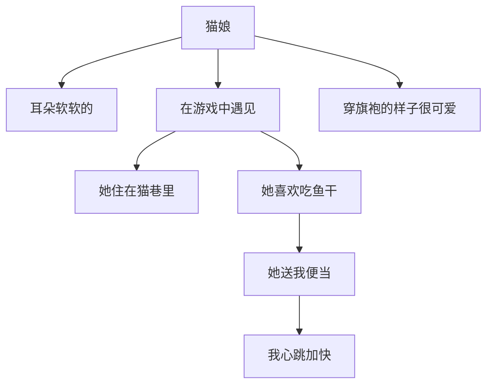
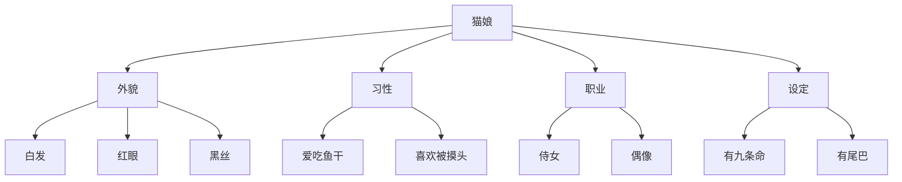
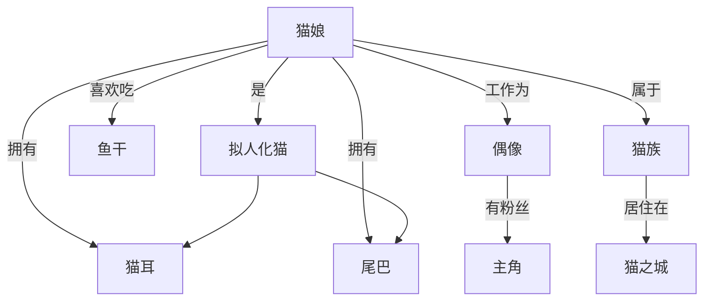

1. 立项：项目规划，项目设计
2. 设计
3. 原型制作
4. 测试原型
5. QA

# A/B Test

5

# AEIOU 研究法

**AEIOU 是一种非常经典的质性观察与行为研究框架**，主要用于帮助研究者系统地观察和记录用户在现实环境中的行为，特别是在**服务设计、体验设计、用户研究、场景调查**中非常好用喵！

|字母|含义|解释|
|---|---|---|
|**A**|Activities（活动）|人们在做什么？他们的目标是什么？行动路径如何？|
|**E**|Environments（环境）|他们所处的空间、场所是什么样？有什么特点？|
|**I**|Interactions（互动）|人与人、人与物、人与系统之间发生了哪些交互？|
|**O**|Objects（物品）|使用了哪些工具或道具？它们怎么被使用？|
|**U**|Users（使用者）|谁在做这些事？他们的身份、角色、需求、情绪是什么？|

假设你要研究玩家在网吧里玩猫娘游戏的真实行为，你去网吧蹲点观察，按照 AEIOU 框架记录：

|维度|示例记录|
|---|---|
|**A - 活动**|玩家打开Steam，调音量，登陆账号，进入猫娘游戏，开始换装与对话|
|**E - 环境**|嘈杂、有耳机、有朋友围观、座位狭窄，光线偏暗|
|**I - 互动**|玩家跟猫娘说话（语音识别）、点选选项、和朋友讨论“你选谁？”|
|**O - 物品**|鼠标、键盘、耳机、饮料放在键盘边，手机边看攻略边玩|
|**U - 使用者**|年龄18-25、男生为主、喜欢美少女、目标是放松、社交分享|

# 亲和图（KJ法）

亲和图（Affinity Diagram）是一种**用于整理复杂信息、发现内在关联并形成结构化认知的可视化工具**，常用于团队协作中的问题分析、创意整理或需求梳理。它通过将零散的观点、数据或想法按 “亲和性”（相似性、关联性）分组，帮助从混乱信息中提炼逻辑框架。

# 身体风暴（Bodystorming）

3

身体风暴是一种将构思过程带入真实或模拟情境中的方法，通过亲身扮演用户、在场景中移动、交互和表演，来探索用户体验、服务流程或空间布局等问题。

# 认知图（Cognitive Map ） 

2 3

**认知图**是**人脑内部如何组织信息的外部可视化表示**。它不是简单的图表，而是**模拟人们如何感知、理解、记忆和思考某个事物或环境**的工具。

重点强调流程、强调**个体感知**、记忆和心理过程的可视化。

模拟一个玩家对“猫娘”在世界观中的主观认知：以经验、空间、情绪为主

# 思维导图（Mind Map）

思维导图底层逻辑是从一个中心主题出发，

用于组织创意、想法、笔记等，强调联想与发散思维。

# 概念图（Concept Map）

一种**网络状**结构，表达**概念之间的逻辑关系**，强调上下位、因果、时间等连接。

- 概念图的节点都是名词，连接都是动词

https://xmind.app/cn/blog/how-to-use-cognitive-map/

# 卡诺分析（**Kano Model**）

- 产品的功能并不是越多越好，功能是有优先级的
- 功能可以根据属性分为5种

|类别|描述|做到的结果|没做到的结果|
|---|---|---|---|
|**基本型（Must-be）**|用户理所当然期望的基本需求|不会增加满意度|会大大降低满意度喵！|
|**期望型（One-dimensional）**|用户明确想要，越好越满意|满意度上升|满意度下降|
|**魅力型（Attractive）**|用户未预期但带来惊喜|满意度大大提升喵♡|没有也不会不满意|
|**无差异型（Indifferent）**|用户不在意的功能|不影响满意度|同上|
|**反向型（Reverse）**|用户不喜欢的“功能”|做到反而会让用户不满喵…|没有反而更好|

猫娘养成游戏

|功能|类型|说明|
|---|---|---|
|存档系统|基本型|用户默认就应该有|
|多种服装更换|期望型|越丰富越开心喵|
|猫娘会在你上线时主动喵喵撒娇|魅力型|超级加分！但没也不会扣分|
|设置按钮是否为圆角|无差异型|很多人根本不会在意|
|强制联网|反向型|很多玩家反感强联网机制|

评估每个产品的属性或特征时,要先写下两 个问题(一组问题):第一,如果具备这种 产品属性顾客会觉得怎么样;第二,如果没 有这种产品属性顾客会觉得怎么样。

问题1:如果酒店的Wi-Fi是免费的,你觉得怎么样?
问题2:如果酒店的Wi-Fi不是免费的,你觉得怎么样?
对于每个问题,客户要从以下三种反应中选择一种:“满意”、“没有区别”或“不满意”。
一旦收集了每个问题的客户反应,就要按照图2对每一组问题进行交叉对比,确定每种
功能对应的卡诺产品属性类别。对每一组问题都重复这个过程。

![[image.png]]

# 故事板（Storyboard）

前期的方法，

田野调查->发现问题->问题优先级排序->绘制故事板

最早起源于电影的分镜

> 故事板是一组**按时间顺序排列的图像或草图**，用来描述一个故事、流程或用户体验的**视觉脚本**喵！

每一张图就像是漫画分镜，一格格地展示**发生了什么、角色在干嘛、场景是啥、旁白或对话是啥**喵。

说白了就是图胜于表，表胜于文

太好了，是我最爱的策划原型案

# 时间感知研究（Time-aware Research）

用户研究方法

比传统实验更**真实、即时、贴近用户生活状态**的研究方式

实际上就是埋点

> **在用户准备“自然地”完成某个任务的那一刻，研究者及时介入或观察他们的真实行为。**

不像传统实验是“提前约你、安排场地”，而是**用户自己要做某件事的时候，我们就出现！**喵~

假设你正在开发一款“猫娘养成模拟游戏”，你想了解玩家在**第一次进入主线剧情**时的真实行为和反应，那我们可以这样设计时间感知研究喵！

|测试类型|举例|特点|
|---|---|---|
|🧪 传统测试|请玩家到工作室，安排一台设备让他玩1小时|人为安排、受控、但不一定真实|
|⏰ 时间感知研究|玩家第一次进入主线剧情前3分钟，自动触发后台记录与屏幕共享|自然、真实、靠近玩家生活状态喵！|

# 有声思维法（Think aloud protocol/TAP）

🧠 为什么它有用？

因为你不仅能看到用户**点了什么**，还可以知道**他们为什么这么点**。

> 📺 比如在做猫娘游戏UI测试时，玩家一边操作一边说：
> 
> - “这个按钮颜色有点奇怪……是不是点这里？”
>     
> - “我点这个是因为我以为它是‘返回’，结果不是喵！”
>     

这些“说出来的想法”才是设计师真正需要挖掘的**用户心智模型**喵！

基本上就是全程开口的playtest

# 三角比较法（Triading）

专门用来深入探索人们**内心的判断标准、认知逻辑和情绪偏好**的

1. 研究者提供一组刺激物（6～10个左右），让参与者**自由组合出他们认为相关的三个项目**，然后讨论它们的异同。
2. 研究者找出其中两个，并询问与第三个有什么异同

给出10个猫娘角色图鉴卡（含设定、立绘、语音等）
问参与者：“从这10个角色里，选出你觉得三个之间有点可比性的角色”
然后再问：
“你觉得A和B 与C之间有什么区别，为什么？”
然后记录他们用的关键词（如“冷淡”、“傲娇”、“亲人”、“治愈”等）
重复不同参与者的选择与描述，整理出核心构建维度喵！

# 价值机会分析（Value Opportunity Analysis/VOA）

> **VOA 是一种帮助设计师评估产品是否在“用户重视的核心价值维度”上表现良好**的方法喵！

它的核心思想是：  
✅ 用户在意的不只是功能能不能用，而是产品**能不能带来他们想要的“体验价值”**喵！

VOA 的 7 个核心“价值维度”喵：

|核心价值机会|示例属性|含义|
|---|---|---|
|❤️ **情感**|冒险、独立、安全、性感、自信、权利|产品能否引发内心情绪、满足情感需求|
|🎨 **美学**|视觉、听觉、触觉、嗅觉、味觉|产品感官体验是否愉悦、美丽|
|🪪 **身份**|时间点、地方感、个性|产品是否帮助用户**表达“我是谁”**|
|🌍 **影响**|社会的、环境的|产品是否有社会责任感或环保价值|
|🪑 **人体工程学**|舒适性、安全性、易用性|产品是否与身体匹配、使用自然|
|🛠 **核心技术**|可靠的、能用的|技术是否稳定、效率高|
|🏗 **质量**|工艺、耐用性|材质、加工、寿命是否过关|

# 幕后模拟（Wizard of Oz）

**做游戏原型的**

**“幕后模拟”就是让用户以为他们在和一个真实的系统互动，  但实际上系统的响应是由**幕后的人类（研究人员）**控制的喵！**

你正在做一款猫娘AI语音互动游戏，但AI语义识别模块还没完成。
你可以用幕后模拟的方式测试：
> 玩家对猫娘说话 → 实际由你或研究员快速输入/点击回复 → 玩家以为猫娘“真的听懂了”

玩家可能会说：

> “猫娘你今天好吗？”

然后你在后台立刻输入：

> “今天喵娘也超级开心～想要蹭蹭你呢喵♡”

这就形成了**“假的语音AI交互”，但体验上就像真的一样**喵！